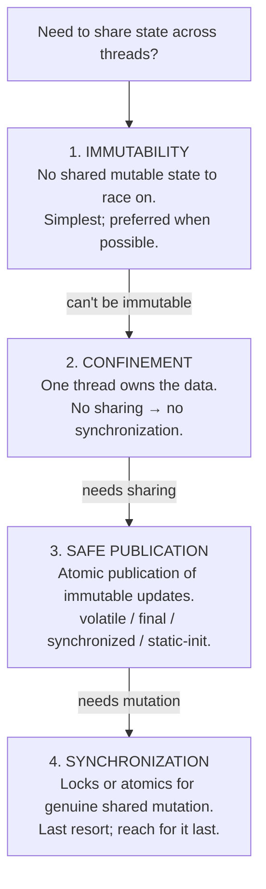
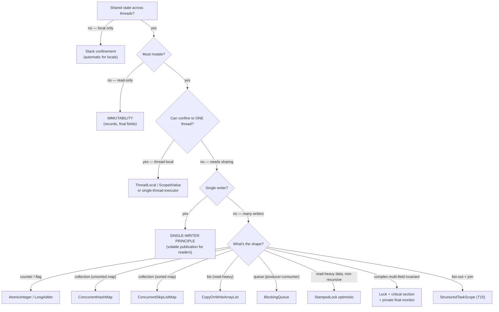

# Thread-Safety Patterns

T16 catalogued the *failure modes* that haunt concurrent programs — deadlock, livelock, starvation, races. This topic — the closing topic of the concurrency chapter — covers the **design patterns** that *prevent* those failure modes from ever arising. Sixteen prior topics dug into mechanism: how `synchronized` works at the mark word, how the AQS queue is implemented, how `LockSupport.park` integrates with the futex. Now we step back to *strategy*: when *given* a piece of mutable state shared across threads, what's the right way to make access correct, scalable, and maintainable? The answer is rarely "add `synchronized`" — almost every senior thread-safety decision is "do I need shared mutable state at all?" — and the patterns below are the toolbox for answering that question.

The depth-bar requirement isn't "use ConcurrentHashMap." At the **principle** layer, the hierarchy of thread-safety strategies is *always* the same — **immutability** (no shared mutable state to race on) > **confinement** (one thread owns the data) > **safe publication** (atomic visibility of immutable updates) > **synchronization** (locks / atomics for genuine shared mutation). Reach for synchronization *last*, not first. At the **pattern** layer, the canonical idioms — encapsulated synchronization (`private final Object lock = new Object()`), monitor pattern, defensive copying, single-writer principle, copy-on-write, lock striping, atomic compound operations — each *encode* one of the four strategies into a recognizable code shape that's easy to review and easy to test. At the **annotation** layer, the JCIP annotations (`@ThreadSafe`, `@Immutable`, `@NotThreadSafe`, `@GuardedBy`) plus Error Prone's compile-time `@GuardedBy` checker move thread-safety contracts from "in the developer's head" to "verified by the build" — the same direction `@Nullable` moves null-safety. At the **paradigm** layer, **virtual threads (T14)** + **structured concurrency (T15)** plus **ScopedValue** (T14) shift the daily practice toward "one thread per task" simple sequential code, with `StructuredTaskScope` for fan-out and `Semaphore` for limiting downstream concurrency — replacing the pre-Loom tangle of pools, futures, and async pipelines for many common cases. We will cover all four layers, with concrete code for each pattern, and finish with a *decision tree* for picking the right pattern from any given starting point.

> [!NOTE]
> Prerequisites: this topic builds on **everything** in C01. Most relevant: [Concurrency pitfalls](./T16-concurrency-pitfalls-deadlock-livelock-starvation-races.md) (L3/C01/T16) — the failure modes these patterns prevent; [Structured concurrency](./T15-structured-concurrency.md) (L3/C01/T15) — `StructuredTaskScope` for the Loom-era fan-out pattern; [Virtual threads](./T14-virtual-threads-project-loom.md) (L3/C01/T14) — `ScopedValue`, one-thread-per-task; [JMM](./T12-java-memory-model-happens-before-volatile.md) (L3/C01/T12) — safe publication's four mechanisms; [Atomic variables](./T11-atomic-variables.md) (L3/C01/T11) — CAS for the atomic-compound-op pattern; [Concurrent collections](./T10-concurrent-collections.md) (L3/C01/T10) — CHM's lock striping; [Locks](./T08-locks-reentrantlock-readwritelock-stampedlock.md) (L3/C01/T08) — `StampedLock`'s optimistic-read pattern; [synchronized](./T03-synchronized-monitors-and-intrinsic-locks.md) (L3/C01/T03) — encapsulated monitor.

## The Thread-Safety Strategy Hierarchy

Before picking a *pattern*, pick a *strategy*. There are exactly four, ranked by simplicity:



The order is **strict**: always ask the prior question first. Most "I need to synchronize this" instincts dissolve when you re-ask "could this be immutable?" or "could this be confined to one thread?"

## Strategy 1 — Immutability

The simplest possible thread-safe class: one whose state cannot change after construction. No mutation → no race possible. Two threads observing an immutable object see identical state, always.

```java
public final class Point {
    public final int x;
    public final int y;
    public Point(int x, int y) { this.x = x; this.y = y; }
}

// or with records (JDK 16+):
public record Point(int x, int y) {}
```

Five rules for immutability (Effective Java Item 17):

1. **No setters.** Or any way to change state after construction.
2. **All fields `final`.** Per JMM final-field semantics (T12), final-initialized fields are safely published even via unsafe means.
3. **The class is `final`** (or all methods are `final`). Prevents subclasses from adding mutable state.
4. **No exposed mutable internal state.** Don't return a reference to a `List` or `Map` field — return an unmodifiable view or a defensive copy.
5. **Defensive constructor and getter copying.** If you must hold a reference to a mutable input (a `Date`, an array), copy it on entry; copy it again on exit (Item 50 — see *Defensive Copying* pattern below).

### Records are immutable by default

JDK 14+ records auto-satisfy rules 1–3:

```java
public record Person(String name, int age, List<String> emails) {
    // ✓ implicitly final, fields are final, no setters
}
```

Rule 4 still needs attention: if you pass a mutable `List`, the record's accessor returns *that same list*. Wrap or defensively copy in a compact constructor:

```java
public record Person(String name, int age, List<String> emails) {
    public Person {
        emails = List.copyOf(emails);    // immutable defensive copy
    }
}
```

`List.copyOf` returns an unmodifiable list and copies if the input wasn't already unmodifiable. The accessor now returns the unmodifiable copy — true immutability achieved.

### Persistent data structures — "modified" immutables

A purely-functional "modification" creates a *new* immutable object sharing structure with the old:

```java
public record IntStack(int head, IntStack tail) {
    public IntStack push(int x) { return new IntStack(x, this); }   // returns new stack
    public IntStack pop() { return tail; }
}
```

`push` doesn't modify; it returns a new stack whose `tail` is the original. Two threads can each call `push` on the same stack; they get back independent new stacks — no race. Clojure, Scala, and Haskell's standard collections work this way. Java doesn't have built-in persistent collections (yet) but libraries like Vavr provide them.

> [!INTERVIEW]
> **"What's the easiest way to make a class thread-safe?" — Make it immutable.** No locks, no atomics, no synchronization required. The JVM's final-field semantics (T12) guarantee that any thread observing a fully-constructed instance sees consistent state. `String`, `Integer`, `BigDecimal`, `LocalDate`, `Optional` — the workhorses of the JDK that *just work* across threads — are all immutable.

## Strategy 2 — Confinement

If the data is *never shared* across threads, no synchronization is needed. Three forms:

### Stack confinement

Local variables (method parameters, local declarations) are *automatically* thread-confined — they live on the calling thread's stack (T01). The JVM guarantees no other thread can reach them.

```java
public int sum(int[] arr) {
    int total = 0;                       // total is stack-confined to this method's frame
    for (int v : arr) total += v;
    return total;
}
```

Stack-confined data is *trivially* thread-safe. This is why most "ordinary" Java code doesn't worry about thread safety — local variables dominate.

### Thread confinement — `ThreadLocal`

```java
private static final ThreadLocal<SimpleDateFormat> FORMAT =
    ThreadLocal.withInitial(() -> new SimpleDateFormat("yyyy-MM-dd"));

public String formatDate(Date d) {
    return FORMAT.get().format(d);     // each thread has its own formatter
}
```

`SimpleDateFormat` is *not* thread-safe (a 90s API mistake). Either synchronize access or *give each thread its own*. The latter is `ThreadLocal`. Used historically for:

- Date formatters (no longer needed — `DateTimeFormatter` is immutable).
- DB connections — one connection per request thread.
- Logging context (MDC).
- Random number generators (`ThreadLocalRandom` is built in).

### `ScopedValue` — Loom-era confinement

`ThreadLocal` has a subtle problem with **virtual threads (T14)**: a million VTs each with a `ThreadLocal` entry is a million entries in the per-thread map. Also, the "thread identity stays stable" expectation may not match the VT lifecycle.

**`ScopedValue`** (JEP 446, T14) is the modern replacement:

```java
private static final ScopedValue<User> CURRENT_USER = ScopedValue.newInstance();

public void handleRequest(Request r) {
    ScopedValue.where(CURRENT_USER, r.user).run(() -> {
        process(r);                       // CURRENT_USER.get() returns r.user inside this scope
    });
    // After run() returns, CURRENT_USER is no longer bound — auto-cleared
}
```

Immutable for the scope's duration; lexically bounded; cheaper than ThreadLocal at high VT counts; integrates with structured concurrency (subtasks inherit). **The default for new code on JDK 21+.**

### Group confinement — single-thread executor

```java
private final ExecutorService eventLoop = Executors.newSingleThreadExecutor();

public void submitEvent(Event e) {
    eventLoop.submit(() -> processEvent(e));     // serializes all events to one thread
}
```

All work runs on one thread; shared state inside `processEvent` is single-threaded by construction. Classic patterns:

- Swing/JavaFX Event Dispatch Thread.
- Database actor pattern (one thread owns the connection).
- Game-engine main loop.

The trade-off: zero parallelism. Useful when correctness via simplicity is more valuable than throughput.

## Strategy 3 — Safe Publication

When you *must* share state, share *immutable* state via a *safe publication* mechanism (T12 — the four mechanisms):

```java
// Pattern: safely publish a new immutable config
private volatile Config config = new Config(...);    // (2) volatile publication

public void reload() {
    Config newConfig = loadFromFile();
    config = newConfig;                                 // safe — volatile write
}

public Config currentConfig() {
    return config;                                       // safe — volatile read
}
```

The pattern:

- The shared reference (`config`) is `volatile` — the volatile write is a release barrier (T11/T12).
- The shared object (`Config`) is *immutable* — once published, no one can change its fields.
- Updates create new immutable instances and publish via the volatile field.

Combined, this gives wait-free reads (no lock, no CAS — just a volatile load) and lock-free writes (single volatile store). Perfect for hot-reloaded config, feature flags, cached query results, anything read-heavy + occasionally-updated.

The four publication mechanisms (T12), with use cases:

- **Static initializer** — singletons constructed at class load.
- **`volatile` reference / `AtomicReference`** — publication of new immutable values (the example above).
- **Final field of a safely-published object** — initialization safety covers transitively.
- **Lock-protected publication** — when the publication is part of a larger critical section.

## Strategy 4 — Synchronization (Last Resort)

When you must *both* share state *and* mutate it across threads, synchronize. Patterns 4–13 below describe the canonical idioms.

## Pattern 4 — Encapsulated Synchronization (Private Final Lock)

The most-violated thread-safety rule:

```java
// ✗ broken — leaks the monitor
public class Counter {
    private int value;
    public synchronized void inc() { value++; }       // monitor = this
}

// external code:
synchronized (counter) {                              // ✗ now CAN lock the same monitor
    // ... arbitrary code holding Counter's monitor ...
}
```

`synchronized` on a public method uses `this` as the monitor — and `this` is publicly visible. *Anyone* can `synchronized (counter)` and contend with (or accidentally deadlock against) Counter's internal synchronization. This breaks encapsulation: Counter's thread-safety guarantee depends on external callers behaving.

**Fix**: private final dedicated lock object:

```java
// ✓ encapsulated
public class Counter {
    private final Object lock = new Object();          // dedicated, private monitor
    private int value;
    public void inc() { synchronized (lock) { value++; } }
    public int get() { synchronized (lock) { return value; } }
}
```

The monitor is now Counter's private property; external code cannot touch it. Counter's thread-safety is *self-contained*.

The same applies to `Lock`:

```java
private final ReentrantLock lock = new ReentrantLock();
```

Use a private final field for the lock; never expose it via getters.

## Pattern 5 — Monitor Pattern (Uniform Synchronization)

Encapsulate all access to a state field through methods that all use *the same* monitor. From Goetz, *Java Concurrency in Practice*:

```java
public final class SafePoint {
    private final Object lock = new Object();
    private int x, y;

    public SafePoint(int x, int y) { this.x = x; this.y = y; }
    public void set(int x, int y) {
        synchronized (lock) { this.x = x; this.y = y; }    // atomic pair-write
    }
    public int[] get() {
        synchronized (lock) { return new int[] { x, y }; }  // atomic pair-read
    }
}
```

Every method synchronizes on the same lock. The class is thread-safe by construction: callers don't need to know about the lock; the contract is "method calls are atomic."

`Hashtable` and the `Collections.synchronizedXxx` wrappers use this pattern (with `this` as the monitor — a leaky variant). Modern code prefers private locks; better still, prefer concurrent collections (T10) when one exists for your shape.

## Pattern 6 — Defensive Copying

When a class holds a *mutable* input or returns a *mutable* internal field, defensive copies prevent external mutation from corrupting internal state:

```java
public final class Period {
    private final Date start, end;

    public Period(Date start, Date end) {
        this.start = new Date(start.getTime());    // copy on entry
        this.end   = new Date(end.getTime());
    }

    public Date start() { return new Date(start.getTime()); }   // copy on exit
    public Date end()   { return new Date(end.getTime()); }
}
```

Why two copies? Without entry-copy, the caller can modify `start` after construction. Without exit-copy, the caller can modify the returned `Date` to corrupt subsequent reads. Defensive copying *both* ways gives true immutability semantics over an underlying mutable type.

Effective Java Item 50 is the canonical reference. The fix in modern code: **use immutable types in the first place** (`LocalDate`, `Instant`, `LocalDateTime` instead of `Date`); records over POJOs; `List.copyOf(...)` over manual loops.

## Pattern 7 — Single-Writer Principle

One thread mutates; many threads read. Eliminate write-write contention by *architectural* design — there is no concurrent writer to contend with.

```java
public final class HotCounter {
    private static final VarHandle COUNT = ...;
    private volatile long count;

    // only ONE thread calls this
    public void increment() { count++; }    // no CAS needed — single writer

    // any number of threads can read
    public long read() { return count; }    // volatile read; release/acquire to writer
}
```

The cost of a CAS is hundreds of cycles + cache-line ping-pong. With one writer, a plain `count++` (followed by volatile fence) is *cycles*. Used by:

- **LMAX Disruptor** — a high-performance ring buffer where producers and consumers each have dedicated sequence counters, no contention on writes.
- **Append-only logs** — single appender, many readers.
- **Event sourcing** — single writer per stream, many subscribers.

The architecture is the synchronization. **If you can guarantee one writer, you can simplify radically.**

## Pattern 8 — Copy-on-Write

For collections where reads dominate writes massively (events listeners, configuration snapshots), `CopyOnWriteArrayList` (T10) is the canonical Java implementation:

```java
private final List<Listener> listeners = new CopyOnWriteArrayList<>();

public void addListener(Listener l) { listeners.add(l); }        // O(n) — copy
public void removeListener(Listener l) { listeners.remove(l); }   // O(n) — copy

public void notify(Event e) {
    for (Listener l : listeners) l.onEvent(e);                     // lock-free read; snapshot iterator
}
```

Every mutation copies the entire array; reads do a single volatile load + index access. Iterators see a snapshot — never throw `ConcurrentModificationException`. Best when read-to-write ratio is 1000:1+; bad when writes are frequent or list is large (10k+ elements).

## Pattern 9 — Producer-Consumer with Bounded Queue

The classic decoupling pattern: producers `put`, consumers `take`, the queue handles all synchronization:

```java
private final BlockingQueue<Task> queue = new LinkedBlockingQueue<>(1000);
private final ExecutorService consumers = Executors.newFixedThreadPool(10);

public void submit(Task t) throws InterruptedException {
    queue.put(t);                                                   // blocks if full → backpressure
}

void startConsumers() {
    for (int i = 0; i < 10; i++) {
        consumers.submit(() -> {
            while (!Thread.currentThread().isInterrupted()) {
                Task t = queue.take();                                // blocks if empty
                process(t);
            }
        });
    }
}
```

The `BlockingQueue` handles all synchronization internally; producers and consumers are decoupled and run independently; queue size bounds memory; full-queue blocks producers (natural backpressure).

In the Loom era, replace with `Executors.newVirtualThreadPerTaskExecutor` for the consumer side and a `Semaphore` for backpressure if needed (T14). The pattern persists; the thread model evolves.

## Pattern 10 — Stamped Optimistic Reads

For read-heavy data where writes are rare and reads are non-recursive, `StampedLock`'s optimistic-read pattern (T08) is dramatically faster than any lock:

```java
private final StampedLock lock = new StampedLock();
private double x, y;

public double distanceFromOrigin() {
    long stamp = lock.tryOptimisticRead();
    double cx = x, cy = y;
    if (!lock.validate(stamp)) {                                    // writer interfered?
        stamp = lock.readLock();
        try { cx = x; cy = y; } finally { lock.unlockRead(stamp); }
    }
    return Math.sqrt(cx*cx + cy*cy);
}

public void move(double dx, double dy) {
    long stamp = lock.writeLock();
    try { x += dx; y += dy; } finally { lock.unlockWrite(stamp); }
}
```

Optimistic reads are ~5-10 ns (just two volatile reads + stamp validation); pessimistic reads ~50-100 ns; writes ~50-100 ns. The fastest read primitive in the JDK for read-mostly data accessed non-recursively.

## Pattern 11 — Atomic Compound Operations

Avoid check-then-act races (T16) by using atomic compound operations on concurrent collections (T10):

```java
// ✗ check-then-act race
if (!map.containsKey(k)) map.put(k, computedValue);

// ✓ atomic
map.putIfAbsent(k, computedValue);
map.computeIfAbsent(k, key -> computedValue);    // lazy computation
map.merge(k, 1, Integer::sum);                    // atomic increment
map.compute(k, (key, val) -> val == null ? "new" : val + "_more");
```

The CHM's atomic compound ops run the lambda *under the bucket lock* — only one thread succeeds; others observe the result. T10 has the full source-level mechanics; this pattern just uses them.

## Pattern 12 — Lock Striping

Replace one big lock with N small locks, each guarding a fraction of the data:

```java
public final class StripedCounter {
    private static final int STRIPES = 16;
    private final long[] counters = new long[STRIPES];
    private final Object[] locks = new Object[STRIPES];

    public StripedCounter() {
        for (int i = 0; i < STRIPES; i++) locks[i] = new Object();
    }

    public void increment(int key) {
        int s = Math.floorMod(key, STRIPES);
        synchronized (locks[s]) { counters[s]++; }
    }

    public long total() {
        long sum = 0;
        for (int i = 0; i < STRIPES; i++) {
            synchronized (locks[i]) { sum += counters[i]; }
        }
        return sum;
    }
}
```

The classic high-throughput counter: 16-way stripes reduce contention by ~16×. ConcurrentHashMap uses this internally (per-bucket locking, T10); `LongAdder` (T11) is a more sophisticated variant with cache-line padding.

The trade-off: `total()` is O(stripes) — not atomic with respect to ongoing increments. If you need exact size *snapshots*, lock striping doesn't fit; otherwise it's a powerful contention-reduction pattern.

## Pattern 13 — Open Call Principle

From T16: never hold a lock while calling unknown code. The pattern is to *snapshot* shared state under the lock, then operate *outside*:

```java
public void notifyAllListeners(Event e) {
    List<Listener> snapshot;
    synchronized (lock) {                       // snapshot under lock
        snapshot = new ArrayList<>(listeners);
    }
    for (Listener l : snapshot) l.onEvent(e);   // notify outside lock
}
```

The synchronized region is minimal (just the copy); the listener callback is unlocked. Listeners can register/deregister, call back into us, do anything — without risking deadlock against our internal lock.

## JCIP Annotations and `@GuardedBy`

Brian Goetz's *Java Concurrency in Practice* (2006) introduced annotations that document thread-safety contracts:

```java
@ThreadSafe
public class Counter { ... }

@NotThreadSafe
public class SimpleDateFormat { ... }      // (existing class; documenting after the fact)

@Immutable
public final class Point { ... }

public class Service {
    @GuardedBy("lock") private int state;   // field is guarded by lock
    private final Object lock = new Object();

    public void update(int v) {
        synchronized (lock) { state = v; }
    }
}
```

The annotations are *documentation* by default — no runtime enforcement. But **Error Prone** (Google) implements a compile-time `@GuardedBy` check: violating the documented contract (accessing `state` without holding `lock`) causes a *build error*. This moves thread-safety from "developer convention" to "verified by the build" — the same direction `@Nullable` moves null safety.

Use the annotations:

- **`@Immutable`** for value classes — the strongest contract.
- **`@ThreadSafe`** for classes safe to use concurrently without external sync.
- **`@NotThreadSafe`** for classes requiring external sync. (Documenting a *constraint*.)
- **`@GuardedBy("lock")`** on every field that requires lock-guarded access. Enable Error Prone for compile-time checking.

## Virtual Thread Era — New Default Patterns

The Loom era (JDK 21+) shifts daily practice:

### 1. One thread per task — back to simple sequential code

```java
try (var pool = Executors.newVirtualThreadPerTaskExecutor()) {
    for (var req : requests) pool.submit(() -> handle(req));
}
```

No pool sizing; no async pipelines; just blocking code on a virtual thread. The runtime handles the multiplexing.

### 2. StructuredTaskScope for fan-out

```java
try (var scope = new StructuredTaskScope.ShutdownOnFailure()) {
    var a = scope.fork(() -> svcA.call());
    var b = scope.fork(() -> svcB.call());
    scope.join();
    scope.throwIfFailed();
    return combine(a.get(), b.get());
}
```

Replaces `CompletableFuture.allOf` chains. Lexical scope; automatic cancellation; clean exception flow (T15).

### 3. ScopedValue for context

```java
ScopedValue.where(CURRENT_USER, user).run(() -> handler.handle(req));
```

Replaces `ThreadLocal` for request context. Cheap at high VT counts; auto-cleared (T14).

### 4. Semaphore for downstream concurrency limiting

```java
private final Semaphore dbLimit = new Semaphore(20);

void query(...) throws InterruptedException {
    dbLimit.acquire();
    try { db.query(...); } finally { dbLimit.release(); }
}
```

Bounds concurrency to downstream resources. Doesn't bound VT count (don't try) — bounds *concurrent calls to the downstream*. With virtual threads, this is the *only* pool-sizing question that remains.

## Beyond Traditional Concurrency

Three paradigms that bypass shared-mutable-state entirely:

### Reactive — Project Reactor / RxJava

Non-blocking streams with backpressure. Operators (`map`, `flatMap`, `filter`) chain into pipelines that handle async events without thread-blocking. State is immutable; transformations are pure; concurrency is managed by the framework's schedulers.

Use case: high-throughput event-driven processing where backpressure must be explicit (e.g., a Kafka consumer feeding multiple async outputs). Modern alternative: virtual threads + structured concurrency for most cases; reactive when backpressure is genuinely complex.

### Actor model — Akka, Vert.x

Each actor owns its state; communicates only via messages (no shared memory). Messages are processed one at a time per actor → no internal race possible. Actors run on a small thread pool, multiplexed.

Use case: stateful per-entity processing (e.g., per-game-room state in an MMO); systems with strong isolation requirements; supervisor hierarchies for fault tolerance. Akka was a major pre-Loom answer to scaling.

### CSP / Channels — Go-style

Channels are typed FIFO queues with rendezvous semantics; senders and receivers synchronize via the channel. No shared state — communication *is* the synchronization.

Java equivalent: `BlockingQueue`, `SynchronousQueue` (T05/T10) — the building blocks are there but Java doesn't have first-class channels in the language. Project Loom + the JDK collections give CSP-ish patterns with virtual threads as the "goroutines."

## The Thread-Safe API Design Checklist

When designing a class meant to be used across threads:

1. **Document the contract** — `@Immutable`/`@ThreadSafe`/`@NotThreadSafe` on the class; `@GuardedBy` on guarded fields.
2. **Prefer immutability** — make instances unmodifiable after construction.
3. **Use records** for value classes — JDK 14+ records are immutable by default.
4. **Provide atomic compound operations** — don't expose check-then-act sequences (use `putIfAbsent`-style on your API).
5. **Return immutable snapshots** — never return references to internal mutable state.
6. **Use concurrent collections internally** — CHM, ConcurrentSkipListMap, COWAL.
7. **Never expose internal monitors** — `private final Object lock = new Object()`; never a getter that returns it.
8. **Test under concurrency** — `jcstress` for memory-model bugs (T12), JMH + concurrent benchmarks for performance.
9. **Defensive copying** — when accepting/returning mutable inputs (rare in modern code; mostly for compat with old APIs).
10. **Avoid `this`-escape in constructors** — don't publish `this` before construction completes (T12).

## Common Anti-Patterns

### `public synchronized` methods on a public class

Leaks the monitor. Use `private final Object lock = new Object()`.

### Mutable shared state with documented "use this lock"

Works if everyone follows the convention. Use `@GuardedBy` + Error Prone for compile-time enforcement.

### ThreadLocal that's never cleared

In long-running thread pools, ThreadLocal entries accumulate forever, causing memory leaks. Always `remove()` in a finally block — or use `ScopedValue` which auto-clears.

### Returning a mutable internal collection from a getter

```java
public List<Item> items() { return items; }          // ✗ caller can mutate; race with internal use
```

Return `Collections.unmodifiableList(items)` or `List.copyOf(items)` (defensive copy).

### Lock everything

The "just put `synchronized` on every method" approach kills parallelism. Identify the *invariant boundaries* — what fields must be mutated together — and lock those. Other fields can use independent locks or atomic operations.

### Volatile for compound operations

`volatile counter; counter++;` is still broken (T11). Use `AtomicInteger` or `LongAdder`.

### Double-checked locking without volatile

Pre-JDK-5 always broken; post-JDK-5 broken without `volatile` (T12). Prefer the holder-class idiom for singletons.

### Holding locks across long operations

I/O, callbacks, complex computation under a lock cause everyone else to wait. Snapshot under lock; act outside.

## Decision Tree — Picking the Right Pattern



The mental model: **always ask the questions in this order**. Most cases resolve at the first or second level (immutability or confinement). Synchronization is the last branch.

> [!INTERVIEW]
> "Walk me through how you'd make a class thread-safe." — Senior answer:
>
> 1. **First ask: can it be immutable?** If yes, no synchronization needed. Use a record, mark fields final, ensure no internal mutable state escapes.
> 2. **If not, can it be confined to one thread?** ThreadLocal or ScopedValue for per-thread; single-thread executor for "this state runs on one thread only" patterns.
> 3. **If shared mutable, can the updates be modeled as immutable publication?** Reconstruct on update + safely publish via volatile or AtomicReference.
> 4. **Only if all three fail**: synchronize. Use private final lock for encapsulation; pick the right primitive (atomic for counters, CHM for maps, Lock for complex invariants); use `@GuardedBy` to document; consider lock striping for hot paths.

> [!INTERVIEW]
> Short Q&A:
>
> 1. **Strategy hierarchy?** Immutability > Confinement > Safe publication > Synchronization.
> 2. **Why immutability first?** No shared mutable state → no race possible → no synchronization needed.
> 3. **Five rules for immutable classes?** No setters; final fields; final class; no exposed mutable state; defensive copying of mutable inputs/outputs.
> 4. **Records and immutability?** Records auto-make fields final, no setters; need compact constructor for defensive copying of mutable input (e.g., List.copyOf).
> 5. **Stack vs thread vs group confinement?** Stack = local variables (automatic); thread = ThreadLocal/ScopedValue; group = single-thread executor.
> 6. **ScopedValue vs ThreadLocal?** ScopedValue is lexically bound, immutable, auto-cleared, cheaper at high VT counts. Loom-era replacement.
> 7. **What's wrong with `public synchronized` methods?** Leaks the monitor — external code can lock `this` and contend with internal sync. Use `private final Object lock = new Object()`.
> 8. **Defensive copying — when?** When accepting or returning mutable inputs/outputs. Modern code prefers immutable types from the start.
> 9. **Single-writer principle?** One thread mutates; many read. Eliminates write-write contention. Used by LMAX Disruptor.
> 10. **Lock striping?** Replace one big lock with N small ones, each guarding a fraction of the data. CHM's per-bucket locking is this pattern. Trade-off: aggregate operations (size) are O(stripes).
> 11. **Atomic compound op pattern?** Use CHM.putIfAbsent/computeIfAbsent/merge to make sequences atomic without locks.
> 12. **Open call principle?** Never call unknown code (listeners, callbacks) under a lock. Snapshot under lock; act outside.
> 13. **`@GuardedBy` and Error Prone?** `@GuardedBy("lock")` documents which lock guards which field; Error Prone enforces at compile time. Moves thread-safety from convention to verification.
> 14. **What changes with virtual threads?** "One thread per task" becomes affordable; daily patterns shift to virtual-thread executor + StructuredTaskScope (T15) + ScopedValue + Semaphore for limiting downstream concurrency.
> 15. **When NOT to use shared mutable state?** Most of the time — prefer immutable + safe publication + functional transformations. Synchronization is the last resort.

## Practice

1. **Make a class immutable.** Take a mutable `Person` POJO; convert to record with defensive copying of `List<String> emails`. Verify two threads observing the same record see identical state always.
2. **Confine via ScopedValue.** Implement a request-handler chain that uses `ScopedValue<TraceId>`; verify all subtasks in a `StructuredTaskScope` see the same TraceId.
3. **Safe publication via volatile.** Build a hot-reloaded `Config` published via `volatile`; show concurrent readers always see fully-constructed configs.
4. **Encapsulated lock vs public sync.** Implement Counter both ways. Demonstrate the public-sync version can be deadlocked from external code; the private-lock version cannot.
5. **Monitor pattern with private lock.** Implement `SafePoint` with `set(x, y)` and `get()` returning `int[]`. Verify pair-write and pair-read are atomic.
6. **Defensive copying.** Implement a `Period(Date start, Date end)` class that's safe even if the caller mutates the passed Date after construction. Then refactor to use `LocalDate` instead.
7. **Single-writer counter.** Implement a counter incremented by one thread, read by many. Compare throughput with `AtomicInteger` under same workload; observe single-writer is faster.
8. **CopyOnWriteArrayList for listeners.** Build a listener registry; verify reads are lock-free; verify add/remove are O(n) but uncommon.
9. **Lock striping.** Build a striped counter with 16 stripes; benchmark against `AtomicInteger` and `LongAdder` under high contention. Observe LongAdder is fastest; striped is close; AtomicInteger is slowest.
10. **`@GuardedBy` with Error Prone.** Annotate a class with `@GuardedBy("lock")`; configure Error Prone; intentionally access the guarded field without the lock; verify build fails.
11. **Open call refactor.** Take an event-dispatcher class that notifies listeners under a lock; refactor to open call (snapshot under lock, notify outside); verify deadlock with cyclic listener access is now impossible.
12. **Virtual-thread + Semaphore pattern.** Build a service that spawns one VT per request but limits concurrent DB calls via Semaphore(20). Stress with 10,000 requests; verify VT count is high but DB call count is capped.

## Recap

You should now be able to:

- Apply the **thread-safety strategy hierarchy** in order: **immutability** > **confinement** > **safe publication** > **synchronization**. Reach for synchronization last, not first.
- Use **immutability** via `final` fields, sealed/final classes, records (JDK 14+), persistent data structures; remember the five rules (no setters, final fields, final class, no escaped mutable state, defensive copying of mutable I/O).
- Apply **confinement** in three forms: stack (automatic for locals), thread (`ThreadLocal` / `ScopedValue`), group (single-thread executor); prefer `ScopedValue` for new code at scale (JEP 446, T14).
- Use **safe publication** via volatile / AtomicReference / final-field / synchronized / static-init (T12's four mechanisms); the volatile+immutable pattern gives wait-free reads and lock-free writes.
- Encapsulate synchronization with **`private final Object lock = new Object()`** — never `public synchronized` methods that leak the monitor.
- Apply the **monitor pattern** — all state access through methods that synchronize on the same private lock — for classes whose invariants span multiple fields.
- Use **defensive copying** when forced to accept/return mutable inputs/outputs (Effective Java Item 50); prefer immutable types in modern code.
- Recognize the **single-writer principle** — one mutator, many readers — as an architectural sync-elimination pattern (LMAX Disruptor).
- Apply **copy-on-write** (CopyOnWriteArrayList) for read-heavy collections with rare updates.
- Use **producer-consumer with BlockingQueue** for natural backpressure and thread decoupling.
- Apply **StampedLock optimistic-read** for read-heavy data accessed non-recursively (T08).
- Use **atomic compound operations** (CHM.merge/compute/computeIfAbsent) to avoid check-then-act races (T16).
- Apply **lock striping** for high-contention counters and maps; trade aggregate-op atomicity for per-key parallelism.
- Apply the **open call principle** — snapshot under lock, act outside — to avoid deadlock with callback code.
- Document with **JCIP annotations** (`@Immutable`, `@ThreadSafe`, `@NotThreadSafe`, `@GuardedBy`); enable **Error Prone** for compile-time `@GuardedBy` enforcement.
- Adapt to **the virtual-thread era**: `Executors.newVirtualThreadPerTaskExecutor()` + `StructuredTaskScope` for fan-out + `ScopedValue` for context + `Semaphore` for downstream limiting — replaces pre-Loom pool/CF/InheritableThreadLocal patterns.
- Recognize **alternative paradigms**: reactive (Project Reactor — non-blocking streams), actor (Akka — message passing, no shared state), CSP (channels — communicate to synchronize). All sidestep shared-mutable-state by design.
- Apply the **decision tree** to pick a pattern: shared state → mutate? → confine? → single writer? → atomic shape? → choose primitive.
- Avoid the **common anti-patterns**: public synchronized methods, unchecked `@GuardedBy` convention, ThreadLocal leaks, exposed mutable internals, lock-everything-with-synchronized, volatile-for-compound-ops, DCL-without-volatile, locks across I/O.

## Chapter Complete — Where to Go Next

Topic 17 closes **L3/C01 Concurrency & Multithreading** (17/17). The chapter has covered:

- **Foundations** (T01–T02): threads, lifecycle, states.
- **Synchronization primitives** (T03–T04): synchronized, monitors, wait/notify.
- **Pool abstractions** (T05–T07): ThreadPoolExecutor, Future, CompletableFuture.
- **Lock toolkit** (T08–T09): Lock, ReadWriteLock, StampedLock, Semaphore, CountDownLatch, CyclicBarrier, Phaser.
- **Concurrent data structures** (T10–T11): ConcurrentHashMap, atomic ops, VarHandle.
- **Foundations of memory** (T12): JMM, happens-before, volatile, final.
- **Parallel computation** (T13): Fork/Join and work-stealing.
- **Modern Loom** (T14–T15): virtual threads, structured concurrency, ScopedValue.
- **Failure modes and design** (T16–T17): deadlock/livelock/starvation/races; the patterns that prevent them.

Next stops in L3:

- **C02 — JVM internals & performance**: class loading, bytecode, JIT (C1/C2), Graal, escape analysis, garbage collectors (G1, ZGC, Shenandoah), memory tuning, JFR, async-profiler.
- **C03 — Design patterns & principles**: GoF patterns in Java context, SOLID, Effective Java patterns, idiomatic JDK 21+ shapes.

Continue when ready.
