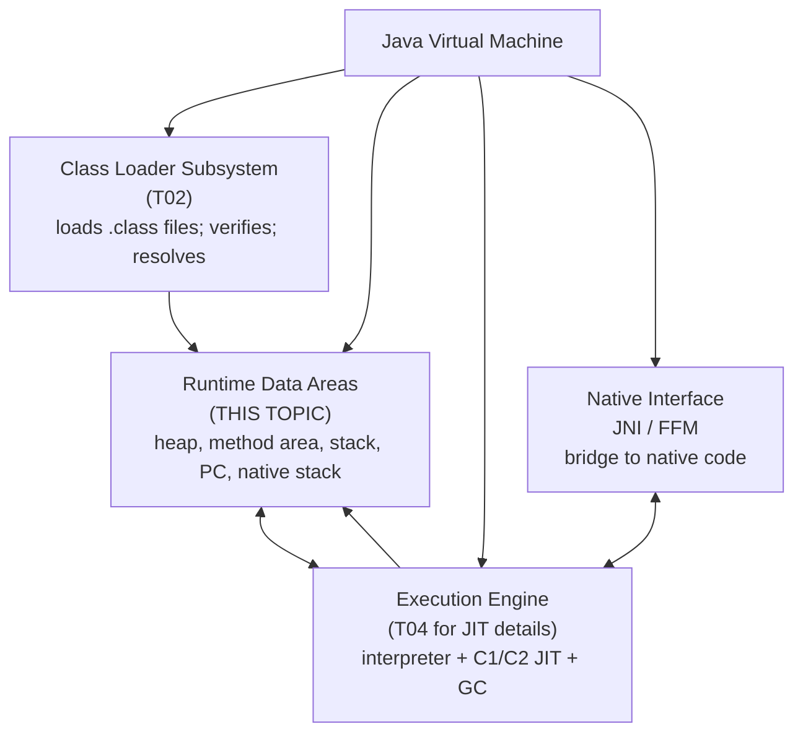
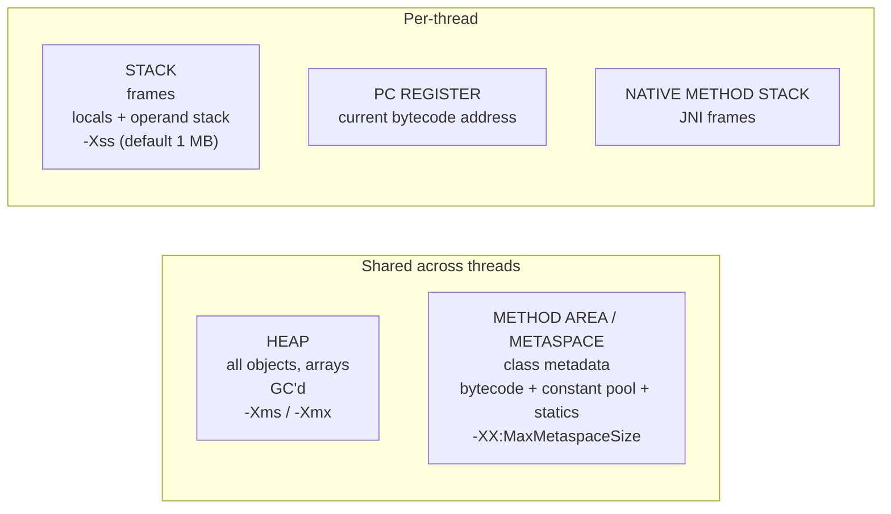
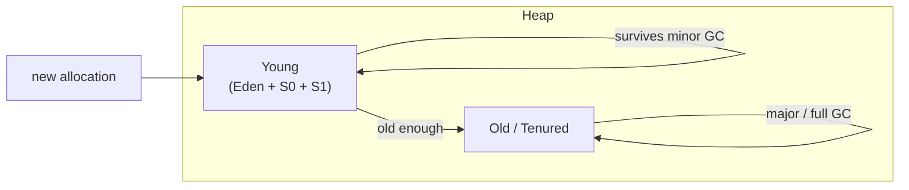
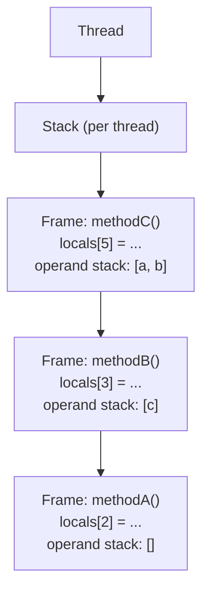
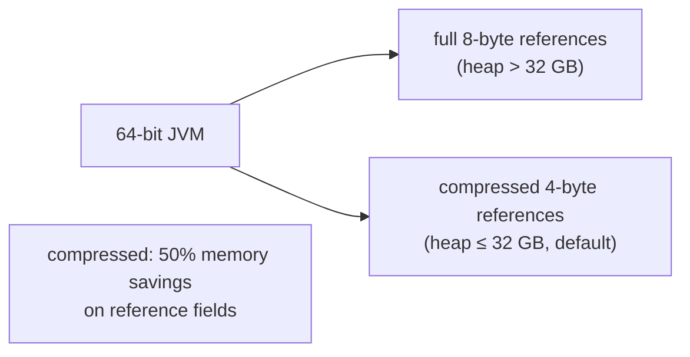
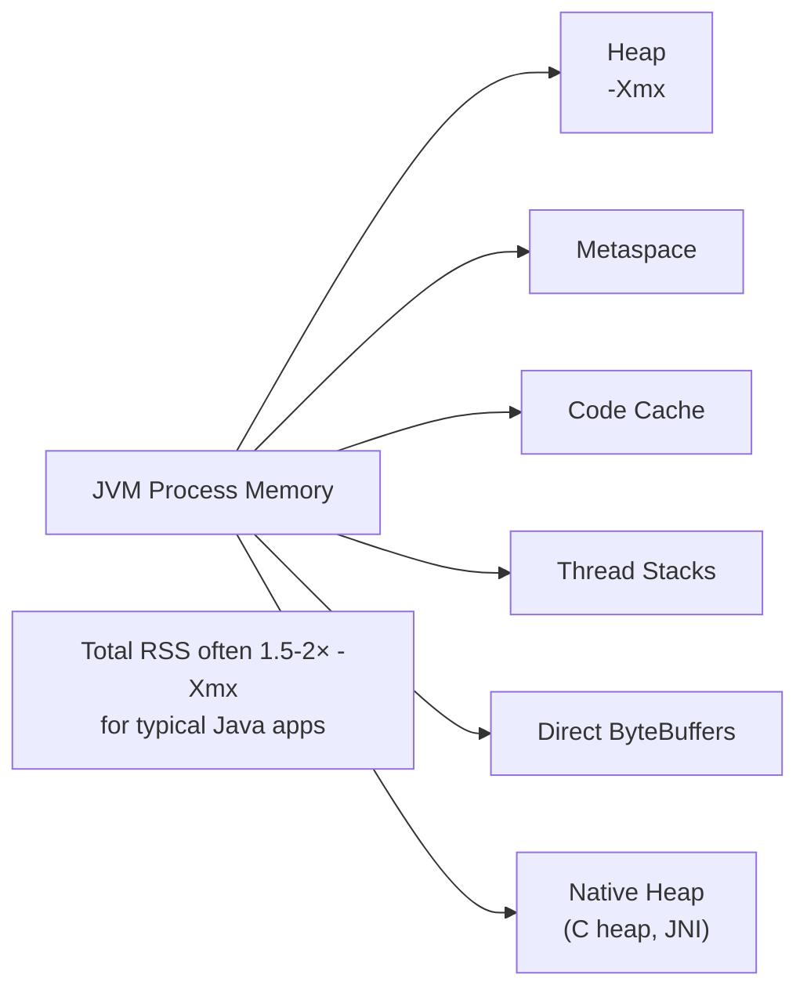

# JVM Architecture & Runtime Data Areas

C01 covered concurrency from the language layer down to the futex. This chapter (C02) opens the other half of the JVM internals story: **how the JVM runs your code at all**. Every `synchronized` block we dissected at the mark word level (T03), every `Future` whose state field we walked through (T06), every virtual thread whose continuation we traced into the heap (T14) — all of that runs inside a *Java Virtual Machine*, an abstract computing machine specified by the JVMS and implemented (most famously) by HotSpot. This topic is the architectural overview: what the JVM is, what its subsystems are, and — at the deepest detail — what its **five runtime data areas** (heap, method area, stack, PC register, native method stack) hold, where they live in process memory, and which OOM error you get when each one fills.

The depth-bar requirement isn't "the heap is where objects live." At the **specification** layer, the JVM is a **stack-based abstract machine** (the operand stack is the basic operand source, unlike x86/ARM which are register-based), specified by the **Java Virtual Machine Specification** (JVMS), and implemented by HotSpot, OpenJ9, GraalVM, and Azul Zing — each implementation independent but conformant. At the **runtime** layer, the JVM divides memory into **five data areas**: the *Heap* (shared across threads, GC'd, holds all objects and instance state), the *Method Area* / *Metaspace* (shared, holds class metadata + bytecode + constant pool + static fields, native-memory-backed since JDK 8), the *Stack* (per-thread, holds method-invocation frames with locals array + operand stack + constant-pool reference + return address), the *PC Register* (per-thread, holds the bytecode index of the currently-executing instruction), and the *Native Method Stack* (per-thread, for JNI calls). At the **memory** layer, total JVM process memory is far more than `-Xmx` — heap + metaspace + code cache (where JIT'd native code lives, 240 MB default) + per-thread stacks + direct ByteBuffers + JNI/native heap; each area has its *own* `OutOfMemoryError` variant (heap, metaspace, compressed class space, direct buffer, GC overhead, stack overflow). At the **execution** layer, the *execution engine* — bytecode interpreter + tiered C1/C2 JIT — translates bytecode into either interpreted execution or compiled native code in the code cache, with profile-guided promotion between tiers (full mechanism is T04). We will cover all four layers, plus object header structure (mark word + klass pointer + compressed OOPs from T03), the canonical observability commands (`jcmd VM.info`, `GC.heap_info`, `Compiler.codecache`), and the OOM-error decision tree every Java engineer should know.

> [!NOTE]
> Prerequisites: [Thread-safety patterns](../C01-concurrency/T17-thread-safety-patterns.md) (L3/C01/T17) — completes the concurrency picture; [Virtual threads](../C01-concurrency/T14-virtual-threads-project-loom.md) (L3/C01/T14) — VTs interact with the carrier pool's stacks; [synchronized, monitors & intrinsic locks](../C01-concurrency/T03-synchronized-monitors-and-intrinsic-locks.md) (L3/C01/T03) — mark word + klass pointer in object header; [Source to bytecode](../../L0-foundations/C01-cs-foundations/T04-source-to-bytecode-to-jvm-to-machine-code.md) (L0/C01/T04) — bytecode + JIT overview; [How Computers Run Programs](../../L0-foundations/C01-cs-foundations/T01-how-computers-run-programs-cpu-memory-binary.md) (L0/C01/T01) — CPU + memory + caches.

## What the JVM Is — Abstract Machine Plus Specification

The Java Virtual Machine is **not** a hardware thing or a single program — it's an **abstract computing machine** defined by the **Java Virtual Machine Specification** (JVMS), implemented by several JVMs:

- **HotSpot** — Oracle/OpenJDK's reference implementation; the default for ~95% of the world. Two compilers (C1 client, C2 server) + interpreter + multiple GCs.
- **OpenJ9** — IBM/Eclipse implementation; different JIT (Testarossa) + different GCs; emphasis on memory efficiency.
- **GraalVM Community / Enterprise** — Oracle Labs; replaces C2 with the Graal JIT (Java-implemented); also offers AOT native-image compilation (T05).
- **Azul Zing** — pauseless-GC focused implementation; C4 collector.

All four execute the same `.class` files because they implement the same JVMS. The specification is what makes "write once, run anywhere" mean something: a `.class` file compiled by `javac` in 2004 still runs identically on any JDK 24 JVM in 2026.

### The JVM is *stack-based*

Modern CPUs are *register-based*: operations like `add` take register operands (`add rax, rbx`). The JVM is *stack-based*: operations take operands from a per-frame **operand stack**.

```text
JVM bytecode for: int c = a + b;
  iload_1       ; push local 1 (a) onto operand stack
  iload_2       ; push local 2 (b) onto operand stack
  iadd          ; pop two ints, push sum
  istore_3      ; pop sum, store as local 3 (c)
```

The same operation in x86-64:

```asm
mov  ecx, eax                       ; load a into a register
add  ecx, ebx                       ; add b
mov  [rbp-12], ecx                   ; store c
```

Why stack-based? Two reasons:

1. **Portability.** Bytecode can be generated without knowing the target architecture's register count. The JIT translates stack operations to register operations at runtime.
2. **Simpler verifier.** The JVMS specifies bytecode verification (every instruction has predictable stack effect), which is easier for stack-based code than register-allocated.

The cost: interpretation is slower than register-direct execution. The JIT closes the gap by mapping operand stack slots to registers — modern HotSpot produces machine code competitive with C++.

## JVM Architecture — the Four Subsystems



Four subsystems, with overlap:

- **Class Loader Subsystem** (T02) — loads `.class` files from the file system, JAR, network, or classpath; verifies them against the JVMS; resolves symbolic references. Loaded classes' metadata lives in the *method area*.
- **Runtime Data Areas** (this topic) — the JVM's memory model. The heap, method area, stacks, PC registers, and native method stacks.
- **Execution Engine** (T04) — runs bytecode. Two paths: interpret directly (fast startup, slow execution) or JIT-compile to native (slow start, fast execution). Plus the garbage collector (T07–T09).
- **Native Interface** — JNI (Java Native Interface) and the modern FFM (Foreign Function & Memory API, JEP 454, JDK 22) bridge Java to native C/C++ code.

This topic focuses on Runtime Data Areas; the others are forward-referenced.

## The Five Runtime Data Areas

The JVMS defines exactly five runtime data areas:

| Area | Shared? | Holds | Per-thread or per-JVM | Failure mode |
|------|:-------:|-------|----------------------|--------------|
| **Heap** | shared | objects, arrays, instance fields | per-JVM | `OutOfMemoryError: Java heap space` |
| **Method Area / Metaspace** | shared | class metadata, bytecode, constant pool, static fields | per-JVM | `OutOfMemoryError: Metaspace` |
| **Stack** | per-thread | method-invocation frames | per-thread | `StackOverflowError` |
| **PC Register** | per-thread | current bytecode instruction address | per-thread | n/a (tiny) |
| **Native Method Stack** | per-thread | native (JNI) call frames | per-thread | platform-dependent |



### The Heap — Where All Objects Live

The heap is the **shared** runtime data area where every `new` allocation lands — instances of any class, every array of any type, every object's instance fields. It is *the* primary thing the garbage collector (T07–T09) manages.

```java
String s = new String("hello");      // String object on heap; chars[] on heap
int[]  ns = new int[100];             // int[] on heap (primitive array; values are inlined)
List<X> ls = new ArrayList<>();       // ArrayList on heap; backing Object[] on heap
```

Sized via:

- **`-Xms`** — initial heap size.
- **`-Xmx`** — maximum heap size.
- **`-XX:NewRatio`**, **`-XX:SurvivorRatio`** — internal generation sizing (T07).

Modern collectors divide the heap into **generations**:

- **Young Generation** = **Eden** + two **Survivor** spaces (S0, S1).
- **Old Generation** (Tenured).

Objects start in Eden; survive minor GC → move to Survivor; survive multiple GCs → promote to Old. This is the *generational hypothesis* — most objects die young (T07).



The heap is **the** area developers think about, and the area where most OOMs (`OutOfMemoryError: Java heap space`) happen.

### The Method Area / Metaspace — Class Metadata

The **method area** is the shared area where the JVM stores everything *about classes* — not class *instances* (those are on the heap), but the class *definitions*:

- **`Klass`** structures (the JVM's internal representation of each loaded class).
- **Method bytecode** for each method.
- **Constant pool** of the class (string literals, numeric constants, symbolic references).
- **Static fields** of each class.
- **JIT-compiled code references** (the actual JIT'd code lives in the code cache; the method area points to it).

Pre-JDK 8, this lived in the heap's **PermGen** (permanent generation), sized via `-XX:MaxPermSize`. PermGen had a fixed size and was the source of "PermGen full" OOMs in apps that loaded many dynamic classes (Tomcat hot-reload, OSGi).

JDK 8 replaced PermGen with **Metaspace** — moved out of the heap entirely into **native memory** (allocated via `mmap` directly from the OS, not from the Java heap). Sized via:

- **`-XX:MetaspaceSize`** — initial size; triggers GC of class metadata above this.
- **`-XX:MaxMetaspaceSize`** — upper bound (default: unlimited, only OS memory caps it).

Metaspace OOM (`OutOfMemoryError: Metaspace`) usually indicates a **class loader leak** — typically in app servers or microservice frameworks that hot-reload code, where old class loaders are never released and their metadata accumulates.

> [!IMPORTANT]
> **The heap is *not* the only place that can OOM.** A JVM whose `-Xmx` is 4 GB and whose RSS (resident set size) is 6 GB has 2 GB of *non-heap* memory in use — Metaspace, code cache, thread stacks, direct ByteBuffers, JNI allocations. Tracking total JVM memory requires looking beyond the heap.

### The Stack — Per-Thread Method Frames

Each thread (platform thread; virtual threads use a different scheme — T14) has its own **stack**. The stack holds **frames** — one per method invocation, pushed on call, popped on return.



The default thread stack is **1 MB** on most platforms (Linux, macOS). Sized via:

- **`-Xss`** — per-thread stack size. Smaller stacks → more threads possible (each takes less memory) but more risk of `StackOverflowError`.

Each frame's **size is fixed** when the method is compiled — determined by the `max_locals` and `max_stack` fields in the `.class` file. The JVM pre-allocates that much space when the frame is pushed.

**`StackOverflowError`** is thrown when the stack exceeds `-Xss`. The canonical cause is unbounded recursion:

```java
int factorial(int n) { return n * factorial(n - 1); }   // no base case → SOE
```

Each call pushes a frame. With ~1 MB stack and ~100-byte frames, ~10,000 calls fit before SOE. To support deeper recursion (parsers, tree algorithms), increase `-Xss` — but you'll fit fewer threads.

### The Stack Frame Structure

Each frame consists of three parts:

```text
Frame:
+-----------------------------------+
| Local variables array             |   <- indexed slots; 'this', parameters, then locals
| (slots 0..max_locals-1)            |
| - each slot = 4 bytes              |
| - long/double take 2 slots         |
+-----------------------------------+
| Operand stack                      |   <- push/pop area for bytecode ops
| (depth 0..max_stack)               |
+-----------------------------------+
| Reference to runtime constant pool |   <- for resolving class/method/field refs
| Return address                     |   <- where to resume in caller
+-----------------------------------+
```

#### Local variables array

A flat array of fixed-size slots, indexed by integer. Used for:

- **Slot 0 (instance methods)**: `this`.
- **Slots 1..N**: method parameters in declaration order.
- **Slots N+1..max_locals-1**: local variables.

Each slot is 4 bytes. `int`, `float`, `short`, `boolean`, `char`, `byte` take 1 slot; `long` and `double` take 2 (because they're 8 bytes). References (object pointers) take 1 slot on 32-bit JVM, 1 slot on 64-bit (a 64-bit pointer fitting via clever sub-divided slots in some implementations).

```text
void process(int x, long y, String z) { int local = 42; ... }

Local variables array:
  slot 0:  this           (1 slot)
  slot 1:  int x          (1 slot)
  slot 2:  long y         (2 slots — uses 2 and 3)
  slot 3:  (long y, hi)
  slot 4:  String z       (1 slot — reference)
  slot 5:  int local      (1 slot)
```

#### Operand stack

A LIFO stack used as the "working area" for bytecode operations. Almost every bytecode instruction operates on operand-stack values:

- `iload_1` pushes local 1's int onto the stack.
- `iadd` pops two ints, pushes their sum.
- `invokevirtual` pops `this` + arguments from the stack, dispatches the call.

The operand stack's max depth is determined at compile time. Modern JIT compilers don't actually *execute* on a stack — they map operand-stack values to registers — but the bytecode semantics are defined in terms of it.

#### Constant pool reference and return address

Each frame has a reference to its class's **runtime constant pool** for resolving symbolic names (class references, method signatures, field signatures). And it has the **return address** — where in the caller's bytecode to resume when this method returns.

### The PC Register — Current Instruction Pointer

Each thread has its own **program counter** — a register-sized slot holding the address of the *next* bytecode instruction to execute. The interpreter advances the PC on each step; the JIT keeps an equivalent register-based PC in compiled code.

For native methods (JNI), the PC is "undefined" — native code has its own PC managed by the CPU.

The PC register is tiny (one register) but essential — every "where am I?" query (debuggers, stack walks, GC safepoints) ultimately reads it.

### The Native Method Stack — JNI Frames

When Java calls a native method via JNI, the call goes to C/C++ code that has its own stack frames using the OS thread's regular C stack. The JVMS calls this the **native method stack** — a separate logical area, though in practice it's just the OS thread's stack used differently.

Sized via `-Xss` (shared with Java stack on most platforms) or platform-specific. OOM for native stack is rare except for runaway native recursion.

JNI is being increasingly superseded by **FFM (Foreign Function & Memory)** — JEP 454, finalized in JDK 22 — which provides a typed, safe alternative for calling native code without crossing the JVM/native boundary the JNI way.

## The Code Cache — JIT'd Native Code

The **code cache** is a separate memory area (not officially in the JVMS but always present in HotSpot-derived JVMs) where the JIT compiler stores native machine code it has compiled from bytecode.

- **Default size**: 240 MB on HotSpot.
- **Sized via**: `-XX:ReservedCodeCacheSize`.
- **Tiered subdivision** (since JDK 9): separate regions for tier-3 (C1 with profiling) and tier-4 (C2 fully optimized) code, so cache pressure on one doesn't evict the other.

If the code cache fills up, the JIT *stops compiling*. The JVM falls back to interpreted execution — orders of magnitude slower. The error:

```text
CodeCache is full. Compiler has been disabled.
Try increasing the code cache size using -XX:ReservedCodeCacheSize=
```

Common in long-running apps that load many classes (Spring Boot with many microservices, app servers) or use `-XX:+TieredCompilation` aggressively. The fix is usually a larger `-XX:ReservedCodeCacheSize` (512 MB or 1 GB).

Check via `jcmd <pid> Compiler.codecache`:

```text
CodeHeap 'non-profiled nmethods': size=120000Kb used=80000Kb max_used=85000Kb free=40000Kb
CodeHeap 'profiled nmethods':     size=120000Kb used=110000Kb max_used=115000Kb free=10000Kb
```

## The Execution Engine — Brief Overview

The execution engine has three components:

1. **Interpreter** — directly executes bytecode. HotSpot uses a **template interpreter** (each bytecode has a hand-written assembly template). Fast to start; ~10× slower than compiled.
2. **JIT compiler** — translates bytecode to native machine code. HotSpot has **two**: C1 (fast-compile, less-optimized) and C2 (slow-compile, aggressive). T04 covers them.
3. **Garbage collector** — manages the heap. Many algorithms (Serial, Parallel, G1, ZGC, Shenandoah). T08 covers them.

**Tiered compilation** (since JDK 7; default since JDK 8) mixes the three:

- New methods start interpreted (Tier 0).
- Hot methods get JIT'd by C1 with profiling (Tier 3).
- Very hot methods get re-JIT'd by C2 with aggressive optimization (Tier 4).

The promotion is based on **invocation counts** and **back-edge counts** (for loops). Hot loops are detected via OSR (On-Stack Replacement) — even a long-running method that's currently being interpreted can be promoted to compiled code mid-execution.

T04 covers tiered compilation in full depth.

## Object Layout in the Heap

Every Java object on the heap has a **header**, followed by **instance fields**, followed by **alignment padding**:

```text
+----------------------------+----------------------------+
| Object header               | Instance fields             |  Padding
+----------------------------+----------------------------+----------+
| Mark word (8 bytes)        | int x  (4 bytes)            |          |
| Klass pointer (4 bytes      | int y  (4 bytes)            | 0 bytes  |
|   if -XX:+UseCompressedClassPointers — default)         |          |
+----------------------------+----------------------------+----------+
total: 12 + 8 + 0 = 20 bytes → padded to 24 (8-byte alignment)
```

### Mark word

The first 8 bytes (64-bit JVM) of every object's header — encodes the object's *lock state* (T03's full bit-layout discussion), age (for GC), and identity hashCode (lazily). The same field, multiple interpretations.

### Klass pointer

The next 4 or 8 bytes — points to the object's **Klass** structure in Metaspace, which holds the class definition (vtable, fields layout, parent class, etc.). On a 64-bit JVM with default `-XX:+UseCompressedClassPointers`, this is a 32-bit compressed pointer (a 4-byte offset into a special class-pointer space). Without compression, it's 8 bytes.

### Instance fields

Java fields, laid out by the JVM in a specific order (HotSpot uses *field reordering* for alignment — long/double first, then int/float, then short/char, then byte/boolean, references last). No portable layout — depends on JVM.

### Alignment padding

Objects are always **8-byte aligned**. So a 17-byte object is padded to 24 bytes; the upper 7 bytes are wasted but enable cache-friendly access.

### Compressed OOPs

On a 64-bit JVM, references are 8-byte pointers — doubling the cost of every field that's an object reference. The fix: **compressed OOPs** (Ordinary Object Pointers).

If the heap is below ~32 GB, the JVM can store object references as 32-bit values that are *scaled* by 8 (alignment) to give an effective 35-bit address space (32 GB):

- Reference encoding: `compressed_ref = full_ref >> 3`.
- Decoding: `full_ref = compressed_ref << 3`.

Saves ~50% memory on reference-heavy workloads. Enabled by default (`-XX:+UseCompressedOops`) for heaps up to ~32 GB; the JVM silently disables it for larger heaps.

Compressed class pointers (separate from OOPs, `-XX:+UseCompressedClassPointers`) similarly compress klass pointers in the header. The two together give the most-compact object layout.



## Total JVM Process Memory

A common confusion: "I set `-Xmx4g` but my JVM uses 6 GB of RSS — where's the extra?" Total JVM process memory has *six* major components:

| Component | Sized via | Typical size |
|-----------|-----------|--------------|
| **Heap** | `-Xmx` | 1 GB – 32 GB |
| **Metaspace** | `-XX:MaxMetaspaceSize` (default: unlimited) | 100 MB – 500 MB |
| **Code cache** | `-XX:ReservedCodeCacheSize` | 240 MB (default) – 1 GB |
| **Per-thread stacks** | `-Xss` × thread count | 100 MB – 1 GB |
| **Direct memory (ByteBuffer.allocateDirect)** | `-XX:MaxDirectMemorySize` | varies |
| **Native heap (C heap, JNI, GC overhead)** | OS-controlled | 100 MB – 1 GB |

The rule of thumb: **total JVM RSS ≈ 1.5–2× `-Xmx`** for a typical Spring Boot app. For container limits, leave headroom — `-Xmx` of 2 GB inside a 4 GB container is conservative; 3 GB is risky; 3.5 GB usually OOMs the container.



## The OOM Decision Tree

Every JVM memory area can throw `OutOfMemoryError` with a different message. Knowing which is which is the first diagnostic step:

| Error message | Area | Cause |
|---------------|------|-------|
| `OutOfMemoryError: Java heap space` | Heap | Heap full; either too much live data or a memory leak |
| `OutOfMemoryError: GC overhead limit exceeded` | Heap | >98% of time in GC, recovering <2% of heap — effectively heap-full |
| `OutOfMemoryError: Metaspace` | Metaspace | Class metadata full; usually class loader leak |
| `OutOfMemoryError: Compressed class space` | Metaspace (compressed class) | Klass pointer space full; same cause as Metaspace |
| `OutOfMemoryError: Direct buffer memory` | Direct ByteBuffers | Too many `allocateDirect` not GC'd; usually a leak |
| `OutOfMemoryError: unable to create new native thread` | Native (OS) | OS thread cap; either too many platform threads or process limits |
| `OutOfMemoryError: requested 12345 bytes...` | Native heap | C heap (malloc) returned null; rare; usually JNI or GC overhead |
| `StackOverflowError` | Stack | Per-thread stack exceeded; unbounded recursion |
| `CodeCache is full. Compiler has been disabled.` | Code cache | Too many JIT'd methods; raise `-XX:ReservedCodeCacheSize` |

The first action for each: **read the message**. The JVM's error reporting is precise; the area named in the message is the area to investigate. Tools (heap dump for Heap OOM, NMT for native OOM) follow.

## Observability — Knowing the JVM's State

The canonical commands every Java engineer should know:

### `jcmd <pid> VM.info`

Prints JVM build info, command-line, system properties, GC algorithm, current memory areas, threads. The "everything overview."

### `jcmd <pid> GC.heap_info`

Prints heap layout: Young/Old generation sizes, occupancy, GC details.

```text
PSYoungGen      total 76800K, used 14543K
  eden space 65536K, 22% used
  from space 11264K, 0% used
  to   space 11264K, 0% used
ParOldGen       total 175104K, used 0K
```

### `jcmd <pid> Compiler.codecache`

Prints code cache stats (per tier on tiered compilation).

### `jcmd <pid> VM.native_memory` (with `-XX:NativeMemoryTracking=summary` enabled)

Detailed native memory tracking. Shows heap + metaspace + code cache + per-thread stacks + JIT overhead + GC overhead, separated by category. The diagnostic *par excellence* for native memory growth.

### `jstat -gc <pid> 1s`

Real-time GC + heap stats updated each second. Shows minor and major GC counts and pause times.

### `jcmd <pid> GC.class_histogram`

Object count and total size by class. The first tool for finding "what's filling my heap."

### Java Flight Recorder (JFR)

`jcmd <pid> JFR.start duration=60s settings=profile filename=/tmp/recording.jfr`

Records ~140 different event types (allocations, GC pauses, JIT events, class load, monitor contention, ...). Open in JDK Mission Control (JMC) for visual analysis. **The** production-grade JVM observability tool, low-overhead (< 1%), built into the JDK.

T11 covers profiling tools in depth.

## HotSpot vs Other JVM Implementations — Practical Differences

For interview purposes, know the four big ones:

| JVM | Notable feature | Used by |
|-----|----------------|---------|
| **HotSpot** (OpenJDK) | reference implementation; C1+C2 JIT; G1, ZGC, Shenandoah GCs | ~95% of production Java |
| **OpenJ9** (Eclipse / IBM) | Testarossa JIT; balanced GC; emphasis on memory efficiency | IBM products, container-heavy deployments |
| **GraalVM** (Oracle Labs) | Graal JIT (Java-implemented, replaces C2); polyglot support; AOT native-image (T05) | startups optimizing cold-start (serverless), polyglot apps |
| **Azul Zing** (Azul) | C4 collector — pauseless even at 100 GB+ heaps; sub-millisecond GC | low-latency finance, high-frequency trading |

For ordinary backend Java, HotSpot is the default and rarely worth changing. GraalVM is worth considering for *startup-sensitive* workloads (Lambda, container cold starts). Zing is for *latency-sensitive* workloads where multi-millisecond GC pauses are unacceptable.

## Common Mistakes

### Confusing heap with total JVM memory

`-Xmx4g` sets the heap to 4 GB. The JVM process will use much more — Metaspace, code cache, thread stacks, etc. Plan container limits accordingly.

### Setting `-Xss` too high

`-Xss10m` gives every thread 10 MB of stack. With 1000 threads, that's 10 GB of stack reservation alone. Default 1 MB is almost always right.

### Ignoring Metaspace in long-running apps

A Spring app loaded with code that hot-reloads classes (DevTools, JRebel) needs class-loader-leak monitoring. `jcmd GC.class_histogram` quickly shows accumulating duplicate classes.

### Code cache exhaustion on long-lived apps

Large monolithic codebases can JIT thousands of methods → code cache fills → JIT disables → app slows 10×. Set `-XX:ReservedCodeCacheSize=512m` or larger for big apps.

### Stack overflow from recursion in production

Document recursive algorithms' max depth; consider iterative refactor or `-Xss` increase. Or use Loom virtual threads where the heap-backed stack grows.

### Compressed OOPs disabled for heaps near 32 GB

If `-Xmx32g`, the JVM silently disables compressed OOPs — every reference is 8 bytes. Often better to set `-Xmx31g` to stay under the threshold and keep compressed OOPs.

## Practice

1. **Inspect a running JVM.** Start any Java app; run `jcmd <pid> VM.info`, `GC.heap_info`, `Compiler.codecache`. Identify the heap size, metaspace usage, code cache state.
2. **Cause a heap OOM.** Allocate a `byte[]` in a loop without releasing references; observe `OutOfMemoryError: Java heap space`. Capture a heap dump with `-XX:+HeapDumpOnOutOfMemoryError`.
3. **Cause a Metaspace OOM.** Load thousands of dynamically-generated classes (e.g., via `javassist` or `cglib`); observe Metaspace fill. Add `-XX:MaxMetaspaceSize=64m` to trigger faster.
4. **Cause a StackOverflowError.** Write an unbounded recursive method; observe SOE. Increase `-Xss` and observe the recursion depth grows.
5. **Cause a code cache exhaustion.** Set `-XX:ReservedCodeCacheSize=10m`; run a large app; observe "CodeCache is full" message; observe slowdown to interpreted execution.
6. **Measure object layout.** Use OpenJDK JOL (Java Object Layout) library to print the actual byte layout of a class. Verify mark word (8B), klass pointer (4B compressed), fields, padding.
7. **Compressed OOPs effect.** Run the same app with `-Xmx30g` (compressed enabled) and `-Xmx33g` (compressed disabled). Compare heap-resident size after GC; expect ~50% less with compression.
8. **Total memory inventory.** Enable Native Memory Tracking (`-XX:NativeMemoryTracking=summary`); run `jcmd VM.native_memory`. Verify heap + metaspace + code + thread stacks + direct memory sum to ~RSS.
9. **GC and OOM interplay.** Run a Heap OOM scenario; observe full GCs preceding the OOM as the JVM struggles to reclaim. Compare with `-XX:+UseG1GC` vs `-XX:+UseParallelGC`.
10. **JFR record and inspect.** Start a JFR recording (`jcmd JFR.start`); run a workload; stop recording; open in JDK Mission Control. Identify allocation hot spots, GC pauses, lock contention.
11. **Cross-implementation comparison.** Install GraalVM CE; run the same app on HotSpot and Graal. Compare startup time and steady-state performance.
12. **Inspect a stack frame.** Generate a thread dump; identify a method's frame; look up its `max_locals` and `max_stack` via `javap -v ClassName.class`. Verify the frame size matches.

## Recap

You should now be able to:

- Define the JVM as an **abstract computing machine** specified by the JVMS and implemented by HotSpot, OpenJ9, GraalVM, Azul Zing, etc.; explain that the JVM is **stack-based** (operand stack as operand source) vs CPUs' register-based ISAs.
- Identify the **four subsystems**: class loader (T02), runtime data areas (this topic), execution engine (T04), native interface.
- Recite the **five runtime data areas**: **Heap** (shared, objects, GC'd), **Method Area / Metaspace** (shared, class metadata + bytecode + statics, native-memory-backed since JDK 8), **Stack** (per-thread, frames with locals + operand stack + cp-ref + return), **PC Register** (per-thread, bytecode address), **Native Method Stack** (per-thread, JNI frames).
- Walk through the **stack frame structure**: local variables array (slot 0 = `this` in instance methods; long/double take 2 slots), operand stack (LIFO, bytecode operates on it), constant-pool reference, return address. Frame size is fixed at compile time per method.
- State the **heap's generational structure**: Young (Eden + 2 Survivor) + Old; objects start in Eden; survive minor GC → Survivor; old enough → Old.
- Differentiate **PermGen (pre-JDK 8) vs Metaspace (JDK 8+)**: Metaspace is native memory, sized via `-XX:MaxMetaspaceSize`, not heap-bounded.
- Recognize the **code cache** as separate from the heap and method area; sized via `-XX:ReservedCodeCacheSize` (default 240 MB); if it fills, JIT disables and the JVM falls back to interpreted execution.
- Describe **tiered compilation** (default since JDK 8): Tier 0 interpreter → Tier 3 C1 with profiling → Tier 4 C2 fully optimized. Promotion via invocation/back-edge counts and OSR. Full mechanism: T04.
- Read **object layout**: mark word (8B from T03) + klass pointer (4B with compressed class pointers, 8B without) + instance fields (reordered for alignment by HotSpot) + padding to 8-byte boundary.
- Apply **compressed OOPs**: 32-bit references on 64-bit JVM for heaps ≤ 32 GB; disabled silently above; consider `-Xmx31g` to stay under the threshold.
- Account for **total JVM memory**: heap + Metaspace + code cache + thread stacks + direct buffers + native heap; total RSS often 1.5–2× `-Xmx`; plan container limits accordingly.
- Diagnose **OOM types** by error message: heap (Java heap space, GC overhead), metaspace (Metaspace, Compressed class space), direct memory, native thread limit, stack overflow, code cache exhaustion.
- Use **observability commands**: `jcmd VM.info`, `GC.heap_info`, `Compiler.codecache`, `VM.native_memory` (with `-XX:NativeMemoryTracking=summary`), `jstat -gc`, `GC.class_histogram`, JFR (T11).
- Compare **JVM implementations**: HotSpot (default), OpenJ9 (memory-efficient), GraalVM (Graal JIT + AOT native-image), Azul Zing (pauseless GC). Pick per workload.

## Next

Continue to [Class loading & class loaders](./T02-class-loading-and-class-loaders.md) — the first subsystem from the architecture overview. We'll dissect the **three-phase class lifecycle** (loading from .class → linking with verification + preparation + resolution → initialization running `<clinit>`), the **class loader hierarchy** (Bootstrap → Platform → Application + custom for OSGi/Spring/app servers), **delegation** (parent-first lookup that prevents class-spoofing), **class loader leaks** (the dominant cause of Metaspace OOMs in app servers), and the **module system** (JDK 9+, JPMS) that changed how class loaders interact.
