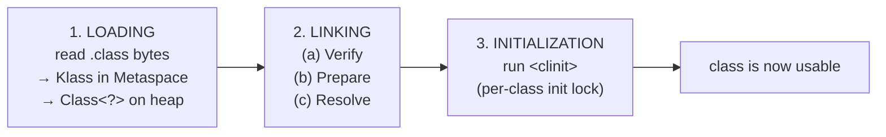
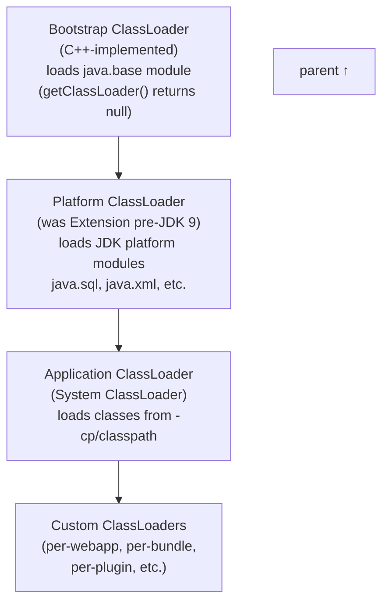
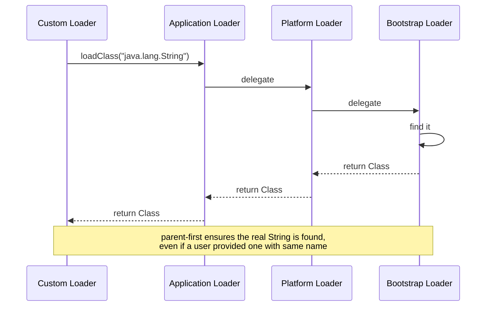
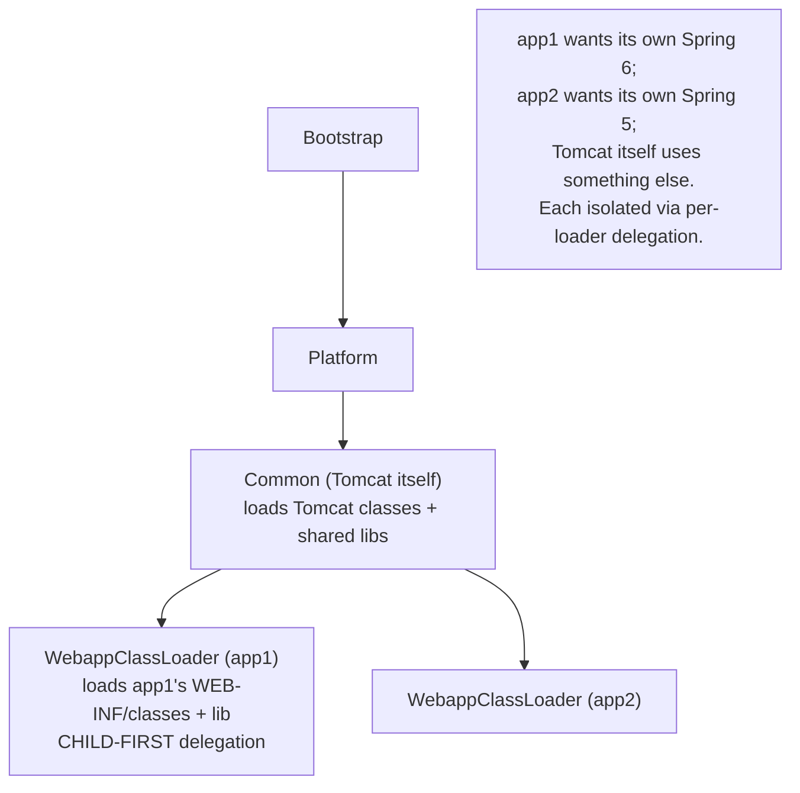

# Class Loading & Class Loaders

T01 placed class metadata in the **method area** (Metaspace since JDK 8). This topic covers how it *gets* there: the **class loading subsystem** is the JVM's gateway between the file system (or JAR, or network, or memory) and the runtime. Every `Class<?>` object in a Java program — every `String.class`, every user-defined class, every dynamically-generated proxy — was loaded by a **ClassLoader**, and that ClassLoader determines the class's *identity* (a class is `(name, defining ClassLoader)`, not just `name`), its *accessibility* (parent-first delegation prevents user code from spoofing `java.lang.String`), and its *lifetime* (a class can only be unloaded when its ClassLoader becomes unreachable — the source of *the* dominant production cause of Metaspace OOMs in app servers).

The depth-bar requirement isn't "ClassLoader.loadClass loads a class." At the **lifecycle** layer, every class moves through **three phases** — **Loading** (find and read the .class bytes; create the Klass structure in Metaspace + the `Class<?>` mirror on the heap), **Linking** (Verification of bytecode well-formedness + Preparation of static field slots with default values + Resolution of symbolic references), and **Initialization** (run `<clinit>` — static initializer block + static field assignments — under a per-class init lock that guarantees exactly-once initialization across all threads). At the **hierarchy** layer, the JVM ships a three-level **ClassLoader chain** — **Bootstrap** (C++-implemented, loads java.base), **Platform** (JDK 9+, the renamed Extension, loads JDK platform modules), **Application** (the system loader, loads `-cp` classes) — connected by a **parent-first delegation** algorithm that prevents class-spoofing attacks but is sometimes inverted by app servers (Tomcat's WebappClassLoader does *child-first*) for plugin isolation. At the **identity** layer, a class is uniquely identified by **(name, defining ClassLoader)** — the same `Logger.class` loaded by two different loaders produces two *different* `Class<?>` instances that cannot be assigned to each other, the root cause of `ClassCastException: X cannot be cast to X` in app servers. At the **leak** layer, a ClassLoader (and all its loaded classes) can only be GC'd when *no* references to it or its classes or instances remain — and a single `ThreadLocal` retained in a long-lived thread (typically a thread-pool worker) holding a webapp class is enough to retain the entire webapp's ClassLoader through 100s of redeploys, exhausting Metaspace.

> [!NOTE]
> Prerequisites: [JVM architecture & runtime data areas](./T01-jvm-architecture-and-runtime-data-areas.md) (L3/C02/T01) — Metaspace is where class metadata lives; [Thread-safety patterns](../C01-concurrency/T17-thread-safety-patterns.md) (L3/C01/T17) — ThreadLocal leaks are the canonical CL leak cause; [Virtual threads](../C01-concurrency/T14-virtual-threads-project-loom.md) (L3/C01/T14) — `<clinit>` is one of the remaining pinning sources; [Source to bytecode](../../L0-foundations/C01-cs-foundations/T04-source-to-bytecode-to-jvm-to-machine-code.md) (L0/C01/T04) — .class file structure.

## The Three-Phase Class Lifecycle

Every class moves through three phases before it can be used:



The phases happen in order, but they're not all eager:

- **Loading** is lazy — a class is loaded the first time it's referenced.
- **Linking** has eager and lazy parts (verify is eager; resolve is mostly lazy).
- **Initialization** is *exactly* lazy — happens at the *first active use* (defined precisely below).

### Phase 1 — Loading

The ClassLoader's `loadClass(String name)` is the entry point. The work:

1. Locate the `.class` bytes (file system, JAR, URL, in-memory generation).
2. Read the bytes; verify the magic number (`0xCAFEBABE`) and version.
3. Parse the constant pool, methods, fields, attributes.
4. Build the internal **Klass** structure (HotSpot's C++ data structure for "loaded class") in Metaspace.
5. Build the **`java.lang.Class<?>`** mirror object on the heap (this is what `String.class` is — the heap reflection of the Klass).
6. Return the `Class<?>` to the caller.

The result: a Class instance the JVM knows about, but whose static state is still uninitialized.

### Phase 2 — Linking

Three sub-phases:

#### Verification

Confirms the .class file is well-formed bytecode that won't break JVM invariants:

- Magic number and version are valid.
- Constant pool entries are well-typed and consistent.
- Each method's bytecode obeys the *operand stack discipline* (stack depth correct at every instruction; types match).
- Final classes aren't extended; final methods aren't overridden.
- Access modifiers are respected.
- The class hierarchy is well-formed.

Without verification, *malicious* bytecode could violate JVM invariants — overflow the operand stack, cast int to reference, access private fields. Verification is the gatekeeper.

`-Xverify:none` disables verification — *never* do this in production. Faster class loading, but loses security; only used for trusted, performance-critical scenarios (and even then, dubious).

#### Preparation

Allocate memory for **static fields** of the class; initialize them to *default values* (zero for primitives, null for references, false for booleans):

```java
static int counter;          // prepared to 0
static String name;           // prepared to null
static boolean enabled;       // prepared to false
```

**Static final compile-time constants** are technically prepared with their final values *during preparation* (not during initialization), enabling them to be accessible without triggering class init (more below):

```java
static final int MAX = 100;          // value 100 set during preparation, not <clinit>
```

#### Resolution

Replace **symbolic references** with **direct references**:

```text
Symbolic reference (in .class file constant pool):
  CONSTANT_Methodref → "java/util/HashMap.put:(LObject;LObject;)LObject;"

Resolved direct reference:
  pointer to HashMap.put's vtable entry in HashMap's Klass
```

Resolution is *lazy by default* in HotSpot — happens the first time the reference is used, not eagerly during linking. This enables loading classes that reference other classes not present at load time (graceful failure on actual use, not on load).

### Phase 3 — Initialization

Run `<clinit>` — the special method synthesized by `javac` containing:

- Static initializer blocks (`static { ... }`).
- Static field assignments with non-constant values.

```java
class Config {
    static int x = computeX();              // assignment in <clinit>
    static {                                 // explicit static block in <clinit>
        loadConfig();
    }
    static final int MAX = 100;              // NOT in <clinit> — prepared with value
}
```

`javac` emits `<clinit>` containing the runtime initialization steps in source order.

#### The init lock — exactly-once initialization

The JVM guarantees `<clinit>` runs **exactly once** per class per ClassLoader, even under concurrent thread access. Each Class has an internal **init lock**:

1. Thread A first accesses Config → triggers init → acquires Config's init lock → runs `<clinit>`.
2. Thread B accesses Config during init → tries to acquire init lock → **blocks** until A finishes.
3. Both threads observe a fully-initialized Config.

This is *the* reason singleton initialization via the **holder class idiom** (T12 — DCL alternative) works correctly:

```java
public class Singleton {
    private static class Holder { static final Singleton INSTANCE = new Singleton(); }
    public static Singleton getInstance() { return Holder.INSTANCE; }
}
```

Holder's `<clinit>` runs exactly once when `Holder.INSTANCE` is first accessed; the init lock provides the synchronization for free.

> [!IMPORTANT]
> **`<clinit>` pins virtual threads** even on JDK 24+ (T14). A VT inside a `<clinit>` block cannot unmount because the init lock is held; the carrier stays bound through whatever the init does. For warm classes — config loaders, framework bootstrap — initialize at JVM startup rather than first-request on hot paths to avoid pinning latencies on the request itself.

### When Initialization Is Triggered

The JLS specifies **active use** as the trigger — exactly these actions cause initialization (per JLS §12.4.1):

1. **Instance creation**: `new Config()`.
2. **Static field write or read** (except for compile-time constants).
3. **Static method invocation**.
4. **Reflective `Class.forName(name)`** (the 1-arg form, or `forName(name, true, loader)`).
5. **Subclass initialization** — initializing a subclass first initializes the parent.
6. **Class is the main class** of an application — `main()` invocation triggers it.
7. **Method handles** linked to the class.

What does **not** trigger initialization:

- Accessing a **static final compile-time constant**: `Math.PI` reads the value without initializing `Math` (the value was prepared).
- `Class.forName(name, false, loader)` — explicit "don't initialize" form.
- Loading by name without using (`ClassLoader.loadClass`).
- Reflective `Class<?>.getMethods()` or similar (loads but doesn't init).
- Declaring a field of the class type: `Config c;` doesn't init Config.

The distinction is *the* most commonly missed detail in class loading interview questions.

## The ClassLoader Hierarchy

The JDK ships three built-in ClassLoaders organized in a hierarchy:



### Bootstrap ClassLoader

The most-fundamental ClassLoader, implemented in **C++** as part of the JVM itself (not Java). Loads classes from the **java.base module** (and historically from `rt.jar`): `java.lang.Object`, `java.lang.String`, every core Java class.

Because it's not a Java object, `Object.class.getClassLoader()` returns `null`. This is the sentinel for "loaded by Bootstrap."

### Platform ClassLoader

Introduced (and renamed from Extension) in JDK 9. Loads the **JDK platform modules** that aren't in java.base: `java.sql`, `java.xml`, `java.scripting`, etc.

Accessible via `ClassLoader.getPlatformClassLoader()` since JDK 9. Pre-JDK 9 this was the "Extension ClassLoader" loading `$JAVA_HOME/lib/ext/*.jar`. The JDK 9 modularization renamed it and shifted its responsibilities.

### Application ClassLoader (System ClassLoader)

Loads classes from the **classpath** (`-cp`, `-classpath`, or `CLASSPATH` env var) and the **module path** (`--module-path`). This is the loader that loads *your* application code by default.

Accessible via `ClassLoader.getSystemClassLoader()` or `Thread.currentThread().getContextClassLoader()` (in normal scenarios).

### Custom ClassLoaders

User code can extend `ClassLoader` to create custom loaders. The standard subclasses:

- **`URLClassLoader`** — loads from a list of URLs (file: or http: or jar:).
- **Web app loaders** — Tomcat's `WebappClassLoader`, Jetty's `WebAppClassLoader`.
- **OSGi bundle loaders** — one per OSGi bundle for isolation.
- **JDK ServiceLoader internal loaders** — for SPI resolution.
- **Spring DevTools loader** — for hot-reload.
- **Bytecode generation loaders** — used by Hibernate, Spring proxies, CGLIB.

## Parent-First Delegation

The standard `ClassLoader.loadClass(name)` algorithm:

```java
public Class<?> loadClass(String name) throws ClassNotFoundException {
    // 1. Check cache
    Class<?> loaded = findLoadedClass(name);
    if (loaded != null) return loaded;

    try {
        // 2. Delegate to parent
        if (parent != null) return parent.loadClass(name);
        else return findBootstrapClass(name);
    } catch (ClassNotFoundException e) {
        // 3. Parent couldn't find it; try locally
        return findClass(name);
    }
}
```

The algorithm: **always try the parent first, then yourself**. The chain bottoms out at Bootstrap; if nobody can find the class, `ClassNotFoundException` propagates.

### Why parent-first?

Two reasons:

1. **Class-spoofing prevention.** If a user-supplied class called `java.lang.String` were loaded by the Application ClassLoader, code expecting the real `java.lang.String` would be confused — security disaster. Delegating to Bootstrap first guarantees the real `java.lang.String` always wins.
2. **Class sharing.** Classes loaded by parent loaders are *shared* across all child loaders. If three webapps in the same Tomcat all use the JDK's `HashMap`, only *one* HashMap class lives in Metaspace — loaded by Bootstrap, visible to all.



## Class Identity — `(name, ClassLoader)`

Two `Class<?>` instances are equal **if and only if** their **defining ClassLoader** is the same. The same `.class` file loaded by two different loaders produces two **distinct** `Class<?>` instances:

```java
ClassLoader cl1 = new URLClassLoader(jarUrls);
ClassLoader cl2 = new URLClassLoader(jarUrls);

Class<?> c1 = cl1.loadClass("com.x.Foo");
Class<?> c2 = cl2.loadClass("com.x.Foo");

c1 == c2;                  // false — different defining loaders → different classes
c1.getName().equals(c2.getName());   // true — same name

Foo foo = (Foo)(Object) c2.getDeclaredConstructor().newInstance();
// ✗ ClassCastException: com.x.Foo cannot be cast to com.x.Foo
// (the static-type Foo was loaded by ClassLoader X; the instance is class loaded by Y)
```

The `ClassCastException: com.x.Foo cannot be cast to com.x.Foo` is *the* class-loader-identity error, beloved of confused app-server developers.

**Defining loader** vs **initiating loader**:

- **Defining loader**: the loader that actually called `defineClass(bytes)` and is recorded as the class's owner.
- **Initiating loader**: the loader whose `loadClass` was called externally.

In parent-first delegation, the *initiating* loader is the child (you called it), but the *defining* loader is the parent (it actually defined the class). The class identity is by *defining*, not *initiating*.

## Web App / OSGi Pattern — Child-First Delegation

Tomcat's `WebappClassLoader` (and OSGi bundle loaders) deliberately **invert** the standard delegation: try locally first, fall back to parent. The reason: enable per-webapp library versioning.



The child-first algorithm:

```java
public Class<?> loadClass(String name) throws ClassNotFoundException {
    Class<?> loaded = findLoadedClass(name);
    if (loaded != null) return loaded;

    // CHILD-FIRST: try local first
    try {
        return findClass(name);
    } catch (ClassNotFoundException e) {
        return parent.loadClass(name);
    }
}
```

Exception: `java.*` and `javax.*` classes are still delegated to parent (security — webapps can't replace core classes).

### The class-loader-identity bug in practice

Tomcat scenario: a JDBC driver is loaded in WEB-INF/lib (webapp loader). The driver registers itself with `java.sql.DriverManager`. `DriverManager` is loaded by Bootstrap. The registration stores a reference from `DriverManager` (Bootstrap) to the driver class (Webapp loader). Even after the webapp is undeployed, `DriverManager` still holds the reference — *retaining the entire webapp ClassLoader and all its classes in Metaspace*.

This is the canonical class-loader-leak pattern; fix is to deregister the driver on webapp shutdown (`ServletContextListener.contextDestroyed()`).

## Class Loader Leaks → Metaspace OOM

A ClassLoader (and all classes it loaded) can be unloaded **only when** all of these hold:

1. The ClassLoader instance itself is unreachable from GC roots.
2. All `Class<?>` instances loaded by it are unreachable.
3. All *instances* of those classes are unreachable.

If *any* reference survives — to the loader, to a class, to an instance — *the entire ClassLoader stays alive*, and its classes stay in Metaspace forever. Repeat over 100s of webapp redeploys and you exhaust Metaspace → `OutOfMemoryError: Metaspace`.

### The Five Canonical Leak Causes

1. **ThreadLocal retained in thread-pool workers.**
   A long-lived thread pool's `Thread` object holds a `ThreadLocalMap`. If a `ThreadLocal` value references a webapp class, the entry retains the webapp ClassLoader.
   *Fix*: clear ThreadLocals on webapp shutdown; or use `ScopedValue` (T14) which auto-clears.

2. **JDBC driver registration (above).**
   `DriverManager` holds driver class references.
   *Fix*: deregister via `DriverManager.deregisterDriver(driver)` on shutdown.

3. **java.util.logging Logger retention.**
   `java.util.logging` keeps logger references that retain webapp classes.
   *Fix*: log4j2 / Logback don't have this issue; or explicitly remove loggers on shutdown.

4. **Static fields in parent-loaded classes referring to webapp classes.**
   A library loaded by the Common loader caches a webapp's class in a static field.
   *Fix*: use weak references; clear on shutdown.

5. **JNI/native code retaining JVM globals.**
   Native code's global refs (`NewGlobalRef`) hold classes.
   *Fix*: pair every `NewGlobalRef` with `DeleteGlobalRef` in unload.

### Diagnosing class loader leaks

#### `jcmd <pid> VM.classloaders`

Lists all live ClassLoaders, their parents, and the number of classes each has loaded. Increasing counts after redeploy → leak.

#### `jcmd <pid> GC.class_histogram | head -20`

Shows top classes by instance count. After redeploying a webapp, look for the *same* class (e.g., `com.myapp.UserService`) appearing multiple times — one entry per stale loader.

#### Heap dump analysis (Eclipse MAT, JDK Mission Control)

Find ClassLoader instances; for each, check its "retained heap" — what would be freed if the loader were collected. The largest retained-heap loaders are the leakers. MAT's *Leak Suspects Report* automates this for the common patterns.

#### NMT (Native Memory Tracking)

Enables `-XX:NativeMemoryTracking=summary`. Then `jcmd VM.native_memory` shows Metaspace growth over baselines.

## JPMS — Java Platform Module System

JDK 9 introduced **modules** as a unit of code organization above packages, with explicit dependencies and exports:

```java
// module-info.java
module com.example.app {
    requires java.sql;                       // depend on java.sql
    requires com.example.lib;
    exports com.example.app.api;             // expose this package
    // non-exported packages are encapsulated
}
```

JPMS gives:

- **Strong encapsulation**: non-exported packages cannot be accessed from outside the module — even via reflection (mostly; `--add-opens` overrides for legacy code).
- **Explicit dependencies**: missing `requires` produces compile-time and load-time errors.
- **Reliable configuration**: module graph is validated at startup; cycles forbidden; missing modules detected early.

### Modules and ClassLoaders

The JDK modules are split between Bootstrap and Platform loaders:

- **Bootstrap**: java.base.
- **Platform**: most other java.* and jdk.* modules.

User modules can be loaded by:

- **Application loader** — modules on `--module-path`.
- **Custom layered loaders** — for advanced JPMS use cases.

### Named vs unnamed modules

- **Named module**: declared via `module-info.java`; participates in the module graph.
- **Unnamed module**: classes on the classpath (`-cp`); all classpath classes belong to the "unnamed module" of their ClassLoader.
- **Automatic module**: a JAR on the module path without `module-info.java`; gets a synthesized module name.

The migration story: most JDK-9-or-later code still has classpath-based parts (the "unnamed module") interoperating with modular parts. JPMS is opt-in; the JDK itself is fully modularized but applications can still use traditional classpath only.

## Runtime Class Loading

Apart from the JVM's automatic loading on first reference, code can load classes at runtime:

```java
// Triggers initialization (default)
Class<?> c = Class.forName("com.x.Foo");

// Explicit: don't initialize; use a specific ClassLoader
Class<?> c = Class.forName("com.x.Foo", false, classLoader);

// Load without initializing; explicit ClassLoader
Class<?> c = classLoader.loadClass("com.x.Foo");
```

Use cases:

- **JDBC drivers (legacy)**: `Class.forName("com.mysql.cj.jdbc.Driver")` triggers static block that registers with `DriverManager`. Pre-Java-6 pattern; superseded by `ServiceLoader` since JDBC 4 (just put the driver JAR on the classpath).
- **Plugins**: load a plugin's main class via reflection.
- **Bytecode generation**: dynamically generate classes (CGLIB, javassist, ByteBuddy) and define them via `ClassLoader.defineClass(bytes)`.
- **Hot reload**: load updated `.class` files at runtime.

## CDS — Class Data Sharing

**AppCDS** (Application Class Data Sharing, JEP 310 / JEP 341, JDK 10–12) pre-computes a shared memory image of loaded classes that the JVM can `mmap` at startup, skipping the cost of re-loading + verifying every class on every JVM start.

Workflow:

```bash
# 1. Record which classes are loaded
java -XX:ArchiveClassesAtExit=app.jsa -cp myapp.jar com.x.Main

# 2. Use the archive on subsequent runs
java -XX:SharedArchiveFile=app.jsa -cp myapp.jar com.x.Main      # faster startup
```

Reduces startup time by 30–60% for typical Spring Boot apps. The JVM itself has a default CDS archive (`-XX:+UseSharedSpaces`, default since JDK 12) covering core JDK classes.

For serverless / Lambda / CLI scenarios where startup time matters, AppCDS is the easy win. For long-running servers, the savings are amortized over uptime and matter less.

## Common Mistakes

### Calling `Class.forName(...)` in a hot loop

Even after init, `forName` performs ClassLoader resolution — small but real overhead. Cache the resolved `Class<?>`.

### Disabling verification

`-Xverify:none` is a security regression. Don't.

### Relying on classpath order for behavior

If two JARs both contain `com.x.Foo`, behavior depends on classpath order. Mavenize properly; use the module system; never rely on duplicated classes.

### Casting across ClassLoaders

If you receive an object from another ClassLoader's class, casting to your loader's class throws `ClassCastException`. Use reflection or interface-based access through a shared parent loader.

### Letting ThreadLocals retain webapp classes

The #1 ClassLoader leak source. Clear on shutdown via `ServletContextListener`, or use ScopedValue (T14).

### Initializing classes lazily in hot request paths

A class loaded at first request adds startup latency to the *unlucky* request. For warm classes, force initialization at app startup (`Class.forName("...")` in a startup hook).

### Mixing module path and classpath inconsistently

A class can appear in both; behavior is subtle. Prefer one or the other for new code.

## Practice

1. **List all ClassLoaders.** Write a program that walks from `getClass().getClassLoader()` up via `getParent()` to Bootstrap (null). Print each loader's class.
2. **Trigger init explicitly.** Define a class with a static block that prints. Verify which actions trigger init: `new`, static field read/write, static method, `Class.forName(name, true, loader)`, `Class.forName(name, false, loader)`.
3. **Static final constant trick.** Define `static final int X = 100;`. From another class, read `Cls.X`. Verify `<clinit>` did NOT run. Change to `static final int X = computeIt();` — verify it now runs.
4. **Holder class singleton.** Implement Singleton via the holder-class idiom; race threads through getInstance(); verify exactly-one construction.
5. **Custom ClassLoader from bytes.** Write a ClassLoader that loads a class from in-memory bytes. Use it to load a dynamically-generated class via `defineClass`.
6. **Class identity via different loaders.** Load the same class via two URLClassLoaders; verify the resulting Class instances are not equal; demonstrate the ClassCastException.
7. **Tomcat-style child-first delegation.** Implement a ChildFirstClassLoader. Demonstrate that it loads a local version of a class even if the parent has one.
8. **Class loader leak reproduction.** In a "webapp simulator," register a ThreadLocal containing a webapp object on a thread-pool worker. Discard the webapp ClassLoader. Verify (via heap dump) the loader is retained. Add explicit cleanup; verify it's collected.
9. **JPMS basics.** Create a small modular project with two modules; demonstrate requires/exports and how a non-exported package is inaccessible.
10. **AppCDS.** Run a Spring Boot app twice — once recording AppCDS, once using it. Measure startup time difference.
11. **`jcmd VM.classloaders`.** On a running Java app, print classloaders; identify the hierarchy.
12. **Diagnose Metaspace OOM.** Reproduce a class loader leak (loop loading + discarding URLClassLoaders); set `-XX:MaxMetaspaceSize=64m`; observe OOM; capture heap dump; trace the retention chain.

## Recap

You should now be able to:

- Walk through the **three class-lifecycle phases**: **Loading** (read .class bytes → Klass in Metaspace + Class mirror on heap), **Linking** (Verification + Preparation + Resolution), **Initialization** (run `<clinit>` under per-class init lock).
- State the **active-use triggers** for initialization (new, static read/write, static method, forName with init, subclass init, main, method handles) and the **non-triggers** (static final constants, forName(false), loadClass, type declaration).
- Recognize the **init lock** as the JVM's exactly-once guarantee for `<clinit>` — and the *one remaining VT pinning source* on JDK 24+ (T14).
- Recite the **three-level ClassLoader hierarchy** (Bootstrap C++ → Platform → Application), the JDK 9 rename from Extension to Platform, and the **parent-first delegation** algorithm (cache → parent → local).
- Explain **why parent-first**: class-spoofing prevention + class sharing across child loaders.
- State the **class identity rule**: a Class is identified by `(name, defining ClassLoader)`. The same .class loaded by two loaders produces two distinct Class instances; cross-cast throws `ClassCastException: X cannot be cast to X`.
- Distinguish **defining loader** (called defineClass) from **initiating loader** (called loadClass externally) — identity is by defining.
- Use **custom ClassLoaders**: extend ClassLoader, override findClass; URLClassLoader for URL-based loading; web app loaders for per-webapp isolation; bytecode generators for runtime class generation.
- Understand **child-first delegation** in Tomcat WebappClassLoader (and OSGi bundles) for plugin isolation; recognize that `java.*` and `javax.*` are still parent-delegated.
- Identify the **five canonical CL leak causes**: ThreadLocal in pool threads, JDBC driver registration, java.util.logging, static fields in parent-loaded classes referring to child-loaded ones, JNI global refs. Recognize that *any* surviving reference retains the entire loader → Metaspace OOM.
- Diagnose CL leaks via **`jcmd VM.classloaders`**, **`GC.class_histogram`**, and heap-dump analysis (Eclipse MAT, JMC).
- Understand **JPMS** basics: module-info.java; requires/exports; strong encapsulation; named vs unnamed vs automatic modules; how JDK modules split between Bootstrap and Platform loaders.
- Use **runtime loading**: `Class.forName(name)` (initializes); `Class.forName(name, false, loader)` (doesn't); `ClassLoader.loadClass(name)` (no init); the legacy JDBC-driver-registration pattern.
- Apply **AppCDS** for startup-sensitive workloads: record on first run; mmap on subsequent runs; 30–60% startup reduction.
- Avoid the **seven common pitfalls**: forName in hot loops, disabled verification, classpath-order dependence, cross-loader casts, ThreadLocal-retained classes, lazy class init in hot paths, inconsistent module-path/classpath mixing.

## Next

Continue to [Bytecode basics](./T03-bytecode-basics.md) — the actual *instructions* the JVM executes. We'll dissect the .class file structure (magic number, constant pool, access flags, fields, methods, attributes), the bytecode instruction families (load/store, arithmetic, branches, invocation, object creation), the operand stack semantics, `javap -v` output reading, the four `invoke*` instructions (invokevirtual / invokestatic / invokespecial / invokeinterface / invokedynamic), and how `synchronized` lowers to `monitorenter`/`monitorexit` plus exception-table-emitted release.
