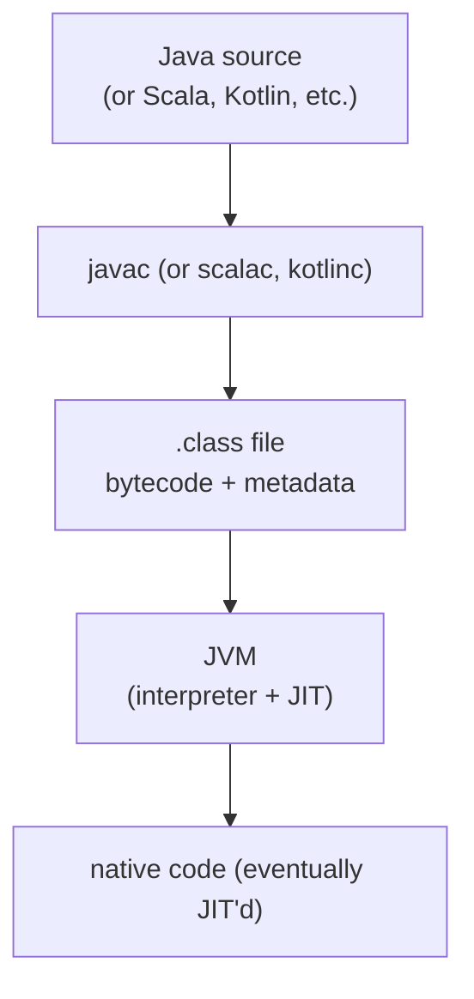
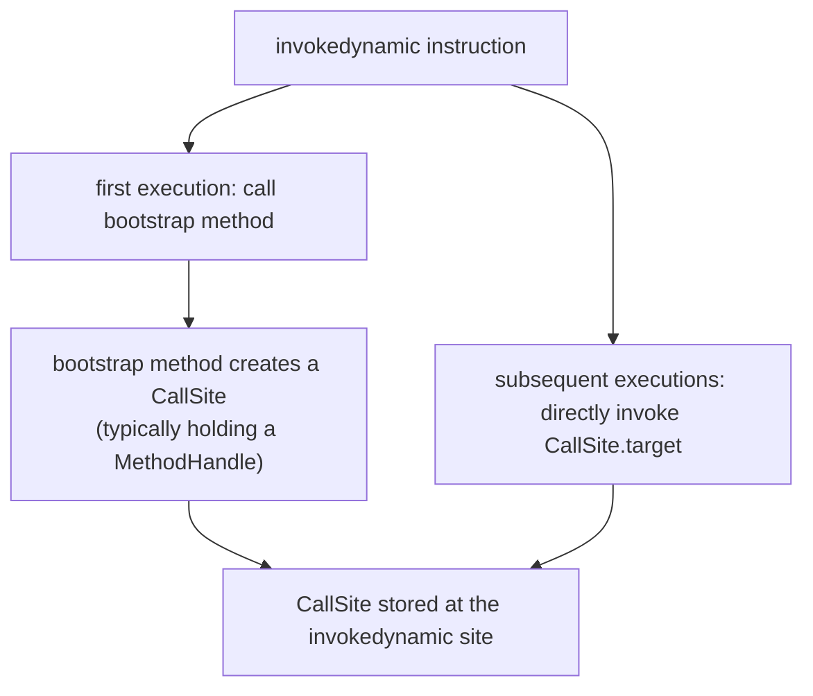

# Bytecode Basics

T01 placed bytecode in the **method area** (Metaspace); T02 traced how a `.class` file gets there. This topic dissects the bytecode *itself* — the JVM's instruction set, the on-disk `.class` file format that encodes it, and the operational semantics every instruction obeys when executed by the interpreter or compiled by the JIT (T04). Bytecode is the *contract* between `javac` (and every other language compiler targeting the JVM — Scala, Kotlin, Clojure, Groovy) and the JVM: a portable, verified, stack-based instruction format that the JVM has spent 30 years optimizing.

The depth-bar requirement isn't "the JVM has bytecode." At the **format** layer, every `.class` file follows the JVMS structure — **magic number** `0xCAFEBABE`, version, **constant pool** (every name/type/literal is indexed here), access flags, this/super/interfaces, fields, methods, attributes — with the *Code attribute* on each method containing the actual bytecode bytes plus the operand-stack depth and locals-array size declared at compile time. At the **instruction** layer, ~200 opcodes organize into recognizable families — *load/store* (move between local-variable slots and operand stack), *constants* (push immediate values), *arithmetic*, *type conversion*, *comparison and control flow*, *object operations* (new/getfield/putfield/instanceof/checkcast), *stack manipulation* (dup/pop/swap), *synchronization* (monitorenter/monitorexit + ACC_SYNCHRONIZED flag), and the **5 `invoke*`** instructions for method dispatch (`invokestatic`/`invokespecial`/`invokevirtual`/`invokeinterface`/`invokedynamic`). At the **dispatch** layer, `invokevirtual` uses a per-class **vtable** for O(1) virtual dispatch, `invokeinterface` uses a per-class **itable** (slightly slower; cleaned up by JIT inlining), and **`invokedynamic`** (JDK 7+) defers linking to a **bootstrap method** that returns a **CallSite** holding a **MethodHandle** — the foundation of lambdas, indified string concatenation, record accessors, and the entire modern reflective/functional surface. We will cover all three layers, with `javap -v` output as the ground truth, real method examples for `add`/`max`/`synchronized`, and a tour of the bytecode-manipulation libraries (ASM, ByteBuddy, Javassist) that power Spring AOP, Hibernate, Mockito, JaCoCo, and most APM agents.

> [!NOTE]
> Prerequisites: [Class loading & class loaders](./T02-class-loading-and-class-loaders.md) (L3/C02/T02) — bytecode is read during the Loading phase; [JVM architecture & runtime data areas](./T01-jvm-architecture-and-runtime-data-areas.md) (L3/C02/T01) — the operand stack and locals array bytecode operates on; [synchronized, monitors & intrinsic locks](../C01-concurrency/T03-synchronized-monitors-and-intrinsic-locks.md) (L3/C01/T03) — the monitorenter/monitorexit + ACC_SYNCHRONIZED pair; [Source to bytecode](../../L0-foundations/C01-cs-foundations/T04-source-to-bytecode-to-jvm-to-machine-code.md) (L0/C01/T04) — overview from L0.

## What Bytecode Is

The JVM's instruction set: ~200 opcodes (one byte each, hence "byte" code), executed on the **operand stack** of each method's frame. Every Java program — every Scala, Kotlin, Clojure, Groovy program targeting the JVM — compiles to these instructions. The platform-independence of "write once, run anywhere" is that bytecode runs identically on every JVMS-conformant JVM (HotSpot, OpenJ9, GraalVM, Zing, ...).

Key properties:

- **Stack-based.** Operations consume operands from the operand stack and push results. No registers in the bytecode model.
- **Typed.** Each instruction operates on a specific type — `iadd` (int add) is a different opcode from `ladd` (long add) and `dadd` (double add).
- **Variable-length.** Most instructions are 1 byte; some take 1, 2, or 4 byte operands.
- **Verified.** The JVM's bytecode verifier (T02 — Verification phase) checks every instruction sequence for stack discipline, type correctness, and access rights before execution.



## The `.class` File Format

Every `.class` file is a sequence of binary structures defined by the JVMS:

```text
ClassFile {
    u4              magic;              // 0xCAFEBABE
    u2              minor_version;
    u2              major_version;      // 65 = JDK 21
    u2              constant_pool_count;
    cp_info         constant_pool[];    // entries indexed 1..count-1
    u2              access_flags;       // ACC_PUBLIC, ACC_FINAL, etc.
    u2              this_class;         // index into constant_pool
    u2              super_class;
    u2              interfaces_count;
    u2              interfaces[];
    u2              fields_count;
    field_info      fields[];
    u2              methods_count;
    method_info     methods[];
    u2              attributes_count;
    attribute_info  attributes[];        // SourceFile, NestHost, Record, etc.
}
```

The **magic number** `0xCAFEBABE` is the first 4 bytes — a sanity check (and a charming bit of trivia). The version identifies the JDK that produced the file:

| Major version | JDK |
|--------------:|------|
| 52 | 8 |
| 55 | 11 |
| 61 | 17 |
| 65 | 21 |
| 67 | 23 |
| 68 | 24 |

A class compiled with target 21 (major 65) cannot be loaded by an older JVM. `javac --release 11` or `--release 17` targets older versions explicitly.

### The Constant Pool

The **constant pool** is the central reference table for the entire class. Everything indexed: every class name, every method signature, every string literal, every numeric constant. The pool has ~13 entry types, each tagged:

| Tag | Type | Holds |
|----:|------|-------|
| 1 | CONSTANT_Utf8 | UTF-8 string bytes (every name, signature, literal) |
| 3 | CONSTANT_Integer | int constant |
| 4 | CONSTANT_Float | float constant |
| 5 | CONSTANT_Long | long constant |
| 6 | CONSTANT_Double | double constant |
| 7 | CONSTANT_Class | class reference (→ Utf8 with class name) |
| 8 | CONSTANT_String | string literal (→ Utf8) |
| 9 | CONSTANT_Fieldref | field reference (→ Class + NameAndType) |
| 10 | CONSTANT_Methodref | method reference |
| 11 | CONSTANT_InterfaceMethodref | interface method reference |
| 12 | CONSTANT_NameAndType | name + type signature (→ 2× Utf8) |
| 15 | CONSTANT_MethodHandle | MethodHandle (since JDK 7) |
| 16 | CONSTANT_MethodType | MethodType (since JDK 7) |
| 18 | CONSTANT_InvokeDynamic | invokedynamic target (since JDK 7) |
| 19/20 | CONSTANT_Module/Package | JDK 9+ for JPMS |

Entries reference other entries by 1-based index. A `CONSTANT_Methodref` references a `CONSTANT_Class` (the method's owner) and a `CONSTANT_NameAndType` (method name + signature), each of which references `CONSTANT_Utf8` strings. **Every instruction that names a class, method, or field carries a constant-pool index, not a string** — bytecode is compact because of this.

### The Code Attribute

Each method has a `Code` attribute holding the actual bytecode:

```text
Code_attribute {
    u2              max_stack;          // max operand-stack depth
    u2              max_locals;          // size of locals array
    u4              code_length;
    u1              code[code_length];   // the bytecode bytes
    u2              exception_table_length;
    exception_table[]                    // try/catch ranges
    u2              attributes_count;
    attribute_info  attributes[];        // LineNumberTable, LocalVariableTable, StackMapTable
}
```

The JVM uses `max_stack` and `max_locals` to allocate frame space when the method is invoked (T01). The `code[]` array is the bytecode the interpreter executes. The exception table maps bytecode ranges to handlers. Sub-attributes provide debug info (line numbers, local variable names) and verification info (StackMapTable).

## Reading Bytecode — `javap -v`

The canonical tool is `javap`, included with the JDK:

```bash
javac MyClass.java
javap -v MyClass.class
```

Common flags:

- `-v`: verbose (everything — constant pool, code, attributes).
- `-c`: code only.
- `-p`: include private members.
- `-l`: include LineNumberTable and LocalVariableTable.
- `-s`: signatures only.

A minimal example:

```java
public class Add {
    public int add(int a, int b) { return a + b; }
}
```

`javap -v Add.class` produces (heavily abridged):

```text
public class Add
  minor version: 0
  major version: 65
  flags: (0x0021) ACC_PUBLIC, ACC_SUPER

Constant pool:
   #1 = Methodref          #2.#3          // java/lang/Object."<init>":()V
   #2 = Class              #4             // java/lang/Object
   #3 = NameAndType        #5:#6          // "<init>":()V
   #4 = Utf8               java/lang/Object
   ...

public int add(int, int);
  descriptor: (II)I
  flags: (0x0001) ACC_PUBLIC
  Code:
    stack=2, locals=3, args_size=3
       0: iload_1            // push a (local 1)
       1: iload_2            // push b (local 2)
       2: iadd               // pop 2 ints, push their sum
       3: ireturn            // pop and return
```

Four lines of bytecode produce one Java line. The descriptor `(II)I` is the method signature: takes two ints, returns int.

## The Major Instruction Families

### Load/Store — Move Between Locals and Operand Stack

| Instruction | Effect |
|---|---|
| `iload_0` ... `iload_3` | push local int slot 0..3 |
| `iload N` | push local int slot N (N > 3, 1-byte operand) |
| `aload_0` ... `aload_3` | push local reference |
| `lload_0` ... `lload_3` | push local long |
| `istore_0` ... `istore_3` | pop int to local |
| `astore_0` ... `astore_3` | pop reference to local |

The `_0` ... `_3` variants are *single-byte* shortcuts; for slot N > 3, the 2-byte `iload N` form is used. This is why method parameters (always low slots — `this` in slot 0, then params) get fast access.

`lload`/`lstore` (long), `fload`/`fstore` (float), `dload`/`dstore` (double) follow the same pattern; long and double take 2 slots in the locals array.

### Constants — Push Immediate Values

| Instruction | Pushes |
|---|---|
| `iconst_m1` | -1 |
| `iconst_0` ... `iconst_5` | 0..5 |
| `bipush byte` | sign-extended 1-byte int |
| `sipush short` | sign-extended 2-byte int |
| `ldc index` | from constant pool (any 4-byte constant) |
| `ldc_w index` | from constant pool (wide, 2-byte index) |
| `ldc2_w index` | long or double from constant pool |
| `aconst_null` | null |
| `lconst_0`, `lconst_1` | long 0 or 1 |

Small constants (-1 to 5) get their own opcodes; larger ones use `bipush`/`sipush`/`ldc`. String literals all use `ldc` referencing a `CONSTANT_String` entry.

### Arithmetic

| Instruction | Effect |
|---|---|
| `iadd`/`isub`/`imul`/`idiv`/`irem`/`ineg` | int arithmetic |
| `ladd`/`lsub`/... | long |
| `fadd`/... | float |
| `dadd`/... | double |
| `iinc local, delta` | increment local in place (no stack churn) |

`iinc` is special: it modifies a local variable directly without going through the operand stack. Used for loop counters — `for (int i = 0; i < n; i++)` compiles to `iinc 1, 1` per iteration, not `iload+iconst_1+iadd+istore`.

### Type Conversion

| Instruction | Effect |
|---|---|
| `i2l`/`i2f`/`i2d` | int to long/float/double (widening) |
| `l2i`/`l2f`/`l2d` | long to int/float/double |
| `f2i`/`f2l`/`f2d` | float to int/long/double |
| `d2i`/`d2l`/`d2f` | double to int/long/float |
| `i2b`/`i2c`/`i2s` | int to byte/char/short (narrowing) |

The narrowing int-to-byte/char/short instructions implement the silent narrowing in Java's primitive type system. Casts in source code (`(byte) x`) compile to `i2b`.

### Comparison and Control Flow

| Instruction | Effect |
|---|---|
| `if_icmpeq target` | pop 2 ints; branch if equal |
| `if_icmpne`/`if_icmpgt`/`if_icmple` | other comparisons |
| `if_acmpeq`/`if_acmpne` | reference comparison (==) |
| `ifeq target` | pop 1 int; branch if zero |
| `ifne`/`iflt`/`ifgt`/`ifle`/`ifge` | compare to zero |
| `ifnull`/`ifnonnull` | reference null check |
| `lcmp`/`fcmpl`/`fcmpg`/`dcmpl`/`dcmpg` | compare longs/floats/doubles, push -1/0/1 |
| `goto target` | unconditional branch |
| `tableswitch` | dense switch (jump table) |
| `lookupswitch` | sparse switch (binary search) |
| `ireturn`/`lreturn`/`freturn`/`dreturn`/`areturn`/`return` | return from method |
| `athrow` | throw exception from operand stack |

`tableswitch` is used when switch cases are dense (consecutive integers); `lookupswitch` for sparse cases (large gaps). `javac` picks based on the source switch.

### Object Operations

| Instruction | Effect |
|---|---|
| `new ClassRef` | allocate object (constructor not yet called); push reference |
| `newarray type` | allocate primitive array |
| `anewarray ClassRef` | allocate reference array |
| `multianewarray ClassRef, dims` | multi-dim array |
| `getfield FieldRef` | pop reference, push field value |
| `putfield FieldRef` | pop value + reference, store |
| `getstatic FieldRef` | push static field value |
| `putstatic FieldRef` | pop, store static |
| `instanceof ClassRef` | pop reference, push int (0/1) |
| `checkcast ClassRef` | check or throw `ClassCastException` |
| `arraylength` | pop array ref, push length |

`new` is *not* the same as the Java `new`! It only allocates; the constructor (`<init>`) must be invoked separately via `invokespecial`. So `new Foo()` in Java compiles to:

```text
new #Foo                     ; allocate Foo; push reference
dup                           ; duplicate (one for invokespecial, one for result)
invokespecial Foo."<init>":()V  ; pop ref, run constructor
                              ; the duplicate reference is left on stack
```

### Stack Manipulation

| Instruction | Effect |
|---|---|
| `dup` | duplicate top 1-slot value |
| `dup2` | duplicate top 2-slot value (long/double) |
| `pop` | discard top 1-slot value |
| `pop2` | discard top 2-slot value |
| `swap` | swap top two 1-slot values |
| `dup_x1` | insert duplicate below 1 slot |
| `dup_x2` | insert duplicate below 2 slots |
| `dup2_x1` / `dup2_x2` | wide variants |

These are essential glue between operations — duplicating before consuming, reordering for operand fit. Hand-written rare; compiler-generated routinely.

### Synchronization

```text
monitorenter   ; pop reference, acquire its monitor (T03 from C01)
monitorexit    ; pop reference, release its monitor
```

Plus the `ACC_SYNCHRONIZED` method flag — when set on a method, the JVM acquires the monitor at method entry and releases at exit (normal or exceptional). T03 (C01) covered the two forms in full.

## The Five `invoke*` Instructions

Method dispatch in Java has *five* distinct bytecodes:

### `invokestatic` — class method, no receiver

```java
Math.max(a, b);   // class method
```

Looks up the method in the class's static method table. No `this`, no virtual dispatch — *fast*. The JIT typically inlines `invokestatic` calls when the target is small (e.g., `Math.max`).

### `invokespecial` — constructors, super calls, private methods

```java
new Foo();              // invokespecial Foo.<init>
super.method();         // invokespecial Super.method
this.privateMethod();   // invokespecial — pre-JDK-9 (JDK 11+ uses invokevirtual for private)
```

No virtual dispatch — the *exact* method named is invoked. Used for cases where dispatch must be fixed: `<init>`, super calls, and (historically) private methods.

### `invokevirtual` — normal instance method dispatch

```java
obj.method();
```

The most common form. Dispatches through the object's class's **vtable** (virtual method table). The vtable is a per-Klass array of method pointers; the called method's vtable slot is constant per class hierarchy, so dispatch is one indirection: `obj.klass->vtable[methodIndex]`. The JIT can often *devirtualize* — analyze the class hierarchy and discover the call site is monomorphic (only one possible target), then inline.

### `invokeinterface` — interface method dispatch

```java
List<String> list = ...;
list.add(x);   // invokeinterface List.add
```

Interface dispatch is harder than virtual: a class can implement many interfaces, each with its own method ordering. The JVM uses an **itable** (interface method table) — for each implemented interface, a method-pointer array indexed by interface-method index. Dispatch: find the right itable (linear scan of implemented interfaces), then index into it. More expensive than `invokevirtual`, but the JIT's optimizations (inline caches, devirtualization) make it equivalent in practice for monomorphic call sites.

### `invokedynamic` — bootstrap-based dispatch (since JDK 7)

The most flexible — and the foundation of every modern Java feature that needs runtime-customizable dispatch:

```java
Runnable r = () -> System.out.println("hello");   // lambda → invokedynamic
String s = "x" + value + "y";                       // JDK 9+ — invokedynamic (indified)
```

The mechanism:

1. **At compile time**, `javac` emits an `invokedynamic` instruction that names a **bootstrap method** (a static method in the same or another class) and the desired functional shape.
2. **On first execution**, the JVM calls the bootstrap method, passing context about the call site.
3. **The bootstrap method returns a `CallSite`** holding a `MethodHandle` — the actual implementation.
4. **On every subsequent call**, the `invokedynamic` instruction directly invokes the `CallSite`'s `MethodHandle` — no bootstrap call needed.



#### `invokedynamic` use cases

- **Lambdas (JDK 8+)**: the lambda metafactory's bootstrap creates a tiny synthetic class implementing the functional interface, returning its instance via the CallSite.
- **String concatenation (JDK 9+)**: `"a" + b + "c"` no longer uses `StringBuilder` — `javac` emits `invokedynamic` to a "string concat factory" that builds an optimized concat strategy per call site (often pre-computing total length).
- **Record `toString`/`equals`/`hashCode` (JDK 14+)**: same pattern — bootstrap returns a CallSite that reads the record's fields and produces the right output.
- **Pattern matching (JDK 21+)**: invokedynamic-based dispatch for sealed-class match expressions.

`invokedynamic` is the JVM's *open* dispatch primitive — any language or feature that needs runtime-customizable linking uses it.

## Reading Real Bytecode — Three Examples

### 1. A simple loop

```java
public int sum(int n) {
    int s = 0;
    for (int i = 0; i < n; i++) s += i;
    return s;
}
```

Bytecode (`javap -c`):

```text
   0: iconst_0          ; s = 0
   1: istore_2          ; store to slot 2
   2: iconst_0          ; i = 0
   3: istore_3          ; store to slot 3
   4: iload_3           ; push i
   5: iload_1           ; push n
   6: if_icmpge 20      ; if i >= n, goto 20 (loop exit)
   9: iload_2           ; push s
  10: iload_3           ; push i
  11: iadd              ; s + i
  12: istore_2          ; s = s + i
  13: iinc 3, 1         ; i++ (direct increment of slot 3)
  16: goto 4            ; loop back
  20: iload_2           ; push s
  21: ireturn           ; return s
```

Note the `iinc 3, 1` for `i++` — direct increment without stack churn. The compiler's clever shortcut for loop counters.

### 2. Synchronized method

```java
public synchronized void inc() { count++; }
```

Bytecode (the `ACC_SYNCHRONIZED` flag is in the method header, not as instructions):

```text
public synchronized void inc();
  flags: (0x0021) ACC_PUBLIC, ACC_SYNCHRONIZED
  Code:
    stack=3, locals=1, args_size=1
       0: aload_0           ; push this
       1: dup
       2: getfield #2       ; count field
       5: iconst_1
       6: iadd
       7: putfield #2       ; count = count + 1
      10: return
```

The JVM (not `javac`) emits `monitorenter` at method entry and `monitorexit` on return — because `ACC_SYNCHRONIZED` is set on the method.

### 3. Synchronized block — with the exception table

```java
public void inc() {
    synchronized (lock) { count++; }
}
```

```text
public void inc();
  Code:
    stack=3, locals=3, args_size=1
       0: aload_0
       1: getfield #2       ; this.lock
       4: dup
       5: astore_1          ; save lock reference for monitorexit
       6: monitorenter
       7: aload_0
       8: dup
       9: getfield #3       ; this.count
      12: iconst_1
      13: iadd
      14: putfield #3       ; count = count + 1
      17: aload_1
      18: monitorexit       ; normal release
      19: goto 27
      22: astore_2          ; exception handler: store throwable
      23: aload_1
      24: monitorexit       ; emergency release on exception
      25: aload_2
      26: athrow             ; re-throw
      27: return

  Exception table:
    from   to  target  type
       7   19      22  any   ← any exception between 7..19 → handler 22
```

The `synchronized` block emits *two* monitorexit calls: the normal-path one (line 18) and the exception-handler one (line 24). The **exception table** entry routes any throwable between lines 7..19 to the handler. This guarantees the monitor is released on *any* exit — normal return, exception, even `Error`. The compiler emits this guarantee for you (T03 C01 — bytecode discussion).

## The Exception Table — How `try`/`finally` Works

Every `try`/`catch` and `try`/`finally` compiles to an entry in the method's **exception table**:

```text
Exception table:
    from  to   target   type
     7   19      22     com/x/SomeException    ← catch SomeException
     7   19      30     any                     ← finally handler
```

The `from..to` range gives the protected bytecode range; `target` is the handler's bytecode index; `type` is the matched exception class (or `any` for `finally`).

`try`/`finally` complicates things because the `finally` block must run on:

- Normal completion (after the `try`).
- Exception from `try` (in addition to catch handling).
- Exception from a `catch` (cascade).
- `return` from `try` or `catch` (the `finally` runs before the return takes effect).

Pre-JDK 7 compilers duplicated the `finally` code for each exit path. Modern compilers emit the `finally` once and use exception-table entries to route to it. Either way, the *bytecode* expresses the correctness explicitly via the exception table.

## Modern Bytecode Features

### `StackMapTable` (JDK 6+)

A method attribute that records the *verification type* at each branch target — the operand-stack and locals types right at each fork in control flow. With it, bytecode verification is **linear time** (no backtracking). Required since Java 7; class files without it fail verification under default settings.

`javac` emits StackMapTable automatically. Hand-written bytecode (ASM) must compute and emit it correctly, or use `ClassWriter.COMPUTE_FRAMES` to let ASM compute it.

### `LineNumberTable` and `LocalVariableTable`

Debug info attributes:

- **LineNumberTable** maps bytecode offsets to source line numbers (`(7, line 42)` = bytecode offset 7 is line 42 of the source). Used by debuggers, stack traces.
- **LocalVariableTable** maps slot indices to variable names + types within a range. Compiled with `-g` (or `-g:vars`). Used by debuggers.

Stripped builds (production releases) often omit both for size + obfuscation.

### Modern Bytecode Evolutions (JDK 14+)

- **Records (JDK 14+)**: synthesized `toString`/`equals`/`hashCode` use `invokedynamic`.
- **Sealed classes (JDK 17+)**: a `PermittedSubclasses` attribute lists allowed subclasses.
- **Pattern matching for switch (JDK 21+)**: `invokedynamic` to a switch-bootstrap method.

Bytecode evolves slowly because every JVM must remain backward-compatible.

## Bytecode Manipulation Libraries

Two ways to read/write bytecode:

### Low-level: ASM

The de-facto standard. Visitor-pattern API; full control over every instruction; used by every other library that touches bytecode.

```java
ClassWriter cw = new ClassWriter(ClassWriter.COMPUTE_FRAMES);
cw.visit(V21, ACC_PUBLIC, "GeneratedClass", null, "java/lang/Object", null);
MethodVisitor mv = cw.visitMethod(ACC_PUBLIC, "add", "(II)I", null, null);
mv.visitCode();
mv.visitVarInsn(ILOAD, 1);
mv.visitVarInsn(ILOAD, 2);
mv.visitInsn(IADD);
mv.visitInsn(IRETURN);
mv.visitMaxs(0, 0);  // ASM computes
mv.visitEnd();
cw.visitEnd();
byte[] bytes = cw.toByteArray();
```

Fast, low-level, complete. Steep learning curve. Used by Spring, Kotlin compiler, GraalVM.

### High-level: ByteBuddy

Builder DSL; much friendlier API. Used by Mockito, Hibernate, many APM agents.

```java
Class<?> dynamicType = new ByteBuddy()
    .subclass(Object.class)
    .name("GeneratedClass")
    .defineMethod("greet", String.class, Modifier.PUBLIC)
    .intercept(FixedValue.value("hello"))
    .make()
    .load(ClassLoader.getSystemClassLoader())
    .getLoaded();
```

### Other: Javassist

Older library; source-string-based ("compile a Java string at runtime"). Easier than ASM, slower than ByteBuddy. Used by some Hibernate versions.

### Real-world uses of bytecode manipulation

- **Spring AOP**: CGLIB (built on ASM) generates proxy subclasses that intercept method calls.
- **Hibernate**: ByteBuddy generates lazy-loading proxies for `@OneToMany` collections.
- **Mockito**: ByteBuddy generates mock subclasses that record calls.
- **JaCoCo**: instruments class files to record line coverage during tests.
- **APM agents** (Datadog, New Relic, Elastic APM): Java agents instrument bytecode to add tracing/metrics.
- **GraalVM native-image**: reads bytecode AOT-compiles to native binary.

## Common Mistakes / Interview Pitfalls

### Confusing bytecode `new` with Java `new`

The bytecode `new` only allocates. The constructor must be invoked separately via `invokespecial`. Total `Foo f = new Foo()` is at least three instructions: `new`, `dup`, `invokespecial`.

### Assuming `private` methods use `invokespecial`

True pre-JDK 11. As of JDK 11+, private methods use `invokevirtual` for performance reasons (consistent with the rest of instance method dispatch).

### Reading `javap -c` and missing the constant pool

`-c` shows the code but the references like `#2` need the constant pool to be meaningful. Use `-v` to see both.

### Not realizing string concat changed in JDK 9

Pre-JDK 9: `"a" + b` → `StringBuilder.append(...).toString()`. JDK 9+: `invokedynamic` to a string concat factory that picks an optimal strategy. Bytecode looks completely different; performance is better.

### Forgetting `StackMapTable`

Hand-written ASM that doesn't emit StackMapTable fails verification on JDK 7+. Use `ClassWriter.COMPUTE_FRAMES`.

### Mistaking the ACC_SYNCHRONIZED method flag for monitorenter/exit instructions

Synchronized *methods* set a method flag; the JVM emits the monitor enter/exit. Synchronized *blocks* emit explicit `monitorenter`/`monitorexit` plus exception-table entries. Both are equivalent in semantics; the bytecode is different.

## Observability

### `javap -v ClassName.class`

The basic tool. Shows everything.

### `javap -p` for private

Default `javap` skips private members. `-p` includes them.

### Browse `rt.jar` / `java.base`

```bash
javap -v java.lang.String
```

Reading the JDK's own bytecode is the best way to learn idioms.

### JFR (T11)

`jdk.ClassLoad` events show bytecode loading.

### `jcmd <pid> VM.class_hierarchy`

Lists all loaded classes with their hierarchy.

## Practice

1. **Compile a simple class.** Write `class Add { int add(int a, int b) { return a + b; } }`. Compile; run `javap -v`. Identify the magic, version, constant pool entries, and bytecode for `add`.
2. **String concat evolution.** Same string-concat expression compiled on JDK 8 and JDK 11. Compare `javap -c` output. Identify pre-JDK-9 StringBuilder vs JDK-9+ invokedynamic.
3. **Lambda bytecode.** Compile `Runnable r = () -> System.out.println("hi");`. Identify the `invokedynamic` instruction; trace the bootstrap method to `LambdaMetafactory`.
4. **Loop counter via `iinc`.** Find a `for(int i = 0; i < n; i++)` loop in your code; verify `javap -c` emits `iinc` instead of the longer iload/iconst/iadd/istore sequence.
5. **Synchronized method vs block bytecode.** Write both forms; compare bytecode. Identify the `ACC_SYNCHRONIZED` flag in the method form vs the explicit `monitorenter`/`monitorexit` + exception table in the block form.
6. **The exception table.** Write a `try`/`finally` block. Compile; identify the exception table entries in `javap -v`. Verify `finally` code appears multiple times (compiler-duplicated) or once with multiple entries.
7. **Inspect a record's bytecode.** Compile a record `record Point(int x, int y) {}`. Identify the `invokedynamic` instructions in the synthesized `toString`, `equals`, `hashCode`.
8. **Inspect a sealed class.** Compile `sealed interface Shape permits Circle, Square {}`. Find the `PermittedSubclasses` attribute in `javap -v`.
9. **Bytecode generation with ASM.** Use ASM to generate a class with one method that returns 42. Load and invoke it.
10. **Bytecode generation with ByteBuddy.** Use ByteBuddy to generate a proxy that records calls. Compare ease vs ASM.
11. **Bytecode and the constant pool.** Write a method that uses a string literal "Hello". Find the corresponding `CONSTANT_String` and `CONSTANT_Utf8` entries in the constant pool.
12. **Verify a JIT inlining.** Write a small method called in a loop. With `-XX:+UnlockDiagnosticVMOptions -XX:+PrintInlining`, observe the JIT logging the inlining decision.

## Recap

You should now be able to:

- Describe **bytecode** as the JVM's ~200-opcode stack-based instruction set, encoded in `.class` files conforming to the JVMS.
- Read the **.class file structure**: magic `0xCAFEBABE`, version, constant pool, access flags, this/super/interfaces, fields, methods, attributes; identify the `Code` attribute with `max_stack` + `max_locals` + bytecode + exception table.
- Recognize the **constant pool**'s role as the central reference table — every name/method/field/literal is stored once, indexed by 1-based integer.
- Use `javap -v` (verbose), `-c` (code), `-p` (private), `-l` (debug info) to disassemble and read bytecode.
- Identify the major **instruction families**: load/store (iload/istore/aload/astore), constants (iconst/bipush/sipush/ldc), arithmetic (iadd/imul/iinc), type conversion (i2l/l2i), comparison/control flow (if_icmpX/ifnull/goto/tableswitch/ireturn/athrow), object operations (new/getfield/putfield/instanceof/checkcast), stack manipulation (dup/pop/swap), synchronization (monitorenter/monitorexit + ACC_SYNCHRONIZED).
- Distinguish the **five `invoke*` instructions**: `invokestatic` (no receiver), `invokespecial` (`<init>`/super/private — fixed dispatch), `invokevirtual` (vtable-based virtual dispatch), `invokeinterface` (itable-based, slightly slower), `invokedynamic` (bootstrap + CallSite for runtime-customizable linking).
- Walk through **`invokedynamic`**: bootstrap method called once → CallSite holding a MethodHandle → subsequent calls go through the CallSite. Foundation of lambdas (JDK 8+), indified string concat (JDK 9+), record toString/equals/hashCode (JDK 14+), pattern matching (JDK 21+).
- Read **`new`** correctly: only allocates; constructor is a separate `invokespecial`. The Java `new Foo()` is at least 3 instructions.
- Recognize the **synchronized method (ACC_SYNCHRONIZED flag)** vs **synchronized block (monitorenter/monitorexit + exception-table-emitted release)** difference.
- Understand the **exception table** as the bytecode-level expression of `try`/`catch`/`finally` semantics.
- State the role of **StackMapTable** (linear-time verification, required JDK 7+), **LineNumberTable** (debugger line numbers), **LocalVariableTable** (debugger variable names).
- Choose **bytecode manipulation libraries**: ASM (low-level, fast, universal); ByteBuddy (high-level builder DSL, used by Mockito/Hibernate); Javassist (source-string-based, older); apply each to the right scenario.
- Recognize **real-world bytecode users**: Spring AOP proxies (CGLIB/ASM), Hibernate lazy loading (ByteBuddy), Mockito (ByteBuddy), JaCoCo coverage instrumentation, APM agents (Datadog/New Relic instrumenting bytecode via Java agents).
- Avoid the **5 common pitfalls**: confusing bytecode `new` with Java `new`; assuming private methods use `invokespecial` (changed in JDK 11); reading `-c` without `-v` and missing constant pool; not realizing JDK 9 changed string concat; hand-written ASM without StackMapTable.

## Next

Continue to [JIT compilation (C1/C2, tiered)](./T04-jit-compilation-c1-c2-tiered.md) — what happens *after* bytecode is loaded and verified. We'll dissect HotSpot's tiered compilation (Tier 0 interpreter → Tier 1/2/3 C1 client compiler → Tier 4 C2 server compiler), the **profile-guided optimization** loop (invocation/back-edge counters → method promotion → OSR for hot loops), the **major C2 optimizations** (inlining, escape analysis + scalar replacement, lock elision + coarsening, loop unrolling, deoptimization on unexpected types), the diagnostic flags (`-XX:+PrintCompilation`, `-XX:+PrintInlining`, `-XX:+UnlockDiagnosticVMOptions -XX:+PrintAssembly` with hsdis), and the GraalVM JIT as the modern C2 alternative.
