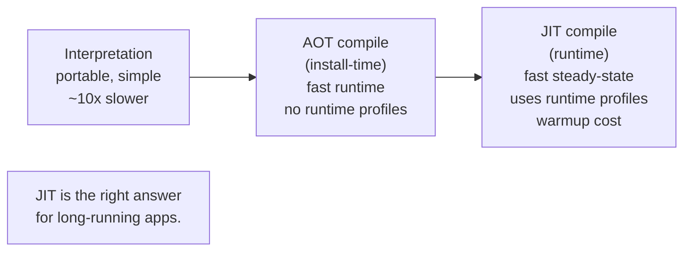
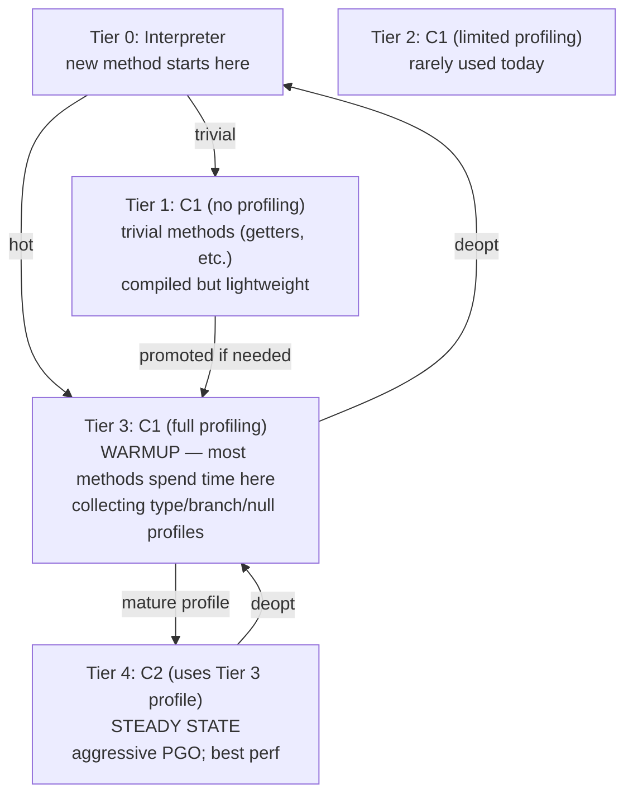
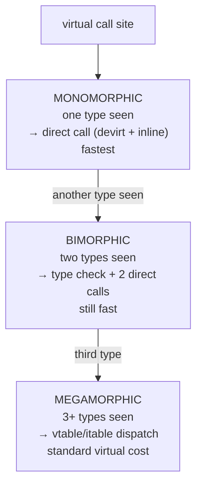

# JIT Compilation (C1/C2, Tiered)

T03 placed bytecode in the method area as the JVM's intermediate representation. This topic covers what happens *next*: the **JIT compiler** translates hot bytecode into **native machine code** at runtime, using **runtime profile data** unavailable to ahead-of-time compilers, and stores the result in the **code cache** (T01) where the JVM executes it directly. Java's "write once, run *fast* anywhere" story isn't bytecode + interpreter — interpretation is ~10× slower than native; it's bytecode + a sophisticated JIT that's spent two decades closing the gap with statically-compiled C++.

The depth-bar requirement isn't "JIT compiles bytecode to machine code." At the **architecture** layer, HotSpot has **two distinct compilers** — **C1** (the "client" compiler, originally for GUI apps: fast compilation, moderate optimization) and **C2** (the "server" compiler: slow compilation, aggressive profile-guided optimization) — orchestrated via **tiered compilation** (default since JDK 8) into a 5-level promotion pipeline: Tier 0 (interpreter) → Tier 3 (C1 with full profiling) → Tier 4 (C2 with mature profile). At the **profiling** layer, per-method counters (**invocation count** + **back-edge count**) trigger promotion; **MethodData** (MDO) collects type-profile, branch-profile, null-profile data the JIT uses to make profile-guided assumptions; **On-Stack Replacement (OSR)** lets a long-running loop inside an interpreted method be compiled and hot-swapped mid-execution. At the **optimization** layer, C2's "big four" — **method inlining** (the foundational optimization that enables every other; ~9 levels deep, ~325-byte budget per inline), **escape analysis + scalar replacement** (objects proven local are decomposed into stack-allocated fields, dodging GC), **lock elision + coarsening** (T03 from C01 — eliminate or merge locks proven thread-local), **devirtualization via inline caches** (monomorphic call sites become direct calls; megamorphic fall back to vtable) — plus loop unrolling, invariant hoisting, dead code / bounds check / range check elimination, common subexpression elimination — collectively turn idiomatic Java into machine code competitive with C++. At the **failure-mode** layer, **deoptimization** is the safety valve: when a profile-guided assumption is invalidated (a new subclass is loaded that breaks monomorphism, an unexpected null appears, an "uncommon trap" branch executes), the compiled code is abandoned, the frame is reconstructed to interpreted form, and execution continues in the interpreter — possibly recompiling later with the new profile. We will cover all four layers, with diagnostic flags (`-XX:+PrintCompilation`, `-XX:+PrintInlining`, `-XX:+PrintAssembly` with hsdis) as the ground truth, and finish with **GraalVM's Graal JIT** — the Java-implemented C2 replacement that powers OpenJDK's experimental tier as well as GraalVM's native-image AOT (T05).

> [!NOTE]
> Prerequisites: [Bytecode basics](./T03-bytecode-basics.md) (L3/C02/T03) — what the JIT consumes; [Class loading & class loaders](./T02-class-loading-and-class-loaders.md) (L3/C02/T02) — class hierarchy invalidation triggers deopt; [JVM architecture](./T01-jvm-architecture-and-runtime-data-areas.md) (L3/C02/T01) — code cache where JIT'd code lives; [synchronized, monitors & intrinsic locks](../C01-concurrency/T03-synchronized-monitors-and-intrinsic-locks.md) (L3/C01/T03) — lock elision and coarsening are the canonical examples of C2 optimization.

## Why JIT — the Trade-Off Between Interpretation and AOT

Three options for executing portable bytecode:

1. **Pure interpretation.** Read each bytecode; execute it. *Portable, simple, ~10× slower than compiled code.*
2. **Ahead-of-time (AOT) compilation.** Compile bytecode to native at install time. *Fast at runtime, but no access to runtime profiles — can't optimize based on actual call patterns.*
3. **JIT.** Interpret cold code (no compilation overhead); compile hot code with runtime profiles (best optimization).

JIT gives the best of both: cold paths run interpreted (fast startup, no compile cost), hot paths run native with profile-guided optimization. The cost: warmup time — the first few hundred milliseconds of execution interpret while profiles are gathered, then JIT'd code kicks in.



## HotSpot's Two Compilers — C1 and C2

HotSpot ships *two* JIT compilers, both targeting the same bytecode but with different goals:

### C1 — the Client Compiler

- **Originally for**: GUI applications ("client-side").
- **Compilation cost**: fast (~milliseconds per method).
- **Optimization level**: moderate — basic constant folding, simple inlining, dead-code elimination.
- **Used in**: Tiers 1, 2, 3.
- **Strength**: gets methods compiled quickly during warmup.

### C2 — the Server Compiler

- **Originally for**: long-running server applications.
- **Compilation cost**: slow (~10× C1).
- **Optimization level**: aggressive — escape analysis, scalar replacement, sophisticated inlining, deep loop optimization, sea-of-nodes IR.
- **Used in**: Tier 4 (the top tier).
- **Strength**: best steady-state performance.

The "client/server" terminology is historical and misleading. Modern JDKs use both, orchestrated via tiered compilation.

## Tiered Compilation — The Default Since JDK 8

Five tiers, each method moves up as it gets hot:



The typical method's lifecycle:

1. **Tier 0 (interpreter)** — first executions; profile data starts accumulating in the method's MDO (MethodDataObject).
2. **Tier 3 (C1 + profiling)** — invocation count crosses ~10,000; C1 compiles a *profiled* version that continues collecting data.
3. **Tier 4 (C2 + PGO)** — the Tier 3 profile is mature; C2 compiles with profile-guided optimization. This is the steady-state tier.

Trivial methods (small getters/setters) take a shortcut to Tier 1 (C1 without profiling) — the JIT decides they're too small to need PGO. Methods that fail to promote may stay in Tier 3 forever.

### Tunable thresholds

| Flag | Default | Meaning |
|------|---------|---------|
| `-XX:Tier3InvocationThreshold` | 200 | invocations to promote to Tier 3 |
| `-XX:Tier3CompileThreshold` | 2000 | invocations + back-edges for Tier 3 |
| `-XX:Tier4InvocationThreshold` | 5000 | invocations to promote to Tier 4 |
| `-XX:Tier4CompileThreshold` | 15000 | invocations + back-edges for Tier 4 |
| `-XX:CompileThreshold` | 10000 (non-tiered) | legacy single-threshold flag |
| `-XX:CICompilerCount` | varies (2-4 typical) | compiler thread count |
| `-XX:-TieredCompilation` | true (default) | disable tiered (C2 only) |

Lower thresholds → faster warmup, but more compilation overhead. Higher → slower warmup, less overhead. Rarely worth tuning; defaults are good.

## Counters — Invocation and Back-Edge

Each method has two counters in its MDO:

- **Invocation count** — how many times the method has been called.
- **Back-edge count** — how many times a back-edge (loop iteration jump) has fired.

The JIT uses *both*: a method called 1000 times with 10-million-iteration loops is just as hot as a method called 10 million times. The sum (or weighted sum) triggers promotion to the next tier.

For long loops in cold methods, the *invocation count* alone wouldn't trigger compilation — the method has only been called once. **On-Stack Replacement (OSR)** is the answer.

## On-Stack Replacement (OSR)

A long-running loop in an interpreted method:

```java
void crunch() {
    for (int i = 0; i < 1_000_000_000; i++) {
        // big loop in a single method invocation
    }
}
```

`crunch` is called once; invocation count = 1; the *normal* compile threshold never trips. But the back-edge count climbs to a billion — clearly hot.

OSR: the JIT compiles **just the loop's entry point** and *hot-swaps execution mid-method*:

1. Back-edge count crosses `-XX:Tier3BackEdgeThreshold` (~60,000).
2. JIT compiles a *special* version starting at the loop entry's bytecode index.
3. Mid-loop, the interpreter's frame is converted to a compiled frame (locals copied, PC mapped).
4. Execution continues in compiled code from the loop entry forward.

OSR-compiled methods are typically not reused for future calls — they're customized to that specific loop entry. So OSR introduces both runtime cost (the swap) and code cache pressure.

OSR is *the* mechanism that makes microbenchmarks possible. A `for(int i = 0; i < N; i++) { workload(); }` benchmark loop is OSR-compiled mid-run; without OSR, the entire benchmark would run interpreted.

```mermaid
sequenceDiagram
  participant T as thread
  participant Int as interpreter
  participant JIT as JIT
  participant Code as compiled OSR code
  T->>Int: enter crunch(); back-edge count rising
  Int->>JIT: back-edge count threshold; submit OSR compile
  JIT->>JIT: compile loop entry to native
  Int->>Code: OSR transfer: locals copied, PC mapped
  Code->>T: continue execution in compiled code
  Note over T,Code: rest of loop runs at native speed
```

## Profile-Guided Optimization (PGO)

Tier 3's C1 with profiling collects:

- **Type profile**: at each virtual call site (`invokevirtual`/`invokeinterface`), what classes have been seen as the receiver? If only one — *monomorphic*; if two — *bimorphic*; more — *megamorphic*.
- **Branch profile**: at each `if`/`switch`, which branch was taken? Hot branches stay; cold ones can be deferred to interpreter.
- **Null profile**: how often did `null` flow through?
- **Exception profile**: how often did this site throw?

Tier 4's C2 uses the profile to make *aggressive assumptions*:

- "This call site only ever sees `ArrayList` → inline `ArrayList.get` directly, skip the virtual dispatch."
- "This branch always goes left → put the right side in cold code, optimize the hot path."
- "This pointer is never null in profile → skip the null check (or make it an uncommon trap)."

When an assumption is *violated* later, **deoptimization** kicks in (below). The bet is that violations are rare in practice — and the optimization wins more than the deopts cost.

## C2's Major Optimizations

### Inlining — the Foundational Optimization

Replace a method call with the callee's body. Eliminates call overhead *and* enables all other optimizations to see across the call boundary.

```java
int sum(int a, int b) { return a + b; }

int total = sum(x, y) + sum(z, w);    // 2 calls
```

After inlining:

```java
int total = (x + y) + (z + w);         // direct expression; further constant folding possible
```

Heuristics:

- **Callee size**: small methods (default ~35 bytes) always inline; medium (up to ~325) inline if hot; large rarely inline.
- **Hot path**: methods on the hot path are aggressively inlined.
- **Inline depth**: typically up to 9 levels deep.
- **Inline cache state**: monomorphic call sites inline directly; bimorphic inline with type guard.

Inlining is the single most important optimization — every other optimization works better when it can see across the function call boundary.

### Escape Analysis + Scalar Replacement

If C2 can prove an object's reference *never escapes* the method (no published-to-field, no passed-as-argument-that-stores, no returned), the object can be **scalar-replaced**: decomposed into its fields, each allocated as a local register/stack value. The heap allocation *vanishes*.

```java
int distance(Point a, Point b) {
    Point delta = new Point(a.x - b.x, a.y - b.y);    // delta doesn't escape
    return delta.x * delta.x + delta.y * delta.y;
}
```

After escape analysis + scalar replacement:

```java
int distance(Point a, Point b) {
    int dx = a.x - b.x;            // delta.x → local
    int dy = a.y - b.y;             // delta.y → local
    return dx * dx + dy * dy;       // no allocation at all
}
```

The original Java did `new Point(...)`. The compiled code allocates *no* Point. Garbage collector pressure: zero. This is *the* optimization that makes Java's value-object style (records, defensive copying, immutable updates) competitive with C++'s stack-allocated structs.

> [!IMPORTANT]
> Escape analysis is also what enables **lock elision** (T03 from C01): if the lock object doesn't escape, no other thread can ever contend on it, so the locks can be removed entirely. The `StringBuffer` in a method-local context loses all its `synchronized` overhead — the compiled code is bit-for-bit equivalent to `StringBuilder`.

### Lock Elision and Lock Coarsening

Two T03-from-C01 optimizations:

- **Lock elision**: lock object proven thread-local via escape analysis → remove the locks entirely.
- **Lock coarsening**: adjacent same-monitor `synchronized` blocks → merge into one acquire/release pair.

```java
sb.append("a");           // 3 locks/unlocks on a method-local StringBuffer
sb.append("b");
sb.append("c");
```

After coarsening:

```java
synchronized (sb) {        // 1 lock
    sb.append_unsafe("a");
    sb.append_unsafe("b");
    sb.append_unsafe("c");
}                          // 1 unlock
```

After elision (if `sb` is local):

```java
sb.append_unsafe("a");     // 0 locks at all
sb.append_unsafe("b");
sb.append_unsafe("c");
```

### Loop Optimizations

- **Unrolling**: `for (i = 0; i < 4; i++) work(i)` → `work(0); work(1); work(2); work(3)`. Reduces branch overhead; enables SIMD.
- **Invariant hoisting**: computations whose result doesn't change per iteration moved outside.
- **Strength reduction**: `i * 2` → `i + i` (cheaper); `i * 8` → `i << 3`.
- **Vectorization (SIMD)**: tight numeric loops auto-vectorized to use SSE/AVX/NEON.

### Dead Code, Bounds Check, Range Check Elimination

- **Dead code**: code with no observable effect removed. Aggressive after inlining (parameters proven constant make whole branches dead).
- **Bounds check elimination**: array accesses with provably-in-range indices skip the bounds check. Crucial for tight numeric loops.
- **Range check elimination**: similar; more general; applied to integer ranges.

```java
for (int i = 0; i < arr.length; i++) sum += arr[i];
```

The `arr[i]` access normally generates a bounds check (`if (i < 0 || i >= arr.length) throw ...`). C2 proves `i` is always in `[0, arr.length)` for the entire loop and removes the per-iteration check. Pure speed for inner loops.

### Devirtualization via Inline Caches

Virtual call sites have **inline caches**. The state evolves with execution:

- **Monomorphic** (one type seen): direct call to that type's method — fastest. Most call sites.
- **Bimorphic** (two types): inline a type-guard branch ("if type X, call X.method; else call Y.method"). Still very fast.
- **Megamorphic** (3+ types): fall back to vtable/itable dispatch. Standard virtual call cost.

C2 uses the type profile from Tier 3 to *speculatively* devirtualize:

```java
List<X> list = ...;
list.add(x);                    // bytecode says invokeinterface
                                 // profile says: 100% ArrayList
                                 // C2 emits: direct call to ArrayList.add (with type guard)
```

If the assumption holds, the call is essentially free. If a `LinkedList` ever shows up, the type guard fires → deopt → fall back to interpreted.

## Inline Caches — Monomorphic, Bimorphic, Megamorphic



The key insight: **virtually all real-world Java call sites are monomorphic or bimorphic.** The "Java is slow because of virtual dispatch" lore is wrong — the JIT optimizes virtual calls down to direct calls in the common case.

When you read about avoiding `interface`s "for performance": don't. The JIT handles them efficiently. The exceptions are *truly megamorphic* call sites — typically reflection or visitor-pattern frameworks — where avoiding the virtual call by hand is sometimes worth it.

## Deoptimization — The Safety Valve

C2's profile-guided assumptions are *bets*. If a bet is wrong, the compiled code is *invalidated*:

### Deopt triggers

- **Class hierarchy invalidation**: monomorphic assumption broken by a new subclass loaded.
- **Unexpected null**: profile said never null; runtime says null.
- **Type mismatch**: type-guarded inline cache sees the wrong type.
- **Uncommon trap**: a branch C2 deferred to "rare" actually fires.
- **Class redefinition**: JVM TI agent (debugger, instrumentation) redefines a class.

### What happens

1. Compiled code marked as "deopt'd" — won't be entered again.
2. The thread executing the deopt'd code has its *compiled frame* reconstructed as an *interpreted frame*: locals, operand stack, PC mapped from compiled to bytecode form.
3. Execution continues in the interpreter from the point of deopt.
4. The method may be recompiled later with the updated profile (now including the new case).

```mermaid
sequenceDiagram
  participant T as thread
  participant Code as compiled code
  participant Int as interpreter
  participant JIT as JIT
  T->>Code: executing compiled code
  Code->>Code: assumption violated (e.g., new subclass)
  Code->>T: trigger deopt
  T->>Int: reconstruct frame as interpreted; continue
  Int->>JIT: profile updated; method re-enqueued for compile
  JIT->>JIT: recompile with new profile (later)
```

Deopt is *expensive* — milliseconds of overhead when it happens — but rare in steady-state code. Frequent deopts (visible in `-XX:+PrintCompilation` log) usually indicate code that's hostile to the JIT (megamorphic dispatch, type-changing logic, etc.) and worth refactoring.

## C2's Sea of Nodes IR

C2 uses a graph-based IR called **Sea of Nodes** — distinct from traditional control-flow-graph (CFG) based IRs. Properties:

- Nodes represent both *values* and *control flow*.
- Data dependencies are explicit edges; control dependencies are explicit edges.
- The graph lets the optimizer reorder freely as long as edges are preserved.
- Hard to read; specialized tools (`-XX:+PrintIdealGraphLevel=N` + IGV viewer) needed.

Sea of Nodes enables C2's aggressive reordering, but makes debugging hard. For most engineers, the IR is an implementation detail — `-XX:+PrintCompilation` and `-XX:+PrintInlining` give enough information without diving in.

## GraalVM JIT — the Java-Implemented C2 Alternative

**GraalVM's Graal compiler** is a C2 replacement *written in Java*. Available in two forms:

1. **GraalVM CE/EE** as a complete JDK replacement.
2. **OpenJDK + JVMCI** (JEP 243, JDK 9+): enable Graal as the Tier 4 compiler via `-XX:+UnlockExperimentalVMOptions -XX:+UseJVMCICompiler -XX:+EnableJVMCI`.

Graal's strengths:

- Better **partial escape analysis** — recognizes objects that escape *only on rare paths*, scalar-replacing on common paths.
- More aggressive **inlining**.
- More sophisticated **loop optimizations**.
- Cleaner architecture (Java code, easier to extend).

Graal's weaknesses:

- **Compilation overhead higher** — startup is slower.
- **Memory pressure** — JIT'd Java code competes with application code for heap.
- **C2 still wins** on certain benchmarks; Graal wins on others.

In 2026, most production deployments still use C2. Graal is the right choice for *experimental* workloads, GraalVM native-image (T05), and specific cases where partial escape analysis pays off.

## Modern Alternatives — AOT, Native Image, CRaC, Leyden

JIT isn't the only path:

- **AOT compilation (JEP 295, JDK 9)**: pre-compile core classes for faster startup. Limited adoption; complicated by class hierarchy assumptions.
- **GraalVM native-image (T05)**: full AOT — produces a native binary with no JVM, fixed heap, fast startup. Trade-off: closed-world assumption (no dynamic class loading).
- **CRaC (Coordinated Restore at Checkpoint)**: snapshot a running JVM; restore on next start. Skip warmup. Promising for serverless.
- **Project Leyden (in progress)**: combines AOT with profile-guided info captured from prior runs. Targeted at JDK 25+.

Each addresses a different facet of "JIT requires warmup" — for short-lived workloads (CLI tools, FaaS) where warmup overhead dominates, AOT-style solutions are usually better.

## Diagnosing JIT Behavior

### `-XX:+PrintCompilation`

Logs every method compilation: tier, name, size. Look for:

- Unexpected recompilations (deopt → recompile cycles).
- Method size limits hit (`bailout: ...` messages).
- Long compilation queues (delayed entries).

### `-XX:+UnlockDiagnosticVMOptions -XX:+PrintInlining`

For each JIT'd method, logs inline decisions: which callees were inlined, which were not (and why — too big, hot enough, etc.). The most informative single flag for understanding C2's choices.

### `-XX:+UnlockDiagnosticVMOptions -XX:+PrintAssembly`

Requires `hsdis` (HotSpot Disassembler) library — install separately. Dumps the actual machine code emitted by the JIT. The ground truth.

### JFR events

- **`jdk.JITCompilation`** — every compile event with duration.
- **`jdk.CompilerInlining`** — inlining decisions.
- **`jdk.MethodSample`** — sampled stack traces (where is time spent?).
- **`jdk.DeoptimizationEvent`** — deopt events.

JFR is the production-grade tool; flag-based diagnostics are for development.

### JITWatch

A GUI tool that consumes `-XX:+LogCompilation` logs and visualizes the entire JIT decision tree. Indispensable for deep JIT analysis.

## JIT and Benchmarking

The JIT changes everything about benchmarking:

- **First call**: interpreted, ~10× slow.
- **Tier 3 compile**: better but still profiling.
- **Tier 4 compile**: steady-state.
- **Possible deopts**: random slowdowns mid-benchmark.

Without proper warmup, microbenchmarks measure compilation overhead, not steady-state performance. The fix:

- **JMH (Java Microbenchmark Harness)**: handles warmup, multiple forks, statistical analysis. The standard tool.
- **Long warm-up runs**: ~10K invocations + ~30 seconds of execution before measuring.
- **Look at `-XX:+PrintCompilation`** during warmup to confirm Tier 4 is reached.

Naïve `System.nanoTime()` benchmarks are almost always wrong.

## The Compilation Queue

Compilation is **async** — JIT runs on background compiler threads:

- `-XX:CICompilerCount` controls thread count (default: ~2-4 based on cores).
- Methods are enqueued by the runtime; execute interpreted until compilation completes.
- During warmup, the queue can back up — *warmup storms* — where many methods are pending.

Long-running apps with very hot code paths sometimes benefit from raising `-XX:CICompilerCount` for faster warmup. Otherwise, defaults work.

## Best Practices

### Trust the JIT

Manual "optimizations" usually hurt:

- **Don't manually inline.** The JIT does it better, with profile data.
- **Don't avoid interfaces.** Devirtualization eliminates the cost.
- **Don't use `final` for performance.** It doesn't help; the JIT doesn't need it.
- **Don't unroll loops by hand.** The JIT does it.

### Avoid hostile patterns

Some code is genuinely JIT-hostile:

- **Reflection in hot paths** — adds dispatch overhead the JIT can't eliminate.
- **Highly megamorphic call sites** — visitor patterns over many types.
- **Very long methods** (~8000+ bytecode bytes) — exceed C2's compilation budget; stay interpreted.
- **Mutable state in inner loops** — defeats invariant hoisting.

### Warm up before measuring

Benchmark with JMH. Warm up real production code if you care about p99 latency.

### Read the JIT logs occasionally

Even casual reading of `-XX:+PrintInlining` for a hot method teaches a lot about what C2 sees and decides.

## When the JIT Can't Help

Some patterns the JIT struggles with:

- **Truly polymorphic dispatch** (3+ types frequent at the same site).
- **Reflection-heavy code** (the call target is not known at compile time).
- **Megamorphic interface dispatch** (e.g., Spring's chain of `Filter`s).
- **Methods too large** for C2's heuristics.
- **Native code** (JNI calls cannot be inlined past the boundary).

For these, profile carefully — sometimes a small refactor (avoiding reflection, type-specializing, breaking up methods) gives a big win.

## Common Mistakes

### Premature optimization for the JIT

Writing weird code "for performance" before measuring. The JIT and modern CPUs are smarter than your intuition.

### Manual inlining

Hand-inlining a method makes the code uglier *and* often slower (the JIT can no longer choose to *not* inline if profile shows the call is cold).

### Avoiding interfaces

"Use concrete types for performance" — wrong. Devirtualization eliminates the cost. Use interfaces for design clarity.

### Ignoring deoptimization

Frequent deopts visible in `-XX:+PrintCompilation` are a red flag. Diagnose them.

### Benchmarking without warmup

`System.currentTimeMillis()` around a workload, no warmup → measuring interpreter speed. Use JMH.

### Setting `-Xcomp`

`-Xcomp` forces compilation of everything at first call. *Disables* profiling, eliminating PGO. Use only for tiny single-method benchmarks; never in production.

### Tuning compile thresholds

The defaults are excellent. Tuning rarely helps; you're likely making startup worse.

## Practice

1. **Print compilation log.** Run any Java app with `-XX:+PrintCompilation`. Identify Tier 3 and Tier 4 compilations. Watch which methods get hot.
2. **Print inlining decisions.** With `-XX:+UnlockDiagnosticVMOptions -XX:+PrintInlining`, observe a small hot method. Identify what was inlined and why.
3. **Force OSR.** Write a method with a long loop. Run with `-XX:+PrintCompilation`; identify the "% osr" markers.
4. **Cause a deopt.** Build a class hierarchy `A` ← `B` ← `C`. Method that takes `A` and calls `a.method()`. Use only `B` instances for a while; then introduce `C`. With `-XX:+PrintCompilation` watch the deopt happen.
5. **Verify lock elision.** Use a method-local `StringBuffer`; run with `-XX:+PrintCompilation -XX:+PrintInlining -XX:+UnlockDiagnosticVMOptions -XX:+PrintEliminateLocks`. Observe the locks elided.
6. **Verify escape analysis.** Build a method that allocates a small object that doesn't escape. With `-XX:+UnlockDiagnosticVMOptions -XX:+PrintEscapeAnalysis -XX:+PrintEliminateAllocations`. Observe scalar replacement.
7. **Compare C2 vs Graal.** Run a CPU-bound benchmark with default JIT and `-XX:+UseJVMCICompiler`. Compare throughput.
8. **JFR JIT events.** Record a JFR profile; open in JMC; explore the JIT events. Identify hot methods and their compilation latencies.
9. **JMH benchmark.** Write a JMH benchmark for a simple algorithm; observe the warmup phase in JMH's output.
10. **Print assembly.** Install `hsdis`; with `-XX:+PrintAssembly`, dump the JIT'd machine code for a simple method. Identify operations.
11. **Megamorphic vs monomorphic.** Write code with a virtual call. Run with only one type; observe direct call in assembly. Then race with multiple types; observe vtable fallback.
12. **JITWatch session.** Run an app with `-XX:+UnlockDiagnosticVMOptions -XX:+LogCompilation`. Open the log in JITWatch. Explore the decision tree.

## Recap

You should now be able to:

- Defend **why JIT exists**: interpretation is ~10× slower than native; AOT can't use runtime profiles; JIT combines fast startup (interpret cold code) with fast steady-state (compile + optimize hot code) using profile-guided optimization.
- Identify HotSpot's **two compilers**: **C1** (client — fast compile, moderate optimization) and **C2** (server — slow compile, aggressive PGO).
- Walk through the **5 tiers of tiered compilation** (default since JDK 8): Tier 0 interpreter → Tier 1 C1 no-profile (trivial methods) → Tier 2 (rare) → Tier 3 C1 with profiling (warmup workhorse) → Tier 4 C2 with mature profile (steady state). Promotion via invocation + back-edge counters.
- Apply **On-Stack Replacement (OSR)**: compile *just the loop* and hot-swap mid-method execution. Essential for long-running loops in cold methods (and for benchmarks).
- Recognize the **MethodData (MDO)** as the per-method profile store: type profile (monomorphic/bimorphic/megamorphic), branch profile, null profile, exception profile.
- Walk through **C2's major optimizations**:
  - **Inlining** (foundational; ~9 levels deep; ~325-byte budget; enables every other optimization to see across call boundaries).
  - **Escape analysis + scalar replacement** (objects proven local become stack-allocated locals; dodges GC entirely).
  - **Lock elision + coarsening** (T03 from C01 — eliminate or merge locks proven thread-local; `StringBuffer` in a method-local context loses all `synchronized` overhead).
  - **Loop optimizations** (unrolling, invariant hoisting, strength reduction, vectorization).
  - **Dead code / bounds check / range check elimination**.
  - **Devirtualization via inline caches** (monomorphic → direct call; bimorphic → type-guarded direct; megamorphic → vtable fallback).
- Recognize **inline caches** as the call-site state machine: most real-world sites are monomorphic or bimorphic; "virtual dispatch is slow" is mostly wrong.
- Understand **deoptimization** as the safety valve: profile-violation triggers (class hierarchy invalidation, unexpected null, type mismatch, uncommon trap, class redefinition) → compiled code abandoned, frame reconstructed to interpreted form, execution continues. Frequent deopts indicate JIT-hostile code.
- Recognize **C2's Sea of Nodes IR** (graph-based, combines data and control flow) as the implementation detail behind aggressive reordering.
- Choose between **C2** (default, mature) and **GraalVM JIT** (Java-implemented, better partial escape analysis, slightly slower startup) per workload.
- Distinguish **AOT alternatives**: AOT compilation (JEP 295), GraalVM native-image (T05 — full AOT with closed-world), CRaC (snapshot/restore), Project Leyden (in-progress profile-augmented AOT).
- Diagnose JIT behavior with **`-XX:+PrintCompilation`**, **`-XX:+UnlockDiagnosticVMOptions -XX:+PrintInlining`**, **`-XX:+PrintAssembly`** (with hsdis), **JFR `jdk.JITCompilation`/`jdk.CompilerInlining`/`jdk.DeoptimizationEvent`**, and **JITWatch**.
- Benchmark correctly with **JMH** (handles warmup, multiple forks, statistical analysis); recognize naïve `System.nanoTime()` benchmarks as usually wrong.
- Avoid **JIT-hostile patterns**: reflection in hot paths, truly megamorphic call sites, very long methods (>8 KB bytecode), heavy mutable state defeating invariant hoisting, native frames blocking inlining.
- Avoid the **7 common mistakes**: premature optimization for the JIT, manual inlining, avoiding interfaces, ignoring deopts, benchmarking without warmup, using `-Xcomp`, tuning compile thresholds.

## Next

Continue to [AOT & GraalVM native image](./T05-aot-and-graalvm-native-image.md) — the modern alternative to JIT for *startup-sensitive* workloads. We'll dissect **GraalVM native-image** (closed-world AOT compilation producing a native binary with no JVM), the **substrate VM** (minimal runtime included in the binary), **build-time vs runtime initialization**, **reachability analysis** (only code reachable from main is included), the **reflection / dynamic class loading limitations** (must be hinted via configuration), **AppCDS** as the lighter-weight alternative, **CRaC** for warmup-skipping snapshots, and the trade-off matrix that drives the JIT-vs-AOT decision in 2026 (FaaS / CLI tools → AOT; long-running servers → JIT).
