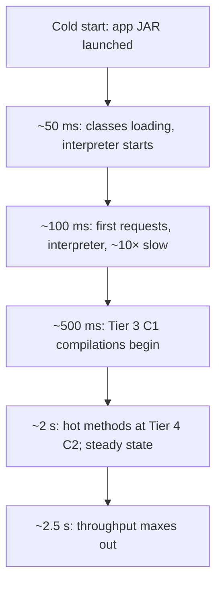
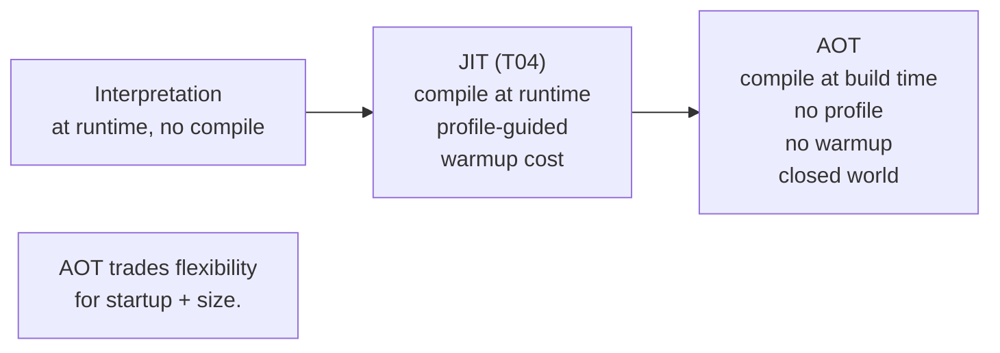
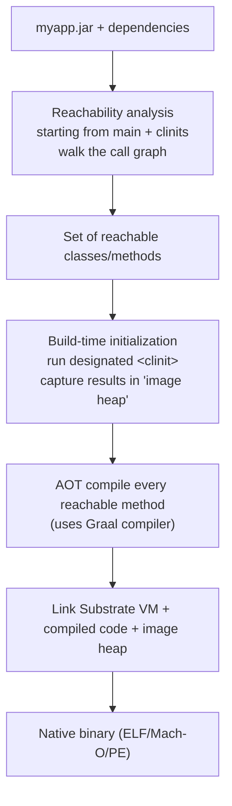
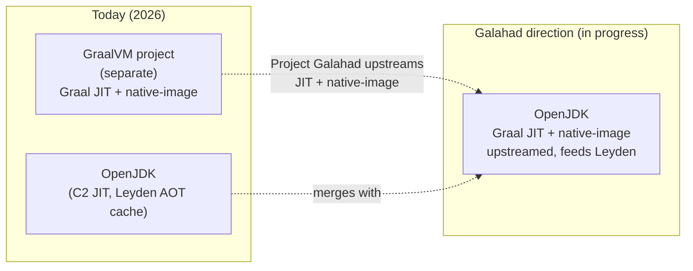
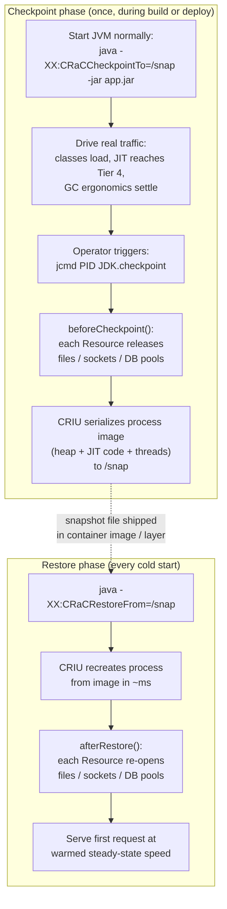

# AOT & GraalVM Native Image

T04's tiered JIT delivers excellent steady-state throughput — *eventually*. But the warmup it requires (1–3 seconds before Tier 4 C2 is reached for the hottest methods) is a *catastrophic* cost for short-lived workloads: a Lambda function invocation that completes in 200 ms can't afford a 1-second warmup; a `kubectl`-like CLI tool runs for seconds total; a Spring Boot pod scaling to 100 replicas in Kubernetes ties up CPU and memory on JIT compilation each time. **Ahead-of-time (AOT) compilation** is the answer — compile bytecode to native code **at build time**, ship the result as a single binary, run it with no JVM, no JIT, no warmup — and **GraalVM native-image** is the dominant tool for doing this in 2026.

The depth-bar requirement isn't "native-image makes Java fast at startup." At the **mechanism** layer, GraalVM native-image performs **closed-world reachability analysis** starting from `main` (and all `<clinit>` blocks), traces every reachable class and method via a whole-program static analysis, and compiles *only* the reachable code into a single native binary that includes the minimal **Substrate VM** runtime (GC + thread support + limited bytecode interpreter for `JNI`/`Unsafe`/restricted dynamic loading). At the **initialization** layer, AOT introduces a *new distinction* foreign to JIT-based Java: **build-time vs runtime initialization**. A class can be initialized *during the native-image build* (its `<clinit>` runs, results baked into the image's heap) — cheap at runtime but only safe if the init is *pure* (no time, no random, no env). Or it can be deferred to *runtime* — incurs startup cost but supports dynamic state. The decision is per-class via `--initialize-at-build-time` / `--initialize-at-run-time` flags. At the **dynamic-feature** layer, AOT's closed-world assumption *fundamentally limits* runtime dynamicism: reflection works only on classes/methods explicitly listed in `reflect-config.json`; dynamic proxies require `proxy-config.json`; JNI requires `jni-config.json`; resources require `resource-config.json`; serialization requires `serialization-config.json`. The **GraalVM tracing agent** automates hint collection during a normal JVM run, but every modern framework (Spring Native, Quarkus, Micronaut) provides its own hints — and **JEP 484** (JDK 25) plans to standardize reachability metadata into a part of the JDK spec. At the **alternative** layer, **AppCDS** offers lighter-weight startup optimization without closed-world restrictions; **CRaC** (Coordinated Restore at Checkpoint, used by AWS Lambda SnapStart) snapshots a warmed-up JVM and restores on next start, skipping warmup entirely; **Project Leyden** (in progress) plans a third path combining build-time AOT with profile-guided JIT. We will cover all four layers, plus a decision matrix for picking the right approach in 2026.

> [!NOTE]
> Prerequisites: [JIT compilation](./T04-jit-compilation-c1-c2-tiered.md) (L3/C02/T04) — the warmup problem AOT solves; [Bytecode basics](./T03-bytecode-basics.md) (L3/C02/T03) — what gets AOT-compiled; [Class loading & class loaders](./T02-class-loading-and-class-loaders.md) (L3/C02/T02) — the closed-world restriction limits class loading; [JVM architecture](./T01-jvm-architecture-and-runtime-data-areas.md) (L3/C02/T01) — Substrate VM replaces the standard JVM.

## The JIT-Warmup Problem AOT Solves

A JIT-warmup latency curve for a typical Spring Boot service:



For a long-running server, 2.5 seconds of warmup amortized over hours of uptime is invisible. For Lambda invocations measured in 100s of milliseconds, a 2.5-second cold start is a *disaster*. The problem is fundamental: JIT *cannot* be fast at startup because it has no profile data to guide compilation, and even gathering profile data requires running the code.

AOT compilation moves compilation to **build time** — when there's no runtime budget. The result: zero warmup. The cost: closed-world constraints on what the binary can do at runtime.

## What AOT Is



AOT compilation translates bytecode to native machine code *before* the program runs. The compiled binary contains:

- Pre-compiled native code for every reachable method.
- A pre-built "image heap" — pre-initialized objects from build-time class init.
- A minimal runtime (Substrate VM) — GC, thread support, just enough JVMS conformance.
- *No* JIT, *no* full class loader, *no* JVMS bytecode interpreter for arbitrary new classes.

Result: a single binary you can deploy to anywhere with a compatible OS/architecture. Run it and it starts in milliseconds.

## GraalVM Native Image

**GraalVM native-image** (Oracle Labs) is the dominant AOT tool for Java:

```bash
# Install GraalVM (or use sdkman, brew, etc.)
# Then:
native-image -jar myapp.jar

# Result: a binary executable
ls -la myapp
# -rwxr-xr-x  1 user  staff  45_000_000  myapp     # ~45 MB ELF binary

./myapp
# Hello world (started in ~30 ms)
```

The basic workflow: take a `.jar`, run `native-image`, get a native binary. Build takes 1–5 minutes for a typical microservice.

### Output characteristics

| Metric | Typical value |
|--------|---------------|
| **Binary size** | 20–80 MB (small Spring Boot) |
| **Startup time** | 10–100 ms (vs 1–3 s on JVM) |
| **Memory footprint** | 50–150 MB (vs 200–500 MB on JVM) |
| **Throughput vs JVM (steady state)** | 80–95% (sometimes lower) |
| **Build time** | 1–10 minutes |

The startup and memory wins are dramatic — *the* reason serverless platforms love it. The throughput loss is real but manageable; for many workloads, it's an acceptable trade.

## The Substrate VM (SVM)

The binary includes a minimal runtime called the **Substrate VM**:

- **GC**: Serial GC by default (single-threaded mark-sweep-compact); G1 optionally; ZGC unsupported as of JDK 24.
- **Thread support**: pthreads on Linux/macOS; Win32 threads on Windows. Same threading semantics as the JVM.
- **Bytecode interpreter**: a limited interpreter for cases where AOT can't fully resolve (some reflection paths, dynamic proxies).
- **Stack walking, safepoints**: same as JVM for GC and debugging.

What's *missing* from a full JVM:

- **JIT compiler** — no runtime compilation (the whole point of AOT).
- **Full class loader** — no `ClassLoader.defineClass(bytes)` of arbitrary new classes; the classpath is fixed at build time.
- **Most JVM TI** — limited agent support; no full debugger attach.

The trade: SVM is *small* and *fast* because it's *less general* than the JVM.

## The Build Process

The native-image builder does a *whole-program* analysis:



The four phases:

1. **Reachability analysis**: starting from `main` and every class's `<clinit>` (that's marked for build-time init), walk the call graph. Every reachable method is included; unreachable code is *dropped*. Aggressive dead-code elimination — typically 80–90% of a JAR's classes are unreachable in any given app.
2. **Build-time initialization**: for classes marked `--initialize-at-build-time`, run their `<clinit>` *during the build*. The resulting object state (static fields, etc.) is captured in the **image heap** — a snapshot of the JVM heap that the binary uses as its initial state. At runtime, these objects are *already initialized* — zero cost.
3. **AOT compilation**: every reachable method gets compiled by the **Graal compiler** to native code. No JIT; this is *all* the compilation that will ever happen.
4. **Linking**: assemble the SVM + compiled code + image heap into a single ELF/Mach-O/PE binary.

## Reachability Analysis — the Closed-World Assumption

The fundamental requirement: **every class, method, and field used at runtime must be reachable from the static call graph at build time**. This is the **closed-world assumption**.

What's reachable trivially:

- `main` and every method it calls (transitively).
- Every constructor used to create objects flowing into reachable code.
- Every interface method that has a known reachable implementation.

What's *not* reachable without help:

- `Class.forName("dynamic.class.Name")` where the name is computed at runtime.
- `Class.getMethod("dynamicName")` reflection lookups.
- `Proxy.newProxyInstance(...)` for unknown interfaces.
- Resources read via `getResourceAsStream("/path/not/seen")`.

For these, the build needs *hints* — explicit declarations of what to include.

## Build-Time vs Runtime Initialization

A class's `<clinit>` (T02) can run *either* during native-image build *or* at runtime startup. The choice is per-class:

```bash
native-image \
  --initialize-at-build-time=com.example.PureConfig \
  --initialize-at-run-time=com.example.WithRandom \
  -jar myapp.jar
```

### Build-time init

- `<clinit>` runs *during the build*.
- Result (static field values) baked into the image heap.
- Runtime cost: **zero** — fields are already initialized.
- Restrictions: `<clinit>` must be **pure** — no current time, no `Random()` (or rather, the random value baked at build time will be reused forever), no environment access, no file I/O.

If a class with build-time init accidentally captures environment or random state, that state is *frozen* in the binary — and identical across every deployment of the binary.

### Runtime init

- `<clinit>` runs at JVM startup.
- Restrictions: none beyond normal Java rules.
- Cost: startup time penalty.

The framework you use (Spring, Quarkus) generally manages these flags for you. Manual tuning is rare.

> [!IMPORTANT]
> **Don't initialize random-number generators at build time.** The seed is captured during the build; every binary deployment uses the same seed. Always `--initialize-at-run-time` for `java.security.SecureRandom`, `ThreadLocalRandom`, etc. — though the GraalVM defaults usually handle this.

## Reflection and Dynamic Features — the Configuration Files

The closed-world assumption breaks for *reflection* and friends. The fix: configuration files in `META-INF/native-image/`:

### `reflect-config.json`

Lists classes/methods/fields accessed via reflection:

```json
[
    {
        "name": "com.example.MyClass",
        "allDeclaredConstructors": true,
        "allDeclaredMethods": true,
        "allDeclaredFields": true
    }
]
```

The build then includes these classes' metadata and registers them for reflective access.

### `proxy-config.json`

Lists dynamic proxy interfaces:

```json
[
    { "interfaces": ["com.example.MyInterface", "java.io.Serializable"] }
]
```

The build generates the proxy class ahead of time.

### `jni-config.json`

Lists classes/methods called from JNI.

### `resource-config.json`

Lists resources to embed:

```json
{
    "resources": {
        "includes": [ {"pattern": ".*\\.properties$"} ]
    }
}
```

### `serialization-config.json`

Lists classes serialized with `ObjectInputStream`/`ObjectOutputStream`.

Hand-writing these files is *tedious*. Two solutions:

### The GraalVM tracing agent

Run your app on a *regular* JVM with the GraalVM tracing agent:

```bash
java -agentlib:native-image-agent=config-output-dir=meta -jar myapp.jar
# exercise the app's features (run tests, exercise endpoints)
# the agent records all reflection/proxy/resource accesses to meta/*.json
```

Then use those configs for the native-image build. Workable for test-suite-driven coverage.

### Framework support

Modern frameworks include comprehensive native-image hints:

- **Spring Native / Spring Boot 3+**: official support; `@RegisterReflectionForBinding`, Spring AOT processor.
- **Quarkus**: built around native-image; "supersonic, subatomic"; build-time analysis tightly integrated.
- **Micronaut**: ahead-of-time DI generation; native-image first-class.
- **Helidon**: similar AOT-friendly approach.

For libraries, the **GraalVM Reachability Repository (GRR)** — `https://github.com/oracle/graalvm-reachability-metadata` — collects community hints for popular libraries. Native-image automatically downloads matching metadata for known libraries.

### JEP 484 — Reachability metadata standardization

JEP 484 (JDK 25, in progress) plans to standardize reachability metadata as a part of the JDK spec, so library authors can ship hints with their JARs in a standard format. Will simplify AOT adoption significantly.

## PGO for Native Image

GraalVM EE supports **Profile-Guided Optimization (PGO)** for native-image — similar to C2's runtime PGO but at build time:

```bash
# Step 1: build instrumented binary
native-image --pgo-instrument -jar myapp.jar -o myapp-inst

# Step 2: run instrumented binary to collect profile
./myapp-inst         # exercise typical workloads; collects default.iprof

# Step 3: rebuild with profile
native-image --pgo=default.iprof -jar myapp.jar -o myapp
```

PGO-built native binaries often achieve 95–100% of JIT throughput — closing the gap with JVM-mode. Worth the build complexity for performance-sensitive serverless workloads.

## Framework Support

The big four in 2026:

| Framework | Native-image story | Notes |
|-----------|--------------------|-------|
| **Spring Boot 3+** | First-class via Spring Native + Spring AOT | The default for Spring apps; hints automatic |
| **Quarkus** | Built around native-image | "Supersonic, subatomic" tagline; Red Hat-backed |
| **Micronaut** | AOT-first DI + native-image | Compile-time DI annotations process eliminates reflection |
| **Helidon** | MicroProfile + native-image | Oracle-backed lightweight framework |

All four make native-image *easy* — just `mvn -Pnative package` (Spring) or `./mvnw package -Dnative` (Quarkus). The framework provides hints automatically.

## When AOT Wins — When JIT Wins

The decision matrix:

| Workload | Use |
|----------|-----|
| **AWS Lambda / Cloud Functions** | **AOT** — cold starts dominate |
| **CLI tools** | **AOT** — process lifetime is seconds |
| **Kubernetes pods that auto-scale** | **AOT** — startup latency matters |
| **Embedded / IoT** | **AOT** — memory constraints |
| **Long-running monolithic services** | **JIT** — JIT amortizes; PGO matters |
| **High-throughput pipelines** | **JIT** — C2's runtime optimization wins |
| **Reflection-heavy frameworks (legacy)** | **JIT** — AOT is hard to make work |
| **Apps under heavy dynamic class loading** | **JIT** — closed world impossible |

For typical microservices in 2026: try AOT first if you use Spring Boot 3, Quarkus, or Micronaut. Fall back to JVM-mode if AOT doesn't meet throughput requirements or your code has irresolvable dynamic features.

## Lighter Alternatives — AppCDS and CRaC

Two intermediate options between full JIT and full AOT:

### AppCDS — Application Class Data Sharing

T02 introduced AppCDS. Recap:

```bash
# Record classes loaded by app
java -XX:ArchiveClassesAtExit=app.jsa -cp myapp.jar com.x.Main

# Use the archive
java -XX:SharedArchiveFile=app.jsa -cp myapp.jar com.x.Main      # 30–60% faster startup
```

AppCDS pre-loads classes into a memory-mapped archive at startup, skipping the load + verify cost. No closed-world restriction; full JVM-mode at runtime; modest startup improvement (not as dramatic as AOT).

**When AppCDS is the right answer**: medium-sized Spring Boot apps where you want faster startup *without* the build complexity and reflection limitations of native-image.

### CRaC — Coordinated Restore at Checkpoint

**CRaC** (JEP 575 / OpenJDK CRaC project) takes a different approach: run the app, warm it up, **snapshot** the running JVM state to disk, then **restore** from snapshot at next start — skipping warmup entirely.

```bash
# Run + warm + snapshot
java -XX:CRaCCheckpointTo=./checkpoint -jar myapp.jar
# (in another shell, after warmup)
jcmd <pid> JDK.checkpoint

# Restore — starts already-warmed
java -XX:CRaCRestoreFrom=./checkpoint
```

The restored process starts with all classes loaded, all hot methods JIT'd, all GC tuning done. Startup latency: **single-digit milliseconds**.

The restrictions:

- File descriptors must be reopened after restore (CRaC has hooks for libraries to participate).
- Network connections must be reestablished.
- Wall-clock time jumps from snapshot time to restore time.

**Used in production by AWS Lambda SnapStart** for Java 11+ runtimes. CRaC is *the* answer for production serverless that wants both JIT throughput and instant startup.

### Project Leyden

**Leyden** (in active development, JDK 25+ target) plans to combine the three paths:

- **Premain (build-time)**: AOT-compile what's known statically.
- **Premain (load-time)**: optimize as classes are loaded.
- **Premain (runtime)**: continue JIT for hot paths.

Promises the startup of native-image with the runtime flexibility of JVM-mode. Not production-ready as of 2026.

## Comparison Matrix

| Approach | Startup | Throughput | Memory | Dynamic support | Build cost |
|----------|---------|------------|--------|-----------------|------------|
| **JIT (default JVM)** | 1–3 s (slow) | Best | Highest | Full | None |
| **AppCDS** | 0.3–1.5 s (faster) | Same as JIT | Same | Full | Low (one record run) |
| **CRaC** | ~10 ms (instant) | Same as warmed JVM | Same | Full (limited recovery) | Medium (snapshot pipeline) |
| **GraalVM native-image** | 10–100 ms | 80–95% of JVM | Lowest | Limited (hints required) | High (build complexity, 1–10 min) |
| **Project Leyden** (future) | TBD | TBD | TBD | TBD | TBD |

Pick by workload. For 2026 production:

- **Greenfield serverless**: GraalVM native-image (Spring Boot 3 / Quarkus / Micronaut).
- **Greenfield server-side**: JVM-mode with AppCDS.
- **Existing serverless with warmup pain**: CRaC (Lambda SnapStart) if available, else native-image.
- **Heavy reflection/dynamic loading**: JVM-mode only.

## Common Pitfalls

### Reflection silently breaks

A reflective call without a hint throws `ClassNotFoundException` or `NoSuchMethodException` at runtime — *only when the code path is hit*. Test coverage matters more for AOT than for JVM-mode.

### Long build times

Native-image builds take 1–10 minutes; longer for big apps. Don't wait until release time to discover this — add it to CI early.

### Image size larger than expected

Heavy use of reflection or full inclusion of libraries can balloon the binary. Strip unused dependencies; use jlink for the JDK side if AOT proves too heavy.

### Some libraries are AOT-incompatible

Libraries that generate bytecode at runtime (CGLIB-heavy frameworks, some old serialization libraries) may not work. Check the GraalVM Reachability Repository for compatibility.

### Build-time init capturing environment

If a class's `<clinit>` reads an env var or property at build time, the value is captured in the binary forever. Use `--initialize-at-run-time` for any class touching env/random/time.

### Debugging is harder

No `jstack`, no JVMTI, no live debugger attach (mostly). GraalVM is working on debug support; in 2026 it's improving but still less mature than JVM debug tooling.

### Forgetting framework support

Spring Boot 3, Quarkus, Micronaut have transformed native-image from "PhD-level effort" to "one Maven flag." Don't try to make raw Spring Boot 2 work natively — upgrade to 3.

## Observability

### Build report

`native-image --native-image-info -jar myapp.jar` produces a build report: reachable classes, methods, size breakdowns. The first place to look when binary is too large or build fails.

### Build logs

`native-image --verbose` shows reachability analysis decisions, init choices, errors.

### Runtime

Substrate VM supports basic GC logging (`-XX:+PrintGC`) and limited JFR (improving each release). Full JVM observability not available — diagnose with structured app logs.

### Tracing agent (build phase)

```bash
java -agentlib:native-image-agent=config-output-dir=meta -jar myapp.jar
```

Records all reflection/proxy/resource accesses to JSON files. Use to bootstrap hints for legacy code.

## Deeper Dive — Spring Boot 3 Native Image End-to-End

### Maven Project Setup

```xml
<project>
  <parent>
    <groupId>org.springframework.boot</groupId>
    <artifactId>spring-boot-starter-parent</artifactId>
    <version>3.2.0</version>
  </parent>

  <properties>
    <java.version>21</java.version>
  </properties>

  <dependencies>
    <dependency>
      <groupId>org.springframework.boot</groupId>
      <artifactId>spring-boot-starter-web</artifactId>
    </dependency>
    <dependency>
      <groupId>org.springframework.boot</groupId>
      <artifactId>spring-boot-starter-data-jpa</artifactId>
    </dependency>
  </dependencies>

  <profiles>
    <profile>
      <id>native</id>
      <build>
        <plugins>
          <plugin>
            <groupId>org.graalvm.buildtools</groupId>
            <artifactId>native-maven-plugin</artifactId>
            <configuration>
              <buildArgs>
                <buildArg>--enable-preview</buildArg>
                <buildArg>--initialize-at-build-time=org.slf4j.LoggerFactory</buildArg>
                <buildArg>-H:+ReportExceptionStackTraces</buildArg>
                <buildArg>-H:+InstallExitHandlers</buildArg>
              </buildArgs>
            </configuration>
          </plugin>
        </plugins>
      </build>
    </profile>
  </profiles>
</project>
```

### Building and Running

```bash
# Install GraalVM 21 (Liberica NIK includes native-image)
sdk install java 21.0.1-graalce
sdk use java 21.0.1-graalce

# Build (takes 3-8 minutes for typical Spring Boot)
./mvnw -Pnative native:compile

# Result: ./target/myapp (single ELF binary, no JVM needed)
ls -lh target/myapp
# -rwxr-xr-x ... 65M target/myapp

# Run
./target/myapp
# Started MyApp in 0.038 seconds (vs 1.2s on JVM)
# RSS: 50 MB (vs 200 MB on JVM)
```

### Adding Reflection Hints (When Auto-Detection Misses)

```java
// For a class that uses reflection at runtime
@RegisterReflectionForBinding({
    User.class,
    Order.class,
    Payment.class
})
@Configuration
public class NativeHints {
    // Spring Boot 3 reads this annotation at AOT time
}

// For lower-level control via RuntimeHintsRegistrar
@Configuration
public class CustomHints {
    @Bean
    public RuntimeHintsRegistrar customHints() {
        return (hints, classLoader) -> {
            hints.reflection().registerType(MyDynamicClass.class,
                MemberCategory.INVOKE_DECLARED_CONSTRUCTORS,
                MemberCategory.INVOKE_PUBLIC_METHODS);
            hints.resources().registerPattern("config/.*\\.properties");
            hints.proxies().registerJdkProxy(MyInterface.class);
            hints.serialization().registerType(MySerializable.class);
        };
    }
}
```

### Using the Tracing Agent for Legacy Code

```bash
# Run JVM-mode with tracing agent enabled
java -agentlib:native-image-agent=config-output-dir=src/main/resources/META-INF/native-image \
     -jar target/myapp.jar

# Exercise all features
curl http://localhost:8080/api/users
curl http://localhost:8080/api/orders
# ... cover all endpoints

# Stop app; check generated config files
ls src/main/resources/META-INF/native-image/
# reflect-config.json
# resource-config.json
# proxy-config.json
# jni-config.json
# serialization-config.json

# Rebuild native-image; agent's hints are picked up automatically
./mvnw -Pnative native:compile
```

## Deeper Dive — CRaC (Coordinated Restore at Checkpoint)

Different trade-off than native-image: keeps full Java semantics but snapshots a warmed JVM.

### How CRaC Works

```
NORMAL JVM STARTUP:
  T+0      java -jar app.jar
  T+1s     Class loading, JIT warm-up
  T+2s     First requests served (slow, interpreted)
  T+30s    JIT fully warmed (Tier 4 compilation done)
  T+30s+   Steady state

WITH CRaC:
  PHASE 1 — Warm + checkpoint (done once during build/deploy):
    java -XX:CRaCCheckpointTo=/tmp/snapshot -jar app.jar
    # Warm up via test traffic
    # Snapshot via jcmd <pid> JDK.checkpoint
    # JVM serializes: heap + JIT code + class data → /tmp/snapshot

  PHASE 2 — Restore (each new pod startup):
    java -XX:CRaCRestoreFrom=/tmp/snapshot
    T+50ms   Heap + JIT code restored
    T+50ms+  First request served at steady-state performance
```

### Use Cases

```
AWS LAMBDA SnapStart (uses CRaC internally):
  - Lambda warms function instances
  - Snapshots them; restores from snapshot on cold start
  - Cold start: 1-3s → 100-300ms

KUBERNETES PODS:
  - Pre-warmed snapshot in container image
  - New pod: restore in 100ms vs cold-start 5-15s

AZUL OPENJDK + AWS:
  - Production-ready CRaC in OpenJDK 17+
  - Azul: own implementation; Liberica also supports

SPRING BOOT 3.2+ INTEGRATION:
  spring:
    main:
      keep-alive: true   # explicit lifecycle hooks
  # Add CRaC dependency
  <dependency>
    <groupId>org.crac</groupId>
    <artifactId>crac</artifactId>
    <version>1.4.0</version>
  </dependency>
```

### CRaC Constraints

```
WHAT BREAKS BEFORE CHECKPOINT:
  - Open files / sockets / DB connections
  - In-flight requests
  - Thread state (must be safe to suspend)

CRaC REQUIRES:
  - Resources implement org.crac.Resource interface
  - beforeCheckpoint() releases native handles
  - afterRestore() re-acquires them

SPRING HANDLES THIS:
  - HikariCP: closes connections; reopens on restore
  - Tomcat: drains in-flight; reaccepts on restore
  - Most Spring components: native CRaC support in Boot 3.2+
```

## Deeper Dive — Project Leyden (Future of Java Startup)

**Status**: in development, parts shipping in JDK 25+ as preview.

### What Leyden Is

Java's strategic answer to AOT — incremental, opt-in static-image approach. Different from full GraalVM:

- **Doesn't require closed-world assumption** (full JVM features kept)
- **Layered**: choose how much static analysis to do
- **AOT cache** (JEP 483, JDK 24): pre-compile classes for fast startup
- **Stable image** (future): native-image-like binary but with JVM features

```
THE LAYERS:

Layer 1 (JDK 21+): AppCDS — shares class metadata
Layer 2 (JDK 24): AOT cache (JEP 483) — pre-compiles classes + reduces warmup
Layer 3 (Future): Stable image — closer to native-image but keeps JVM features
Layer 4 (Future): Static image — fully static, no JVM
```

### Practical Impact

```bash
# JDK 24 AOT cache (preview)
java -XX:AOTMode=record -XX:AOTConfiguration=app.aotconf -jar app.jar
# Profile generated

java -XX:AOTMode=create -XX:AOTConfiguration=app.aotconf -XX:AOTCache=app.aot -jar app.jar
# Cache created

java -XX:AOTCache=app.aot -jar app.jar
# Faster startup using cache; full JVM features intact
```

Result: 30-50% startup reduction; modest steady-state changes (full JIT still runs).

## Deeper Dive — Comparison Matrix (2026 Reality)

| Approach | Startup | Throughput | Memory | Java Features | Build Time | Use For |
|---|---:|---:|---:|---|---:|---|
| **JVM-mode** | ~1-3s | 100% | ~200 MB | Full | 30s | Long-running services |
| **JVM + AppCDS** | ~0.5-1.5s | 100% | ~180 MB | Full | 35s | Modest startup wins |
| **JVM + Leyden AOT cache** | ~0.5-1s | 100% | ~190 MB | Full | 1 min | Future default Java approach |
| **CRaC restore** | ~50-300ms | 100% | ~200 MB | Full | + snapshot phase | Lambda SnapStart, K8s |
| **GraalVM native-image** | ~30-100ms | 80-95% | ~50 MB | Closed world | 3-8 min | Serverless, CLI, K8s churn |
| **GraalVM EE + PGO** | ~30-100ms | 95-100% | ~50 MB | Closed world | 5-15 min | Production native; needs license |

## Deeper Dive — Real-World Native-Image Adoption Stories

### Quarkus (Red Hat)

```
QUARKUS BUILT FOR NATIVE FROM DAY ONE
- "Supersonic, Subatomic Java"
- Compile-time framework: very little reflection needed
- 12ms startup, 12 MB binary, 25 MB RSS typical
- Default for new Java FaaS / serverless workloads in Red Hat ecosystem
- Spring-compatible via Quarkus Spring extensions
```

### Spring Boot 3+ Native

```
SPRING NATIVE (now integrated into Spring Boot 3)
- AOT processing engine generates hints automatically
- Most common dependencies work out of the box
- Some edge cases need manual hints
- 65-150 MB binary, 50-100 MB RSS
- ~40-80ms startup typical
- Adoption growing; not yet default for most Spring apps
```

### Micronaut

```
MICRONAUT (Object Computing)
- Pioneered annotation-processor-driven DI
- Zero reflection in framework code
- 12 MB binary, ~30 MB RSS, ~20ms startup
- Strong adoption in cloud-native + serverless
- Spring developers find it familiar
```

### Helidon (Oracle)

```
HELIDON (Oracle's MicroProfile + reactive)
- MP edition: native-friendly
- SE edition: very low overhead
- Used internally at Oracle Cloud
```

## Deeper Dive — When to Choose Each

```
STARTUP MATTERS MOST (FaaS, CLI, batch K8s):
  → GraalVM native-image
  → Quarkus or Micronaut if greenfield
  → Spring Boot 3 native if existing Spring code

WANT BOTH FAST START + FULL JAVA:
  → CRaC (AWS Lambda SnapStart works this way)
  → Or wait for Leyden to mature

MIGRATING LEGACY SPRING APP TO LOW-LATENCY:
  → Don't go native-image first; too much hint config
  → Use Spring Boot 3 + virtual threads first (latency gains for free)
  → Then add native-image if startup is still a concern

DON'T NEED THIS:
  → Long-running service (5+ min lifecycle): JVM mode is great
  → Reflection-heavy code (Lombok-heavy DTOs, etc.): friction not worth it
  → Frequent dependency upgrades: each upgrade needs native-image testing
```

## Deeper Dive — Practical Build Configurations

### Dockerfile for Native Spring Boot

```dockerfile
# Multi-stage build: GraalVM build + minimal runtime image
FROM ghcr.io/graalvm/graalvm-community:21 AS build
WORKDIR /app
COPY pom.xml .
COPY src ./src
RUN ./mvnw -Pnative native:compile

FROM gcr.io/distroless/base
COPY --from=build /app/target/myapp /app/myapp
EXPOSE 8080
ENTRYPOINT ["/app/myapp"]
```

Result: ~80 MB final image (vs ~300 MB JVM-based).

### GitHub Actions for Native Build

```yaml
name: Native Build
on: push

jobs:
  native-build:
    runs-on: ubuntu-latest
    steps:
      - uses: actions/checkout@v4
      - uses: graalvm/setup-graalvm@v1
        with:
          java-version: '21'
          distribution: 'graalvm'
          components: 'native-image'
      - name: Build native image
        run: ./mvnw -Pnative native:compile
      - name: Test native image
        run: ./target/myapp &
              sleep 2
              curl -f http://localhost:8080/actuator/health
      - uses: actions/upload-artifact@v4
        with:
          name: native-binary
          path: target/myapp
```

## GraalVM in 2026 — Oracle GraalVM, GraalVM for JDK, and Project Galahad

The earlier sections describe native-image as a stable, mature tool — and it is. But the *packaging* and *roadmap* around GraalVM shifted a lot between 2022 and 2026, and teams adopting it today land in a noticeably different landscape than the blog posts from 2021 describe. This section is the "what's actually shipping right now, and where is it going" update. Treat the exact version numbers below as illustrative — GraalVM's cadence is fast, so always confirm against the current release notes before you pin a build.

### The Mental Model Shift — GraalVM Now Tracks the JDK

For years, "GraalVM" meant a *separate, parallel JDK distribution* with its own version numbers (GraalVM 19.3, 20.1, 21.3, 22.x…) that lagged the mainline OpenJDK by a release or two. Tooling, base-JDK features, and security patches arrived on GraalVM's own schedule, which was a perennial source of friction: "we want JDK 21's virtual threads *and* native-image, but the GraalVM build is still on JDK 17."

That era is over. GraalVM is now released as **GraalVM for JDK N**, versioned and shipped *in lockstep with the OpenJDK feature releases* it builds on — so you get **GraalVM for JDK 21**, **GraalVM for JDK 25**, and so on, landing on (or very close to) the same day as the matching OpenJDK release. Practically: the GraalVM you download *is* a JDK N with all of N's language and library features, plus the Graal compiler and `native-image` bundled in. No more "which JDK does this GraalVM contain?" archaeology.

```bash
# 2026-style install: pick the GraalVM that matches the JDK you target.
# (Distribution coordinates vary; confirm current ones via sdkman list.)
sdk install java 21.0.x-graal     # GraalVM for JDK 21 (LTS)
sdk install java 25.0.x-graal     # GraalVM for JDK 25 (LTS, if released)

java -version
# Reports the JDK version (21 / 25) — GraalVM IS that JDK plus native-image.

native-image --version
# native-image bundled in; same tool described throughout this topic.
```

> [!NOTE]
> The **community build** is commonly distributed as **GraalVM Community Edition (CE)**, and convenient JDK-distribution channels (e.g. SDKMAN!, Liberica Native Image Kit) repackage it. The CE/Oracle split below is about *licensing and the extra optimizing features*, not about which JDK version you get.

### The Licensing & Distribution Landscape (High Level)

Three buckets, kept deliberately high-level — licensing terms change, so verify before you build a business plan on them:

| Distribution | What it is | Extra optimizations (e.g. PGO, advanced GC) | License posture (high level) |
|---|---|---|---|
| **GraalVM Community Edition (CE)** | Fully open-source build (GPLv2+CE, like OpenJDK). The default for most teams. | No (PGO and some advanced features are not in CE). | Open source; free for any use. |
| **Oracle GraalVM** | Oracle's production build, distributed under the **GraalVM Free Terms and Conditions (GFTC)**. Includes the higher-tier optimizations. | Yes — **PGO**, G1 for native image, advanced compiler optimizations. | Free under GFTC for many uses (including production); commercial support sold separately. *The old paid "GraalVM Enterprise Edition" branding has been folded into "Oracle GraalVM."* |
| **Repackaged community builds** | Liberica NIK (BellSoft), Mandrel (Red Hat, tuned for Quarkus), etc. — CE-based, sometimes hardened/trimmed for a framework. | Generally no (CE-based). | Open source. |

The single most common 2026 confusion: **"GraalVM Enterprise Edition (EE)" effectively no longer exists as a separate paid SKU** — what the PGO section earlier in this topic calls "GraalVM EE" is now delivered as **Oracle GraalVM under the GFTC**, which many teams can use in production at no license cost (support contracts are a separate purchase). If you read older docs that gate PGO behind "EE," mentally substitute "Oracle GraalVM." Always re-read the current GFTC for your specific use case; this is a moving target and *not* legal advice.

> [!NOTE]
> **Mandrel** is worth knowing by name: it's a downstream, CE-based native-image distribution maintained by Red Hat and tuned specifically for building Quarkus apps. If you build Quarkus natives in a Red Hat shop, you're likely already using Mandrel without thinking about it.

### Project Galahad — Upstreaming Graal Into OpenJDK

Here's the strategically important part for the next several years: **Project Galahad** is the OpenJDK effort to **contribute (upstream) GraalVM's just-in-time compiler and native-image technology into the OpenJDK code base itself**, where it will be developed alongside (and feed into) **Project Leyden** (covered earlier in this topic).

Why this matters in plain terms: today, native-image and the Graal JIT live in the *separate* GraalVM project. Galahad's goal is to bring that technology *home* into mainline OpenJDK so the broader JDK ecosystem — every distribution, not just GraalVM — can build on it, and so Leyden's "AOT cache + condensers" roadmap can share the same compiler foundation.

A relatable analogy: think of GraalVM today as a **high-performance aftermarket engine** sold by a specialist tuner. It's excellent, it's available now, and plenty of teams bolt it onto their car. **Project Galahad is the effort to get that engine adopted into the manufacturer's own factory line** — so future model years ship it as a first-party option, maintained on the same release train as the rest of the vehicle. You still buy the aftermarket engine *today* if you want it now; Galahad is about where the technology lives *tomorrow*.



> [!WARNING]
> **Maturity check, stated honestly.** Of the items in this section: GraalVM-for-JDK lockstep releasing and the CE/Oracle GraalVM distribution split are **GA and production-real today**. PGO under Oracle GraalVM is **GA**. **Project Galahad is an in-progress OpenJDK project, not a shipped product** — it does not have a guaranteed delivery JDK, and you cannot `--enable` it in a release build today. Do not put "Galahad" on a delivery roadmap; track it as direction-of-travel only.

### What Changes for Teams — A Real-World Scenario

> A payments team runs a Spring Boot 3 authorization service on AWS. On the JVM it cold-starts in ~2.4 s and idles at ~280 MB RSS. During Black-Friday-style scale-out, Kubernetes spins up dozens of replicas; the *aggregate* of all those 2.4 s warmups (CPU burned on class loading + JIT before any replica serves traffic) becomes a real capacity tax, and the per-pod memory limits force them to over-provision nodes.
>
> They move to **GraalVM for JDK 21 (Oracle GraalVM)**, build with the Spring Boot native profile, and add **PGO** (now available under the GFTC build, no EE license to negotiate). The native binary cold-starts in **~40 ms** and idles around **~55 MB RSS**. Cold start went from **2.4 s to 40 ms** — roughly a **60x** improvement — and per-pod memory dropped ~5x, so scale-out events stop being a capacity event. The cost they paid: a 4–6 minute native build in CI, a reflection-hint pass for two dynamic libraries (the tracing agent caught both), and a "you can't hot-attach a debugger to prod" operational change. For *this* workload — short-lived, bursty, memory-bound — that trade was a clear win.
>
> The lockstep-with-JDK point mattered here too: because GraalVM for JDK 21 *is* JDK 21, they kept their virtual-thread-based request handling unchanged. Two years earlier they'd have had to choose between virtual threads and native image, because the GraalVM build lagged the JDK. That dilemma is gone.

The takeaway for teams in 2026: **GraalVM is no longer a fork-in-the-road that strands you on an old JDK**, the **PGO performance tier is reachable without an enterprise license** for many use cases, and the long-term bet (Galahad → Leyden) is that this technology becomes a *first-party* part of the JDK rather than a separate download. Adopt native-image today on its current merits; treat Galahad as reassurance that you're not betting on a dead-end branch.

## CRaC — Coordinated Restore at Checkpoint (the Other Path to Fast Startup)

Native-image attacks the startup problem by *never running a full JVM at all*. **CRaC — Coordinated Restore at Checkpoint** attacks it from the opposite direction: run a **completely normal JVM**, let it fully warm up (all classes loaded, all hot methods JIT-compiled to Tier 4, all GC ergonomics settled), then **freeze that entire warmed-up process to disk** and **thaw it in milliseconds** the next time you need it — skipping class loading *and* warmup entirely. The earlier "Deeper Dive — CRaC" section showed the commands; this section explains the *mechanism*, the **`Resource` API** you must wire up, **which JDKs ship it**, how **AWS Lambda SnapStart** packages the same idea, and — crucially — **how to choose between CRaC and native-image**.

### The Relatable Analogy — Two Very Different Restaurants

Picture two ways to open a restaurant fast tomorrow morning:

- **CRaC is freezing a fully prepped kitchen mid-service and thawing it instantly tomorrow.** Tonight, with the line cooks at full tilt — stocks reduced, mise en place laid out, ovens at temperature, the head chef in rhythm — you press a magic pause button that freezes the *entire* kitchen exactly as it is. Tomorrow you un-pause and you're *already* at peak service: no prep, no warm-up, full speed from the first ticket. The catch: anything connected to the *outside world* — the gas line, the water, the phone taking orders — has to be safely shut off before you freeze and reconnected after you thaw, because you can't freeze a live gas flame or an open phone line. That "shut off / reconnect" choreography is exactly the CRaC `Resource` API.
- **Native image is shipping a single-purpose appliance.** Instead of a general kitchen, you build a sealed countertop machine that does *one* thing — say, a bread maker. It boots in two seconds, sips power, and has no warm-up. But it can only ever make the recipes you compiled into it at the factory; you can't decide at runtime to also fry an egg. That's the closed-world assumption.

Same goal (be productive instantly), opposite philosophy: **CRaC keeps the whole general-purpose kitchen and freezes it; native-image throws away the kitchen and builds a specialized appliance.**

### The Mechanism — CRIU Underneath, a JVM-Aware Layer on Top

On Linux, CRaC builds on **CRIU (Checkpoint/Restore In Userspace)** — a kernel-assisted facility that can serialize a running process's full memory image, open file descriptors, threads, and registers to disk, then recreate that process later. CRIU alone is blunt: it snapshots *everything*, including things that are invalid to resurrect (a TCP socket to a peer that's long gone, a file handle to a temp file that's been deleted, an absolute wall-clock timer).

CRaC's contribution is the **coordination** layer — the "Coordinated" in the name. Before the JVM lets CRIU take the snapshot, it runs a **checkpoint protocol**: it notifies every registered `Resource` to *release* its OS-level handles, verifies the process is in a snapshot-safe state (it will refuse the checkpoint if, say, there are open file descriptors nobody claimed), takes the image, and on restore notifies every `Resource` to *re-acquire* fresh handles against the new reality (new time, new network, new ephemeral ports).



### The `Resource` API — Closing and Reopening the Outside World

The contract is small. Anything holding an OS resource that can't survive a freeze/thaw implements `org.crac.Resource` and registers itself with the global `Context`. The JVM calls `beforeCheckpoint` (release) on the way down and `afterRestore` (re-acquire) on the way back up.

```java
import org.crac.Context;
import org.crac.Core;
import org.crac.Resource;

// A connection pool (or cache client, file handle, server socket...) that
// must be torn down before the snapshot and rebuilt after restore.
public class PooledDataSource implements Resource {

    private volatile HikariDataSource pool;
    private final HikariConfig config;

    public PooledDataSource(HikariConfig config) {
        this.config = config;
        this.pool = new HikariDataSource(config);
        // Register so the JVM's checkpoint coordinator calls us.
        Core.getGlobalContext().register(this);
    }

    @Override
    public void beforeCheckpoint(Context<? extends Resource> context) throws Exception {
        // CALLED JUST BEFORE THE FREEZE.
        // Drain in-flight work and close every live socket — a snapshot must
        // not capture a TCP connection that will be dead on restore.
        pool.close();
        pool = null;
    }

    @Override
    public void afterRestore(Context<? extends Resource> context) throws Exception {
        // CALLED IMMEDIATELY AFTER THE THAW, BEFORE TRAFFIC.
        // Re-open against current reality: DNS may have changed, the DB may
        // have failed over, the credentials may have rotated.
        pool = new HikariDataSource(config);
    }

    public Connection getConnection() throws SQLException {
        return pool.getConnection();
    }
}
```

The reason this is a *coordination* protocol and not "the JVM magically reconnects for you": only your code knows *what* a given handle means and *how* to rebuild it correctly. The JVM cannot know that your socket was a database connection that should reconnect with retry-and-backoff, versus a one-shot upload that should simply be abandoned. CRaC gives you the two callbacks; you supply the domain knowledge.

> [!IMPORTANT]
> **Three things shift underneath a restored process, and your `afterRestore` must assume all three changed:** (1) **wall-clock time jumps** from checkpoint instant to restore instant — any cached "now," scheduled timer, or token-expiry calculation taken at checkpoint is stale; (2) **the network is brand-new** — peers, DNS, and ephemeral ports are not what they were at checkpoint; (3) **secrets may have rotated** between snapshot and restore. The safest mental rule: treat `afterRestore` like the *real* start of the program, and treat everything captured at checkpoint as merely a warm cache of code and shapes, not of live external state.

> [!INTERVIEW]
> **"What's the fundamental difference between how GraalVM native image and CRaC achieve fast startup, and what does each give up?"**
>
> Strong answer hits three beats. **(1) Mechanism:** native image does the work at **build time** — closed-world reachability analysis + AOT compilation into a single binary with the Substrate VM, so there's *no JVM and no warmup* at runtime; CRaC does the work at **runtime once**, by running a *full, warmed-up JVM*, then snapshotting that live process (via CRIU on Linux) and restoring it in milliseconds on later starts. **(2) What native image gives up:** runtime dynamism — reflection/proxies/JNI/resources/serialization need explicit hints (the closed-world assumption), and steady-state throughput is typically ~80–95% of the JVM unless you add PGO. **(3) What CRaC gives up:** you keep *full* JVM semantics and *full* warmed-up throughput (it's a real JVM with Tier-4 code already compiled), but you take on the **`Resource` checkpoint/restore choreography** — every file, socket, and connection pool must be closed before checkpoint and re-opened after restore — plus the operational machinery to produce and ship snapshots, and you do *not* get native-image's tiny ~50 MB memory footprint (a restored JVM still carries a full JVM's memory). Bonus points: note that **AWS Lambda SnapStart applies the CRaC idea** and that **priming** (running representative load before the snapshot) is what makes the restored process fast, not just *present*.

### Which JDK Distributions Ship CRaC

CRaC is **not** in every JDK — it requires a JVM built with the CRaC checkpoint/restore hooks plus the underlying CRIU support on Linux. As of 2026 the well-known shipping distributions include:

| Distribution | CRaC support | Notes |
|---|---|---|
| **Azul Zulu (CRaC builds)** | Yes — Azul originated and drives the CRaC project. | Dedicated CRaC-enabled builds; common reference implementation. |
| **BellSoft Liberica (CRaC builds)** | Yes. | CRaC-enabled Liberica builds for several LTS lines. |
| **Stock OpenJDK / many vendor builds** | Generally **no** out of the box. | You need a CRaC-enabled build + Linux + CRIU; plain OpenJDK downloads usually don't include the hooks. |

Two practical consequences: CRaC is **Linux-first** (CRIU is a Linux facility — local checkpointing on macOS/Windows is not the same path), and CRaC support is a property of the *specific build you download*, not of "Java N" in the abstract. Confirm the build advertises CRaC before designing around it. On the framework side, **Spring Boot 3.2+** integrates with CRaC: add the `org.crac:crac` dependency and Spring drives the checkpoint/restore lifecycle for managed components (HikariCP drains and reconnects, Tomcat stops and re-accepts) so you often don't hand-write `Resource` implementations for the common infrastructure.

### AWS Lambda SnapStart — the Same Idea, Managed for You

You don't have to operate CRIU yourself to benefit from snapshot-and-restore. **AWS Lambda SnapStart for Java** is the same checkpoint/restore idea, fully managed:

1. When you **publish a function version**, Lambda runs your initialization once, lets it warm, and takes a **Firecracker microVM snapshot** of the initialized execution environment (the encrypted snapshot is then cached).
2. On a **cold start**, instead of booting a fresh JVM and re-running init, Lambda **restores from the cached snapshot** — turning a multi-second Java cold start into low-hundreds-of-milliseconds (often ~100–300 ms).

The make-or-break detail is **priming**. A snapshot only helps if the things you want fast are *already done* at snapshot time. So you do expensive one-time work during initialization — establish connection pools, load and parse config, touch the code paths that trigger class loading and early JIT — so they're baked into the snapshot rather than paid on every restore. AWS exposes **runtime hooks** (`beforeCheckpoint` / `afterRestore`, conceptually the same shape as CRaC's `Resource`) so you can release/re-acquire connections across the snapshot boundary and re-fetch anything time- or secret-sensitive.

```java
// AWS Lambda SnapStart: prime in init, fix up after restore.
import org.crac.Core;
import org.crac.Resource;
import org.crac.Context;

public class Handler implements RequestHandler<Event, String>, Resource {

    // Created during INIT → captured in the snapshot ("primed").
    private static final HttpClient client = HttpClient.newHttpClient();
    private DbPool pool;

    public Handler() {
        Core.getGlobalContext().register(this);
        this.pool = DbPool.connect();          // primed into the snapshot
        warmCriticalPaths();                   // force class load + early JIT
    }

    @Override public void beforeCheckpoint(Context<? extends Resource> c) {
        pool.close();                          // don't snapshot live sockets
    }

    @Override public void afterRestore(Context<? extends Resource> c) {
        pool = DbPool.connect();               // reconnect against current reality
    }

    @Override public String handleRequest(Event e, com.amazonaws.services.lambda.runtime.Context ctx) {
        return process(e);                     // first invocation already warm
    }
}
```

> [!WARNING]
> **The classic SnapStart / CRaC footgun: uniqueness baked into the snapshot.** Anything generated *once* during init — a random seed, a `UUID`, a cached timestamp, a session token — is captured in the snapshot and then **replayed identically across every restored instance**. This is the exact same hazard as native-image's build-time initialization capturing random/time/env (see the `[!IMPORTANT]` callout earlier in this topic) — and it has real security weight: an RNG seed frozen into a snapshot makes "random" values predictable across instances. Rule: generate per-instance uniqueness and re-seed `SecureRandom` in `afterRestore`, never rely on values computed before the checkpoint.

### Native Image vs CRaC — the Comparison That Actually Matters

Both deliver fast startup. They are *not* interchangeable; they make opposite trades. This table is the one to internalize:

| Dimension | GraalVM Native Image | CRaC (Coordinated Restore at Checkpoint) |
|---|---|---|
| **When the heavy work happens** | **Build time** — reachability analysis + AOT compile into a binary. | **Runtime, once** — run a real JVM, warm it, then snapshot it. |
| **Startup mechanism** | No JVM at all; native binary executes directly. | Restore a frozen, already-warmed JVM process from disk. |
| **Cold-start latency** | ~10–100 ms. | ~10s–few-hundred ms (restore + `afterRestore` reconnect). |
| **Peak / steady-state throughput** | ~80–95% of JVM (≈95–100% **with PGO**); no runtime JIT to improve further. | **100% of a warmed JVM** — it *is* a warmed JVM, full Tier-4 C2 code, JIT keeps optimizing. |
| **Memory footprint** | **Lowest** (~50 MB) — minimal Substrate VM. | Full JVM footprint (~200 MB) — a real JVM heap + metaspace. |
| **Reflection / dynamic features** | **Constrained** — closed-world; needs `reflect/proxy/jni/resource/serialization` hints (agent or framework). | **Unconstrained** — full JVM semantics; reflection, dynamic class loading, agents all work normally. |
| **External-resource handling** | N/A at restore (there's no restore). | **Must** implement `Resource` (`beforeCheckpoint`/`afterRestore`) to release/re-acquire files, sockets, pools. |
| **Build / pipeline cost** | High — 1–10 min native builds; must be in CI early. | Medium — need a warm-and-snapshot stage; **priming** quality determines benefit. |
| **Platform constraints** | Cross-platform binaries (per target OS/arch). | **Linux-first** (CRIU); needs a **CRaC-enabled JDK build** (Azul Zulu, BellSoft Liberica). |
| **Debug / observability** | Reduced — no live JVMTI/debugger attach, limited JFR. | Full JVM tooling once restored (JFR, JVMTI, `jstack`, etc.). |

### Use-Cases — Which One to Reach For

```
REACH FOR NATIVE IMAGE WHEN:
  - Memory is the binding constraint (dense K8s packing, tiny containers, IoT/edge).
  - Process lifetime is short and throughput-ceiling doesn't matter (CLI tools, batch jobs).
  - You want a single self-contained binary with no JDK to ship or patch.
  - You're greenfield on Quarkus / Micronaut / Spring Boot 3 (hints come for free).

REACH FOR CRaC (incl. Lambda SnapStart) WHEN:
  - You need BOTH instant start AND full warmed-JVM throughput.
  - Your code is reflection-heavy or does dynamic class loading (closed-world is impractical).
  - You're already on a JVM and don't want to fight native-image hint config.
  - You run on Linux with a CRaC-enabled JDK, or on AWS Lambda where SnapStart manages it for you.

STILL JUST USE THE PLAIN JVM WHEN:
  - The process is long-running (5+ minutes): warmup amortizes to nothing.
  - You change dependencies constantly and don't want a native build or snapshot stage per change.
```

The honest one-liner: **native image optimizes for footprint and packaging at the cost of dynamism; CRaC optimizes for keeping full JVM behavior and peak throughput at the cost of a Linux/CRIU snapshot pipeline and `Resource` plumbing.** Pick by which cost you'd rather pay. And remember the third option always on the table: **Project Leyden** (covered earlier) is the JDK's bet that you'll eventually get much of native-image's startup *without* giving up JVM features — but it isn't there yet in 2026, so today the real choice for most teams is native-image vs CRaC.

## Practice

1. **Build a native-image of "Hello World".** Install GraalVM; `native-image -jar HelloWorld.jar`. Measure startup time vs JVM-mode.
2. **Build a Spring Boot 3 native binary.** Use `./mvnw -Pnative package`. Measure startup; deploy; observe size.
3. **Reflection breaks.** Build a tiny app that uses `Class.forName(System.getenv("CLS"))`. Build native-image; run with `CLS=java.util.HashMap`; observe failure. Add reflect-config.json; retry; observe success.
4. **GraalVM tracing agent.** Run a JVM-mode app with the tracing agent; exercise features; observe the generated `*-config.json` files. Use them in a subsequent native-image build.
5. **Build-time vs runtime init.** Build an app with `--initialize-at-build-time=` on a class that reads `System.getenv("X")`. Build with `X=foo`; deploy; verify the binary returns "foo" even when `X=bar` at runtime. Then move to `--initialize-at-run-time=`; verify dynamic behavior.
6. **AppCDS comparison.** Take the same Spring Boot 3 app; benchmark startup with: (a) JVM-mode no AppCDS; (b) JVM-mode with AppCDS; (c) native-image. Plot the three.
7. **CRaC snapshot/restore.** Run a JVM-mode app; warmup; snapshot via JDK.checkpoint; restore in a new process; measure restore time vs cold start.
8. **PGO for native-image.** Build instrumented binary; run with workload; collect profile; rebuild with profile. Compare throughput vs base AOT and vs JVM-mode.
9. **GraalVM Reachability Repository.** Add a library that has GRR metadata; observe that native-image automatically picks it up.
10. **Quarkus vs Spring Native comparison.** Build the same RESTful microservice in both; compare binary size, startup, throughput.
11. **Resource embedding.** Add `resource-config.json` to embed `*.properties` files; verify they're available in the native binary.
12. **Lambda deployment.** Deploy a native-image binary to AWS Lambda's custom runtime; compare cold-start latency with JVM-mode + SnapStart.
13. **GraalVM-for-JDK lockstep.** Install a current `*-graal` build via SDKMAN!; confirm `java -version` reports the matching JDK feature release and that `native-image --version` is bundled. Note how this differs from the old separate "GraalVM 22.x" versioning.
14. **CE vs Oracle GraalVM / PGO availability.** Determine whether your installed GraalVM build is Community Edition or Oracle GraalVM. Try to run a `--pgo-instrument` build; observe whether PGO is available (it is in Oracle GraalVM under GFTC, not in CE). Read the current GFTC summary for your use case.
15. **CRaC `Resource` lifecycle by hand.** On a CRaC-enabled Linux JDK (Azul Zulu or BellSoft Liberica), write a tiny app holding a `ServerSocket` and a connection pool, implement `org.crac.Resource` to close them in `beforeCheckpoint` and reopen in `afterRestore`, then checkpoint and restore. Confirm the checkpoint *fails* if you skip closing the socket.
16. **Time/random frozen across restore.** In a CRaC (or Lambda SnapStart) app, cache `Instant.now()` and a `UUID` at init, then expose them. Snapshot, restore twice, and observe the *same* values reappear. Move the generation into `afterRestore` and re-seed `SecureRandom`; confirm uniqueness per restore.
17. **SnapStart priming experiment.** Deploy a Java Lambda with SnapStart enabled. Measure cold start with no priming, then add priming (warm connection pool, force class load + early JIT in the constructor) and measure again. Quantify the difference.
18. **Native image vs CRaC head-to-head.** Take one reflection-light Spring Boot 3 service. Build it (a) as a native image and (b) run it under CRaC restore. Compare cold start, steady-state throughput under load, and RSS. Map the result onto the native-image-vs-CRaC table.

## Recap

You should now be able to:

- Defend **why AOT exists**: JIT warmup (1–3 s) is unacceptable for short-lived workloads (FaaS, CLI, K8s pod churn). AOT compiles at build time → zero warmup, smaller binaries, less memory.
- Identify **GraalVM native-image** as the dominant Java AOT tool: single ELF/Mach-O/PE binary; 20–80 MB; 10–100 ms startup; 50–150 MB memory; 80–95% of JVM throughput.
- Describe the **Substrate VM (SVM)**: minimal runtime included in the binary (GC + threads + limited bytecode interpreter); no JIT, no full class loader, limited JVMTI.
- Walk through the **build process**: reachability analysis from `main` and `<clinit>` blocks → build-time init runs `<clinit>` capturing static state in the image heap → AOT compile every reachable method via Graal → link into a binary.
- Apply the **closed-world assumption**: every class/method/field used at runtime must be reachable from the static call graph at build time. Reflection, dynamic proxies, JNI, resources, serialization need explicit hints.
- Distinguish **build-time vs runtime initialization**: build-time runs `<clinit>` during native-image build (zero runtime cost, requires *pure* init); runtime defers to startup (slower, supports dynamic state). Control via `--initialize-at-build-time` / `--initialize-at-run-time`.
- Configure dynamic features via **`reflect-config.json` / `proxy-config.json` / `jni-config.json` / `resource-config.json` / `serialization-config.json`** — typically auto-generated by the **GraalVM tracing agent** during a JVM-mode test run, or by the framework (Spring Native, Quarkus, Micronaut).
- Recognize **JEP 484 (JDK 25)** as the upcoming standardization of reachability metadata, and the **GraalVM Reachability Repository (GRR)** as the current community source of hints for popular libraries.
- Apply **PGO for native-image** (GraalVM EE): build instrumented binary → run with workload → collect profile → rebuild with profile → achieve 95–100% of JVM throughput.
- Pick frameworks with native-image support: **Spring Boot 3+ / Quarkus / Micronaut / Helidon**. All make AOT a single Maven flag.
- Apply the **decision matrix**: AOT for serverless / CLI / K8s pod churn; JIT for long-running services / reflection-heavy code; CRaC for serverless that needs both JIT throughput and instant startup; AppCDS for modest startup wins on JVM-mode.
- Use **lighter alternatives**: **AppCDS** (no closed world; modest startup gain); **CRaC** (snapshot/restore warmed JVM; instant restart; used by AWS Lambda SnapStart); **Project Leyden** (in progress for JDK 25+, combines AOT + load-time + runtime optimization).
- Avoid the **7 common pitfalls**: silently broken reflection, long build times surprising CI, image-size bloat from heavy reflection, AOT-incompatible libraries (CGLIB-based), build-time init capturing env/random, harder debugging in production, ignoring framework support for raw native-image work.
- Explain the **2026 GraalVM landscape**: GraalVM now ships **in lockstep with the JDK** as **GraalVM for JDK N** (e.g. GraalVM for JDK 21 / 25), ending the old "which JDK is inside this GraalVM?" lag; the **CE vs Oracle GraalVM** split (the former "Enterprise Edition" is now **Oracle GraalVM** under the **GFTC**, which brings PGO and advanced features and is free for many production uses); and downstream builds like Red Hat **Mandrel** (tuned for Quarkus).
- Track **Project Galahad** as the OpenJDK effort to **upstream GraalVM's JIT and native-image technology into OpenJDK** (feeding Project Leyden) — direction-of-travel, **in progress and not a shipped product** in 2026, so not a roadmap item yet.
- Explain **CRaC's mechanism** as the snapshot-and-restore path: a fully warmed JVM is frozen to disk (via **CRIU** on Linux) and restored in milliseconds, skipping class loading + warmup; coordination happens through the **`org.crac.Resource` API** (`beforeCheckpoint` releases files/sockets/pools, `afterRestore` re-acquires them); shipped by **Azul Zulu** and **BellSoft Liberica** CRaC builds (not stock OpenJDK), Linux-first, with **Spring Boot 3.2+** driving the lifecycle for common components.
- Describe how **AWS Lambda SnapStart for Java** applies the same idea — snapshot the initialized environment at version-publish time, restore on cold start (~100–300 ms) — and why **priming** (doing expensive init + forcing class load/JIT before the snapshot) is essential, plus the **frozen-uniqueness footgun** (random seeds, UUIDs, timestamps captured in a snapshot replay identically; re-generate them in `afterRestore`).
- Choose between **native image and CRaC** using the trade-off: **native image** = build-time AOT, no JVM at runtime, lowest memory (~50 MB), constrained dynamism (hints) — *the single-purpose appliance*; **CRaC** = a real warmed JVM frozen and thawed, full JVM semantics and 100% warmed throughput, full footprint (~200 MB), needs `Resource` plumbing and a Linux/CRIU pipeline — *the frozen, fully-prepped kitchen*.

## Next

Continue to [Memory model: heap, stack, metaspace](./T06-memory-model-heap-stack-metaspace.md) — going deeper into T01's runtime data areas. We'll dissect the heap's generational structure (Eden + S0 + S1 + Old + special spaces for humongous objects in G1), the stack's per-thread layout in detail (Linux process memory map for a JVM, mmap vs malloc allocations, NUMA considerations), the Metaspace's chunk-based allocator (class loader has its own chunk space → unload = chunk-list freed), the off-heap world (direct ByteBuffers via sun.misc.Unsafe / FFM, memory-mapped files via FileChannel, NIO buffers), and the practical implications for tuning `-Xmx` / `-Xss` / `-XX:MaxMetaspaceSize` / `-XX:MaxDirectMemorySize` against a hard container limit.
