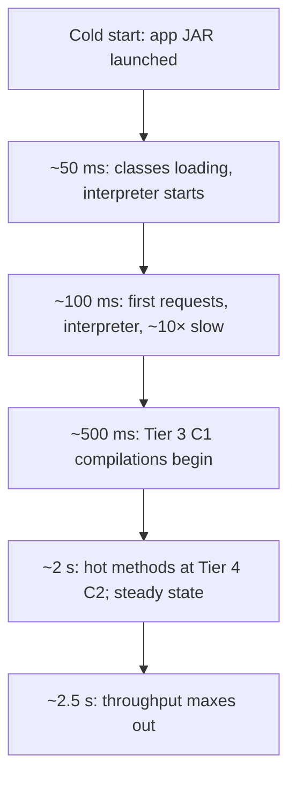
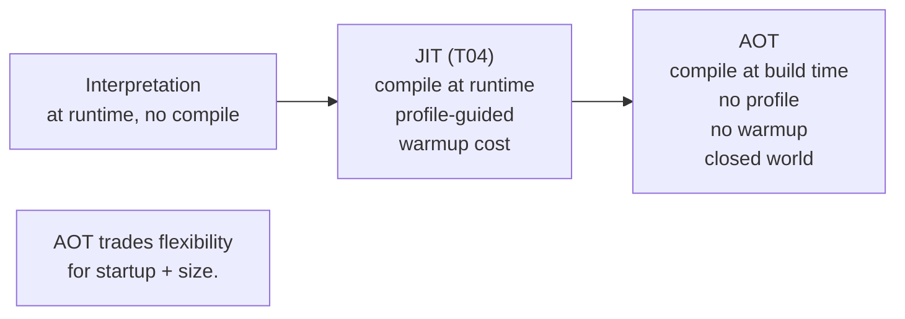
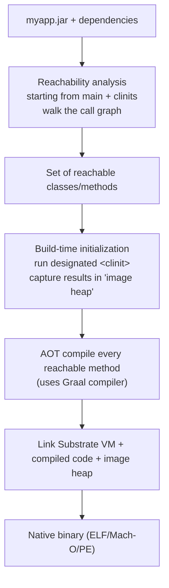

# AOT & GraalVM Native Image

T04's tiered JIT delivers excellent steady-state throughput — *eventually*. But the warmup it requires (1–3 seconds before Tier 4 C2 is reached for the hottest methods) is a *catastrophic* cost for short-lived workloads: a Lambda function invocation that completes in 200 ms can't afford a 1-second warmup; a `kubectl`-like CLI tool runs for seconds total; a Spring Boot pod scaling to 100 replicas in Kubernetes ties up CPU and memory on JIT compilation each time. **Ahead-of-time (AOT) compilation** is the answer — compile bytecode to native code **at build time**, ship the result as a single binary, run it with no JVM, no JIT, no warmup — and **GraalVM native-image** is the dominant tool for doing this in 2026.

The depth-bar requirement isn't "native-image makes Java fast at startup." At the **mechanism** layer, GraalVM native-image performs **closed-world reachability analysis** starting from `main` (and all `<clinit>` blocks), traces every reachable class and method via a whole-program static analysis, and compiles *only* the reachable code into a single native binary that includes the minimal **Substrate VM** runtime (GC + thread support + limited bytecode interpreter for `JNI`/`Unsafe`/restricted dynamic loading). At the **initialization** layer, AOT introduces a *new distinction* foreign to JIT-based Java: **build-time vs runtime initialization**. A class can be initialized *during the native-image build* (its `<clinit>` runs, results baked into the image's heap) — cheap at runtime but only safe if the init is *pure* (no time, no random, no env). Or it can be deferred to *runtime* — incurs startup cost but supports dynamic state. The decision is per-class via `--initialize-at-build-time` / `--initialize-at-run-time` flags. At the **dynamic-feature** layer, AOT's closed-world assumption *fundamentally limits* runtime dynamicism: reflection works only on classes/methods explicitly listed in `reflect-config.json`; dynamic proxies require `proxy-config.json`; JNI requires `jni-config.json`; resources require `resource-config.json`; serialization requires `serialization-config.json`. The **GraalVM tracing agent** automates hint collection during a normal JVM run, but every modern framework (Spring Native, Quarkus, Micronaut) provides its own hints — and **JEP 484** (JDK 25) plans to standardize reachability metadata into a part of the JDK spec. At the **alternative** layer, **AppCDS** offers lighter-weight startup optimization without closed-world restrictions; **CRaC** (Coordinated Restore at Checkpoint, used by AWS Lambda SnapStart) snapshots a warmed-up JVM and restores on next start, skipping warmup entirely; **Project Leyden** (in progress) plans a third path combining build-time AOT with profile-guided JIT. We will cover all four layers, plus a decision matrix for picking the right approach in 2026.

> [!NOTE]
> Prerequisites: [JIT compilation](./T04-jit-compilation-c1-c2-tiered.md) (L3/C02/T04) — the warmup problem AOT solves; [Bytecode basics](./T03-bytecode-basics.md) (L3/C02/T03) — what gets AOT-compiled; [Class loading & class loaders](./T02-class-loading-and-class-loaders.md) (L3/C02/T02) — the closed-world restriction limits class loading; [JVM architecture](./T01-jvm-architecture-and-runtime-data-areas.md) (L3/C02/T01) — Substrate VM replaces the standard JVM.

## The JIT-Warmup Problem AOT Solves

A JIT-warmup latency curve for a typical Spring Boot service:



For a long-running server, 2.5 seconds of warmup amortized over hours of uptime is invisible. For Lambda invocations measured in 100s of milliseconds, a 2.5-second cold start is a *disaster*. The problem is fundamental: JIT *cannot* be fast at startup because it has no profile data to guide compilation, and even gathering profile data requires running the code.

AOT compilation moves compilation to **build time** — when there's no runtime budget. The result: zero warmup. The cost: closed-world constraints on what the binary can do at runtime.

## What AOT Is



AOT compilation translates bytecode to native machine code *before* the program runs. The compiled binary contains:

- Pre-compiled native code for every reachable method.
- A pre-built "image heap" — pre-initialized objects from build-time class init.
- A minimal runtime (Substrate VM) — GC, thread support, just enough JVMS conformance.
- *No* JIT, *no* full class loader, *no* JVMS bytecode interpreter for arbitrary new classes.

Result: a single binary you can deploy to anywhere with a compatible OS/architecture. Run it and it starts in milliseconds.

## GraalVM Native Image

**GraalVM native-image** (Oracle Labs) is the dominant AOT tool for Java:

```bash
# Install GraalVM (or use sdkman, brew, etc.)
# Then:
native-image -jar myapp.jar

# Result: a binary executable
ls -la myapp
# -rwxr-xr-x  1 user  staff  45_000_000  myapp     # ~45 MB ELF binary

./myapp
# Hello world (started in ~30 ms)
```

The basic workflow: take a `.jar`, run `native-image`, get a native binary. Build takes 1–5 minutes for a typical microservice.

### Output characteristics

| Metric | Typical value |
|--------|---------------|
| **Binary size** | 20–80 MB (small Spring Boot) |
| **Startup time** | 10–100 ms (vs 1–3 s on JVM) |
| **Memory footprint** | 50–150 MB (vs 200–500 MB on JVM) |
| **Throughput vs JVM (steady state)** | 80–95% (sometimes lower) |
| **Build time** | 1–10 minutes |

The startup and memory wins are dramatic — *the* reason serverless platforms love it. The throughput loss is real but manageable; for many workloads, it's an acceptable trade.

## The Substrate VM (SVM)

The binary includes a minimal runtime called the **Substrate VM**:

- **GC**: Serial GC by default (single-threaded mark-sweep-compact); G1 optionally; ZGC unsupported as of JDK 24.
- **Thread support**: pthreads on Linux/macOS; Win32 threads on Windows. Same threading semantics as the JVM.
- **Bytecode interpreter**: a limited interpreter for cases where AOT can't fully resolve (some reflection paths, dynamic proxies).
- **Stack walking, safepoints**: same as JVM for GC and debugging.

What's *missing* from a full JVM:

- **JIT compiler** — no runtime compilation (the whole point of AOT).
- **Full class loader** — no `ClassLoader.defineClass(bytes)` of arbitrary new classes; the classpath is fixed at build time.
- **Most JVM TI** — limited agent support; no full debugger attach.

The trade: SVM is *small* and *fast* because it's *less general* than the JVM.

## The Build Process

The native-image builder does a *whole-program* analysis:



The four phases:

1. **Reachability analysis**: starting from `main` and every class's `<clinit>` (that's marked for build-time init), walk the call graph. Every reachable method is included; unreachable code is *dropped*. Aggressive dead-code elimination — typically 80–90% of a JAR's classes are unreachable in any given app.
2. **Build-time initialization**: for classes marked `--initialize-at-build-time`, run their `<clinit>` *during the build*. The resulting object state (static fields, etc.) is captured in the **image heap** — a snapshot of the JVM heap that the binary uses as its initial state. At runtime, these objects are *already initialized* — zero cost.
3. **AOT compilation**: every reachable method gets compiled by the **Graal compiler** to native code. No JIT; this is *all* the compilation that will ever happen.
4. **Linking**: assemble the SVM + compiled code + image heap into a single ELF/Mach-O/PE binary.

## Reachability Analysis — the Closed-World Assumption

The fundamental requirement: **every class, method, and field used at runtime must be reachable from the static call graph at build time**. This is the **closed-world assumption**.

What's reachable trivially:

- `main` and every method it calls (transitively).
- Every constructor used to create objects flowing into reachable code.
- Every interface method that has a known reachable implementation.

What's *not* reachable without help:

- `Class.forName("dynamic.class.Name")` where the name is computed at runtime.
- `Class.getMethod("dynamicName")` reflection lookups.
- `Proxy.newProxyInstance(...)` for unknown interfaces.
- Resources read via `getResourceAsStream("/path/not/seen")`.

For these, the build needs *hints* — explicit declarations of what to include.

## Build-Time vs Runtime Initialization

A class's `<clinit>` (T02) can run *either* during native-image build *or* at runtime startup. The choice is per-class:

```bash
native-image \
  --initialize-at-build-time=com.example.PureConfig \
  --initialize-at-run-time=com.example.WithRandom \
  -jar myapp.jar
```

### Build-time init

- `<clinit>` runs *during the build*.
- Result (static field values) baked into the image heap.
- Runtime cost: **zero** — fields are already initialized.
- Restrictions: `<clinit>` must be **pure** — no current time, no `Random()` (or rather, the random value baked at build time will be reused forever), no environment access, no file I/O.

If a class with build-time init accidentally captures environment or random state, that state is *frozen* in the binary — and identical across every deployment of the binary.

### Runtime init

- `<clinit>` runs at JVM startup.
- Restrictions: none beyond normal Java rules.
- Cost: startup time penalty.

The framework you use (Spring, Quarkus) generally manages these flags for you. Manual tuning is rare.

> [!IMPORTANT]
> **Don't initialize random-number generators at build time.** The seed is captured during the build; every binary deployment uses the same seed. Always `--initialize-at-run-time` for `java.security.SecureRandom`, `ThreadLocalRandom`, etc. — though the GraalVM defaults usually handle this.

## Reflection and Dynamic Features — the Configuration Files

The closed-world assumption breaks for *reflection* and friends. The fix: configuration files in `META-INF/native-image/`:

### `reflect-config.json`

Lists classes/methods/fields accessed via reflection:

```json
[
    {
        "name": "com.example.MyClass",
        "allDeclaredConstructors": true,
        "allDeclaredMethods": true,
        "allDeclaredFields": true
    }
]
```

The build then includes these classes' metadata and registers them for reflective access.

### `proxy-config.json`

Lists dynamic proxy interfaces:

```json
[
    { "interfaces": ["com.example.MyInterface", "java.io.Serializable"] }
]
```

The build generates the proxy class ahead of time.

### `jni-config.json`

Lists classes/methods called from JNI.

### `resource-config.json`

Lists resources to embed:

```json
{
    "resources": {
        "includes": [ {"pattern": ".*\\.properties$"} ]
    }
}
```

### `serialization-config.json`

Lists classes serialized with `ObjectInputStream`/`ObjectOutputStream`.

Hand-writing these files is *tedious*. Two solutions:

### The GraalVM tracing agent

Run your app on a *regular* JVM with the GraalVM tracing agent:

```bash
java -agentlib:native-image-agent=config-output-dir=meta -jar myapp.jar
# exercise the app's features (run tests, exercise endpoints)
# the agent records all reflection/proxy/resource accesses to meta/*.json
```

Then use those configs for the native-image build. Workable for test-suite-driven coverage.

### Framework support

Modern frameworks include comprehensive native-image hints:

- **Spring Native / Spring Boot 3+**: official support; `@RegisterReflectionForBinding`, Spring AOT processor.
- **Quarkus**: built around native-image; "supersonic, subatomic"; build-time analysis tightly integrated.
- **Micronaut**: ahead-of-time DI generation; native-image first-class.
- **Helidon**: similar AOT-friendly approach.

For libraries, the **GraalVM Reachability Repository (GRR)** — `https://github.com/oracle/graalvm-reachability-metadata` — collects community hints for popular libraries. Native-image automatically downloads matching metadata for known libraries.

### JEP 484 — Reachability metadata standardization

JEP 484 (JDK 25, in progress) plans to standardize reachability metadata as a part of the JDK spec, so library authors can ship hints with their JARs in a standard format. Will simplify AOT adoption significantly.

## PGO for Native Image

GraalVM EE supports **Profile-Guided Optimization (PGO)** for native-image — similar to C2's runtime PGO but at build time:

```bash
# Step 1: build instrumented binary
native-image --pgo-instrument -jar myapp.jar -o myapp-inst

# Step 2: run instrumented binary to collect profile
./myapp-inst         # exercise typical workloads; collects default.iprof

# Step 3: rebuild with profile
native-image --pgo=default.iprof -jar myapp.jar -o myapp
```

PGO-built native binaries often achieve 95–100% of JIT throughput — closing the gap with JVM-mode. Worth the build complexity for performance-sensitive serverless workloads.

## Framework Support

The big four in 2026:

| Framework | Native-image story | Notes |
|-----------|--------------------|-------|
| **Spring Boot 3+** | First-class via Spring Native + Spring AOT | The default for Spring apps; hints automatic |
| **Quarkus** | Built around native-image | "Supersonic, subatomic" tagline; Red Hat-backed |
| **Micronaut** | AOT-first DI + native-image | Compile-time DI annotations process eliminates reflection |
| **Helidon** | MicroProfile + native-image | Oracle-backed lightweight framework |

All four make native-image *easy* — just `mvn -Pnative package` (Spring) or `./mvnw package -Dnative` (Quarkus). The framework provides hints automatically.

## When AOT Wins — When JIT Wins

The decision matrix:

| Workload | Use |
|----------|-----|
| **AWS Lambda / Cloud Functions** | **AOT** — cold starts dominate |
| **CLI tools** | **AOT** — process lifetime is seconds |
| **Kubernetes pods that auto-scale** | **AOT** — startup latency matters |
| **Embedded / IoT** | **AOT** — memory constraints |
| **Long-running monolithic services** | **JIT** — JIT amortizes; PGO matters |
| **High-throughput pipelines** | **JIT** — C2's runtime optimization wins |
| **Reflection-heavy frameworks (legacy)** | **JIT** — AOT is hard to make work |
| **Apps under heavy dynamic class loading** | **JIT** — closed world impossible |

For typical microservices in 2026: try AOT first if you use Spring Boot 3, Quarkus, or Micronaut. Fall back to JVM-mode if AOT doesn't meet throughput requirements or your code has irresolvable dynamic features.

## Lighter Alternatives — AppCDS and CRaC

Two intermediate options between full JIT and full AOT:

### AppCDS — Application Class Data Sharing

T02 introduced AppCDS. Recap:

```bash
# Record classes loaded by app
java -XX:ArchiveClassesAtExit=app.jsa -cp myapp.jar com.x.Main

# Use the archive
java -XX:SharedArchiveFile=app.jsa -cp myapp.jar com.x.Main      # 30–60% faster startup
```

AppCDS pre-loads classes into a memory-mapped archive at startup, skipping the load + verify cost. No closed-world restriction; full JVM-mode at runtime; modest startup improvement (not as dramatic as AOT).

**When AppCDS is the right answer**: medium-sized Spring Boot apps where you want faster startup *without* the build complexity and reflection limitations of native-image.

### CRaC — Coordinated Restore at Checkpoint

**CRaC** (JEP 575 / OpenJDK CRaC project) takes a different approach: run the app, warm it up, **snapshot** the running JVM state to disk, then **restore** from snapshot at next start — skipping warmup entirely.

```bash
# Run + warm + snapshot
java -XX:CRaCCheckpointTo=./checkpoint -jar myapp.jar
# (in another shell, after warmup)
jcmd <pid> JDK.checkpoint

# Restore — starts already-warmed
java -XX:CRaCRestoreFrom=./checkpoint
```

The restored process starts with all classes loaded, all hot methods JIT'd, all GC tuning done. Startup latency: **single-digit milliseconds**.

The restrictions:

- File descriptors must be reopened after restore (CRaC has hooks for libraries to participate).
- Network connections must be reestablished.
- Wall-clock time jumps from snapshot time to restore time.

**Used in production by AWS Lambda SnapStart** for Java 11+ runtimes. CRaC is *the* answer for production serverless that wants both JIT throughput and instant startup.

### Project Leyden

**Leyden** (in active development, JDK 25+ target) plans to combine the three paths:

- **Premain (build-time)**: AOT-compile what's known statically.
- **Premain (load-time)**: optimize as classes are loaded.
- **Premain (runtime)**: continue JIT for hot paths.

Promises the startup of native-image with the runtime flexibility of JVM-mode. Not production-ready as of 2026.

## Comparison Matrix

| Approach | Startup | Throughput | Memory | Dynamic support | Build cost |
|----------|---------|------------|--------|-----------------|------------|
| **JIT (default JVM)** | 1–3 s (slow) | Best | Highest | Full | None |
| **AppCDS** | 0.3–1.5 s (faster) | Same as JIT | Same | Full | Low (one record run) |
| **CRaC** | ~10 ms (instant) | Same as warmed JVM | Same | Full (limited recovery) | Medium (snapshot pipeline) |
| **GraalVM native-image** | 10–100 ms | 80–95% of JVM | Lowest | Limited (hints required) | High (build complexity, 1–10 min) |
| **Project Leyden** (future) | TBD | TBD | TBD | TBD | TBD |

Pick by workload. For 2026 production:

- **Greenfield serverless**: GraalVM native-image (Spring Boot 3 / Quarkus / Micronaut).
- **Greenfield server-side**: JVM-mode with AppCDS.
- **Existing serverless with warmup pain**: CRaC (Lambda SnapStart) if available, else native-image.
- **Heavy reflection/dynamic loading**: JVM-mode only.

## Common Pitfalls

### Reflection silently breaks

A reflective call without a hint throws `ClassNotFoundException` or `NoSuchMethodException` at runtime — *only when the code path is hit*. Test coverage matters more for AOT than for JVM-mode.

### Long build times

Native-image builds take 1–10 minutes; longer for big apps. Don't wait until release time to discover this — add it to CI early.

### Image size larger than expected

Heavy use of reflection or full inclusion of libraries can balloon the binary. Strip unused dependencies; use jlink for the JDK side if AOT proves too heavy.

### Some libraries are AOT-incompatible

Libraries that generate bytecode at runtime (CGLIB-heavy frameworks, some old serialization libraries) may not work. Check the GraalVM Reachability Repository for compatibility.

### Build-time init capturing environment

If a class's `<clinit>` reads an env var or property at build time, the value is captured in the binary forever. Use `--initialize-at-run-time` for any class touching env/random/time.

### Debugging is harder

No `jstack`, no JVMTI, no live debugger attach (mostly). GraalVM is working on debug support; in 2026 it's improving but still less mature than JVM debug tooling.

### Forgetting framework support

Spring Boot 3, Quarkus, Micronaut have transformed native-image from "PhD-level effort" to "one Maven flag." Don't try to make raw Spring Boot 2 work natively — upgrade to 3.

## Observability

### Build report

`native-image --native-image-info -jar myapp.jar` produces a build report: reachable classes, methods, size breakdowns. The first place to look when binary is too large or build fails.

### Build logs

`native-image --verbose` shows reachability analysis decisions, init choices, errors.

### Runtime

Substrate VM supports basic GC logging (`-XX:+PrintGC`) and limited JFR (improving each release). Full JVM observability not available — diagnose with structured app logs.

### Tracing agent (build phase)

```bash
java -agentlib:native-image-agent=config-output-dir=meta -jar myapp.jar
```

Records all reflection/proxy/resource accesses to JSON files. Use to bootstrap hints for legacy code.

## Practice

1. **Build a native-image of "Hello World".** Install GraalVM; `native-image -jar HelloWorld.jar`. Measure startup time vs JVM-mode.
2. **Build a Spring Boot 3 native binary.** Use `./mvnw -Pnative package`. Measure startup; deploy; observe size.
3. **Reflection breaks.** Build a tiny app that uses `Class.forName(System.getenv("CLS"))`. Build native-image; run with `CLS=java.util.HashMap`; observe failure. Add reflect-config.json; retry; observe success.
4. **GraalVM tracing agent.** Run a JVM-mode app with the tracing agent; exercise features; observe the generated `*-config.json` files. Use them in a subsequent native-image build.
5. **Build-time vs runtime init.** Build an app with `--initialize-at-build-time=` on a class that reads `System.getenv("X")`. Build with `X=foo`; deploy; verify the binary returns "foo" even when `X=bar` at runtime. Then move to `--initialize-at-run-time=`; verify dynamic behavior.
6. **AppCDS comparison.** Take the same Spring Boot 3 app; benchmark startup with: (a) JVM-mode no AppCDS; (b) JVM-mode with AppCDS; (c) native-image. Plot the three.
7. **CRaC snapshot/restore.** Run a JVM-mode app; warmup; snapshot via JDK.checkpoint; restore in a new process; measure restore time vs cold start.
8. **PGO for native-image.** Build instrumented binary; run with workload; collect profile; rebuild with profile. Compare throughput vs base AOT and vs JVM-mode.
9. **GraalVM Reachability Repository.** Add a library that has GRR metadata; observe that native-image automatically picks it up.
10. **Quarkus vs Spring Native comparison.** Build the same RESTful microservice in both; compare binary size, startup, throughput.
11. **Resource embedding.** Add `resource-config.json` to embed `*.properties` files; verify they're available in the native binary.
12. **Lambda deployment.** Deploy a native-image binary to AWS Lambda's custom runtime; compare cold-start latency with JVM-mode + SnapStart.

## Recap

You should now be able to:

- Defend **why AOT exists**: JIT warmup (1–3 s) is unacceptable for short-lived workloads (FaaS, CLI, K8s pod churn). AOT compiles at build time → zero warmup, smaller binaries, less memory.
- Identify **GraalVM native-image** as the dominant Java AOT tool: single ELF/Mach-O/PE binary; 20–80 MB; 10–100 ms startup; 50–150 MB memory; 80–95% of JVM throughput.
- Describe the **Substrate VM (SVM)**: minimal runtime included in the binary (GC + threads + limited bytecode interpreter); no JIT, no full class loader, limited JVMTI.
- Walk through the **build process**: reachability analysis from `main` and `<clinit>` blocks → build-time init runs `<clinit>` capturing static state in the image heap → AOT compile every reachable method via Graal → link into a binary.
- Apply the **closed-world assumption**: every class/method/field used at runtime must be reachable from the static call graph at build time. Reflection, dynamic proxies, JNI, resources, serialization need explicit hints.
- Distinguish **build-time vs runtime initialization**: build-time runs `<clinit>` during native-image build (zero runtime cost, requires *pure* init); runtime defers to startup (slower, supports dynamic state). Control via `--initialize-at-build-time` / `--initialize-at-run-time`.
- Configure dynamic features via **`reflect-config.json` / `proxy-config.json` / `jni-config.json` / `resource-config.json` / `serialization-config.json`** — typically auto-generated by the **GraalVM tracing agent** during a JVM-mode test run, or by the framework (Spring Native, Quarkus, Micronaut).
- Recognize **JEP 484 (JDK 25)** as the upcoming standardization of reachability metadata, and the **GraalVM Reachability Repository (GRR)** as the current community source of hints for popular libraries.
- Apply **PGO for native-image** (GraalVM EE): build instrumented binary → run with workload → collect profile → rebuild with profile → achieve 95–100% of JVM throughput.
- Pick frameworks with native-image support: **Spring Boot 3+ / Quarkus / Micronaut / Helidon**. All make AOT a single Maven flag.
- Apply the **decision matrix**: AOT for serverless / CLI / K8s pod churn; JIT for long-running services / reflection-heavy code; CRaC for serverless that needs both JIT throughput and instant startup; AppCDS for modest startup wins on JVM-mode.
- Use **lighter alternatives**: **AppCDS** (no closed world; modest startup gain); **CRaC** (snapshot/restore warmed JVM; instant restart; used by AWS Lambda SnapStart); **Project Leyden** (in progress for JDK 25+, combines AOT + load-time + runtime optimization).
- Avoid the **7 common pitfalls**: silently broken reflection, long build times surprising CI, image-size bloat from heavy reflection, AOT-incompatible libraries (CGLIB-based), build-time init capturing env/random, harder debugging in production, ignoring framework support for raw native-image work.

## Next

Continue to [Memory model: heap, stack, metaspace](./T06-memory-model-heap-stack-metaspace.md) — going deeper into T01's runtime data areas. We'll dissect the heap's generational structure (Eden + S0 + S1 + Old + special spaces for humongous objects in G1), the stack's per-thread layout in detail (Linux process memory map for a JVM, mmap vs malloc allocations, NUMA considerations), the Metaspace's chunk-based allocator (class loader has its own chunk space → unload = chunk-list freed), the off-heap world (direct ByteBuffers via sun.misc.Unsafe / FFM, memory-mapped files via FileChannel, NIO buffers), and the practical implications for tuning `-Xmx` / `-Xss` / `-XX:MaxMetaspaceSize` / `-XX:MaxDirectMemorySize` against a hard container limit.
