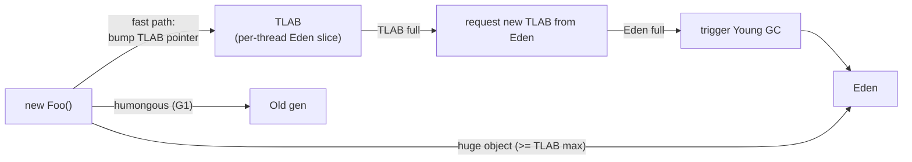
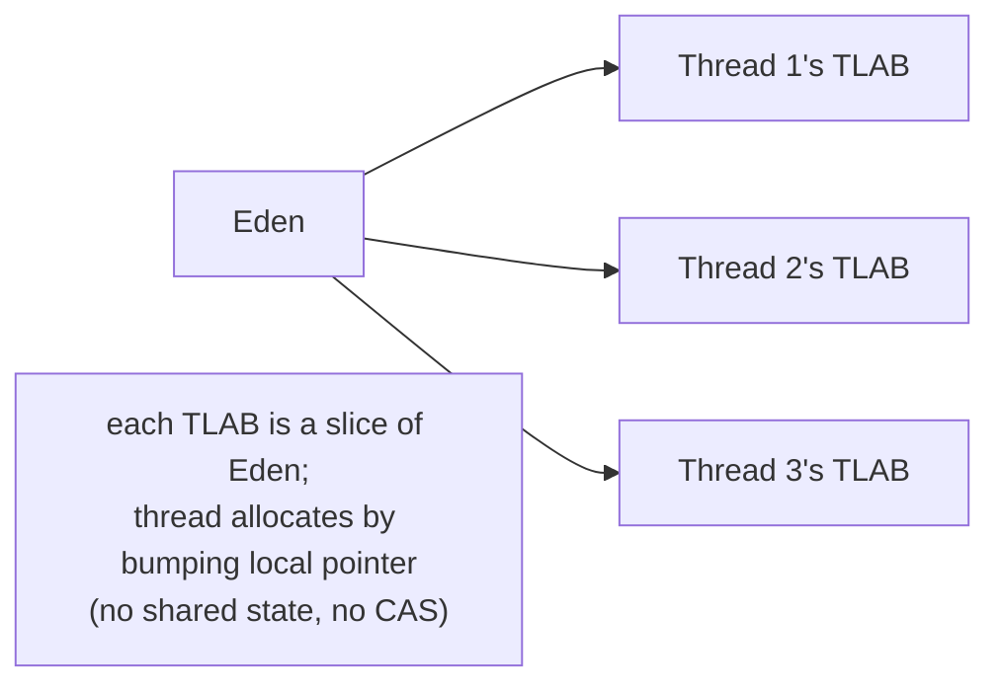
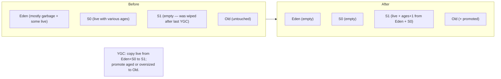
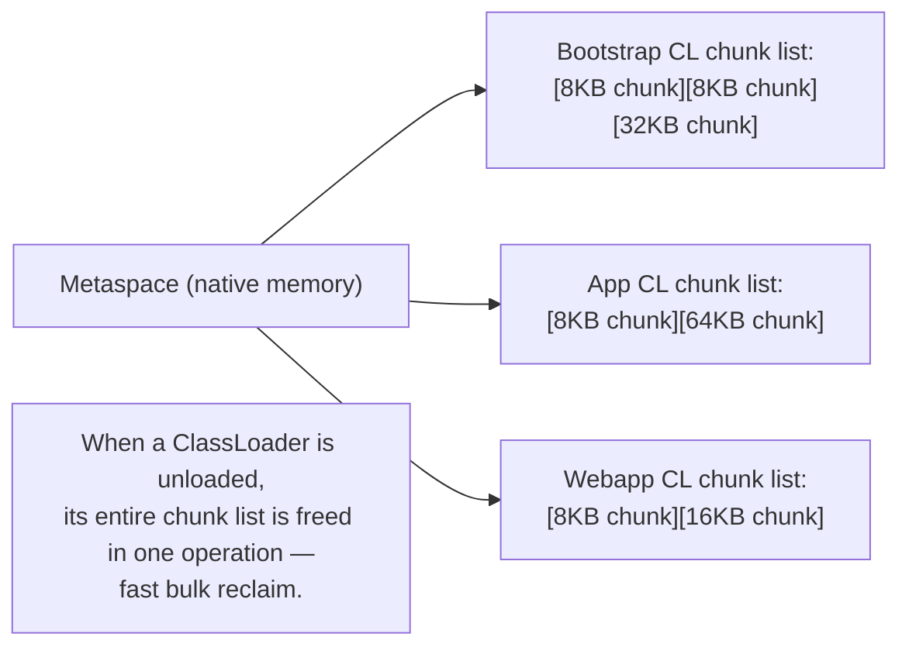

# Memory Model: Heap, Stack, Metaspace

T01 introduced the five runtime data areas. This topic goes *deeper* into the three that production engineers actually tune: **heap** (generational structure with TLABs for fast allocation; humongous objects as a special case; the cliff at 32 GB where compressed OOPs disable), **stack** (per-thread layout under Linux, with mmap-backed stacks and guard-page-based stack overflow detection), and **Metaspace** (the chunk-based allocator that gives per-ClassLoader chunk lists, enabling fast bulk unload when a CL is collected). Plus the **off-heap world** — direct ByteBuffers, memory-mapped files, the JEP 454 Foreign Function & Memory API replacing the legacy `Unsafe` — and **container-aware memory sizing** that's the difference between a healthy JVM and one OOM-killed by Kubernetes.

The depth-bar requirement isn't "the heap holds objects." At the **heap-structure** layer, the generational hypothesis (*most objects die young*) drives a heap divided into **Eden** (where 99% of allocations land), **two Survivor spaces** S0 and S1 (one in use, the other ready for the next minor GC copy), and **Old/Tenured** (long-lived objects); G1 adds **humongous regions** for objects ≥ 50% of a G1 region size. At the **allocation** layer, the **TLAB (Thread-Local Allocation Buffer)** — a per-thread slice of Eden — enables allocation to be a single *bump-pointer* operation (one or two instructions, no synchronization), making Java's "every method call allocates" idiom genuinely cheap. The fast path costs ~1 ns; the slow paths (TLAB refill, Young GC, direct-to-Old) cost progressively more. At the **stack** layer, each platform thread (T01) gets its own stack mmap'd from the OS — a 1 MB virtual address-space reservation on 64-bit Linux, growing down from a guard page that triggers `StackOverflowError` on write. At the **off-heap** layer, **direct ByteBuffers** allocate native memory via `mmap` for zero-copy NIO I/O; **memory-mapped files** delegate paging to the OS; **FFM (JEP 454, JDK 22)** provides a typed, lifetime-managed alternative to `sun.misc.Unsafe`. At the **container** layer, `-XX:+UseContainerSupport` (default since JDK 8u131) makes the JVM cgroup-aware; `-XX:MaxRAMPercentage` (default 25%) caps `-Xmx` by container memory; misconfiguration leads to **container OOM-kill** (SIGKILL — no chance to dump heap). We will cover all five layers, plus the **32 GB cliff** where compressed OOPs disable and references double in size, and the **NUMA awareness** that matters on multi-socket servers.

> [!NOTE]
> Prerequisites: [AOT & GraalVM native image](./T05-aot-and-graalvm-native-image.md) (L3/C02/T05) — completes the JIT/AOT story; [JIT compilation](./T04-jit-compilation-c1-c2-tiered.md) (L3/C02/T04) — code cache is one memory area; [Class loading & class loaders](./T02-class-loading-and-class-loaders.md) (L3/C02/T02) — Metaspace chunks are owned by ClassLoaders; [JVM architecture](./T01-jvm-architecture-and-runtime-data-areas.md) (L3/C02/T01) — the five-areas overview this topic deepens; [synchronized, monitors & intrinsic locks](../C01-concurrency/T03-synchronized-monitors-and-intrinsic-locks.md) (L3/C01/T03) — object header structure.

## The Heap — Generational Structure In Depth

The **generational hypothesis** (Lieberman & Hewitt, 1983; confirmed empirically across decades of language runtimes): *most objects die young*. A typical Java workload has 80–95% of allocated objects unreachable within a few hundred milliseconds — they're temporaries, intermediate results, request-scoped objects. A small fraction survives to become long-lived (singletons, caches, request batches).

A *generational* GC exploits this: collect *young* objects frequently (they're mostly garbage, so collection is fast) and *old* objects rarely (collection is expensive but rarely needed). HotSpot's classical heap divides into:

```text
Heap (-Xmx)
├─── Young Generation (~25-33% of heap by default)
│    ├─── Eden       (~80% of young; allocations land here)
│    ├─── Survivor 0 (~10% of young; one of two)
│    └─── Survivor 1 (~10% of young; the other)
└─── Old / Tenured  (~67-75% of heap)
```

Sized via:

- **`-Xmx`** — total heap.
- **`-XX:NewRatio=2`** (default) — old:young ratio. NewRatio=2 means old is 2× young (young is 1/3 of heap).
- **`-XX:SurvivorRatio=8`** (default) — eden:survivor ratio. 8 means eden is 8× one survivor (eden ≈ 80% of young).

### Eden — Where Allocations Land

Every `new` allocation goes to Eden first. Modern GCs make this *very* cheap:



The path:

1. **Fast path** (>99% of allocations): bump the TLAB pointer. ~1 ns, no synchronization.
2. **TLAB refill**: TLAB exhausted → request a new TLAB from Eden. ~100 ns (involves a CAS).
3. **Young GC**: Eden full → pause the world (briefly), copy survivors to a Survivor space (next subsection).
4. **Direct to Old**: object too large for any TLAB → allocate directly in Old (or as humongous in G1).

### The TLAB (Thread-Local Allocation Buffer)

Without TLABs, every thread would have to CAS on a shared Eden top-pointer for every allocation — pathological cache-line contention. TLABs sidestep this:



Properties:

- Each thread has its own TLAB — typically 256 KB to 1 MB.
- Allocation is a **bump-pointer** operation: `result = top; top += size; if (top > end) slow_path()`.
- TLAB size **adapts** based on the thread's allocation rate (`-XX:+ResizeTLAB`, default on).
- When the TLAB fills, the thread requests a new one from Eden (one CAS on Eden's top pointer).
- TLABs are *abandoned* when a Young GC happens — the next allocation gets a fresh TLAB.

`-XX:+UseTLAB` (default on) controls TLABs. **Never disable them** — disabling makes allocation 10–100× slower under contention.

### Survivor Spaces — the Copy-and-Age Mechanism

A **Young GC** (minor GC) does:

1. Identify all live objects in Eden + the *active* Survivor space (call it S0).
2. **Copy them all** to the *inactive* Survivor (S1).
3. Increment each survivor's **age**.
4. **Promote** to Old: objects whose age exceeds `-XX:MaxTenuringThreshold` (default 15) or that don't fit in S1.
5. Swap S0 and S1 — the freshly-filled S1 becomes the active Survivor; S0 is reset.
6. Reset Eden — it's now empty for new allocations.



The **copying** approach is what makes Young GC fast: only *live* objects are touched. If 95% of Eden is garbage (the generational hypothesis at work), only 5% is copied — extremely cheap. Dead objects don't get reclaimed individually; the entire Eden+S0 region is just reset.

### The Old Generation

Survivors that age out promote to Old. Objects too large for any TLAB go directly to Old. Old is collected by **Major GC** or **Full GC** — significantly more expensive than Young GC, full coverage in T07/T08.

### G1 Humongous Regions

The G1 collector divides the heap into ~2000 fixed-size **regions** (1–32 MB each, sized at startup). A normal region holds many objects. An object **≥ 50% of a region's size** is **humongous** — allocated in a special humongous region that holds *one* object.

Humongous objects skip the generational path: they go directly to Old (or to dedicated humongous regions, depending on G1 implementation). They're problematic — fragmentation, allocation cost — so avoid extremely large arrays where possible.

## The Stack — Per-Thread Memory in Depth

Every platform thread has its own **stack** — a region of memory mmap'd from the OS at thread creation. On 64-bit Linux:

```text
Per-thread stack layout (grows down):

  HIGH ADDRESS
  ┌──────────────────────────────┐ ← stack base (mmap'd from OS)
  │  Initial frame (Thread.run)   │
  ├──────────────────────────────┤
  │  Method A's frame              │
  ├──────────────────────────────┤
  │  Method B's frame              │
  ├──────────────────────────────┤
  │  Method C's frame              │  ← current frame (stack pointer)
  ├──────────────────────────────┤
  │  ... free space ...             │
  ├──────────────────────────────┤
  │  Guard page (PROT_NONE)        │  ← writing here triggers SOE
  └──────────────────────────────┘
  LOW ADDRESS
```

The stack is **1 MB** by default on 64-bit Linux (`-Xss1m`). The OS reserves this much virtual address space; physical memory is allocated lazily as pages are touched.

### Guard Page and `StackOverflowError`

At the *lowest* address of the stack is a **guard page** with `PROT_NONE` — any access triggers a segmentation fault. The JVM's signal handler catches the fault, recognizes it as stack overflow, and throws `StackOverflowError`.

This is *cheaper* than checking stack depth on every method call — the OS does the bounds check for free via the MMU.

### Native Frames

JNI calls and FFM downcalls push native (C/C++) frames onto the *same* per-thread stack. The frames follow the platform's C ABI (cdecl on Linux x86-64). The JVM's stack walker recognizes the boundary between Java frames (managed) and native frames (raw).

This is why **a virtual thread pinned by a JNI frame can't unmount** (T14) — the JVM can't relocate native frames to the heap.

### Stack Sizing

- **`-Xss1m`** (default): 1 MB per thread.
- **`-Xss256k`** for many threads: smaller, less memory, more SOE risk.
- **`-Xss10m`** for deep recursion (parsers, tree algorithms): higher SOE tolerance, less thread density.

A 1000-thread server using `-Xss1m` reserves 1 GB of virtual address space for stacks alone. Tuning matters.

## The Linux Process Memory Map for a JVM

`pmap <pid>` on Linux shows the process memory layout:

```text
Address           Kbytes Mode  Mapping
0000000000400000      4 r-x-- /usr/lib/jvm/java/bin/java         ← executable
0000000000600000      8 r---- /usr/lib/jvm/java/bin/java
0000000000800000     16 rw--- [ anon ]                           ← heap (BSS, malloc'd C heap)
0000000050000000 2097152 rw--- [ anon ]                           ← Java heap (-Xmx2g; 2 GB)
00000000d0000000  524288 rw--- [ anon ]                           ← Metaspace
00000000f0000000  245760 rwx-- [ anon ]                           ← code cache (executable)
00007f8000000000   1024 rw--- [ anon ]                           ← thread stack 1
00007f8000400000   1024 rw--- [ anon ]                           ← thread stack 2
00007f8000800000   1024 rw--- [ anon ]                           ← thread stack 3
...                                                                ↑ many more stacks
00007f9000000000   8192 rw--- [ anon ]                           ← direct ByteBuffer
00007f9000800000  16384 rw-s- /data/file.bin                      ← memory-mapped file
00007fa000000000 264192 r---- /usr/lib/jvm/java/lib/modules        ← JDK modules (mmap'd)
...
```

Note:

- **`[ anon ]`** — anonymous mapping (not file-backed).
- **`rwx--`** — read+write+execute (code cache is the only +x mapping by default; the JIT writes machine code into it).
- **`rw-s-`** — shared mapping (memory-mapped file).

Total **RSS** (Resident Set Size) = sum of resident-physical pages across all mappings. Often 1.5–2× `-Xmx` due to all the non-heap areas.

## Metaspace — the Chunk-Based Allocator

T01 introduced Metaspace as the JDK 8+ replacement for PermGen, holding class metadata in *native memory* (not the Java heap). The mechanics matter:

### Chunks and ClassLoader ownership

Metaspace allocates in **chunks** — variable-size native memory blocks. Each **ClassLoader** has its own **chunk list**:



Properties:

- **Bump-pointer allocation** within a chunk — fast, no synchronization (chunks are per-CL).
- **New chunks** allocated from Metaspace when an existing chunk fills.
- **Fast bulk unload**: when a ClassLoader is collected (T02), its entire chunk list is returned to Metaspace — no per-class cleanup.

This design enables app servers (Tomcat, Spring DevTools) to redeploy webapps efficiently: discard the webapp's CL → discard its chunks. **As long as the CL is actually unreachable** (T02's leak discussion).

### Compressed Class Pointers

Separately from compressed OOPs (which compress *references between objects*), the JVM can compress the **klass pointer** in each object's header from 8 bytes to 4 bytes via **`-XX:+UseCompressedClassPointers`** (default on, for heaps ≤ 32 GB):

- The 4-byte klass pointer is an *index* into the **compressed class space** — a separate (typically 1 GB) region of Metaspace that holds all Klass structures.
- Saves 4 bytes per object header — millions of objects → real savings.

```text
Object header layout (64-bit JVM, compressed class pointers default):

  [ 8 bytes mark word | 4 bytes klass index | 4 bytes padding ] → 16 bytes total

Without compressed class pointers:

  [ 8 bytes mark word | 8 bytes klass pointer ] → 16 bytes total (no savings)
```

`-XX:CompressedClassSpaceSize=1G` (default). If too small, the JVM throws `OutOfMemoryError: Compressed class space` — typically a class-loader leak (T02).

## The Off-Heap World

A surprising amount of JVM memory lives *outside* the Java heap:

### Direct ByteBuffers

```java
ByteBuffer buf = ByteBuffer.allocateDirect(1024 * 1024);    // 1 MB native allocation
```

`allocateDirect` allocates native memory via `mmap` (Linux) or `VirtualAlloc` (Windows) — outside the Java heap. The `ByteBuffer` object on the Java heap holds a pointer to the native memory.

Why use direct buffers? **Zero-copy NIO I/O.** A direct buffer can be passed to `read`/`write` syscalls directly — the kernel reads/writes from/to the native memory without an intermediate copy. For heavy network/file I/O (Netty, Kafka clients, RocksDB), direct buffers are essential.

The native memory is freed when the `ByteBuffer` is GC'd, via a `Cleaner` mechanism. But if you allocate many direct buffers and they accumulate (typical leak: long-lived collections holding direct buffers), you exhaust native memory:

```text
java.lang.OutOfMemoryError: Direct buffer memory
```

Sized via `-XX:MaxDirectMemorySize` (default: approximately equal to `-Xmx`). Counted against total process memory.

### Memory-Mapped Files

```java
FileChannel chan = FileChannel.open(path, READ);
MappedByteBuffer buf = chan.map(MapMode.READ_ONLY, 0, chan.size());
```

`FileChannel.map()` calls `mmap` to map a file region into process memory. The OS handles paging — pages loaded on first access; written-pages flushed back on `force()`.

Uses:

- **mmap'd databases** (LevelDB, RocksDB internal).
- **Log files** for fast append + random read.
- **Inter-process communication** via shared mappings.

Memory-mapped buffers count against process memory but *not* Java heap or direct buffer limits — they're managed by the OS page cache.

### FFM (Foreign Function & Memory) — JEP 454

The modern replacement for `sun.misc.Unsafe`, finalized in JDK 22. Provides safe, typed, lifetime-managed native memory:

```java
try (Arena arena = Arena.ofConfined()) {
    MemorySegment segment = arena.allocate(1024);
    segment.set(ValueLayout.JAVA_INT, 0, 42);          // typed write
    int x = segment.get(ValueLayout.JAVA_INT, 0);       // typed read
}    // arena.close() frees the memory deterministically
```

Two major improvements over `Unsafe`:

1. **Typed access**: `ValueLayout.JAVA_INT` knows the size and alignment — no raw byte arithmetic.
2. **Lifetime management**: `Arena` owns the memory; closing the arena frees everything allocated through it. Deterministic, exception-safe.

FFM also provides safe downcalls into native libraries (replacing JNI for many use cases). The eventual goal: `Unsafe` deprecation.

### sun.misc.Unsafe (Legacy)

The JVM's traditional escape hatch:

```java
Unsafe unsafe = ...;
long addr = unsafe.allocateMemory(1024);
unsafe.putInt(addr, 42);
int x = unsafe.getInt(addr);
unsafe.freeMemory(addr);
```

Used extensively by Netty, Spring, Hibernate (object instantiation without constructor), Cassandra (off-heap storage), JCTools (lock-free queues). Will be deprecated eventually in favor of FFM + VarHandle — but enormously deployed code depends on it as of 2026.

## NUMA Considerations

**Non-Uniform Memory Access**: on multi-socket servers, each CPU socket has its own memory controller. Accessing memory attached to *another* socket goes over the inter-socket interconnect — 2–3× slower than local-socket access.

JVMs can be NUMA-aware via `-XX:+UseNUMA` (default off in most JVMs as of 2026):

- The heap is logically partitioned per NUMA node.
- Each thread's TLAB is allocated from its current socket's heap partition.
- Result: most allocations land in *local* memory; cross-socket traffic minimized.

Worth enabling on dual/quad-socket servers (rare in cloud; common in HPC and high-end on-prem). On single-socket cloud VMs (most production), `-XX:+UseNUMA` is a no-op.

## Container Memory Limits — the cgroup Trap

Modern Java runs in containers (Docker, K8s) with **cgroup**-enforced memory limits. The JVM must respect these — otherwise the container OOM-killer SIGKILLs the process.

### Auto-detection

`-XX:+UseContainerSupport` (default since JDK 8u131) makes the JVM cgroup-aware:

- Reads the container's memory limit from `/sys/fs/cgroup/memory.limit_in_bytes` (cgroup v1) or `/sys/fs/cgroup/memory.max` (v2).
- Reports it as "available memory" to the JVM ergonomics layer.
- Adjusts `-Xmx` automatically via `-XX:MaxRAMPercentage` (default: 25% of container memory).

### The trap: setting `-Xmx` too close to the container limit

Total JVM memory is much more than `-Xmx`:

```text
Container memory: 4 GB

Bad sizing:
  -Xmx: 3.5 GB  (88%)
  Metaspace: 256 MB
  Code cache: 256 MB
  Direct memory: 256 MB
  Thread stacks (256 × 1 MB): 256 MB
  Native (GC structures, JNI): 512 MB
  TOTAL: ~5 GB → container OOM-killed

Good sizing:
  -Xmx: 2 GB  (50%)
  Metaspace: 256 MB
  Code cache: 256 MB
  Direct memory: 256 MB
  Thread stacks: 256 MB
  Native overhead: 512 MB
  TOTAL: ~3.5 GB → safely within 4 GB limit
```

Rule of thumb: **`-Xmx` ≈ 50–60% of container memory** for typical Spring Boot apps. More for compute-heavy workloads with small heaps; less for apps with heavy direct memory or many threads.

### OOM-killer interaction

Container OOM is enforced by the kernel: any process exceeding the cgroup limit gets SIGKILLed. **No chance to dump heap, write logs, or notify monitoring.**

To diagnose:

- `dmesg | grep -i kill` — kernel OOM messages.
- `kubectl describe pod` — K8s OOM-kill reason.
- `cat /sys/fs/cgroup/memory.events` — cgroup OOM counters.

Best practice: configure `-XX:+HeapDumpOnOutOfMemoryError` for *Java*-level OOM (which still gives the JVM time to dump); for *container* OOM, rely on observability tools to detect drift before SIGKILL.

## The Compressed OOPs 32 GB Cliff

Recap from T01: on a 64-bit JVM with heaps ≤ ~32 GB, references can be stored as **32-bit compressed OOPs** (with a 3-bit scale for 8-byte alignment), giving an effective 35-bit address space. Saves ~50% memory on reference-heavy workloads.

At `-Xmx32g+`, the JVM silently disables compressed OOPs. **Every reference doubles in size.**

```text
-Xmx30g with compressed OOPs:  references are 4 bytes.  Heap fits 30 GB of objects.
-Xmx33g without compressed OOPs: references are 8 bytes. Heap fits ~20 GB worth.
```

Counterintuitive but real: **`-Xmx30g` may hold MORE objects than `-Xmx33g`.** Always tune to stay under the compressed OOPs threshold (~31 GB, leaving safety margin).

`-Xmx31g` is *the* most-recommended setting for heaps that want to be "as big as compressed OOPs allow." Above 31 GB, very few workloads benefit — the doubled reference size dominates.

## Memory Leak Patterns (Preview — T10 Full Coverage)

Five canonical leaks:

### 1. Static collections growing forever

```java
static final Map<String, Object> CACHE = new HashMap<>();
public void put(String k, Object v) { CACHE.put(k, v); }     // no eviction → leak
```

Cache without bounds is a slow-burn OOM. Use `WeakHashMap`, Caffeine, or explicit eviction.

### 2. Listener / observer leaks

```java
component.addListener(this::handler);
// ... never removeListener — even after `this` should be collectable
```

`component` retains a reference to `this::handler`, which retains `this`. `this` lives forever.

### 3. ThreadLocal in pool threads (T17 from C01)

Long-lived thread-pool workers' ThreadLocalMaps accumulate entries. Clear in finally; or use `ScopedValue` (T14).

### 4. Inner class capturing outer

```java
class Outer {
    void doIt() {
        Runnable r = () -> System.out.println(field);     // captures `this`
        executor.submit(r);   // `r` outlives Outer's natural lifetime
    }
}
```

The lambda captures `Outer.this`. `Outer` can't be GC'd while `r` is reachable.

### 5. JNI / Unsafe native allocations not freed

Native heap allocations (via JNI `malloc`, FFM without arena, direct ByteBuffers held in long-lived collections) leak invisibly — no heap dump shows them; only NMT does.

Full diagnosis: T10 (memory leaks & heap dump analysis).

## Object Sizing with JOL

OpenJDK's [JOL](https://github.com/openjdk/jol) (Java Object Layout) library measures actual byte sizes:

```java
import org.openjdk.jol.info.ClassLayout;
System.out.println(ClassLayout.parseInstance(new HashMap<>(16)).toPrintable());
```

Output shows mark word, klass pointer, field offsets, padding. Useful for understanding overhead — e.g., `HashMap.Entry` is 48 bytes on 64-bit with compressed OOPs, much larger than the "two pointers + hash" mental model.

Common sizes:

- Object header (with compressed klass pointer): **16 bytes**.
- `String`: **24 bytes** + the backing `byte[]` (variable).
- `Integer`: **16 bytes** (header + 4-byte int + padding).
- `HashMap.Entry`: **48 bytes**.
- `ArrayList`: **24 bytes** + backing `Object[]`.

A `Map<Integer, Integer>` of 1000 entries: 1000 × 48 = 48 KB for entries + autoboxed Integers (16 KB) + the table array. ~80 KB for what's "conceptually" 16 KB of data. *This* is why concurrent collections (T10) use primitive-specialized variants where possible.

## Common Mistakes

### Setting `-Xmx` too close to container limit

The single most common production memory bug. Plan for *total* JVM memory, not just heap.

### Allocating massive arrays (humongous in G1)

A 50 MB array allocates in a humongous region; fragmentation accumulates. Prefer smaller chunks where possible.

### Forgetting `-XX:MaxDirectMemorySize` exists

Heavy NIO with no limit can exhaust process memory invisibly to heap monitoring. Always cap it.

### Disabling compressed OOPs

`-XX:-UseCompressedOops` doubles every reference's size. Almost never the right answer.

### Crossing the 32 GB cliff inadvertently

`-Xmx40g` gives you less effective heap than `-Xmx30g`. Stay below 31 GB or go very far above (and accept the cost).

### Setting `-Xss` too high

`-Xss10m` × 1000 threads = 10 GB virtual address space for stacks. Default `-Xss1m` is usually right.

### Trusting RSS as a complete picture

RSS shows resident memory but not committed/virtual. Use `pmap` + NMT for full understanding.

## Observability

### `jcmd <pid> GC.heap_info`

Heap occupancy and Young/Old breakdown.

### `jstat -gc <pid> 1s`

Per-second GC stats: Eden/Survivor/Old sizes and occupancies, GC counts and times.

### `jcmd <pid> VM.native_memory summary`

Requires `-XX:NativeMemoryTracking=summary`. Shows category breakdown: heap + Metaspace + code cache + thread stacks + GC + JIT + etc. Total ≈ RSS.

### `pmap -x <pid>` (Linux)

Process memory map with resident-set sizes per mapping. Identify Java heap, Metaspace, code cache, stacks, direct buffers, mmap'd files.

### JOL for object sizes

The right tool for "how big is this object actually?" questions.

### Container metrics

`kubectl top pod`, `docker stats`, cgroup files in `/sys/fs/cgroup/memory.*`.

## Practice

1. **Inspect TLAB sizing.** With `-XX:+PrintTLAB -XX:+PrintHeapAtGC`, run a small allocation-heavy app. Observe TLAB sizes and refill rates.
2. **Force a humongous object.** Allocate a 50 MB `byte[]`. With G1 and `-Xlog:gc*`, observe the humongous region allocation.
3. **Measure object sizes with JOL.** Print layouts for `Object`, `String`, `HashMap`, `ArrayList`, a record. Verify the predicted vs actual.
4. **`pmap` a JVM.** Run a Spring Boot app; `pmap -x <pid>`. Identify heap, metaspace, code cache, stacks, mmap'd modules. Sum to ≈ RSS.
5. **Stack overflow with guard page.** Write an unbounded recursive method; observe SOE. Run with `strace -e signal`; verify SIGSEGV → SOE conversion.
6. **Container OOM reproduction.** Run a JVM with `-Xmx=container_limit - 10%` (deliberately tight); generate load with high direct buffer allocation; observe SIGKILL via `dmesg`.
7. **Compressed OOPs effect.** Run a workload at `-Xmx30g` and `-Xmx33g`; measure how many objects fit. Verify the cliff.
8. **Direct buffer leak.** Allocate direct buffers in a long-lived list without releasing; observe `OutOfMemoryError: Direct buffer memory`. Add `-XX:MaxDirectMemorySize` to control.
9. **Memory-mapped file.** Use `FileChannel.map` to map a large file; access random parts; observe OS page cache behavior via `vmstat`.
10. **FFM Arena.** Allocate native memory via `Arena.ofConfined()`; verify deterministic free at arena close.
11. **NMT category drill-down.** Enable `-XX:NativeMemoryTracking=detail`. After warmup, run `jcmd VM.native_memory detail`. Identify which subsystems use what memory.
12. **Spring Boot container sizing.** Deploy a Spring Boot app to K8s with various `-XX:MaxRAMPercentage` values (25, 50, 75); observe stability under load.

## Recap

You should now be able to:

- Walk through the **generational heap structure**: Young (Eden + S0 + S1) + Old, sized via `-Xmx` + `-XX:NewRatio` + `-XX:SurvivorRatio`; the generational hypothesis justifies the structure.
- Explain **TLAB-based allocation**: per-thread bump-pointer in Eden slice; ~1 ns fast path; slow paths (TLAB refill, Young GC, direct-to-Old).
- Walk through a **Young GC**: copy live from Eden + active Survivor to inactive Survivor; age + promote to Old; swap survivors; reset Eden. Why copying is fast (only live objects touched).
- Recognize **humongous objects in G1** (≥ 50% of region size) — bypass generational path; problematic; avoid extremely large arrays.
- Describe the **per-thread stack layout**: mmap'd from OS, ~1 MB default, grows down from guard page; SOE triggered via SIGSEGV on guard page write.
- Read a **Linux process memory map** (`pmap`): executable + Java heap + Metaspace + code cache (rwx) + per-thread stacks + direct buffers + memory-mapped files + JDK modules. Total RSS = sum of resident pages.
- Walk through **Metaspace's chunk allocator**: per-ClassLoader chunk list; bump-pointer within chunk; bulk unload when CL collected; **`-XX:MaxMetaspaceSize`** caps total.
- Distinguish **compressed OOPs** (object references compressed to 4 bytes for heaps ≤ 32 GB) from **compressed class pointers** (klass pointer in object header compressed). Both default on; both contribute to header layout.
- Identify the **off-heap memory areas**: **direct ByteBuffers** (`allocateDirect`, for zero-copy NIO; sized via `-XX:MaxDirectMemorySize`); **memory-mapped files** (`FileChannel.map`, OS-managed paging); **FFM** (JEP 454, JDK 22 — safe typed alternative to Unsafe with Arena lifetime); **Unsafe** (legacy escape hatch, widely deployed).
- Apply **NUMA awareness** (`-XX:+UseNUMA`) on multi-socket servers — partition heap per NUMA node, allocate TLABs from local node.
- Plan **container-aware sizing**: `-XX:+UseContainerSupport` (default since JDK 8u131); `-XX:MaxRAMPercentage` (default 25%); rule of thumb `-Xmx` ≈ 50–60% of container memory; total JVM RSS ≈ 1.5–2× `-Xmx`.
- Avoid the **container OOM-killer trap**: container exceeded → SIGKILL → no heap dump. Plan all memory categories (heap + metaspace + code + stacks + direct + native) within the limit.
- Recognize the **32 GB compressed OOPs cliff**: `-Xmx32g+` silently disables compression; references double. `-Xmx30g` often holds more objects than `-Xmx33g`. Default to `-Xmx31g` or below for "biggest compressed-OOPs heap."
- Recognize the **5 canonical leak patterns**: unbounded static collections, listener registration without removal, ThreadLocal in pool threads (T17), inner-class capture of outer `this`, JNI/Unsafe native allocations not freed. Full diagnosis in T10.
- Use **JOL** to measure actual object sizes; understand the per-object overhead (16-byte header on 64-bit with compressed class pointers; HashMap.Entry = 48 bytes; padding to 8-byte alignment).
- Use **observability tools**: `jcmd GC.heap_info`, `jstat -gc`, `jcmd VM.native_memory summary` (with NMT), `pmap -x`, `kubectl top pod` / `docker stats`. Each shows a different layer.
- Avoid the **7 common mistakes**: `-Xmx` too close to container limit, massive arrays (humongous), forgetting `MaxDirectMemorySize`, disabling compressed OOPs, crossing 32 GB cliff inadvertently, `-Xss` too high, trusting RSS alone.

## Next

Continue to [Garbage collection fundamentals](./T07-garbage-collection-fundamentals.md) — *why* and *how* garbage collection works. We'll dissect the **mark-sweep**, **mark-compact**, and **copying** algorithms; the **tri-color invariant** that lets concurrent collectors mark while the application runs; **safepoints** as the synchronization mechanism between application threads and the GC; **write barriers** for tracking generational/region references; the **GC roots** every collection starts from; and the metrics (throughput, pause time, footprint, latency) that drive the choice of GC algorithm in T08.
