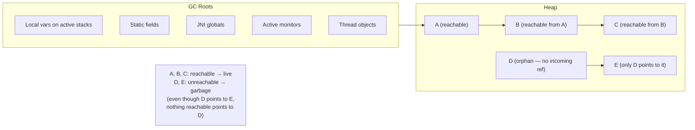
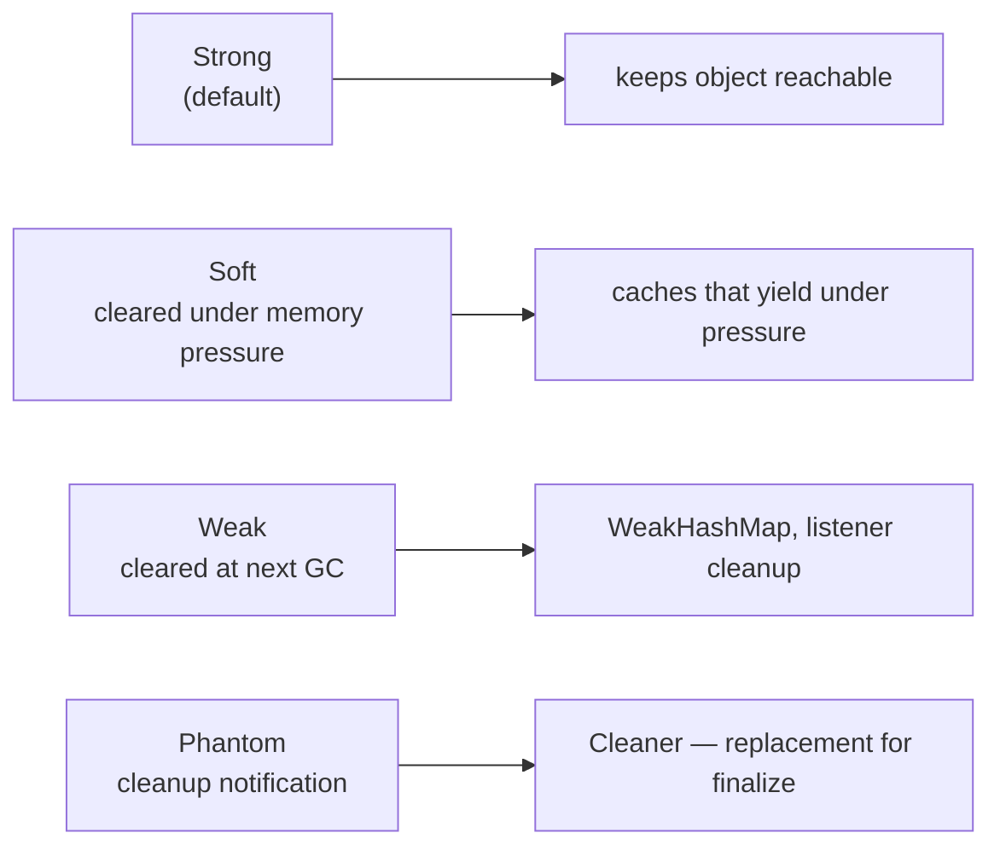
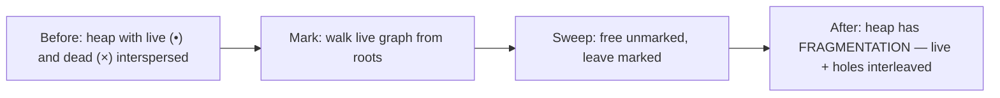
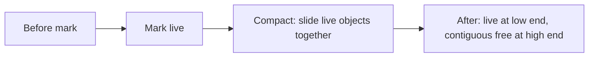
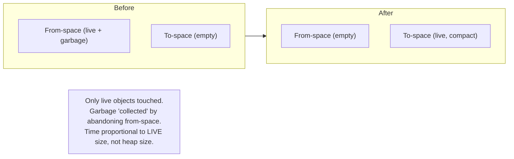
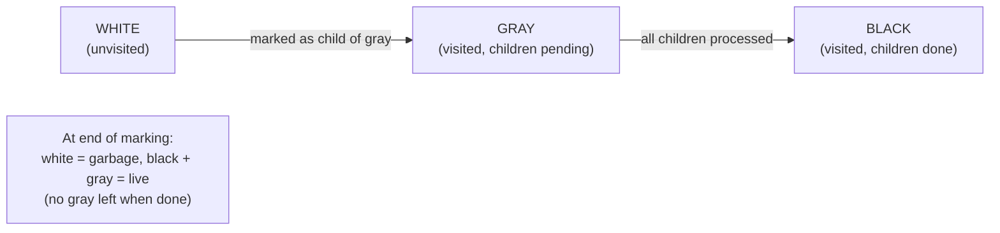
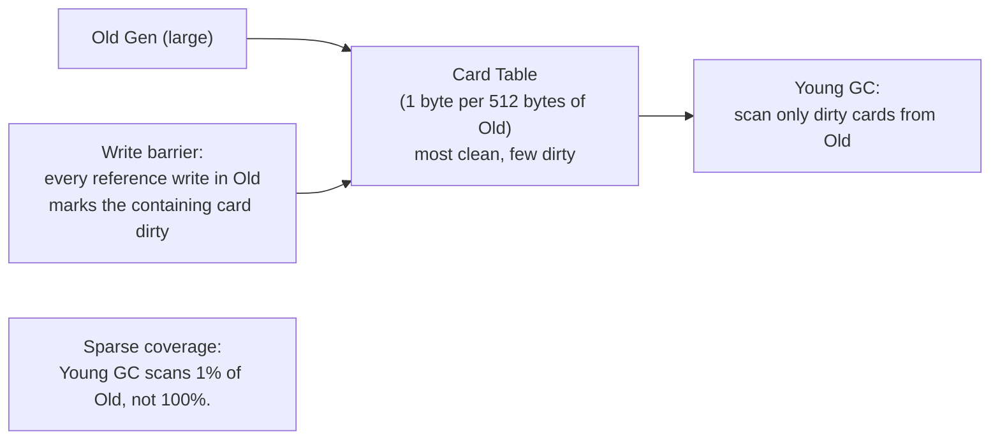
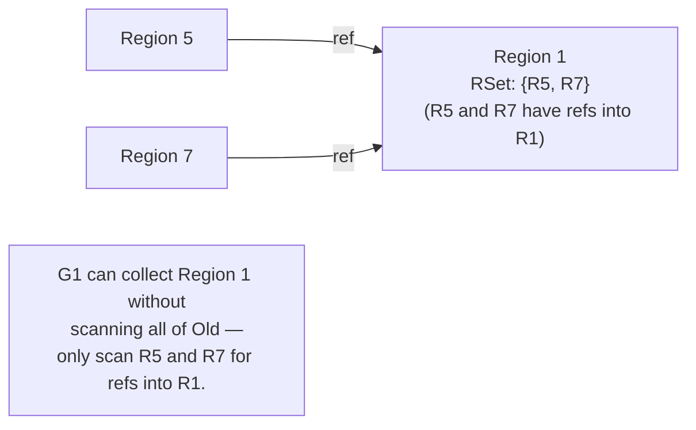
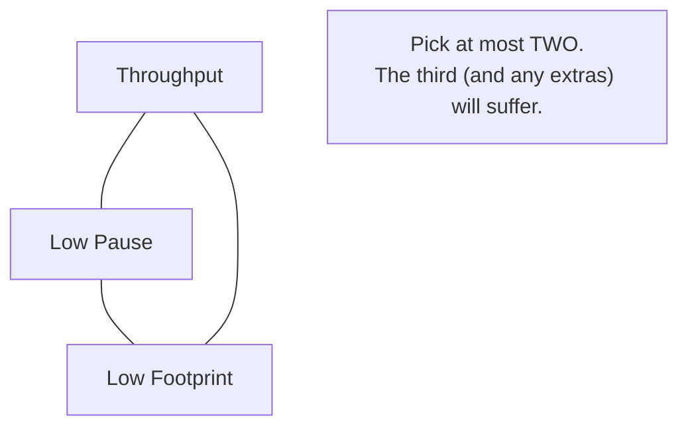
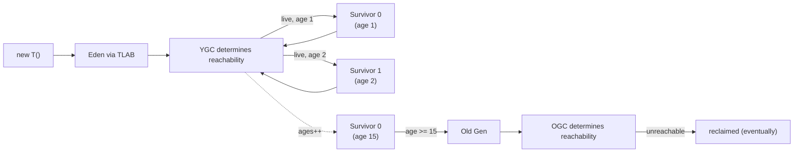

# Garbage Collection Fundamentals

T06 placed objects in the heap; T01 introduced the heap's role in the JVM. This topic covers the central question of every managed runtime: **how does the JVM decide which objects to reclaim, and how does it do so without breaking the running application?** Garbage collection (GC) is one of the most-studied areas of computer science, with 60+ years of literature; HotSpot's GCs (Serial, Parallel, G1, ZGC, Shenandoah — T08) are all variations on a small number of *fundamental* algorithms covered here. Understanding the fundamentals is what makes choosing and tuning a specific GC tractable.

The depth-bar requirement isn't "GC frees memory." At the **theory** layer, garbage = unreachable, which is the *computable approximation* of "no longer needed" — every collector traces reachability from a fixed set of **GC roots** (local variables on active thread stacks, static fields, JNI globals, active monitors, thread objects, ClassLoaders). At the **algorithm** layer, three classical mechanisms underlie *every* production collector — **mark-sweep** (mark live from roots, sweep dead in the rest of the heap; fast, fragmented), **mark-compact** (mark live, slide together to eliminate fragmentation; expensive pointer updates), and **copying** (two equal-sized spaces, copy live to the other; fast and unfragmented but 50% memory overhead — the basis of every Young Generation collector). At the **concurrency** layer, modern collectors run *alongside* the application via the **tri-color invariant** (white/gray/black marking) maintained by **write barriers** — code emitted at every reference write that prevents the GC from missing newly-created references; SATB (Snapshot-At-The-Beginning) for G1, more sophisticated variants for Shenandoah and ZGC, each costing ~5–15% throughput in exchange for sub-millisecond pause times. At the **synchronization** layer, **safepoints** are the JVM's mechanism for stopping application threads coherently: the compiler inserts cheap safepoint polls at method entries and loop back-edges; **time-to-safepoint (TTSP)** is the critical quietest-loudest measurement that bounds the JVM's worst-case pause; **card tables** (and G1's **remembered sets**) track inter-generational/inter-region references via write barriers so young collections don't have to scan the entire old generation. At the **metric** layer, the tuning game has *four* dimensions — **throughput** (% time not in GC), **pause time** (longest STW), **footprint** (memory used), **promptness** (delay between unreachable and reclaimed) — and the **unattainable triangle** says you can have any two but not all three. We will cover all five layers as the foundation for T08's specific-collector comparison.

> [!NOTE]
> Prerequisites: [Memory model: heap, stack, metaspace](./T06-memory-model-heap-stack-metaspace.md) (L3/C02/T06) — generational structure GC operates on; [JVM architecture](./T01-jvm-architecture-and-runtime-data-areas.md) (L3/C02/T01) — heap + stack data areas; [synchronized, monitors & intrinsic locks](../C01-concurrency/T03-synchronized-monitors-and-intrinsic-locks.md) (L3/C01/T03) — active monitors are GC roots.

## What GC Is — and Why

Manual memory management (`malloc`/`free` in C/C++) is *the* source of most security vulnerabilities in those languages: **use-after-free**, **double-free**, **memory leaks**, **dangling pointers**. Garbage collection eliminates these systematically by making allocation explicit and reclamation automatic — the program *allocates* (creates references); the runtime *frees* (reclaims unreachable memory) without programmer intervention.

The trade:

| What you get | What you pay |
|--------------|--------------|
| No use-after-free | GC pauses (or concurrency overhead) |
| No double-free | Throughput tax (write barriers, etc.) |
| No memory leaks (from forgotten frees) | Memory footprint overhead (card tables, marking state) |
| Simpler code | Less control over exact reclaim timing |

Modern Java GCs make the trade *very* favorable for most workloads — sub-millisecond pauses (ZGC/Shenandoah), single-digit % throughput overhead. Hand-written `malloc`/`free` is *no longer faster* for typical workloads when you measure total system throughput including allocation cost.

## The Reachability Problem

Garbage is *not* "objects the program is done with" — that's not computable. Garbage is **unreachable** — no chain of references from any **GC root** leads to it. The collector computes reachability, treats unreachable as garbage, and reclaims it.



The key property: **reachability is transitive**. If A is reachable and A→B, B is reachable. The collector traces the graph from roots and marks everything it reaches.

## GC Roots — Where Tracing Starts

Every GC starts from a known set of "roots" — references the JVM guarantees are live. The canonical set:

- **Local variables on active thread stacks** — every frame's locals array (T01) holds references that count as roots.
- **Static fields** — class-level variables in Klass structures in Metaspace.
- **JNI globals** — references held by native code via `NewGlobalRef`.
- **Active monitors** — objects currently being `synchronized` on (T03 from C01).
- **Thread objects themselves** — every running `Thread` is a root.
- **System ClassLoader and Bootstrap ClassLoader** — keep the JDK alive.
- **JVM internal references** — interned strings, code-cache references, etc.

Heap dumps (T10) show GC roots prominently in their "leak suspect" analysis — finding a long-retained object always starts by tracing its reachability path back to a root.

## Reference Types — Soft, Weak, Phantom

By default, every reference is **strong** — if reachable through strong refs, the object lives. Java provides three additional reference types for finer control:

### `SoftReference<T>` — cleared under memory pressure

```java
SoftReference<Image> cache = new SoftReference<>(loadImage(path));

// later:
Image img = cache.get();      // may return null if GC cleared it under memory pressure
```

The GC will clear soft references **before throwing OOM**. Good for caches: "keep this if you can; throw it away if memory is tight."

### `WeakReference<T>` — cleared at the next GC

```java
WeakHashMap<Key, Value> map = new WeakHashMap<>();   // uses WeakReference internally
```

Cleared at the next GC after the referent becomes unreachable through strong refs. Used for: weakly-keyed maps (entries disappear when keys do), ClassLoader leak prevention, listener lists.

### `PhantomReference<T>` — cleanup notification

```java
PhantomReference<Resource> ref = new PhantomReference<>(resource, queue);
// queue.poll() returns this ref *after* resource is finalized and ready to reclaim
// — but ref.get() ALWAYS returns null
```

Doesn't keep the object alive; instead, the reference is enqueued in a `ReferenceQueue` after the object is finalized and ready for reclamation. Use for cleanup actions that need to know "this object is gone now."

`Cleaner` (JDK 9+) is the modern replacement for `finalize()`, built on phantom references — runs cleanup code without the dangers of finalization (T17 from C01 — finalization deprecated).



## The Three Classical Algorithms

Every production GC variant is built on (combinations of) three fundamental algorithms.

### Mark-Sweep

```
PHASE 1 — Mark:
  stack = [all GC roots]
  while stack not empty:
    obj = pop stack
    if obj.mark is unset:
      set obj.mark
      for each child of obj: push child onto stack

PHASE 2 — Sweep:
  for each address in heap:
    if obj at address is not marked: free obj
    else: clear obj.mark for next cycle
```



**Pros**: simple; no copying overhead; runs in place.
**Cons**:
- **Fragmentation** — free memory becomes scattered; large allocations may fail even if total free space is large.
- **Sweep cost** — must walk entire heap, even dead regions.

Used as the base by CMS (now removed) and as a component of larger algorithms.

### Mark-Compact

```
PHASE 1 — Mark (same as mark-sweep)

PHASE 2 — Compact:
  next_free = heap_start
  for each obj in heap (in address order):
    if obj is marked:
      memmove(obj, next_free, sizeof(obj))
      update all references to obj → next_free
      next_free += sizeof(obj)
```



**Pros**: no fragmentation; contiguous free space enables fast bump-pointer allocation.
**Cons**:
- **Expensive moves** — copies every live object.
- **Pointer updates** — every reference to a moved object must be updated. Expensive (multiple passes over the heap).

Used by Serial Old, Parallel Old. The basis of full GCs in most collectors.

### Copying (Semi-Space)

```
Two equal-sized spaces: from-space (current), to-space (empty)

PHASE — Copy:
  next_free = to-space start
  for each root:
    copy root's target to to-space at next_free
    update root → next_free
    next_free += sizeof(obj)
  for each obj in to-space (BFS):
    for each child:
      if child in from-space (not yet copied):
        copy child to to-space
        update obj's reference
      else: update obj's reference to child's new location

After copying:
  from-space = entirely garbage → reset to empty
  swap roles: new "from-space" is the old "to-space"
```



**Pros**:
- **Fast** — time proportional to live data, not heap size. Generational hypothesis says young has 5% live, so YGC is ~5% of full-heap-walk cost.
- **No fragmentation** — copying produces contiguous output.
- **Bump-pointer allocation** — the next free spot is just `to-space.next`.

**Cons**:
- **50% wasted space** — only half the heap is usable for allocation at any time.
- **Survivor space tax** — needs reserved space for survivor copies.

This is the **algorithm of every Young Generation collector** in HotSpot. Combined with two Survivor spaces + Eden (T06) to amortize the 50% overhead.

## The Tri-Color Invariant — Concurrent Marking

Modern collectors **mark concurrently** — application threads run alongside GC mark threads. This is essential for sub-millisecond pause times (G1, ZGC, Shenandoah).

The challenge: while GC is marking, the application can *create new references* between objects. Without care, the GC may **miss** a newly-reachable object and reclaim it — a *use-after-free*.

The **tri-color invariant** is the formal property that prevents this. Every object is in one of three colors:

- **White**: not yet visited; potentially garbage.
- **Gray**: visited; some children not yet visited.
- **Black**: visited; all children visited.

Marking proceeds: roots start gray; a gray object is processed by marking its white children gray, then it turns black. Repeat until no gray remains. Then **white = garbage**.



### The invariant — what concurrent marking must maintain

**A black object must never directly point to a white object.**

If a black object pointed to white, the GC would *not* visit that white object (black is "done"), and the white object would be (incorrectly) reclaimed even though it's reachable.

While the application runs, it might create exactly such a reference:

```java
black_obj.field = white_obj;     // application creates BLACK → WHITE — invariant broken!
```

The fix: a **write barrier** that runs on every reference write to maintain the invariant.

## Write Barriers — Maintaining the Invariant

A **write barrier** is a tiny piece of code emitted by the JIT (or interpreter) at every assignment to a reference field. Two main strategies:

### SATB — Snapshot-At-The-Beginning (G1's default)

Recorded what *was* there before the write — preserving the "snapshot at the start of marking":

```
write_barrier_SATB(object, field, new_value):
    old_value = object.field
    if (marking_in_progress && old_value != null):
        push old_value to GC mark queue   // "I might have been the only path to that"
    object.field = new_value
```

Result: if the application overwrites a reference (potentially making something unreachable), the *old* reference is recorded — the GC will visit it during this cycle and mark it (potentially "live by snapshot"). May keep more garbage live for one cycle but never misses anything.

### Incremental Update (Dijkstra-style)

Recorded what's *being* added — preserving "no black → white":

```
write_barrier_incremental(object, field, new_value):
    if (object is black && new_value is white):
        mark new_value gray   // re-grays a black object's new target
    object.field = new_value
```

Result: if a black object gets a new white reference, the new white is marked gray (the GC will visit it). Precise; doesn't keep garbage extra cycles.

### Trade-offs

| | SATB (G1) | Incremental (others) |
|---|---|---|
| **Memory pressure** | Keeps snapshot until end → may retain some garbage one cycle | More precise; less retention |
| **Throughput cost** | Lower per-write cost | Slightly higher per-write |
| **Termination guarantee** | Easier (process the snapshot queue) | Requires re-scanning |

Both work; both add ~5–15% throughput overhead at every reference write. The cost of concurrent marking.

## Safepoints — How the GC Stops Threads

The GC sometimes *must* pause application threads (e.g., to compute root sets coherently). The JVM's mechanism: **safepoints**.

A safepoint is a place in the bytecode (or compiled code) where the JVM can safely freeze a thread:

- All Java state is consistent (no half-mutated objects).
- The thread's stack is in a known shape.
- Pointers in registers are observable.

The compiler **inserts safepoint polls** at:

- **Method entry** (every call enters at a safepoint).
- **Loop back-edges** (every loop iteration can be paused at the top of the next iteration).
- **Allocation sites** (after every `new`).
- **Method return** (before returning).

Each poll is a cheap check (~1–2 cycles): "is there a global safepoint request?" If yes, the thread descends into the GC.

### Time-to-Safepoint (TTSP)

When the GC requests a safepoint, every thread *eventually* reaches a poll. The longest a thread takes to reach is the **time-to-safepoint** (TTSP). The actual GC pause includes:

```
total_pause = max_TTSP + GC_work_time
```

If `max_TTSP` is 50 ms (a thread in a tight loop without poll insertion), the pause is *at least* 50 ms — even if the GC takes microseconds.

Modern compilers insert polls aggressively to keep TTSP low. **Long-running native code (JNI), tight loops without proper poll insertion, and class initialization can spike TTSP** — visible in `-Xlog:safepoint`.

```mermaid
sequenceDiagram
  participant T1 as thread 1
  participant T2 as thread 2
  participant GC as GC
  GC->>GC: request safepoint
  T1->>T1: hit poll quickly (next loop back-edge)
  T2->>T2: still running native code; takes 50 ms to return
  T2->>T1: T2 finally reaches a safe point
  GC->>GC: all threads stopped, BEGIN GC WORK
  Note over T1,T2: total pause = max TTSP (50 ms) + GC work
```

## Card Tables — Tracking Inter-Generational References

**Young GC** wants to be fast (frequent, small). But it must consider references from **Old → Young** — those keep young objects alive.

Naive: scan all of Old to find Old→Young references. Tomato when Old is 100× Young — Young GC takes forever.

**Solution: the card table.** Divide Old into "cards" of typically 512 bytes each; maintain a 1-byte array (1 byte per card) indicating which cards are "dirty" — have potentially been modified since last YGC.



The write barrier maintains the card table:

```
write_barrier_card(old_object, field, new_value):
    if (old_object is in Old && new_value is in Young):
        card_table[card_of(old_object)] = DIRTY
    old_object.field = new_value
```

Young GC then scans **only dirty cards** for Old→Young references. The card table is typically 1/512 the size of Old — for a 1 GB Old gen, that's 2 MB. Cheap.

### Remembered Sets — G1's More-Precise Variant

G1 divides the heap into regions; each region maintains a **remembered set** (RSet) — a per-region list of "from which regions do references into me come from?"



RSets are more memory-expensive than card tables (typically 1–5% of heap) but enable **region-level garbage collection** — G1's fundamental capability.

## GC Metrics — the Four Dimensions

Every GC tuning decision trades among four metrics:

### Throughput

% of total time spent *not* in GC. A program running 10 minutes with 30 seconds of GC pauses has 95% throughput.

```text
throughput = (total_time - gc_time) / total_time
```

Affected by: allocation rate, heap size, GC algorithm choice, application behavior.

### Pause Time (Latency)

Longest single STW pause. The user-facing latency floor. A web service with a 2-second GC pause is unusable.

For p99 latency-sensitive workloads, this is *the* metric. ZGC and Shenandoah target sub-millisecond pauses; classical Parallel GC tolerates 100ms–1s pauses for higher throughput.

### Footprint

Memory used by the JVM, including GC metadata (card tables, remembered sets, marking state). A GC with low footprint overhead leaves more heap for application data.

ZGC's metadata overhead is ~3% of heap. G1's is ~5–10%. Old serial collectors: <1%.

### Promptness

Time between an object becoming unreachable and being reclaimed. Higher promptness → lower steady-state footprint.

Concurrent collectors trade promptness for throughput (a Soft reference held by an unreachable object cleared at the *next* GC, not immediately).

## The Unattainable Triangle

**You can't have all four.** Concrete trade-offs:



- **Parallel GC**: high throughput + low footprint, but high pauses (100ms–seconds). Default in headless server before JDK 9.
- **G1**: balanced — moderate throughput, moderate pauses (10–100ms), moderate footprint. Default since JDK 9.
- **ZGC**: low pauses + good throughput, but higher footprint (more metadata). Default candidate for low-latency.
- **Shenandoah**: low pauses + good throughput, similar footprint to ZGC.

T08 covers each in depth and helps pick.

## Object Lifecycle Through GC

A typical object's journey:



Most objects die in Eden — collected on first Young GC. Survivors get re-copied each cycle until promotion at `MaxTenuringThreshold` (default 15). Old objects sit until a Major or Full GC reclaims them.

## Concurrent vs Parallel — and STW

Three orthogonal terms often confused:

- **Stop-the-world (STW)**: all application threads paused; only GC runs.
- **Parallel**: multiple GC threads working in parallel (still possibly STW).
- **Concurrent**: GC runs *alongside* application threads (not STW).

Modern collectors mix these phases:

| Phase | STW? | Parallel? | Concurrent? |
|-------|:----:|:---------:|:-----------:|
| **Initial mark** | yes | usually | no |
| **Concurrent mark** | no | yes | yes |
| **Final mark** | yes | yes | no |
| **Concurrent sweep / evacuate** | no | yes | yes |

The STW phases are *brief* (microseconds to single milliseconds in modern GCs); the bulk of work runs concurrently.

## Reference Processing — `Cleaner` Replacing `finalize`

Reference processing happens in a dedicated phase:

1. **Strong**: handled by normal marking.
2. **Soft**: cleared if memory is tight; otherwise kept.
3. **Weak**: cleared if no strong refs remain; enqueued in `ReferenceQueue`.
4. **Phantom**: enqueued *after* finalization (or `Cleaner` callback) runs.

### `Object.finalize()` — deprecated

```java
@Override
protected void finalize() throws Throwable {
    // run cleanup before GC reclaims
}
```

Deprecated in JDK 9; for removal in a future release. Reasons:

- Unpredictable timing.
- Performance hit (GC has to track finalizable objects separately).
- Resurrection (finalize can make objects reachable again).
- Errors swallowed silently.

### `Cleaner` — the modern replacement

```java
public class Resource implements AutoCloseable {
    private static final Cleaner CLEANER = Cleaner.create();
    private final Cleaner.Cleanable cleanable;

    public Resource() {
        // cleanup action runs after the Resource becomes phantom-reachable
        this.cleanable = CLEANER.register(this, () -> {
            // free native handle, etc.
        });
    }

    @Override
    public void close() { cleanable.clean(); }
}
```

Built on PhantomReferences. The cleanup runs on a dedicated thread *after* the object is unreachable — not in the middle of GC, no resurrection, no silent errors. Pair with `AutoCloseable` for try-with-resources.

## Common Mistakes

### Believing GC is "free"

Allocation isn't free; GC work scales with allocation rate. Reducing allocations = reducing GC = better throughput and pauses.

### Tuning for a metric without measurement

"Increase heap to reduce GC" — measure throughput and pauses first; the relationship isn't linear.

### Holding `SoftReference`-cached data on the critical path

`SoftReference.get()` can return null under memory pressure. Don't cache request-critical data softly.

### Using `finalize()` for resource cleanup

It's deprecated, slow, unreliable. Use try-with-resources + `Cleaner`.

### Ignoring TTSP

Long-running native code can hold up GC. Profile with `-Xlog:safepoint` if pauses are surprisingly long.

### Setting heap too small

GC frequency increases with smaller heap; pause times can grow.

## Observability

### `-Xlog:gc*` — modern logging (JDK 9+)

```bash
java -Xlog:gc*:file=/tmp/gc.log:time,uptime,level,tags ...
```

Replaces the old `-XX:+PrintGCDetails`. Pluggable verbosity per category.

### `jstat -gc <pid> 1s`

Real-time GC stats: Eden/Survivor/Old occupancy, GC counts, GC time.

### `jcmd <pid> GC.heap_info`

Snapshot heap layout and occupancy.

### JFR — `jdk.GCConfiguration`, `jdk.GCHeapSummary`, `jdk.PromoteObjectInNewPLAB`, etc.

The production-grade tool. Full GC visibility with low overhead.

### `-Xlog:safepoint`

Shows safepoint requests, TTSP, total pause. Essential when diagnosing pause spikes.

### GCEasy, GCViewer

Web tools for visualizing GC logs.

## Practice

1. **Identify GC roots.** In a small Java app, write a method that holds references in locals, statics, and threads. Take a heap dump; trace each object's path back to its root.
2. **Soft cache.** Implement an image cache with `SoftReference`. Allocate enough objects to trigger soft-reference clearing; verify cache entries are gone after.
3. **WeakHashMap behavior.** Put entries with String keys; GC; verify only entries whose key reference is dropped disappear.
4. **Cleaner cleanup.** Implement a `Resource` with `Cleaner`; let go of all references; observe the cleanup runs.
5. **Mark-sweep simulation.** Code a toy mark-sweep collector for a tree of `Node` objects in pure Java. Walk roots, mark, then "free" unmarked.
6. **Card table effect.** With `-XX:+PrintGC -Xlog:gc*:stderr`, observe Young GC time for a workload with lots of Old→Young writes vs few.
7. **Force a Young GC.** Allocate enough to fill Eden; observe Young GC in logs.
8. **Force an Old GC.** Hold long-lived objects until they promote; observe Old/Major GC.
9. **Compare GC throughput.** Run a CPU-bound app with `-XX:+UseParallelGC` and `-XX:+UseG1GC`. Compare throughput and pause times.
10. **TTSP investigation.** Write a tight loop with no method calls; enable `-Xlog:safepoint`; observe slow TTSP. Add a `Thread.onSpinWait()` or method call; observe TTSP improvement.
11. **Reference processing inspection.** Enable `-Xlog:ref+gc`; observe reference processing for soft/weak/phantom refs.
12. **Heap allocation profiling.** Use JFR's `jdk.ObjectAllocationInNewTLAB` and `jdk.ObjectAllocationOutsideTLAB` to find allocation hotspots.

## Recap

You should now be able to:

- Defend **why GC exists**: eliminates manual-memory bugs (use-after-free, double-free, leaks); trade is pause time + throughput overhead + footprint.
- Define **garbage** as *unreachable* from any **GC root**: local variables on active stacks, static fields, JNI globals, active monitors, thread objects, ClassLoaders.
- Distinguish **strong / soft / weak / phantom references** and their use cases (default reachability / pressure-sensitive cache / weak-key map / cleanup notification).
- Walk through the **three classical algorithms**:
  - **Mark-Sweep**: mark live from roots, sweep dead; simple but fragmenting.
  - **Mark-Compact**: mark + slide live together; no fragmentation but expensive moves + pointer updates.
  - **Copying / Semi-space**: copy live to other space; time proportional to live data; basis of every Young Generation collector; 50% memory overhead (amortized by Eden + Survivor design).
- Apply the **tri-color invariant** for concurrent marking: white (unvisited) / gray (visited, children pending) / black (done). The invariant: **no black → white reference** — maintained by write barriers.
- Compare **SATB (Snapshot-At-The-Beginning)** vs **incremental update** write barriers: SATB records the old value (preserves snapshot); incremental records the new value (precise but slightly costlier).
- Recognize the **~5–15% throughput cost** of write barriers and accept it as the price of concurrent marking.
- Walk through **safepoints**: compiler-inserted polls at method entry / loop back-edge / allocation; cheap (~1–2 cycles per poll); JVM requests; threads converge.
- Identify **time-to-safepoint (TTSP)** as the worst-case quietest thread; long native calls or poll-less tight loops spike it.
- Explain **card tables**: 512-byte cards in Old; write barrier marks dirty on Old→Young write; Young GC scans only dirty cards. Trade: small memory (~1/512 of Old), enables fast YGC.
- Explain **remembered sets (G1)**: per-region inbound reference tracking; more precise than card tables; enables region-level collection.
- Recite the **four GC metrics**: throughput (% not in GC) / pause time (longest STW) / footprint (memory used inc. GC metadata) / promptness (reclaim delay).
- Apply the **unattainable triangle**: pick at most two of (high throughput, low pause, low footprint).
- Walk through an **object's lifecycle**: TLAB → Eden → Survivor (aged) → Old → eventually reclaimed.
- Distinguish **STW** (all app threads paused), **parallel** (multiple GC threads), **concurrent** (GC runs alongside app). Modern collectors mix all three across phases.
- Use **`Cleaner`** as the modern replacement for `finalize`: built on PhantomReferences; cleanup runs on a dedicated thread after the object is phantom-reachable; pair with `AutoCloseable`.
- Diagnose via `-Xlog:gc*`, `-Xlog:safepoint`, `jstat -gc`, JFR's GC events, and GC log analysis tools (GCEasy, GCViewer).
- Avoid the **6 common mistakes**: believing GC is free, tuning without measuring, soft-caching critical data, using `finalize`, ignoring TTSP, undersized heap.

## Next

Continue to [GC algorithms (Serial, Parallel, G1, ZGC, Shenandoah)](./T08-gc-algorithms-serial-parallel-g1-zgc-shenandoah.md) — applying the fundamentals to specific collectors. We'll dissect **Serial GC** (single-threaded, low footprint, embedded use); **Parallel GC** (multi-threaded throughput collector, pre-JDK-9 default); **G1** (region-based, balanced, default since JDK 9 — pause-time-focused with predictable behavior); **ZGC** (colored pointers, sub-millisecond pauses regardless of heap size — the modern low-latency choice); **Shenandoah** (Red Hat's low-latency variant, similar profile to ZGC but different implementation); pick-the-right-collector decision matrix; how each algorithm uses (or combines) the mark-sweep / mark-compact / copying / tri-color / write-barrier fundamentals from this topic.
