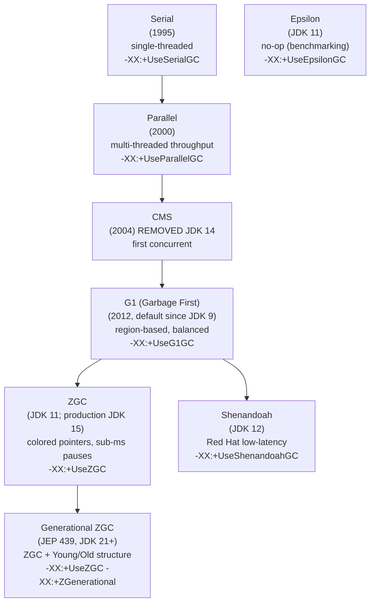
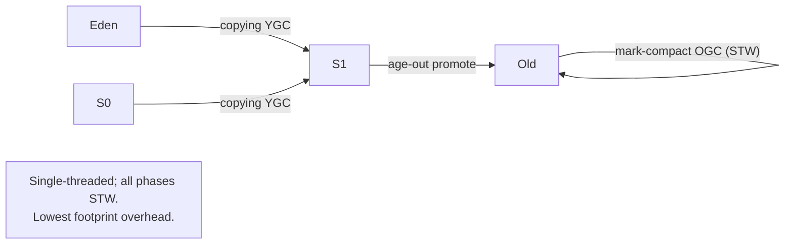
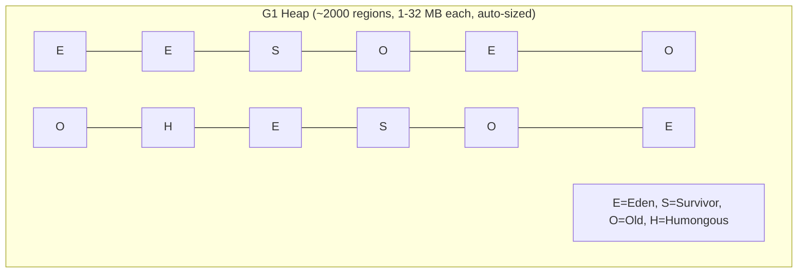
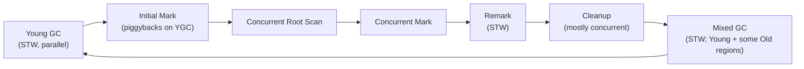
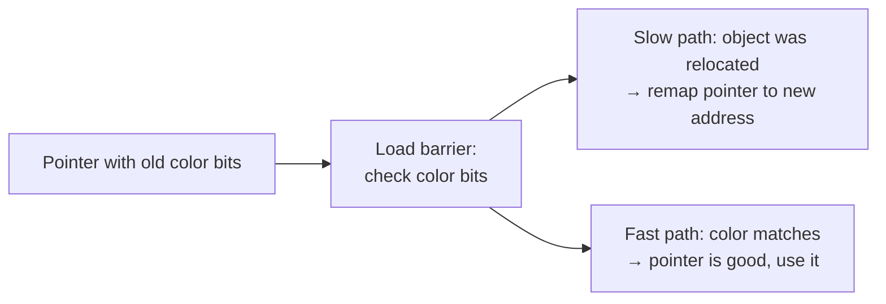
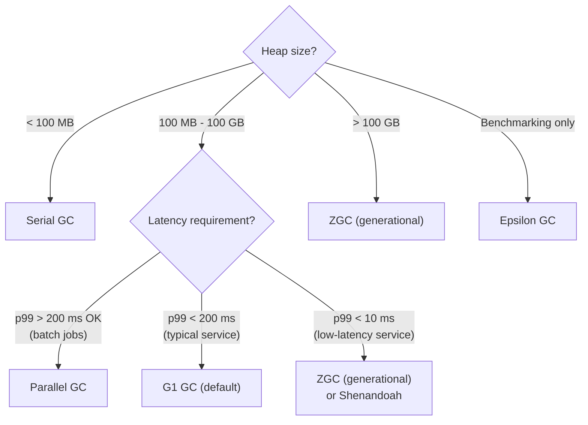

# GC Algorithms (Serial, Parallel, G1, ZGC, Shenandoah)

T07 covered the *theory* of GC — mark-sweep, mark-compact, copying, tri-color invariant, write barriers, safepoints, card tables, the unattainable triangle. This topic applies that theory to the **specific collectors HotSpot ships in 2026**: **Serial** (single-threaded, lowest footprint), **Parallel** (multi-threaded throughput champion), **G1** (region-based, default since JDK 9), **ZGC** (colored pointers, sub-millisecond pauses regardless of heap size), **Shenandoah** (Red Hat's low-latency variant), plus **Epsilon** (no-op for benchmarking) and **Generational ZGC** (JEP 439, JDK 21+). Picking the right collector for the workload is one of the highest-leverage tuning decisions a Java engineer makes — and one of the most frequently misunderstood.

The depth-bar requirement isn't "G1 is the default." At the **algorithmic** layer, each collector is a *specific composition* of the T07 fundamentals — **Serial** uses copying for Young + mark-compact for Old, single-threaded; **Parallel** is the multi-threaded version of Serial; **G1** divides the heap into *fixed-size regions* (1–32 MB, auto-sized) and runs concurrent marking + parallel region evacuation, prioritizing regions with the most garbage (hence "garbage first"); **ZGC** uses **colored pointers** (metadata bits in unused high bits of 64-bit pointers) and **load barriers** (a check on every reference load) to do *everything concurrently*, achieving sub-millisecond pauses regardless of heap size — even 16 TB heaps. At the **trade-off** layer, the choice is governed by the unattainable triangle: Serial gives lowest footprint at the cost of latency; Parallel maximizes throughput at the cost of pauses; G1 balances; ZGC and Shenandoah trade throughput (~5–10%) for sub-millisecond pauses. At the **historical** layer, **CMS** (Concurrent Mark Sweep — the first concurrent collector in HotSpot, 2004) was removed in JDK 14, replaced by G1; **ZGC** went production-ready in JDK 15; **Generational ZGC** in JEP 439 (JDK 21) added the generational structure ZGC lacked, dramatically improving its profile for typical workloads. At the **decision** layer, the workload-to-collector matrix is short and clear: **Serial** for tiny embedded; **Parallel** for batch jobs that don't care about latency; **G1** for general-purpose services (the default for good reason); **ZGC** for low-latency services or very large heaps; **Shenandoah** for the same with Red Hat ecosystem; **Epsilon** for benchmarks. We will cover all four layers with concrete tuning flags and the canonical "which collector for which workload" guidance.

> [!NOTE]
> Prerequisites: [Garbage collection fundamentals](./T07-garbage-collection-fundamentals.md) (L3/C02/T07) — the theory this topic applies; [Memory model: heap, stack, metaspace](./T06-memory-model-heap-stack-metaspace.md) (L3/C02/T06) — generational heap structure; [JVM architecture](./T01-jvm-architecture-and-runtime-data-areas.md) (L3/C02/T01) — the runtime data areas GCs operate on.

## The Collector Lineup



Seven HotSpot collectors as of JDK 24, with different specializations. The mental model in 2026: **G1 is the default** for general use; **ZGC** is the choice for low-latency or huge heaps; the others fill niches.

## Serial GC — the Original

```bash
java -XX:+UseSerialGC ...
```

The simplest collector. Single-threaded for both Young and Old:

- **Young**: copying collector (T07) between Eden + Survivor + Old.
- **Old**: mark-compact (T07) of the entire old generation.
- **Full GC**: same as old, on the entire heap.



**Profile:**

- **Pause time**: high (single-threaded; 100s of ms to seconds for large heaps).
- **Throughput**: high (no parallel coordination overhead).
- **Footprint**: lowest (no card-table-dirty processing in parallel, etc.).

**Use cases:**

- **Tiny embedded JVMs** (heap < 100 MB; small IoT devices).
- **Small CLI tools** that run briefly.
- **Single-CPU containers** where parallel collection wouldn't help anyway.

For typical server workloads on multi-core machines, Serial is *much* slower than the other options — its single-threaded GC blocks all CPU cores. Avoid for anything beyond embedded use.

## Parallel GC — Throughput Champion

```bash
java -XX:+UseParallelGC ...
```

The throughput-focused collector — multi-threaded versions of Serial's algorithms:

- **Parallel Scavenge** for Young (parallel copying).
- **Parallel Old** for Old (parallel mark-compact).
- Both still STW; the parallelism just makes each pause shorter.

**Profile:**

- **Pause time**: moderate to high (100s of ms typical; can spike on Old GC).
- **Throughput**: highest of all (less per-pause work per thread).
- **Footprint**: low.

**Use cases:**

- **Batch jobs** (data processing, ETL) where throughput is the only metric.
- **Background workers** where users never feel the pauses.
- **JDK <= 8** running legacy services where G1 isn't suitable.

Was the **default** for headless server VMs pre-JDK 9. Still a viable choice for throughput-critical workloads where latency doesn't matter.

**Tuning flags:**

- `-XX:ParallelGCThreads=N` — GC thread count (default: number of CPU cores).
- `-XX:MaxGCPauseMillis=N` — soft pause target (advisory).
- `-XX:GCTimeRatio=N` — throughput target (default 99 = at least 99% time not in GC).

## CMS — Historical Note

**CMS (Concurrent Mark Sweep)**, introduced 2004, was HotSpot's first concurrent collector — major innovation for its time. It used mark-sweep with concurrent marking phases.

CMS was **deprecated in JDK 9** and **removed in JDK 14**. Reason: G1 covers its use cases with better tuning predictability and lower complexity. If you're working with a JDK 8 service still on CMS (`-XX:+UseConcMarkSweepGC`), the upgrade target is G1 on JDK 11/17/21.

## G1 (Garbage First) — the Modern Default

```bash
java -XX:+UseG1GC ...    # default since JDK 9
```

G1's fundamental innovation: **divide the heap into ~2000 fixed-size regions**, then collect regions with the most garbage *first*.



Each region is at any moment one of:

- **Eden**: new allocations.
- **Survivor**: surviving Young GC.
- **Old**: long-lived.
- **Humongous**: holds one object ≥ 50% of region size.
- **Free**: not assigned.

Generations are *sets of regions*, not contiguous memory chunks. This enables G1 to collect a subset of regions per cycle — the regions with most garbage — rather than the whole generation.

### G1's phases



The cycle:

1. **Young GC**: STW, parallel evacuation of Eden + Survivor to new Survivor / Old.
2. **Initial Mark**: STW, marks roots. Piggybacks on a YGC to avoid extra pause.
3. **Concurrent Root Scan**: marks objects directly reachable from roots.
4. **Concurrent Mark**: traces reachability throughout Old; runs alongside the application.
5. **Remark**: STW, processes SATB queue, handles writes during concurrent mark.
6. **Cleanup**: mostly concurrent; frees regions known to be all-garbage.
7. **Mixed GC**: STW, collects Young + some Old regions (chosen by garbage density).

Most pauses are short Young GCs (10–50 ms typical). Mixed GCs are slightly longer. Full GCs are *rare* and should be treated as a tuning failure.

### G1 tuning flags

- **`-XX:MaxGCPauseMillis=200`** (default) — soft pause target. G1 sizes regions to hit this.
- **`-XX:G1HeapRegionSize=Nm`** — region size (1, 2, 4, 8, 16, 32 MB). Auto-sized; rarely needs tuning.
- **`-XX:G1NewSizePercent=5`** / **`-XX:G1MaxNewSizePercent=60`** — Young generation bounds (% of heap).
- **`-XX:InitiatingHeapOccupancyPercent=45`** (IHOP) — Old GC starts when Old occupancy crosses this %.
- **`-XX:G1MixedGCLiveThresholdPercent=85`** — regions with >85% live are skipped in Mixed GC (not worth collecting).
- **`-XX:G1HeapWastePercent=5`** — tolerate this % of heap as garbage before mixed GC.

**The biggest knob**: `MaxGCPauseMillis`. Reduce to make G1 more aggressive (more frequent, shorter pauses); increase for higher throughput.

### When G1 wins

- **Default for general-purpose** services in 2026.
- Heaps in **2–32 GB** range.
- Workloads with **moderate latency requirements** (50–200 ms p99 acceptable).
- Workloads where **predictable, tunable pause times** matter.

### When G1 loses

- **Very low latency** (< 10 ms pauses needed) → use ZGC or Shenandoah.
- **Very large heaps** (100 GB+) → ZGC scales better.
- **Pure throughput** workloads → Parallel may be 5–10% faster.

## ZGC — Colored Pointers and Sub-Millisecond Pauses

```bash
java -XX:+UseZGC ...
```

ZGC's defining feature: **pauses under 1 ms regardless of heap size**. Tested at 16 TB heaps with single-digit-millisecond pauses.

How? Two novel mechanisms:

### Colored pointers

On 64-bit systems, virtual addresses use only 48 of 64 bits. The high 16 bits are unused. ZGC steals some of those bits for **metadata**:

```text
64-bit pointer layout:

  [ unused | reserved | metadata bits | address ]
  bit:  63          47       42      0

  metadata bits encode GC state:
    - marked0      (current marking cycle)
    - marked1      (next marking cycle)
    - remapped     (after relocation)
    - finalizable
```

Every pointer carries information about its **GC state**. The application reads pointers normally — the high bits are *invisible* to the application code. But the GC can read them to know "is this pointer up-to-date or stale (from before a relocation)?"



### Load barriers

The JIT inserts a **load barrier** at every reference load — code that reads the color bits and checks them:

```java
// Java source:
Foo f = obj.field;

// What the JIT generates (conceptually):
raw_pointer = obj.field;                          // raw read
color_bits  = raw_pointer >> 42;                  // extract color
if (color_bits != expected) {                      // check against current GC state
    raw_pointer = zgc_load_barrier_slow(raw_pointer);   // fix it up (relocation, remarking, etc.)
}
f = raw_pointer & ADDRESS_MASK;                    // strip color bits
```

The fast path is ~1–2 cycles. The slow path runs only when the object has been relocated (rare per load) and updates the pointer atomically.

This is how ZGC does **concurrent relocation** — copying objects to new locations while the application runs. The load barrier ensures the application always sees up-to-date pointers, even if a relocation is in progress.

### Profile

- **Pause time**: **< 1 ms** typically; sometimes 1-2 ms. Independent of heap size.
- **Throughput**: 85–95% of G1 (load barrier overhead).
- **Footprint**: 10–15% overhead (colored pointer metadata).
- **Max heap**: 16 TB.

### Generational ZGC (JEP 439, JDK 21+)

The original ZGC was **non-generational** — it treated the whole heap uniformly. This was suboptimal for typical Java workloads where the generational hypothesis holds: most objects die young.

JEP 439 adds **generational structure** to ZGC: Young + Old. Young is collected more frequently; Old less often. Same colored-pointer + load-barrier machinery; better profile for typical workloads.

```bash
java -XX:+UseZGC -XX:+ZGenerational ...
```

For most use cases in 2026, **generational ZGC is the right choice when ZGC is the right choice**. It's expected to become the default ZGC mode in future JDKs.

### Tuning flags

- **`-XX:ConcGCThreads=N`** — concurrent GC thread count.
- **`-XX:+UseLargePages`** — *highly recommended*; ZGC benefits significantly from huge pages (2 MB or 1 GB).
- **`-XX:SoftMaxHeapSize=Ng`** — soft heap target; allows ZGC to give back memory when usage is low.

## Shenandoah — Red Hat's Low-Latency Alternative

```bash
java -XX:+UseShenandoahGC ...
```

Shenandoah is Red Hat's contribution to OpenJDK, with a similar profile to ZGC: sub-millisecond pauses, concurrent everything, but a *different implementation*.

Historically used **Brooks pointers** — an extra forwarding pointer in each object header that GC could update during relocation. Recent versions have moved closer to ZGC's load-barrier model.

**Generational Shenandoah** is in active development.

**Profile**: similar to ZGC. ~1–2 ms pauses, 85–90% throughput vs G1, similar footprint overhead.

**Use case**: when you're in a Red Hat ecosystem (RHEL, OpenShift, JBoss) and want low-latency GC. Performance is comparable to ZGC.

## Epsilon — the No-Op Collector

```bash
java -XX:+UnlockExperimentalVMOptions -XX:+UseEpsilonGC ...
```

JEP 318 (JDK 11). Allocates but **never reclaims**. When the heap fills, the JVM exits with OOM.

**Use cases:**

- **Performance benchmarking**: isolate allocation cost from GC overhead.
- **Very short-lived workloads** (lambdas, single CLI runs) where the heap won't fill.
- **GC research**: baseline against which other GCs are measured.

Not for production except in *very* specific cases.

## The Full GC — Last Resort

Every GC has a **fallback Full GC** path that runs when other strategies can't keep up:

- All application threads paused.
- Single-threaded mark-compact (or copy) of the *entire* heap.
- Pauses measured in seconds (or minutes for very large heaps).

A full GC is a **tuning failure indicator**. It means the application is allocating faster than the concurrent collector can reclaim, or the heap is too small for the workload. Investigating its causes is the heart of GC tuning (T09).

Frequent Full GCs are a sign to: increase heap, switch collector, fix memory leak, or reduce allocation rate.

## Comparison Matrix

| Metric | Serial | Parallel | G1 | ZGC | Shenandoah | Epsilon |
|--------|:------:|:--------:|:--:|:---:|:----------:|:-------:|
| **Pause time (p99)** | 1-10 s | 100-500 ms | 50-200 ms | < 1 ms | 1-2 ms | n/a (no GC) |
| **Throughput** | Highest | Highest | High | Lower | Lower | Highest |
| **Footprint overhead** | < 1% | 2-5% | 5-10% | 10-15% | 10-15% | 0% |
| **Max heap** | ~32 GB | ~32 GB | ~16 TB | 16 TB | 16 TB | n/a |
| **Concurrent marking** | No | No | Yes | Yes | Yes | n/a |
| **Concurrent evacuation** | No | No | No | **Yes** | **Yes** | n/a |
| **Default since** | n/a | 4-8 | 9 | n/a | n/a | n/a |
| **Best for** | Embedded | Batch | General | Low-latency / huge heap | Same as ZGC | Benchmarks |

## Choosing a GC — Decision Tree



In practice for 2026 production:

- **Default**: G1 (it's already the default — don't change without measurement).
- **Low latency**: Generational ZGC.
- **Huge heaps**: Generational ZGC.
- **Throughput batch**: Parallel.
- **Embedded**: Serial.

## Hardware Considerations

### Large pages

Large pages (huge pages on Linux: 2 MB or 1 GB) reduce TLB misses, especially helpful for large heaps. ZGC benefits dramatically:

```bash
# Enable on Linux:
sudo sysctl vm.nr_hugepages=2048
# Or transparent huge pages:
echo always > /sys/kernel/mm/transparent_hugepage/enabled

# JVM flag:
java -XX:+UseLargePages -XX:+UseZGC ...
```

For ZGC on a 32 GB heap, large pages can reduce TLB miss cost by 50%+.

### NUMA awareness

On multi-socket servers, `-XX:+UseNUMA` (T06) helps G1 and others allocate from local memory.

### CPU count

More cores = more parallel GC threads possible. `-XX:ParallelGCThreads` and `-XX:ConcGCThreads` default to reasonable values based on CPU count; rarely need tuning.

## Common Mistakes

### Switching collectors without measurement

"I heard ZGC is faster" — measure first. ZGC has lower latency, but G1 may have higher throughput for your workload.

### Setting `MaxGCPauseMillis` too aggressively

`-XX:MaxGCPauseMillis=10` on G1 forces frequent collections; throughput plummets. The default 200 ms is reasonable for most services.

### Ignoring Full GCs

Frequent Full GCs (`-Xlog:gc*` shows them) indicate a problem — likely too-small heap, memory leak, or wrong collector. Investigate.

### Using Parallel for user-facing services

Parallel GC's long pauses (100s of ms to seconds) cause visible latency spikes. G1 or ZGC for anything user-facing.

### Forgetting to enable generational ZGC

Plain `-XX:+UseZGC` on JDK 21+ runs non-generational ZGC. Add `-XX:+ZGenerational` for the modern profile.

### Disabling compressed OOPs for large heaps

T06 — at 32 GB+, compressed OOPs disable silently. ZGC works at any heap size, but you lose the compressed-OOPs memory savings.

### Tuning region size manually for G1

`-XX:G1HeapRegionSize` is auto-sized to be reasonable. Manual tuning rarely helps; usually hurts.

## Observability

### `-Xlog:gc*:file=/tmp/gc.log` — full GC log

The single most important diagnostic. Enable in production.

### `jcmd <pid> GC.heap_info`

Live heap occupancy and generation breakdown.

### `jstat -gcutil <pid> 1s`

Per-second GC utilization summary.

### GCEasy, GCViewer

Web tools that consume GC logs and produce visualizations.

### JFR `jdk.GCConfiguration`, `jdk.GCHeapSummary`, `jdk.YoungGarbageCollection`, etc.

Production-grade observability.

## Practice

1. **Compare Serial vs Parallel.** Run a CPU-bound benchmark with each. Measure throughput + pause time.
2. **G1 default behavior.** Run a small service; observe Young GC frequency, Old GC, mixed GC. Visualize in GCEasy.
3. **Force a Full GC.** Allocate large objects to fill Old; observe Full GC pause. Tune to reduce.
4. **ZGC sub-ms pauses.** Run the same service with G1 and ZGC; measure p99 pause time. ZGC should be < 1 ms; G1 50-200 ms.
5. **G1 region inspection.** With `-Xlog:gc+heap=debug`, observe region states and counts.
6. **Generational ZGC vs non-generational.** Run the same workload both ways; compare throughput and pause times.
7. **Shenandoah comparison.** Same workload with G1, ZGC, Shenandoah; compare full metrics.
8. **Epsilon for allocation cost.** Run a benchmark with Epsilon; isolate pure allocation overhead.
9. **Tune `MaxGCPauseMillis`.** Try 50, 100, 200, 500 with G1; observe throughput vs pause trade-off.
10. **Large pages benefit.** Run ZGC with and without `-XX:+UseLargePages` on a 16 GB heap; compare throughput.
11. **Memory pressure test.** Allocate at increasing rates; observe each collector's failure mode (OOM, throughput collapse, etc.).
12. **Production GC log analysis.** Take a real production GC log; upload to GCEasy; identify any anti-patterns.

## Recap

You should now be able to:

- Identify HotSpot's **seven collectors**: Serial, Parallel, CMS (removed), G1, ZGC, Shenandoah, Epsilon, plus Generational ZGC (JDK 21+).
- Describe **Serial GC**: single-threaded copying (Young) + mark-compact (Old); lowest footprint; for embedded or tiny heaps.
- Describe **Parallel GC**: multi-threaded versions of Serial; highest throughput; for batch jobs.
- Describe **G1**: region-based heap (1–32 MB regions, ~2000 of them); generations are sets of regions; concurrent marking + parallel evacuation; pause-time-predictable via `-XX:MaxGCPauseMillis`; default since JDK 9; the right choice for general-purpose services.
- Walk through **G1's phases**: Young GC → Initial Mark (piggybacks) → Concurrent Root Scan → Concurrent Mark → Remark (STW) → Cleanup → Mixed GC.
- Describe **ZGC**: **colored pointers** (metadata in unused high pointer bits) + **load barriers** (~1-2 cycle check on every reference load); concurrent relocation; **sub-millisecond pauses regardless of heap size** (tested at 16 TB).
- Apply **Generational ZGC** (JEP 439, JDK 21+) — adds Young/Old structure to ZGC for better profiles on typical workloads.
- Describe **Shenandoah**: Red Hat's low-latency variant; similar profile to ZGC; different implementation (historically Brooks pointers).
- Describe **Epsilon**: no-op collector for benchmarking (JEP 318).
- Recognize the **Full GC as a tuning failure indicator** — single-threaded mark-compact of the entire heap, multi-second pauses.
- Apply the **decision tree**: heap < 100 MB → Serial; < 100 GB and pauses < 10 ms → ZGC/Shenandoah; < 100 GB and pauses < 200 ms → G1; pure throughput → Parallel; > 100 GB → ZGC.
- Tune the right flags per collector: Parallel's `ParallelGCThreads`/`GCTimeRatio`; G1's `MaxGCPauseMillis`/`InitiatingHeapOccupancyPercent`; ZGC's `ConcGCThreads`/`SoftMaxHeapSize`/`UseLargePages`.
- Recognize hardware impact: **Large pages** (huge pages on Linux) dramatically benefit ZGC; NUMA awareness helps multi-socket; CPU count drives default GC thread counts.
- Diagnose via `-Xlog:gc*`, `jcmd GC.heap_info`, `jstat -gcutil`, GCEasy/GCViewer, JFR.
- Avoid the **7 common mistakes**: switching collectors without measurement, overly-aggressive `MaxGCPauseMillis`, ignoring Full GCs, Parallel for user-facing, forgetting `+ZGenerational` on JDK 21+, disabling compressed OOPs, manual region sizing.

## Next

Continue to [GC tuning & monitoring](./T09-gc-tuning-and-monitoring.md) — applying the algorithms to *production* tuning. We'll cover the **systematic tuning methodology** (measure → identify bottleneck → adjust → re-measure), reading **GC logs** in depth (interpreting Young/Old/Mixed/Full GC entries, allocation rate, promotion rate), the **flags that actually move the needle** (heap sizing, MaxGCPauseMillis, IHOP, allocation rate reduction), and **production monitoring** with JFR + Prometheus/Grafana for GC metrics. T10 then covers memory leak investigation via heap dumps.
