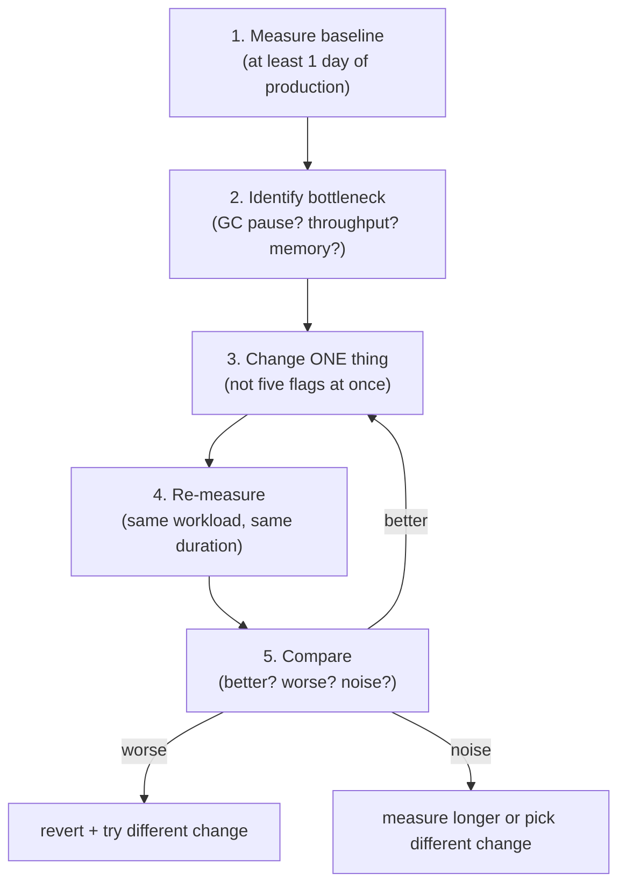
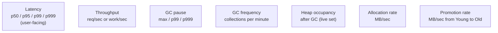
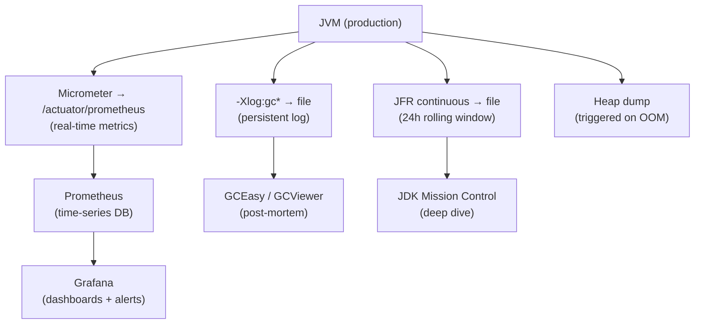

# GC Tuning & Monitoring

T07 covered GC theory; T08 covered the specific collectors. This topic covers the **production application**: how to read GC logs, identify bottlenecks, apply targeted fixes, and monitor over time. GC tuning is one of the highest-stakes / lowest-feedback activities in JVM performance work — the wrong "fix" can make things worse silently, and the *right* fix is usually boring (right heap size + right collector). This topic teaches the **disciplined methodology** that separates engineers who can actually improve GC behavior from those who copy-paste flags from blog posts.

The depth-bar requirement isn't "use these flags." At the **methodology** layer, GC tuning follows a strict loop — **measure baseline, identify bottleneck, change one thing, re-measure, iterate** — and *most* "tuning" mistakes are violations of this discipline (changing multiple flags at once, tuning without baseline, copying flag sets from a different workload). At the **diagnostic** layer, reading GC logs (modern `-Xlog:gc*` format) is the central skill — each log entry encodes the GC event, heap occupancy before/after, pause time, and the *reason* the GC ran; six canonical anti-patterns (high allocation rate, premature promotion, Old gen pressure, humongous object pressure in G1, long mixed GC times, allocation outside TLAB) cover ~90% of production GC problems. At the **flags** layer, the **four flags that actually move the needle** are `-Xmx`, the collector selection, `-XX:MaxGCPauseMillis` (for G1), and `-XX:+HeapDumpOnOutOfMemoryError` — everything else is fine-tuning that rarely outweighs careful application-level work. At the **observability** layer, production monitoring combines **GC logs** (persistent record), **JFR continuous recording** (low-overhead rolling window with detailed events), and **Prometheus/Grafana** dashboards (real-time metrics via Spring Boot Actuator + Micrometer) — together giving the visibility needed to detect regressions before they cause outages. We will cover all four layers, with concrete tuning examples for three canonical workloads (web service, batch ETL, low-latency trading).

> [!NOTE]
> Prerequisites: [GC algorithms (Serial, Parallel, G1, ZGC, Shenandoah)](./T08-gc-algorithms-serial-parallel-g1-zgc-shenandoah.md) (L3/C02/T08) — the collectors this topic tunes; [Garbage collection fundamentals](./T07-garbage-collection-fundamentals.md) (L3/C02/T07) — the theory; [Memory model: heap, stack, metaspace](./T06-memory-model-heap-stack-metaspace.md) (L3/C02/T06) — heap sizing context.

## The Tuning Methodology

Five steps, in strict order:



The rules:

- **Always have a baseline.** Without it, you don't know if your change helped.
- **Change one thing.** Multi-variable changes prevent attribution.
- **Re-measure long enough to be statistically meaningful** — at least the same duration as baseline.
- **Be willing to revert.** Most "improvements" turn out to be noise or regressions.

The biggest tuning mistake: skipping baselining. The second biggest: copy-pasting flags from a blog post optimized for a different workload.

## Performance Metrics to Track



Each metric tells you something different:

- **Latency** is what users feel. p99 / p999 are the canary metrics.
- **Throughput** is your capacity ceiling.
- **GC pause** is the contributor to latency tail.
- **GC frequency** indicates how busy GC is.
- **Heap occupancy after GC** is the live set — the floor of memory you actually need.
- **Allocation rate** drives GC frequency.
- **Promotion rate** drives Old generation pressure.

A well-tuned service has stable values for all of these; spikes or drift indicate problems.

## Step 1 — Understand the Workload

Before tuning, characterize:

- **User-facing or batch?** User-facing → minimize pauses; batch → maximize throughput.
- **Memory growth pattern?** Stable (long-lived cache), slow growth (data accumulating), transient (mostly garbage)?
- **Allocation rate?** Low constant or bursty?
- **Object lifetime?** Mostly request-scoped (die young), mostly long-lived (cached), mixed?

Use JFR's allocation events (`jdk.ObjectAllocationInNewTLAB`, `jdk.ObjectAllocationOutsideTLAB`) to characterize. The shape of your workload determines what to tune.

## Step 2 — Size the Heap

**Heap sizing is the single highest-leverage tuning decision.** Get it right and most other tuning becomes unnecessary.

### Find the live set

Run the application under normal load; after a Full GC (or several Major GCs), look at heap occupancy. That's your **live set** — the floor of memory the application actually needs.

```bash
jcmd <pid> GC.heap_info     # snapshot
```

### Size for throughput

For G1, rule of thumb: **heap = 2–3 × live set**. So if live set is 1 GB, set `-Xmx2g` or `-Xmx3g`.

- **Smaller** (heap = 1.5× live set): more frequent GCs, possibly Full GCs, throughput suffers.
- **Larger** (heap = 5× live set): infrequent GCs, but each pause longer; memory wasted.

For ZGC: heap can be tighter (~1.5× live set) because concurrent collection handles pressure better.

### Container-aware sizing (T06 recap)

In a container, allow headroom for non-heap memory:

```text
Container memory: 4 GB
  -Xmx: 2 GB (50%)
  Other (Metaspace + code cache + direct + stacks + native): ~1.5 GB
  Headroom: 0.5 GB
```

`-XX:MaxRAMPercentage=50` automates this — default is 25%, which is conservative; tune to 50–75% for dedicated JVM containers.

## Step 3 — Pick the Collector

T08's decision tree:

- **Heap < 100 MB / embedded**: Serial.
- **Batch / throughput**: Parallel.
- **General-purpose service**: G1 (default).
- **Low latency (p99 < 10 ms)**: ZGC (generational, JDK 21+).
- **Huge heap (> 100 GB)**: ZGC.
- **Benchmark / allocation cost study**: Epsilon.

When in doubt: **G1** (it's already the default; only switch with evidence).

## Step 4 — Tune the Collector

After heap sizing + collector choice, fine-tuning. The flags that actually matter:

### G1

| Flag | Default | When to tune |
|------|---------|--------------|
| `-XX:MaxGCPauseMillis` | 200 ms | If pauses too long: lower to 100. If throughput needed: raise to 500. |
| `-XX:InitiatingHeapOccupancyPercent` (IHOP) | 45% | Lower (30%) if Old fills before concurrent cycle completes |
| `-XX:G1NewSizePercent` / `G1MaxNewSizePercent` | 5% / 60% | Lower if Young GCs are too long |
| `-XX:G1MixedGCCountTarget` | 8 | Spread Old collection over more Mixed GCs |
| `-XX:G1HeapRegionSize` | auto | Only tune if humongous-object pressure |

### ZGC

| Flag | When to tune |
|------|--------------|
| `-XX:SoftMaxHeapSize` | Hint for memory return when low usage |
| `-XX:ConcGCThreads` | Defaults to ~12.5% of CPU; rarely tune |
| `-XX:+UseLargePages` | **Always enable for ZGC on large heaps** |

### Parallel

| Flag | When to tune |
|------|--------------|
| `-XX:ParallelGCThreads` | Default = cores; rarely tune |
| `-XX:GCTimeRatio` | Target throughput (default 99 = ≤1% in GC) |
| `-XX:MaxGCPauseMillis` | Advisory; rarely respected for Old |

## Reading GC Logs — the Central Skill

Modern format (`-Xlog:gc*:file=/tmp/gc.log:time,uptime,level,tags`):

```text
[2024-01-15T10:23:14.123-0800][2.456s][info][gc      ] GC(0) Pause Young (Normal) (G1 Evacuation Pause) 256M->32M(2048M) 15.234ms
```

Decoded:

- `[2024-01-15T10:23:14.123-0800]` — wall-clock timestamp.
- `[2.456s]` — uptime.
- `[info][gc      ]` — log level + category.
- `GC(0)` — collection number (0 = first).
- `Pause Young (Normal)` — pause type: Young GC, normal (not triggered by failed allocation).
- `(G1 Evacuation Pause)` — G1's specific name for Young GC.
- `256M->32M` — heap occupancy before → after.
- `(2048M)` — total heap size.
- `15.234ms` — pause duration.

### Key entries to look for

```text
GC(123) Pause Young (Normal) 800M->400M(2g) 50ms        ← Young GC; 400 MB live young
GC(124) Concurrent Cycle                                 ← Concurrent mark cycle begins
GC(125) Pause Remark 800M->800M(2g) 5ms                  ← Mark phase finished (STW)
GC(126) Concurrent Sweep                                  ← Concurrent cleanup
GC(127) Pause Mixed 1g->600M(2g) 80ms                    ← Mixed GC (Young + some Old)
GC(128) Pause Full (Allocation Failure) 2g->1.5g(2g) 3s  ← FULL GC — investigate!
```

### Red flags

- **Full GCs** — should be very rare. Frequent = tuning failure (heap too small, leak, allocation spike).
- **`to-space exhausted`** — Young GC couldn't find space in Survivor. Tune Young size or `MaxTenuringThreshold`.
- **`Concurrent Mark Abort`** — concurrent mark ran out of time. Lower IHOP.
- **`Allocation Failure`** — couldn't allocate; full GC triggered.
- **Long pauses (> MaxGCPauseMillis * 2)** — G1's pause target not met. Reduce target or tune.

## Calculating Allocation and Promotion Rates

### Allocation rate

```text
allocation_rate = (eden_size_before_young_gc) / (time_between_young_gcs)
```

If Eden is 200 MB and YGCs happen every 2 seconds: allocation rate = 100 MB/s.

Healthy: 10–500 MB/s for typical web services. Higher: investigate.

### Promotion rate

```text
promotion_rate = (heap_used_after_ygc) - (survivor_used_after_ygc) - (old_used_before_ygc)
```

The difference between Old occupancy before and after — what got promoted in this YGC. Sustained high promotion → Old fills quickly → Mixed/Full GCs.

## GCEasy.io for Anti-Pattern Detection

Upload GC log → instant analysis:

- Throughput summary (% time not in GC).
- Pause time distribution (p50, p99, p999, max).
- Per-cause GC counts.
- **Performance anti-patterns** — automated detection of the patterns below.

The single highest-leverage tool for GC log analysis. Free for moderate-sized logs.

## Six Common Anti-Patterns

### 1. High allocation rate

**Symptom**: YGCs every <500ms; throughput < 95%.
**Cause**: Application allocates faster than GC can collect.
**Fix**: Profile allocations (JFR + JMC's allocation profiler); refactor hot allocation paths (object pooling, primitive arrays, reuse).

### 2. Premature promotion

**Symptom**: Objects promoting to Old after just 1–2 YGCs; Old grows fast.
**Cause**: Survivor space too small to hold them.
**Fix**: Increase `-XX:G1NewSizePercent` or `-XX:SurvivorRatio`; or increase `-XX:MaxTenuringThreshold`.

### 3. Old generation pressure

**Symptom**: Mixed GCs frequent; Old growth high; occasional Full GCs.
**Cause**: Heap too small relative to live set; or leak; or high promotion rate.
**Fix**: Increase `-Xmx`; investigate leak with heap dump (T10); reduce IHOP for earlier collection.

### 4. Humongous object pressure (G1)

**Symptom**: Frequent humongous allocations; Full GCs to defragment.
**Cause**: Object size > 50% of region size.
**Fix**: Increase `-XX:G1HeapRegionSize` (default auto-sizes); refactor application to use smaller objects.

### 5. Long mixed GC times

**Symptom**: Mixed GCs taking 500ms+.
**Cause**: Too many Old regions evacuated per Mixed GC.
**Fix**: Tune `-XX:G1MixedGCCountTarget` (default 8 — more Mixed GCs, each shorter).

### 6. Allocation outside TLAB

**Symptom**: JFR's `jdk.ObjectAllocationOutsideTLAB` events frequent.
**Cause**: Large allocations bypassing TLAB; CAS contention on Eden top.
**Fix**: Profile to find large allocations; resize TLAB via `-XX:TLABSize`; refactor large allocations.

## The Four Flags That Actually Matter

```bash
java \
    -Xmx2g \                                  # 1. Heap size (most important)
    -XX:+UseG1GC \                            # 2. Collector (default; specify anyway)
    -XX:MaxGCPauseMillis=200 \                # 3. Pause target
    -XX:+HeapDumpOnOutOfMemoryError \         # 4. Always set
    -XX:HeapDumpPath=/tmp/heap.hprof \
    -Xlog:gc*:file=/tmp/gc.log:time,uptime:filecount=10,filesize=10M \
    -jar myapp.jar
```

**These four cover 90% of production needs.** Other flags are fine-tuning that usually doesn't matter or hurts.

The flags to *avoid*:

- `-XX:+UseParallelOldGC` (was a thing pre-JDK 9; obsolete).
- `-XX:+DisableExplicitGC` (treats `System.gc()` as no-op; usually fine but framework-dependent).
- `-XX:NewRatio` / `-XX:SurvivorRatio` (let G1 size automatically).
- Most flags ending in `Threshold` — defaults are well-researched.

## Container-Specific Tuning

```bash
# For a dedicated JVM in a 4 GB container:
-XX:+UseContainerSupport                     # default since JDK 8u131
-XX:MaxRAMPercentage=50                       # = -Xmx2g for 4 GB container
-XX:+UseG1GC
-XX:MaxGCPauseMillis=200
```

`-XX:MaxRAMPercentage=50` is more flexible than `-Xmx2g` — adjusts automatically as the container limit changes. Use percentage flags in containers, not absolute sizes.

## JFR for Production GC Monitoring

```bash
# Continuous recording with rolling window
java -XX:StartFlightRecording=disk=true,maxage=24h,maxsize=200m,filename=/tmp/jfr ...

# Or trigger on-demand:
jcmd <pid> JFR.start duration=60s settings=profile filename=/tmp/spike.jfr
```

**Continuous recording** captures the last 24 hours into a rotating file. When something goes wrong, you have the data.

JFR's GC events:

- **`jdk.GarbageCollection`** — every GC, with type and duration.
- **`jdk.GCPhasePause`** — STW phase pauses.
- **`jdk.YoungGarbageCollection`** / **`jdk.OldGarbageCollection`** — per-generation.
- **`jdk.ObjectAllocationInNewTLAB`** — TLAB allocations sampled.
- **`jdk.ObjectAllocationOutsideTLAB`** — slow-path allocations.

Open in JDK Mission Control for visual analysis.

## Prometheus / Grafana for Real-Time Monitoring

Spring Boot Actuator + Micrometer expose key JVM metrics natively:

```yaml
# application.yml
management.endpoints.web.exposure.include: health,metrics,prometheus
management.metrics.export.prometheus.enabled: true
```

Key metrics:

- **`jvm_memory_used_bytes{area="heap"}`** — current heap usage.
- **`jvm_memory_used_bytes{area="nonheap"}`** — non-heap (Metaspace, code cache).
- **`jvm_gc_pause_seconds`** (histogram) — pause time distribution.
- **`jvm_gc_collection_seconds_count`** — GC count.
- **`jvm_gc_memory_promoted_bytes_total`** — promotion rate.

Grafana dashboards: stock dashboards for Java / Spring Boot exist; customize for your workload.

## The Production Observability Stack



All four streams together:

- **GC log** — persistent record of every GC event.
- **JFR** — high-detail rolling window for deep analysis.
- **Prometheus** — real-time dashboards and alerts.
- **Heap dump** — automatic on OOM for post-mortem (T10).

## Tuning Fallacies

### "Bigger heap = fewer GC pauses"

Not always. Bigger heap means longer pauses for Full GC (Parallel) or longer mark cycles (G1, ZGC). Up to ~2–3× live set, bigger is better; beyond that, returns diminish.

### "More GC threads = faster GC"

Default is usually right. Adding threads can *increase* synchronization overhead.

### "Use ParallelGC for performance"

Throughput-focused yes; but its pauses make it unsuitable for any user-facing service. Always G1 or ZGC for user-facing.

### "GC tuning fixes memory leaks"

It doesn't. Leaks need code fixes (T10). GC tuning can hide a leak temporarily (bigger heap → leak takes longer to OOM) but never solves it.

### "Newer JDK = automatically faster"

Mostly true but not universally. Upgrade with testing. The JIT and GC improve substantially across versions, but workload-specific regressions happen.

### "Set `-Xms = -Xmx` for performance"

Marginally helpful for very-long-lived servers (avoids heap resize). For most cases, the default initial size + growth is fine.

## When NOT to Tune

- **No baseline measurement.** Measure first.
- **Pauses < 200ms p99.** Already good enough for most workloads.
- **You haven't profiled allocation.** Reducing allocation often beats tuning GC.
- **The bottleneck is elsewhere.** CPU saturation, DB latency, network — these aren't GC problems.

The most common GC tuning win: realizing the GC was fine and the bottleneck was somewhere else.

## The 80/20 of Tuning

**80% of tuning wins come from:**

1. **Right heap size** (2–3× live set).
2. **Right collector** (G1 default; ZGC for low-latency).
3. **HeapDumpOnOutOfMemoryError** (catch OOMs).

**20% from fine-tuning** specific flags after measurement.

Almost every "tuning project" in production resolves to those three items. Engineers who chase exotic flags miss the easy wins.

## Real Production Case Studies

### Web service (Spring Boot, 4 GB container)

```bash
-Xmx2g                                        # 50% of container
-XX:+UseG1GC -XX:MaxGCPauseMillis=200         # defaults
-XX:+HeapDumpOnOutOfMemoryError
-Xlog:gc*:file=/var/log/gc.log:time,uptime
```

p99 < 50 ms; throughput 95%+. Mostly default; works.

### Batch ETL (16 GB heap, throughput-critical)

```bash
-Xmx16g
-XX:+UseParallelGC                            # max throughput
-XX:GCTimeRatio=99                             # target 99% non-GC time
-XX:+HeapDumpOnOutOfMemoryError
-Xlog:gc*:file=/var/log/gc.log:time
```

Pauses up to 2s acceptable; throughput maximized.

### Low-latency trading (32 GB heap, sub-ms p99)

```bash
-Xmx32g
-XX:+UseZGC -XX:+ZGenerational                 # JDK 21+ generational ZGC
-XX:+UseLargePages                              # essential for ZGC at scale
-XX:+UseTransparentHugePages
-XX:+HeapDumpOnOutOfMemoryError
-Xlog:gc*:file=/var/log/gc.log:time
```

p999 GC pause < 5 ms; throughput 88%. The latency win justifies the throughput cost.

## Common Mistakes

### Multi-flag tuning

Changing 5 flags at once → can't attribute the change. **One at a time.**

### Tuning in dev, deploying to prod

Workloads differ. Always validate in a production-equivalent environment.

### Ignoring container limits

A "tuned" `-Xmx4g` JVM in a 4 GB container OOM-kills. Plan for all memory.

### Not exporting metrics

If you can't observe GC pauses, you can't detect regressions. Set up Prometheus from day 1.

### Treating GC like CPU tuning

GC tuning has long feedback cycles (minutes to hours of data). Don't iterate in 60-second windows.

## Deeper Dive — Workload-Specific Tuning Recipes

### Recipe 1: General Web Service (REST API, p99 < 200ms target)

```bash
java -Xms2g -Xmx2g \
     -XX:+UseG1GC \
     -XX:MaxGCPauseMillis=100 \
     -XX:+HeapDumpOnOutOfMemoryError \
     -XX:HeapDumpPath=/var/log/jvm/heapdump.hprof \
     -Xlog:gc*:file=/var/log/jvm/gc.log:time,level,tags:filecount=10,filesize=10M \
     -XX:+FlightRecorder \
     -XX:StartFlightRecording=name=cont,settings=default,maxsize=200M,disk=true \
     -jar app.jar
```

**Why these**:
- G1 default since Java 9; sweet spot for most web workloads.
- 2GB heap typical for Spring Boot service handling 1-2k RPS.
- MaxGCPauseMillis=100: tighter than default 200; usually achievable.
- Heap dump + JFR auto-armed for the inevitable 3 AM call.

### Recipe 2: Low-Latency Trading / Pricing (p99 < 10ms target)

```bash
java -Xms16g -Xmx16g \
     -XX:+UseZGC -XX:+ZGenerational \
     -XX:+UseLargePages -XX:+UseTransparentHugePages \
     -XX:ConcGCThreads=4 \
     -XX:ParallelGCThreads=8 \
     -XX:-UsePerfData \
     -XX:+AlwaysPreTouch \
     -Xlog:gc*:file=/var/log/jvm/gc.log \
     -jar app.jar
```

**Why these**:
- ZGC: sub-millisecond pauses. Generational (Java 21+) reduces CPU overhead vs single-gen ZGC.
- 16GB heap pre-touched (`AlwaysPreTouch`) so all pages allocated at startup — no page-fault pauses.
- Large pages (2MB) reduce TLB pressure for big heaps.
- `-UsePerfData` disables `hsperfdata_*` files (small but eliminates one source of pauses).
- ZGC trade-off: ~10-15% throughput hit vs G1.

### Recipe 3: Batch ETL (throughput-oriented, no latency SLO)

```bash
java -Xms32g -Xmx32g \
     -XX:+UseParallelGC \
     -XX:ParallelGCThreads=32 \
     -XX:NewRatio=1 \
     -XX:+UseCompressedOops \
     -Xlog:gc*:file=/var/log/jvm/gc.log \
     -jar etl-job.jar
```

**Why these**:
- ParallelGC: highest throughput; pause duration not critical for batch.
- Large heap; many parallel GC threads.
- `NewRatio=1` gives equal young/old space — appropriate for object-graph-building workloads.
- Skip ZGC/G1 — concurrent collection adds CPU overhead with no benefit when throughput matters.

### Recipe 4: Container Kubernetes Deployment (cgroup-aware)

```yaml
# K8s Deployment
spec:
  containers:
  - name: app
    resources:
      requests:
        memory: "1.5Gi"
        cpu: "1"
      limits:
        memory: "2Gi"
        cpu: "2"
    env:
    - name: JAVA_TOOL_OPTIONS
      value: >-
        -XX:+UseG1GC
        -XX:MaxRAMPercentage=70
        -XX:MaxGCPauseMillis=150
        -XX:+HeapDumpOnOutOfMemoryError
        -XX:HeapDumpPath=/tmp
        -Xlog:gc*:stdout:time,level,tags
        -XX:ActiveProcessorCount=2
```

**Why these**:
- `MaxRAMPercentage=70` of 2GB limit = 1.4GB heap. Leaves room for metaspace + code cache + thread stacks + native.
- `ActiveProcessorCount=2` matches CPU limit so ForkJoinPool / GC threads size correctly.
- HeapDumpPath=/tmp + a PVC mount → preserves dump across restarts.
- gc log to stdout → captured by K8s log aggregation.

### Recipe 5: Microservice with Virtual Threads (Java 21+)

```bash
java -Xms1g -Xmx1g \
     -XX:+UseG1GC \
     --enable-preview \
     -Dspring.threads.virtual.enabled=true \
     -XX:MaxGCPauseMillis=100 \
     -jar service.jar
```

**Why these**:
- Smaller heap fine because virtual threads use ~1KB heap vs 1MB stack per platform thread.
- Same web-service GC config — virtual threads change the thread model, not GC needs.

## Deeper Dive — GC Algorithm Decision Tree

```
Pause time critical (p99 < 20ms)?
├── YES → ZGC (or Shenandoah)
│   ├── Heap > 1TB? → Vanilla ZGC
│   └── Heap 4-100GB + standard workload? → ZGenerational (Java 21+, better CPU)
│
└── NO
    ├── Throughput most important + can afford pauses?
    │   └── Parallel GC — batch jobs, ETL, offline processing
    │
    └── Balanced (web service, microservice, default case)
        ├── Heap ≤ 32GB? → G1 (default since Java 9)
        ├── Heap > 32GB?
        │   ├── Latency tolerant? → G1 (still works; longer pauses)
        │   └── Latency sensitive? → ZGenerational (Java 21+)
```

**Avoid**: SerialGC (only for ≤100MB heaps), CMS (removed Java 14), Shenandoah (smaller installed base than ZGC).

## Deeper Dive — How to Diagnose "Suddenly Slower Service"

Your service was 50ms p99 yesterday. Today it's 500ms. GC suspect?

```bash
# 1. Take JFR snapshot of last 5 min
jcmd <pid> JFR.dump filename=now.jfr maxage=5m

# 2. Quickly check: any GC pauses > 200ms?
jfr print --events GarbageCollection now.jfr | grep -E "duration|name"

# 3. Allocation rate now vs baseline
jcmd <pid> GC.class_histogram | head -20
# Compare with yesterday's snapshot
```

**Common causes ranked by frequency**:

1. **Hot endpoint started returning bigger responses** → allocation rate spike → more frequent young GC → more promotion → more old GC. Fix: profile the endpoint; reduce response size or paginate.

2. **Cache invalidated en masse** → entire cache being re-populated → allocation burst. Fix: cache warm-up; staggered invalidation.

3. **Memory leak slow-burning into old gen** → old gen filling → mixed GC trigger → longer pauses. Fix: heap dump + Eclipse MAT.

4. **JIT decompilation** → method recompiling at low optimization tier → bad code generated → more allocation. Check `-XX:+PrintCompilation` for "made not entrant" patterns.

5. **Tail-latency from minor GC growing in frequency** → CPU contention, more GC threads needed.

6. **Container CPU throttling** → not GC at all; check `container_cpu_cfs_throttled_seconds_total`.

## Deeper Dive — Allocation Rate Investigation

Allocation rate = bytes allocated per second. Compute from GC log:

```
[3.500s][info][gc] GC(0) Pause Young (G1 Evacuation Pause) 100M->20M(2G) 50ms
[6.500s][info][gc] GC(1) Pause Young (G1 Evacuation Pause) 100M->22M(2G) 60ms
```

Between GC 0 and GC 1: eden filled from 20M to 100M in 3 seconds.
Allocation rate = (100 - 20) MB / 3 sec = **27 MB/sec**.

**Healthy ranges**:
- Web service: **5-50 MB/sec**
- Stream processing: **50-200 MB/sec**
- Batch ETL: **100-500 MB/sec**
- Concerning: **> 1 GB/sec** (something allocating wildly)

**Find allocation sources** with async-profiler:
```bash
async-profiler -e alloc -d 30 -f alloc.html <pid>
```

Generates flame graph of allocation sites. The hot frames are where your bytes are coming from. Typical findings:
- String concatenation in a loop → switch to StringBuilder.
- `new HashMap<>()` per request → reuse via ThreadLocal or cache.
- Boxing in hot path → use primitive collections (`int[]`).
- Stream operations creating intermediate collections → consider for-loop in hot path.

## Deeper Dive — Production GC Log Analysis Workflow

```bash
# 1. Tail GC log live
tail -f /var/log/jvm/gc.log

# 2. Pause duration histogram (last 10k events)
grep "Pause" /var/log/jvm/gc.log | awk '{print $NF}' | sort -n | awk '
    BEGIN{count=0}
    {a[count++]=$1}
    END{
        n=count
        print "min:", a[0]
        print "p50:", a[int(n*0.5)]
        print "p90:", a[int(n*0.9)]
        print "p99:", a[int(n*0.99)]
        print "max:", a[n-1]
    }'

# 3. GC frequency over time
grep "Pause" /var/log/jvm/gc.log | awk -F'[][]' '{print $2}' | sort | uniq -c

# 4. Upload to GCEasy.io for full analysis
curl -X POST --data-binary @gc.log https://api.gceasy.io/analyzeGC
```

**Red flags in GCEasy report**:
- "Long GC pauses" (any > target)
- "Allocation/Promotion rate high"
- "Premature object promotion" (objects dying in old gen quickly = should have stayed young)
- "Full GC happening" with G1/ZGC = critical, indicates tuning failure or memory leak

## Deeper Dive — GC Tuning Anti-Patterns Quick List

| Anti-pattern | Why bad | Fix |
|---|---|---|
| Setting `-XX:NewRatio=8` from old advice | Forces tiny young gen; bumps promotion rate | Let G1 auto-tune; or `G1NewSizePercent` |
| `-XX:ParallelGCThreads=64` on 8-core | More threads ≠ faster; thread contention hurts | Default = `cores`; rarely override |
| `-Xmx=16g` on 16g container | OOM-killed by container; need overhead | `-XX:MaxRAMPercentage=70` (leaves ~30% for non-heap) |
| Long pause tuning without measuring | "Tune to taste"; no baseline | Always measure before, change one, measure after |
| Reusing JVM args across services | Different workloads, different needs | Per-service config; review quarterly |
| Disabling compressed oops on small heap | 8GB heap doesn't need it but default is on | Leave default; only relevant for >32GB |
| Manual `System.gc()` | Forces full GC; wastes time | Never; remove from code |
| `-Xss=8m` because "stack overflow" | 8M × 1000 threads = 8GB just on stacks | Default 1M usually fine; find recursion bug instead |

## Deeper Dive — JVM Crash Investigation

When the JVM itself crashes (not OOM, not exception — actual crash):

```
# /tmp/hs_err_pid12345.log file generated automatically
```

```
# A fatal error has been detected by the Java Runtime Environment:
#
#  SIGSEGV (0xb) at pc=0x00007f8b3c3f1234, pid=12345, tid=0x00007f8b3c4567
#
# JRE version: OpenJDK Runtime Environment (21.0.1+12) (...)
# Problematic frame:
# V  [libjvm.so+0x9f1234]  ParallelTaskTerminator::offer_termination+0x123
```

**Look at**:
1. **Problematic frame**: `V` = VM internal, `J` = JIT, `C` = native, `j` = interpreted Java.
2. **Stack**: backtrace.
3. **Register state**: registers at crash.
4. **JVM args**: `# Command Line:` line shows the actual flags.
5. **Memory map**: `# /proc/self/maps`.
6. **Native libraries loaded**: identifies third-party native code.

**Common causes**:
- **JIT bug**: rare; usually triggered by specific bytecode. Workaround: `-XX:CompileCommand=exclude,com.example.Class,methodName`.
- **JNI bug**: native code corrupting heap. Identify the .so file in the stack.
- **GC bug**: very rare; usually JDK Early Access or experimental flags.
- **OS-level**: kernel issue, hardware fault, OOM-kill arriving as SIGSEGV.

File JBS bug if reproducible with stock JDK and no JNI.

## Practice

1. **Baseline a service.** Run a Spring Boot app under load for 1 hour with `-Xlog:gc*`. Upload to GCEasy. Identify the throughput, pause stats, anti-patterns.
2. **Heap sizing experiment.** Run the same service with `-Xmx1g`, `-Xmx2g`, `-Xmx4g`. Compare throughput and p99 pause time. Plot the curve.
3. **G1 pause-time tuning.** Vary `-XX:MaxGCPauseMillis` from 50, 100, 200, 500. Measure throughput vs pause trade-off.
4. **Anti-pattern reproduction.** Write a service with deliberately high allocation rate. Observe in logs / JFR.
5. **Premature promotion.** Allocate medium-lifetime objects; observe their promotion to Old via JFR. Tune Survivor size to keep them in Young longer.
6. **Mixed GC inspection.** With G1, run a service that accumulates Old data; observe Mixed GC entries; tune `G1MixedGCCountTarget`.
7. **Humongous object reproduction.** Allocate 50% region size objects; observe humongous allocation messages.
8. **Prometheus integration.** Add Spring Actuator + Micrometer to a service. Verify Prometheus scrapes JVM metrics.
9. **Grafana dashboard.** Build a custom dashboard with heap occupancy, GC pause histogram, allocation rate.
10. **JFR continuous recording.** Enable on a service; trigger a load spike; analyze the JFR file in JMC.
11. **Container OOM-kill investigation.** Deliberately set `-Xmx` too close to container limit; cause OOM; trace via `dmesg` and `kubectl describe pod`.
12. **GC log comparison.** Take 3 different workload types (web, batch, low-latency); identify which GC anti-patterns each shows.

## Recap

You should now be able to:

- Apply the **5-step tuning methodology**: measure baseline → identify bottleneck → change ONE thing → re-measure → compare and decide.
- Track the **7 performance metrics**: p50/p95/p99/p999 latency, throughput, GC pause max/p99/p999, GC frequency, heap occupancy, allocation rate, promotion rate.
- Apply the **4-step tuning process**: understand workload → size heap → pick collector → tune collector.
- Size the heap correctly: live set (occupancy after Full GC) × 2–3 for G1; tighter for ZGC; container-aware via `-XX:MaxRAMPercentage`.
- **Read GC logs**: parse the modern `-Xlog:gc*` format (timestamp, uptime, GC number, type, heap before/after, total, pause duration); recognize Young / Mixed / Full / Concurrent Cycle / Remark / Sweep entries.
- Recognize **red flags**: frequent Full GCs (tuning failure), to-space exhausted, concurrent mark abort, allocation failure, long pauses exceeding target.
- Calculate **allocation rate** (eden-before-YGC / time-between-YGCs) and **promotion rate** (Old growth per YGC).
- Use **GCEasy.io** as the primary GC log analysis tool for anti-pattern detection.
- Diagnose the **6 common anti-patterns**: high allocation rate, premature promotion, Old gen pressure, humongous object pressure, long mixed GC times, allocation outside TLAB.
- Apply the **4 flags that actually move the needle**: `-Xmx`, collector selection, `-XX:MaxGCPauseMillis`, `-XX:+HeapDumpOnOutOfMemoryError`.
- Tune **container-aware** with `-XX:MaxRAMPercentage` (50–75% for dedicated JVM containers).
- Set up **JFR continuous recording** with 24h rolling window for production observability.
- Wire **Prometheus + Grafana** via Spring Boot Actuator + Micrometer: `jvm_memory_used_bytes`, `jvm_gc_pause_seconds` histogram, `jvm_gc_collection_seconds_count`, `jvm_gc_memory_promoted_bytes_total`.
- Combine the **production observability stack**: GC log (persistent) + JFR (rolling window) + Prometheus (real-time) + heap dump (post-mortem on OOM).
- Avoid **6 tuning fallacies**: bigger heap ≠ always fewer pauses; more GC threads ≠ faster; ParallelGC for user-facing; GC tuning fixes leaks; newer JDK = automatically faster; `-Xms = -Xmx` always helps.
- Know **when NOT to tune**: no baseline, pauses already < 200ms, not having profiled allocation, bottleneck elsewhere.
- Apply the **80/20**: right heap + right collector + HeapDumpOnOOM = 80% of wins; fine-tuning = 20%.
- Diagnose **3 production case studies**: web service (G1 defaults), batch ETL (Parallel max throughput), low-latency trading (ZGC + large pages).

## Next

Continue to [Memory leaks & heap dump analysis](./T10-memory-leaks-and-heap-dump-analysis.md) — when GC tuning isn't enough because *the leak is the problem*. We'll cover how to take heap dumps (jmap, jcmd, automatic on OOM); the heap dump file format (HPROF); analysis tools (Eclipse MAT, JDK Mission Control, jhat); the canonical leak patterns (static collection growth, listener registration, ThreadLocal in pool workers, ClassLoader leaks); the Eclipse MAT *Leak Suspects Report* methodology; using **retained heap** vs **shallow heap** to find dominator objects; and the systematic process from "service is OOMing" to "found and fixed the leak."
