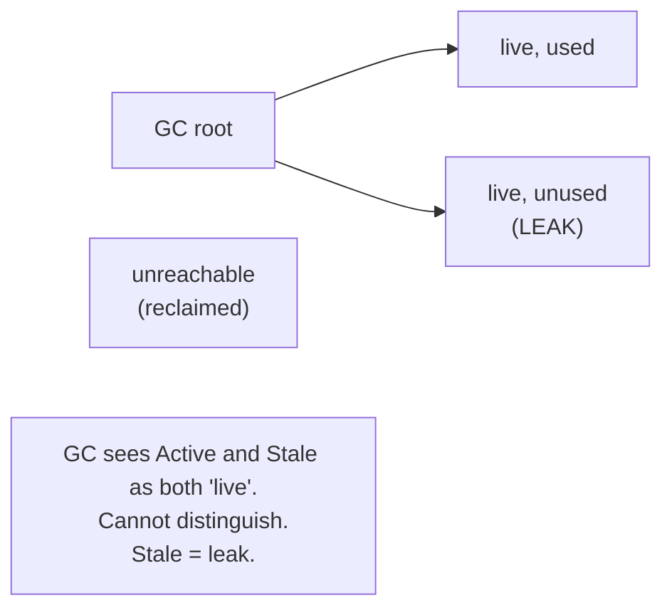
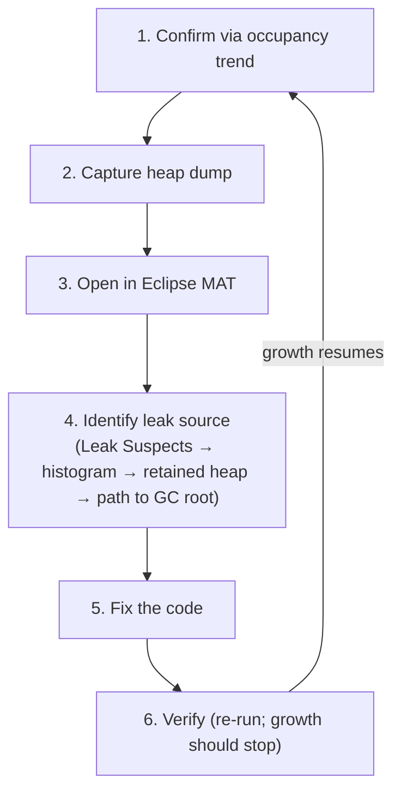
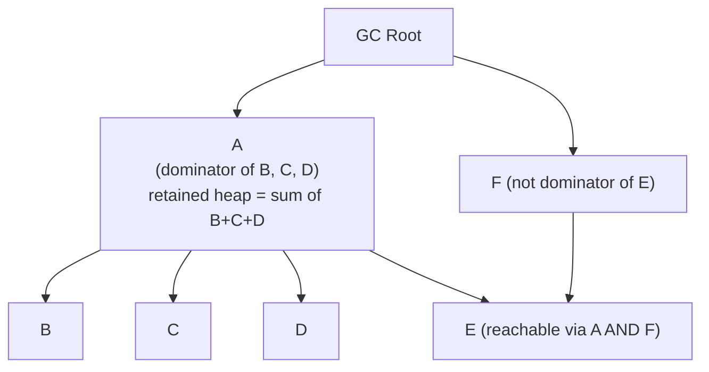
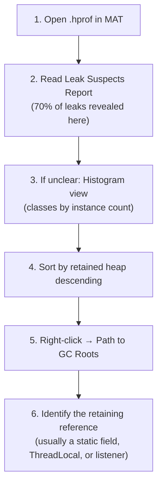

# Memory Leaks & Heap Dump Analysis

T09 covered GC tuning — what to do when the GC's behavior is your problem. This topic covers what to do when *the leak* is your problem. A Java memory leak isn't "forgot to free memory" (the GC handles that); it's "reachable but no longer needed objects accumulating" — and the GC has *no way* to tell "needed" from "reachable." Every production Java service eventually leaks something; the engineer who can systematically diagnose and fix a leak via heap dump analysis is the engineer who keeps the service running.

The depth-bar requirement isn't "use Eclipse MAT." At the **conceptual** layer, a Java leak is fundamentally different from a C `malloc`/`free` leak — it's about *reachability* surviving past usefulness, often through one of a small number of canonical patterns (unbounded static collections, listeners not removed, ThreadLocals in long-lived pool workers, inner-class outer-`this` captures, JDBC driver registration retaining ClassLoaders). At the **capture** layer, **heap dumps** in HPROF format are the snapshot tool — captured via `-XX:+HeapDumpOnOutOfMemoryError` (automatic on OOM, *the* essential flag to always enable), `jcmd GC.heap_dump` (on-demand, pauses the JVM for seconds), or `jmap` (legacy). At the **analysis** layer, **Eclipse MAT** (Memory Analyzer Tool) is the dominant free tool, built around two key concepts: **shallow heap** (just this object's own fields) vs **retained heap** (all objects only reachable through this one — "how much memory would freeing this reclaim?"), and the **dominator tree** that organizes the heap by retention. The **Leak Suspects Report** automates detection of the canonical patterns. At the **workflow** layer, the systematic process — confirm via heap growth trend, capture dump after GC, open in MAT, read Leak Suspects, drill via histogram + retained heap, trace from suspect to GC root, identify the leak point — turns "service is OOMing" into a tractable engineering problem rather than a panic. We will cover all four layers, including native memory leaks invisible to heap dumps and the prevention patterns that stop most leaks before they ship.

> [!NOTE]
> Prerequisites: [GC tuning & monitoring](./T09-gc-tuning-and-monitoring.md) (L3/C02/T09) — when tuning isn't enough; [GC algorithms](./T08-gc-algorithms-serial-parallel-g1-zgc-shenandoah.md) (L3/C02/T08) — collector behavior under leak; [Garbage collection fundamentals](./T07-garbage-collection-fundamentals.md) (L3/C02/T07) — reachability; [Memory model](./T06-memory-model-heap-stack-metaspace.md) (L3/C02/T06) — heap structure + off-heap; [Class loading & class loaders](./T02-class-loading-and-class-loaders.md) (L3/C02/T02) — ClassLoader leaks; [Thread-safety patterns](../C01-concurrency/T17-thread-safety-patterns.md) (L3/C01/T17) — ThreadLocal leak.

## What a Java Memory Leak Is

In C/C++, a leak is "allocated memory never freed" — the program loses the pointer. In Java, the GC reclaims everything unreachable, so that kind of leak is impossible. Instead:

> **A Java memory leak is an object that is *reachable* from a GC root but is *no longer needed* — yet the GC keeps it alive because reachability is all it can compute.**

The GC sees "this is reachable, therefore live." It can't know "this is in a cache that should have evicted it" or "this listener was supposed to be removed." Java leaks come from *application logic* retaining references past their useful life.



The clinical term: **loitering** — the object is still reachable but no longer being used.

## Symptoms of a Leak

| Symptom | What it suggests |
|---------|-------------------|
| Heap occupancy grows linearly over time | Classic leak |
| OOM after N hours/days | Confirms growth, not capped |
| GC frequency increases | More garbage to reclaim, less reclaim per cycle |
| Old generation fills repeatedly | Long-lived objects accumulating |
| "Death spiral": GC time approaches 100% | GC working harder for less reclaim — terminal |
| Container OOM-killed | Total memory exceeded |

The diagnostic clue: **heap occupancy *after* GC grows over time**. Allocation rate is transient; live heap is structural. A graph of "heap after GC" trending upward over hours is the leak signature.

## The 6-Step Diagnostic Workflow



## Step 1 — Confirming a Leak

Before diagnosing, distinguish a leak from normal behavior:

- **Cache growing to capacity**: not a leak (expected, bounded).
- **Heap occupancy stable after warm-up**: not a leak (steady state).
- **Heap occupancy stable but high**: not a leak (just live data).
- **Heap occupancy grows linearly over many hours**: **leak**.

Plot heap occupancy after GC over time. If the line is flat (saw-tooth around a stable peak) → no leak. If it climbs → leak.

```bash
# Capture heap occupancy every minute from JFR:
jcmd <pid> JFR.start duration=24h filename=/tmp/baseline.jfr
# Or from Prometheus:
rate(jvm_memory_used_bytes{area="heap"}[1m])
```

Run for at least an hour; ideally a full day or two of normal traffic.

## Step 2 — Capturing Heap Dumps

Four methods:

### Automatic on OOM (the essential flag)

```bash
java -XX:+HeapDumpOnOutOfMemoryError \
     -XX:HeapDumpPath=/var/dumps \
     -jar myapp.jar
```

The JVM dumps to `/var/dumps/java_pid<n>.hprof` right before throwing OOM. **Always enable this in production.** Costs nothing if no OOM happens; saves you when one does.

### On-demand via `jcmd`

```bash
# Runs Full GC first; dumps only live objects
jcmd <pid> GC.heap_dump /tmp/heap.hprof

# Dump everything (live + dead — rarely useful for leak analysis):
jcmd <pid> GC.heap_dump /tmp/heap.hprof -all
```

`jcmd` is the modern way (jmap is legacy). **The JVM pauses for several seconds** during the dump — disruptive under load.

### `jmap` (legacy)

```bash
jmap -dump:live,format=b,file=/tmp/heap.hprof <pid>
```

Same effect as `jcmd`. Older but still works.

### JFR alternative (no full dump)

JFR samples allocations rather than capturing the whole heap — much lower overhead but less complete:

```bash
jcmd <pid> JFR.start duration=10m settings=profile filename=/tmp/profile.jfr
```

Open in JDK Mission Control; explore the "Memory" tab. Good for live profiling; not as detailed as a heap dump for leak diagnosis.

## The HPROF Format

A binary format originally designed by Sun. Contains:

- **Classes** loaded at the moment of the dump (each with its name, fields, parent).
- **Objects** on the heap with their fields and references.
- **GC roots** — every starting point the GC traces from.
- **Thread stacks** at the moment of dump (locals = roots).
- **Strings** (sometimes inlined; usually as separate objects).

File size ≈ current heap size — a 4 GB heap dumps to a ~4 GB file. Compresses well (~5-10× with gzip). Transfer to your laptop for analysis; never try to analyze on production.

## Step 3 — Analysis Tools

| Tool | Strengths | Use case |
|------|-----------|----------|
| **Eclipse MAT** | Dominator tree, Leak Suspects Report, OQL — most powerful free tool | Production leak analysis |
| **JDK Mission Control (JMC)** | JFR integration; live + post-mortem | Live profiling + JFR analysis |
| **VisualVM** | Bundled (historically); quick checks | Dev / quick triage |
| **YourKit** | Commercial; sophisticated UI; live integration | Enterprise teams |
| **JProfiler** | Commercial; similar to YourKit | Enterprise teams |
| **jhat** | Removed JDK 9+; legacy web viewer | Don't use |

**Eclipse MAT** is the workhorse. The rest of this topic assumes you're using it.

```bash
# Download from https://eclipse.dev/mat/
# Open the .hprof:
mat /tmp/heap.hprof
```

Allocate sufficient memory to MAT (`mat -vmargs -Xmx8g` for a 4 GB dump).

## Key Concepts — Shallow vs Retained Heap, Dominator Tree

### Shallow heap

The size of *just* this object's own fields — header + field bytes + alignment. Doesn't count what it references.

```text
HashMap object: 48 bytes shallow heap
  (= 16-byte header + ~5 references × 4 bytes + padding)
```

### Retained heap

The total memory that *would be freed* if this object were collected — including everything only reachable through it.

```text
HashMap with 1000 entries:
  shallow heap:  48 bytes
  retained heap: ~80 KB (includes the entries, keys, values)
```

**Retained heap is the metric for leak analysis.** "If I fix this leak, how much memory do I get back?"

### Dominator tree

The most powerful concept in heap analysis. Each object's **dominator** is the closest ancestor through which *every* path from a root must go. If you remove the dominator, all its **dominees** become unreachable.



MAT's "Dominator Tree" view sorts by retained heap. The biggest entries are "if I freed this, I'd reclaim X MB." The pattern of large dominators often immediately suggests the leak.

## The Leak Suspects Report

MAT's automated analysis — open a .hprof; the first thing offered is "Leak Suspects Report":

```text
Problem Suspect 1
  Class loader [com.acme.WebappClassLoader] is retaining 156 MB.

Problem Suspect 2
  Thread "scheduler-1" is retaining 89 MB through its ThreadLocalMap.
```

The report identifies retention patterns the algorithm recognizes:

- ClassLoaders that should be unloadable but aren't.
- Threads retaining large data via ThreadLocals.
- Very large collections.
- Specific known leak patterns.

**Always start with the Leak Suspects Report.** It catches ~70% of leaks with one click.

## The 6 Canonical Leak Patterns

### 1. Unbounded static collection

```java
public class Cache {
    private static final Map<String, Object> CACHE = new HashMap<>();

    public static void put(String key, Object value) { CACHE.put(key, value); }
    // ✗ NO eviction; CACHE grows forever
}
```

Most common leak. The map grows indefinitely; entries are never removed.

**Diagnosis**: `CACHE` shows huge retained heap in MAT.
**Fix**: Use a bounded cache library:

```java
private static final Cache<String, Object> CACHE = Caffeine.newBuilder()
    .maximumSize(10000)
    .expireAfterAccess(Duration.ofMinutes(10))
    .build();
```

Or implement an LRU/LFU eviction policy. **Never use a plain `HashMap` as a cache in production.**

### 2. Listener registration without removal

```java
public class Component {
    private static final List<Listener> LISTENERS = new ArrayList<>();
    public static void addListener(Listener l) { LISTENERS.add(l); }
    // ✗ No removeListener
}

// Caller:
component.addListener(this::handleEvent);   // `this` is retained forever
```

`LISTENERS` holds onto `this::handleEvent`, which captures `this`. `this` lives until removed (never).

**Fix**: pair every `addListener` with a `removeListener` (lifecycle-aware); or use `WeakReference<Listener>` to allow GC.

### 3. ThreadLocal in long-lived thread pool (T17 from C01)

```java
public class RequestContext {
    private static final ThreadLocal<UserContext> CONTEXT = new ThreadLocal<>();

    public static void set(UserContext c) { CONTEXT.set(c); }
    // ✗ No remove(); ThreadLocalMap retains UserContext until thread dies
}
```

A pool worker handles many requests; each call to `set()` overwrites, but the Map *itself* grows because every distinct *ThreadLocal* (different keys) stays. More subtly: a value captured here might reference a *webapp* class — retaining the *entire* ClassLoader.

**Fix**:

```java
try {
    CONTEXT.set(c);
    process();
} finally {
    CONTEXT.remove();   // ✓ explicit cleanup
}
```

Or migrate to `ScopedValue` (T14 from C01) — auto-cleared on scope exit.

### 4. Inner class capturing outer `this`

```java
class Container {
    private final List<Item> items = new ArrayList<>();   // BIG list

    void scheduleTask() {
        executor.submit(() -> {
            doSomething();    // ✗ lambda captures `this`; `this.items` retained
        });
    }
}
```

The lambda implicitly captures `Container.this`. As long as the executor queue holds the task, `Container` (and its `items`) lives.

**Fix**: extract a static nested class or capture only what's needed:

```java
final List<Item> snapshot = items;   // snapshot the reference
executor.submit(() -> doSomethingWith(snapshot));   // doesn't capture `this`
```

### 5. JDBC driver ClassLoader leak

```java
// In a webapp:
Class.forName("com.mysql.cj.jdbc.Driver");
// This Driver class is loaded by the webapp ClassLoader.
// java.sql.DriverManager (loaded by Bootstrap) holds a reference to the Driver.
// → Webapp ClassLoader can never be GC'd.
```

The canonical Metaspace leak in app servers. Undeploy the webapp, redeploy — the old ClassLoader (and all its classes) stay in Metaspace forever.

**Fix**: in `ServletContextListener.contextDestroyed()`:

```java
public void contextDestroyed(ServletContextEvent sce) {
    Enumeration<Driver> drivers = DriverManager.getDrivers();
    while (drivers.hasMoreElements()) {
        try {
            DriverManager.deregisterDriver(drivers.nextElement());
        } catch (SQLException e) { ... }
    }
}
```

Modern servlet containers (Tomcat 7+) do this automatically; old ones don't.

### 6. General ClassLoader leak

Any reference from a *parent* ClassLoader's loaded class to a *child* ClassLoader's loaded class retains the child's ClassLoader.

```java
// In a parent CL:
static final Map<String, Class<?>> WEBAPP_CLASSES = new HashMap<>();

// In webapp CL:
WEBAPP_CLASSES.put("Foo", SomeWebappClass.class);
// ✗ Parent CL now references a Class loaded by Webapp CL.
//   Webapp CL can never be unloaded.
```

Common when:

- Loggers (java.util.logging) loaded by parent retain webapp classes.
- Static caches in shared libraries holding references.
- ThreadLocals (above).

**Diagnosis**: MAT's Leak Suspects Report explicitly flags ClassLoader retention.

## The MAT Workflow



### Histogram view

Lists every class with: instance count, shallow heap, retained heap. Sort by retained heap to find the biggest cost.

Surprises in instance counts:

- 10,000 `HashMap` entries when you expected ~100.
- 50,000 `String` instances when you expected ~5,000.
- 1,000 instances of a webapp class when you expected ~10.

Surprises *are* the leak.

### Path to GC Roots

For a suspected leak object, right-click → "Path to GC Roots" → "exclude weak/soft references" (you want strong-retention only). MAT shows the shortest path back to a root:

```text
Object → ArrayList.elementData[5] → ArrayList → Service.cachedEntries → static field of Service
```

The end of the path is *the* root retaining your leak. Fix that holder.

### OQL — Object Query Language

SQL over the heap:

```sql
-- Find all HashMaps with > 1000 entries:
SELECT * FROM java.util.HashMap WHERE size > 1000

-- Find Strings holding paths:
SELECT * FROM java.lang.String WHERE toString().startsWith("/tmp/")

-- Count instances per ClassLoader:
SELECT * FROM INSTANCEOF java.lang.ClassLoader
```

Powerful for custom queries when the standard views don't fit.

## Comparing Two Heap Dumps — Delta Analysis

Take dumps at time T1 (warm-up complete) and T2 (after some workload). Compare:

```bash
# In MAT: Open both dumps, then Compare Class Histograms
```

Classes whose instance counts grew significantly between T1 and T2 are leak candidates. If `com.acme.UserSession` grew from 100 to 10,000, you found the leak.

This is *the* technique for slow leaks invisible in a single dump.

## Production Heap Dump Concerns

Capturing a heap dump in production:

- **Pauses the JVM** for several seconds (writes ~heap size to disk).
- **Disrupts traffic** during the pause.
- **Generates a huge file** (heap-size; often GBs).
- **Reveals data** — full heap contents include user data, credentials. Treat as sensitive.

Production-safe practices:

1. **Enable `-XX:+HeapDumpOnOutOfMemoryError`** — dumps only on OOM, when service is going down anyway.
2. **Direct dumps to a separate disk** with sufficient space — `-XX:HeapDumpPath=/var/dumps`.
3. **Don't dump under load** — restart the service if needed; reproduce in staging.
4. **Encrypt dumps in transit and at rest**.
5. **Delete dumps after analysis** — they contain production data.

For *live* leak diagnosis without disruption: prefer JFR. The detail is less, but the overhead is < 1%.

## Native Memory Leaks

Heap dumps show only the *Java* heap. Native memory (T06's off-heap world — JNI, direct ByteBuffers, mmap, Unsafe) leaks invisibly to heap dump tools.

### Symptoms

- Java heap is stable; process RSS grows.
- `OutOfMemoryError: Direct buffer memory` (direct buffers).
- Container OOM-killed; heap was fine.

### Diagnosis: NMT (Native Memory Tracking)

```bash
# Start JVM with NMT:
java -XX:NativeMemoryTracking=summary -jar myapp.jar

# Take baseline:
jcmd <pid> VM.native_memory baseline

# After leak suspected:
jcmd <pid> VM.native_memory summary.diff
```

Shows per-category delta: heap, Metaspace, code cache, thread stacks, GC, internal, symbols, native memory tracking, arena chunk, native heap.

Growth in "native heap" with no Java-side cause → native leak (JNI, FFM, Unsafe).

### Diagnosis: `pmap`

```bash
pmap -x <pid>
```

Shows all process memory mappings. Compare baseline vs leaked state — growing `[anon]` regions are typically C-heap (JNI malloc) leaks.

### Direct ByteBuffer leaks

```java
// ✗ Direct buffers accumulating in a long-lived list:
List<ByteBuffer> buffers = new ArrayList<>();
buffers.add(ByteBuffer.allocateDirect(1024 * 1024));   // 1 MB native
// Never released; never collected; native memory grows
```

Set `-XX:MaxDirectMemorySize=512m` to cap; you'll get `OutOfMemoryError: Direct buffer memory` when the leak hits the cap (early warning).

## Prevention Patterns

### Bounded caches

```java
Cache<Key, Value> cache = Caffeine.newBuilder()
    .maximumSize(10_000)
    .expireAfterAccess(Duration.ofMinutes(30))
    .build();
```

### try-with-resources for `AutoCloseable`

```java
try (var stream = Files.newInputStream(path)) {
    // ...
}   // auto-close on exit
```

### Soft/Weak references where appropriate

```java
WeakHashMap<Key, Value> map = new WeakHashMap<>();
SoftReference<Image> imageCache = new SoftReference<>(loadImage());
```

### Explicit lifecycle management

```java
public class Resource implements AutoCloseable {
    public void close() { releaseNativeHandle(); }
}
```

### ScopedValue instead of ThreadLocal

```java
ScopedValue.where(USER, currentUser).run(() -> doWork());
// Auto-cleared on scope exit
```

### Listener registration discipline

```java
public class Component implements AutoCloseable {
    private final Listener listener;
    public Component(EventBus bus) {
        this.listener = bus.subscribe(this::onEvent);
    }
    public void close() { listener.unsubscribe(); }
}
```

## Real-World Examples

### Tomcat ClassLoader leak

Webapp registers a JDBC driver; on undeploy, driver isn't deregistered; DriverManager holds the driver class; webapp CL retained.

**Fix**: Tomcat 7+ auto-deregisters; manual deregistration in `contextDestroyed` for older.

### Spring DI scope misuse

```java
@Service @Scope("singleton")
public class CounterService {
    @Autowired SessionState state;   // ✗ injects session-scoped bean into singleton
}
```

The singleton holds a stale reference to a session bean; session never collects.

**Fix**: scoped proxies, or use `ObjectProvider<SessionState>` for explicit lookup.

### Kafka consumer record retention

```java
ConsumerRecords<K, V> records = consumer.poll(Duration.ofMillis(100));
allRecords.addAll(records);   // ✗ growing list of records
```

Consumer holds raw record buffers; the list accumulates them in memory.

**Fix**: process and discard records eagerly; don't accumulate.

### HikariCP ThreadLocal context

HikariCP (and other DB pools) attach ThreadLocal context to threads. Pool workers retain these forever. The connection pool itself bounds this, but webapp classes referenced through them can leak.

**Fix**: ensure pool shutdown on app shutdown; modern HikariCP does this correctly.

## Continuous Leak Monitoring

```yaml
# Prometheus alert rule:
- alert: HeapGrowingOverTime
  expr: |
    (
      avg_over_time(jvm_memory_used_bytes{area="heap"}[1h])
      -
      avg_over_time(jvm_memory_used_bytes{area="heap"}[1h] offset 24h)
    ) > 500_000_000     # 500 MB growth in 24h
  for: 6h
  labels:
    severity: warning
  annotations:
    summary: "Heap growing over time — potential leak"
```

The alert triggers if heap-after-GC has grown > 500 MB in 24 hours, persisting for 6 hours. Suspends false positives from caches still warming up.

For high-frequency monitoring: trigger an automatic heap dump on a threshold (rare in practice; usually manual after alert).

## Common Mistakes

### Confusing caches with leaks

A growing cache that's bounded is not a leak. Look at the *trend over time*; if it stabilizes, it's a cache.

### Taking dumps under load

Disrupts production. Use HeapDumpOnOOM (passive) or reproduce in staging.

### Not using MAT

VisualVM's leak analysis is much weaker than MAT's. Spend the 30 minutes to learn MAT.

### Looking only at shallow heap

Shallow heap rarely matches the leak source. Always sort by retained heap.

### Fixing one leak, missing the bigger one

Heap analysis reveals one leak; you fix it; the next leak is the new big one. Iterate.

### Treating native leaks as Java leaks

Heap dump won't show them. Use NMT + pmap.

## Practice

1. **Reproduce an unbounded cache.** Build a `HashMap` accumulating entries; run to OOM; take heap dump; verify the cache is the dominator.
2. **Listener leak.** Register listeners without removal; observe growth; fix with `WeakReference`; verify.
3. **ThreadLocal leak.** Set ThreadLocal in a pool worker without removing; observe growth via JFR + heap dump.
4. **Inner class capture.** Create an `Outer` class with a large List; submit a lambda capturing `this` to a long-lived queue; verify `Outer` retained.
5. **JDBC driver leak (Tomcat 6 simulation).** Register a Driver; undeploy webapp; verify ClassLoader retained.
6. **MAT Leak Suspects Report.** Take a heap dump from any leaking app; run the report; observe the automated finding.
7. **Dominator tree drill-down.** With a complex heap, sort by retained heap; drill down 3 levels; understand who dominates what.
8. **OQL query.** Find all HashMaps with > 1000 entries via OQL; identify which ones are suspicious.
9. **Two-dump comparison.** Take dumps at T1 and T2 with significant intervening load; compare class histograms in MAT; identify growth.
10. **Native memory leak via direct buffers.** Allocate direct buffers in a loop without releasing; observe `OutOfMemoryError: Direct buffer memory` with `-XX:MaxDirectMemorySize=512m`.
11. **NMT baseline + diff.** Enable NMT; baseline; trigger a leak; observe the category showing growth.
12. **Prevention pattern migration.** Take a leaky cache; migrate to Caffeine bounded; verify steady-state memory.

## Recap

You should now be able to:

- Define a **Java memory leak** as "reachable from a root but no longer needed" — GC can't distinguish needed from reachable; the term "loitering" captures the semantics.
- Recognize **leak symptoms**: heap grows over time, OOM eventually, GC frequency increases, "death spiral" of more GC for less reclaim, container OOM-killed.
- Apply the **6-step diagnostic workflow**: confirm via occupancy trend → capture heap dump → open in MAT → identify source → fix → verify.
- Capture heap dumps via **`-XX:+HeapDumpOnOutOfMemoryError`** (always enable in production), **`jcmd GC.heap_dump`** (on-demand, pauses JVM), **`jmap -dump:live`** (legacy), or **JFR** (lighter alternative for live profiling).
- Understand the **HPROF format**: binary; classes + objects + references + GC roots + thread stacks; file size ~ heap size.
- Use **Eclipse MAT** as the dominant free analysis tool; allocate sufficient memory for analysis.
- Distinguish **shallow heap** (just this object's fields) from **retained heap** (all objects only reachable through this one — "how much memory would freeing this reclaim?"); use retained heap for leak analysis.
- Apply the **dominator tree**: each object's dominator is the closest ancestor through which all paths from roots go; removing a dominator frees all its dominees.
- Use the **Leak Suspects Report** as the first diagnostic step — catches ~70% of leaks automatically.
- Recognize the **6 canonical leak patterns**: unbounded static collection, listener registration without removal, ThreadLocal in pool worker, inner class capturing outer, JDBC driver registration (DriverManager → ClassLoader), general ClassLoader retention.
- Apply the **MAT workflow** for harder leaks: Leak Suspects → Histogram → sort by retained heap → "Path to GC Roots" → identify retaining holder.
- Use **OQL** for custom queries (SQL-like queries over heap).
- Apply **delta analysis** by comparing two heap dumps to find slow leaks.
- Address **production heap dump concerns**: enable HeapDumpOnOOM (passive), dedicated dump disk, never dump under load, encrypt/delete dumps (contain production data).
- Diagnose **native memory leaks** invisible to heap dumps: NMT + pmap; categories like JNI malloc, direct buffers, memory-mapped files; `OutOfMemoryError: Direct buffer memory`.
- Apply **prevention patterns**: bounded caches (Caffeine), try-with-resources for AutoCloseable, Soft/Weak references where appropriate, explicit lifecycle (`close()`), ScopedValue replacing ThreadLocal, listener-removal discipline.
- Identify **real-world cases**: Tomcat ClassLoader / Spring DI scope misuse / Kafka consumer record retention / HikariCP ThreadLocal context.
- Set up **continuous leak monitoring** via Prometheus alerts on heap growth trends.
- Avoid the **6 common mistakes**: confusing caches with leaks, dumping under load, not using MAT, looking only at shallow heap, fixing only the largest leak, treating native leaks as Java leaks.

## Next

Continue to [Profiling (JFR, async-profiler, VisualVM)](./T11-profiling-jfr-async-profiler-visualvm.md) — moving from *memory* diagnosis to *CPU* diagnosis. We'll cover **Java Flight Recorder (JFR)** in depth (event types, continuous recording, JMC analysis), **async-profiler** (sampling profiler with flame graphs — the modern alternative to safepoint-biased profilers), and **VisualVM** for quick triage. Plus the **systematic CPU profiling workflow** (identify hot methods → analyze allocation → correlate with GC → fix or accept), and how to read **flame graphs** that reveal time spent in each method's call stack.
