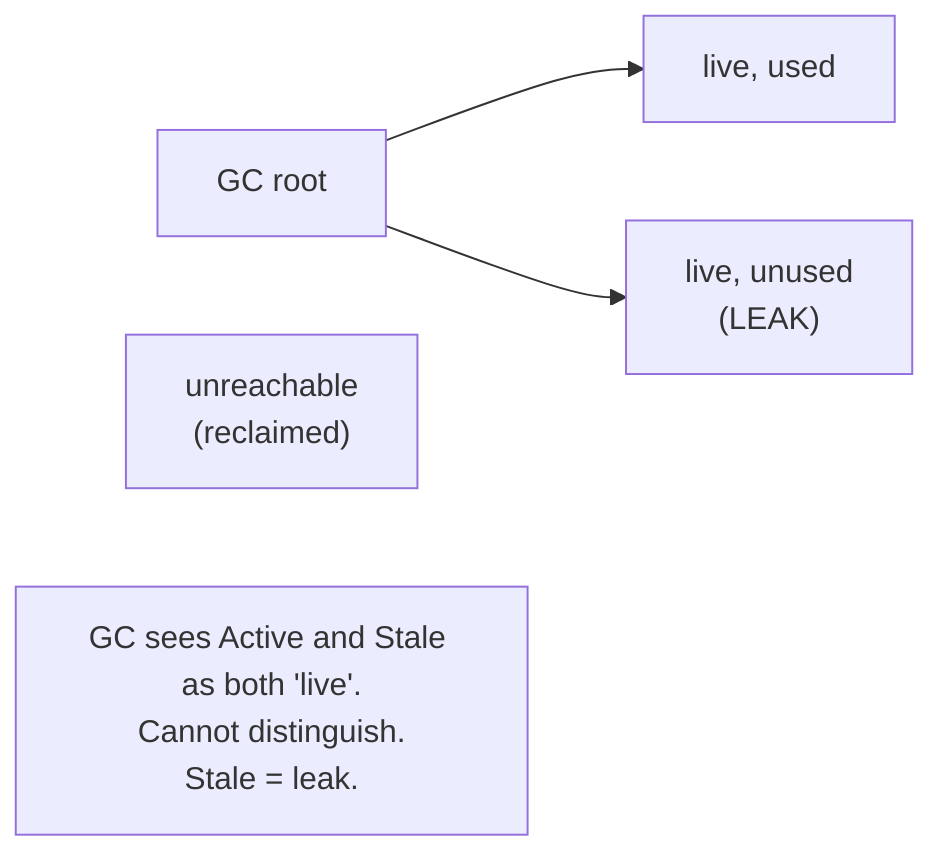
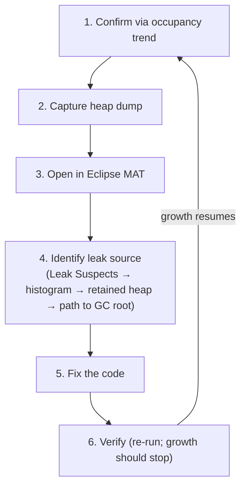
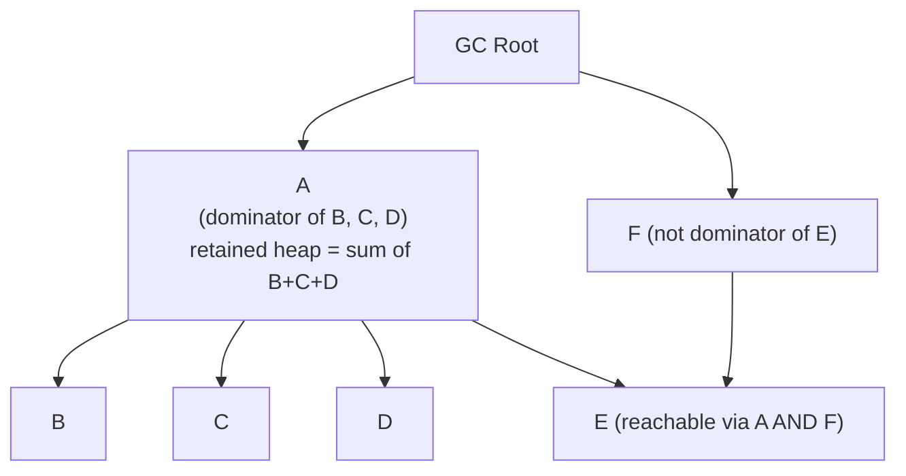
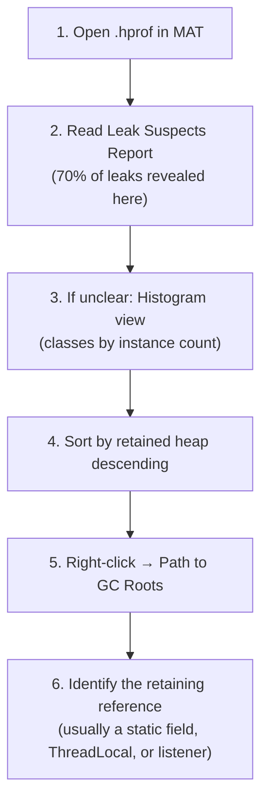

# Memory Leaks & Heap Dump Analysis

T09 covered GC tuning — what to do when the GC's behavior is your problem. This topic covers what to do when *the leak* is your problem. A Java memory leak isn't "forgot to free memory" (the GC handles that); it's "reachable but no longer needed objects accumulating" — and the GC has *no way* to tell "needed" from "reachable." Every production Java service eventually leaks something; the engineer who can systematically diagnose and fix a leak via heap dump analysis is the engineer who keeps the service running.

The depth-bar requirement isn't "use Eclipse MAT." At the **conceptual** layer, a Java leak is fundamentally different from a C `malloc`/`free` leak — it's about *reachability* surviving past usefulness, often through one of a small number of canonical patterns (unbounded static collections, listeners not removed, ThreadLocals in long-lived pool workers, inner-class outer-`this` captures, JDBC driver registration retaining ClassLoaders). At the **capture** layer, **heap dumps** in HPROF format are the snapshot tool — captured via `-XX:+HeapDumpOnOutOfMemoryError` (automatic on OOM, *the* essential flag to always enable), `jcmd GC.heap_dump` (on-demand, pauses the JVM for seconds), or `jmap` (legacy). At the **analysis** layer, **Eclipse MAT** (Memory Analyzer Tool) is the dominant free tool, built around two key concepts: **shallow heap** (just this object's own fields) vs **retained heap** (all objects only reachable through this one — "how much memory would freeing this reclaim?"), and the **dominator tree** that organizes the heap by retention. The **Leak Suspects Report** automates detection of the canonical patterns. At the **workflow** layer, the systematic process — confirm via heap growth trend, capture dump after GC, open in MAT, read Leak Suspects, drill via histogram + retained heap, trace from suspect to GC root, identify the leak point — turns "service is OOMing" into a tractable engineering problem rather than a panic. We will cover all four layers, including native memory leaks invisible to heap dumps and the prevention patterns that stop most leaks before they ship.

> [!NOTE]
> Prerequisites: [GC tuning & monitoring](./T09-gc-tuning-and-monitoring.md) (L3/C02/T09) — when tuning isn't enough; [GC algorithms](./T08-gc-algorithms-serial-parallel-g1-zgc-shenandoah.md) (L3/C02/T08) — collector behavior under leak; [Garbage collection fundamentals](./T07-garbage-collection-fundamentals.md) (L3/C02/T07) — reachability; [Memory model](./T06-memory-model-heap-stack-metaspace.md) (L3/C02/T06) — heap structure + off-heap; [Class loading & class loaders](./T02-class-loading-and-class-loaders.md) (L3/C02/T02) — ClassLoader leaks; [Thread-safety patterns](../C01-concurrency/T17-thread-safety-patterns.md) (L3/C01/T17) — ThreadLocal leak.

## What a Java Memory Leak Is

In C/C++, a leak is "allocated memory never freed" — the program loses the pointer. In Java, the GC reclaims everything unreachable, so that kind of leak is impossible. Instead:

> **A Java memory leak is an object that is *reachable* from a GC root but is *no longer needed* — yet the GC keeps it alive because reachability is all it can compute.**

The GC sees "this is reachable, therefore live." It can't know "this is in a cache that should have evicted it" or "this listener was supposed to be removed." Java leaks come from *application logic* retaining references past their useful life.



The clinical term: **loitering** — the object is still reachable but no longer being used.

## Symptoms of a Leak

| Symptom | What it suggests |
|---------|-------------------|
| Heap occupancy grows linearly over time | Classic leak |
| OOM after N hours/days | Confirms growth, not capped |
| GC frequency increases | More garbage to reclaim, less reclaim per cycle |
| Old generation fills repeatedly | Long-lived objects accumulating |
| "Death spiral": GC time approaches 100% | GC working harder for less reclaim — terminal |
| Container OOM-killed | Total memory exceeded |

The diagnostic clue: **heap occupancy *after* GC grows over time**. Allocation rate is transient; live heap is structural. A graph of "heap after GC" trending upward over hours is the leak signature.

## The 6-Step Diagnostic Workflow



## Step 1 — Confirming a Leak

Before diagnosing, distinguish a leak from normal behavior:

- **Cache growing to capacity**: not a leak (expected, bounded).
- **Heap occupancy stable after warm-up**: not a leak (steady state).
- **Heap occupancy stable but high**: not a leak (just live data).
- **Heap occupancy grows linearly over many hours**: **leak**.

Plot heap occupancy after GC over time. If the line is flat (saw-tooth around a stable peak) → no leak. If it climbs → leak.

```bash
# Capture heap occupancy every minute from JFR:
jcmd <pid> JFR.start duration=24h filename=/tmp/baseline.jfr
# Or from Prometheus:
rate(jvm_memory_used_bytes{area="heap"}[1m])
```

Run for at least an hour; ideally a full day or two of normal traffic.

## Step 2 — Capturing Heap Dumps

Four methods:

### Automatic on OOM (the essential flag)

```bash
java -XX:+HeapDumpOnOutOfMemoryError \
     -XX:HeapDumpPath=/var/dumps \
     -jar myapp.jar
```

The JVM dumps to `/var/dumps/java_pid<n>.hprof` right before throwing OOM. **Always enable this in production.** Costs nothing if no OOM happens; saves you when one does.

### On-demand via `jcmd`

```bash
# Runs Full GC first; dumps only live objects
jcmd <pid> GC.heap_dump /tmp/heap.hprof

# Dump everything (live + dead — rarely useful for leak analysis):
jcmd <pid> GC.heap_dump /tmp/heap.hprof -all
```

`jcmd` is the modern way (jmap is legacy). **The JVM pauses for several seconds** during the dump — disruptive under load.

### `jmap` (legacy)

```bash
jmap -dump:live,format=b,file=/tmp/heap.hprof <pid>
```

Same effect as `jcmd`. Older but still works.

### JFR alternative (no full dump)

JFR samples allocations rather than capturing the whole heap — much lower overhead but less complete:

```bash
jcmd <pid> JFR.start duration=10m settings=profile filename=/tmp/profile.jfr
```

Open in JDK Mission Control; explore the "Memory" tab. Good for live profiling; not as detailed as a heap dump for leak diagnosis.

## The HPROF Format

A binary format originally designed by Sun. Contains:

- **Classes** loaded at the moment of the dump (each with its name, fields, parent).
- **Objects** on the heap with their fields and references.
- **GC roots** — every starting point the GC traces from.
- **Thread stacks** at the moment of dump (locals = roots).
- **Strings** (sometimes inlined; usually as separate objects).

File size ≈ current heap size — a 4 GB heap dumps to a ~4 GB file. Compresses well (~5-10× with gzip). Transfer to your laptop for analysis; never try to analyze on production.

## Step 3 — Analysis Tools

| Tool | Strengths | Use case |
|------|-----------|----------|
| **Eclipse MAT** | Dominator tree, Leak Suspects Report, OQL — most powerful free tool | Production leak analysis |
| **JDK Mission Control (JMC)** | JFR integration; live + post-mortem | Live profiling + JFR analysis |
| **VisualVM** | Bundled (historically); quick checks | Dev / quick triage |
| **YourKit** | Commercial; sophisticated UI; live integration | Enterprise teams |
| **JProfiler** | Commercial; similar to YourKit | Enterprise teams |
| **jhat** | Removed JDK 9+; legacy web viewer | Don't use |

**Eclipse MAT** is the workhorse. The rest of this topic assumes you're using it.

```bash
# Download from https://eclipse.dev/mat/
# Open the .hprof:
mat /tmp/heap.hprof
```

Allocate sufficient memory to MAT (`mat -vmargs -Xmx8g` for a 4 GB dump).

## Key Concepts — Shallow vs Retained Heap, Dominator Tree

### Shallow heap

The size of *just* this object's own fields — header + field bytes + alignment. Doesn't count what it references.

```text
HashMap object: 48 bytes shallow heap
  (= 16-byte header + ~5 references × 4 bytes + padding)
```

### Retained heap

The total memory that *would be freed* if this object were collected — including everything only reachable through it.

```text
HashMap with 1000 entries:
  shallow heap:  48 bytes
  retained heap: ~80 KB (includes the entries, keys, values)
```

**Retained heap is the metric for leak analysis.** "If I fix this leak, how much memory do I get back?"

### Dominator tree

The most powerful concept in heap analysis. Each object's **dominator** is the closest ancestor through which *every* path from a root must go. If you remove the dominator, all its **dominees** become unreachable.



MAT's "Dominator Tree" view sorts by retained heap. The biggest entries are "if I freed this, I'd reclaim X MB." The pattern of large dominators often immediately suggests the leak.

## The Leak Suspects Report

MAT's automated analysis — open a .hprof; the first thing offered is "Leak Suspects Report":

```text
Problem Suspect 1
  Class loader [com.acme.WebappClassLoader] is retaining 156 MB.

Problem Suspect 2
  Thread "scheduler-1" is retaining 89 MB through its ThreadLocalMap.
```

The report identifies retention patterns the algorithm recognizes:

- ClassLoaders that should be unloadable but aren't.
- Threads retaining large data via ThreadLocals.
- Very large collections.
- Specific known leak patterns.

**Always start with the Leak Suspects Report.** It catches ~70% of leaks with one click.

## The 6 Canonical Leak Patterns

### 1. Unbounded static collection

```java
public class Cache {
    private static final Map<String, Object> CACHE = new HashMap<>();

    public static void put(String key, Object value) { CACHE.put(key, value); }
    // ✗ NO eviction; CACHE grows forever
}
```

Most common leak. The map grows indefinitely; entries are never removed.

**Diagnosis**: `CACHE` shows huge retained heap in MAT.
**Fix**: Use a bounded cache library:

```java
private static final Cache<String, Object> CACHE = Caffeine.newBuilder()
    .maximumSize(10000)
    .expireAfterAccess(Duration.ofMinutes(10))
    .build();
```

Or implement an LRU/LFU eviction policy. **Never use a plain `HashMap` as a cache in production.**

### 2. Listener registration without removal

```java
public class Component {
    private static final List<Listener> LISTENERS = new ArrayList<>();
    public static void addListener(Listener l) { LISTENERS.add(l); }
    // ✗ No removeListener
}

// Caller:
component.addListener(this::handleEvent);   // `this` is retained forever
```

`LISTENERS` holds onto `this::handleEvent`, which captures `this`. `this` lives until removed (never).

**Fix**: pair every `addListener` with a `removeListener` (lifecycle-aware); or use `WeakReference<Listener>` to allow GC.

### 3. ThreadLocal in long-lived thread pool (T17 from C01)

```java
public class RequestContext {
    private static final ThreadLocal<UserContext> CONTEXT = new ThreadLocal<>();

    public static void set(UserContext c) { CONTEXT.set(c); }
    // ✗ No remove(); ThreadLocalMap retains UserContext until thread dies
}
```

A pool worker handles many requests; each call to `set()` overwrites, but the Map *itself* grows because every distinct *ThreadLocal* (different keys) stays. More subtly: a value captured here might reference a *webapp* class — retaining the *entire* ClassLoader.

**Fix**:

```java
try {
    CONTEXT.set(c);
    process();
} finally {
    CONTEXT.remove();   // ✓ explicit cleanup
}
```

Or migrate to `ScopedValue` (T14 from C01) — auto-cleared on scope exit.

### 4. Inner class capturing outer `this`

```java
class Container {
    private final List<Item> items = new ArrayList<>();   // BIG list

    void scheduleTask() {
        executor.submit(() -> {
            doSomething();    // ✗ lambda captures `this`; `this.items` retained
        });
    }
}
```

The lambda implicitly captures `Container.this`. As long as the executor queue holds the task, `Container` (and its `items`) lives.

**Fix**: extract a static nested class or capture only what's needed:

```java
final List<Item> snapshot = items;   // snapshot the reference
executor.submit(() -> doSomethingWith(snapshot));   // doesn't capture `this`
```

### 5. JDBC driver ClassLoader leak

```java
// In a webapp:
Class.forName("com.mysql.cj.jdbc.Driver");
// This Driver class is loaded by the webapp ClassLoader.
// java.sql.DriverManager (loaded by Bootstrap) holds a reference to the Driver.
// → Webapp ClassLoader can never be GC'd.
```

The canonical Metaspace leak in app servers. Undeploy the webapp, redeploy — the old ClassLoader (and all its classes) stay in Metaspace forever.

**Fix**: in `ServletContextListener.contextDestroyed()`:

```java
public void contextDestroyed(ServletContextEvent sce) {
    Enumeration<Driver> drivers = DriverManager.getDrivers();
    while (drivers.hasMoreElements()) {
        try {
            DriverManager.deregisterDriver(drivers.nextElement());
        } catch (SQLException e) { ... }
    }
}
```

Modern servlet containers (Tomcat 7+) do this automatically; old ones don't.

### 6. General ClassLoader leak

Any reference from a *parent* ClassLoader's loaded class to a *child* ClassLoader's loaded class retains the child's ClassLoader.

```java
// In a parent CL:
static final Map<String, Class<?>> WEBAPP_CLASSES = new HashMap<>();

// In webapp CL:
WEBAPP_CLASSES.put("Foo", SomeWebappClass.class);
// ✗ Parent CL now references a Class loaded by Webapp CL.
//   Webapp CL can never be unloaded.
```

Common when:

- Loggers (java.util.logging) loaded by parent retain webapp classes.
- Static caches in shared libraries holding references.
- ThreadLocals (above).

**Diagnosis**: MAT's Leak Suspects Report explicitly flags ClassLoader retention.

## The MAT Workflow



### Histogram view

Lists every class with: instance count, shallow heap, retained heap. Sort by retained heap to find the biggest cost.

Surprises in instance counts:

- 10,000 `HashMap` entries when you expected ~100.
- 50,000 `String` instances when you expected ~5,000.
- 1,000 instances of a webapp class when you expected ~10.

Surprises *are* the leak.

### Path to GC Roots

For a suspected leak object, right-click → "Path to GC Roots" → "exclude weak/soft references" (you want strong-retention only). MAT shows the shortest path back to a root:

```text
Object → ArrayList.elementData[5] → ArrayList → Service.cachedEntries → static field of Service
```

The end of the path is *the* root retaining your leak. Fix that holder.

### OQL — Object Query Language

SQL over the heap:

```sql
-- Find all HashMaps with > 1000 entries:
SELECT * FROM java.util.HashMap WHERE size > 1000

-- Find Strings holding paths:
SELECT * FROM java.lang.String WHERE toString().startsWith("/tmp/")

-- Count instances per ClassLoader:
SELECT * FROM INSTANCEOF java.lang.ClassLoader
```

Powerful for custom queries when the standard views don't fit.

## Comparing Two Heap Dumps — Delta Analysis

Take dumps at time T1 (warm-up complete) and T2 (after some workload). Compare:

```bash
# In MAT: Open both dumps, then Compare Class Histograms
```

Classes whose instance counts grew significantly between T1 and T2 are leak candidates. If `com.acme.UserSession` grew from 100 to 10,000, you found the leak.

This is *the* technique for slow leaks invisible in a single dump.

## Production Heap Dump Concerns

Capturing a heap dump in production:

- **Pauses the JVM** for several seconds (writes ~heap size to disk).
- **Disrupts traffic** during the pause.
- **Generates a huge file** (heap-size; often GBs).
- **Reveals data** — full heap contents include user data, credentials. Treat as sensitive.

Production-safe practices:

1. **Enable `-XX:+HeapDumpOnOutOfMemoryError`** — dumps only on OOM, when service is going down anyway.
2. **Direct dumps to a separate disk** with sufficient space — `-XX:HeapDumpPath=/var/dumps`.
3. **Don't dump under load** — restart the service if needed; reproduce in staging.
4. **Encrypt dumps in transit and at rest**.
5. **Delete dumps after analysis** — they contain production data.

For *live* leak diagnosis without disruption: prefer JFR. The detail is less, but the overhead is < 1%.

## Native Memory Leaks

Heap dumps show only the *Java* heap. Native memory (T06's off-heap world — JNI, direct ByteBuffers, mmap, Unsafe) leaks invisibly to heap dump tools.

### Symptoms

- Java heap is stable; process RSS grows.
- `OutOfMemoryError: Direct buffer memory` (direct buffers).
- Container OOM-killed; heap was fine.

### Diagnosis: NMT (Native Memory Tracking)

```bash
# Start JVM with NMT:
java -XX:NativeMemoryTracking=summary -jar myapp.jar

# Take baseline:
jcmd <pid> VM.native_memory baseline

# After leak suspected:
jcmd <pid> VM.native_memory summary.diff
```

Shows per-category delta: heap, Metaspace, code cache, thread stacks, GC, internal, symbols, native memory tracking, arena chunk, native heap.

Growth in "native heap" with no Java-side cause → native leak (JNI, FFM, Unsafe).

### Diagnosis: `pmap`

```bash
pmap -x <pid>
```

Shows all process memory mappings. Compare baseline vs leaked state — growing `[anon]` regions are typically C-heap (JNI malloc) leaks.

### Direct ByteBuffer leaks

```java
// ✗ Direct buffers accumulating in a long-lived list:
List<ByteBuffer> buffers = new ArrayList<>();
buffers.add(ByteBuffer.allocateDirect(1024 * 1024));   // 1 MB native
// Never released; never collected; native memory grows
```

Set `-XX:MaxDirectMemorySize=512m` to cap; you'll get `OutOfMemoryError: Direct buffer memory` when the leak hits the cap (early warning).

## Prevention Patterns

### Bounded caches

```java
Cache<Key, Value> cache = Caffeine.newBuilder()
    .maximumSize(10_000)
    .expireAfterAccess(Duration.ofMinutes(30))
    .build();
```

### try-with-resources for `AutoCloseable`

```java
try (var stream = Files.newInputStream(path)) {
    // ...
}   // auto-close on exit
```

### Soft/Weak references where appropriate

```java
WeakHashMap<Key, Value> map = new WeakHashMap<>();
SoftReference<Image> imageCache = new SoftReference<>(loadImage());
```

### Explicit lifecycle management

```java
public class Resource implements AutoCloseable {
    public void close() { releaseNativeHandle(); }
}
```

### ScopedValue instead of ThreadLocal

```java
ScopedValue.where(USER, currentUser).run(() -> doWork());
// Auto-cleared on scope exit
```

### Listener registration discipline

```java
public class Component implements AutoCloseable {
    private final Listener listener;
    public Component(EventBus bus) {
        this.listener = bus.subscribe(this::onEvent);
    }
    public void close() { listener.unsubscribe(); }
}
```

## Memory-Optimization Patterns

The whole topic so far has been *reactive*: a leak shipped, the heap is climbing, you capture a dump and hunt the loitering object. This section is the *proactive* counterpart. Even with zero leaks, two services with identical functionality can differ 3–5× in heap footprint and 10× in GC pause time purely from how they lay out and allocate objects. A leak is a bug; a fat object graph and a high allocation rate are *design choices* — and the engineer who understands the JVM's memory model (T06) well enough to make those choices deliberately ships services that run on smaller boxes, pause less, and cost less to operate.

The mental frame: a leak makes memory grow *without bound*; poor footprint makes the *bound itself* needlessly high. Both end at an OOM, but you fix them with completely different tools — heap dumps for the first, object-layout awareness and allocation discipline for the second.

> [!NOTE]
> This section builds directly on [Memory model — heap, stack, Metaspace](./T06-memory-model-heap-stack-metaspace.md) (L3/C02/T06) for object headers, alignment, compressed oops, and the off-heap world; on [GC fundamentals](./T07-garbage-collection-fundamentals.md) (L3/C02/T07) for why allocation rate drives collection frequency; and forward to [Project Valhalla — value classes](./T15-project-valhalla-value-classes.md) (L3/C02/T15) for flat layout that erases much of the wrapper tax described below.

### Object Footprint — What an Object Actually Costs

The number you write in a field is not what it costs in RAM. Every Java object on the heap carries overhead the language hides from you. On HotSpot, the layout of an ordinary object is:

```text
Object layout (64-bit HotSpot, compressed oops ON — the default heaps < 32 GB):

  offset  bytes  contents
  ┌──────┬──────┬───────────────────────────────────────┐
  │  0   │  8   │ mark word   (hash, GC age, lock bits)   │  ← object header
  │  8   │  4   │ klass pointer (which class — compressed)│  ← object header
  ├──────┼──────┼───────────────────────────────────────┤
  │ 12   │  ?   │ instance fields...                      │
  │ ...  │      │ (reordered by the JVM for packing)      │
  ├──────┼──────┼───────────────────────────────────────┤
  │ end  │ 0-7  │ padding to an 8-byte boundary           │  ← alignment
  └──────┴──────┴───────────────────────────────────────┘
```

The **mark word** (8 bytes) holds the identity hash code (once computed), the GC age, and biased/lightweight-lock bits. The **klass pointer** (4 bytes when compressed, 8 otherwise) says which class this is. So even an object with *no fields at all* costs 16 bytes after alignment. An object is always padded up to a multiple of 8 bytes — `-XX:ObjectAlignmentInBytes`, default 8.

**Field alignment and padding.** The JVM reorders your declared fields to minimize padding (longs and doubles on 8-byte boundaries, ints on 4, etc.), then pads the tail. You don't control declaration order's effect on size — but you *do* control how many fields and of what type. A class with a single `boolean` field still costs 16 bytes: 12 bytes header + 1 byte boolean + 3 bytes padding.

```text
class Flag { boolean on; }     // 16 bytes  (header 12 + 1 + 3 pad)
class Point { int x, y; }      // 16 bytes  (header 12 + 8 + 0 pad)
class Point3 { int x, y, z; }  // 24 bytes  (header 12 + 12 + 0 pad)
```

**Compressed oops and the 32 GB cliff.** An "oop" is an *ordinary object pointer* — a reference. On a 64-bit JVM, a raw reference is 8 bytes. HotSpot's **compressed oops** (`-XX:+UseCompressedOops`, on by default) store references as 32-bit values scaled by the 8-byte alignment, letting them address up to `2^32 × 8 = 32 GB` of heap. This halves the size of every reference field and the klass pointer — a major footprint win.

The catch is the famous **32 GB cliff**: the moment your `-Xmx` crosses ~32 GB, compressed oops can no longer cover the heap, the JVM falls back to 8-byte references, and *every reference in the heap doubles*. A heap configured at 33 GB can hold **less live data** than one configured at 31 GB, because the per-reference overhead jumped. The relatable version: a 31 GB heap is like a parking garage with short stall numbers (2 digits) — compact signage everywhere; push past 32 GB and every stall needs 4-digit numbers, so the *signs* eat space that used to hold cars. The rule of thumb: never size a heap between ~32 GB and ~40 GB — either stay under 32 GB, or jump well past 40 GB so the extra capacity outweighs the doubled pointers.

**Why `Integer[]` is far larger than `int[]`.** This is the single most important footprint lesson in Java. A primitive array stores values *inline*; a wrapper array stores *references to boxed objects*:

```text
int[] of 1000 ints (compressed oops):
  ┌────────────────────────────────────────────────┐
  │ array header (16 B) + 1000 × 4 B  = 4016 bytes  │   one contiguous block
  └────────────────────────────────────────────────┘

Integer[] of 1000 Integers:
  ┌──────────────────────────────────────────┐
  │ array header (16 B) + 1000 × 4 B refs     │  = 4016 bytes  (the refs)
  └───┬──────────────────────────────────────┘
      │ each ref points to a separate Integer object:
      └─► Integer { header 12 B + int 4 B } = 16 bytes each
          1000 × 16 B = 16000 bytes  (the boxes)

  Total: ~20 KB  vs  ~4 KB  →  ~5× larger, plus 1000 extra objects for GC to trace.
```

The `int[]` is ~4 KB in one cache-friendly block. The `Integer[]` is ~20 KB scattered across 1001 objects, each with a header, each a separate GC-traceable node, each a potential cache miss when you walk the array. **Wrappers cost roughly 4× the payload in header overhead alone, plus an indirection.**

> **The LEGO analogy.** A primitive `int[]` is a tray of LEGO bricks sitting loose in one compartment — grab the tray, every brick comes with it, all touching. An `Integer[]` (or `List<Integer>`) is the same bricks, but each one shipped in its own cardboard box with a printed label, and the tray now holds *slips of paper* telling you which shelf each box is on. You pay for every box (the 12-byte header), every label, and the trip to a different shelf (pointer chase / cache miss) each time you want a brick.

**Compact Strings (Java 9+).** Before Java 9, every `String` stored a `char[]` — 2 bytes per character (UTF-16), even for plain ASCII text where the high byte was always zero. Java 9's **Compact Strings** (JEP 254) changed the backing store to a `byte[]` plus a 1-byte `coder` flag: if every character fits in Latin-1 (the common case for IDs, JSON keys, log lines, English text), the string stores **1 byte per character** — half the footprint. If any character needs UTF-16, it transparently uses 2 bytes per character as before. It is on by default (`-XX:+CompactStrings`) and requires no code change. For a service whose heap is dominated by ASCII strings — most web backends — this single JDK upgrade cut string footprint roughly in half for free.

```java
String id = "ORD-2026-00417";   // Latin-1: byte[14] + coder, ~32 B total object
String ja = "注文番号";          // needs UTF-16: byte[8] (4 chars × 2), coder=UTF16
```

> [!TIP]
> Tie this back to the chapter's memory-model material: the header, alignment, and compressed-oop behavior described in T06 are *exactly* what determines these sizes. Footprint optimization is just applying the memory model on purpose instead of by accident.

### Allocation Reduction — Why Cheap Allocation Is Expensive in Aggregate

Allocating an object in HotSpot is astonishingly cheap: usually a **bump-the-pointer** in a thread-local allocation buffer (TLAB) — a few instructions, no lock. So why care? Because allocation is cheap *per object* but the bill comes due collectively: **every byte you allocate is a byte the GC must eventually scan, copy, or reclaim.** Allocation rate, not live-set size, is what drives *minor-GC frequency*. A service that allocates 2 GB/s churns the young generation far more often than one allocating 200 MB/s for the same useful work — more young collections, more CPU burned on GC, more pause-time jitter (see T07 for why young-gen fills proportionally to allocation rate).

The relatable version: allocating is like grabbing a fresh paper cup for each sip of water. One cup is free. Ten thousand cups an hour means someone is constantly emptying the bin — and that someone (the GC) competes with your application for the CPU.

**Escape analysis and scalar replacement.** The C2 JIT (T04) can sometimes make allocation *vanish entirely*. **Escape analysis** proves an object never "escapes" the method that created it — it isn't stored in a field, returned, or passed somewhere that outlives the call. If it can prove that, **scalar replacement** breaks the object into its individual fields and keeps them in registers/stack slots: zero heap allocation, zero GC pressure.

```java
// Likely scalar-replaced — the Point never escapes:
double distance(double x, double y) {
    Point p = new Point(x, y);   // JIT may elide this allocation entirely
    return Math.sqrt(p.x * p.x + p.y * p.y);
}

// Cannot be elided — the object escapes via the return:
Point makePoint(double x, double y) {
    return new Point(x, y);      // must live on the heap; caller keeps it
}
```

When it *can't* elide: the object is stored in a field, returned, passed to a non-inlined method, captured by a lambda that outlives the frame, or the allocation is inside a megamorphic call site the JIT couldn't inline. Escape analysis is a wonderful optimization but a fragile one — never *rely* on it for a hot path; verify with `-XX:+PrintEscapeAnalysis` (debug builds) or by watching allocation profiles in JFR/async-profiler (T11). When in doubt, structure the code so the object obviously doesn't escape.

**Reusing buffers.** In hot loops, allocate the working buffer once and reuse it rather than allocating per iteration:

```java
// ✗ Allocates a new byte[] every call — high allocation rate
void copy(InputStream in, OutputStream out) throws IOException {
    int n;
    while ((n = in.read(new byte[8192])) != -1) out.write(/*...*/, 0, n); // fresh array each read
}

// ✓ One buffer, reused
void copy(InputStream in, OutputStream out) throws IOException {
    byte[] buf = new byte[8192];
    int n;
    while ((n = in.read(buf)) != -1) out.write(buf, 0, n);
}
```

For thread-confined reuse without sharing hazards, a `ThreadLocal<byte[]>` works — but remember the ThreadLocal-in-pool caveat from earlier in this topic: clear or bound it.

**Avoiding needless autoboxing.** Autoboxing silently allocates `Integer`/`Long`/`Double` objects, and in tight loops it dominates the allocation profile:

```java
// ✗ Each += autoboxes long → Long → long: millions of throwaway Long objects
Long sum = 0L;
for (long v : values) sum += v;     // sum = Long.valueOf(sum.longValue() + v)

// ✓ Primitive accumulator: zero allocation
long sum = 0L;
for (long v : values) sum += v;
```

The `Integer` cache (`-128..127`, via `Integer.valueOf`) hides this for small values but not for the general case. A `Map<Integer, Integer>` autoboxes on every `put`/`get`/`merge`.

**Primitive collections vs `HashMap<Integer, Integer>`.** A `HashMap<Integer, Integer>` is a footprint disaster: every entry is a `HashMap.Node` (32 bytes: header + hash + key ref + value ref + next ref), plus a boxed `Integer` key (16 B) and a boxed `Integer` value (16 B) — roughly **64 bytes to store 8 bytes of actual data**, an 8× overhead, before counting the backing array and load-factor slack. Primitive-specialized collections store keys and values in primitive arrays with open addressing — no per-entry node, no boxing:

| Library | Type for int→int | Notes |
|---------|------------------|-------|
| **Eclipse Collections** | `IntIntHashMap` | Mature, broad API, GS Collections lineage |
| **fastutil** | `Int2IntOpenHashMap` | Very fast, huge surface area, big jar |
| **Koloboke** | `HashIntIntMap` | Generated, very low overhead |

```java
// ✗ ~64 B/entry, boxes on every access, extra GC nodes
Map<Integer, Integer> counts = new HashMap<>();
counts.merge(key, 1, Integer::sum);

// ✓ Two int[] arrays, no boxing, ~8-16 B/entry, cache-friendly
import org.eclipse.collections.impl.map.mutable.primitive.IntIntHashMap;
IntIntHashMap counts = new IntIntHashMap();
counts.addToValue(key, 1);
```

For a large `int→int` or `long→long` map this is routinely a **4–8× heap reduction** plus far less GC churn.

**Streams vs loops — allocation, not dogma.** Streams are expressive and usually fine, but on a hot path they can allocate more than the equivalent loop: the stream pipeline itself, lambdas (when they capture), `Spliterator`s, and especially **boxing in numeric pipelines**. Prefer the primitive stream specializations (`IntStream`, `LongStream`, `DoubleStream`) over `Stream<Integer>` to avoid boxing, and don't be afraid of a plain `for` loop in a measured hot path:

```java
// ✗ Boxes every element into Integer
int total = list.stream().reduce(0, Integer::sum);

// ✓ Primitive stream, no boxing
int total = list.stream().mapToInt(Integer::intValue).sum();

// ✓ Plain loop on a hot path — zero pipeline allocation
int total = 0;
for (int v : arr) total += v;
```

This is a *measure-then-decide* call, not a blanket "avoid streams." Most code is not hot enough to matter.

**String handling.** String concatenation in a loop is the classic allocation trap. `a + b` compiles to efficient `invokedynamic`/`StringConcatFactory` for a *single* expression, but `+=` inside a loop creates a new string (and a new backing `byte[]`) on every iteration — quadratic allocation:

```java
// ✗ O(n²) allocation: each += builds a whole new String
String csv = "";
for (String field : fields) csv += field + ",";

// ✓ One StringBuilder, one resizing buffer
StringBuilder sb = new StringBuilder(fields.size() * 16);  // pre-size to avoid resizes
for (String field : fields) sb.append(field).append(',');
String csv = sb.toString();
```

Pre-sizing the `StringBuilder` (and likewise `new ArrayList<>(expectedSize)`, `new HashMap<>(expectedCapacity)`) avoids repeated grow-and-copy reallocations.

### Off-Heap and Specialized Layouts

Sometimes the answer is to keep data *out of the Java heap entirely* — so the GC never has to scan it. This trades GC pressure for manual lifetime management and complexity.

**Direct `ByteBuffer`.** `ByteBuffer.allocateDirect(n)` allocates memory outside the Java heap; the GC sees only a small wrapper object. Useful for large, long-lived binary buffers (network/IO, caches of serialized data) that would otherwise bloat the heap and lengthen GC scans. The cost: the memory is reclaimed only when the wrapper is collected (via a `Cleaner`) — non-deterministic — and it's capped by `-XX:MaxDirectMemorySize`. (This is exactly the direct-buffer *leak* hazard described earlier in this topic; off-heap is a tool, not a free lunch.)

**Foreign Function & Memory API (`MemorySegment`).** The modern, safe successor to `Unsafe` and raw direct buffers, finalized in Java 22 (JEP 454) and introduced through T06. A `MemorySegment` is a typed, bounds-checked, deterministically-freed handle to off-heap (or on-heap) memory, scoped by an `Arena`:

```java
try (Arena arena = Arena.ofConfined()) {
    MemorySegment seg = arena.allocate(1_000_000L * Long.BYTES);   // off-heap, 8 MB
    for (long i = 0; i < 1_000_000L; i++) {
        seg.setAtIndex(ValueLayout.JAVA_LONG, i, i * i);
    }
    long v = seg.getAtIndex(ValueLayout.JAVA_LONG, 42);            // bounds-checked read
}   // arena close → memory freed deterministically, no GC, no Cleaner lag
```

The `Arena` gives you **deterministic lifetime** (freed at `close()`, not whenever a `Cleaner` runs) and bounds-checking the old `Unsafe` path lacked — the right modern choice when you genuinely need off-heap.

**Memory-mapped files.** `FileChannel.map(...)` (or `Arena.ofShared()` with `FileChannel.map` into a `MemorySegment`) maps a file into the address space, letting the OS page data in and out on demand. This holds datasets far larger than RAM with no heap cost — the standard technique behind embedded stores, columnar formats, and large read-mostly indexes. The trade-off is that access cost becomes a *page fault* (disk latency) rather than a memory read, and you again own the lifetime.

**When to go off-heap — the trade-off ledger:**

| Go off-heap when... | Stay on-heap when... |
|---------------------|----------------------|
| Data is large, long-lived, and GC scans of it hurt pause times | Data is small or short-lived (let the young gen handle it) |
| Layout is simple (bytes, primitives, fixed records) | Data is a rich graph of Java objects |
| You can manage lifetime deterministically (`Arena`, explicit free) | You want the GC to manage lifetime for you |
| You need a cache bigger than the heap, or data shared across processes (mmap) | Complexity/bug-risk of manual memory isn't worth it |

> **Forward nod — Project Valhalla.** Much of the wrapper tax above exists because *every* object today is a heap node with a header and an identity. [Project Valhalla — value classes](./T15-project-valhalla-value-classes.md) (L3/C02/T15) introduces value classes whose instances have *no identity* and can be laid out **flat and inline** — a `Point[]` of value `Point`s could store the `x`/`y` pairs contiguously like a primitive array, with no per-element header and no indirection. When it lands, the "`Integer[]` is 5× larger than `int[]`" problem largely dissolves for value types, and many of the primitive-collection workarounds become unnecessary. Until then, the patterns above are how you get flat-layout-like footprint today.

### Sizing and Measuring Footprint — Measure Before You Optimize

The cardinal rule of footprint work mirrors all performance work (T13): **measure first.** Object sizes are non-obvious — header overhead, alignment padding, and compressed-oop state make hand-arithmetic unreliable. Use tools.

**JOL — Java Object Layout.** OpenJDK's authoritative tool for "how big is this object, *actually*, on this JVM, with these flags?" It prints the real field offsets, header, and padding:

```java
// dependency: org.openjdk.jol:jol-core
import org.openjdk.jol.info.ClassLayout;
import org.openjdk.jol.info.GraphLayout;

System.out.println(ClassLayout.parseInstance(new java.util.HashMap<>()).toPrintable());
// → exact header + field offsets + padding for one object

System.out.println(GraphLayout.parseInstance(myBigGraph).totalSize());
// → deep retained size of an entire object graph, in bytes
```

`ClassLayout` shows one object's shallow layout (and reveals padding you can sometimes remove by reordering related objects); `GraphLayout` walks the reachable graph and reports its true deep size — perfect for comparing "boxed map vs primitive map" before committing.

**`-XX:+UseCompressedOops` and the cliff.** Confirm it's on (it is by default under 32 GB) and use it to reason about the cliff: if `-Xmx` is near 32 GB, check whether dropping below 32 GB actually *increases* effective capacity. Pair with `-XX:+PrintFlagsFinal | grep -i oop` to see the resolved settings.

**Native Memory Tracking (NMT).** Already introduced in this topic for native *leaks* — it's equally useful for footprint *accounting*. `jcmd <pid> VM.native_memory summary` attributes process memory across heap, Metaspace, code cache, thread stacks, GC structures, and direct/off-heap, so you can see whether your "memory problem" is even in the Java heap before you start optimizing object layout. If RSS is dominated by thread stacks (too many threads × `-Xss`) or by off-heap buffers, no amount of object-layout tuning will help.

**Allocation profiling.** To attack allocation *rate* (not footprint), profile *where* allocations happen: JFR's `jdk.ObjectAllocationSample` events or **async-profiler** in `alloc` mode (both in T11) produce allocation flame graphs that point straight at the hot allocation sites worth fixing. Optimize the top of that flame graph; ignore the rest.

> [!INTERVIEW]
> A strong answer to "how would you reduce a Java service's memory footprint?" moves through layers in order: (1) **measure first** — is the pressure even in the Java heap? Use NMT to rule out thread stacks / off-heap, and a heap histogram + JOL to find the dominant object types; (2) **attack the dominant type** — if it's a `HashMap<Integer,Integer>` or `Map<Long,Long>`, swap in a primitive collection (Eclipse Collections / fastutil) for a 4–8× reduction; if it's strings, confirm Compact Strings is active (Java 9+) and intern/dedup where appropriate; (3) **cut allocation rate** to ease GC — avoid autoboxing in hot loops, reuse buffers, prefer primitive streams or plain loops on measured hot paths, and let escape analysis elide short-lived objects (but never *rely* on it); (4) **consider off-heap** (`MemorySegment` / direct buffers / mmap) only for large, simple, long-lived data where GC scans of the heap are the actual bottleneck, accepting manual lifetime; (5) **mind the 32 GB compressed-oops cliff** when sizing the heap. The senior signal is leading with measurement and naming the *trade-offs* — off-heap removes GC pressure but reintroduces manual-lifetime bugs (exactly the direct-buffer leak we diagnose earlier in this topic).

### Real-World Scenario — From `Map<Long, Long>` to a Primitive Map

A real shape of this problem: a recommendation service kept an in-memory index mapping `userId (long) → lastSeenItemId (long)` for ~40 million users in a `HashMap<Long, Long>`. The heap sat around 9 GB, `-Xmx` was 12 GB, and G1 old-gen pauses crept toward 400 ms as the map dominated the live set — every full marking phase had to trace ~120 million objects (one `Node` + two boxed `Long`s per entry).

The footprint math: each entry is roughly a 32-byte `HashMap.Node` + a 16-byte boxed `Long` key + a 16-byte boxed `Long` value = ~64 bytes, plus backing-array slack — about **2.6 GB of node/box overhead** for 640 MB of actual `long` payload, and ~120M extra GC-traceable objects.

The fix was a single data-structure swap to an Eclipse Collections `LongLongHashMap` (two `long[]` arrays, open addressing, zero boxing). The same 40M mappings dropped to roughly **0.7–0.9 GB** — a ~3–4× reduction — and, because the map was now ~80M *fewer* objects for the GC to trace, old-gen pause times fell back under 100 ms. No algorithm changed; no leak existed; the service simply stopped shipping each `long` in its own labeled box and put them loose in two trays.

When even that wasn't enough for a *larger* index (hundreds of millions of entries that didn't need to be on-heap at all), the next step was an **off-heap** open-addressed table backed by a `MemorySegment`/mmap region: the index lived outside the heap, the GC never scanned it, `-Xmx` shrank dramatically, and lookups paid an off-heap read instead of a heap dereference — the on-heap GC pressure for that structure went to zero, at the cost of owning the segment's lifetime via an `Arena`.

## Real-World Examples

### Tomcat ClassLoader leak

Webapp registers a JDBC driver; on undeploy, driver isn't deregistered; DriverManager holds the driver class; webapp CL retained.

**Fix**: Tomcat 7+ auto-deregisters; manual deregistration in `contextDestroyed` for older.

### Spring DI scope misuse

```java
@Service @Scope("singleton")
public class CounterService {
    @Autowired SessionState state;   // ✗ injects session-scoped bean into singleton
}
```

The singleton holds a stale reference to a session bean; session never collects.

**Fix**: scoped proxies, or use `ObjectProvider<SessionState>` for explicit lookup.

### Kafka consumer record retention

```java
ConsumerRecords<K, V> records = consumer.poll(Duration.ofMillis(100));
allRecords.addAll(records);   // ✗ growing list of records
```

Consumer holds raw record buffers; the list accumulates them in memory.

**Fix**: process and discard records eagerly; don't accumulate.

### HikariCP ThreadLocal context

HikariCP (and other DB pools) attach ThreadLocal context to threads. Pool workers retain these forever. The connection pool itself bounds this, but webapp classes referenced through them can leak.

**Fix**: ensure pool shutdown on app shutdown; modern HikariCP does this correctly.

## Continuous Leak Monitoring

```yaml
# Prometheus alert rule:
- alert: HeapGrowingOverTime
  expr: |
    (
      avg_over_time(jvm_memory_used_bytes{area="heap"}[1h])
      -
      avg_over_time(jvm_memory_used_bytes{area="heap"}[1h] offset 24h)
    ) > 500_000_000     # 500 MB growth in 24h
  for: 6h
  labels:
    severity: warning
  annotations:
    summary: "Heap growing over time — potential leak"
```

The alert triggers if heap-after-GC has grown > 500 MB in 24 hours, persisting for 6 hours. Suspends false positives from caches still warming up.

For high-frequency monitoring: trigger an automatic heap dump on a threshold (rare in practice; usually manual after alert).

## Common Mistakes

### Confusing caches with leaks

A growing cache that's bounded is not a leak. Look at the *trend over time*; if it stabilizes, it's a cache.

### Taking dumps under load

Disrupts production. Use HeapDumpOnOOM (passive) or reproduce in staging.

### Not using MAT

VisualVM's leak analysis is much weaker than MAT's. Spend the 30 minutes to learn MAT.

### Looking only at shallow heap

Shallow heap rarely matches the leak source. Always sort by retained heap.

### Fixing one leak, missing the bigger one

Heap analysis reveals one leak; you fix it; the next leak is the new big one. Iterate.

### Treating native leaks as Java leaks

Heap dump won't show them. Use NMT + pmap.

## Practice

1. **Reproduce an unbounded cache.** Build a `HashMap` accumulating entries; run to OOM; take heap dump; verify the cache is the dominator.
2. **Listener leak.** Register listeners without removal; observe growth; fix with `WeakReference`; verify.
3. **ThreadLocal leak.** Set ThreadLocal in a pool worker without removing; observe growth via JFR + heap dump.
4. **Inner class capture.** Create an `Outer` class with a large List; submit a lambda capturing `this` to a long-lived queue; verify `Outer` retained.
5. **JDBC driver leak (Tomcat 6 simulation).** Register a Driver; undeploy webapp; verify ClassLoader retained.
6. **MAT Leak Suspects Report.** Take a heap dump from any leaking app; run the report; observe the automated finding.
7. **Dominator tree drill-down.** With a complex heap, sort by retained heap; drill down 3 levels; understand who dominates what.
8. **OQL query.** Find all HashMaps with > 1000 entries via OQL; identify which ones are suspicious.
9. **Two-dump comparison.** Take dumps at T1 and T2 with significant intervening load; compare class histograms in MAT; identify growth.
10. **Native memory leak via direct buffers.** Allocate direct buffers in a loop without releasing; observe `OutOfMemoryError: Direct buffer memory` with `-XX:MaxDirectMemorySize=512m`.
11. **NMT baseline + diff.** Enable NMT; baseline; trigger a leak; observe the category showing growth.
12. **Prevention pattern migration.** Take a leaky cache; migrate to Caffeine bounded; verify steady-state memory.
13. **Measure object size with JOL.** Add `org.openjdk.jol:jol-core`; print `ClassLayout.parseInstance(...)` for a small class with one `boolean`, then one with two `int`s; confirm the 12-byte header and the alignment padding by hand.
14. **`int[]` vs `Integer[]` footprint.** Use JOL's `GraphLayout.parseInstance(...).totalSize()` to measure an `int[1000]` and an `Integer[1000]`; confirm the ~5× difference and explain it in terms of headers and indirection.
15. **Compressed-oops cliff.** Run the same allocation-heavy workload at `-Xmx30g` and `-Xmx33g`; with `-XX:+PrintFlagsFinal | grep -i oop`, observe compressed oops disabling above 32 GB and reason about why effective capacity can *drop*.
16. **Compact Strings.** On Java 9+, build a large list of ASCII strings vs strings containing one non-Latin-1 character; compare deep size with JOL and confirm the 1-byte vs 2-byte-per-char backing store.
17. **Boxing allocation in a loop.** Sum a large `long[]` first into a `Long` accumulator, then a primitive `long`; profile allocation with async-profiler (`alloc` mode) or JFR and compare the throwaway `Long` count.
18. **Escape analysis.** Write a method that creates a short-lived object used only locally; verify with allocation profiling that C2 elides the allocation, then change the method to *return* the object and confirm the allocation reappears.
19. **Primitive map migration.** Replace a `HashMap<Long, Long>` holding ~1M entries with an Eclipse Collections `LongLongHashMap` (or fastutil `Long2LongOpenHashMap`); measure heap before/after with a heap histogram and confirm the multi-× reduction.
20. **Off-heap with `MemorySegment`.** Store 1M `long`s in an `Arena.ofConfined()`-allocated `MemorySegment`; confirm the Java heap stays flat (it's off-heap) and that memory is freed deterministically at `Arena.close()`.
21. **Buffer reuse.** Take a copy loop that allocates a fresh `byte[]` per read; refactor to reuse one buffer; compare allocation rate via JFR.
22. **StringBuilder pre-sizing.** Build a large CSV with `+=` in a loop, then with a pre-sized `StringBuilder`; measure allocation and time; explain the quadratic behavior of the naive version.

## Recap

You should now be able to:

- Define a **Java memory leak** as "reachable from a root but no longer needed" — GC can't distinguish needed from reachable; the term "loitering" captures the semantics.
- Recognize **leak symptoms**: heap grows over time, OOM eventually, GC frequency increases, "death spiral" of more GC for less reclaim, container OOM-killed.
- Apply the **6-step diagnostic workflow**: confirm via occupancy trend → capture heap dump → open in MAT → identify source → fix → verify.
- Capture heap dumps via **`-XX:+HeapDumpOnOutOfMemoryError`** (always enable in production), **`jcmd GC.heap_dump`** (on-demand, pauses JVM), **`jmap -dump:live`** (legacy), or **JFR** (lighter alternative for live profiling).
- Understand the **HPROF format**: binary; classes + objects + references + GC roots + thread stacks; file size ~ heap size.
- Use **Eclipse MAT** as the dominant free analysis tool; allocate sufficient memory for analysis.
- Distinguish **shallow heap** (just this object's fields) from **retained heap** (all objects only reachable through this one — "how much memory would freeing this reclaim?"); use retained heap for leak analysis.
- Apply the **dominator tree**: each object's dominator is the closest ancestor through which all paths from roots go; removing a dominator frees all its dominees.
- Use the **Leak Suspects Report** as the first diagnostic step — catches ~70% of leaks automatically.
- Recognize the **6 canonical leak patterns**: unbounded static collection, listener registration without removal, ThreadLocal in pool worker, inner class capturing outer, JDBC driver registration (DriverManager → ClassLoader), general ClassLoader retention.
- Apply the **MAT workflow** for harder leaks: Leak Suspects → Histogram → sort by retained heap → "Path to GC Roots" → identify retaining holder.
- Use **OQL** for custom queries (SQL-like queries over heap).
- Apply **delta analysis** by comparing two heap dumps to find slow leaks.
- Address **production heap dump concerns**: enable HeapDumpOnOOM (passive), dedicated dump disk, never dump under load, encrypt/delete dumps (contain production data).
- Diagnose **native memory leaks** invisible to heap dumps: NMT + pmap; categories like JNI malloc, direct buffers, memory-mapped files; `OutOfMemoryError: Direct buffer memory`.
- Apply **prevention patterns**: bounded caches (Caffeine), try-with-resources for AutoCloseable, Soft/Weak references where appropriate, explicit lifecycle (`close()`), ScopedValue replacing ThreadLocal, listener-removal discipline.
- Identify **real-world cases**: Tomcat ClassLoader / Spring DI scope misuse / Kafka consumer record retention / HikariCP ThreadLocal context.
- Set up **continuous leak monitoring** via Prometheus alerts on heap growth trends.
- Distinguish **memory-optimization** (proactively reducing footprint and allocation pressure) from **leak diagnosis** (reactively finding loitering objects): a leak makes memory grow without bound; poor footprint makes the bound needlessly high.
- Reason about **object footprint**: the object header (8-byte mark word + 4-byte compressed klass pointer), 8-byte field alignment/padding (even an empty object is 16 bytes), **compressed oops** and the **32 GB cliff** (cross 32 GB and every reference doubles), why `Integer[]` is ~5× larger than `int[]` (per-element header + indirection), the wrapper/boxing tax, and **Compact Strings** (Java 9+ Latin-1 1-byte backing store).
- Reduce **allocation rate** to ease GC: understand that allocation is cheap per object but drives minor-GC frequency in aggregate; lean on **escape analysis + scalar replacement** (without relying on it); reuse buffers; avoid needless autoboxing; prefer **primitive collections** (Eclipse Collections / fastutil / Koloboke) over `HashMap<Integer,Integer>` for ~4–8× savings; use primitive streams or plain loops on measured hot paths; and use `StringBuilder` (pre-sized) instead of `+=` in loops.
- Decide when to go **off-heap**: `ByteBuffer.allocateDirect`, the **Foreign Function & Memory API** (`MemorySegment` + `Arena`, deterministic lifetime, bounds-checked), and memory-mapped files — trading GC pressure for manual lifetime and complexity; with a forward nod to **Project Valhalla** value classes for flat inline layout.
- **Measure footprint before optimizing**: **JOL** (`ClassLayout` / `GraphLayout`) for real object sizes, `-XX:+UseCompressedOops` state, **Native Memory Tracking** to attribute process RSS across categories, and allocation profiling (JFR / async-profiler) to find hot allocation sites.
- Recall the **real-world win**: replacing a `Map<Long,Long>` with a primitive `LongLongHashMap` (or an off-heap `MemorySegment` index) cut heap and GC pause time multi-fold with no algorithm change — bricks loose in a tray instead of each in its own labeled box.
- Avoid the **6 common mistakes**: confusing caches with leaks, dumping under load, not using MAT, looking only at shallow heap, fixing only the largest leak, treating native leaks as Java leaks.

## Next

Continue to [Profiling (JFR, async-profiler, VisualVM)](./T11-profiling-jfr-async-profiler-visualvm.md) — moving from *memory* diagnosis to *CPU* diagnosis. We'll cover **Java Flight Recorder (JFR)** in depth (event types, continuous recording, JMC analysis), **async-profiler** (sampling profiler with flame graphs — the modern alternative to safepoint-biased profilers), and **VisualVM** for quick triage. Plus the **systematic CPU profiling workflow** (identify hot methods → analyze allocation → correlate with GC → fix or accept), and how to read **flame graphs** that reveal time spent in each method's call stack.
