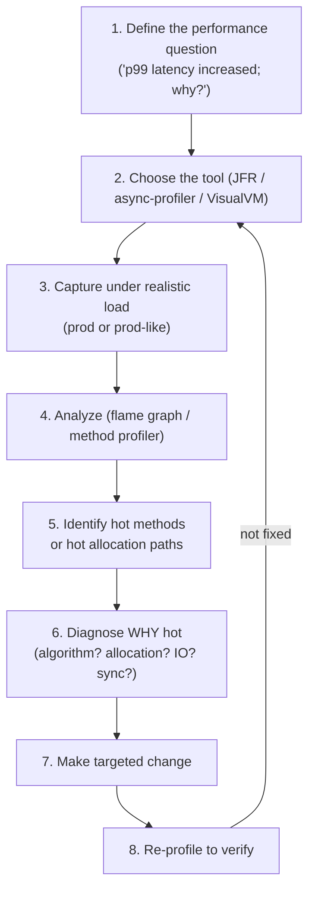
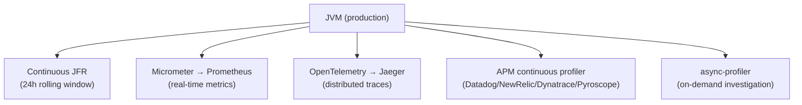
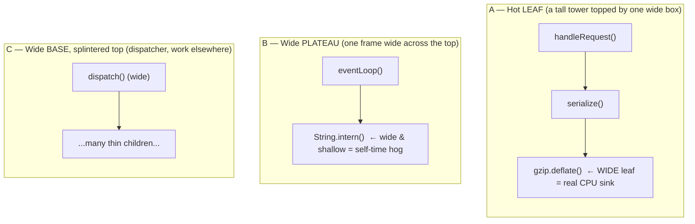
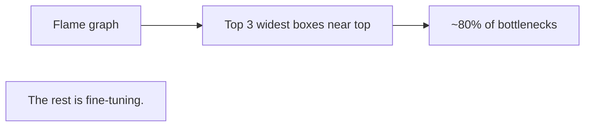

# Profiling (JFR, async-profiler, VisualVM)

T10 covered *memory* diagnosis. This topic covers *CPU* diagnosis: where time is spent in the running JVM, which methods are hot, where allocations happen, where threads block. Profiling is the bridge from "the service is slow" to "we know exactly what to fix." In 2026 the two essential profilers are **JFR (Java Flight Recorder)** — built into the JDK, ~1-3% overhead, the production-default choice — and **async-profiler** — external tool with **flame graphs** as its specialty, no safepoint bias, the modern alternative for the cases JFR's safepoint sampling misses.

The depth-bar requirement isn't "use JFR." At the **methodology** layer, profiling follows a disciplined workflow — define the performance question, choose the right tool, capture under realistic load, analyze, identify the hot path, make a targeted change, re-profile to verify — and most profiling failures are violations of this discipline (capturing dev workload, optimizing the cold path, reading absolute numbers instead of relative). At the **tooling** layer, **JFR** is the *production default* (always-on continuous recording is feasible at 1-3% overhead), records ~140 event types covering CPU samples / allocation / GC / lock contention / I/O / thread states / JIT / exceptions, and is analyzed in **JMC (JDK Mission Control)** — but suffers a **safepoint bias** that under-samples tight loops and long native calls. **async-profiler** complements JFR by sampling via Linux perf events (no safepoint bias) and producing **flame graphs** that visualize sampling data as wide-box-near-top = hot self-time. At the **interpretation** layer, **flame graphs** (Brendan Gregg, 2011) are the canonical visualization — X-axis aggregated samples (*not* time), Y-axis call depth, width = relative sampling count; reading them is its own learnable skill. At the **profile-type** layer, **CPU profiling** (time on-CPU) is different from **wall-clock profiling** (time on-CPU + blocked time), which is critical for I/O-heavy services where blocked time dominates; **allocation profiling** finds GC-pressure sources; **lock contention profiling** finds synchronization bottlenecks. We will cover all four layers, with practical examples for the canonical performance patterns (logging hot path, reflection in tight loops, autoboxing) and a production observability stack (continuous JFR + on-demand async-profiler + Prometheus + OpenTelemetry traces + APM continuous-profiling backends).

> [!NOTE]
> Prerequisites: [Memory leaks & heap dump analysis](./T10-memory-leaks-and-heap-dump-analysis.md) (L3/C02/T10) — the parallel topic for memory diagnosis; [GC tuning & monitoring](./T09-gc-tuning-and-monitoring.md) (L3/C02/T09) — GC events overlap with profiling data; [JIT compilation](./T04-jit-compilation-c1-c2-tiered.md) (L3/C02/T04) — JIT events visible in JFR; [JVM architecture](./T01-jvm-architecture-and-runtime-data-areas.md) (L3/C02/T01) — runtime areas profilers observe.

## What Profiling Is

**Profiling** is measuring where time and resources are spent in a running program. Two main approaches:

| Approach | How it works | Overhead | Accuracy |
|----------|--------------|----------|----------|
| **Sampling** | Periodically snapshot the call stack | Low (~1-5%) | Statistically valid; misses brief events |
| **Instrumentation** | Insert measurement code into every method | High (10-50%+) | Precise; biases results |

Production profiling almost always uses sampling. Modern Java tools (JFR, async-profiler) are sampling profilers; legacy ones (older VisualVM CPU profiling) used instrumentation.

The basic logic: "if 30% of stack-trace samples show `method X`, then X took ~30% of CPU time." Over enough samples, this converges to a useful approximation.

## The Systematic Profiling Workflow



The rules:

- **Always have a performance question.** "Profile this app" with no goal yields noise.
- **Capture realistic load.** Dev workloads don't match production hot paths.
- **Look at relative cost, not absolute.** "30% of time in X" matters; "X took 100 ms" depends on the load.
- **Verify the fix.** Most "improvements" are noise.

## JFR (Java Flight Recorder) — the Production Default

JFR is built into the JDK since JDK 11 (and Oracle JDK 7+). It's the *production-grade* profiler:

- **~1-3% overhead** with `profile` settings.
- **Continuous recording** with rolling window — always-on.
- **~140 event types** covering nearly every JVM subsystem.
- **No special permissions** needed in modern JDKs.

### Starting JFR

**Continuous recording with rolling window** (the production default):

```bash
java -XX:StartFlightRecording=disk=true,maxage=24h,maxsize=200m,filename=/tmp/jfr ...
```

Captures the last 24 hours into a 200 MB rotating file. When something goes wrong, the data is already there.

**On-demand for a specific window**:

```bash
jcmd <pid> JFR.start duration=60s settings=profile filename=/tmp/spike.jfr
# ... reproduce the issue ...
jcmd <pid> JFR.dump filename=/tmp/snapshot.jfr   # also works without duration
```

**Stop and dump**:

```bash
jcmd <pid> JFR.dump filename=/tmp/now.jfr
jcmd <pid> JFR.stop
```

### JFR settings

Two built-in configurations:

- **`default`**: ~1% overhead. Excludes some heavy events (e.g., allocation sampling). Good for always-on.
- **`profile`**: ~2-3% overhead. Includes allocation, lock contention, more detail. Good for diagnosis.

```bash
jcmd <pid> JFR.start duration=60s settings=profile filename=/tmp/p.jfr
```

Custom `.jfc` files let you enable specific events:

```bash
jcmd <pid> JFR.start settings=custom.jfc filename=/tmp/c.jfr
```

### JFR event types (sample)

| Event | Records |
|-------|---------|
| `jdk.CPULoad` | system + process CPU |
| `jdk.ThreadCPULoad` | per-thread CPU |
| `jdk.ExecutionSample` | sampled stack traces (the CPU profile) |
| `jdk.ObjectAllocationInNewTLAB` | TLAB allocation sample |
| `jdk.ObjectAllocationOutsideTLAB` | slow-path allocation sample |
| `jdk.GarbageCollection` | every GC |
| `jdk.GCPhasePause` | STW phase pause |
| `jdk.JavaMonitorEnter` | monitor contention |
| `jdk.JavaMonitorWait` | wait() blocking |
| `jdk.ThreadPark` | LockSupport.park blocking |
| `jdk.FileRead` / `jdk.FileWrite` | file I/O |
| `jdk.SocketRead` / `jdk.SocketWrite` | network I/O |
| `jdk.ThreadStart` / `jdk.ThreadEnd` | thread lifecycle |
| `jdk.JITCompilation` | every method compiled |
| `jdk.MethodSample` | method-level sampling |
| `jdk.VirtualThreadStart` / `jdk.VirtualThreadPinned` | virtual thread lifecycle (T14 from C01) |
| `jdk.JavaErrorThrow` / `jdk.JavaExceptionThrow` | exceptions thrown |

Per-event filtering, sampling rates, and stack-trace depth are configurable.

### Analyzing JFR with JDK Mission Control (JMC)

JMC is the GUI for JFR files. Download from https://www.oracle.com/java/technologies/jdk-mission-control.html (Adoptium has builds too).

Key views:

- **Method Profiling**: hot methods by sample count. Self-time vs total-time. Drill into call tree.
- **Hot Threads**: which threads use most CPU.
- **Allocation Profiling**: where allocations happen (by class, by stack).
- **Memory**: heap usage, GC pauses over time.
- **Lock Contention**: which monitors are contended.
- **Outliers**: long method invocations, slow disk reads, etc.

### JFR's safepoint bias

JFR samples at JVM safepoints (T07 — safepoint polls inserted by JIT). This means:

- **Methods called from a safepoint** (most code) are accurately sampled.
- **Methods between safepoints** (tight loops without poll insertion, long native calls) are *under-sampled*.

JFR's profile is biased toward "where the JIT was happy to put a poll." It misses:

- Tight numeric loops with `-XX:-EliminateBackedgeInTracedLoop` not generating polls.
- Long JNI calls (no safepoints inside native code).
- Synthetic methods, lambdas, certain compiler-generated frames.

The fix: **async-profiler**.

## async-profiler — No Safepoint Bias

[async-profiler](https://github.com/async-profiler/async-profiler) (Andrei Pangin et al.) is the modern alternative to JFR for low-bias CPU profiling. Uses Linux `perf_event_open` (or `AsyncGetCallTrace` on other platforms) — sampling at the OS level, *not* at JVM safepoints.

```bash
# Download from GitHub releases
# Unpack into /opt/async-profiler

# CPU profile, 60 seconds, flame graph output:
/opt/async-profiler/profiler.sh -d 60 -f /tmp/cpu.html <pid>

# Allocation profile:
/opt/async-profiler/profiler.sh -e alloc -d 60 -f /tmp/alloc.html <pid>

# Wall-clock profile (CPU + blocked time):
/opt/async-profiler/profiler.sh -e wall -d 60 -f /tmp/wall.html <pid>

# Lock profile (Java monitor contention):
/opt/async-profiler/profiler.sh -e lock -d 60 -f /tmp/lock.html <pid>
```

### async-profiler vs JFR

| Aspect | JFR | async-profiler |
|--------|-----|----------------|
| **Safepoint bias** | Yes | **No** |
| **Overhead** | 1-3% | < 1% |
| **Default** | Yes (built-in) | Requires install |
| **Output** | Binary .jfr file | Flame graph HTML, .jfr, others |
| **Event variety** | ~140 types | CPU, alloc, wall, lock, perf events |
| **Production-safe** | Yes | Yes |
| **Continuous recording** | Yes | Not its strength |
| **Visualization** | JMC (full-featured) | Flame graphs (focused) |

The 2026 stack: **continuous JFR for everything; on-demand async-profiler for accurate flame graphs**. They complement each other.

## Flame Graphs — Reading and Interpretation

Invented by [Brendan Gregg](https://www.brendangregg.com/flamegraphs.html) (2011). The canonical visualization for sampling profiler data.

```text
       width = % of samples (NOT time)
   ┌──────────────────────────────────────────────────┐
   │              Socket.read()                          │ ← top of stack (most recent call)
   ├──────────────────────────────────────────────────┤
   │           JDBC.executeQuery()                       │
   ├──────────────────────────────────────────────────┤
   │       DB.fetchUser()                                │
   ├──────────────────────────────────────────────────┤
   │   Service.handleRequest()                           │
   ├──────────────────────────────────────────────────┤
   │              main()                                  │ ← bottom (entry point)
   └──────────────────────────────────────────────────┘
```

- **X-axis**: aggregated stack-trace samples, alphabetical by frame name (NOT time).
- **Y-axis**: call depth. Caller at bottom; callee on top.
- **Box width**: percentage of total samples this frame appears in. *The wider, the hotter.*
- **Box color**: usually arbitrary (helps distinguish frames); some tools encode special info (e.g., red for inlined).

### How to read

1. **Look at the top.** The frames at the top are the *self-time* hot spots — where time was actually spent.
2. **Wide flat box near top** = lots of self-time. This is what to optimize.
3. **Narrow tall stack** = deep but rarely sampled — usually not interesting.
4. **Wide narrow stack** (wide at bottom, narrow at top) = a hot top-level method, but actual work elsewhere.

### Example flame graph reading

```text
┌────────────────────────────────────────────────────────────┐
│             Pattern.matcher()             │   String.intern() │  ← hot self-time
├────────────────────────────────────────────────────────────┤
│             String.matches()              │     Service.cache() │
├────────────────────────────────────────────────────────────┤
│                   Validator.validate()                          │
├────────────────────────────────────────────────────────────┤
│                   handler.handle()                               │
└────────────────────────────────────────────────────────────┘
```

Reading: validator.validate() is the parent, but the *hot work* is `Pattern.matcher()` — regex compilation. Likely fix: pre-compile the pattern (cache the `Pattern` instance) instead of re-compiling per request.

### Differential flame graphs

Compare two profiles (before vs after a deploy):

- **Red** boxes = grew between the two profiles (regressed).
- **Blue** boxes = shrank (improved).
- **Gray** = unchanged.

Tells you exactly what got worse (or better) between two runs.

## VisualVM — Quick Triage

[VisualVM](https://visualvm.github.io/) is the lighter alternative — separate download since JDK 9 (was bundled before). Best for quick dev-time investigations.

Features:

- CPU profiling (instrumentation-based; heavier than JFR/async-profiler).
- Memory profiling.
- Thread visualization with state colors.
- JMX MBean inspector.
- Heap dump capture and basic analysis.
- Plugins (Visual GC, MBeans extensions, etc.).

When to use:

- Dev-time debugging.
- Quick checks of a running JVM ("what's it doing right now?").
- JMX inspection.

When NOT to use:

- Production CPU profiling (heavier than JFR/async-profiler).
- Heap dump analysis at scale (use Eclipse MAT, T10).

## Other Tools

### JProfiler / YourKit (commercial)

Rich UIs, real-time JDBC query profiling, distributed tracing integration. Enterprise teams often deploy them. Expensive licenses; powerful features.

### honest-profiler

Historical low-overhead sampling profiler. Largely superseded by async-profiler. Mentioned for completeness.

### Linux `perf`

Kernel-level profiler — useful with `--frame-pointer` for native code. For Java code, use async-profiler (which uses `perf` internally on Linux but adds Java symbol resolution).

## Profile Types — CPU vs Wall vs Allocation vs Lock

Different questions need different profiles:

### CPU profile

Samples when threads are **on-CPU**. Best for CPU-bound workloads (computation, parsing, encryption).

```bash
asprofiler.sh -e cpu -d 60 -f /tmp/cpu.html <pid>
```

### Wall-clock profile

Samples regardless of thread state (on-CPU or blocked). **Critical for I/O-heavy services** where most time is spent blocked.

```bash
asprofiler.sh -e wall -d 60 -f /tmp/wall.html <pid>
```

For a service whose p99 is 500 ms and CPU is at 5%, **the CPU profile shows almost nothing useful** — most time isn't on CPU. The wall-clock profile shows where the time actually went (waiting on DB, network, lock).

### Allocation profile

Samples allocations. Shows where GC pressure comes from.

```bash
asprofiler.sh -e alloc -d 60 -f /tmp/alloc.html <pid>
# Or JFR: jdk.ObjectAllocationInNewTLAB / jdk.ObjectAllocationOutsideTLAB
```

Useful when GC pauses are too frequent or too long — reducing allocation reduces GC work.

### Lock contention profile

Samples threads blocked on monitor enter or LockSupport.park.

```bash
asprofiler.sh -e lock -d 60 -f /tmp/lock.html <pid>
# Or JFR: jdk.JavaMonitorEnter / jdk.ThreadPark
```

Reveals synchronization bottlenecks — the canonical fix is reducing critical-section duration or switching to lock-free structures.

## Common Performance Patterns Found via Profiling

### Logging in hot path with non-parameterized strings

```java
// ✗ Always formats the string, even at INFO level when DEBUG is disabled:
logger.debug("processing " + request.toString() + " with config " + config);

// ✓ Parameterized — string only built if DEBUG is enabled:
logger.debug("processing {} with config {}", request, config);
```

Visible as `String.concat`/`StringBuilder.append` high in CPU profile.

### Reflection in tight loops

```java
// ✗ Reflective lookup every iteration:
for (var x : items) {
    Method m = x.getClass().getMethod("process");
    m.invoke(x);
}

// ✓ Cache the Method:
Method m = Item.class.getMethod("process");
for (var x : items) m.invoke(x);
```

Or better: use a proper interface instead of reflection.

### Pre-JDK-9 StringBuilder churn

```java
// ✗ Pre-JDK-9 — StringBuilder per iteration:
for (var x : items) {
    String s = "prefix" + x + "suffix";   // StringBuilder churn
    process(s);
}
```

JDK 9+ uses invokedynamic (T03) and is usually fine. Profile to confirm.

### LinkedList.get(i) — O(n)

```java
List<X> list = new LinkedList<>();
for (int i = 0; i < list.size(); i++) {
    process(list.get(i));   // ✗ O(n^2) — get(i) walks the list
}
```

Fix: ArrayList (O(1) indexed access), or use iterator/for-each.

### JDBC ResultSet metadata lookup per row

```java
while (rs.next()) {
    int id = rs.getInt(rs.findColumn("id"));   // ✗ string lookup per row
    String name = rs.getString(rs.findColumn("name"));
}

// ✓ Cache the column indices once:
int idCol = rs.findColumn("id");
int nameCol = rs.findColumn("name");
while (rs.next()) {
    int id = rs.getInt(idCol);
    String name = rs.getString(nameCol);
}
```

### JSON serialization reflection

```java
// ✗ ObjectMapper created per request (re-discovers all classes):
String json = new ObjectMapper().writeValueAsString(obj);

// ✓ Shared, immutable, thread-safe:
private static final ObjectMapper MAPPER = new ObjectMapper();
String json = MAPPER.writeValueAsString(obj);
```

### Autoboxing in loops

```java
// ✗ Autoboxes every iteration:
Map<Integer, Integer> map = new HashMap<>();
for (int i = 0; i < 1_000_000; i++) {
    map.merge(i, 1, Integer::sum);   // Integer.valueOf(i) per call
}

// ✓ Primitive map (Eclipse Collections, fastutil):
IntIntHashMap map = new IntIntHashMap();
for (int i = 0; i < 1_000_000; i++) {
    map.addToValue(i, 1);
}
```

Eclipse Collections, fastutil, HPPC offer primitive-typed collections with massive allocation reductions.

## Container Profiling

Profilers work in containers, but with some setup:

```bash
# JFR — output to a volume:
kubectl exec <pod> -- jcmd 1 JFR.start duration=60s filename=/tmp/p.jfr
kubectl cp <pod>:/tmp/p.jfr ./local.jfr

# async-profiler — needs to be present in container:
# Either bake into the image, or use a side-car
kubectl exec <pod> -- /opt/async-profiler/profiler.sh -d 60 -f /tmp/cpu.html 1
```

For Kubernetes, side-car patterns (e.g., Pyroscope agent) handle continuous profiling without code changes.

## Production Observability Stack

A complete observability stack combines:



Each stream answers a different question:

- **JFR**: deep JVM internals (always-on, post-mortem).
- **Prometheus**: real-time alerts and dashboards.
- **OpenTelemetry traces**: per-request flow across services.
- **APM continuous profiler**: aggregated flame graphs across the fleet.
- **async-profiler**: precise on-demand investigation.

## APM Integration

Continuous profiling has become a feature of every major APM platform:

- **Datadog Continuous Profiler** — Java agent, aggregates flame graphs.
- **New Relic / AppDynamics / Dynatrace** — similar offerings.
- **Pyroscope** (now Grafana Pyroscope) — open-source continuous profiling, integrates with Grafana.
- **Sentry Profiling** — focused on slow request investigation.

All use sampling underneath (often async-profiler or similar). The differentiator is the *aggregation* — viewing flame graphs across services, deploys, and instances.

## async-profiler — How It Actually Works (Deep Dive)

The sections above introduced async-profiler as "the no-safepoint-bias alternative." Now we go under the hood: *why* it has no safepoint bias, *how* it captures Java stacks from an arbitrary point in time, and the full menu of profiling modes with the exact commands a 2026 engineer types.

### The Two Engines: `perf_events` + `AsyncGetCallTrace`

async-profiler is really two cooperating mechanisms stitched together:

1. **The trigger (when to sample).** On Linux, async-profiler asks the kernel's **`perf_events`** subsystem (via the `perf_event_open(2)` syscall) to deliver a signal every N CPU cycles (or N nanoseconds of wall time, or every M bytes allocated — depending on mode). Because the *kernel* decides when to interrupt the thread, the sample can land **anywhere** — inside a tight loop, in JIT-compiled code with no safepoint poll, mid-way through a method. This is the crucial difference from JFR's `jdk.ExecutionSample`, which can only capture a stack when a thread voluntarily reaches a **safepoint**.
2. **The capture (what the stack is).** When the signal handler fires, async-profiler calls **`AsyncGetCallTrace`** — an undocumented but stable HotSpot internal function (the "Async" in the name) that walks the Java stack of the *currently interrupted* thread without requiring it to be at a safepoint. `AsyncGetCallTrace` is signal-async-safe: it can run inside a signal handler. It returns the JVM-level Java frames; async-profiler then stitches them together with native frames (resolved via the frame pointer or DWARF unwinding) to produce a **mixed-mode** stack — Java + JNI + kernel — in one trace.

```text
  perf_events timer fires  ───►  SIGPROF delivered to a running thread
            (kernel decides the instant — no safepoint needed)
                                          │
                                          ▼
                          async-profiler signal handler
                                          │
                    ┌─────────────────────┴─────────────────────┐
                    ▼                                             ▼
        AsyncGetCallTrace (Java frames)            frame-pointer / DWARF unwind
        — walks the interpreter & JIT               (native libs, kernel,
          stack of the interrupted thread)            JNI, malloc, syscalls)
                    └─────────────────────┬─────────────────────┘
                                          ▼
                         one mixed-mode stack trace (Java + native)
                                          │
                                          ▼
                       aggregated into the flame graph / .jfr / collapsed file
```

### Why This Beats the Safepoint-Bias Problem

Recall the safepoint-bias problem (covered above for JFR, and again here from the *sampler* angle): a safepoint-based sampler can only photograph a thread when that thread parks at a poll point. The JIT inserts polls at method entry/exit and (sometimes) loop back-edges — but a hot, fully-inlined numeric loop may run for microseconds with **no poll inside it**. A safepoint sampler asked to take a snapshot during that loop must *wait* until the thread leaves the loop, then records the stack at the next poll — systematically attributing the loop's time to whatever method comes after it. The classic symptom: a profiler that swears the hot method is some innocent caller, while the real CPU burner (the inlined loop) is invisible.

Older VisualVM CPU sampling and many legacy commercial samplers were safepoint-based and suffered exactly this. async-profiler sidesteps it entirely because the kernel interrupts the thread *in place* — the snapshot is of wherever the program counter genuinely was. This is the single biggest reason to reach for async-profiler when a JFR flame graph "smells wrong."

> [!NOTE]
> There is a related but distinct metric called **time-to-safepoint (TTSP)** — how long it takes *all* threads to reach a safepoint once one is requested (e.g. for a GC or a `jstack`). A thread stuck in a long counted loop or a slow JNI call inflates TTSP and can stall the whole VM. JFR's safepoint *bias* (a sampling-accuracy problem) and TTSP (a pause-latency problem) share the same root cause — poll placement — but are different concerns. async-profiler can help diagnose long-TTSP culprits because it *can* sample inside the offending loop.

### The Profiling Modes — and When Each One Earns Its Keep

async-profiler is not "a CPU profiler." It is a sampler with interchangeable **events**. The `-e <event>` flag selects what the kernel counts down to before firing the sampling signal. Choosing the wrong event is the most common reason a profile "shows nothing" — the deeper sections below pair each mode with the question it answers.

| Mode (`-e`) | Samples when… | The question it answers | Reach for it when |
|-------------|---------------|-------------------------|-------------------|
| `cpu` | a thread is burning a CPU (HW perf counter) | "What is consuming CPU cycles?" | CPU is pegged; throughput-bound compute |
| `itimer` | wall-clock timer fires (CPU-time, no `perf`) | same as `cpu`, fallback where `perf_events` is unavailable (locked-down containers, macOS) | `perf_event_open` denied (`perf_event_paranoid`), no `CAP_PERFMON` |
| `wall` | every thread, on-CPU **or blocked** | "Where is *wall-clock* latency going, including waiting?" | I/O-bound service; p99 high but CPU low |
| `alloc` | the JVM allocates ~N bytes (TLAB-driven) | "What is creating GC pressure / allocating the most?" | frequent GC, allocation-rate alarms |
| `lock` | a thread blocks on a monitor / `ReentrantLock` | "Which lock is contended, and who waits on it?" | high context-switch rate; sync bottleneck suspected |
| `cache-misses`, `branch-misses`, `LLC-load-misses`, … | the named HW perf counter overflows | "Is this loop memory-bound? branch-mispredicting?" | micro-arch tuning of a known hot kernel |

Some real invocations beyond the basics already shown:

```bash
# CPU profile, sample every 1 ms of CPU time (-i = sampling interval):
asprof -e cpu -i 1ms -d 30 -f /tmp/cpu.html <pid>

# Allocation profile — sample every 512 KB allocated; flame graph by allocated bytes:
asprof -e alloc --alloc 512k -d 60 -f /tmp/alloc.html <pid>

# Wall-clock profile of ONLY the request-handler threads (filter by name):
asprof -e wall -t -d 60 -f /tmp/wall.html <pid>   # -t = split by thread

# Lock/monitor contention, ignoring locks held < 250 us (--lock threshold):
asprof -e lock --lock 250us -d 60 -f /tmp/lock.html <pid>

# Hardware cache-miss profile of a memory-bound kernel:
asprof -e cache-misses -d 30 -f /tmp/cache.html <pid>
```

> The modern launcher is `asprof` (renamed from `profiler.sh` in async-profiler 3.0, 2023). Older docs and the examples earlier in this topic use `profiler.sh`/`asprofiler.sh`; the flags are the same. There is also **`ap-loader`** — a single fat-jar that bundles native libraries for every platform, handy in CI and containers where you can't pre-install binaries.

### Agent-at-Launch vs Attach-to-Live-PID

There are two fundamentally different ways to get async-profiler into a JVM, and the choice has real consequences:

**1. Attach to a live PID (the common case).** The `asprof` launcher uses the JVM's **dynamic attach** mechanism (the same channel `jcmd` uses) to inject `libasyncProfiler.so` into an already-running process. Zero restart, zero config — perfect for "production is slow *right now*."

```bash
# Attach, profile 30s, detach automatically:
asprof -d 30 -f /tmp/now.html 12345
```

**2. Load as a `-agentpath` at JVM launch.** Start the profiler with the process so you capture **startup and warm-up** — the JIT compiling, classes loading, the first requests — which an attach-later approach misses entirely.

```bash
java -agentpath:/opt/async-profiler/lib/libasyncProfiler.so=start,event=cpu,file=/tmp/startup.jfr,jfr \
     -jar app.jar
```

When to pick which:
- **Attach** for incident response, ad-hoc investigation, and when you cannot (or don't want to) restart the process.
- **Agent-at-launch** for benchmarking cold-start, GraalVM-vs-JIT warm-up comparisons (see L3/C02/T05), and CI performance gates where you control the launch.

> [!NOTE]
> On Linux, attach mode needs the kernel to allow `perf_events`: check `/proc/sys/kernel/perf_event_paranoid` (a value of `1` or lower, or granting `CAP_PERFMON`/`CAP_SYS_ADMIN`, lets async-profiler use hardware CPU counters). In a restricted container where that's denied, async-profiler automatically falls back to `itimer` mode — still useful, just without hardware-counter precision. This is the single most common "why is my container CPU profile empty?" gotcha.

### Output Formats — Flame Graph, JFR, or Collapsed

The `-o` / `-f` flags pick the output. The same captured samples can be rendered three ways:

| Format | Flag | What it is | Use it to… |
|--------|------|------------|-----------|
| **Flame graph** | `-f out.html` | self-contained interactive HTML (zoom, search, click) | eyeball the hot path in a browser, share with the team |
| **JFR** | `-f out.jfr -o jfr` | a real `.jfr` file async-profiler wrote itself | open in **JMC** alongside JFR's own recordings; merge both tools' data |
| **Collapsed** | `-f out.txt -o collapsed` | one folded stack per line + a count | feed to Brendan Gregg's `flamegraph.pl`, build **differential** graphs, or post-process with scripts |

```bash
# Capture once as collapsed stacks, render a flame graph from them later:
asprof -e cpu -d 30 -o collapsed -f /tmp/prof.txt <pid>
flamegraph.pl /tmp/prof.txt > /tmp/prof.svg     # Brendan Gregg's script
```

That async-profiler can emit `.jfr` is the quiet superpower of the 2026 stack: you can run a low-bias async-profiler capture and then analyze it in **JMC** with the same rich tooling you'd use for a native JFR recording — getting JFR's analysis UI *and* async-profiler's sampling accuracy at once.

## Reading a Flame Graph — The Full Method

The earlier "Flame Graphs — Reading and Interpretation" section gave the rules. This section turns those rules into a *diagnostic procedure* and clears up the visual conventions that trip people up.

### The One-Sentence Mental Model

> A flame graph is a heat map of where your program spent its day. The **widest bars are where the hours went.** You don't read it left-to-right like a timeline — you scan for *width*, then climb to the *top* of the widest tower to find the method actually doing the work.

### x-axis is Samples, Not Time — Internalize This

This is the single most misread property, so it's worth restating with teeth: **the horizontal position of a box means nothing.** Frames are sorted alphabetically and merged, *not* laid out in execution order. A box on the far left did not run "before" a box on the right. Width is the *only* horizontal signal — it is the fraction of collected samples in which that exact frame appeared on the stack. If `parseJson()` is 40% of the width, ~40% of your samples caught a thread somewhere inside `parseJson()` (or its callees). With enough samples, that ≈ 40% of whatever the event measures (CPU time, blocked time, allocated bytes).

### The Three Shapes You Are Hunting For



- **A — Hot leaf.** A tower whose *topmost* box is wide. That leaf is where self-time is spent. This is your prime optimization target — e.g. `gzip.deflate()` eating CPU suggests turning off compression for small payloads or caching results.
- **B — Wide plateau.** A single frame stretched wide at or near the top, with little above it. Classic self-time hog — `String.intern()`, a regex `Pattern.matcher()`, an `equals()` on a huge object. Fix the algorithm or cache the result.
- **C — Wide base, splintered top.** A wide low frame (a dispatcher, an event loop, `main`) whose children fan out into many thin slivers means the time is *spread* — no single hot spot. Don't optimize the wide base; it's just the funnel everything flows through.

### Climbing the Graph — The Procedure

1. **Zoom out, find the widest top-row regions.** Ignore everything narrower than a few percent.
2. **For each wide region, climb to its top.** The topmost wide box is the self-time culprit; everything below it is just "how we got here."
3. **Click to zoom** (the HTML graphs are interactive) into that subtree to read the now-magnified children.
4. **Use search/highlight.** Typing a class name (e.g. `GC` or `java/util/regex`) highlights every matching frame and sums their combined width across the whole graph — instantly answering "how much total time is in regex / in GC / in JSON?"
5. **Ask "why is this hot?"** — algorithmic (O(n²)?), allocation (feeding GC?), I/O (should be a wall profile?), or contention (should be a lock profile?).

### CPU vs Allocation vs Off-CPU Flame Graphs Look Different

The *shape* you should expect depends on the event — and confusing them leads to wrong conclusions:

- **CPU flame graph.** Width = CPU cycles. Dominated by compute, parsing, crypto, and — on an idle-ish but GC-churny app — by GC threads and `arraycopy`. A blocked thread contributes **nothing** here (it's off-CPU).
- **Allocation flame graph.** Width = *bytes allocated* (or allocation samples), not time. A method that allocates a giant `byte[]` once can dominate even though it costs almost no CPU. Reading it like a CPU graph ("this is slow!") is the classic mistake — it's not slow, it's *hungry*, and the cost is paid later as GC.
- **Off-CPU / wall-clock flame graph.** Width = wall time including *blocked* time. Here the wide towers are `Socket.read()`, `parkNanos`, `Object.wait()`, `Unsafe.park` — places the thread sat idle. A CPU profile of the same workload would show these as nearly nothing.

> [!IMPORTANT]
> Always label and date your flame graphs with the **event type**. A flame graph SVG with no caption is ambiguous: a wide `Socket.read()` box means "we're I/O-bound and that's expected" in a wall profile, but would be alarming (and impossible) in a CPU profile. Half of all flame-graph misreadings come from not knowing which event produced the picture.

### Flame vs Icicle (Orientation)

The orientation is purely cosmetic but the names matter in tools and docs:

- **Flame graph** — root (entry point) at the **bottom**, leaves at the **top**, growing *upward* like flames. The default; what every example above uses.
- **Icicle graph** — root at the **top**, callees hanging *downward* like icicles. JMC's "Flame View" and many APM UIs default to icicle orientation. Same data, flipped. The reading rules are identical — just remember "widest box, then travel *toward the leaves*" (up for flames, down for icicles).

### Differential Flame Graphs — Before vs After, Concretely

The earlier section noted red=grew, blue=shrank. Here's how you actually generate one and what it buys you. Because async-profiler emits **collapsed** stacks, you can diff two captures with a standard script:

```bash
# Capture baseline, deploy a change, capture again — both as collapsed stacks:
asprof -e cpu -d 60 -o collapsed -f /tmp/before.txt <pid_before>
asprof -e cpu -d 60 -o collapsed -f /tmp/after.txt  <pid_after>

# Brendan Gregg's differential script (from the FlameGraph repo):
difffolded.pl /tmp/before.txt /tmp/after.txt | flamegraph.pl > /tmp/diff.svg
```

The diff graph colors each frame by how its width *changed*: **red = wider after (regressed)**, **blue = narrower after (improved)**, gray = unchanged. This is the fastest way to answer "the p99 jumped after Tuesday's deploy — *what* got slower?" without staring at two graphs side by side. A wide red tower over `Logger.format` after a deploy that "just added some debug logging" tells the whole story in one glance.

## JFR — Deeper Than the GUI (Events, CLI, Streaming)

The earlier JFR section covered starting recordings and opening them in JMC. This section goes deeper on *what JFR records and how cheap it is*, the **command-line** analysis path (no GUI needed — ideal in a terminal-only prod box or CI), and **event streaming** for live, in-process consumption.

### Why JFR Is Nearly Free — and Always-On-able

JFR's defining trait is overhead so low that you can leave it **running continuously in production**. The reasons:

- **It is built into the VM, not bolted on.** Events are emitted from instrumentation *already present* in HotSpot (allocation hits a TLAB boundary, a GC phase ends, a monitor inflates) — JFR just records the data the VM was already producing, into a thread-local buffer with no locking on the hot path.
- **Thread-local buffers, batched to disk.** Each thread writes events to its own buffer; full buffers flush to a global buffer and then to the chunked `.jfr` file. No synchronization per event.
- **Sampling, not tracing, for the expensive stuff.** CPU stacks (`jdk.ExecutionSample`) and allocations are *sampled*, so cost scales with sample rate, not with how busy the app is.

The payoff is the production posture already shown (`maxage`/`maxsize` rolling window): when an incident hits, **the evidence is already on disk** — you `JFR.dump` the last N minutes that were being recorded all along. You don't have to reproduce the problem with a profiler attached.

### What JFR Records — Categories Worth Knowing

Beyond the event table earlier, it helps to think in *categories*, because that's how you decide what a recording can answer:

- **Execution / CPU** — `jdk.ExecutionSample`, `jdk.NativeMethodSample` (the method profile).
- **Memory / allocation** — `jdk.ObjectAllocationInNewTLAB`, `jdk.ObjectAllocationOutsideTLAB`, `jdk.ObjectAllocationSample` (JDK 16+, a unified, rate-limited allocation event), `jdk.OldObjectSample` (the **leak candidate** event — samples objects that survive, the JFR counterpart to a heap dump from L3/C02/T10).
- **GC** — `jdk.GarbageCollection`, `jdk.GCPhasePause`, `jdk.GCHeapSummary`, `jdk.G1HeapRegionTypeChange`.
- **Locks / threads** — `jdk.JavaMonitorEnter` (contention), `jdk.JavaMonitorWait`, `jdk.ThreadPark`.
- **I/O** — `jdk.SocketRead/Write`, `jdk.FileRead/Write` — each with duration, so you can find *slow* I/O, not just frequent.
- **Exceptions** — `jdk.JavaExceptionThrow`, `jdk.JavaErrorThrow` — a surprising perf sink when exceptions are used for control flow in a hot path (stack-trace fill-in is expensive).
- **Compiler** — `jdk.JITCompilation`, `jdk.Deoptimization` — deopt storms (links to JIT, L3/C02/T04) show up here.

> [!NOTE]
> The **I/O and exception** events are JFR's standout advantage over a pure CPU sampler: a slow `jdk.SocketRead` of 800 ms shows up as one heavy event with its stack, even though it spent ~0 CPU — invisible to a CPU flame graph. This is the same blind spot the wall-clock profile fixes, but JFR gives it to you for free in the always-on recording.

### Analyzing JFR from the Command Line — the `jfr` Tool

You do not need JMC. The JDK ships a **`jfr`** command-line tool (since JDK 9) that prints, summarizes, and queries a recording — perfect when you're SSH'd into a box or scripting a CI gate:

```bash
# One-line overview: which event types fired, how many, total size:
jfr summary /tmp/spike.jfr

# Print just the CPU samples (the method profile), with stack traces:
jfr print --events jdk.ExecutionSample /tmp/spike.jfr

# The most useful built-in VIEWS (JDK 17+) — pre-aggregated, like a mini-JMC in the terminal:
jfr view hot-methods        /tmp/spike.jfr   # top methods by sample count
jfr view allocation-by-site /tmp/spike.jfr   # where allocations came from
jfr view contention-by-site /tmp/spike.jfr   # lock contention hot spots
jfr view gc                 /tmp/spike.jfr   # GC pause summary
jfr view jvm-information     /tmp/spike.jfr   # flags, version, uptime

# Filter to a time window and a single thread:
jfr print --events jdk.JavaMonitorEnter \
  --stack-depth 32 /tmp/spike.jfr
```

`jfr view` (JDK 17+) is the unsung hero: it renders the same aggregations JMC shows, as text tables, in milliseconds — no GUI, no file transfer. For a quick "what's hot?" on a prod recording, it often beats opening JMC.

### JFR Event Streaming — Live Consumption (JDK 14+)

Classic JFR is **record now, analyze later** (write a file, open it in JMC). **JFR event streaming** (`jdk.management.jfr`, JEP 349, JDK 14+) flips that: your application — or an external process — subscribes to events **as they happen** and reacts in real time, with the same near-zero overhead. No file, no round trip.

In-process, with `RecordingStream`:

```java
import jdk.jfr.consumer.RecordingStream;
import java.time.Duration;

try (var rs = new RecordingStream()) {
    // React to GC pauses longer than 50 ms, live:
    rs.enable("jdk.GCPhasePause");
    rs.onEvent("jdk.GCPhasePause", event -> {
        var pause = event.getDuration();
        if (pause.toMillis() > 50) {
            metrics.recordLongGcPause(pause);          // push to Micrometer/Prometheus
            log.warn("Long GC pause: {} ms", pause.toMillis());
        }
    });

    // Sample CPU and watch allocation pressure too:
    rs.enable("jdk.ExecutionSample").withPeriod(Duration.ofMillis(10));
    rs.enable("jdk.ObjectAllocationSample");
    rs.onEvent("jdk.ObjectAllocationSample",
        e -> allocationMeter.mark(e.getLong("weight")));

    rs.startAsync();   // non-blocking; events stream on a background thread
    // ... application keeps running; handlers fire as events occur ...
}
```

Out-of-process, you can attach a `RemoteRecordingStream` over JMX to a *different* JVM and consume its events live. This is the foundation many continuous-profiling and observability agents build on: instead of polling MBeans or shelling out to `jcmd`, they subscribe to the JFR stream and forward events to a backend. It turns JFR from a black-box flight recorder into a real-time telemetry source — bridging the always-on JFR recording and the Prometheus/OpenTelemetry streams in the observability-stack diagram earlier.

## Real-World Scenario — The Profile That Lied (Until We Changed the Event)

A relatable story that ties the deep dives together.

A team owns an order-confirmation service. Alert: **p99 latency = 1.4 s**, SLO is 300 ms. The on-call engineer attaches async-profiler in CPU mode — the obvious first move:

```bash
asprof -e cpu -d 60 -f /tmp/cpu.html 4711
```

The CPU flame graph is **boring**: ~85% of it is GC threads and the JVM's own idle loop. Total app CPU is 6%. By the "widest box" rule there's nothing to fix — the service is barely using the CPU. A junior profiler concludes "the box isn't the bottleneck, we need a bigger instance" and almost files a scale-up ticket.

The senior engineer recognizes the tell: **high latency + low CPU = the time is being spent off-CPU, waiting.** A CPU profiler is structurally blind to waiting — a blocked thread contributes zero CPU samples. So they switch the *event*, not the tool:

```bash
asprof -e wall -t -d 60 -f /tmp/wall.html 4711
```

Now the wall-clock flame graph tells the truth: a **wide tower under `HttpClient.send → Socket.read`**, ~70% of wall time, all of it in the call to a downstream `inventory-service`. The order service wasn't slow — it was *blocked* on a slow dependency, holding a request thread idle for over a second per call. The CPU profile literally could not show this; the wall-clock profile made it the widest bar on the page.

The fix had nothing to do with CPU: add a timeout + circuit breaker on the inventory call, and parallelize two independent downstream calls that were running sequentially. p99 dropped to 240 ms. The JFR continuous recording, queried after the fact with `jfr view`, corroborated it — wide `jdk.SocketRead` events with 900 ms durations pointing at the same downstream:

```bash
jfr print --events jdk.SocketRead --stack-depth 16 /var/jfr/last.jfr | head -40
```

The lesson, and the through-line of this whole topic: **match the profile event to the question.** The same tool, the same PID, the same 60 seconds — but the CPU event hid the problem and the wall event revealed it. Reaching for "a bigger instance" because the CPU profile looked empty would have burned money and fixed nothing.

> [!INTERVIEW]
> **Q: "Your service has p99 of 1.5 s but CPU sits at 5%. You take a CPU flame graph and it shows almost nothing but GC. What's going on and what do you do next?"**
>
> Strong answer hits four beats: **(1) Diagnose the mismatch** — high latency with low CPU means time is spent *off-CPU* (blocked on I/O, locks, or downstream calls); a CPU profiler is structurally blind to waiting because a blocked thread emits no CPU samples. **(2) Switch the event, not the tool** — capture a **wall-clock** profile (`asprof -e wall`) so blocked time counts; the wide towers will be `Socket.read`/`parkNanos`/`Object.wait`. **(3) Corroborate with JFR** — the always-on recording's `jdk.SocketRead`/`jdk.JavaMonitorEnter` events carry durations, so `jfr view contention-by-site` or filtering slow socket reads confirms the culprit without re-running anything. **(4) Note the safepoint angle** — if you *were* CPU-bound and a JFR flame graph looked wrong (hot time on an innocent caller), suspect **safepoint bias** and re-profile with async-profiler, which samples via `perf_events` + `AsyncGetCallTrace` and lands inside poll-free loops. Bonus credit: mention that "scale up the instance" is the trap answer — more CPU does nothing for a thread blocked on a slow dependency.

## Safe Production Profiling

A consolidated note on profiling *in production* without becoming the incident:

- **Lead with the always-on recording.** Continuous JFR at `default` settings (~1% overhead, rolling `maxage`/`maxsize` window) should already be running on every prod JVM. Most investigations start by *dumping what's already there* — no attach, no risk.
- **async-profiler is production-safe too.** Sub-1% overhead, attach-and-detach in seconds, no restart. The main caveat is the `perf_event_paranoid`/`CAP_PERFMON` permission in containers — if denied, it falls back to `itimer` (still safe, slightly less precise).
- **Prefer `default` over `profile` JFR settings under heavy load.** The `profile` config adds allocation and contention sampling (~2-3%); fine for a bounded 60 s capture, but `default` is the right always-on baseline.
- **Bound your captures.** Use `-d <seconds>` (async-profiler) and `duration=` (JFR) so a profiler can never run away if you forget to stop it.
- **Aggregate across the fleet with continuous-profiling backends** rather than profiling instances by hand — see the APM Integration and Production Observability Stack sections above (Grafana **Pyroscope**, Datadog/New Relic/Dynatrace continuous profilers). These run a low-overhead agent (often async-profiler under the hood, frequently consuming the **JFR event stream** from the previous section) and give you fleet-wide, deploy-over-deploy flame graphs — the production-scale generalization of the differential flame graph.
- **eBPF-based profilers** (e.g. Parca, Grafana Beyla, Pyroscope's eBPF mode) profile from *outside* the JVM at the kernel level, with no agent inside the process at all — useful for whole-host, mixed-language profiling. For deep JVM-internal questions, in-JVM JFR/async-profiler still see more (Java frames, allocation sites, lock identities). A blended host-eBPF + in-JVM-JFR setup is increasingly the 2026 default. (See also the JVM performance lab in L3/C05/T01 for a hands-on harness.)

## Profiling Pitfalls

### Profiling in dev with synthetic load

Dev workloads rarely match prod hot paths. Profile in prod (or production-equivalent) or accept noisy results.

### Reading absolute numbers vs relative

"This method took 100 ms" — meaningless without context. "30% of profile time" — actionable.

### Optimizing the cold path

A method that takes 1% of CPU isn't where to invest tuning time. Focus on the top 3 widest boxes.

### Not running long enough

Transient spikes don't show in a 10-second profile. Capture for at least minutes; ideally tens of minutes to hours for slow regressions.

### Safepoint bias (JFR)

Discussed above. Use async-profiler when you suspect JFR is missing data — typically tight loops, native code-heavy paths.

### Reading the wrong profile type

A wall-clock profile of an I/O-bound service is dominated by `Socket.read()` — useful. A CPU profile of the same is dominated by GC (because that's all that's on-CPU). Match the profile type to the question.

## The 80/20 of Profiling



In practice: glance at the flame graph; the top 3 widest top-boxes usually point to the issue. Drill into "why is this hot?" Don't get distracted by deeper micro-optimizations.

## When to (and Not to) Profile

### When to profile

- p99 latency increased.
- Throughput dropped.
- CPU utilization unexpectedly high.
- Suspect inefficient algorithm.
- Before claiming "we need more cores."

### When NOT to profile

- App already meets requirements.
- Symptoms unrelated to JVM (network, DB latency, downstream services).
- No baseline.
- Without a specific hypothesis.

## Common Mistakes

### Profile in production without continuous recording enabled

You can't profile an issue that already happened. Enable continuous JFR.

### Read flame graphs without zooming

The full graph is overwhelming; zoom into the hot region.

### Mix CPU and wall-clock profiles

They answer different questions. Be deliberate.

### Optimize without baseline

You can't say "30% faster" without a baseline.

### Ignore allocation profiling

Hot allocation paths = GC pressure source. Reducing allocations often helps more than optimizing CPU code.

### Trust dev profiles in prod

The JIT, GC, and workload differ. Profile prod.

## Practice

1. **Continuous JFR setup.** Enable rolling-window continuous recording on a service. After a load test, dump and open in JMC.
2. **JFR method profile.** Identify the top 5 CPU-consuming methods in JMC. Drill into the call tree.
3. **async-profiler CPU flame graph.** Profile a Spring Boot app for 60s. Open the flame graph HTML. Identify hot self-time methods.
4. **JFR vs async-profiler comparison.** Profile the same workload with both. Look for differences (safepoint bias).
5. **Wall-clock vs CPU profile.** Profile an I/O-bound service both ways. Compare what's hot.
6. **Allocation profile.** Profile an allocation-heavy app; identify the top allocation sites; fix one; re-profile.
7. **Lock contention profile.** Build a contended-lock benchmark. Profile with `-e lock`. Identify the contention.
8. **Differential flame graph.** Profile before and after a code change. Generate diff flame graph.
9. **Common pattern: logging hot path.** Build a service with non-parameterized `logger.debug` in a hot loop. Profile; identify; fix with parameterized; re-profile.
10. **Common pattern: reflection in loop.** Same workflow.
11. **Container profiling.** Run a JVM in Docker; capture JFR via `docker exec jcmd`.
12. **APM continuous profiler.** Set up Pyroscope (open-source); view aggregated flame graphs across a workload.
13. **Provoke safepoint bias.** Write a tight `long`-counted numeric loop (sum of a large `double[]`) with no method calls inside. Profile with JFR (`settings=profile`) and with async-profiler CPU mode. Compare: JFR likely attributes the time to the caller; async-profiler lands inside the loop. Confirm by toggling `-XX:+UseCountedLoopSafepoints` and re-profiling.
14. **Same capture, three formats.** Run `asprof -e cpu -d 30` against a Spring Boot app once each as `-f out.html`, `-o jfr -f out.jfr`, and `-o collapsed -f out.txt`. Open the `.jfr` in JMC; render the collapsed file with `flamegraph.pl`. Verify all three describe the same hot path.
15. **Agent-at-launch vs attach.** Profile a cold JVM start with `-agentpath:libasyncProfiler.so=start,event=cpu,...`; separately attach to the same app *after* warm-up. Compare flame graphs — find the warm-up-only frames (class loading, C2 compilation) that the attach-later run misses.
16. **`jfr` CLI, no GUI.** Take a `.jfr` recording and, without opening JMC, run `jfr summary`, `jfr view hot-methods`, `jfr view allocation-by-site`, and `jfr view contention-by-site`. Then `jfr print --events jdk.SocketRead` to find slow I/O.
17. **JFR event streaming.** Write a small `RecordingStream` program that subscribes to `jdk.GCPhasePause` and `jdk.ObjectAllocationSample` and logs/exports any GC pause over 50 ms live (no file). Run it against an allocation-heavy workload.
18. **The wall-vs-CPU diagnosis drill.** Build a service that calls a deliberately slow downstream (sleep 1 s). Profile in CPU mode (should look empty) then wall mode (should show the blocking `Socket.read`/`sleep` tower). Reproduce the "profile that lied" scenario end to end.
19. **Differential flame graph for real.** Capture collapsed stacks before and after adding non-parameterized `logger.debug` to a hot loop; run `difffolded.pl before.txt after.txt | flamegraph.pl` and confirm the regressed (red) `Logger.format`/`StringBuilder` tower.
20. **Container permission gotcha.** Run async-profiler inside a restricted container with `perf_event_paranoid=3`; observe the empty/failed `perf` profile, then confirm `itimer` fallback (or grant `CAP_PERFMON`) produces a usable CPU profile.

## Recap

You should now be able to:

- Distinguish **sampling** (low overhead, statistical) from **instrumentation** (high overhead, precise); modern Java profiling is sampling-based.
- Apply the **systematic profiling workflow**: define question → choose tool → capture realistic load → analyze → identify hot path → diagnose why → fix → re-profile.
- Use **JFR (Java Flight Recorder)** as the production-default profiler: built into JDK 11+, ~1-3% overhead, ~140 event types; continuous recording with rolling window or on-demand capture via `jcmd JFR.start`; settings `default` vs `profile`.
- Analyze JFR in **JMC (JDK Mission Control)**: method profiler (self vs total time), Hot Threads, allocation profiling, memory utilization, GC pauses, lock contention, outliers.
- Recognize JFR's **safepoint bias**: samples at JVM safepoints; under-samples tight loops without polls and long native calls; use async-profiler when this matters.
- Use **async-profiler** as the modern complement: Linux `perf_event_open`-based, no safepoint bias, < 1% overhead; flame graph as the canonical output; CPU/wall/alloc/lock event modes.
- **Read flame graphs**: X-axis = aggregated samples (NOT time), Y-axis = call depth, width = % of samples; **look at the top — wide flat box near top = hot self-time**; narrow stacks = not interesting.
- Apply **differential flame graphs** for before/after comparison (red grew, blue shrank).
- Use **VisualVM** for quick dev-time triage; JMX inspection; basic heap dump capture; never for production profiling (instrumentation overhead).
- Differentiate **profile types** by question: CPU (on-CPU time, CPU-bound workloads), **wall-clock (on-CPU + blocked, critical for I/O-heavy)**, allocation (GC pressure sources), lock contention (synchronization bottlenecks).
- Recognize **common performance patterns** found via profiling: non-parameterized logging, reflection in tight loops, pre-JDK-9 StringBuilder churn, LinkedList.get(i), JDBC ResultSet metadata per-row, ObjectMapper-per-call, autoboxing in loops (fix via primitive collections like Eclipse Collections / fastutil).
- Profile in **containers** via `kubectl exec` to invoke `jcmd`, or via side-car continuous profilers (Pyroscope, etc.).
- Build a **production observability stack**: continuous JFR + Prometheus + OpenTelemetry traces + APM continuous profiler + on-demand async-profiler.
- Integrate with **APM continuous profilers** (Datadog, New Relic, Pyroscope) for fleet-wide flame graph aggregation.
- Avoid the **6 profiling pitfalls**: synthetic dev load, absolute vs relative readings, optimizing cold paths, short capture windows, ignoring safepoint bias when relevant, mismatched profile type to question.
- Apply the **80/20**: top 3 widest top-boxes usually point to the issue.
- Know **when NOT to profile**: already meets requirements, symptoms elsewhere (network, DB), no baseline, no hypothesis.
- Explain **how async-profiler works**: `perf_events` (`perf_event_open`) decides *when* to sample (so the kernel can interrupt a thread anywhere, defeating safepoint bias), and `AsyncGetCallTrace` captures *what* the Java stack is from a signal handler — producing mixed-mode (Java + native) stacks; distinguish safepoint **bias** from **time-to-safepoint (TTSP)**.
- Choose the right async-profiler **mode/event**: `cpu` (and `itimer` fallback when `perf_event_paranoid`/`CAP_PERFMON` blocks `perf`), `wall` (on-CPU + blocked), `alloc` (GC pressure by bytes), `lock` (monitor contention), plus HW counters (`cache-misses`, `branch-misses`).
- Decide **agent-at-launch** (`-agentpath:libasyncProfiler.so=start,...`, captures startup/warm-up) vs **attach-to-PID** (dynamic attach, zero restart, for live incidents).
- Pick the right **output format**: interactive flame-graph HTML, a real `.jfr` (open in JMC alongside JFR's own data), or **collapsed** stacks (for `flamegraph.pl` and differential graphs).
- **Read a flame graph as a procedure**: x-axis is aggregated samples (never time/order), width is the only horizontal signal; hunt for the **hot leaf**, the **wide plateau**, and recognize a **wide base with a splintered top** as "no single hot spot"; climb to the top of the widest tower; use zoom + search to sum a class's total width.
- Know that **CPU vs allocation vs off-CPU/wall flame graphs look different** (cycles vs allocated bytes vs blocked time) and must be labeled by event — an allocation graph shows what's *hungry*, not what's *slow*.
- Distinguish **flame** (root at bottom, grows up) from **icicle** (root at top, hangs down — JMC's default) orientation.
- Generate a **differential flame graph** from before/after collapsed stacks (`difffolded.pl | flamegraph.pl`): red = regressed, blue = improved.
- Explain **why JFR is near-free** (in-VM instrumentation, thread-local lock-free buffers, sampling for the expensive events) and therefore always-on-able, so incident evidence is already on disk.
- Reason about JFR **by event category** (execution, allocation incl. `jdk.ObjectAllocationSample` and the `jdk.OldObjectSample` leak-candidate event, GC, locks, I/O with durations, exceptions, JIT/deopt) — and why I/O and exception events catch what a CPU sampler can't.
- Analyze JFR **from the command line** with the `jfr` tool: `jfr summary`, `jfr print --events`, and the `jfr view` aggregations (`hot-methods`, `allocation-by-site`, `contention-by-site`, `gc`) — no GUI required.
- Use **JFR event streaming** (JEP 349, JDK 14+): `RecordingStream` to consume events live in-process (and `RemoteRecordingStream` over JMX out-of-process), the basis for real-time telemetry and continuous-profiling agents.
- Diagnose the **high-latency / low-CPU** case: switch the *event* (CPU → wall-clock) rather than the tool, because a CPU profiler is structurally blind to blocked time; corroborate with JFR `jdk.SocketRead`/contention events; resist the "scale up the box" trap.
- Apply **safe production profiling**: always-on JFR `default` baseline + bounded (`-d`/`duration=`) on-demand async-profiler captures; aggregate fleet-wide via continuous-profiling backends (Pyroscope/Datadog/etc., often consuming the JFR stream); know where **eBPF** profilers (Parca, Beyla) fit for whole-host, agentless profiling.

## Next

Continue to [Benchmarking with JMH](./T12-benchmarking-with-jmh.md) — *the* tool for measuring Java code performance correctly. We'll cover the **JMH (Java Microbenchmark Harness)** — designed by Doug Lea and Aleksey Shipilëv specifically to handle the JIT, dead code elimination, GC, and statistical noise that defeat naive `System.nanoTime()` benchmarks; **warmup phases**, **measurement iterations**, **forks**, **black holes** to prevent dead-code-elimination, **modes** (throughput vs average time vs sample time vs single shot); reading JMH output (operations per second, percentiles); the common benchmark anti-patterns and how JMH neutralizes them; integration with profiling tools to find *why* a microbenchmark is slow.
