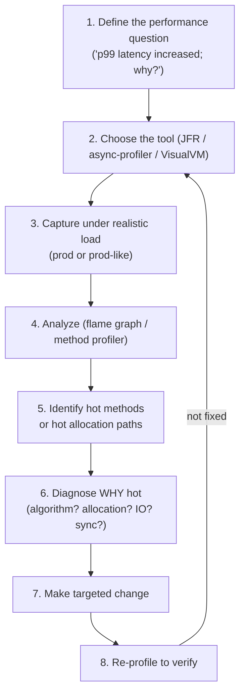
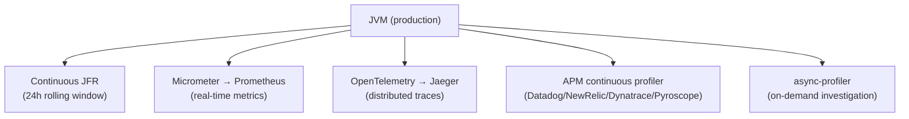
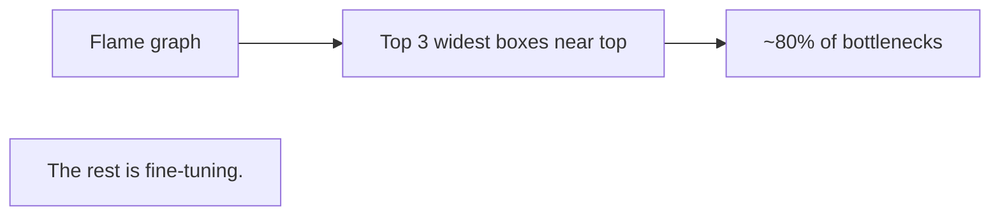

# Profiling (JFR, async-profiler, VisualVM)

T10 covered *memory* diagnosis. This topic covers *CPU* diagnosis: where time is spent in the running JVM, which methods are hot, where allocations happen, where threads block. Profiling is the bridge from "the service is slow" to "we know exactly what to fix." In 2026 the two essential profilers are **JFR (Java Flight Recorder)** — built into the JDK, ~1-3% overhead, the production-default choice — and **async-profiler** — external tool with **flame graphs** as its specialty, no safepoint bias, the modern alternative for the cases JFR's safepoint sampling misses.

The depth-bar requirement isn't "use JFR." At the **methodology** layer, profiling follows a disciplined workflow — define the performance question, choose the right tool, capture under realistic load, analyze, identify the hot path, make a targeted change, re-profile to verify — and most profiling failures are violations of this discipline (capturing dev workload, optimizing the cold path, reading absolute numbers instead of relative). At the **tooling** layer, **JFR** is the *production default* (always-on continuous recording is feasible at 1-3% overhead), records ~140 event types covering CPU samples / allocation / GC / lock contention / I/O / thread states / JIT / exceptions, and is analyzed in **JMC (JDK Mission Control)** — but suffers a **safepoint bias** that under-samples tight loops and long native calls. **async-profiler** complements JFR by sampling via Linux perf events (no safepoint bias) and producing **flame graphs** that visualize sampling data as wide-box-near-top = hot self-time. At the **interpretation** layer, **flame graphs** (Brendan Gregg, 2011) are the canonical visualization — X-axis aggregated samples (*not* time), Y-axis call depth, width = relative sampling count; reading them is its own learnable skill. At the **profile-type** layer, **CPU profiling** (time on-CPU) is different from **wall-clock profiling** (time on-CPU + blocked time), which is critical for I/O-heavy services where blocked time dominates; **allocation profiling** finds GC-pressure sources; **lock contention profiling** finds synchronization bottlenecks. We will cover all four layers, with practical examples for the canonical performance patterns (logging hot path, reflection in tight loops, autoboxing) and a production observability stack (continuous JFR + on-demand async-profiler + Prometheus + OpenTelemetry traces + APM continuous-profiling backends).

> [!NOTE]
> Prerequisites: [Memory leaks & heap dump analysis](./T10-memory-leaks-and-heap-dump-analysis.md) (L3/C02/T10) — the parallel topic for memory diagnosis; [GC tuning & monitoring](./T09-gc-tuning-and-monitoring.md) (L3/C02/T09) — GC events overlap with profiling data; [JIT compilation](./T04-jit-compilation-c1-c2-tiered.md) (L3/C02/T04) — JIT events visible in JFR; [JVM architecture](./T01-jvm-architecture-and-runtime-data-areas.md) (L3/C02/T01) — runtime areas profilers observe.

## What Profiling Is

**Profiling** is measuring where time and resources are spent in a running program. Two main approaches:

| Approach | How it works | Overhead | Accuracy |
|----------|--------------|----------|----------|
| **Sampling** | Periodically snapshot the call stack | Low (~1-5%) | Statistically valid; misses brief events |
| **Instrumentation** | Insert measurement code into every method | High (10-50%+) | Precise; biases results |

Production profiling almost always uses sampling. Modern Java tools (JFR, async-profiler) are sampling profilers; legacy ones (older VisualVM CPU profiling) used instrumentation.

The basic logic: "if 30% of stack-trace samples show `method X`, then X took ~30% of CPU time." Over enough samples, this converges to a useful approximation.

## The Systematic Profiling Workflow



The rules:

- **Always have a performance question.** "Profile this app" with no goal yields noise.
- **Capture realistic load.** Dev workloads don't match production hot paths.
- **Look at relative cost, not absolute.** "30% of time in X" matters; "X took 100 ms" depends on the load.
- **Verify the fix.** Most "improvements" are noise.

## JFR (Java Flight Recorder) — the Production Default

JFR is built into the JDK since JDK 11 (and Oracle JDK 7+). It's the *production-grade* profiler:

- **~1-3% overhead** with `profile` settings.
- **Continuous recording** with rolling window — always-on.
- **~140 event types** covering nearly every JVM subsystem.
- **No special permissions** needed in modern JDKs.

### Starting JFR

**Continuous recording with rolling window** (the production default):

```bash
java -XX:StartFlightRecording=disk=true,maxage=24h,maxsize=200m,filename=/tmp/jfr ...
```

Captures the last 24 hours into a 200 MB rotating file. When something goes wrong, the data is already there.

**On-demand for a specific window**:

```bash
jcmd <pid> JFR.start duration=60s settings=profile filename=/tmp/spike.jfr
# ... reproduce the issue ...
jcmd <pid> JFR.dump filename=/tmp/snapshot.jfr   # also works without duration
```

**Stop and dump**:

```bash
jcmd <pid> JFR.dump filename=/tmp/now.jfr
jcmd <pid> JFR.stop
```

### JFR settings

Two built-in configurations:

- **`default`**: ~1% overhead. Excludes some heavy events (e.g., allocation sampling). Good for always-on.
- **`profile`**: ~2-3% overhead. Includes allocation, lock contention, more detail. Good for diagnosis.

```bash
jcmd <pid> JFR.start duration=60s settings=profile filename=/tmp/p.jfr
```

Custom `.jfc` files let you enable specific events:

```bash
jcmd <pid> JFR.start settings=custom.jfc filename=/tmp/c.jfr
```

### JFR event types (sample)

| Event | Records |
|-------|---------|
| `jdk.CPULoad` | system + process CPU |
| `jdk.ThreadCPULoad` | per-thread CPU |
| `jdk.ExecutionSample` | sampled stack traces (the CPU profile) |
| `jdk.ObjectAllocationInNewTLAB` | TLAB allocation sample |
| `jdk.ObjectAllocationOutsideTLAB` | slow-path allocation sample |
| `jdk.GarbageCollection` | every GC |
| `jdk.GCPhasePause` | STW phase pause |
| `jdk.JavaMonitorEnter` | monitor contention |
| `jdk.JavaMonitorWait` | wait() blocking |
| `jdk.ThreadPark` | LockSupport.park blocking |
| `jdk.FileRead` / `jdk.FileWrite` | file I/O |
| `jdk.SocketRead` / `jdk.SocketWrite` | network I/O |
| `jdk.ThreadStart` / `jdk.ThreadEnd` | thread lifecycle |
| `jdk.JITCompilation` | every method compiled |
| `jdk.MethodSample` | method-level sampling |
| `jdk.VirtualThreadStart` / `jdk.VirtualThreadPinned` | virtual thread lifecycle (T14 from C01) |
| `jdk.JavaErrorThrow` / `jdk.JavaExceptionThrow` | exceptions thrown |

Per-event filtering, sampling rates, and stack-trace depth are configurable.

### Analyzing JFR with JDK Mission Control (JMC)

JMC is the GUI for JFR files. Download from https://www.oracle.com/java/technologies/jdk-mission-control.html (Adoptium has builds too).

Key views:

- **Method Profiling**: hot methods by sample count. Self-time vs total-time. Drill into call tree.
- **Hot Threads**: which threads use most CPU.
- **Allocation Profiling**: where allocations happen (by class, by stack).
- **Memory**: heap usage, GC pauses over time.
- **Lock Contention**: which monitors are contended.
- **Outliers**: long method invocations, slow disk reads, etc.

### JFR's safepoint bias

JFR samples at JVM safepoints (T07 — safepoint polls inserted by JIT). This means:

- **Methods called from a safepoint** (most code) are accurately sampled.
- **Methods between safepoints** (tight loops without poll insertion, long native calls) are *under-sampled*.

JFR's profile is biased toward "where the JIT was happy to put a poll." It misses:

- Tight numeric loops with `-XX:-EliminateBackedgeInTracedLoop` not generating polls.
- Long JNI calls (no safepoints inside native code).
- Synthetic methods, lambdas, certain compiler-generated frames.

The fix: **async-profiler**.

## async-profiler — No Safepoint Bias

[async-profiler](https://github.com/async-profiler/async-profiler) (Andrei Pangin et al.) is the modern alternative to JFR for low-bias CPU profiling. Uses Linux `perf_event_open` (or `AsyncGetCallTrace` on other platforms) — sampling at the OS level, *not* at JVM safepoints.

```bash
# Download from GitHub releases
# Unpack into /opt/async-profiler

# CPU profile, 60 seconds, flame graph output:
/opt/async-profiler/profiler.sh -d 60 -f /tmp/cpu.html <pid>

# Allocation profile:
/opt/async-profiler/profiler.sh -e alloc -d 60 -f /tmp/alloc.html <pid>

# Wall-clock profile (CPU + blocked time):
/opt/async-profiler/profiler.sh -e wall -d 60 -f /tmp/wall.html <pid>

# Lock profile (Java monitor contention):
/opt/async-profiler/profiler.sh -e lock -d 60 -f /tmp/lock.html <pid>
```

### async-profiler vs JFR

| Aspect | JFR | async-profiler |
|--------|-----|----------------|
| **Safepoint bias** | Yes | **No** |
| **Overhead** | 1-3% | < 1% |
| **Default** | Yes (built-in) | Requires install |
| **Output** | Binary .jfr file | Flame graph HTML, .jfr, others |
| **Event variety** | ~140 types | CPU, alloc, wall, lock, perf events |
| **Production-safe** | Yes | Yes |
| **Continuous recording** | Yes | Not its strength |
| **Visualization** | JMC (full-featured) | Flame graphs (focused) |

The 2026 stack: **continuous JFR for everything; on-demand async-profiler for accurate flame graphs**. They complement each other.

## Flame Graphs — Reading and Interpretation

Invented by [Brendan Gregg](https://www.brendangregg.com/flamegraphs.html) (2011). The canonical visualization for sampling profiler data.

```text
       width = % of samples (NOT time)
   ┌──────────────────────────────────────────────────┐
   │              Socket.read()                          │ ← top of stack (most recent call)
   ├──────────────────────────────────────────────────┤
   │           JDBC.executeQuery()                       │
   ├──────────────────────────────────────────────────┤
   │       DB.fetchUser()                                │
   ├──────────────────────────────────────────────────┤
   │   Service.handleRequest()                           │
   ├──────────────────────────────────────────────────┤
   │              main()                                  │ ← bottom (entry point)
   └──────────────────────────────────────────────────┘
```

- **X-axis**: aggregated stack-trace samples, alphabetical by frame name (NOT time).
- **Y-axis**: call depth. Caller at bottom; callee on top.
- **Box width**: percentage of total samples this frame appears in. *The wider, the hotter.*
- **Box color**: usually arbitrary (helps distinguish frames); some tools encode special info (e.g., red for inlined).

### How to read

1. **Look at the top.** The frames at the top are the *self-time* hot spots — where time was actually spent.
2. **Wide flat box near top** = lots of self-time. This is what to optimize.
3. **Narrow tall stack** = deep but rarely sampled — usually not interesting.
4. **Wide narrow stack** (wide at bottom, narrow at top) = a hot top-level method, but actual work elsewhere.

### Example flame graph reading

```text
┌────────────────────────────────────────────────────────────┐
│             Pattern.matcher()             │   String.intern() │  ← hot self-time
├────────────────────────────────────────────────────────────┤
│             String.matches()              │     Service.cache() │
├────────────────────────────────────────────────────────────┤
│                   Validator.validate()                          │
├────────────────────────────────────────────────────────────┤
│                   handler.handle()                               │
└────────────────────────────────────────────────────────────┘
```

Reading: validator.validate() is the parent, but the *hot work* is `Pattern.matcher()` — regex compilation. Likely fix: pre-compile the pattern (cache the `Pattern` instance) instead of re-compiling per request.

### Differential flame graphs

Compare two profiles (before vs after a deploy):

- **Red** boxes = grew between the two profiles (regressed).
- **Blue** boxes = shrank (improved).
- **Gray** = unchanged.

Tells you exactly what got worse (or better) between two runs.

## VisualVM — Quick Triage

[VisualVM](https://visualvm.github.io/) is the lighter alternative — separate download since JDK 9 (was bundled before). Best for quick dev-time investigations.

Features:

- CPU profiling (instrumentation-based; heavier than JFR/async-profiler).
- Memory profiling.
- Thread visualization with state colors.
- JMX MBean inspector.
- Heap dump capture and basic analysis.
- Plugins (Visual GC, MBeans extensions, etc.).

When to use:

- Dev-time debugging.
- Quick checks of a running JVM ("what's it doing right now?").
- JMX inspection.

When NOT to use:

- Production CPU profiling (heavier than JFR/async-profiler).
- Heap dump analysis at scale (use Eclipse MAT, T10).

## Other Tools

### JProfiler / YourKit (commercial)

Rich UIs, real-time JDBC query profiling, distributed tracing integration. Enterprise teams often deploy them. Expensive licenses; powerful features.

### honest-profiler

Historical low-overhead sampling profiler. Largely superseded by async-profiler. Mentioned for completeness.

### Linux `perf`

Kernel-level profiler — useful with `--frame-pointer` for native code. For Java code, use async-profiler (which uses `perf` internally on Linux but adds Java symbol resolution).

## Profile Types — CPU vs Wall vs Allocation vs Lock

Different questions need different profiles:

### CPU profile

Samples when threads are **on-CPU**. Best for CPU-bound workloads (computation, parsing, encryption).

```bash
asprofiler.sh -e cpu -d 60 -f /tmp/cpu.html <pid>
```

### Wall-clock profile

Samples regardless of thread state (on-CPU or blocked). **Critical for I/O-heavy services** where most time is spent blocked.

```bash
asprofiler.sh -e wall -d 60 -f /tmp/wall.html <pid>
```

For a service whose p99 is 500 ms and CPU is at 5%, **the CPU profile shows almost nothing useful** — most time isn't on CPU. The wall-clock profile shows where the time actually went (waiting on DB, network, lock).

### Allocation profile

Samples allocations. Shows where GC pressure comes from.

```bash
asprofiler.sh -e alloc -d 60 -f /tmp/alloc.html <pid>
# Or JFR: jdk.ObjectAllocationInNewTLAB / jdk.ObjectAllocationOutsideTLAB
```

Useful when GC pauses are too frequent or too long — reducing allocation reduces GC work.

### Lock contention profile

Samples threads blocked on monitor enter or LockSupport.park.

```bash
asprofiler.sh -e lock -d 60 -f /tmp/lock.html <pid>
# Or JFR: jdk.JavaMonitorEnter / jdk.ThreadPark
```

Reveals synchronization bottlenecks — the canonical fix is reducing critical-section duration or switching to lock-free structures.

## Common Performance Patterns Found via Profiling

### Logging in hot path with non-parameterized strings

```java
// ✗ Always formats the string, even at INFO level when DEBUG is disabled:
logger.debug("processing " + request.toString() + " with config " + config);

// ✓ Parameterized — string only built if DEBUG is enabled:
logger.debug("processing {} with config {}", request, config);
```

Visible as `String.concat`/`StringBuilder.append` high in CPU profile.

### Reflection in tight loops

```java
// ✗ Reflective lookup every iteration:
for (var x : items) {
    Method m = x.getClass().getMethod("process");
    m.invoke(x);
}

// ✓ Cache the Method:
Method m = Item.class.getMethod("process");
for (var x : items) m.invoke(x);
```

Or better: use a proper interface instead of reflection.

### Pre-JDK-9 StringBuilder churn

```java
// ✗ Pre-JDK-9 — StringBuilder per iteration:
for (var x : items) {
    String s = "prefix" + x + "suffix";   // StringBuilder churn
    process(s);
}
```

JDK 9+ uses invokedynamic (T03) and is usually fine. Profile to confirm.

### LinkedList.get(i) — O(n)

```java
List<X> list = new LinkedList<>();
for (int i = 0; i < list.size(); i++) {
    process(list.get(i));   // ✗ O(n^2) — get(i) walks the list
}
```

Fix: ArrayList (O(1) indexed access), or use iterator/for-each.

### JDBC ResultSet metadata lookup per row

```java
while (rs.next()) {
    int id = rs.getInt(rs.findColumn("id"));   // ✗ string lookup per row
    String name = rs.getString(rs.findColumn("name"));
}

// ✓ Cache the column indices once:
int idCol = rs.findColumn("id");
int nameCol = rs.findColumn("name");
while (rs.next()) {
    int id = rs.getInt(idCol);
    String name = rs.getString(nameCol);
}
```

### JSON serialization reflection

```java
// ✗ ObjectMapper created per request (re-discovers all classes):
String json = new ObjectMapper().writeValueAsString(obj);

// ✓ Shared, immutable, thread-safe:
private static final ObjectMapper MAPPER = new ObjectMapper();
String json = MAPPER.writeValueAsString(obj);
```

### Autoboxing in loops

```java
// ✗ Autoboxes every iteration:
Map<Integer, Integer> map = new HashMap<>();
for (int i = 0; i < 1_000_000; i++) {
    map.merge(i, 1, Integer::sum);   // Integer.valueOf(i) per call
}

// ✓ Primitive map (Eclipse Collections, fastutil):
IntIntHashMap map = new IntIntHashMap();
for (int i = 0; i < 1_000_000; i++) {
    map.addToValue(i, 1);
}
```

Eclipse Collections, fastutil, HPPC offer primitive-typed collections with massive allocation reductions.

## Container Profiling

Profilers work in containers, but with some setup:

```bash
# JFR — output to a volume:
kubectl exec <pod> -- jcmd 1 JFR.start duration=60s filename=/tmp/p.jfr
kubectl cp <pod>:/tmp/p.jfr ./local.jfr

# async-profiler — needs to be present in container:
# Either bake into the image, or use a side-car
kubectl exec <pod> -- /opt/async-profiler/profiler.sh -d 60 -f /tmp/cpu.html 1
```

For Kubernetes, side-car patterns (e.g., Pyroscope agent) handle continuous profiling without code changes.

## Production Observability Stack

A complete observability stack combines:



Each stream answers a different question:

- **JFR**: deep JVM internals (always-on, post-mortem).
- **Prometheus**: real-time alerts and dashboards.
- **OpenTelemetry traces**: per-request flow across services.
- **APM continuous profiler**: aggregated flame graphs across the fleet.
- **async-profiler**: precise on-demand investigation.

## APM Integration

Continuous profiling has become a feature of every major APM platform:

- **Datadog Continuous Profiler** — Java agent, aggregates flame graphs.
- **New Relic / AppDynamics / Dynatrace** — similar offerings.
- **Pyroscope** (now Grafana Pyroscope) — open-source continuous profiling, integrates with Grafana.
- **Sentry Profiling** — focused on slow request investigation.

All use sampling underneath (often async-profiler or similar). The differentiator is the *aggregation* — viewing flame graphs across services, deploys, and instances.

## Profiling Pitfalls

### Profiling in dev with synthetic load

Dev workloads rarely match prod hot paths. Profile in prod (or production-equivalent) or accept noisy results.

### Reading absolute numbers vs relative

"This method took 100 ms" — meaningless without context. "30% of profile time" — actionable.

### Optimizing the cold path

A method that takes 1% of CPU isn't where to invest tuning time. Focus on the top 3 widest boxes.

### Not running long enough

Transient spikes don't show in a 10-second profile. Capture for at least minutes; ideally tens of minutes to hours for slow regressions.

### Safepoint bias (JFR)

Discussed above. Use async-profiler when you suspect JFR is missing data — typically tight loops, native code-heavy paths.

### Reading the wrong profile type

A wall-clock profile of an I/O-bound service is dominated by `Socket.read()` — useful. A CPU profile of the same is dominated by GC (because that's all that's on-CPU). Match the profile type to the question.

## The 80/20 of Profiling



In practice: glance at the flame graph; the top 3 widest top-boxes usually point to the issue. Drill into "why is this hot?" Don't get distracted by deeper micro-optimizations.

## When to (and Not to) Profile

### When to profile

- p99 latency increased.
- Throughput dropped.
- CPU utilization unexpectedly high.
- Suspect inefficient algorithm.
- Before claiming "we need more cores."

### When NOT to profile

- App already meets requirements.
- Symptoms unrelated to JVM (network, DB latency, downstream services).
- No baseline.
- Without a specific hypothesis.

## Common Mistakes

### Profile in production without continuous recording enabled

You can't profile an issue that already happened. Enable continuous JFR.

### Read flame graphs without zooming

The full graph is overwhelming; zoom into the hot region.

### Mix CPU and wall-clock profiles

They answer different questions. Be deliberate.

### Optimize without baseline

You can't say "30% faster" without a baseline.

### Ignore allocation profiling

Hot allocation paths = GC pressure source. Reducing allocations often helps more than optimizing CPU code.

### Trust dev profiles in prod

The JIT, GC, and workload differ. Profile prod.

## Practice

1. **Continuous JFR setup.** Enable rolling-window continuous recording on a service. After a load test, dump and open in JMC.
2. **JFR method profile.** Identify the top 5 CPU-consuming methods in JMC. Drill into the call tree.
3. **async-profiler CPU flame graph.** Profile a Spring Boot app for 60s. Open the flame graph HTML. Identify hot self-time methods.
4. **JFR vs async-profiler comparison.** Profile the same workload with both. Look for differences (safepoint bias).
5. **Wall-clock vs CPU profile.** Profile an I/O-bound service both ways. Compare what's hot.
6. **Allocation profile.** Profile an allocation-heavy app; identify the top allocation sites; fix one; re-profile.
7. **Lock contention profile.** Build a contended-lock benchmark. Profile with `-e lock`. Identify the contention.
8. **Differential flame graph.** Profile before and after a code change. Generate diff flame graph.
9. **Common pattern: logging hot path.** Build a service with non-parameterized `logger.debug` in a hot loop. Profile; identify; fix with parameterized; re-profile.
10. **Common pattern: reflection in loop.** Same workflow.
11. **Container profiling.** Run a JVM in Docker; capture JFR via `docker exec jcmd`.
12. **APM continuous profiler.** Set up Pyroscope (open-source); view aggregated flame graphs across a workload.

## Recap

You should now be able to:

- Distinguish **sampling** (low overhead, statistical) from **instrumentation** (high overhead, precise); modern Java profiling is sampling-based.
- Apply the **systematic profiling workflow**: define question → choose tool → capture realistic load → analyze → identify hot path → diagnose why → fix → re-profile.
- Use **JFR (Java Flight Recorder)** as the production-default profiler: built into JDK 11+, ~1-3% overhead, ~140 event types; continuous recording with rolling window or on-demand capture via `jcmd JFR.start`; settings `default` vs `profile`.
- Analyze JFR in **JMC (JDK Mission Control)**: method profiler (self vs total time), Hot Threads, allocation profiling, memory utilization, GC pauses, lock contention, outliers.
- Recognize JFR's **safepoint bias**: samples at JVM safepoints; under-samples tight loops without polls and long native calls; use async-profiler when this matters.
- Use **async-profiler** as the modern complement: Linux `perf_event_open`-based, no safepoint bias, < 1% overhead; flame graph as the canonical output; CPU/wall/alloc/lock event modes.
- **Read flame graphs**: X-axis = aggregated samples (NOT time), Y-axis = call depth, width = % of samples; **look at the top — wide flat box near top = hot self-time**; narrow stacks = not interesting.
- Apply **differential flame graphs** for before/after comparison (red grew, blue shrank).
- Use **VisualVM** for quick dev-time triage; JMX inspection; basic heap dump capture; never for production profiling (instrumentation overhead).
- Differentiate **profile types** by question: CPU (on-CPU time, CPU-bound workloads), **wall-clock (on-CPU + blocked, critical for I/O-heavy)**, allocation (GC pressure sources), lock contention (synchronization bottlenecks).
- Recognize **common performance patterns** found via profiling: non-parameterized logging, reflection in tight loops, pre-JDK-9 StringBuilder churn, LinkedList.get(i), JDBC ResultSet metadata per-row, ObjectMapper-per-call, autoboxing in loops (fix via primitive collections like Eclipse Collections / fastutil).
- Profile in **containers** via `kubectl exec` to invoke `jcmd`, or via side-car continuous profilers (Pyroscope, etc.).
- Build a **production observability stack**: continuous JFR + Prometheus + OpenTelemetry traces + APM continuous profiler + on-demand async-profiler.
- Integrate with **APM continuous profilers** (Datadog, New Relic, Pyroscope) for fleet-wide flame graph aggregation.
- Avoid the **6 profiling pitfalls**: synthetic dev load, absolute vs relative readings, optimizing cold paths, short capture windows, ignoring safepoint bias when relevant, mismatched profile type to question.
- Apply the **80/20**: top 3 widest top-boxes usually point to the issue.
- Know **when NOT to profile**: already meets requirements, symptoms elsewhere (network, DB), no baseline, no hypothesis.

## Next

Continue to [Benchmarking with JMH](./T12-benchmarking-with-jmh.md) — *the* tool for measuring Java code performance correctly. We'll cover the **JMH (Java Microbenchmark Harness)** — designed by Doug Lea and Aleksey Shipilëv specifically to handle the JIT, dead code elimination, GC, and statistical noise that defeat naive `System.nanoTime()` benchmarks; **warmup phases**, **measurement iterations**, **forks**, **black holes** to prevent dead-code-elimination, **modes** (throughput vs average time vs sample time vs single shot); reading JMH output (operations per second, percentiles); the common benchmark anti-patterns and how JMH neutralizes them; integration with profiling tools to find *why* a microbenchmark is slow.
