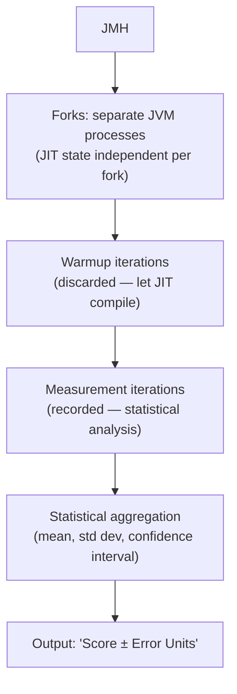
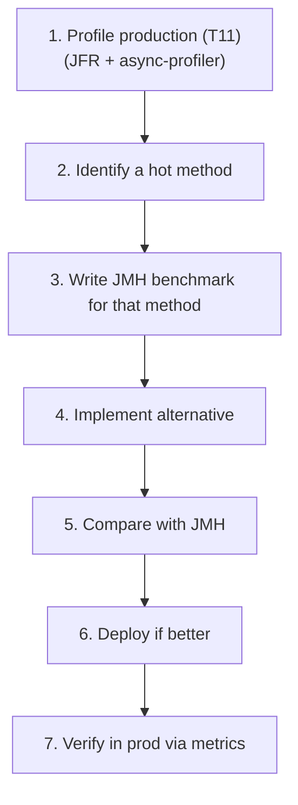

# Benchmarking with JMH

T11 covered profiling — finding *where* time goes in a running JVM. This topic covers benchmarking — measuring *how fast* a specific piece of code is, reliably enough to compare alternatives. The two are complementary: profiling identifies *what* to optimize; benchmarking validates *whether* an optimization actually helps. And benchmarking Java code *correctly* is dramatically harder than it looks, because the JIT (T04), GC (T07), and modern CPUs conspire to make naive `System.nanoTime()` benchmarks measure almost anything except what you intended. **JMH (Java Microbenchmark Harness)** — designed by Aleksey Shipilëv at Oracle, with help from Doug Lea, now an OpenJDK project — is the canonical tool that handles all the JVM gotchas: forks, warmup, dead code elimination, constant folding, statistical analysis. Using it is *the* difference between data-driven performance engineering and Twitter-style folk wisdom.

The depth-bar requirement isn't "use JMH." At the **why-benchmarks-are-hard** layer, the JVM has *many* mechanisms that defeat naive measurement — **JIT warmup** (Tier 0 interpreted is 10× slower than Tier 4 C2; if you measure before warmup, you measure the wrong thing), **dead code elimination** (if you don't *use* the result, the JIT removes the computation; the benchmark measures nothing), **constant folding** (if the input is a compile-time constant, the JIT precomputes; the benchmark measures the constant load), **JIT devirtualization** (a call that's monomorphic at benchmark time is inlined; in production with multiple types it's not). At the **JMH-mechanism** layer, JMH solves these via **separate JVM forks** (multiple JVMs, each with own JIT state — averaged for robustness), **warmup phases** (discarded iterations to let the JIT reach Tier 4), **measurement phases** (recorded iterations with statistical analysis), **`@State` objects** (input loaded from non-constant fields so the JIT can't fold), **black holes** (`Blackhole.consume(value)` that the JIT can't prove is dead, preventing DCE). At the **API** layer, JMH's annotation-driven design — `@Benchmark`, `@Warmup`, `@Measurement`, `@Fork`, `@BenchmarkMode(Mode.Throughput | AverageTime | SampleTime | SingleShotTime)`, `@State(Scope.Thread | Benchmark | Group)`, `@Setup`/`@TearDown` with `@Level.Trial | Iteration | Invocation`, `@Param` for parameterization, `@Threads` for multi-threaded — exposes all the knobs without requiring framework code. At the **integration** layer, JMH's built-in profilers (`-prof gc`, `-prof stack`, `-prof perfasm`, `-prof async`) combine measurement with profiling — answering not just "is A faster than B" but *why*. We will cover all four layers, including the canonical anti-patterns naive benchmarks fall into and how JMH neutralizes each.

> [!NOTE]
> Prerequisites: [Profiling (JFR, async-profiler, VisualVM)](./T11-profiling-jfr-async-profiler-visualvm.md) (L3/C02/T11) — profile first, benchmark candidates second; [JIT compilation](./T04-jit-compilation-c1-c2-tiered.md) (L3/C02/T04) — the JIT behaviors JMH neutralizes; [GC fundamentals](./T07-garbage-collection-fundamentals.md) (L3/C02/T07) — GC pauses introduce noise; [JVM architecture](./T01-jvm-architecture-and-runtime-data-areas.md) (L3/C02/T01) — code cache + interpreter + JIT context.

## Why Benchmarking Java Is Hard

A naive benchmark:

```java
long start = System.nanoTime();
for (int i = 0; i < 1_000_000; i++) {
    compute(i);
}
long elapsed = System.nanoTime() - start;
System.out.println(elapsed / 1_000_000 + " ns/op");
```

This is *almost always wrong*. Why?

| Pitfall | What goes wrong |
|---------|------------------|
| **No warmup** | First iterations are interpreted (T04 — Tier 0) at ~10× slower; measurement is dominated by them |
| **Dead code elimination** | If `compute(i)` returns a value not used, JIT removes the call entirely → measures nothing |
| **Constant folding** | If `compute(0)`, `compute(1)`, etc. are pure functions of constants, JIT precomputes → measures the constant load |
| **JIT devirtualization** | A monomorphic call site (one type seen) is inlined; in production with many types, it's a virtual call |
| **GC pauses** | A GC during measurement adds latency unrelated to `compute()` |
| **Cache state** | First iteration: cold cache (slow); steady state: hot cache (fast) — measurement averages both |
| **OS scheduling** | Process preempted, paged out, etc. — adds noise |
| **CPU frequency scaling** | Turbo Boost, throttling, P-state transitions add ~5–20% variance |

The cumulative result: naive benchmarks easily measure 10× or 100× wrong. The blog-post folklore "Method A is faster than Method B" is usually one of these mistakes.

## The Naive Benchmark Anti-Pattern

```java
public class NaiveBenchmark {
    public static void main(String[] args) {
        long start = System.nanoTime();
        for (int i = 0; i < 1_000_000; i++) {
            heavyComputation(i);   // ✗ return value discarded → DCE
        }
        long elapsed = System.nanoTime() - start;
        System.out.println(elapsed + " ns total");
    }

    static int heavyComputation(int x) { return x * x; }
}
```

What this *actually* measures: probably nothing — the JIT likely eliminates the entire loop after the first warmup iteration, because the result is never used.

What you *intended* to measure: per-call cost of `heavyComputation`.

The gap is JMH's reason for existing.

## JMH — the Canonical Solution

[JMH](https://openjdk.org/projects/code-tools/jmh/) is an OpenJDK project. Designed by Aleksey Shipilëv and Doug Lea, who built much of `java.util.concurrent`. Its purpose: **make benchmarks correct by default** by handling all the JVM gotchas.



## Setting Up JMH

Maven `pom.xml`:

```xml
<dependencies>
    <dependency>
        <groupId>org.openjdk.jmh</groupId>
        <artifactId>jmh-core</artifactId>
        <version>1.37</version>
    </dependency>
    <dependency>
        <groupId>org.openjdk.jmh</groupId>
        <artifactId>jmh-generator-annprocess</artifactId>
        <version>1.37</version>
        <scope>provided</scope>
    </dependency>
</dependencies>

<build>
    <finalName>benchmarks</finalName>
    <plugins>
        <plugin>
            <artifactId>maven-shade-plugin</artifactId>
            <executions>
                <execution>
                    <phase>package</phase>
                    <goals><goal>shade</goal></goals>
                    <configuration>
                        <transformers>
                            <transformer implementation="org.apache.maven.plugins.shade.resource.ManifestResourceTransformer">
                                <mainClass>org.openjdk.jmh.Main</mainClass>
                            </transformer>
                        </transformers>
                    </configuration>
                </execution>
            </executions>
        </plugin>
    </plugins>
</build>
```

Or use the JMH maven archetype:

```bash
mvn archetype:generate \
    -DinteractiveMode=false \
    -DarchetypeGroupId=org.openjdk.jmh \
    -DarchetypeArtifactId=jmh-java-benchmark-archetype \
    -DgroupId=com.example -DartifactId=bench -Dversion=1.0
```

## A Minimal Benchmark

```java
package com.example;

import java.util.concurrent.TimeUnit;
import org.openjdk.jmh.annotations.*;
import org.openjdk.jmh.infra.Blackhole;

@BenchmarkMode(Mode.AverageTime)
@OutputTimeUnit(TimeUnit.NANOSECONDS)
@State(Scope.Benchmark)
@Warmup(iterations = 5, time = 1)
@Measurement(iterations = 10, time = 1)
@Fork(3)
public class StringConcatBenchmark {

    @Param({"10", "100", "1000"})
    public int length;

    private String[] parts;

    @Setup(Level.Trial)
    public void setUp() {
        parts = new String[length];
        for (int i = 0; i < length; i++) parts[i] = "x" + i;
    }

    @Benchmark
    public String stringPlus() {
        String result = "";
        for (var p : parts) result = result + p;
        return result;
    }

    @Benchmark
    public String stringBuilder() {
        StringBuilder sb = new StringBuilder();
        for (var p : parts) sb.append(p);
        return sb.toString();
    }

    @Benchmark
    public String stringJoin() {
        return String.join("", parts);
    }
}
```

Compile and run:

```bash
mvn clean package
java -jar target/benchmarks.jar StringConcatBenchmark
```

JMH runs each `@Benchmark` for each value of `length`, with 3 forks × (5 warmup + 10 measurement iterations × 1 second) per benchmark/length combination.

## JMH Modes

```java
@BenchmarkMode(Mode.Throughput)        // ops per time unit (DEFAULT)
@BenchmarkMode(Mode.AverageTime)        // time per op
@BenchmarkMode(Mode.SampleTime)         // percentile-based: p50, p99, p999
@BenchmarkMode(Mode.SingleShotTime)     // single measurement (for cold/startup benchmarks)
@BenchmarkMode(Mode.All)                // all four
```

Pick based on the question:

- **Throughput** for "operations/sec" comparisons.
- **AverageTime** for "ns per call" comparisons.
- **SampleTime** for latency-sensitive code (gives percentiles).
- **SingleShotTime** for startup, cold cache, one-off measurements.

## The Annotations in Depth

### `@State` — where benchmark state lives

```java
@State(Scope.Thread)        // per-thread state (default)
@State(Scope.Benchmark)     // shared across all threads in benchmark
@State(Scope.Group)         // per-group state (for asymmetric multi-threaded benchmarks)
```

The class with `@State` holds inputs the benchmark needs. State fields are loaded fresh per iteration — *the JIT can't fold them as constants*. This is the JMH escape hatch from constant folding.

```java
@State(Scope.Benchmark)
public class S {
    public int value = 42;   // JIT sees this as a load, not a constant
}

@Benchmark
public int cube(S s) {
    return s.value * s.value * s.value;   // measures the cube, not the constant 74088
}
```

### `@Setup` and `@TearDown` — lifecycle hooks

```java
@Setup(Level.Trial)         // once per fork (default)
@Setup(Level.Iteration)     // once per iteration
@Setup(Level.Invocation)    // once per @Benchmark call — RARELY use (huge overhead)
public void prepareData() { ... }

@TearDown(Level.Trial)
public void cleanup() { ... }
```

`Level.Trial` is usually right. `Level.Invocation` adds setup latency to every measurement — only use when setup *must* be per-call (e.g., resetting state to consume a stream).

### `@Warmup` and `@Measurement` — iteration control

```java
@Warmup(iterations = 5, time = 1, timeUnit = TimeUnit.SECONDS)
@Measurement(iterations = 10, time = 1, timeUnit = TimeUnit.SECONDS)
```

5 warmup × 1s + 10 measurement × 1s = 15 seconds per benchmark per fork. Defaults are usually fine; tune if your benchmark is unstable or takes longer to warm up.

### `@Fork` — separate JVMs

```java
@Fork(3)         // 3 forks (separate JVM processes)
@Fork(0)         // no forks (same JVM) — DON'T USE for serious benchmarks
```

Each fork runs JMH from scratch — new JIT state, new GC state. **The default of 5 forks is rarely worth reducing.** Forks isolate the measurement from JIT contamination by prior benchmarks.

### `@Threads` — concurrency

```java
@Threads(4)            // 4 threads run the benchmark concurrently
@Threads(Threads.MAX)  // use available cores
```

For concurrent code benchmarks. State scope matters — `Scope.Thread` has separate state per thread; `Scope.Benchmark` has shared state.

### `@Param` — parameterization

```java
@Param({"10", "100", "1000", "10000"})
public int size;
```

JMH runs the benchmark for each value, collecting separate results. Cartesian product if multiple params.

### `@OperationsPerInvocation` — for batched work

```java
@OperationsPerInvocation(1000)
@Benchmark
public void batched(Blackhole bh) {
    for (int i = 0; i < 1000; i++) bh.consume(work(i));
}
```

Tells JMH the loop performs 1000 ops per invocation; result is per-op, not per-invocation.

## Black Holes — Preventing Dead Code Elimination

The JIT removes computations whose results are unused. `Blackhole.consume(value)` makes the JIT believe the value matters:

```java
@Benchmark
public void noResult() {
    compute();        // ✗ JIT removes the call
}

@Benchmark
public int returnResult() {
    return compute();  // ✓ JMH stores the return value via reflection-based wrapper
}

@Benchmark
public void blackhole(Blackhole bh) {
    bh.consume(compute());   // ✓ explicit consume; JIT can't optimize away
}

@Benchmark
public void multiple(Blackhole bh) {
    bh.consume(a());
    bh.consume(b());
    bh.consume(c());          // useful when you measure multiple things per call
}
```

Use `Blackhole` whenever you'd otherwise discard a return value. The `consume` method is implemented to be uninlinable and effectful — the JIT can't prove the consumed value isn't observed.

## Reading JMH Output

```text
Benchmark                                Mode  Cnt    Score    Error   Units
StringConcatBenchmark.stringPlus        avgt   30   1234.5 ±  10.2   ns/op
StringConcatBenchmark.stringBuilder     avgt   30    234.1 ±   3.5   ns/op
StringConcatBenchmark.stringJoin        avgt   30    156.7 ±   2.1   ns/op
```

Decoded:

- **Benchmark**: which method.
- **Mode**: `avgt` = AverageTime.
- **Cnt**: number of measurement iterations × forks (3 × 10 = 30).
- **Score**: mean.
- **Error**: 99.9% confidence interval (± value).
- **Units**: as configured (ns/op).

Interpretation:

- `stringJoin` (~157 ns) is ~7.9× faster than `stringPlus` (~1234 ns).
- Error bars don't overlap → statistically significant difference.
- If error were ± 100 ns, the difference would still be significant; if ± 1000 ns, less so.

## Statistical Analysis

JMH provides multiple measures:

```text
Result "Benchmark.method": 234.123 ±(99.9%) 3.456 ns/op [Average]
  (min, avg, max) = (215.789, 234.123, 255.123), stdev = 8.234
  CI (99.9%): [230.667, 237.580] (assumes normal distribution)
```

- **Average**: mean across all measurement iterations.
- **Min / Max**: extremes.
- **Standard deviation**: spread.
- **Confidence interval**: with 99.9% confidence, the true mean is in [230.667, 237.580].

For percentile-based modes:

```text
SampleTime
  p(50%) = 215 ns/op    ← median
  p(99%) = 312 ns/op    ← p99
  p(99.9%) = 543 ns/op  ← p999 (latency tail)
```

## Common Patterns

### Compare two implementations

```java
@Benchmark public int withHashMap() { ... }
@Benchmark public int withTreeMap() { ... }
```

JMH runs both, reports both, lets you compare.

### Parameterized scaling benchmark

```java
@Param({"10", "100", "1000", "10000", "100000"})
public int size;

@Benchmark
public int operation() { ... }    // run for each size
```

Tells you "how does performance scale with input size?"

### Multi-threaded benchmark

```java
@State(Scope.Benchmark)
@Threads(8)
public class ConcurrentBench {
    private AtomicInteger counter = new AtomicInteger();

    @Benchmark
    public int increment() {
        return counter.incrementAndGet();
    }
}
```

8 threads share the `counter`; measure throughput under contention.

### Asymmetric multi-threaded (group)

```java
@Group("producer-consumer")
@GroupThreads(2)
@Benchmark
public void produce(State s) { ... }

@Group("producer-consumer")
@GroupThreads(2)
@Benchmark
public void consume(State s) { ... }
```

Separate threads for producer and consumer roles.

## JMH Profilers — Built-in Integration

JMH ships several built-in profilers; combine with benchmark for *why* the benchmark is slow:

```bash
# GC profiler — allocation rate, GC time
java -jar benchmarks.jar -prof gc

# Stack profiler — sampled stack traces
java -jar benchmarks.jar -prof stack

# perfasm (Linux x86) — disassembled JIT'd code
java -jar benchmarks.jar -prof perfasm

# async-profiler integration
java -jar benchmarks.jar -prof async:output=flamegraph;dir=/tmp/profile
```

Output:

```text
Benchmark           Mode  Score    Error  Units
StringConcat.foo    avgt  234.1 ±  3.5   ns/op
StringConcat.foo:·gc.alloc.rate         avgt    1567.234 ± 50.123  MB/sec
StringConcat.foo:·gc.alloc.rate.norm    avgt     384.000 ±  0.001  B/op
StringConcat.foo:·gc.count              avgt      45.000               counts
StringConcat.foo:·gc.time               avgt     123.000               ms
```

Tells you allocation rate (1567 MB/sec, 384 bytes per op) and GC overhead. Crucial for evaluating allocation-heavy code.

## Output Formats for CI

```bash
# JSON output for tooling
java -jar benchmarks.jar -rf json -rff /tmp/results.json

# CSV output
java -jar benchmarks.jar -rf csv -rff /tmp/results.csv

# Console + JSON
java -jar benchmarks.jar -rf json -rff /tmp/results.json
```

CI integration:

1. Run benchmarks nightly or on PR.
2. Save JSON output as artifact.
3. Compare against baseline.
4. Alert on regression > N%.

Tools: [jmh-visualizer](https://jmh.morethan.io/) (paste JSON, get charts), custom CI scripts, OpenJDK's jmh-result-validator.

## Common Mistakes

### Single-fork "fast" runs

```bash
java -jar benchmarks.jar -f 0    # ✗ no forks — JIT state leaks between benchmarks
```

Default 5 forks are there for a reason. Don't reduce unless you really know why.

### Insufficient warmup

```java
@Warmup(iterations = 1, time = 1)   // ✗ likely Tier 3 not Tier 4
```

Defaults (5 × 1s) are good. Some benchmarks need more (10+ iterations for stable JIT).

### Microbenchmarking the wrong thing

```java
@Benchmark
public int hashMapPutSingle(State s) {
    return s.map.put(s.key, s.value);   // measures put() with cache hot
                                          // production has many keys, cache cold
}
```

Microbenchmarks measure *idealized* conditions. Real production has cache misses, contention, etc. Use microbenchmarks for *relative* comparisons, not absolute predictions.

### Ignoring noise

Quiet machine matters. Disable Turbo Boost / frequency scaling for stable measurement:

```bash
# Linux:
sudo cpupower frequency-set --governor performance
# Disable Turbo Boost:
echo 0 | sudo tee /sys/devices/system/cpu/intel_pstate/no_turbo
```

Run multiple times; if results vary, the machine is noisy.

### Comparing across hardware

Same benchmark, different machines → different numbers. Always compare on identical hardware (same machine, same time, ideally one after the other).

### Reading the wrong column

`Mode` matters: `thrpt` = throughput (higher = better); `avgt` = time per op (lower = better). Read the units and direction.

### Forgetting `@Param` cartesian explosion

```java
@Param({"a", "b", "c"})
public String x;
@Param({"1", "2", "3"})
public int y;
```

3 × 3 = 9 combinations, each running ~15 seconds × 5 forks = ~11 minutes per `@Benchmark`. Five benchmarks → ~1 hour total. Plan accordingly.

## JMH Limitations

- **Microbenchmarks aren't macro benchmarks.** Use JMH for "is A faster than B?"; not "how fast is my service?"
- **Production behavior may differ.** Memory pressure, lock contention, system noise — none captured in isolated microbenchmarks.
- **JMH can't measure what doesn't exist as a clean method.** Holistic system performance needs different tools (load testing, observability).
- **GC overhead can hide.** Use `-prof gc` to expose.

## The Right Benchmarking Workflow



The order matters:

- **Profile first** to identify the actual hot path. Don't benchmark without evidence.
- **Benchmark to compare alternatives**, not to predict absolute numbers.
- **Verify in production** — the benchmark may not match real workload.

## What JMH Can — and Cannot — Answer

### Can

- "Is `HashMap` faster than `TreeMap` for 1000 entries?"
- "How does my method scale with input size?"
- "Is `AtomicInteger.incrementAndGet()` slower than `LongAdder.increment()` under 32 threads?"
- "What's the per-op latency of my serializer?"
- "Does my optimization improve throughput?"

### Cannot

- "How fast is my whole service?" — use load tests.
- "Will my system scale to 10× users?" — use capacity planning + load tests.
- "Is GC pressure causing latency spikes?" — use APM + GC logs.
- "What's the right database query plan?" — use database EXPLAIN.

JMH is sharp for microbenchmarks. Use the right tool for the right question.

## A Real-World Example — HashMap vs TreeMap

```java
@BenchmarkMode(Mode.AverageTime)
@OutputTimeUnit(TimeUnit.NANOSECONDS)
@State(Scope.Benchmark)
@Warmup(iterations = 5, time = 1)
@Measurement(iterations = 10, time = 1)
@Fork(3)
public class MapBenchmark {

    @Param({"100", "10000", "1000000"})
    private int size;

    private Map<Integer, Integer> hashMap;
    private Map<Integer, Integer> treeMap;
    private int[] keysToLookup;

    @Setup
    public void setUp() {
        Random r = new Random(42);
        hashMap = new HashMap<>(size);
        treeMap = new TreeMap<>();
        keysToLookup = new int[1000];

        for (int i = 0; i < size; i++) {
            int k = r.nextInt();
            hashMap.put(k, i);
            treeMap.put(k, i);
        }
        // 1000 lookups (mix of present and absent)
        for (int i = 0; i < keysToLookup.length; i++) {
            keysToLookup[i] = r.nextInt();
        }
    }

    @Benchmark
    @OperationsPerInvocation(1000)
    public void hashMapGet(Blackhole bh) {
        for (int k : keysToLookup) bh.consume(hashMap.get(k));
    }

    @Benchmark
    @OperationsPerInvocation(1000)
    public void treeMapGet(Blackhole bh) {
        for (int k : keysToLookup) bh.consume(treeMap.get(k));
    }
}
```

Expected results:

```text
Benchmark                Size       Mode  Cnt  Score   Error  Units
MapBench.hashMapGet      100        avgt   30   25.3 ± 0.5   ns/op
MapBench.treeMapGet      100        avgt   30   85.2 ± 1.2   ns/op
MapBench.hashMapGet      10000      avgt   30   30.1 ± 0.7   ns/op
MapBench.treeMapGet      10000      avgt   30  165.4 ± 2.3   ns/op
MapBench.hashMapGet      1000000    avgt   30   45.7 ± 1.5   ns/op
MapBench.treeMapGet      1000000    avgt   30  340.8 ± 5.1   ns/op
```

HashMap is consistently ~3-7× faster. TreeMap's O(log n) shows in the scaling (85 → 340 ns as size goes 100 → 1M, ~3-4× growth). HashMap stays roughly constant (~25-45 ns), as expected for O(1) amortized.

Conclusion: pick HashMap unless you need sorted iteration.

## Practice

1. **Reproduce the naive anti-pattern.** Write a `System.nanoTime()` benchmark that "measures" something obviously dead-code-eliminated. Observe nonsensical results. Convert to JMH; observe correct measurements.
2. **String concat comparison.** Implement string-plus, StringBuilder, String.join. Benchmark with `@Param({"10", "100", "1000"})`. Identify the crossover.
3. **HashMap vs TreeMap (above).** Run the example. Verify results scale as expected.
4. **AtomicInteger vs LongAdder.** Build a counter benchmark with `@Threads(8)`. Compare. Observe LongAdder wins under contention.
5. **DCE trap.** Write a benchmark without using the return value. Run with `-prof stack`; observe the method isn't even sampled.
6. **Constant folding trap.** Hard-code an input vs load from `@State`. Compare timings; verify state version measures the real op.
7. **`@Param` scaling.** Run a benchmark with `@Param({"1", "10", "100", "1000", "10000"})`. Plot the results.
8. **Multi-threaded contention.** Synchronized vs ReentrantLock vs StampedLock under 4 threads. Identify the contention profiles.
9. **`-prof gc` for allocation analysis.** Benchmark string-plus (allocates) vs StringBuilder (reuses). Compare `gc.alloc.rate.norm`.
10. **`-prof async` for flame graphs.** Run a benchmark with async-profiler integration. Identify hot self-time.
11. **CI integration.** Save JSON output; build a small script that compares against a baseline; alert on > 10% regression.
12. **Cross-mode comparison.** Run a benchmark with `Mode.All`. Compare throughput vs average time vs sample percentiles — same measurement, different views.

## Recap

You should now be able to:

- Defend **why naive benchmarks are usually wrong**: JIT warmup, dead code elimination, constant folding, JIT devirtualization, GC noise, cache state, system noise, CPU frequency scaling.
- Use **JMH** as the canonical solution: handles forks (separate JVM processes), warmup (discarded iterations to reach Tier 4 C2), measurement (recorded iterations), statistical analysis.
- Set up JMH via Maven (jmh-core + jmh-generator-annprocess) or the JMH archetype; package via maven-shade-plugin; run via `java -jar benchmarks.jar`.
- Choose the right **`@BenchmarkMode`**: Throughput (ops/sec, default), AverageTime (time/op), SampleTime (percentiles p50/p99/p999), SingleShotTime (cold/startup), All.
- Apply the **annotations** correctly: `@State` (Scope.Thread default, Benchmark for shared, Group for asymmetric), `@Setup`/`@TearDown` (Level.Trial default, rarely Iteration or Invocation), `@Warmup`/`@Measurement` (defaults work), `@Fork` (default 5 — don't reduce), `@Threads`, `@Param`, `@OperationsPerInvocation` for batching.
- Use **`Blackhole.consume(value)`** to prevent dead code elimination; recognize the DCE trap when you discard a return value.
- Use **`@State`-field-loaded inputs** to prevent constant folding; recognize the constant-folding trap when inputs are compile-time constants.
- **Read JMH output**: Mode / Cnt / Score / Error / Units columns; non-overlapping error bars = statistically significant difference; percentile views for latency.
- Recognize **statistical analysis**: mean, min/max, standard deviation, 99.9% confidence interval; what they mean.
- Apply **common patterns**: compare two implementations, parameterized scaling with `@Param`, multi-threaded with `@Threads`, asymmetric with `@Group`/`@GroupThreads`.
- Use **JMH built-in profilers** for combined measurement: `-prof gc` (allocation rate, GC overhead), `-prof stack` (sampled stack traces), `-prof perfasm` (disassembled JIT'd asm on Linux x86), `-prof async` (async-profiler integration for flame graphs).
- Output to **JSON / CSV** for CI integration; compare against baseline; alert on regression.
- Avoid the **7 common mistakes**: single-fork "fast" runs, insufficient warmup, microbenchmarking the wrong thing, ignoring system noise, cross-hardware comparisons, reading the wrong column, `@Param` cartesian explosion.
- Recognize **JMH limitations**: microbenchmarks aren't macro benchmarks; production behavior differs; system-level questions need different tools.
- Apply the **right workflow**: profile production first (T11), identify hot path, write JMH benchmark to compare alternatives, deploy if better, verify in prod metrics.
- Distinguish **what JMH can answer** (microbenchmark comparisons) from **what it cannot** (whole-service performance, scaling, GC behavior in prod).

## Next

Continue to [Performance tuning methodology](./T13-performance-tuning-methodology.md) — synthesizing T07–T12 into a *systematic* methodology for production performance work. We'll cover the full diagnostic loop (define SLO → measure baseline → identify the bottleneck via the right tool → apply targeted fix → verify), the **USE method** (Utilization / Saturation / Errors) applied to JVM subsystems, the **Brendan Gregg "performance methodology" toolbox** (profiling + drilling), how to decide *which* of GC tuning / heap fix / profile-then-optimize / scale out is the right answer, and the engineering practices that prevent performance regressions in the first place.
