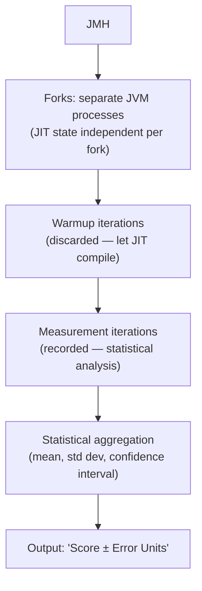
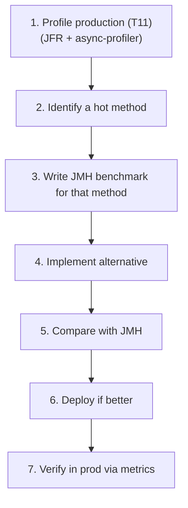
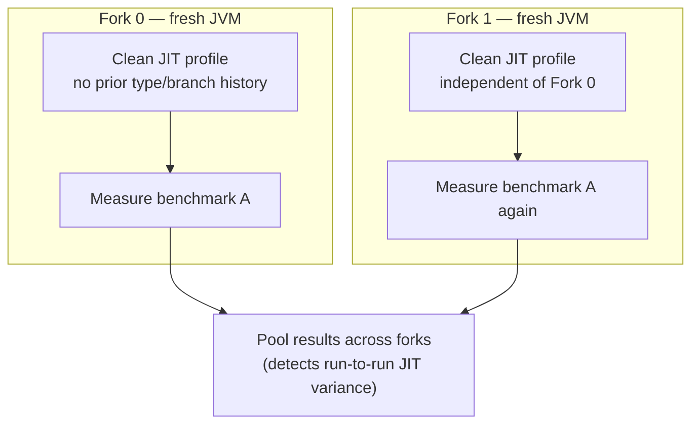

# Benchmarking with JMH

T11 covered profiling — finding *where* time goes in a running JVM. This topic covers benchmarking — measuring *how fast* a specific piece of code is, reliably enough to compare alternatives. The two are complementary: profiling identifies *what* to optimize; benchmarking validates *whether* an optimization actually helps. And benchmarking Java code *correctly* is dramatically harder than it looks, because the JIT (T04), GC (T07), and modern CPUs conspire to make naive `System.nanoTime()` benchmarks measure almost anything except what you intended. **JMH (Java Microbenchmark Harness)** — designed by Aleksey Shipilëv at Oracle, with help from Doug Lea, now an OpenJDK project — is the canonical tool that handles all the JVM gotchas: forks, warmup, dead code elimination, constant folding, statistical analysis. Using it is *the* difference between data-driven performance engineering and Twitter-style folk wisdom.

The depth-bar requirement isn't "use JMH." At the **why-benchmarks-are-hard** layer, the JVM has *many* mechanisms that defeat naive measurement — **JIT warmup** (Tier 0 interpreted is 10× slower than Tier 4 C2; if you measure before warmup, you measure the wrong thing), **dead code elimination** (if you don't *use* the result, the JIT removes the computation; the benchmark measures nothing), **constant folding** (if the input is a compile-time constant, the JIT precomputes; the benchmark measures the constant load), **JIT devirtualization** (a call that's monomorphic at benchmark time is inlined; in production with multiple types it's not). At the **JMH-mechanism** layer, JMH solves these via **separate JVM forks** (multiple JVMs, each with own JIT state — averaged for robustness), **warmup phases** (discarded iterations to let the JIT reach Tier 4), **measurement phases** (recorded iterations with statistical analysis), **`@State` objects** (input loaded from non-constant fields so the JIT can't fold), **black holes** (`Blackhole.consume(value)` that the JIT can't prove is dead, preventing DCE). At the **API** layer, JMH's annotation-driven design — `@Benchmark`, `@Warmup`, `@Measurement`, `@Fork`, `@BenchmarkMode(Mode.Throughput | AverageTime | SampleTime | SingleShotTime)`, `@State(Scope.Thread | Benchmark | Group)`, `@Setup`/`@TearDown` with `@Level.Trial | Iteration | Invocation`, `@Param` for parameterization, `@Threads` for multi-threaded — exposes all the knobs without requiring framework code. At the **integration** layer, JMH's built-in profilers (`-prof gc`, `-prof stack`, `-prof perfasm`, `-prof async`) combine measurement with profiling — answering not just "is A faster than B" but *why*. We will cover all four layers, including the canonical anti-patterns naive benchmarks fall into and how JMH neutralizes each.

> [!NOTE]
> Prerequisites: [Profiling (JFR, async-profiler, VisualVM)](./T11-profiling-jfr-async-profiler-visualvm.md) (L3/C02/T11) — profile first, benchmark candidates second; [JIT compilation](./T04-jit-compilation-c1-c2-tiered.md) (L3/C02/T04) — the JIT behaviors JMH neutralizes; [GC fundamentals](./T07-garbage-collection-fundamentals.md) (L3/C02/T07) — GC pauses introduce noise; [JVM architecture](./T01-jvm-architecture-and-runtime-data-areas.md) (L3/C02/T01) — code cache + interpreter + JIT context.

## Why Benchmarking Java Is Hard

A naive benchmark:

```java
long start = System.nanoTime();
for (int i = 0; i < 1_000_000; i++) {
    compute(i);
}
long elapsed = System.nanoTime() - start;
System.out.println(elapsed / 1_000_000 + " ns/op");
```

This is *almost always wrong*. Why?

| Pitfall | What goes wrong |
|---------|------------------|
| **No warmup** | First iterations are interpreted (T04 — Tier 0) at ~10× slower; measurement is dominated by them |
| **Dead code elimination** | If `compute(i)` returns a value not used, JIT removes the call entirely → measures nothing |
| **Constant folding** | If `compute(0)`, `compute(1)`, etc. are pure functions of constants, JIT precomputes → measures the constant load |
| **JIT devirtualization** | A monomorphic call site (one type seen) is inlined; in production with many types, it's a virtual call |
| **GC pauses** | A GC during measurement adds latency unrelated to `compute()` |
| **Cache state** | First iteration: cold cache (slow); steady state: hot cache (fast) — measurement averages both |
| **OS scheduling** | Process preempted, paged out, etc. — adds noise |
| **CPU frequency scaling** | Turbo Boost, throttling, P-state transitions add ~5–20% variance |

The cumulative result: naive benchmarks easily measure 10× or 100× wrong. The blog-post folklore "Method A is faster than Method B" is usually one of these mistakes.

## The Naive Benchmark Anti-Pattern

```java
public class NaiveBenchmark {
    public static void main(String[] args) {
        long start = System.nanoTime();
        for (int i = 0; i < 1_000_000; i++) {
            heavyComputation(i);   // ✗ return value discarded → DCE
        }
        long elapsed = System.nanoTime() - start;
        System.out.println(elapsed + " ns total");
    }

    static int heavyComputation(int x) { return x * x; }
}
```

What this *actually* measures: probably nothing — the JIT likely eliminates the entire loop after the first warmup iteration, because the result is never used.

What you *intended* to measure: per-call cost of `heavyComputation`.

The gap is JMH's reason for existing.

## JMH — the Canonical Solution

[JMH](https://openjdk.org/projects/code-tools/jmh/) is an OpenJDK project. Designed by Aleksey Shipilëv and Doug Lea, who built much of `java.util.concurrent`. Its purpose: **make benchmarks correct by default** by handling all the JVM gotchas.



## Setting Up JMH

Maven `pom.xml`:

```xml
<dependencies>
    <dependency>
        <groupId>org.openjdk.jmh</groupId>
        <artifactId>jmh-core</artifactId>
        <version>1.37</version>
    </dependency>
    <dependency>
        <groupId>org.openjdk.jmh</groupId>
        <artifactId>jmh-generator-annprocess</artifactId>
        <version>1.37</version>
        <scope>provided</scope>
    </dependency>
</dependencies>

<build>
    <finalName>benchmarks</finalName>
    <plugins>
        <plugin>
            <artifactId>maven-shade-plugin</artifactId>
            <executions>
                <execution>
                    <phase>package</phase>
                    <goals><goal>shade</goal></goals>
                    <configuration>
                        <transformers>
                            <transformer implementation="org.apache.maven.plugins.shade.resource.ManifestResourceTransformer">
                                <mainClass>org.openjdk.jmh.Main</mainClass>
                            </transformer>
                        </transformers>
                    </configuration>
                </execution>
            </executions>
        </plugin>
    </plugins>
</build>
```

Or use the JMH maven archetype:

```bash
mvn archetype:generate \
    -DinteractiveMode=false \
    -DarchetypeGroupId=org.openjdk.jmh \
    -DarchetypeArtifactId=jmh-java-benchmark-archetype \
    -DgroupId=com.example -DartifactId=bench -Dversion=1.0
```

## A Minimal Benchmark

```java
package com.example;

import java.util.concurrent.TimeUnit;
import org.openjdk.jmh.annotations.*;
import org.openjdk.jmh.infra.Blackhole;

@BenchmarkMode(Mode.AverageTime)
@OutputTimeUnit(TimeUnit.NANOSECONDS)
@State(Scope.Benchmark)
@Warmup(iterations = 5, time = 1)
@Measurement(iterations = 10, time = 1)
@Fork(3)
public class StringConcatBenchmark {

    @Param({"10", "100", "1000"})
    public int length;

    private String[] parts;

    @Setup(Level.Trial)
    public void setUp() {
        parts = new String[length];
        for (int i = 0; i < length; i++) parts[i] = "x" + i;
    }

    @Benchmark
    public String stringPlus() {
        String result = "";
        for (var p : parts) result = result + p;
        return result;
    }

    @Benchmark
    public String stringBuilder() {
        StringBuilder sb = new StringBuilder();
        for (var p : parts) sb.append(p);
        return sb.toString();
    }

    @Benchmark
    public String stringJoin() {
        return String.join("", parts);
    }
}
```

Compile and run:

```bash
mvn clean package
java -jar target/benchmarks.jar StringConcatBenchmark
```

JMH runs each `@Benchmark` for each value of `length`, with 3 forks × (5 warmup + 10 measurement iterations × 1 second) per benchmark/length combination.

## JMH Modes

```java
@BenchmarkMode(Mode.Throughput)        // ops per time unit (DEFAULT)
@BenchmarkMode(Mode.AverageTime)        // time per op
@BenchmarkMode(Mode.SampleTime)         // percentile-based: p50, p99, p999
@BenchmarkMode(Mode.SingleShotTime)     // single measurement (for cold/startup benchmarks)
@BenchmarkMode(Mode.All)                // all four
```

Pick based on the question:

- **Throughput** for "operations/sec" comparisons.
- **AverageTime** for "ns per call" comparisons.
- **SampleTime** for latency-sensitive code (gives percentiles).
- **SingleShotTime** for startup, cold cache, one-off measurements.

## The Annotations in Depth

### `@State` — where benchmark state lives

```java
@State(Scope.Thread)        // per-thread state (default)
@State(Scope.Benchmark)     // shared across all threads in benchmark
@State(Scope.Group)         // per-group state (for asymmetric multi-threaded benchmarks)
```

The class with `@State` holds inputs the benchmark needs. State fields are loaded fresh per iteration — *the JIT can't fold them as constants*. This is the JMH escape hatch from constant folding.

```java
@State(Scope.Benchmark)
public class S {
    public int value = 42;   // JIT sees this as a load, not a constant
}

@Benchmark
public int cube(S s) {
    return s.value * s.value * s.value;   // measures the cube, not the constant 74088
}
```

### `@Setup` and `@TearDown` — lifecycle hooks

```java
@Setup(Level.Trial)         // once per fork (default)
@Setup(Level.Iteration)     // once per iteration
@Setup(Level.Invocation)    // once per @Benchmark call — RARELY use (huge overhead)
public void prepareData() { ... }

@TearDown(Level.Trial)
public void cleanup() { ... }
```

`Level.Trial` is usually right. `Level.Invocation` adds setup latency to every measurement — only use when setup *must* be per-call (e.g., resetting state to consume a stream).

### `@Warmup` and `@Measurement` — iteration control

```java
@Warmup(iterations = 5, time = 1, timeUnit = TimeUnit.SECONDS)
@Measurement(iterations = 10, time = 1, timeUnit = TimeUnit.SECONDS)
```

5 warmup × 1s + 10 measurement × 1s = 15 seconds per benchmark per fork. Defaults are usually fine; tune if your benchmark is unstable or takes longer to warm up.

### `@Fork` — separate JVMs

```java
@Fork(3)         // 3 forks (separate JVM processes)
@Fork(0)         // no forks (same JVM) — DON'T USE for serious benchmarks
```

Each fork runs JMH from scratch — new JIT state, new GC state. **The default of 5 forks is rarely worth reducing.** Forks isolate the measurement from JIT contamination by prior benchmarks.

### `@Threads` — concurrency

```java
@Threads(4)            // 4 threads run the benchmark concurrently
@Threads(Threads.MAX)  // use available cores
```

For concurrent code benchmarks. State scope matters — `Scope.Thread` has separate state per thread; `Scope.Benchmark` has shared state.

### `@Param` — parameterization

```java
@Param({"10", "100", "1000", "10000"})
public int size;
```

JMH runs the benchmark for each value, collecting separate results. Cartesian product if multiple params.

### `@OperationsPerInvocation` — for batched work

```java
@OperationsPerInvocation(1000)
@Benchmark
public void batched(Blackhole bh) {
    for (int i = 0; i < 1000; i++) bh.consume(work(i));
}
```

Tells JMH the loop performs 1000 ops per invocation; result is per-op, not per-invocation.

## Black Holes — Preventing Dead Code Elimination

The JIT removes computations whose results are unused. `Blackhole.consume(value)` makes the JIT believe the value matters:

```java
@Benchmark
public void noResult() {
    compute();        // ✗ JIT removes the call
}

@Benchmark
public int returnResult() {
    return compute();  // ✓ JMH stores the return value via reflection-based wrapper
}

@Benchmark
public void blackhole(Blackhole bh) {
    bh.consume(compute());   // ✓ explicit consume; JIT can't optimize away
}

@Benchmark
public void multiple(Blackhole bh) {
    bh.consume(a());
    bh.consume(b());
    bh.consume(c());          // useful when you measure multiple things per call
}
```

Use `Blackhole` whenever you'd otherwise discard a return value. The `consume` method is implemented to be uninlinable and effectful — the JIT can't prove the consumed value isn't observed.

## Reading JMH Output

```text
Benchmark                                Mode  Cnt    Score    Error   Units
StringConcatBenchmark.stringPlus        avgt   30   1234.5 ±  10.2   ns/op
StringConcatBenchmark.stringBuilder     avgt   30    234.1 ±   3.5   ns/op
StringConcatBenchmark.stringJoin        avgt   30    156.7 ±   2.1   ns/op
```

Decoded:

- **Benchmark**: which method.
- **Mode**: `avgt` = AverageTime.
- **Cnt**: number of measurement iterations × forks (3 × 10 = 30).
- **Score**: mean.
- **Error**: 99.9% confidence interval (± value).
- **Units**: as configured (ns/op).

Interpretation:

- `stringJoin` (~157 ns) is ~7.9× faster than `stringPlus` (~1234 ns).
- Error bars don't overlap → statistically significant difference.
- If error were ± 100 ns, the difference would still be significant; if ± 1000 ns, less so.

## Statistical Analysis

JMH provides multiple measures:

```text
Result "Benchmark.method": 234.123 ±(99.9%) 3.456 ns/op [Average]
  (min, avg, max) = (215.789, 234.123, 255.123), stdev = 8.234
  CI (99.9%): [230.667, 237.580] (assumes normal distribution)
```

- **Average**: mean across all measurement iterations.
- **Min / Max**: extremes.
- **Standard deviation**: spread.
- **Confidence interval**: with 99.9% confidence, the true mean is in [230.667, 237.580].

For percentile-based modes:

```text
SampleTime
  p(50%) = 215 ns/op    ← median
  p(99%) = 312 ns/op    ← p99
  p(99.9%) = 543 ns/op  ← p999 (latency tail)
```

## Common Patterns

### Compare two implementations

```java
@Benchmark public int withHashMap() { ... }
@Benchmark public int withTreeMap() { ... }
```

JMH runs both, reports both, lets you compare.

### Parameterized scaling benchmark

```java
@Param({"10", "100", "1000", "10000", "100000"})
public int size;

@Benchmark
public int operation() { ... }    // run for each size
```

Tells you "how does performance scale with input size?"

### Multi-threaded benchmark

```java
@State(Scope.Benchmark)
@Threads(8)
public class ConcurrentBench {
    private AtomicInteger counter = new AtomicInteger();

    @Benchmark
    public int increment() {
        return counter.incrementAndGet();
    }
}
```

8 threads share the `counter`; measure throughput under contention.

### Asymmetric multi-threaded (group)

```java
@Group("producer-consumer")
@GroupThreads(2)
@Benchmark
public void produce(State s) { ... }

@Group("producer-consumer")
@GroupThreads(2)
@Benchmark
public void consume(State s) { ... }
```

Separate threads for producer and consumer roles.

## JMH Profilers — Built-in Integration

JMH ships several built-in profilers; combine with benchmark for *why* the benchmark is slow:

```bash
# GC profiler — allocation rate, GC time
java -jar benchmarks.jar -prof gc

# Stack profiler — sampled stack traces
java -jar benchmarks.jar -prof stack

# perfasm (Linux x86) — disassembled JIT'd code
java -jar benchmarks.jar -prof perfasm

# async-profiler integration
java -jar benchmarks.jar -prof async:output=flamegraph;dir=/tmp/profile
```

Output:

```text
Benchmark           Mode  Score    Error  Units
StringConcat.foo    avgt  234.1 ±  3.5   ns/op
StringConcat.foo:·gc.alloc.rate         avgt    1567.234 ± 50.123  MB/sec
StringConcat.foo:·gc.alloc.rate.norm    avgt     384.000 ±  0.001  B/op
StringConcat.foo:·gc.count              avgt      45.000               counts
StringConcat.foo:·gc.time               avgt     123.000               ms
```

Tells you allocation rate (1567 MB/sec, 384 bytes per op) and GC overhead. Crucial for evaluating allocation-heavy code.

## Output Formats for CI

```bash
# JSON output for tooling
java -jar benchmarks.jar -rf json -rff /tmp/results.json

# CSV output
java -jar benchmarks.jar -rf csv -rff /tmp/results.csv

# Console + JSON
java -jar benchmarks.jar -rf json -rff /tmp/results.json
```

CI integration:

1. Run benchmarks nightly or on PR.
2. Save JSON output as artifact.
3. Compare against baseline.
4. Alert on regression > N%.

Tools: [jmh-visualizer](https://jmh.morethan.io/) (paste JSON, get charts), custom CI scripts, OpenJDK's jmh-result-validator.

## Common Mistakes

### Single-fork "fast" runs

```bash
java -jar benchmarks.jar -f 0    # ✗ no forks — JIT state leaks between benchmarks
```

Default 5 forks are there for a reason. Don't reduce unless you really know why.

### Insufficient warmup

```java
@Warmup(iterations = 1, time = 1)   // ✗ likely Tier 3 not Tier 4
```

Defaults (5 × 1s) are good. Some benchmarks need more (10+ iterations for stable JIT).

### Microbenchmarking the wrong thing

```java
@Benchmark
public int hashMapPutSingle(State s) {
    return s.map.put(s.key, s.value);   // measures put() with cache hot
                                          // production has many keys, cache cold
}
```

Microbenchmarks measure *idealized* conditions. Real production has cache misses, contention, etc. Use microbenchmarks for *relative* comparisons, not absolute predictions.

### Ignoring noise

Quiet machine matters. Disable Turbo Boost / frequency scaling for stable measurement:

```bash
# Linux:
sudo cpupower frequency-set --governor performance
# Disable Turbo Boost:
echo 0 | sudo tee /sys/devices/system/cpu/intel_pstate/no_turbo
```

Run multiple times; if results vary, the machine is noisy.

### Comparing across hardware

Same benchmark, different machines → different numbers. Always compare on identical hardware (same machine, same time, ideally one after the other).

### Reading the wrong column

`Mode` matters: `thrpt` = throughput (higher = better); `avgt` = time per op (lower = better). Read the units and direction.

### Forgetting `@Param` cartesian explosion

```java
@Param({"a", "b", "c"})
public String x;
@Param({"1", "2", "3"})
public int y;
```

3 × 3 = 9 combinations, each running ~15 seconds × 5 forks = ~11 minutes per `@Benchmark`. Five benchmarks → ~1 hour total. Plan accordingly.

## JMH Limitations

- **Microbenchmarks aren't macro benchmarks.** Use JMH for "is A faster than B?"; not "how fast is my service?"
- **Production behavior may differ.** Memory pressure, lock contention, system noise — none captured in isolated microbenchmarks.
- **JMH can't measure what doesn't exist as a clean method.** Holistic system performance needs different tools (load testing, observability).
- **GC overhead can hide.** Use `-prof gc` to expose.

## The Right Benchmarking Workflow



The order matters:

- **Profile first** to identify the actual hot path. Don't benchmark without evidence.
- **Benchmark to compare alternatives**, not to predict absolute numbers.
- **Verify in production** — the benchmark may not match real workload.

## What JMH Can — and Cannot — Answer

### Can

- "Is `HashMap` faster than `TreeMap` for 1000 entries?"
- "How does my method scale with input size?"
- "Is `AtomicInteger.incrementAndGet()` slower than `LongAdder.increment()` under 32 threads?"
- "What's the per-op latency of my serializer?"
- "Does my optimization improve throughput?"

### Cannot

- "How fast is my whole service?" — use load tests.
- "Will my system scale to 10× users?" — use capacity planning + load tests.
- "Is GC pressure causing latency spikes?" — use APM + GC logs.
- "What's the right database query plan?" — use database EXPLAIN.

JMH is sharp for microbenchmarks. Use the right tool for the right question.

## A Real-World Example — HashMap vs TreeMap

```java
@BenchmarkMode(Mode.AverageTime)
@OutputTimeUnit(TimeUnit.NANOSECONDS)
@State(Scope.Benchmark)
@Warmup(iterations = 5, time = 1)
@Measurement(iterations = 10, time = 1)
@Fork(3)
public class MapBenchmark {

    @Param({"100", "10000", "1000000"})
    private int size;

    private Map<Integer, Integer> hashMap;
    private Map<Integer, Integer> treeMap;
    private int[] keysToLookup;

    @Setup
    public void setUp() {
        Random r = new Random(42);
        hashMap = new HashMap<>(size);
        treeMap = new TreeMap<>();
        keysToLookup = new int[1000];

        for (int i = 0; i < size; i++) {
            int k = r.nextInt();
            hashMap.put(k, i);
            treeMap.put(k, i);
        }
        // 1000 lookups (mix of present and absent)
        for (int i = 0; i < keysToLookup.length; i++) {
            keysToLookup[i] = r.nextInt();
        }
    }

    @Benchmark
    @OperationsPerInvocation(1000)
    public void hashMapGet(Blackhole bh) {
        for (int k : keysToLookup) bh.consume(hashMap.get(k));
    }

    @Benchmark
    @OperationsPerInvocation(1000)
    public void treeMapGet(Blackhole bh) {
        for (int k : keysToLookup) bh.consume(treeMap.get(k));
    }
}
```

Expected results:

```text
Benchmark                Size       Mode  Cnt  Score   Error  Units
MapBench.hashMapGet      100        avgt   30   25.3 ± 0.5   ns/op
MapBench.treeMapGet      100        avgt   30   85.2 ± 1.2   ns/op
MapBench.hashMapGet      10000      avgt   30   30.1 ± 0.7   ns/op
MapBench.treeMapGet      10000      avgt   30  165.4 ± 2.3   ns/op
MapBench.hashMapGet      1000000    avgt   30   45.7 ± 1.5   ns/op
MapBench.treeMapGet      1000000    avgt   30  340.8 ± 5.1   ns/op
```

HashMap is consistently ~3-7× faster. TreeMap's O(log n) shows in the scaling (85 → 340 ns as size goes 100 → 1M, ~3-4× growth). HashMap stays roughly constant (~25-45 ns), as expected for O(1) amortized.

Conclusion: pick HashMap unless you need sorted iteration.

## A Step-by-Step JMH Walkthrough — From Empty Folder to First Verdict

The sections above are a reference. This one is a *tutorial*: we build a working benchmark project from nothing, run it, and read the verdict, narrating every decision. Treat it as a guided lap before you race solo.

### Step 1 — Scaffold the Project

The fastest correct start is the official Maven archetype. It generates a `pom.xml` already wired with the annotation processor and shade plugin (the same machinery the [Setting Up JMH](#setting-up-jmh) section described — the archetype just saves you the copy-paste):

```bash
mvn archetype:generate \
    -DinteractiveMode=false \
    -DarchetypeGroupId=org.openjdk.jmh \
    -DarchetypeArtifactId=jmh-java-benchmark-archetype \
    -DarchetypeVersion=1.37 \
    -DgroupId=com.example -DartifactId=jmh-tutorial -Dversion=1.0
cd jmh-tutorial
```

You now have `src/main/java/com/example/MyBenchmark.java` and a runnable build. Why an archetype instead of hand-adding a dependency? Because JMH *requires* an annotation processor (`jmh-generator-annprocess`) to read your `@Benchmark` methods at compile time and generate the synthetic loop harness around each one. Forget the processor and your benchmarks compile but silently do nothing at run time — the classic "I added JMH and it found zero benchmarks" beginner trap.

If you prefer Gradle, the community [`me.champeau.jmh`](https://github.com/melix/jmh-gradle-plugin) plugin wires the same pieces:

```groovy
// build.gradle
plugins {
    id 'java'
    id 'me.champeau.jmh' version '0.7.2'
}

jmh {
    fork = 3
    warmupIterations = 5
    iterations = 10
}
```

Put benchmarks under `src/jmh/java` and run `./gradlew jmh`. The plugin handles the annotation processor and produces the fat JAR for you.

> [!NOTE]
> One project layout decision matters more than the build tool: keep benchmarks in a **separate source set / module** from production code. Benchmarks are throwaway measurement scaffolding; you don't want `jmh-core` on your application's runtime classpath, and you don't want benchmark code polluting your coverage reports. The archetype gives you a standalone module by default — keep it that way.

### Step 2 — Write Your First `@Benchmark`

We will benchmark a real, relatable question: *is `Math.floorMod(x, n)` slower than the naive `((x % n) + n) % n` idiom for safely wrapping a possibly-negative index into an array?* (Think a ring buffer or a hash that can go negative.)

```java
package com.example;

import java.util.concurrent.TimeUnit;
import org.openjdk.jmh.annotations.*;

@BenchmarkMode(Mode.AverageTime)
@OutputTimeUnit(TimeUnit.NANOSECONDS)
@State(Scope.Thread)
@Warmup(iterations = 5, time = 1, timeUnit = TimeUnit.SECONDS)
@Measurement(iterations = 5, time = 1, timeUnit = TimeUnit.SECONDS)
@Fork(2)
public class WrapBenchmark {

    // Inputs live in @State fields so the JIT cannot constant-fold them.
    private int x;
    private int n;

    @Setup(Level.Trial)
    public void setUp() {
        x = -987_654_321;   // a value that exercises the negative branch
        n = 1024;
    }

    @Benchmark
    public int floorMod() {
        return Math.floorMod(x, n);
    }

    @Benchmark
    public int manualIdiom() {
        return ((x % n) + n) % n;
    }
}
```

Notice the discipline already baked in: inputs come from fields (Step-by-step constant-folding defence, covered in detail below), and each method **returns** its result so JMH can defeat dead-code elimination for us. We have not written a single line of timing code — that is the entire point. You describe *what* to measure; JMH owns *how*.

### Step 3 — Choose the `@BenchmarkMode` Deliberately

The [JMH Modes](#jmh-modes) reference listed the four modes. The tutorial question is: *which one answers the question you actually have?* Each measures a fundamentally different statistic:

| Mode | What it literally measures | Reports | Use when the question is… |
|------|---------------------------|---------|----------------------------|
| `Throughput` (default) | How many `@Benchmark` calls complete per time unit, counted over the whole iteration | ops/sec (higher = better) | "Which one does more work per second?" |
| `AverageTime` | Total iteration time ÷ number of calls | time/op (lower = better) | "What's the average cost of one call?" |
| `SampleTime` | Times *individual* calls and builds a distribution | p50/p90/p99/p999 percentiles | "What does the latency *tail* look like?" |
| `SingleShotTime` | Times exactly one call, with no steady-state warmup of the measured invocation | time for one cold call | "How expensive is the *first* call — startup / cold cache?" |

`Throughput` and `AverageTime` are reciprocals of the same steady-state truth and are what you reach for 90% of the time. The subtle one is `SampleTime`: because it timestamps each call individually it captures variance a single averaged number hides — two methods can share an identical average yet have wildly different p999, and for anything user-facing the tail is the story. `SingleShotTime` deliberately *skips* steady-state warmup of the measured call, which makes it the right (and only honest) tool for measuring class-loading, first-call JIT cost, or cold-cache behaviour — exactly the things the other three modes are designed to warm away.

For our wrap question we want the per-call cost, so `Mode.AverageTime` is correct.

### Step 4 — Understand `@Warmup`, `@Measurement`, and Especially `@Fork`

```java
@Warmup(iterations = 5, time = 1, timeUnit = TimeUnit.SECONDS)
@Measurement(iterations = 5, time = 1, timeUnit = TimeUnit.SECONDS)
@Fork(2)
```

`@Warmup` runs iterations whose results are **thrown away** — their sole job is to drive the JIT through Tier 0 (interpreter) → Tier 1/2/3 (C1) → Tier 4 (C2), so that the *measured* iterations time fully optimized code (T04). `@Measurement` runs iterations that are **recorded** and fed to the statistics engine. Five-by-one-second each is a sane default; widen warmup if the score is still drifting upward across the first measurement iterations (a tell-tale sign you're still measuring C1).

`@Fork(2)` is the load-bearing annotation people most often misunderstand. A *fork* is a brand-new JVM process. Two forks means JMH runs the entire warmup+measurement cycle twice, in two freshly-launched JVMs, and pools the results. Why pay for that?



The JIT is **profile-guided**: it records which branches are taken, which types flow through a call site, how loops behave — *for this process* — and compiles accordingly. If you run benchmark A and then benchmark B in the *same* JVM, B inherits a code cache and profile shaped by A. Worse, the JIT sometimes makes a *lucky* or *unlucky* speculative decision (e.g. assuming a branch is never taken) that holds for an entire process lifetime. Run once and you might immortalize that single lucky compilation as "the result." Forking re-rolls the dice in a clean JVM each time; pooling across forks surfaces run-to-run variance as a wider error bar instead of hiding it as a confident-but-wrong score. **This is why `@Fork(0)` is a footgun and the project default is several forks.** The cost is wall-clock time; the payoff is a number you can trust.

### Step 5 — Pick `@State` Scope to Match the Concurrency Story

`@State` was introduced in [The Annotations in Depth](#state--where-benchmark-state-lives); the tutorial framing is *which scope tells the truth for your scenario*:

- **`Scope.Thread`** — every benchmark thread gets its *own* `@State` instance. This is the honest default for single-threaded measurement and for "embarrassingly parallel, no shared state" code. Each thread hammers private data; no accidental cross-thread cache traffic creeps into the number.
- **`Scope.Benchmark`** — *one* `@State` instance shared by all threads. This is what you want when the *contention itself* is the thing under test: a shared `AtomicLong`, a `ConcurrentHashMap`, a lock. Use it with `@Threads(N)` to measure how an implementation degrades under concurrent access.
- **`Scope.Group`** — one instance per *group* of threads, for *asymmetric* benchmarks where different threads play different roles (producer vs consumer, reader vs writer). Pair with `@Group` / `@GroupThreads` so, say, 2 threads call `produce` and 2 call `consume` against the same shared queue.

Choosing the wrong scope quietly changes the question. `Scope.Thread` on a shared-counter benchmark measures uncontended single-thread cost (useless for a contention claim); `Scope.Benchmark` on stateless code adds phantom false-sharing noise (see the pitfalls below). Scope is not a tuning knob — it is part of the *specification* of what you're measuring.

### Step 6 — Run It and Read the Verdict

```bash
mvn clean package
java -jar target/benchmarks.jar WrapBenchmark
```

Output (numbers illustrative, from a quiet laptop):

```text
Benchmark                  Mode  Cnt   Score   Error  Units
WrapBenchmark.floorMod     avgt   10   2.13  ± 0.06   ns/op
WrapBenchmark.manualIdiom  avgt   10   1.41  ± 0.04   ns/op
```

Read it like a sentence: *over 10 measurement iterations (5 each across 2 forks), `manualIdiom` averaged 1.41 ns/op and `floorMod` averaged 2.13 ns/op.* The manual idiom is ~1.5× faster here because `Math.floorMod` includes extra sign-handling and a method-call boundary the two raw `%` operations skip.

But the **Score is only half the result — the Error is the other half, and the more important half.** The `± 0.06` and `± 0.04` are the 99.9% confidence half-widths. The intervals are roughly `[2.07, 2.19]` and `[1.37, 1.45]` — they do **not** overlap, so the difference is *statistically significant*: we can report "manualIdiom is faster" with confidence. Had the output instead read `floorMod 2.13 ± 0.9` and `manualIdiom 1.41 ± 0.9`, the intervals would overlap massively and the only honest conclusion would be **"no measurable difference — the run was too noisy to tell them apart."** A score without its error bar is not a measurement; it is a rumour. Always quote both, and never declare a winner whose error bars overlap the loser's.

## Microbenchmarking Pitfalls That Silently Invalidate Results

Here is the uncomfortable truth that makes JMH necessary: **a broken microbenchmark does not crash or warn you — it cheerfully prints a precise, confident, wrong number.** The danger is not noise (noise widens the error bar, which you can see); the danger is the optimizations that make the benchmark measure *something other than what you wrote*, while the error bar stays reassuringly tight. This section walks each classic trap with a before/after, and shows which JMH API neutralizes it.

> [!INTERVIEW]
> A staff-level favourite: *"You wrote a microbenchmark and method X came out 1000× faster than method Y. What's your first hypothesis?"* The expected answer is **not** "X is a better algorithm" — it's **"X was probably dead-code-eliminated or constant-folded, so I measured nothing."** A 1000× gap in a microbenchmark is almost never a real algorithmic win; it is the JIT having deleted the work. The follow-up: name the defences — return the value or `Blackhole.consume` it (DCE), read inputs from `@State` (constant folding), confirm warmup reached C2 (`-prof perfasm` / printing compilation), and check the error bars. Candidates who instantly reach for "it was optimized away" signal real benchmarking scars.

### A Relatable Analogy

Imagine timing how fast a narrator can read a book aloud — to estimate printing-press throughput. But this narrator has *memorized* the book and the publisher, knowing the ending is never checked, simply *skips printing the last 300 pages*. Your stopwatch reads "incredibly fast!" and you proudly conclude the press is amazing. You measured neither reading nor printing — you measured a shortcut taken precisely *because* nobody inspects the output. That is **dead-code elimination** (the unread output gets skipped) and **constant folding** (the memorized text needs no work) in one image. JMH's job is to be the strict editor who insists every page is actually printed and that the narrator is handed a *fresh, unseen* book each time — so your stopwatch times the real work.

### Pitfall 1 — Dead-Code Elimination (DCE)

If nothing observes a computation's result, the JIT is *entitled* to delete the computation entirely. Your loop becomes an empty loop; you time nothing.

```java
// ✗ BEFORE — the multiply is dead; the JIT removes it.
@Benchmark
public void broken() {
    int sum = 0;
    for (int i = 0; i < data.length; i++) {
        sum += data[i] * data[i];   // 'sum' is never read after the loop
    }
    // sum is discarded → whole loop is provably dead → deleted
}
```

```java
// ✓ AFTER — return the result so JMH's generated harness consumes it.
@Benchmark
public int fixedByReturn() {
    int sum = 0;
    for (int i = 0; i < data.length; i++) {
        sum += data[i] * data[i];
    }
    return sum;   // JMH stores returned values where the JIT can't prove them dead
}

// ✓ AFTER (multiple values) — Blackhole.consume each one.
@Benchmark
public void fixedByBlackhole(Blackhole bh) {
    for (int i = 0; i < data.length; i++) {
        bh.consume(data[i] * data[i]);   // each product is "observed"
    }
}
```

**Defence:** return the single result, or `Blackhole.consume(...)` for several. As [Black Holes](#black-holes--preventing-dead-code-elimination) explained, `Blackhole.consume` is engineered to be uninlinable and to have side effects the JIT cannot prove irrelevant, so the value must actually be produced. **Symptom to recognize:** an absurdly fast, suspiciously *zero-variance* score (e.g. `0.3 ± 0.0 ns/op` for "real work") — the hallmark of an emptied loop.

### Pitfall 2 — Constant Folding

If an input is a compile-time constant (or a `final` / effectively-constant value the JIT can prove), the JIT precomputes the whole expression at compile time. You then time loading a cached constant, not the operation.

```java
// ✗ BEFORE — 'x' is a constant; sqrt(2.0) is folded to a literal at compile time.
@Benchmark
public double broken() {
    double x = 2.0;
    return Math.sqrt(x);   // becomes 'return 1.4142135623730951;'
}
```

```java
// ✓ AFTER — read the input from a @State field the JIT must treat as unknown.
@State(Scope.Thread)
public static class In {
    public double x = 2.0;   // a mutable field → not a compile-time constant
}

@Benchmark
public double fixed(In in) {
    return Math.sqrt(in.x);   // genuinely computes sqrt every call
}
```

**Defence:** never feed literals into the operation under test — route every input through a non-`final` `@State` field, exactly as the tutorial's `WrapBenchmark` did. **Symptom:** the benchmark is implausibly fast *and* flat across `@Param` values that should clearly cost different amounts (because they were all folded to constants).

### Pitfall 3 — Loop Unrolling and Loop Optimizations

If *you* write the repetition loop inside the `@Benchmark` body, the JIT optimizes *that loop* — unrolling it, hoisting invariants out of it, even vectorizing it — none of which reflects how the operation is called one-at-a-time in production. You end up benchmarking the JIT's loop optimizer, not your code.

```java
// ✗ BEFORE — hand-rolled repeat loop; JIT unrolls/hoists/vectorizes it.
@Benchmark
public long broken(In in) {
    long acc = 0;
    for (int i = 0; i < 10_000; i++) {
        acc += hash(in.value);   // hash(in.value) is loop-invariant → hoisted out!
    }
    return acc;                  // you measured 1 hash + 10_000 adds, not 10_000 hashes
}
```

```java
// ✓ AFTER — let JMH be the loop. One operation per @Benchmark invocation.
@Benchmark
public long fixed(In in) {
    return hash(in.value);   // JMH's generated harness handles the repetition correctly
}
```

**Defence:** put **one** operation in the `@Benchmark` method and let JMH's generated outer loop do the repeating — its loop is specifically written to resist hoisting and unrolling distortions. When you genuinely must batch (e.g. the per-call overhead would dominate a sub-nanosecond op), use a real, `Blackhole`-fed loop and declare `@OperationsPerInvocation(N)` so the score is reported per-op (see [`@OperationsPerInvocation`](#operationsperinvocation--for-batched-work)). **Symptom:** the per-op cost collapses unrealistically as you increase the internal loop count — the optimizer found more to hoist.

### Pitfall 4 — Insufficient Warmup (Measuring the Interpreter or C1, Not C2)

Fresh code starts interpreted (Tier 0), gets C1-compiled (Tiers 1–3), and only reaches the fully-optimizing C2 compiler (Tier 4) after enough invocations (T04). Measure too early and you time the interpreter or C1 — often 2–10× slower than the steady state your production server actually runs.

```java
// ✗ BEFORE — one short warmup iteration; very likely still C1, not C2.
@Warmup(iterations = 1, time = 100, timeUnit = TimeUnit.MILLISECONDS)
@Measurement(iterations = 5, time = 1)
```

```java
// ✓ AFTER — enough warmup to settle into C2 before measuring.
@Warmup(iterations = 5, time = 1, timeUnit = TimeUnit.SECONDS)
@Measurement(iterations = 5, time = 1, timeUnit = TimeUnit.SECONDS)
```

**Defence:** generous warmup, and *verify* it. Two checks: (1) watch the per-iteration scores during warmup — if they keep dropping into the measurement phase, you warmed up too little; (2) run with `-prof perfasm` (Linux x86) or add `-XX:+PrintCompilation` via `@Fork(jvmArgsAppend = "-XX:+PrintCompilation")` and confirm the hot method shows a Tier-4 compile *before* measurement begins. **Symptom:** the first measurement iteration is markedly slower than the last, and the error bar is wide because of the downward drift.

### Pitfall 5 — The On-Stack Replacement (OSR) Surprise

OSR is a special, *lower-quality* compilation the JVM uses to optimize a method **while it is still executing inside a long-running loop** — it swaps optimized code onto the live stack frame mid-loop. OSR-compiled code is generally *worse* than the standard compilation a method gets when it's entered fresh after warmup, because OSR can't make all the same assumptions. The trap: a hand-written benchmark loop (Pitfall 3) is exactly the long-running loop that triggers OSR, so you end up measuring OSR'd code that *no normal call path in production would ever run*.

```java
// ✗ BEFORE — the giant internal loop gets OSR-compiled mid-flight (worse code).
@Benchmark
public double broken(In in) {
    double acc = 0;
    for (int i = 0; i < 100_000_000; i++) {   // long enough to trigger OSR
        acc += Math.log(in.x + i);
    }
    return acc;   // measures OSR code, not the normal post-warmup compilation
}
```

```java
// ✓ AFTER — no long internal loop, so the method is compiled normally on entry.
@Benchmark
public double fixed(In in) {
    return Math.log(in.x);   // JMH calls this many times; it gets a clean C2 compile
}
```

**Defence:** the same rule as Pitfall 3 — *don't write the loop yourself*. Letting JMH drive the repetition means each `@Benchmark` invocation is a normal method entry that earns a standard (non-OSR) C2 compilation, which is what production actually executes. **Symptom:** results that disagree with an equivalent benchmark that lets JMH loop, especially a benchmark that looks "too slow" given the operation.

### Pitfall 6 — False Sharing Across Threads

When two threads write to two *different* fields that happen to live on the **same 64-byte CPU cache line**, the cache-coherence protocol forces the whole line to ping-pong between cores on every write — even though the threads never touch the same variable. The result is contention that exists only because of *memory layout*, not logic, and it can dominate a multi-threaded benchmark's number.

```java
// ✗ BEFORE — both counters likely share one cache line → false sharing.
@State(Scope.Benchmark)
public static class Counters {
    long a;   // thread 1 writes this
    long b;   // thread 2 writes this — same cache line as 'a' → ping-pong
}
```

```java
// ✓ AFTER — @Contended pads each field onto its own cache line.
@State(Scope.Benchmark)
public static class Counters {
    @jdk.internal.vm.annotation.Contended long a;
    @jdk.internal.vm.annotation.Contended long b;
}
// Run with: -XX:-RestrictContended   (so @Contended takes effect outside the JDK)
```

**Defence:** be aware that `Scope.Benchmark` shared state can introduce false sharing the *application* wouldn't have, and pad hot independently-written fields with `@Contended` (the same mechanism `LongAdder`'s cells use internally). **Symptom:** a multi-threaded benchmark scales *negatively* (gets slower as you add threads) on logic that has no real shared dependency — a fingerprint of cache-line contention rather than algorithmic contention.

### Pitfall 7 — GC Noise

A garbage collection pause that lands inside a measurement iteration adds latency that has nothing to do with the operation's *steady-state* cost — but everything to do with how much it *allocates*. Ignoring it produces a misleadingly low average punctuated by invisible spikes, or run-to-run jitter you can't explain.

```bash
# ✓ Expose it: the GC profiler reports allocation rate AND normalized bytes/op.
java -jar target/benchmarks.jar WrapBenchmark -prof gc
```

```text
Benchmark                              Mode  Cnt    Score    Error  Units
StringConcat.plus                      avgt   10  1234.5 ± 10.2   ns/op
StringConcat.plus:·gc.alloc.rate.norm  avgt   10   512.0 ±  0.1   B/op   ← allocates per call
StringConcat.builder                   avgt   10   234.1 ±  3.5   ns/op
StringConcat.builder:·gc.alloc.rate.norm avgt 10    80.0 ±  0.1   B/op   ← far less garbage
```

**Defence:** always run allocation-sensitive comparisons with `-prof gc` and read `gc.alloc.rate.norm` (bytes allocated per operation) — it is *deterministic* and immune to GC timing luck, so it often tells a cleaner story than the raw score. Where appropriate, size the heap generously (`-Xmx`) so GC fires less during measurement, and report bytes/op alongside ns/op. **Symptom:** wide, lumpy error bars on allocation-heavy code; the average shifts when you change heap size.

### Pitfall 8 — Measuring the Wrong Thing (Setup Bleed and Devirtualization)

Two subtler "wrong target" traps. First, **setup bleed**: work you meant to do *once* leaks into the measured path. Second, **monomorphic devirtualization**: a call site that sees exactly *one* implementing type at benchmark time gets inlined into a direct call, whereas production — which sees several types — pays for a real virtual dispatch.

```java
// ✗ BEFORE — list rebuilt inside the timed method → measuring allocation+fill, not sort.
@Benchmark
public List<Integer> brokenSort() {
    List<Integer> list = makeRandomList(10_000);   // setup work, timed by accident
    Collections.sort(list);
    return list;
}
```

```java
// ✓ AFTER — build once in @Setup; the timed path is only the operation of interest.
@State(Scope.Thread)
public static class Data {
    int[] values;
    @Setup(Level.Invocation)   // fresh per call ONLY because sort mutates in place
    public void make() { values = randomArray(10_000); }
}

@Benchmark
public int[] fixedSort(Data d) {
    Arrays.sort(d.values);   // now we time the sort, not the array creation
    return d.values;
}
```

For devirtualization, defeat the JIT's monomorphic shortcut by feeding the benchmark a realistic *mix* of types (e.g. via `@Param` selecting different implementations), or pin compilation behaviour with `@CompilerControl`:

```java
@Benchmark
@CompilerControl(CompilerControl.Mode.DONT_INLINE)   // force a real call boundary
public int dispatch(In in) {
    return in.strategy.apply(in.x);   // measured as a genuine virtual call
}
```

**Defence:** keep one-time work in `@Setup` (mind the `@Level` — `Invocation` only when the op mutates its input, since per-call setup is costly and itself adds latency), and reach for `@CompilerControl(Mode.DONT_INLINE)` (or a polymorphic `@Param` mix) when the production call site is genuinely virtual. **Symptom:** a benchmark that's faster than physically plausible for the work described, or one whose result evaporates the moment you introduce a second implementing class.

### A Real-World Cautionary Tale

A team once "proved" their shiny new hashing function was **~1000× faster** than the incumbent and nearly shipped it on that basis. The benchmark looped a million times computing `hash(CONSTANT)` and discarded the result. Both pitfalls fired at once: the input was a literal, so the JIT **constant-folded** the entire computation to a single precomputed value; and the value was never used, so **dead-code elimination** deleted even that. The "new" benchmark happened to fold to a slightly cheaper constant-load pattern, hence the magic 1000×. The function had been optimized *entirely away* — they had benchmarked an empty loop against a slightly-less-empty loop. Rerun under JMH, with the input read from `@State` and the result returned, the two functions were within 4% of each other. The lesson the team posted on their wall: **"A microbenchmark result you can't explain mechanistically is a bug in the benchmark until proven otherwise."**

## When JMH Is the Wrong Tool

JMH is a *micro*-benchmark harness: it excels at "is operation A faster than operation B?" measured in nanoseconds-to-microseconds, in isolation, on a quiet machine. It is the wrong instrument the moment your question is about a *system* rather than an *operation*:

- **"How many requests per second can my service handle before p99 latency breaches the SLO?"** — that is a **load-testing** question. Reach for Gatling, k6, JMeter, or `wrk` driving the service end-to-end over the network, with realistic concurrency, payloads, think-times, and connection pools. JMH cannot model the OS network stack, the database round-trips, the connection-pool saturation, or the GC behaviour under sustained real traffic.
- **"Where does latency go *under load*, and how fat is the tail at saturation?"** — load tests measure the tail you actually serve; a JMH `SampleTime` microbenchmark measures the tail of one *operation* in isolation, which is a different (and usually far rosier) distribution than the tail of a whole request path under contention.
- **"Will the system stay healthy for 48 hours?"** — soak/endurance and capacity tests catch slow leaks, fragmentation, and cache-eviction storms that a 15-second JMH run never sees.
- **"Why is *this method* hot in production?"** — that's a **profiling** question ([T11 — Profiling](./T11-profiling-jfr-async-profiler-visualvm.md)), not a benchmarking one. Profile first to find the hot path, *then* write a JMH benchmark to compare candidate fixes for that specific method.

The clean mental model: **profile to find *what* to optimize (T11) → JMH to compare *how* to optimize a specific operation → load-test to validate the *system* still meets its SLO** end-to-end. The full systematic loop — choosing the right tool per question, the USE method, regression prevention — is the subject of [T13 — Performance tuning methodology](./T13-performance-tuning-methodology.md). Using JMH to answer a whole-system throughput question is like using a micrometer to measure a football field: exquisitely precise about entirely the wrong thing.

## Practice

1. **Reproduce the naive anti-pattern.** Write a `System.nanoTime()` benchmark that "measures" something obviously dead-code-eliminated. Observe nonsensical results. Convert to JMH; observe correct measurements.
2. **String concat comparison.** Implement string-plus, StringBuilder, String.join. Benchmark with `@Param({"10", "100", "1000"})`. Identify the crossover.
3. **HashMap vs TreeMap (above).** Run the example. Verify results scale as expected.
4. **AtomicInteger vs LongAdder.** Build a counter benchmark with `@Threads(8)`. Compare. Observe LongAdder wins under contention.
5. **DCE trap.** Write a benchmark without using the return value. Run with `-prof stack`; observe the method isn't even sampled.
6. **Constant folding trap.** Hard-code an input vs load from `@State`. Compare timings; verify state version measures the real op.
7. **`@Param` scaling.** Run a benchmark with `@Param({"1", "10", "100", "1000", "10000"})`. Plot the results.
8. **Multi-threaded contention.** Synchronized vs ReentrantLock vs StampedLock under 4 threads. Identify the contention profiles.
9. **`-prof gc` for allocation analysis.** Benchmark string-plus (allocates) vs StringBuilder (reuses). Compare `gc.alloc.rate.norm`.
10. **`-prof async` for flame graphs.** Run a benchmark with async-profiler integration. Identify hot self-time.
11. **CI integration.** Save JSON output; build a small script that compares against a baseline; alert on > 10% regression.
12. **Cross-mode comparison.** Run a benchmark with `Mode.All`. Compare throughput vs average time vs sample percentiles — same measurement, different views.
13. **Scaffold from scratch.** Generate a project with the JMH Maven archetype (or the `me.champeau.jmh` Gradle plugin), write the `WrapBenchmark` (`Math.floorMod` vs the `((x % n) + n) % n` idiom), run it, and report whether the error bars overlap.
14. **Make the error bar speak.** Take any stable benchmark and deliberately make it noisy (run other CPU-heavy work alongside, or set `@Fork(1)` with `@Measurement(iterations = 2)`). Watch the error widen until you can no longer declare a winner — internalize that the score is meaningless without its error bar.
15. **DCE forensics.** Write the dead `sum += data[i]*data[i]` loop with the result discarded. Confirm the absurd near-zero, zero-variance score. Fix it once by returning the value and once with `Blackhole.consume`; verify both give the same realistic number.
16. **Constant-folding A/B.** Benchmark `Math.sqrt(2.0)` (literal) vs `Math.sqrt(in.x)` (`@State` field). Confirm the literal version is implausibly fast and flat; the state version computes real work.
17. **OSR / loop trap.** Write a benchmark with a 100-million-iteration internal loop, then an equivalent that lets JMH do the looping. Compare and explain the divergence in terms of hoisting/OSR.
18. **False-sharing demo.** Build a two-thread `Scope.Benchmark` counter benchmark with two adjacent `long` fields; measure, then add `@jdk.internal.vm.annotation.Contended` (with `-XX:-RestrictContended`) and re-measure. Quantify the false-sharing penalty.
19. **GC noise via `gc.alloc.rate.norm`.** Compare string-plus vs `StringBuilder` with `-prof gc`. Report bytes/op and explain why the normalized allocation figure is more trustworthy than the raw timing under GC jitter.
20. **Warmup verification.** Add `@Fork(jvmArgsAppend = "-XX:+PrintCompilation")` to a benchmark and confirm the hot method reaches a Tier-4 (C2) compile *before* the measurement phase; then cut warmup to 1 short iteration and observe the score drift.
21. **Wrong-tool reflection.** Take a "how many req/s can my REST endpoint serve?" question and sketch why JMH cannot answer it; outline the equivalent Gatling/k6 load test instead (tie back to [T13](./T13-performance-tuning-methodology.md)).

## Recap

You should now be able to:

- Defend **why naive benchmarks are usually wrong**: JIT warmup, dead code elimination, constant folding, JIT devirtualization, GC noise, cache state, system noise, CPU frequency scaling.
- Use **JMH** as the canonical solution: handles forks (separate JVM processes), warmup (discarded iterations to reach Tier 4 C2), measurement (recorded iterations), statistical analysis.
- Set up JMH via Maven (jmh-core + jmh-generator-annprocess) or the JMH archetype; package via maven-shade-plugin; run via `java -jar benchmarks.jar`.
- Choose the right **`@BenchmarkMode`**: Throughput (ops/sec, default), AverageTime (time/op), SampleTime (percentiles p50/p99/p999), SingleShotTime (cold/startup), All.
- Apply the **annotations** correctly: `@State` (Scope.Thread default, Benchmark for shared, Group for asymmetric), `@Setup`/`@TearDown` (Level.Trial default, rarely Iteration or Invocation), `@Warmup`/`@Measurement` (defaults work), `@Fork` (default 5 — don't reduce), `@Threads`, `@Param`, `@OperationsPerInvocation` for batching.
- Use **`Blackhole.consume(value)`** to prevent dead code elimination; recognize the DCE trap when you discard a return value.
- Use **`@State`-field-loaded inputs** to prevent constant folding; recognize the constant-folding trap when inputs are compile-time constants.
- **Read JMH output**: Mode / Cnt / Score / Error / Units columns; non-overlapping error bars = statistically significant difference; percentile views for latency.
- Recognize **statistical analysis**: mean, min/max, standard deviation, 99.9% confidence interval; what they mean.
- Apply **common patterns**: compare two implementations, parameterized scaling with `@Param`, multi-threaded with `@Threads`, asymmetric with `@Group`/`@GroupThreads`.
- Use **JMH built-in profilers** for combined measurement: `-prof gc` (allocation rate, GC overhead), `-prof stack` (sampled stack traces), `-prof perfasm` (disassembled JIT'd asm on Linux x86), `-prof async` (async-profiler integration for flame graphs).
- Output to **JSON / CSV** for CI integration; compare against baseline; alert on regression.
- Avoid the **7 common mistakes**: single-fork "fast" runs, insufficient warmup, microbenchmarking the wrong thing, ignoring system noise, cross-hardware comparisons, reading the wrong column, `@Param` cartesian explosion.
- Recognize **JMH limitations**: microbenchmarks aren't macro benchmarks; production behavior differs; system-level questions need different tools.
- Apply the **right workflow**: profile production first (T11), identify hot path, write JMH benchmark to compare alternatives, deploy if better, verify in prod metrics.
- Distinguish **what JMH can answer** (microbenchmark comparisons) from **what it cannot** (whole-service performance, scaling, GC behavior in prod).
- **Scaffold a JMH project end-to-end**: Maven archetype (or the `me.champeau.jmh` Gradle plugin) → first `@Benchmark` returning its result → deliberate `@BenchmarkMode` choice (Throughput/AverageTime/SampleTime/SingleShotTime and what each *literally* measures) → tuned `@Warmup`/`@Measurement` → and the *why* of `@Fork` (each fork is a fresh JVM with an independent profile-guided JIT, so forking isolates and re-rolls compilation luck instead of immortalizing one lucky compile).
- Treat the **error bar as half the result**: non-overlapping 99.9% confidence intervals = a real difference; overlapping intervals = "too noisy to call a winner"; a score quoted without its error is a rumour, not a measurement.
- Recognize and defend against the **microbenchmarking pitfalls** that print confident-but-wrong numbers: **dead-code elimination** (return / `Blackhole.consume`), **constant folding** (inputs from non-`final` `@State`, never literals), **loop unrolling / hoisting / vectorization** (let JMH be the loop; `@OperationsPerInvocation` for honest batching), **insufficient warmup** measuring interpreter/C1 not C2 (verify via score drift and `-XX:+PrintCompilation`/`-prof perfasm`), the **OSR surprise** (hand-written loops measure lower-quality on-stack-replacement code), **false sharing** (`Scope.Benchmark` adjacent fields; pad with `@Contended`), **GC noise** (`-prof gc` → trust `gc.alloc.rate.norm`), and **measuring the wrong thing** (setup bleed → `@Setup`; monomorphic devirtualization → `@Param` type mix or `@CompilerControl(DONT_INLINE)`).
- Internalize the **diagnostic instinct**: an unexplained 1000× win is a benchmark bug (DCE/folding) until proven otherwise — *"a microbenchmark result you can't explain mechanistically is a bug in the benchmark."*
- Know **when JMH is the wrong tool**: system-throughput, saturation-tail, and soak questions are **load-testing** problems (Gatling/k6/JMeter/`wrk`), and "why is this hot in prod" is a **profiling** problem (T11). Mental model: **profile to find *what* → JMH to compare *how* for one operation → load-test to validate the *system* SLO** (full methodology in T13).

## Next

Continue to [Performance tuning methodology](./T13-performance-tuning-methodology.md) — synthesizing T07–T12 into a *systematic* methodology for production performance work. We'll cover the full diagnostic loop (define SLO → measure baseline → identify the bottleneck via the right tool → apply targeted fix → verify), the **USE method** (Utilization / Saturation / Errors) applied to JVM subsystems, the **Brendan Gregg "performance methodology" toolbox** (profiling + drilling), how to decide *which* of GC tuning / heap fix / profile-then-optimize / scale out is the right answer, and the engineering practices that prevent performance regressions in the first place.
