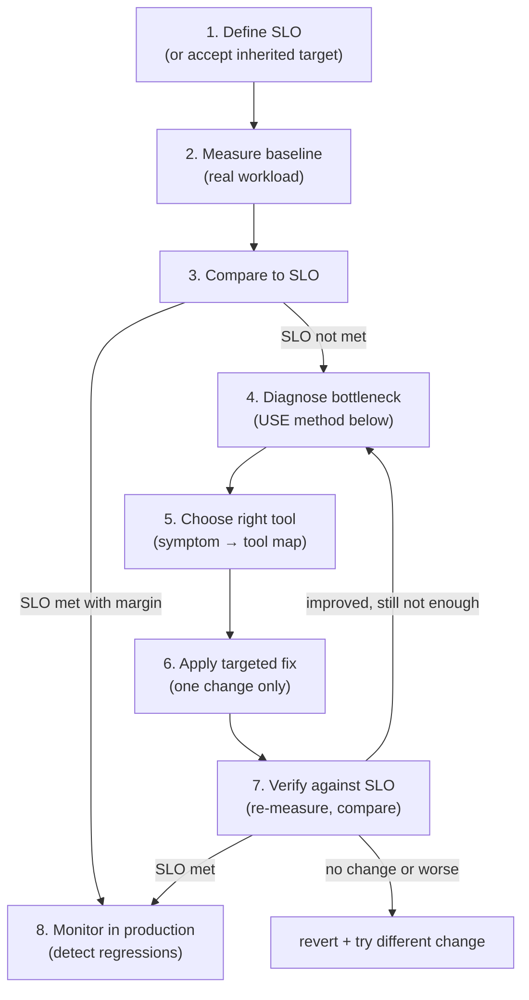
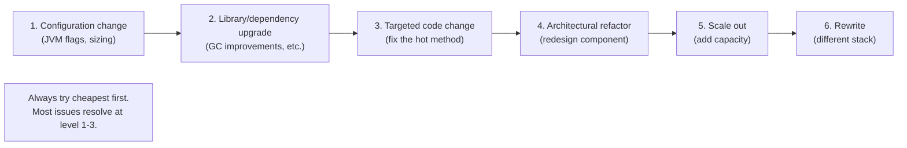
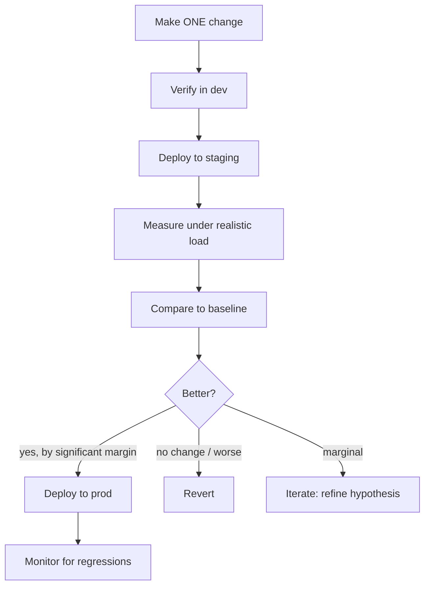
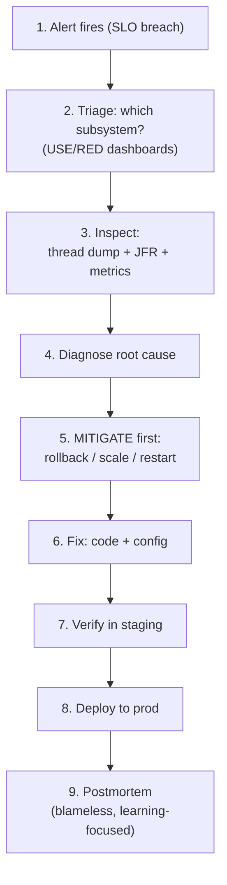

# Performance Tuning Methodology

T07–T12 covered the *individual tools*: GC fundamentals (T07), specific collectors (T08), GC tuning (T09), heap dump analysis for memory leaks (T10), profiling for CPU bottlenecks (T11), JMH for measuring alternatives (T12). This topic synthesizes them into a **systematic methodology** — the disciplined process that takes you from "the service is slow" to "we know exactly what to fix and we've verified it works." Production performance work is not random optimization; it's a small number of well-defined techniques applied in the right order to the right symptom. The engineer who internalizes this methodology can diagnose nearly any JVM performance issue.

The depth-bar requirement isn't "use the right tool." At the **framework** layer, performance work is governed by **SLOs (Service Level Objectives)** — measurable targets like "p99 latency < 100 ms" or "throughput > 1000 req/s" — and every tuning decision exists to meet or maintain an SLO; without SLOs there's no way to know if a change helped. At the **methodology** layer, two established frameworks guide diagnosis: Brendan Gregg's **USE method** (Utilization / Saturation / Errors — applied to each resource in turn) for system-wide bottleneck identification, and the **RED method** (Rate / Errors / Duration) for service-level health. At the **diagnostic** layer, every JVM performance problem fits in one of **5 bottleneck categories** — CPU-bound (profiler + JMH), Memory-bound (heap dump + allocation profile), IO-bound (wall-clock profile + JFR socket events), Lock-bound (lock contention profile), GC-bound (GC log + allocation reduction) — each with a canonical tool and a canonical fix. At the **engineering** layer, the **fix-then-verify** loop (change one thing, verify in staging, deploy to prod, compare against baseline) prevents the "we made it worse" mistake; the **cost ladder** (configuration < library upgrade < targeted code < refactor < scale out < rewrite) ensures we always try the cheapest fix first; **continuous performance testing in CI** + **performance budgets** prevents regressions from shipping. At the **organizational** layer, the **performance maturity model** distinguishes Level 0 ("no measurement") from Level 5 ("capacity planning + auto-scaling") — most teams operate at Level 2 ("SLOs + alerts") and benefit from moving up. We will cover all five layers, with three real-world case studies showing the methodology in action.

> [!NOTE]
> Prerequisites: [Benchmarking with JMH](./T12-benchmarking-with-jmh.md) (L3/C02/T12) — measuring alternatives; [Profiling](./T11-profiling-jfr-async-profiler-visualvm.md) (L3/C02/T11) — CPU bottleneck identification; [Memory leaks & heap dump analysis](./T10-memory-leaks-and-heap-dump-analysis.md) (L3/C02/T10) — memory bottleneck identification; [GC tuning & monitoring](./T09-gc-tuning-and-monitoring.md) (L3/C02/T09) — GC bottleneck tuning; [GC algorithms](./T08-gc-algorithms-serial-parallel-g1-zgc-shenandoah.md) (L3/C02/T08) — collector choice.

## The SLO/SLI/SLA Framework

Before tuning, define *what good looks like*:

| Term | Definition | Example |
|------|------------|---------|
| **SLI** (Service Level Indicator) | The metric you measure | p99 latency in ms |
| **SLO** (Service Level Objective) | The internal target | p99 < 100 ms |
| **SLA** (Service Level Agreement) | The contractual promise to customers | 99.9% of months meet p99 < 100 ms |

The relationship: SLI → SLO → SLA. The SLI is the *measurement*; the SLO is the *goal*; the SLA is the *contract*.

**SLOs drive performance work.** Without them, "tuning" has no destination. With them, you know:

- When to *start* tuning (SLO not met or trending toward failure).
- When to *stop* (SLO met with margin).
- What to *measure* (the SLI).
- What to *prioritize* (the biggest SLO miss).

Common SLOs:

- p99 latency < N ms (user-facing services).
- Throughput > N req/s (capacity).
- Error rate < 0.01%.
- Uptime > 99.9%.

## The Systematic Diagnostic Loop

Eight steps, in strict order:



The rules:

- **Always have an SLO.** Without one, you don't know if you're done.
- **Always have a baseline.** Without one, you can't measure improvement.
- **Change one thing at a time.** Multi-variable changes prevent attribution.
- **Verify before deploying.** Most "fixes" are noise or regressions.

## Brendan Gregg's USE Method — for Resource Saturation

The **USE method** (Brendan Gregg, 2012): for *every resource*, check:

| | What to measure |
|---|----------------|
| **U**tilization | % of time the resource is busy |
| **S**aturation | Demand exceeding capacity (queue length, wait time) |
| **E**rrors | Failures attributable to this resource |

Applied to a JVM:

| Resource | Utilization | Saturation | Errors |
|----------|-------------|-----------|--------|
| **Heap** | % occupied after GC | Allocation rate vs GC reclaim rate | `OutOfMemoryError: Java heap space` |
| **Code cache** | % full | JIT compile queue length | "CodeCache is full" |
| **Metaspace** | % full | (no saturation — it grows on demand) | `OutOfMemoryError: Metaspace` |
| **Threads** | active count / pool size | runqueue depth, queued tasks | `unable to create new native thread` |
| **CPU (per core)** | % busy | run queue depth | throttling, OOM-killer |
| **Network** | bandwidth used | TCP queue depth | retransmits, drops |
| **Disk** | IOPS / throughput | I/O queue depth | I/O errors |

The USE method *systematizes* "where is the bottleneck?" Walk through each resource; if any has high utilization, saturation, or errors, that's a candidate. Most performance issues are visible at this level.

## The RED Method — for Service Health

The **RED method**: for each service:

- **R**ate — requests per second.
- **E**rrors — failures per second.
- **D**uration — response time distribution.

Useful for top-down visibility — Grafana dashboards, alerts, SLO dashboards. RED is to services what USE is to resources.

## The 5 Bottleneck Categories

Every JVM performance issue fits in one of these:

### CPU-bound

**Symptom**: CPU at 100%, throughput limited by computation.
**Diagnose**: CPU profile (JFR or async-profiler) — find hot methods.
**Fix**: algorithmic improvement; parallelize via thread pool; cache results; async I/O frees CPU.

### Memory-bound

**Symptom**: high heap usage, frequent GC, `OutOfMemoryError`.
**Diagnose**: heap dump (T10), allocation profile (T11).
**Fix**: reduce allocations (object pooling, primitive collections, immutable shared instances); fix leaks; tune GC; increase heap.

### IO-bound

**Symptom**: CPU low, latency high, threads blocked.
**Diagnose**: wall-clock profile (T11), JFR `jdk.SocketRead` / `jdk.FileRead`.
**Fix**: async I/O (CompletableFuture, virtual threads — T14 from C01); batching; caching; connection pooling.

### Lock-bound

**Symptom**: throughput plateau despite low CPU; threads blocked on monitors.
**Diagnose**: lock contention profile (`-prof lock` or JFR `jdk.JavaMonitorEnter`).
**Fix**: reduce critical-section duration; lock striping; lock-free data structures (T11 from C01); split monolithic locks.

### GC-bound

**Symptom**: GC time > 10% of wall time; pause time spikes; throughput collapse.
**Diagnose**: GC log analysis (T09), GCEasy, allocation profile.
**Fix**: reduce allocation rate; tune GC; increase heap; switch collector (G1 → ZGC); fix any leaks.

## The Four-Question Framework

For *any* performance issue, ask:

1. **What's the SLO?**
2. **What's the current measurement?** (How far off are we?)
3. **What subsystem is the bottleneck?** (USE method.)
4. **What's the cheapest fix?** (Cost ladder.)

If you can't answer (1) or (2), stop and measure. (3) drives the choice of tool. (4) drives the fix.

## The Symptom → Tool Map

| Symptom | Primary tool | Secondary |
|---------|--------------|-----------|
| Latency spike | JFR + flame graph | OpenTelemetry traces |
| Slow response | Wall-clock profile | DB query analysis |
| OOM | Heap dump + Eclipse MAT | NMT |
| GC pauses | GC log + GCEasy | JFR GC events |
| Throughput drop | CPU profile + JMH | Compare to baseline |
| Memory growth | Multiple heap dumps + delta analysis | Allocation profile |
| Native leak | NMT + pmap | `jcmd VM.native_memory` |
| Lock contention | `-prof lock` or JFR `jdk.JavaMonitorEnter` | Thread dump |
| High CPU | CPU profile (async-profiler) | JFR `jdk.CPULoad` |

Memorize this map. The first tool to reach for is determined by the symptom.

## The Cost Ladder

Apply fixes in cost order — cheapest first:



The cost includes:

- **Engineering time** to make the change.
- **Risk** of the change breaking something.
- **Time to verify** the fix.
- **Ongoing maintenance** cost.

Going to level 5 (scale out) when level 1 (configuration) would have worked wastes money. Going to level 6 (rewrite) when level 4 (refactor) would have sufficed wastes a quarter.

## When NOT to Tune

- **Already meeting SLO.** Tuning further is wasted engineering time.
- **No baseline.** Without measurement, you're guessing.
- **No specific hypothesis.** Random tuning makes things worse on average.
- **Symptoms aren't JVM-related.** Network, DB, downstream services — those need different tools.

The most useful skill: recognize when *not* to tune. "Already fast enough" is a valid outcome.

## The Fix-Then-Verify Loop



Key practices:

- **One change at a time.** Otherwise you can't attribute the effect.
- **Staging that mimics prod.** Same JDK, same flags, similar workload.
- **Statistically significant difference.** A 1% improvement in noisy measurements is noise.
- **Willing to revert.** Most "wins" turn out to be losses.

## Gregg's "Negative Space" Method — for Latency Analysis

Instead of asking "where is time spent?", ask "where is time *not* spent?"

A request takes 100 ms. Break it down:

```text
Total: 100 ms

Accounted for:
  10 ms — DB query
  30 ms — business logic
  ──────
  40 ms — accounted

  60 ms — UNACCOUNTED ← negative space
```

The 60 ms is *where you don't have visibility*. Common causes:

- GC pause.
- Lock contention.
- Scheduler wait.
- I/O blocked on full TCP buffer.
- Page fault.

To investigate the negative space, add instrumentation (timing spans), capture a wall-clock profile during the spike, check GC logs for pauses overlapping the request.

This methodology is *the* answer to "the request is slow but the profile shows nothing." The profile shows on-CPU time; the slowness might be off-CPU (blocked).

## Capacity Planning

Performance tuning gets you only so far; eventually you need capacity. The basics:

- **Target utilization**: 50–70%. Above 70%, latency degrades non-linearly; above 80%, headroom for spikes evaporates.
- **Headroom for spikes**: peak traffic / average traffic. If 5×, plan for it.
- **Vertical vs horizontal scaling**: vertical (bigger JVM) saves coordination overhead; horizontal (more instances) gives redundancy. Mix typically.
- **Auto-scaling triggers**: CPU > 70% for 5 min → scale up.

When the tuning loop reaches "we've optimized everything; we need more capacity," capacity planning is the answer.

## Engineering Practices for Prevention

Most performance issues are *preventable* with engineering practices:

### Continuous performance testing in CI

```yaml
# Run JMH benchmarks on every PR
- name: JMH regression check
  run: |
    java -jar target/benchmarks.jar -rf json -rff results.json
    ./compare-to-baseline.sh results.json baseline.json --threshold 10
```

Compare to a baseline; fail the build on >10% regression.

### Performance budgets

```yaml
performance_budgets:
  p99_latency_ms: 100
  memory_mb: 512
  startup_seconds: 30
```

Enforced in CI; deploy blocked if budget exceeded.

### Observability from day 1

- Metrics: Prometheus + Grafana.
- Logs: structured + centralized (ELK, Loki).
- Traces: OpenTelemetry + Jaeger.
- Profiling: continuous JFR.

Set up *before* problems arise.

### Code review checklist

For every PR, ask:

- Does this change allocation patterns? (Hot allocation in a loop?)
- Does this add a hot path?
- Does this introduce synchronization? (And of what scope?)
- Does it have a benchmark or profile to back the change?
- Are there metrics to verify in production?

## Production Incident Response

When an alert fires:



The key order: **mitigate first, fix second.** Stop the bleeding (rollback, scale up, restart pod) *before* diagnosing the root cause. Customers' experience is the priority during an incident; the fix can happen in cooler hours.

## The Performance Maturity Model

Teams progress through levels:

| Level | What you have |
|-------|---------------|
| **0** | No measurement; no SLO; "feels slow" |
| **1** | Metrics + dashboards |
| **2** | SLOs + alerts on breach |
| **3** | Continuous profiling + APM (Datadog, Pyroscope, etc.) |
| **4** | Performance budgets in CI; regression detection |
| **5** | Capacity planning + auto-scaling; chaos engineering |

Most teams operate at Level 2. Moving to Level 3 is the biggest single improvement — *seeing what's slow* makes everything else easier.

## Common Anti-Patterns

### "Just add more servers"

Sometimes right; often masks the underlying inefficiency. If your service is slow because of a quadratic algorithm, doubling servers gives you 2× capacity but the algorithm is still quadratic.

### "Disable feature X"

Reactive; loses functionality. Sometimes necessary in an incident, but rarely the long-term fix.

### "Restart on schedule"

Masks leaks. The leak still grows; you just restart before it overflows. Production-izing a workaround.

### "Optimize randomly"

No baseline, no SLO, no hypothesis. Often makes things worse on average; sometimes makes them better by accident.

## 3 Real-World Case Studies

### Case 1: Latency spike investigation

**Alert**: p99 latency spiked at 10:35.

1. **Triage**: Grafana shows GC pause time spiked.
2. **Inspect**: continuous JFR recording shows GC events.
3. **Diagnose**: GC log shows a Full GC at 10:34:58.
4. **Heap dump** (manual after suspicion): shows a `ConcurrentHashMap` with 5M entries — a cache that was supposed to evict.
5. **Root cause**: cache eviction was disabled in a recent config change.
6. **Mitigate**: revert the config; restart pod.
7. **Fix**: code change to make cache bounded via Caffeine.
8. **Verify**: in staging, cache stays bounded.
9. **Deploy + monitor**.

**Time to resolution**: ~2 hours including postmortem.

### Case 2: OOM investigation

**Symptom**: Service OOM-killed every 48 hours.

1. **Triage**: heap occupancy in Grafana shows linear growth over time (T10's signature).
2. **Inspect**: heap dump from `-XX:+HeapDumpOnOutOfMemoryError`.
3. **Diagnose**: MAT's Leak Suspects Report flags a ClassLoader retaining 200 MB.
4. **Root cause**: JDBC driver registered by webapp; never deregistered.
5. **Mitigate**: restart pod (buys time).
6. **Fix**: `ServletContextListener` deregisters drivers on shutdown.
7. **Verify**: in staging, undeploy doesn't grow Metaspace.
8. **Deploy + monitor**.

**Time to resolution**: ~1 day.

### Case 3: Throughput regression after deploy

**Symptom**: throughput dropped 30% after the latest release.

1. **Triage**: CPU profile shows new hot methods.
2. **Inspect**: async-profiler flame graph; identifies `Method.invoke` high.
3. **Diagnose**: a new reflection-based mapper in the data path.
4. **JMH benchmark**: confirms 5× slowdown of the affected method.
5. **Fix**: cache `MethodHandle` instead of reflective `Method.invoke`.
6. **JMH verifies**: 4.5× speedup achieved.
7. **Deploy + monitor**: throughput restored.

**Time to resolution**: ~half a day.

## Scale Out vs Tune Decision

When SLO is not met:

- **Tune first** if: there's a clear bottleneck, fix is cheap, no urgent capacity need.
- **Scale out first** if: SLO breach is acute, capacity is the long-term need anyway, tuning would take too long.

The rule: **buy time with scale-out; buy efficiency with tuning.** Use both as appropriate.

## The Code Review Performance Checklist

For every code change, ask:

1. **Does this allocate in a hot path?**
2. **Does this introduce synchronization?**
3. **Does this hold a lock during I/O?**
4. **Does this use reflection in a loop?**
5. **Is there a benchmark for the change?**
6. **Is there a profile showing the previous state?**
7. **What metrics will verify it in production?**

Treat performance like correctness — review it.

## Documentation as Tuning Artifact

Build tribal knowledge into documents:

- **Runbooks**: "if alert X fires, do steps Y."
- **ADRs (Architecture Decision Records)**: "we chose G1 over ZGC because..."
- **Tuning history**: "we tried X; here's what happened."
- **Performance specs**: "this component has these SLOs."

Future engineers (including future you) need this context.

## Common Mistakes

### Tuning without baseline

Most common. Always measure first.

### Random optimization

Pick one suspect; verify; iterate. Don't change five things.

### Optimizing the wrong thing

Use profiling to find the actual bottleneck. Don't go off intuition.

### Trusting microbenchmarks for system behavior

JMH measures isolated code. Production has memory pressure, lock contention, etc.

### Premature scaling out

Scale-out is expensive ongoing; tune first if possible.

### Not monitoring after deploy

The fix might not stick. Track over time.

## Practice

1. **Define an SLO for an existing service.** Pick the right SLI (p99 latency, throughput, error rate). Set the SLO.
2. **Apply the USE method.** Walk through each JVM resource for a running service; check utilization, saturation, errors. Identify weak spots.
3. **Bottleneck categorization.** Pick a slow operation; identify which of the 5 categories it falls into.
4. **Cost ladder exercise.** For a known performance issue, list possible fixes at each cost level. Pick the cheapest viable.
5. **Negative-space analysis.** For a slow request, break down accounted vs unaccounted time. Investigate the unaccounted.
6. **Incident response.** Run a mock incident: alert fires; triage; inspect; diagnose; mitigate; fix.
7. **JMH in CI.** Set up JMH benchmarks running on every PR with baseline comparison.
8. **Performance budget.** Define a budget; integrate a CI check; observe build failures.
9. **Continuous profiling.** Enable JFR continuous recording in a service; trigger a slowdown; analyze.
10. **Case study walk-through.** Pick one of the 3 case studies; reproduce the investigation in a controlled environment.
11. **Maturity model assessment.** Score your team against the 0-5 model. Plan to move up one level.
12. **Capacity planning.** For a known service, calculate target utilization, headroom, and auto-scaling triggers.

## Recap

You should now be able to:

- Apply the **SLO/SLI/SLA framework**: SLO drives performance work; without it, "tuning" has no destination.
- Apply the **8-step systematic diagnostic loop**: define SLO → measure baseline → compare → diagnose → choose tool → fix → verify → monitor.
- Apply **Brendan Gregg's USE method**: Utilization / Saturation / Errors for each resource (heap, code cache, Metaspace, threads, CPU, network, disk) — systematizes "where is the bottleneck?"
- Apply the **RED method** (Rate / Errors / Duration) for service-level dashboards and alerts.
- Categorize bottlenecks into **5 types** with canonical tools and fixes: CPU-bound (profile + JMH), Memory-bound (heap dump + alloc profile), IO-bound (wall-clock profile + async/batching), Lock-bound (lock contention profile + reduce critical section), GC-bound (GC log + reduce allocation).
- Use the **4-question framework**: SLO / current measurement / bottleneck / cheapest fix.
- Use the **symptom → tool map** to choose the right diagnostic tool first.
- Apply the **cost ladder**: configuration → library upgrade → targeted code → refactor → scale out → rewrite. Always try cheapest first.
- Apply the **fix-then-verify** loop: change one thing → verify in dev → staging → measure → compare to baseline → deploy if better → revert if worse.
- Use Gregg's **"negative space" method** for latency analysis: ask "where is time NOT spent?"; the gap is usually GC pause, lock contention, scheduler wait, blocked I/O.
- Apply **capacity planning**: target 50-70% utilization; plan headroom for peak traffic / average; auto-scaling triggers.
- Apply **engineering practices for prevention**: continuous performance testing in CI (JMH on every PR), performance budgets in CI, observability from day 1, code review performance checklist.
- Execute **production incident response**: alert → triage → inspect (thread dump + JFR + metrics) → diagnose → **mitigate first** (rollback/scale/restart) → fix → verify → deploy → blameless postmortem.
- Position your team on the **performance maturity model** (Level 0 no measurement → Level 5 capacity planning + auto-scaling); moving to Level 3 (continuous profiling) is usually the biggest single improvement.
- Avoid the **4 anti-patterns**: just add more servers, disable feature X, restart on schedule, optimize randomly.
- Walk through **3 case studies**: latency spike from cache growth (fix with Caffeine), OOM from JDBC driver retention (fix with deregistration), throughput regression from reflection (fix with MethodHandle cache).
- Decide **scale out vs tune**: tune for efficiency, scale-out for urgent capacity.
- Use a **code review performance checklist** for every change.
- Maintain **documentation as tuning artifact**: runbooks, ADRs, tuning history, performance specs.

## Next

Continue to [JVM flags & ergonomics](./T14-jvm-flags-and-ergonomics.md) — the closing topic for C02. We'll cover the **JVM's ergonomics** (auto-tuning of heap, GC, thread counts based on system characteristics), the **flag categories** (-X standard, -XX advanced, -XX:+Unlock... diagnostic), the **flags that actually matter** for production (the short list from T09), how flags are documented (`-XX:+PrintFlagsFinal`), the differences between JDK versions (some flags removed; defaults change), and the **systematic way to manage flags** in production (version control, ADRs, A/B testing). T14 closes C02 — the JVM internals & performance chapter complete.
