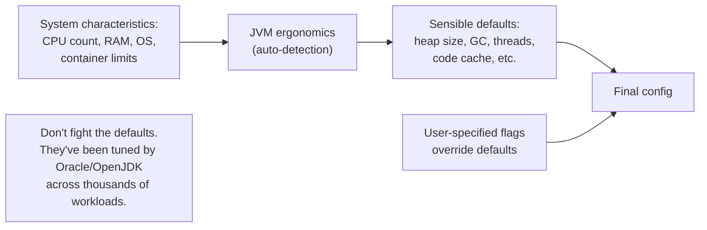

# JVM Flags & Ergonomics

This is the closing topic of C02 — the chapter on JVM internals and performance. T01–T13 covered the *what* and the *how*: what's inside the JVM (T01), how class loading works (T02), how bytecode runs (T03–T04), how memory is laid out (T01, T06), how GC works (T07–T09), how to diagnose problems (T10–T11), how to measure them (T12), and how to apply a disciplined methodology (T13). This topic covers the **knobs** — JVM flags — that let you actually *change* behavior, and the **ergonomics** system that picks sensible defaults so you don't have to set most of them.

The depth-bar requirement isn't "use these flags." At the **categorization** layer, JVM flags split into **three families** — **Standard `-X` options** (stable, documented, backward-compatible like `-Xmx`/`-Xss`); **Non-standard `-XX` options** (advanced, subject to change, the bulk of "tuning" flags); and within `-XX`, **Product** (stable, no unlock needed), **Diagnostic** (requires `-XX:+UnlockDiagnosticVMOptions`), and **Experimental** (requires `-XX:+UnlockExperimentalVMOptions`). At the **ergonomics** layer, modern JVMs auto-tune most defaults based on system characteristics — CPU count, RAM, container limits — so the right strategy is **trust the defaults, override only when measured**. The seven flags that *actually* matter for production (heap sizing, GC choice, pause target, OOM dump, GC logging, JFR recording) cover ~90% of tuning needs. At the **management** layer, JVM flag history matters — flags get deprecated and removed across JDK versions (CMS, ParNewGC, `-Xverify:none`, `+AggressiveOpts`), defaults change (G1 became default in JDK 9, ZGenerational arrived in JDK 21), and the **unified logging framework** (`-Xlog:tags:output:decorators:rotation`) replaced the per-subsystem `+PrintXxx` flags. At the **production** layer, flags should be treated as Architecture Decision Records — version-controlled, documented with rationale, A/B tested for significant changes, monitored after deploy. We will cover all four layers, with **four canonical flag profiles** (general web service, low-latency, batch ETL, container service) and the explicit "don't use this" list of flags that hurt more than they help. T14 closes C02 — the JVM internals and performance chapter is then complete.

> [!NOTE]
> Prerequisites: [Performance tuning methodology](./T13-performance-tuning-methodology.md) (L3/C02/T13) — the discipline; [GC tuning & monitoring](./T09-gc-tuning-and-monitoring.md) (L3/C02/T09) — the canonical flag list; [JIT compilation](./T04-jit-compilation-c1-c2-tiered.md) (L3/C02/T04) — flags that affect compilation; [JVM architecture](./T01-jvm-architecture-and-runtime-data-areas.md) (L3/C02/T01) — runtime areas flags affect.

## What JVM Ergonomics Is

The JVM **auto-tunes** many defaults based on what it detects about the system:



What the JVM auto-tunes (modern JDK 17+):

| Property | Default basis |
|----------|---------------|
| **Default GC** | G1 (since JDK 9) |
| **Heap size (`-Xmx`)** | 25% of available RAM (with `-XX:+UseContainerSupport`) |
| **Young Generation size** | computed from heap + ratios |
| **GC threads** | CPU core count |
| **JIT compiler threads** | CPU core count |
| **Code cache** | 240 MB |
| **Metaspace** | unlimited (initially small) |
| **Stack size** | 1 MB (Linux/macOS), 512 KB (Windows) |
| **Tiered compilation** | enabled |
| **Compressed OOPs / class pointers** | enabled (heap < 32 GB) |

The right strategy: **trust the defaults; override only when measured need exists.**

## The Three Flag Categories

### Standard Options (`-X`)

Stable, documented, backward-compatible. Won't change between JDK versions.

```bash
-Xmx2g          # max heap
-Xms2g          # initial heap
-Xss1m          # stack size per thread
-Xlog:gc*       # unified logging (JDK 9+)
```

Listed via `java -X` (note: lowercase `x`).

### Non-Standard `-XX` Options

Advanced; subject to change. The bulk of "tuning" flags.

```bash
-XX:+UseG1GC                     # boolean: turn on G1
-XX:-UseCompressedOops           # boolean: turn off compressed OOPs
-XX:MaxGCPauseMillis=200          # value
-XX:G1HeapRegionSize=4m           # value with size suffix
```

`-XX:+Name` turns a boolean on; `-XX:-Name` turns it off. `-XX:Name=value` sets a value.

#### Three sub-categories of `-XX` flags

- **Product**: stable, no special unlock needed (`-XX:+UseG1GC`, `-XX:MaxGCPauseMillis=200`).
- **Diagnostic**: requires `-XX:+UnlockDiagnosticVMOptions` first. For deep diagnosis (`+PrintInlining`, `+PrintAssembly`).
- **Experimental**: requires `-XX:+UnlockExperimentalVMOptions` first. For previews (`+UseZGC` was experimental before JDK 15; now production).

```bash
# Enable diagnostic flag:
java -XX:+UnlockDiagnosticVMOptions -XX:+PrintInlining ...

# Enable experimental flag:
java -XX:+UnlockExperimentalVMOptions -XX:+UseEpsilonGC ...
```

### Special Cases

- **`-D`**: system properties — not JVM tuning per se, but commonly mixed in.
- **`@argument-file`**: read flags from a file.
- **`JAVA_TOOL_OPTIONS` env var**: auto-applied to every JVM run on the machine.

## Flag Syntax in Detail

### Boolean

```bash
-XX:+UseG1GC      # ON
-XX:-UseG1GC      # OFF
```

The `+`/`-` immediately follows `-XX:` with no space.

### Value

```bash
-XX:MaxGCPauseMillis=200
-XX:CompileThreshold=10000
```

Equal sign, no spaces.

### Size

Sizes accept suffixes: `k` (1024), `m` (1024²), `g` (1024³), `t` (1024⁴).

```bash
-Xmx2g                          # 2 GiB
-XX:G1HeapRegionSize=4m         # 4 MiB
-XX:MetaspaceSize=128m          # 128 MiB
```

Numeric values default to bytes if no suffix.

## Container-Aware Ergonomics

`-XX:+UseContainerSupport` (default since JDK 8u131) makes the JVM cgroup-aware:

| Flag | Default | Effect |
|------|---------|--------|
| `-XX:+UseContainerSupport` | on | enables cgroup detection |
| `-XX:MaxRAMPercentage` | 25.0 | `-Xmx` = % of container RAM |
| `-XX:InitialRAMPercentage` | 1.5625 | `-Xms` = % of container RAM |
| `-XX:MinRAMPercentage` | 50.0 | with very small heaps, % to dedicate (sets a floor) |
| `-XX:ActiveProcessorCount=N` | auto-detect | force the JVM to see N CPUs (overrides cgroup detection) |

The big lever: **`-XX:MaxRAMPercentage=50`** (or 75 for dedicated JVM containers). The default 25% is conservative for old multi-tenant scenarios; dedicated containers can go higher.

```bash
# Container with 4 GB RAM, dedicated JVM:
java -XX:MaxRAMPercentage=60 -XX:+UseG1GC ...
# Effective -Xmx = 2.4 GB; leaves headroom for non-heap
```

## Inspecting Flags

```bash
# Print ALL flags with current values (including defaults set by ergonomics):
java -XX:+PrintFlagsFinal -version | grep -i "maxheapsize\|usegc"

# Include diagnostic + experimental flags:
java -XX:+UnlockDiagnosticVMOptions -XX:+UnlockExperimentalVMOptions \
     -XX:+PrintFlagsFinal -version

# Categorize: only flags explicitly modified (user flags vs ergonomic defaults):
java -XX:+PrintCommandLineFlags -version

# For a running JVM:
jcmd <pid> VM.flags          # only modified flags
jcmd <pid> VM.flags -all     # all flags + current values
```

`-XX:+PrintFlagsFinal` is the single most useful flag for "what's actually configured?" Use it any time you wonder.

## The 7 Essential Production Flags

T09 introduced these; here's the full canonical set:

```bash
java \
    -XX:MaxRAMPercentage=50 \                            # 1. Heap sizing (container-aware)
    -XX:+UseG1GC \                                       # 2. GC (or +UseZGC -XX:+ZGenerational)
    -XX:MaxGCPauseMillis=200 \                           # 3. G1 pause target
    -XX:+HeapDumpOnOutOfMemoryError \                    # 4. Auto-dump on OOM
    -XX:HeapDumpPath=/var/dumps \                        # 5. Where to dump
    -Xlog:gc*:file=/var/log/gc.log:time,uptime,level,tags:filecount=10,filesize=10m \  # 6. GC logging
    -XX:StartFlightRecording=disk=true,maxage=24h,maxsize=200m,filename=/var/jfr \    # 7. Continuous JFR
    -jar myapp.jar
```

Seven flags. **Everything else is fine-tuning.** Most production deployments need nothing beyond these.

## Flags That Have Changed Across JDK Versions

| Flag | Status |
|------|--------|
| `-Xverify:none` | Removed (security) |
| `-XX:+UseConcMarkSweepGC` (CMS) | Deprecated JDK 9, removed JDK 14 |
| `-XX:+UseParNewGC` | Removed JDK 10 |
| `-XX:+UseG1GC` | Default since JDK 9 |
| `-XX:+PrintGCDetails` | Replaced by `-Xlog:gc*` in JDK 9 |
| `-XX:+AggressiveOpts` | Removed JDK 12 (was an umbrella for unstable optimizations) |
| `-XX:+UseCompressedClassPointers` | Default on |
| `-XX:+UseCompressedOops` | Default on for heaps < 32 GB |
| `-XX:+UseStringDeduplication` | Available since JDK 8 (G1 only) |
| `-XX:+ZGenerational` | New JDK 21 |
| `-XX:+UseZGC` | Production since JDK 15 |

Stay current with the JDK version notes — flag changes are documented in JEPs and release notes.

## The Unified Logging Framework (`-Xlog`)

Pre-JDK-9, every subsystem had its own logging flag (`+PrintGCDetails`, `+PrintCompilation`, `+PrintSafepointStatistics`...). JDK 9 unified them into one framework:

```text
-Xlog:[<tag-selection>][:<output>[:<decorators>[:<output-options>]]]
```

### Examples

```bash
# GC info to stderr (default output):
-Xlog:gc

# GC info to file, with time + uptime decorators, with rotation:
-Xlog:gc*:file=/tmp/gc.log:time,uptime:filecount=10,filesize=10m

# Class loading:
-Xlog:class+load

# JIT compilation:
-Xlog:jit+compilation

# Safepoint analysis:
-Xlog:safepoint

# Multiple categories:
-Xlog:gc*,safepoint:file=/tmp/jvm.log:time:filecount=10,filesize=100m

# Disable all logging:
-Xlog:disable

# Detailed help:
-Xlog:help
```

### Common decorators

- `time` — wall-clock timestamp.
- `uptime` — seconds since JVM start.
- `level` — log level (info/warning/error).
- `tags` — which tag.
- `pid` — JVM PID.

### File rotation

- `filecount=N` — keep N rotated files.
- `filesize=M` — rotate when current file exceeds M bytes.

## Manageable vs Immutable Flags

Some flags can be changed at runtime; most can't.

### Manageable flags (changeable via `jcmd`)

```bash
# Read current value:
jcmd <pid> VM.flags MaxHeapFreeRatio

# Set new value:
jcmd <pid> VM.set_flag MaxHeapFreeRatio 60
```

Manageable flags include some GC tuning (`MaxHeapFreeRatio`, `MinHeapFreeRatio`), some logging (`PrintFlagsFinal`).

### Immutable flags

Most performance-critical flags (like `-Xmx`, `+UseG1GC`) are read at startup and cannot be changed. To change them, restart the JVM.

`-XX:+PrintFlagsRanges` lists which flags are immutable, manageable, or developer-only.

## 4 Canonical Flag Profiles

### Profile 1 — General Web Service

Spring Boot, REST API, moderate load, 4 GB container:

```bash
-XX:MaxRAMPercentage=50                              # 2 GB heap
-XX:+UseG1GC                                          # default; specify anyway
-XX:MaxGCPauseMillis=200                              # default
-XX:+HeapDumpOnOutOfMemoryError
-XX:HeapDumpPath=/var/dumps
-Xlog:gc*:file=/var/log/gc.log:time,uptime:filecount=10,filesize=10m
-XX:StartFlightRecording=disk=true,maxage=24h,maxsize=200m,filename=/var/jfr
```

### Profile 2 — Low-Latency Service

Trading, financial, real-time, large heap, sub-ms latency:

```bash
-Xmx32g                                               # absolute size
-XX:+UseZGC                                           # sub-ms pauses
-XX:+ZGenerational                                    # JDK 21+
-XX:+UseLargePages                                    # huge pages essential for ZGC at scale
-XX:+UseTransparentHugePages
-XX:+HeapDumpOnOutOfMemoryError
-XX:HeapDumpPath=/var/dumps
-Xlog:gc*:file=/var/log/gc.log:time
```

### Profile 3 — Batch ETL

Data processing, throughput-critical, latency tolerable:

```bash
-Xmx16g
-XX:+UseParallelGC                                    # max throughput
-XX:GCTimeRatio=99                                    # 99% non-GC time target
-XX:+HeapDumpOnOutOfMemoryError
-Xlog:gc*:file=/var/log/gc.log:time
```

### Profile 4 — Generic Container Service

Modern Kubernetes deployment, dedicated JVM container, any framework:

```bash
-XX:MaxRAMPercentage=60                               # 60% of container
-XX:+UseG1GC
-XX:MaxGCPauseMillis=200
-XX:+HeapDumpOnOutOfMemoryError
-XX:HeapDumpPath=/var/dumps
-Xlog:gc*:file=/var/log/gc.log:time,uptime:filecount=10,filesize=10m
-XX:StartFlightRecording=disk=true,maxage=24h,maxsize=200m,filename=/var/jfr
```

Each profile starts with the 7-flag baseline; differences are in heap size, GC choice, and latency vs throughput emphasis.

## The "Don't" List

Flags that do more harm than good:

| Flag | Why not |
|------|---------|
| `-Xcomp` | Forces compilation at first call; *disables* PGO; pre-JIT-warmup performance |
| `-Xint` | Forces interpreted; ~10× slower; only for debugging |
| `-Xverify:none` | Security regression; removed in newer JDKs |
| `-XX:-UseCompressedOops` | Doubles every reference size; heap effectively halved |
| `-XX:-TieredCompilation` | Uses C2 only; slow startup |
| `-XX:+AggressiveOpts` | Removed JDK 12; was an umbrella for unstable optimizations |
| `-XX:+PrintGCDetails` (alone) | Replaced by `-Xlog:gc*` in JDK 9 |
| `-XX:NewRatio`, `-XX:SurvivorRatio` | Let G1 auto-tune; manual values rarely help |
| `-XX:CompileThreshold` | Defaults are well-researched; tweaking rarely helps |

The pattern: **defaults are good; manual flags often regress.** Override only when you've measured a specific issue.

## Custom Flag Files and `JAVA_TOOL_OPTIONS`

For repeatable configurations:

### Flag file (`@argfile`)

```bash
# /opt/myapp/jvm-flags.txt
-Xmx2g
-XX:+UseG1GC
-XX:MaxGCPauseMillis=200
-XX:+HeapDumpOnOutOfMemoryError
```

```bash
java @/opt/myapp/jvm-flags.txt -jar myapp.jar
```

### `JAVA_TOOL_OPTIONS` env var

```bash
export JAVA_TOOL_OPTIONS="-Xmx2g -XX:+UseG1GC -XX:+HeapDumpOnOutOfMemoryError"
java -jar myapp.jar
```

The JVM auto-applies `JAVA_TOOL_OPTIONS` to *every* JVM run. Useful for container base images or CI systems.

**Caveat**: `JAVA_TOOL_OPTIONS` is global per shell — applies to anything Java in that environment. Set in narrow scopes only.

## Production Flag Management

Treat flags as Architecture Decision Records:

### Version-control your flags

```yaml
# Dockerfile
ENV JAVA_OPTS="-XX:MaxRAMPercentage=50 -XX:+UseG1GC \
               -XX:+HeapDumpOnOutOfMemoryError \
               -XX:HeapDumpPath=/var/dumps"
```

Or in Kubernetes:

```yaml
env:
- name: JAVA_OPTS
  value: "-XX:MaxRAMPercentage=50 -XX:+UseG1GC ..."
```

### Document the rationale

For each flag, why? An ADR:

```markdown
# ADR: MaxRAMPercentage = 60

## Context
Dedicated JVM container with 4 GB memory.

## Decision
Set -XX:MaxRAMPercentage=60.

## Rationale
- Default 25% is overly conservative for dedicated containers.
- Leaves ~40% headroom for non-heap (Metaspace, code cache, stacks, direct).
- Measured: heap occupancy peaks at 1.8 GB; 60% gives 2.4 GB with 1 GB headroom.

## Consequences
- Higher risk of container OOM if heap grows beyond expected.
- Monitor: container memory metric, OOMKilled events.

## Rollback
Revert to MaxRAMPercentage=40 if OOMKilled rate > 0.1%.
```

### Monitor after changes

Every flag change is a deploy. Watch:

- Heap occupancy.
- GC pause time.
- Throughput.
- Latency p99.
- Container memory.

Compare to baseline; alert on regressions.

### A/B test major changes

For significant changes (e.g., switching from G1 to ZGC), canary deploy to a subset of pods; measure; gradually expand.

## Where to Find Flag Documentation

- **`-XX:+PrintFlagsFinal`** — the primary source of truth (what *your* JVM has).
- **OpenJDK source code**: `src/hotspot/share/runtime/globals.hpp` and per-component `globals.hpp` files define every flag.
- **JEPs (JDK Enhancement Proposals)**: for new flags and features.
- **Oracle's "Java Tool Specifications"**: official documentation for `-X` flags.
- **chriswhocodes.com** — community-maintained unofficial flag database, very useful.
- **JDK release notes** — flags removed/added per version.

## Common Mistakes

### Copy-pasting flag sets from blog posts

Tuning is workload-specific. A flag set tuned for a high-throughput batch app may regress a low-latency service.

### Setting too many flags

Each flag is a potential surprise. Stick to the 7 essentials unless you've measured need.

### Disabling ergonomics

Manual `-XX:NewRatio` rarely helps. Trust auto-tuning unless profile shows specific issue.

### Ignoring deprecation warnings

`-XX:+UseConcMarkSweepGC` printed deprecation warnings for JDK 9–13; users ignored them; JDK 14 removed the flag; service failed to start.

### Setting `JAVA_TOOL_OPTIONS` globally

Affects every JVM in the shell — IDE, tests, scripts. Surprises everywhere.

### Not version-controlling flags

Flags scattered across Dockerfiles, K8s manifests, run-scripts → impossible to audit. Centralize.

### Setting flags that no longer exist

If a flag was removed in a newer JDK, the JVM warns and ignores. Eventually it may refuse to start. Audit periodically.

## Practice

1. **Inspect ergonomic defaults.** Run `-XX:+PrintFlagsFinal -version | grep -i "maxheapsize\|usegc"`. Compare on a small (2 GB) vs large (32 GB) heap container.
2. **Identify modified flags.** Run an app with custom flags; run `jcmd VM.flags`. Verify only your set is shown.
3. **Container-aware sizing.** With `-XX:+UseContainerSupport`, vary `-XX:MaxRAMPercentage` (25, 50, 75); observe `Xmx` via `-XX:+PrintFlagsFinal`.
4. **Unified logging.** Configure `-Xlog:gc*:file=/tmp/gc.log:time:filecount=5,filesize=10m`. Verify rotation by causing many GCs.
5. **Manageable flag at runtime.** Use `jcmd VM.set_flag MaxHeapFreeRatio 60` on a running JVM; verify via `VM.flags`.
6. **Apply the 4 flag profiles.** For each canonical scenario (web/low-latency/batch/container), launch a sample app with the profile; verify expected behavior.
7. **Deprecation warning.** Use `-XX:+UseConcMarkSweepGC` on JDK 11; observe the warning; understand the removal in JDK 14.
8. **Custom flag file.** Create `@argfile.txt` with your standard flags; run `java @argfile.txt`. Verify all flags applied.
9. **`JAVA_TOOL_OPTIONS`.** Set env var with flags; run multiple JVMs; verify auto-applied.
10. **Flag ADR.** Write a full ADR for a flag choice in your team's production service. Include context, decision, rationale, consequences, rollback.
11. **Inspect a competitor's flags.** Find a Spring Boot Docker image; inspect its `JAVA_OPTS`. Critique the choices.
12. **Audit deprecated flags.** Check your team's service for any deprecated/removed flags; plan removal.

## Recap

You should now be able to:

- Define **JVM ergonomics**: auto-tuning based on CPU count, RAM, container limits — picks sensible defaults so most users don't need manual tuning.
- Classify flags into **3 categories**: **Standard `-X`** (stable, backward-compatible — Xmx, Xss); **Non-standard `-XX`** (advanced, subject to change — bulk of tuning flags); within `-XX`: **Product** (no unlock needed), **Diagnostic** (`-XX:+UnlockDiagnosticVMOptions`), **Experimental** (`-XX:+UnlockExperimentalVMOptions`).
- Apply **flag syntax**: Boolean `+`/`-FlagName`, value `Name=value`, size suffixes `k`/`m`/`g`/`t`.
- Apply **container-aware ergonomics**: `-XX:+UseContainerSupport` (default since JDK 8u131); `-XX:MaxRAMPercentage` (default 25%, tune to 50–75% for dedicated JVM containers).
- Inspect flags via **`-XX:+PrintFlagsFinal`** (all values), `-XX:+PrintCommandLineFlags` (user-modified only), `jcmd VM.flags` (running JVM).
- Apply the **7 essential production flags**: heap sizing (`-Xmx` or `MaxRAMPercentage`), GC choice (`+UseG1GC` or `+UseZGC -XX:+ZGenerational`), pause target (`MaxGCPauseMillis=200`), OOM dump (`+HeapDumpOnOutOfMemoryError` + `HeapDumpPath`), GC logging (`-Xlog:gc*` with rotation), continuous JFR (`+StartFlightRecording`).
- Use the **unified logging framework** (JDK 9+) — `-Xlog:tags:output:decorators:rotation` format; common patterns for gc/jit/safepoint/class+load.
- Track **flag history across JDK versions**: CMS removed JDK 14, ParNewGC removed JDK 10, G1 default since JDK 9, `+PrintGCDetails` replaced by `-Xlog:gc*` in JDK 9, `+ZGenerational` new in JDK 21.
- Distinguish **manageable** flags (changeable via `jcmd VM.set_flag`) from immutable; most performance flags are immutable.
- Apply the **4 canonical flag profiles**: General web service (G1 + defaults), Low-latency (ZGC generational + large pages), Batch ETL (Parallel + GCTimeRatio=99), Container service (MaxRAMPercentage=60 + standard observability).
- Avoid the **"don't" list**: `-Xcomp`, `-Xint`, `-Xverify:none`, `-XX:-UseCompressedOops`, `-XX:-TieredCompilation`, `+AggressiveOpts` (removed), manual NewRatio/SurvivorRatio/CompileThreshold.
- Use **flag files** (`@argfile`) and **`JAVA_TOOL_OPTIONS`** for repeatable config, with awareness of scoping issues.
- Treat flags as **Architecture Decision Records**: version-control, document rationale, monitor after changes, A/B test significant changes.
- Find flag documentation: `-XX:+PrintFlagsFinal` (definitive), OpenJDK source (`globals.hpp`), JEPs, chriswhocodes.com (community DB), JDK release notes.
- Avoid the **6 common mistakes**: copy-pasting flag sets, setting too many flags, disabling ergonomics, ignoring deprecation warnings, global `JAVA_TOOL_OPTIONS`, scattered flag management.

## Chapter Complete — L3/C02

T14 closes **L3/C02 — JVM Internals & Performance**. The chapter has covered:

| # | Topic | What you can now do |
|---|-------|---------------------|
| T01 | JVM architecture & runtime data areas | Identify the 5 areas; size each; diagnose OOM by type |
| T02 | Class loading & class loaders | Walk the 3-phase lifecycle; diagnose ClassLoader leaks |
| T03 | Bytecode basics | Read `javap -v` output; understand `invokedynamic` |
| T04 | JIT compilation (C1/C2, tiered) | Walk the 5 tiers; understand PGO; diagnose deopts |
| T05 | AOT & GraalVM native image | Decide JIT vs AOT; build native images for the right workloads |
| T06 | Memory model: heap, stack, metaspace | Size all memory areas; understand TLABs and off-heap |
| T07 | Garbage collection fundamentals | Apply tri-color marking; understand write barriers; reason about pauses |
| T08 | GC algorithms (Serial, Parallel, G1, ZGC, Shenandoah) | Choose the right collector per workload |
| T09 | GC tuning & monitoring | Read GC logs; identify anti-patterns; tune the right flags |
| T10 | Memory leaks & heap dump analysis | Capture and analyze heap dumps; trace leak patterns with MAT |
| T11 | Profiling (JFR, async-profiler, VisualVM) | Capture CPU/wall/alloc/lock profiles; read flame graphs |
| T12 | Benchmarking with JMH | Write correct microbenchmarks; avoid DCE and constant folding |
| T13 | Performance tuning methodology | Apply the systematic 8-step loop with USE/RED methods |
| T14 | JVM flags & ergonomics | Trust the defaults; apply the 7 essentials; manage flags as ADRs |

You now have the complete toolkit to:

- **Understand** the JVM end-to-end, from bytecode to GC to JIT to memory layout.
- **Diagnose** any production performance issue using the right tool for the right symptom.
- **Tune** GC and JVM behavior with confidence, backed by measurement.
- **Optimize** application code with profiling, benchmarking, and JMM-aware reasoning.
- **Manage** production deployments with disciplined methodology and observability.

The 14 topics together represent ~75 hours of expert-density content — the equivalent of a focused training on JVM internals + performance engineering.

## Next

C02 complete. The remaining L3 chapters:

- **C03 — Design patterns & principles**: GoF patterns in Java context, SOLID, Effective Java patterns, modern idioms (records, sealed classes, pattern matching).

Or continue with cross-cutting L3 chapters (C04 Tools & Environment, C05 Hands-on project, C06 Best practices, C07 Interview prep, C08 Q&A, C09 Cheatsheets, C10 Resources) if the user wants to round out L3 before moving on.
