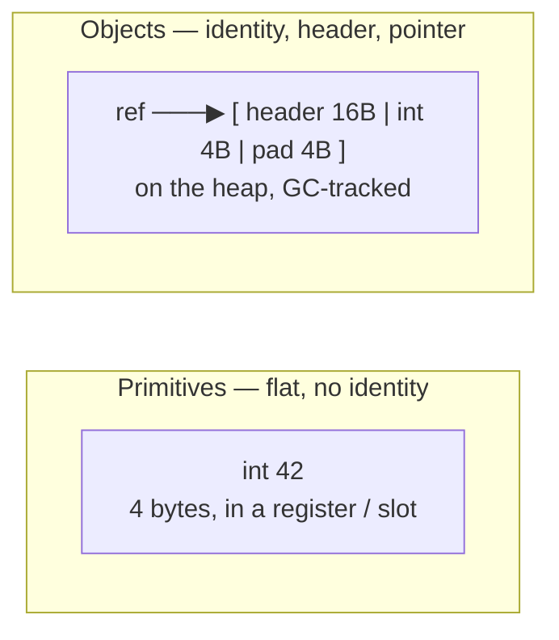
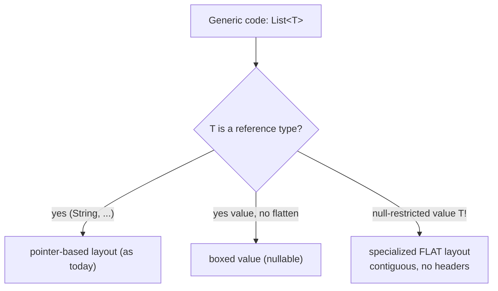
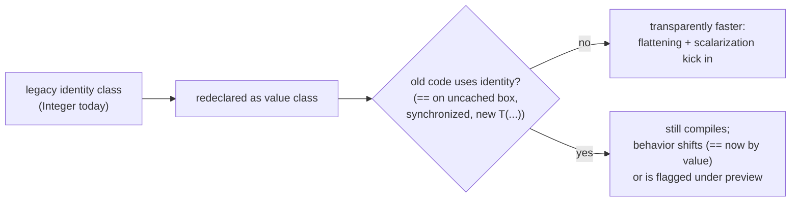
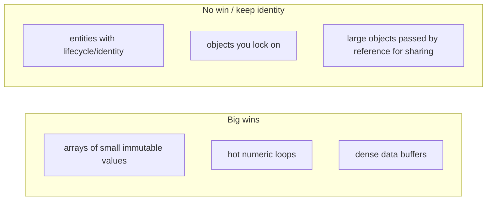

# Project Valhalla: Value Classes & the End of the Primitive/Object Divide

T06 showed you the unavoidable tax every Java object pays: a **16-byte header** (mark word + compressed klass pointer + padding to 8-byte alignment), reached through a **pointer**, allocated somewhere on the heap that the GC must trace. An `Integer` holding a 4-byte `int` costs 16 bytes; an `Integer[]` of a million elements is a *million pointers* to a million scattered 16-byte boxes, not a flat block of 4 MB of `int`s. T04 showed the JIT working heroically to *un-box* and scalarize away this overhead when it can prove an object never escapes. **Project Valhalla** is the JVM's effort to make this overhead *avoidable by design* rather than *removable by luck* — to let you write a class that the JVM is permitted to lay out flat, with no header and no pointer, like a primitive. The slogan is **"code like a class, works like an `int`."**

> [!WARNING]
> Project Valhalla is a **preview / incubating feature as of 2026 — it is NOT fully GA**, and the surface syntax, modifier keywords, and JEP numbers are still moving. The first installment, **value classes (the `value` modifier)**, has shipped as a *preview* feature in recent JDKs (JEP 401 lineage); the **null-restricted / flat-layout** types and **generic specialization** pieces are later, still-evolving installments. Treat the *model* in this topic as durable and the *exact keywords* (`value`, `!`-marked null-restricted types, etc.) as provisional. When you read this against a specific JDK, check the live JEPs.

The depth-bar isn't "value types make Java faster." At the **identity** layer, Valhalla introduces a new kind of object — one *without identity* — and identity is precisely what forces the header, the pointer, and the heap allocation. At the **layout** layer, dropping identity unlocks **flattening** (inlining the fields into the container — array, field, or register) and **scalarization** (splitting the object into its component fields across CPU registers at call boundaries). At the **language** layer, you trade away things identity gave you: no synchronization on a value, `==` becomes a *by-fields* comparison, and nullability gets subtle (a flat value has no slot for `null`). At the **generics** layer, the long-term payoff is **specialized generics** — a real `List<int>`-density instead of `List<Integer>` boxing. We will walk all four layers, with byte-level memory diagrams, then cover migration of existing types (`Integer`, `Optional`) and where this actually pays off.

> [!NOTE]
> Prerequisites: [Memory model: heap, stack, metaspace](./T06-memory-model-heap-stack-metaspace.md) (L3/C02/T06) — the 16-byte header, compressed oops, alignment, and JOL sizing this topic builds on; [JIT compilation](./T04-jit-compilation-c1-c2-tiered.md) (L3/C02/T04) — escape analysis and scalar replacement, the "removable by luck" version of what Valhalla makes "avoidable by design"; [JVM architecture](./T01-jvm-architecture-and-runtime-data-areas.md) (L3/C02/T01) — the heap and runtime data areas these objects live in. Object-header structure is also covered in [synchronized, monitors & intrinsic locks](../C01-concurrency/T03-synchronized-monitors-and-intrinsic-locks.md) (L3/C01/T03) — the mark word is what makes locking-on-a-value impossible.

## The Problem: Identity Has a Price

In Java today there is a hard divide. On one side, **eight primitives** (`int`, `long`, `double`, …) — flat, no header, stored directly in registers, locals, and array slots. On the other side, **everything else is an object** — every object has **identity**, which the JVM implements with a header and reaches through a pointer.



**Identity** is the property that makes two objects *distinguishable even when their contents are equal*. `new Integer(42) != new Integer(42)` (by reference) precisely because each `new` produces a distinct identity. Identity is what `==` tests, what `System.identityHashCode` reports, what `synchronized(obj)` locks on, and what lets a `WeakReference` track a *specific* instance.

That power costs you, on a 64-bit JVM with compressed class pointers (see T06):

- **Per-object header: 16 bytes.** Mark word (identity hash, lock bits, GC age) + compressed klass pointer + padding to 8-byte alignment. An `Integer` wrapping a 4-byte `int` is **16 bytes** — a 4x overhead. A `LocalDate` (3 small fields) is far larger than the bytes it logically holds.
- **Indirection.** Every access to a wrapped value is a pointer dereference. The value lives wherever the allocator put it, not where you're using it.
- **Cache hostility — the killer for arrays.** This is the one that matters at scale:

```text
int[4]  (primitive — flat, contiguous):
  ┌────┬────┬────┬────┐
  │ 10 │ 20 │ 30 │ 40 │   16 bytes total, one cache line, prefetcher loves it
  └────┴────┴────┴────┘

Integer[4]  (boxed — array of pointers):
  ┌─────┬─────┬─────┬─────┐
  │ ptr │ ptr │ ptr │ ptr │   the array: 4 pointers (16–32B)
  └──┬──┴──┬──┴──┬──┴──┬──┘
     ▼     ▼     ▼     ▼     each box: header16 + int4 + pad4 = 16B,
  [hdr|10][hdr|20][hdr|30][hdr|40]   scattered across the heap → cache misses,
                                      pointer-chasing, GC must trace all 4
```

The `Integer[]` is *every number wrapped in its own shipping box with a forwarding address* — to read the numbers you follow each address to a different shelf in the warehouse and unwrap the box. The `int[]` is *the numbers packed flat in a single tray* — one trip, everything adjacent. On modern hardware, where a main-memory miss costs ~100x an L1 hit, this layout difference dwarfs the raw byte count.

> [!NOTE]
> **Autoboxing** makes this silent and pervasive. `List<Integer>`, `Map<Long, ...>`, a generic `Optional<Integer>`, a `Comparator` returning `Integer` — all box. `Integer.valueOf` caches −128..127, but outside that range every box is a fresh heap allocation. A hot loop summing a `List<Integer>` is a parade of allocations and dereferences the GC has to clean up.

### Anatomy of the Overhead, Byte by Byte

Put concrete numbers on it for a million-element array on a 64-bit HotSpot with compressed class pointers (the defaults from T06):

```text
int[1_000_000]                              Integer[1_000_000]  (boxed)
─────────────────────────────              ──────────────────────────────────────
array header     16 B                       array header        16 B
payload   4 B × 1e6 = 4.00 MB               pointers  4 B × 1e6 = 4.00 MB  (compressed oops)
                                            + boxes   16 B × 1e6 = 16.00 MB (header16+int4+pad4… +0)
─────────────────────────────              ──────────────────────────────────────
TOTAL ≈ 4.00 MB, one contiguous run        TOTAL ≈ 20.00 MB, scattered, 1e6 GC-traced objects
```

So the boxed form is **~5x the memory**, spread across a million separately-allocated objects the GC must mark and the CPU must pointer-chase. The 16 B box for a 4 B `int` is a **4x per-element header tax** before you even count the pointer. Endianness and exact alignment don't change the headline — the costs are *structural* (header + indirection + scatter), not arithmetic. This is the gap a flattenable value type is designed to erase: a flat `value`-typed array of the same `int`-sized payload is back to ~4 MB and one cache-friendly run.

> [!NOTE]
> Note the **32 GB compressed-oops cliff** from T06 interacts here: above ~32 GB heap, references widen to 8 bytes, so the *pointer-array* form of `Integer[]` doubles its pointer cost (4 B → 8 B each) while a flat value array is unaffected — flattening's relative advantage *grows* on large heaps.

## Value Classes: Objects Without Identity

Valhalla's core move: let you declare a class whose instances **have no identity**. You give up identity *deliberately*, and in exchange the JVM is *permitted* (not required) to drop the header, drop the pointer, and lay the fields out flat.

The provisional surface syntax adds a `value` modifier:

```java
// Provisional preview syntax — exact keywords may change before GA.
public value class Point {
    private final int x;
    private final int y;

    public Point(int x, int y) { this.x = x; this.y = y; }

    public int x() { return x; }
    public int y() { return y; }
}
```

A value class is still a real class — it has methods, fields, can implement interfaces, can be generic. What changes is its **semantics**:

- **No identity.** There is no "which instance" — only "what value." Two `Point`s with the same `x` and `y` *are the same value*, the way `42` is `42` no matter how you computed it.
- **Implicitly final fields, no mutation.** Value instances are immutable; the field values *are* the object.
- **`==` compares by fields**, not by reference. `new Point(1,2) == new Point(1,2)` is `true` for a value class — there's no reference to differ.
- **No synchronization.** `synchronized(point)` is forbidden (there's no mark word to hold lock bits — see the header structure in [C01/T03](../C01-concurrency/T03-synchronized-monitors-and-intrinsic-locks.md)). The same goes for `wait`/`notify` and meaningful `WeakReference` tracking.
- **`identityHashCode` is undefined / contents-based.** You can't tell two equal values apart, by design.

> [!IMPORTANT]
> "No identity" is the *cause*; "may be flattened" is the *effect*. The JVM can only inline an object and store copies of it in many places if those copies are indistinguishable. The instant you can ask "is this the *same* object?", the JVM must keep a single canonical instance and hand out pointers to it. Removing that question is what frees the layout.

### What You Give Up — and Why It's Acceptable

| Identity gave you            | Value classes lose it          | Why that's fine for value-shaped data |
|------------------------------|--------------------------------|---------------------------------------|
| `==` distinguishes instances | `==` compares fields           | For a `Point`/`Money`, "same value" is what you actually mean |
| `synchronized(obj)` locks    | forbidden                      | You don't lock on a number; lock on a real entity instead |
| `identityHashCode` is stable | undefined                      | Value hashing is content-based already |
| `new` yields a fresh object  | the JVM may reuse / inline     | You never needed a *distinct* `Point(1,2)` |
| Mutable shared state         | immutable                      | Value-shaped data is naturally immutable |

The mental test: **"If two of these are equal, do I ever care that they're separate objects?"** For a coordinate, a timestamp, a money amount, an RGB color, a complex number — no. For an account, a session, a cache entry, a lock — yes; keep those as identity classes.

## The Mechanism: Flattening and Scalarization

Two distinct JVM optimizations are unlocked. Both are *permitted by* the no-identity guarantee, applied opportunistically by the JIT and the layout engine.

### Flattening (Heap Layout)

**Flattening** means storing a value's fields *inline* in its container instead of storing a pointer to a separate boxed object. The container can be a field of another object, or — the big win — an array element.

```text
Today: Point[] when Point is an identity class
  array:  ┌─────┬─────┬─────┐
          │ ptr │ ptr │ ptr │
          └──┬──┴──┬──┴──┬──┘
             ▼     ▼     ▼
   [hdr16|x4|y4|pad4]  …each Point = 24B box, scattered

Valhalla: Point[] when Point is a flattenable value class
  array:  ┌───────┬───────┬───────┐
          │ x4|y4 │ x4|y4 │ x4|y4 │   8 bytes per element, fully contiguous
          └───────┴───────┴───────┘   no headers, no pointers, no GC tracing of elements
```

A flat `Point[1_000_000]` is ~8 MB of contiguous `x,y` pairs that the CPU prefetcher streams through, versus a million 24-byte boxes plus a million pointers in the identity version. Same for an embedded field: a `value class Line { Point a; Point b; }` can store all four `int`s inline — one object, 16 bytes of payload, no nested boxes.

> [!NOTE]
> Flattening is *enabled* by no-identity but *gated* by other facts — chiefly **nullability** (below) and field layout. The JVM may still box a value (e.g., to store it where a `null` is possible, or to pass it through legacy `Object`-typed APIs). Valhalla's promise is "flat *when it can be*," not "flat *always*."

### Scalarization (Call / Register Layout)

**Scalarization** is flattening's stack-and-register cousin, and it's what T04's escape analysis already does *ad hoc*. When a value is passed to or returned from a method, the JVM can **split it into its component fields and pass them in registers** rather than allocating a box and passing a pointer.

```text
Identity object call:                 Scalarized value call:
  caller boxes Point on heap            x → register r1
  passes pointer in a register          y → register r2
  callee dereferences pointer           callee reads r1, r2 directly
  GC must later collect the box         nothing allocated, nothing to collect
```

The crucial difference from T04: for an identity class, the JIT must *prove non-escape* on a case-by-case basis (and bails out the moment the object might be stored somewhere or passed to a method it can't see). For a value class, **no-identity is a stable property of the type** — the optimization isn't conditional on a fragile escape proof, so it applies far more reliably, including across method boundaries and into not-yet-inlined callees.

#### Where the Fields Actually Live: the Calling Convention

On real hardware this is an **ABI / register-allocation** story. A small value like `Point(int x, int y)` is 8 bytes of payload — it fits comfortably in the integer registers both major server ISAs offer:

```text
x86-64 (System V ABI):   x → e.g. RSI (low 32b),  y → e.g. RDX (low 32b)
AArch64 (ARM64):         x → e.g. W1,             y → e.g. W2
```

The callee reads the fields straight out of registers; nothing touches memory, nothing touches the heap, the GC has nothing to collect. A `value class Complex(double re, double im)` similarly maps to a pair of floating-point/SIMD registers (XMM on x86-64, V-registers on AArch64). The limit is the number of argument registers: once a value is *large* — many fields — it no longer fits in registers and must be passed on the stack or by reference, which is exactly why **value classes are a small-aggregate optimization** (see the copy-cost caveat later). The same register-residency is what lets a tight loop over a flat value array keep the "hot" value in registers across iterations instead of reloading a dereferenced box each time.

> [!INTERVIEW]
> *"What's the difference between escape-analysis scalar replacement (today) and Valhalla scalarization?"* — Both eliminate the heap box and pass fields in registers. The difference is *guarantee and scope*. Escape analysis is an **opportunistic JIT optimization**: it works only when C2 can *prove* the object never escapes the compiled scope, and it silently gives up under deep call chains, megamorphic calls, or storage into a field/array — so you can't *rely* on it. Valhalla scalarization rests on a **type-level invariant** (the class has no identity), so it's stable, applies across call boundaries, and survives storage into flattened arrays/fields. In short: today the JVM removes the box *when it gets lucky*; with value classes it's removed *by design*. Bonus point: name the cause — identity forces a unique heap address; remove identity and copies become interchangeable, which is the precondition for both flattening and register passing.

### Nullability: The Subtle Part

A reference can be `null`; that's a bit pattern (the null pointer). A *flat* value has no pointer — its bytes are just the fields — so **where does `null` go?** There's no spare slot for it. This is why Valhalla distinguishes:

- **Nullable value type** (the default for a plain `value class` used as a reference) — can hold `null`, so the JVM often keeps it as a (possibly boxed) reference to preserve a representation for `null`.
- **Null-restricted value type** (provisional `!`-style notation, e.g. `Point!`) — *guaranteed never null*, which removes the need for a null representation, so the JVM can store the raw fields **flat** with no extra null-marker.

```text
Nullable Point  → needs to represent null  → reference / boxed-capable layout
Point! (null-restricted) → cannot be null  → pure flat fields, densest layout
```

This is the central trade the later Valhalla installments expose: **null-restricted + flat = maximum density, but you accept a default value and lose `null`.** A null-restricted field/array element comes into existence holding the **all-zeros default** (`Point` of `(0,0)`), exactly as `int[]` starts at `0`. For many value types that's natural; for some it's a footgun (a "zero `Money`" or "zero `Point`" may be a meaningless sentinel). The syntax and the exact rules here are among the **least-settled parts of Valhalla** — treat the *concept* (nullable-but-boxable vs null-restricted-but-flat) as the durable takeaway.

## Generic Specialization: The Long-Term Payoff

Today, generics use **erasure**: `List<T>` is really `List<Object>` under the hood, so `List<Integer>` *must* box — there's no way to store a bare `int` where the runtime expects an `Object` reference. This is the root cause of `List<Integer>` being a list of pointers-to-boxes rather than a flat `int` buffer.

Valhalla's later installment aims at **generics over value types with specialized layout** — informally, the ability to write `List<int>` / `ArrayList<Point!>` and have the backing store be *flat*:

```text
ArrayList<Integer> today:           ArrayList<Point!> (Valhalla goal):
  Object[] elementData              flat Point[] backing store
  → array of pointers to boxes      → contiguous x,y pairs
  → box on every add()              → no boxing, no per-element header
```



The hard part — and why this is a *later* installment — is doing it **without breaking the millions of lines of existing erased generic code**. The design goal is that the *same* generic class compiles once and works for both reference and value type arguments, specializing the layout only where a flattenable value is supplied. This is genuinely unfinished as of 2026; describe it as a **direction**, not a shipped feature.

### Migrating Existing Types

A second front is migrating today's value-shaped library types to value semantics *compatibly*:

- The **wrapper types** (`Integer`, `Long`, `Double`, …) are the prime targets — make them value classes so `Integer` can flatten and `List<Integer>` can eventually approach `int[]` density, while old code using `==` on cached boxes still behaves.
- **`Optional`**, the date/time types (`LocalDate`, `Instant`), and other naturally-immutable, identity-irrelevant types are candidates to become value classes.
- The compatibility constraint is real: existing code that *relied* on identity (e.g. `synchronized(someInteger)` — already a bad idea, or identity-`==` on uncached boxes) must keep compiling, even if such usage becomes discouraged or, for the most egregious cases, a warning/error under preview rules.

> [!IN PRACTICE]
> You will almost certainly *first* meet Valhalla not by writing `value class` yourself, but because a JDK release quietly **re-declares `Integer`/`Optional` as value classes**. The practical fallout to internalize now: stop relying on `==` for wrappers (use `.equals` / unbox), never `synchronized` on a wrapper or `Optional`, and don't lean on `new Integer(...)` producing a distinct instance — those have always been smells, and Valhalla turns them from "smell" into "wrong."

#### The Compatibility Tightrope

Migrating a 30-year-old type like `Integer` to value semantics *without a flag day* is the genuinely hard engineering. The deprecation of the wrapper constructors (`new Integer(...)` was deprecated long ago in favor of `Integer.valueOf`) was an early, deliberate down-payment on exactly this migration — code that calls `new Integer(...)` assumes a fresh, distinct identity, which a value class cannot honor. The migration model is roughly:



The design intent is that the overwhelming majority of correct code gets *faster for free*, while the small set of identity-dependent code keeps compiling — with the riskiest patterns surfaced as warnings/errors rather than silent behavior changes. This is why you should fix `==`-on-wrappers and `synchronized`-on-`Optional` *today*: you are pre-paying your own migration.

## Performance Impact, Use-Cases, and Caveats

Where value classes pay off — all are **value-shaped, identity-irrelevant, often held in bulk**:

- **Numerics & math** — `Complex`, `Rational`, fixed-point, vectors/matrices. Tight loops over arrays of these become flat, register-resident, allocation-free.
- **Geometry / graphics** — `Point`, `Vec3`, `Color`, `Rect`. A `Vec3[]` of vertices that's actually contiguous floats is a transformative win for compute-heavy code.
- **Money & units** — `Money(amount, currency)`, `Quantity(value, unit)`. Dense, immutable, compared by value.
- **Large arrays of small records** — columnar/analytics buffers, simulation particles, time-series ticks. This is the headline use-case: *millions of small, identical-shaped records* where today's boxing destroys cache locality.



Caveats and footguns:

- **Pass-by-value copy cost.** A flat value is *copied* when assigned or passed, not shared via pointer. For *small* values (a couple of fields) that's cheaper than allocation + indirection. For a *large* value class, copying many fields around can be **more** expensive than passing one pointer — Valhalla is for *small* aggregates, not big ones.
- **Default-value semantics.** Null-restricted flat values default to all-zeros, which may be a nonsensical or dangerous sentinel for your domain. Design the type so its zero is either valid or obviously-invalid.
- **"Flattened *when it can be*", not always.** Boxing still happens at the boundaries — nullable contexts, legacy `Object`-typed APIs, reflection, serialization. Don't assume zero allocation; **measure with JMH** (see [T12](./T12-benchmarking-with-jmh.md)) and verify layout with **JOL** (see T06) rather than trusting the slogan.
- **It's preview.** Behind a preview flag, syntax in flux, not for production-critical code paths yet in 2026. Prototype and learn; don't bet a release on the exact current spelling.

> [!IN PRACTICE]
> The single mental model that survives every syntax revision: **identity is what costs you the header, the pointer, and the heap allocation; a value class is you telling the JVM "I don't need identity for this," which lets it pack these flat.** Everything else — `value`, `!`, specialized generics — is machinery serving that one trade.

## Practice

1. **Measure the box tax.** Use JOL (`org.openjdk.jol`, from T06) to print the layout of `Integer`, a 3-field record, and an `Integer[16]` vs `int[16]`. Tabulate header bytes, payload bytes, and total — quantify the overhead you're paying today.
2. **Cache-miss demo.** Write a JMH (T12) benchmark summing an `int[10_000_000]` vs a `List<Integer>` of the same values. Explain the gap in terms of contiguity, indirection, and cache misses — not just "boxing is slow."
3. **Escape-analysis baseline.** Write a method that creates a `Point` (identity class) used only locally; confirm with `-XX:+PrintEscapeAnalysis` / allocation profiling (T11) that C2 scalar-replaces it. Then make it escape (store it in a field) and observe scalar replacement vanish — this is the *fragility* Valhalla fixes.
4. **(Preview JDK) Declare a value class.** On a JDK with value classes in preview, declare `value class Point`, enable preview, and observe: `==` compares by fields; `synchronized(point)` is rejected; `identityHashCode` behaves by-contents.
5. **Migration audit.** Grep a real codebase for `synchronized` on wrappers/`Optional` and `==` on boxed `Integer`/`Long`. List everything that would break if those types became value classes — this is your forward-compatibility checklist.
6. **Design the zero.** Pick a domain value type (`Money`, `Vec3`, `Currency`). Decide whether its all-zeros default is valid, harmless, or dangerous, and redesign so a null-restricted flat representation is safe.

## Recap

You should now be able to:

- Explain the **primitive/object divide** and its cost: every object has **identity**, which forces a **16-byte header** (mark word + compressed klass pointer + padding, per T06), a **pointer** to reach it, and a **heap allocation** the GC must trace.
- Show why an **`Integer[]` is a pointer array of scattered boxes** while an `int[]` is flat and contiguous, and why that layout — not raw byte count — is what wrecks cache behavior at scale. Tie autoboxing to silent, pervasive allocation.
- Define a **value class / value object** as an object **without identity**, and state the consequences: `==` by fields, no `synchronized`, contents-based hashing, immutability, interchangeable copies — "code like a class, works like an `int`."
- Distinguish the two mechanisms no-identity unlocks: **flattening** (inline fields in arrays/fields — heap layout) and **scalarization** (split into register-passed fields at call boundaries), and contrast scalarization with T04's *opportunistic* escape-analysis scalar replacement — Valhalla's rests on a **type invariant**, so it's reliable and crosses method boundaries.
- Explain the **nullability** subtlety: a flat value has no slot for `null`, so **nullable** values may stay boxed while **null-restricted** values (`!`) flatten densely at the cost of an all-zeros default.
- Describe **generic specialization** as the long-term payoff — flat `List<Point!>`/`int`-density backing stores instead of erased, boxing `List<Integer>` — and note it's an *unfinished direction*, compatibility-constrained by erasure.
- Identify **migration targets** (`Integer`, `Long`, `Optional`, date/time types) and the practical fallout: stop using `==`/`synchronized` on wrappers *now*.
- Apply value classes to the right use-cases (numerics, geometry, money, large arrays of small records) and respect the caveats: **copy cost for large values, default-value footguns, boxing at boundaries, and preview status** — always verify with JMH + JOL, never trust the slogan.

## Next

C02 closed with T14 ([JVM flags & ergonomics](./T14-jvm-flags-and-ergonomics.md)); this topic is an advanced deep-dive appended to the JVM-internals chapter. To go further on the foundations Valhalla builds on, revisit [Memory model: heap, stack, metaspace](./T06-memory-model-heap-stack-metaspace.md) (object headers, compressed oops, JOL sizing) and [JIT compilation](./T04-jit-compilation-c1-c2-tiered.md) (escape analysis and scalar replacement — the "by luck" version of what value classes make "by design"). For the concurrency angle on why you cannot lock on a value, see the [C01 concurrency chapter](../C01-concurrency/). Track the live JEPs for value classes, null-restricted types, and specialized generics to follow how the provisional syntax in this topic settles toward GA.
