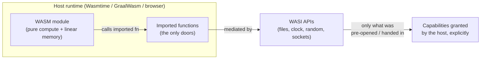
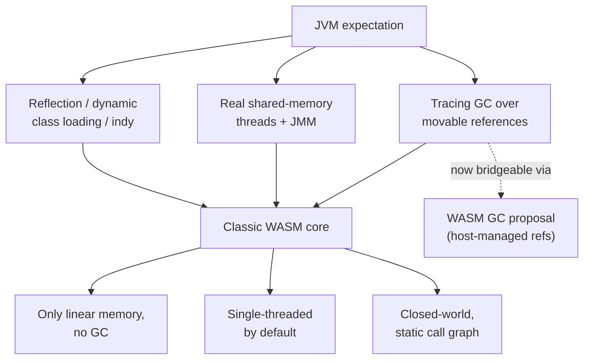
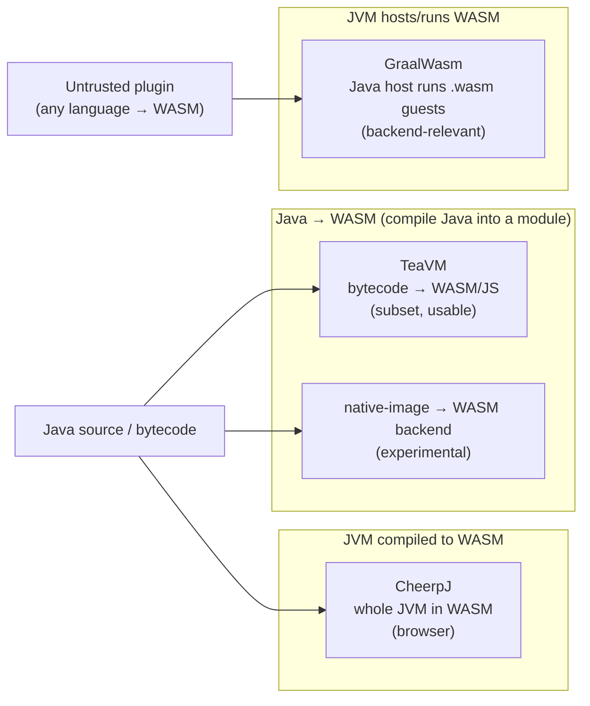

# WebAssembly & Java: WASM, WASI, and Running the JVM Everywhere

T05 showed how GraalVM native-image trades flexibility for a single native binary that starts instantly. **WebAssembly (WASM)** asks a related but different question: instead of one binary per CPU/OS, what if there were *one portable bytecode* that any host — browser, edge node, plugin sandbox, serverless runtime — could run at near-native speed inside a tight security box? Think of WASM as **a universal shipping container for code**: the same sealed box gets lifted by any crane (any host runtime) at any port (any OS/CPU) without re-packing the contents. That promise — portable, sandboxed, near-native — is why backend engineers who never write a line of browser code now care about WASM.

The honest 2026 framing the rest of this topic defends: **WASM as a target *for* Java is still largely emerging and experimental**, while **WASM as a *capability the JVM ecosystem can host and exploit* is real and shipping**. Those are two very different sentences and conflating them is the most common mistake. At the **format** layer, WASM is a compact stack-machine bytecode with a *linear memory* model and a deliberately minimal instruction set, designed for fast validation and ahead-of-time/just-in-time host compilation. At the **system-interface** layer, **WASI** (the WebAssembly System Interface) is what lets a `.wasm` module do I/O *outside* the browser — files, sockets, clocks, randomness — via a capability-based API; **WASI Preview 1** is widely deployed, while **WASI Preview 2** and the **Component Model** (typed, language-agnostic module composition) are newer and maturing rather than fully settled. At the **fit** layer, Java is genuinely hard to compile to WASM because the JVM leans on a *managed heap with GC*, *threads*, and *reflection* — none of which WASM's original linear-memory, single-threaded, static model offered; the **WASM GC proposal** (managed reference types, now shipping in major engines) is the single biggest reason "Java on WASM" went from "basically impossible" to "emerging." At the **options** layer, the practical routes in 2026 — TeaVM, CheerpJ, GraalWasm, and the various JVM-targets-WASM efforts — each work in a narrow band and fail outside it; we will label each honestly. At the **why-it-matters** layer, the killer use-cases are **sandboxed plugins** (run untrusted user code safely), **edge compute**, and **portable polyglot functions** — and the sandbox itself, **a padded room with only the doors you are handed**, is a real isolation primitive worth contrasting with containers.

> [!NOTE]
> Prerequisites: [AOT & GraalVM native-image](./T05-aot-and-graalvm-native-image.md) (L3/C02/T05) — the closed-world / build-time-compilation mindset transfers directly to WASM; [Bytecode basics](./T03-bytecode-basics.md) (L3/C02/T03) — WASM is *another* bytecode, and the contrast with JVM bytecode is instructive; [JVM architecture](./T01-jvm-architecture-and-runtime-data-areas.md) (L3/C02/T01) — to see why GC/threads/reflection make Java a poor native fit for WASM; [Garbage collection fundamentals](./T07-garbage-collection-fundamentals.md) (L3/C02/T07) — to understand what the WASM GC proposal does and does not give you.

## What WebAssembly Actually Is

WebAssembly is a **binary instruction format for a stack-based virtual machine**. A `.wasm` module is *not* tied to a CPU — like a JVM `.class` file, it is an intermediate target that a host engine compiles to real machine code. Unlike JVM bytecode, it was designed from the start to be (a) trivially fast to validate, (b) compiled ahead-of-time or quickly JIT-ed by the host, and (c) executed inside a **mandatory sandbox**.

Four properties define it, and each maps to a backend concern:

- **Portable.** One module runs on x86-64, ARM64, 32-bit, big-endian or little-endian hosts — the *engine* hides the CPU. (Contrast with T05's native-image, which produces *one binary per target triple*.)
- **Near-native speed.** Because the format is low-level and statically typed, host engines (V8, Wasmtime, Wasmer, GraalWasm) produce good machine code. "Near-native" is real but not magic — typical numbers I would hedge at *roughly* 0.8–1.5× native for compute-bound code, worse for memory-indirection-heavy or call-heavy code.
- **Sandboxed by construction.** A module starts with *no* ambient authority: it cannot open a file, make a syscall, or read host memory unless the host explicitly *imports* a function granting that. This is the "padded room" — and it is the property backend engineers should care about most.
- **Language-agnostic.** C, C++, Rust, Go, C#, and (with caveats) Java all target it. The host doesn't know or care what language produced the module.

### Linear Memory: The Model That Makes Java Hard

A classic WASM module owns a single contiguous, byte-addressable **linear memory** — essentially a growable `byte[]` (a sandboxed `ArrayBuffer`). Pointers are just *offsets* into that array. There is no host-visible pointer arithmetic outside it; a load at offset `i` that exceeds the memory length traps rather than reading host RAM. This is wonderful for C/Rust (which already think in flat memory) and *terrible* for the JVM, which expects a managed heap of object references the collector can move and trace. We will return to why this hurts Java in [Why WASM Is Hard for Java Specifically](#why-wasm-is-hard-for-java-specifically).

```wat
;; A minimal WASM module in the text format (.wat).
;; It declares one linear memory and an exported add function.
(module
  (memory (export "mem") 1)              ;; 1 page = 64 KiB of linear memory
  (func (export "add") (param $a i32) (param $b i32) (result i32)
    local.get $a
    local.get $b
    i32.add)                            ;; stack machine: push a, push b, add
  (func (export "load") (param $off i32) (result i32)
    local.get $off
    i32.load))                          ;; load from linear memory at offset
```

Note the deliberately tiny type system: `i32`, `i64`, `f32`, `f64`, plus reference types in newer versions. There is no built-in `String`, no `Object`, no class — everything richer must be *built on top of* linear memory by the source language's runtime.

A few byte-level facts that matter when you actually move data across the boundary:

- **Linear memory grows in 64 KiB pages.** `memory.grow` adds whole pages; the module declares an initial and (optionally) maximum size. A 32-bit address space caps a single classic memory at 4 GiB (the `memory64` proposal lifts this to 64-bit addressing, but it is *newer* — verify support before relying on it).
- **Loads/stores are little-endian, always.** WASM fixes endianness in the spec, so a `.wasm` module behaves identically on a big-endian host — the engine does the swapping. This is part of what makes the "same box on any crane" claim true at the bit level, and it is a sharp contrast with raw native code, which inherits the CPU's endianness.
- **Marshalling is your problem (in the classic model).** To pass a Java/JS string into a linear-memory module you copy its bytes into the module's memory at an agreed offset and pass the `(offset, length)` pair as two `i32`s. There is no automatic object graph transfer. The **Component Model** exists precisely to replace this hand-marshalling with typed interfaces — which is why its maturity (hedged below) matters so much for ergonomic polyglot work.

The standard toolchain you will actually touch lives in the **WABT** (WebAssembly Binary Toolkit) and runtime CLIs. A backend engineer's first hour with WASM usually looks like this:

```bash
# Convert human-readable text format to a binary module, and back again.
wat2wasm add.wat -o add.wasm        # assemble .wat -> .wasm
wasm2wat add.wasm -o roundtrip.wat  # disassemble to inspect what an engine sees

# Validate and inspect a module without running it.
wasm-validate add.wasm              # single-pass spec validation
wasm-objdump -x add.wasm            # dump sections: types, imports, exports, memory

# Run a WASI module in a standalone runtime, granting ONE directory only.
wasmtime run --dir=./data plugin.wasm     # plugin sees ./data and nothing else

# Inspect what the module demands from the host (its "doors").
wasm-objdump -j Import -x plugin.wasm
```

The `--dir` flag is the capability model made concrete: omit it and the module's `fd_read`/`path_open` calls have nothing to operate on. This is the same "hand it exactly one door" idea you wire up programmatically from Java with GraalWasm.

### How WASM Bytecode Differs From JVM Bytecode

Because [bytecode basics](./T03-bytecode-basics.md) (L3/C02/T03) is a prerequisite, the contrast is worth making explicit — it explains a lot of WASM's design:

| Aspect | JVM bytecode | WebAssembly |
| --- | --- | --- |
| Machine model | Stack machine | Stack machine (similar feel) |
| Object model | First-class: `new`, `invokevirtual`, references, GC built in | None in core: only numbers + (later) opaque refs; objects are a *source-language convention over linear memory* |
| Dynamic dispatch | `invokevirtual` / `invokeinterface` / `invokedynamic` | Indirect calls through a typed function table; no language-level vtables |
| Verification | Bytecode verifier, fairly involved | Single-pass, near-linear validation by design |
| Memory | Managed heap, hidden from program | Explicit linear memory the program addresses by offset |
| Strings/types | Rich constant pool, `String`, descriptors | `i32/i64/f32/f64` (+ refs); no strings, no rich type metadata |

The headline: **JVM bytecode encodes a managed object-oriented runtime; WASM encodes a minimal abstract CPU.** Everything object-shaped on WASM is something a compiler *synthesized*. That is exactly why a managed language like Java needs either a giant runtime baked into the module or the WASM GC proposal to feel native.

### Execution Model: Validate, Compile, Run

A host engine does not interpret `.wasm` byte-by-byte for long. The lifecycle is: **decode → validate (single pass, type-checks the stack discipline) → compile (AOT or baseline-JIT to host machine code) → instantiate (allocate the memory/tables, run the start function) → execute.** Engines like Wasmtime (Cranelift backend) and GraalWasm (Truffle) can do tiered compilation much like the JVM's C1/C2 you saw in T04 — a fast baseline first, optimizing later for hot code. This is why startup can be very fast (validation is cheap) *and* steady-state can approach native (the optimizing tier kicks in). The cost knobs you will tune in production are exactly compile-strategy, memory limits, and fuel.

## WASI: WebAssembly Beyond the Browser

WASM alone is pure computation in a box with no doors. **WASI — the WebAssembly System Interface — is the standardized set of doors.** It is the reason WASM matters on servers, edge, and plugins rather than only in browsers.

- **WASI Preview 1 (`wasi_snapshot_preview1`)** — mature and widely deployed. Provides a POSIX-flavored, *capability-based* API: file descriptors, clocks, random bytes, env vars, args. The capability twist: a module gets a directory only if the host **pre-opens** it and hands the descriptor in. No path means no access — you cannot escape to `/etc/passwd` because the door was never installed.
- **WASI Preview 2 + the Component Model** — *newer and still maturing as of 2026*. Preview 2 reorganizes WASI around the **Component Model**: instead of passing raw integers and linear-memory offsets across the boundary, components describe their imports/exports with **WIT** (WASM Interface Types) — typed, language-agnostic interfaces. This is what would eventually let a Java component call a Rust component passing real `string`/`list<record>` values without hand-rolled marshalling. I would explicitly hedge here: the Component Model's *spec* is stabilizing and tooling is improving, but treating it as a finished, ubiquitous foundation in 2026 would overstate it. Verify the exact maturity for your target runtime before betting on it.



> [!IMPORTANT]
> The mental model that prevents 90% of confusion: **WASM is the engine and the cage; WASI is the (capability-gated) set of system calls.** A module with *no* WASI imports literally cannot touch the outside world — which is exactly why it makes a great sandbox for untrusted code.

In Practice: the capability model is the opposite of the POSIX/JVM default you are used to. A normal Java process inherits *ambient* authority — it can open any file the OS user can, dial any socket, read the wall clock — and you claw that back with a `SecurityManager` (now deprecated/removed), seccomp, AppArmor, or containers. A WASM module inherits *nothing* and you hand it precisely the descriptors it needs. "Default deny, grant explicitly" is structurally easier to reason about than "default allow, sandbox after the fact," which is the deeper reason this model is attractive for untrusted code even before you count the speed.

## Why WASM Is Hard for Java Specifically

Compiling C or Rust to WASM is comparatively straightforward — those languages already match WASM's flat-memory, manual-or-static model. Java fights the format in three places that map directly to the JVM internals you have studied in this chapter.

1. **Garbage collection and the managed heap.** The JVM's whole identity (T01, T07) is a tracing collector over a heap of movable object references. Classic WASM had *only* linear memory and **no GC**. To run Java you had two bad choices: ship an *entire GC implementation compiled into the module's linear memory* (bloated, and a GC running inside a single flat byte array, blind to the host) — or radically restrict the language. The **WASM GC proposal** changes this: it adds first-class managed *struct* and *array* reference types that the **host engine's own collector** manages. That means a Java object can (in principle) become a host-managed GC reference instead of a hand-rolled blob in linear memory — dramatically better for a managed language. As of 2026 WASM GC is shipping in major engines, and it is the single development that makes "real Java on WASM" plausible rather than a stunt. It is still *young*, and full JVM semantics on top of it are an active research/engineering frontier — hedge accordingly.

2. **Threads.** Java's memory model and `java.util.concurrent` assume real shared-memory threads (see L3/C01). Core WASM was single-threaded; the **threads + shared-memory proposal** (shared linear memory + atomics) exists and ships in places, but it is not the universal baseline, and on the edge/serverless side many hosts deliberately run modules single-threaded for isolation. A Java program that spins up a thread pool may simply have nowhere to put the threads.

3. **Reflection, dynamic class loading, and `invokedynamic`.** Java's runtime dynamism — `Class.forName`, reflection, proxies, lambda/string-concat via `invokedynamic` — is exactly what T05's closed-world AOT also struggles with. Whole-program compilers to WASM inherit the *same* closed-world constraint: code that loads classes by name at runtime, or reflects over arbitrary members, generally does not survive the trip unless explicitly accounted for.



> [!TIP]
> If you internalized T05's closed-world reachability analysis, you already understand 70% of why "compile Java to WASM" is hard: it is *the same closed-world problem* (no runtime class loading, reflection needs hints), **plus** the extra mismatch of GC and threads against the WASM core model.

#### A Closer Look at the GC Mismatch

It is worth being precise about *why* "ship the GC inside linear memory" is so bad, because it sharpens the value of the WASM GC proposal (and connects to [GC fundamentals](./T07-garbage-collection-fundamentals.md), L3/C02/T07). If Java objects live as hand-laid-out blobs in the module's flat `byte[]`:

- The collector you bundle must trace *that byte array* with no help from the host. It cannot use the host's write barriers, card tables, or generational support — you are reimplementing a GC on top of a sandboxed array.
- The host engine's *own* collector sees the entire linear memory as one opaque live blob. It cannot reclaim a single dead Java object; it can only grow or free the whole memory. So you get *two* memory managers that do not cooperate, and the outer one is blind.
- Compaction/relocation (what makes modern collectors like G1/ZGC cheap, per T07/T08) is something you must implement yourself inside the array, fixing up every offset-pointer by hand.

The **WASM GC proposal** dissolves this by giving the module real `(ref $struct)` / `(ref $array)` values that the **host's** collector traces and reclaims natively. Now a Java object *is* a host-managed reference, and the engine's mature collector does the work — no nested GC, no opaque blob. That is precisely why it is the enabling technology, and also why "real Java on WASM" is still young: building full JVM object/class semantics on these primitives is non-trivial, ongoing engineering.

## The Real Options Today (With Honest Maturity Labels)

There is no single blessed "javac --target wasm" in 2026. There are four families, each useful in a narrow band. Treat the maturity labels as the load-bearing part of this section.

### TeaVM — Java/JVM-bytecode → WASM (and JS)

**What it is.** TeaVM is an ahead-of-time compiler that takes *JVM bytecode* (so any JVM language that compiles to it) and emits JavaScript or WASM. It does its own whole-program analysis and ships a small runtime.

**Maturity / honest take.** Real, used in production for *front-end-ish* and embedded scenarios, actively maintained. But it is **not the full JVM**: it supports a curated subset of the class library, reflection is limited, and you target *its* model, not "run any JAR." Best when you control the code and it is reasonably self-contained. Maturity: **usable today, with constraints.**

The kind of Java that compiles cleanly is plain, self-contained, library-light code:

```java
// Compiles well to WASM via TeaVM: pure logic, standard arithmetic,
// no reflection, no dynamic class loading, no thread pools, minimal library.
public final class Fnv1aHash {
    private static final int OFFSET_BASIS = 0x811c9dc5;
    private static final int PRIME        = 0x01000193;

    public static int hash(byte[] data) {
        int h = OFFSET_BASIS;
        for (byte b : data) {
            h ^= (b & 0xff);
            h *= PRIME;
        }
        return h;
    }
}
```

The moment you add `Class.forName(...)`, a `ServiceLoader`, an `ExecutorService`, or a heavy framework, you leave the supported band — the same closed-world wall as T05. Treat "compile *this* Java to WASM" as a question about *which* Java, not Java in general.

### CheerpJ — a JVM-in-WASM (browser)

**What it is.** CheerpJ runs an actual JVM (and large parts of the Java class library, AWT/Swing included) *compiled to WASM*, so existing Java apps and applets can run in the browser unmodified. The JVM is the WASM module; your bytecode is data it interprets/JITs.

**Maturity / honest take.** Impressive and genuinely shipping for the "legacy Java app in the browser" use-case. The trade-off is exactly what you would expect from shipping a whole JVM as a WASM payload: a large initial download (the runtime + class library, fetched and cached) and a model where your bytecode is *interpreted/JIT-ed by a JVM-in-the-page* rather than compiled to lean WASM. That is the opposite end of the spectrum from TeaVM's tiny self-contained output — CheerpJ maximizes *compatibility* (run existing apps unchanged, AWT/Swing and all) at the cost of *footprint*, while TeaVM maximizes leanness at the cost of *coverage*. Maturity: **production for its niche (browser-side Java), not a backend tool.** If your problem is "modernize a desktop Java app's delivery without rewriting it," it is excellent; if your problem is anything server-side, it is the wrong tool.

### GraalWasm — run WASM *inside* GraalVM

**What it is.** The mirror image of the others: GraalWasm is a WASM engine *implemented on Truffle inside GraalVM*. It lets a **Java host application execute `.wasm` modules** as guests — so your backend stays Java, and you embed WASM as the sandbox for untrusted/polyglot code.

**Maturity / honest take.** This is the option most relevant to *backend Java engineers*, and the one I would reach for first. You are not compiling Java to WASM at all — you are using Java as the host and WASM as a safe extension point (plugins, user scripts). It interoperates with GraalVM's polyglot story (the same `Context`/`Value` API you would use to embed JavaScript or Python). Maturity: **real and improving; supported WASM proposals (e.g. GC, threads) vary by version, so check before relying on a specific feature.** Note also that GraalWasm runs at its best *on GraalVM*; on a stock HotSpot JVM the experience and performance characteristics differ, so confirm your deployment runtime.

There is a second backend-relevant embedding path worth naming: **lightweight standalone WASM runtimes with Java bindings** — e.g. the Chicory pure-Java WASM interpreter/runtime, or JNI/FFM bindings to native engines like Wasmtime/Wasmer. Chicory's pitch is "no native dependency, runs anywhere a JVM runs," which is attractive for portability though it trades away the raw speed of a native JIT engine. The landscape here moves quickly; treat specific projects as *check-current-status* rather than settled.

### JVM-targets-WASM efforts (incl. WASM-as-a-native-image-backend)

**What it is.** Ongoing work to make GraalVM native-image (and related toolchains) emit **WASM** as an output backend — i.e. the AOT pipeline from T05, but producing a `.wasm` instead of an ELF/Mach-O binary, leaning on WASM GC for the managed heap.

**Maturity / honest take.** **Experimental / emerging as of 2026.** This is the most exciting long-term path (it would make "Java to portable sandboxed module" a first-class AOT target) but it is exactly where you should hedge hardest: feature coverage, performance, and stability are moving targets. Do not architect production systems around it yet without verifying current state.



In Practice: a backend team that wants "safe user-supplied extensions in our Java service" should **not** start by compiling their Java to WASM. They should use **GraalWasm to host WASM plugins** authored in whatever language, keeping the trusted host in ordinary, fully-supported JVM code. Compiling Java *to* WASM is the interesting-but-immature direction; hosting WASM *from* Java is the boring-but-shipping one.

The directional summary to carry out of this section:

- **Java → WASM** (TeaVM, native-image WASM backend): pick when you *must* ship Java logic as a portable module and you control the (constrained) code. Expect to fight the closed-world/GC/threads walls. Emerging.
- **JVM-in-WASM** (CheerpJ): pick only for *browser delivery* of existing Java apps. Niche, mature.
- **WASM in JVM** (GraalWasm, Chicory, FFM-to-native-engine): pick for *plugins, untrusted extensions, polyglot embedding* in a Java backend. This is the mainstream, shipping path — and the one to default to.

## Use-Cases Where It Matters (and Where It Doesn't)

### Sandboxed Plugins and Extensions — the strongest case

The flagship backend use-case: **run untrusted, user-supplied code safely inside your process.** A customer uploads a data-transformation script, a fraud rule, a custom serializer. You must run it without letting it read your secrets, exhaust your host, or call out to the network. WASM's zero-ambient-authority sandbox is purpose-built for this, and from Java you embed it via **GraalWasm**.

```java
// Sketch: a Java backend hosting an untrusted WASM plugin via GraalVM's
// polyglot Context API. The plugin gets NO file/network/clock access unless
// we explicitly wire it in — the "padded room with only the doors we hand it."
import org.graalvm.polyglot.*;
import org.graalvm.polyglot.io.IOAccess;

public final class PluginHost {

    public int runUntrustedTransform(byte[] wasmModuleBytes, int input) {
        // Deny all host I/O by default; grant nothing the module can abuse.
        try (Context ctx = Context.newBuilder("wasm")
                .allowIO(IOAccess.NONE)          // no files
                .allowHostAccess(HostAccess.NONE) // no Java callbacks
                .allowCreateThread(false)         // no threads
                .build()) {

            Source src = Source.newBuilder("wasm", ByteSequence.create(wasmModuleBytes), "plugin")
                                .build();
            ctx.eval(src);

            // Call an exported function; if it traps or escapes, it fails here,
            // not in our host. We can also bound fuel/time/memory via engine options.
            Value transform = ctx.getBindings("wasm").getMember("transform");
            return transform.execute(input).asInt();
        }
    }
}
```

> [!INTERVIEW]
> **Q: "Why might you choose a WASM sandbox over a container to run untrusted user code inside a Java backend?"**
> A strong answer distinguishes the *isolation boundary and granularity*. A container isolates a *process* via Linux namespaces/cgroups — heavyweight, OS-level, and the code inside still runs with whatever syscalls the kernel exposes (you harden it with seccomp/gVisor/Kata). A WASM module isolates a *function-sized unit of code* with **deny-by-default, capability-based** access *in-process*: it has no syscalls at all unless the host imports them, memory accesses are bounds-checked into linear memory so it cannot read host RAM, and you can spin one up in microseconds rather than the tens-to-hundreds of milliseconds a container costs. Trade-offs to name: WASM's ecosystem and language/library support are narrower, the security model is only as good as the engine's correctness (a sandbox-escape bug is catastrophic), and side-channel/resource-exhaustion concerns still need fuel/memory limits. Bonus points for noting they are **complementary** — WASM-in-container is common — and for being honest that for *full untrusted OS-level workloads* a microVM (Firecracker) is still the safer boundary.

### Edge Compute and Portable Polyglot Functions

Edge platforms want code that starts in *single-digit milliseconds*, weighs little, and runs identically across heterogeneous edge hardware — precisely WASM's portability + fast-start pitch (and a sibling concern to the CDN/edge material elsewhere in the curriculum). The honest Java caveat: today the edge-WASM story is dominated by Rust/Go/JS because compiling Java to a *small, fast-starting* WASM module is exactly the emerging-and-heavy part. So the edge case "matters" conceptually but, for *Java specifically*, is more aspiration than production in 2026.

Concretely, the edge platforms that lean hardest on WASM today (e.g. Fastly's Compute and Cloudflare Workers' WASM support, among others) optimize for cold-starts in the low-millisecond range by instantiating a *pre-compiled* module rather than booting a runtime — closer to T05's native-image startup than to a cold JVM. The reason Java is underrepresented there is the same triangle from earlier: a small, fast-starting Java WASM module is the part that is still emerging. I would not assert any specific platform's current Java support without checking; the pattern (WASM = fast edge starts) is durable, the *Java-on-it* part is the hedge.

**Portable polyglot functions** ride on the Component Model: a single typed interface (in WIT) implemented once, callable across languages — a Java host composing a Rust crypto component and a Go parsing component without FFI glue. Powerful in principle; gated on Component-Model maturity (hedged above).

### Browser-Side Java

CheerpJ's domain: keep a legacy Swing/applet Java app alive in the browser by shipping the JVM as WASM. Real, but a *migration/legacy* use-case, not new backend architecture.

### Where It Does NOT Yet Make Sense

- **Your main production microservice.** A normal, long-running Spring Boot service has none of WASM's pain points solved better by WASM — use the JVM (or native-image for cold-start). Do not rewrite it to WASM.
- **Heavily threaded / reflection-heavy / large-class-library Java**, compiled *to* WASM. You will hit the GC/threads/dynamism walls above.
- **Anything depending on bleeding-edge proposals (Component Model, WASM threads) as a stable foundation** without verifying current engine support.

In Practice: a useful rule of thumb — **host WASM from Java (mature) for untrusted-plugin and polyglot-extension problems; be cautious about compiling Java to WASM (emerging) for everything else.**

## The Sandbox Model as a First-Class Security Primitive

It is worth stating the security argument cleanly because it is the durable reason WASM survives the hype. The WASM sandbox gives you, by construction:

- **No ambient authority.** A module begins with zero capabilities; every external power is an explicitly imported function. The padded room ships with no doors — you install exactly the ones you intend.
- **Memory safety against the host.** Loads/stores are bounds-checked into linear memory (or are host-managed GC refs); a buggy or malicious module cannot stray into host process memory. Contrast a JNI/native library in a normal JVM, which shares the process address space with *no* such guarantee.
- **Deterministic, enforceable resource limits.** Engines support "fuel"/instruction metering, memory caps, and timeouts, so an infinite loop or memory bomb is bounded rather than fatal to the host.
- **Tiny, auditable trusted-computing base** compared to "trust the whole OS + container runtime."

Set against the alternatives, the granularity and cost differences are the whole story:

| Boundary | Isolation unit | Mechanism | Startup | Best for |
| --- | --- | --- | --- | --- |
| **WASM module** | A function / module, in-process | Bounds-checked memory + zero ambient authority + fuel limits | microseconds | Embedding *untrusted logic* inside a trusted host |
| **Container** | A process + filesystem | Linux namespaces + cgroups (+ seccomp) | tens–hundreds of ms | Shipping and isolating whole *applications* |
| **MicroVM (Firecracker)** | A guest kernel | Hardware virtualization | ~100+ ms | Strong isolation of fully *untrusted workloads* |
| **In-JVM (classic)** | A thread / class loader | Was `SecurityManager` (deprecated/removed) | ~0 | *Trusted* code only — weak against malicious code |

The takeaway: WASM fills a real gap — *in-process, sub-millisecond, default-deny* isolation that the JVM itself no longer offers now that `SecurityManager` is gone. They are layers, not rivals — running WASM modules inside a container is a perfectly normal defense-in-depth posture, and is increasingly the recommended one for high-stakes untrusted code.

In Practice: a payments company lets merchants upload custom "risk rules" that score each transaction. Running those as raw Java (reflection, classpath, full filesystem) would be reckless; running each in its own container adds tens of milliseconds and real orchestration cost per rule. Compiling each rule to a WASM module hosted in the existing Java service gives microsecond instantiation, a hard memory cap, a fuel limit so a runaway rule cannot stall the scoring path, and — crucially — *no* way for a rule to read another merchant's data or call out to the network, because those doors were never installed. That is the shape of the problem WASM-from-Java is genuinely good at in 2026.

> [!WARNING]
> The sandbox is only as trustworthy as the engine implementing it. A correctness bug in the WASM runtime is a sandbox escape, and history shows engines do ship such bugs. Treat the engine as security-critical: keep it patched, prefer mature engines, and still impose memory/fuel limits and (for high-stakes untrusted code) an *outer* boundary like a container or microVM. Defense in depth, not a single magic wall. Two more caveats engineers forget: WASM's memory-safety guarantee protects the *host* from the guest, but it does **not** make a memory-unsafe *source language* (C/C++) safe *within* its own linear memory — a buffer overflow inside the module can still corrupt that module's own state. And timing/side-channel isolation is *not* something the WASM sandbox promises; if you are defending against Spectre-class attacks you need the engine's and platform's specific mitigations, not WASM's bounds checks alone.

## Practice

1. **Host a WASM module from Java.** Add GraalVM/GraalWasm; compile a tiny Rust or C function (`add`, `fib`) to `.wasm`; load and call it from a Java host via the polyglot `Context` API. Confirm it runs with no I/O granted.
2. **Prove the sandbox.** Inside the hosted module, attempt a file open or out-of-bounds linear-memory load; observe the trap/denial. Then explicitly grant one directory via WASI pre-open and show *only* that path is reachable.
3. **Enforce limits.** Configure memory and fuel/timeout limits on the engine; feed it an infinite-loop module and a memory-bomb module; verify the host survives and the guest is terminated.
4. **TeaVM smoke test.** Take a small, self-contained Java class (no reflection, minimal library use); compile it to WASM with TeaVM; run it; then deliberately add a reflective call and observe what breaks. Write down the constraint you hit.
5. **Read the bytecode.** Hand-write or generate a `.wat` module, convert to `.wasm` (`wat2wasm`), disassemble it back (`wasm2wat`), and map each instruction to what the JVM equivalent would be — note where WASM has *no* equivalent (e.g. objects, `invokevirtual`).
6. **Marshal a string.** Write a `.wat` module exporting a `len(offset)` function over linear memory; from a Java host, copy a string's UTF-8 bytes into the module's memory and call it with the `(offset, length)` convention. Feel firsthand why the Component Model exists.
7. **Maturity audit.** For your chosen runtime (Wasmtime, GraalWasm, a browser engine), look up which proposals it supports *today*: WASM GC, threads, Component Model. Document exactly what is on vs. off — this is the verification habit this whole topic is built around.
8. **Architecture memo.** Write a one-page decision note for a hypothetical "let customers upload data-transform scripts" feature: WASM-plugin-in-Java vs. container-per-script vs. microVM. State the isolation boundary, startup cost, and failure mode of each, and recommend one.
9. **Native-image vs. WASM thought experiment.** Re-read T05's closed-world section; list which of native-image's reachability/reflection constraints would *also* apply to a hypothetical Java→WASM AOT path, and which extra (GC, threads) ones are new.

## Recap

You should now be able to:

- Define **WebAssembly** as a portable, sandboxed, near-native, language-agnostic *stack-machine bytecode* with a *linear-memory* model — and explain why that model (a flat, little-endian `byte[]` of offsets, page-granular growth) suits C/Rust and fights the JVM.
- Explain **WASI** as the *capability-based system interface* that takes WASM beyond the browser to servers/edge/plugins, and correctly label maturity: **Preview 1 mature/deployed; Preview 2 + Component Model (WIT) newer and still maturing in 2026**.
- Articulate **why Java specifically is hard on WASM** — managed GC heap vs. linear memory (the classic blocker, including the "nested GC over an opaque blob" problem), threads/JMM vs. single-threaded core, and reflection/dynamic loading/`invokedynamic` vs. closed-world compilation — and identify the **WASM GC proposal** as the development that makes real Java-on-WASM plausible (shipping but young).
- Contrast **WASM bytecode with JVM bytecode**: both stack machines, but WASM encodes a minimal abstract CPU (no objects, no vtables, explicit memory) while JVM bytecode encodes a managed OO runtime.
- Compare the four real option families with honest maturity: **TeaVM** (bytecode→WASM/JS, usable subset), **CheerpJ** (whole JVM in WASM, production for *browser-side* Java), **GraalWasm** (Java *hosts/runs* WASM guests — the backend-relevant, shipping choice), and **JVM-targets-WASM / native-image WASM backend** (*experimental/emerging*).
- Pick correct use-cases: **sandboxed untrusted plugins** (strongest, via GraalWasm), **edge compute / portable polyglot functions** (conceptually strong, Java-specifically immature), **browser-side legacy Java** (CheerpJ) — and reject WASM for your ordinary production microservice or heavily-threaded/reflective Java compiled *to* WASM.
- Argue the **sandbox as a security primitive**: zero ambient authority, host-memory safety, enforceable fuel/memory limits, small TCB — and place it against containers (OS-process granularity) and microVMs as complementary layers, while respecting that the engine itself is security-critical and that WASM does not promise side-channel or in-module memory safety.

## Next

This is the final concept topic in **JVM Internals & Performance (C02)** — you have gone from JVM architecture and bytecode (T01–T03), through JIT and AOT/native-image (T04–T05), memory and garbage collection (T06–T10), profiling/benchmarking/tuning (T11–T13), flags/ergonomics (T14), and out to the JVM's emerging portability frontier in WASM (this topic). The natural continuation is the chapter's hands-on and best-practices material, and — since WASM-from-Java's flagship use-case is *safe untrusted execution* — the security and sandboxing themes you will meet in the backend-engineering and architecture levels, where WASM resurfaces as a plugin and edge-isolation primitive rather than a JVM internal.
