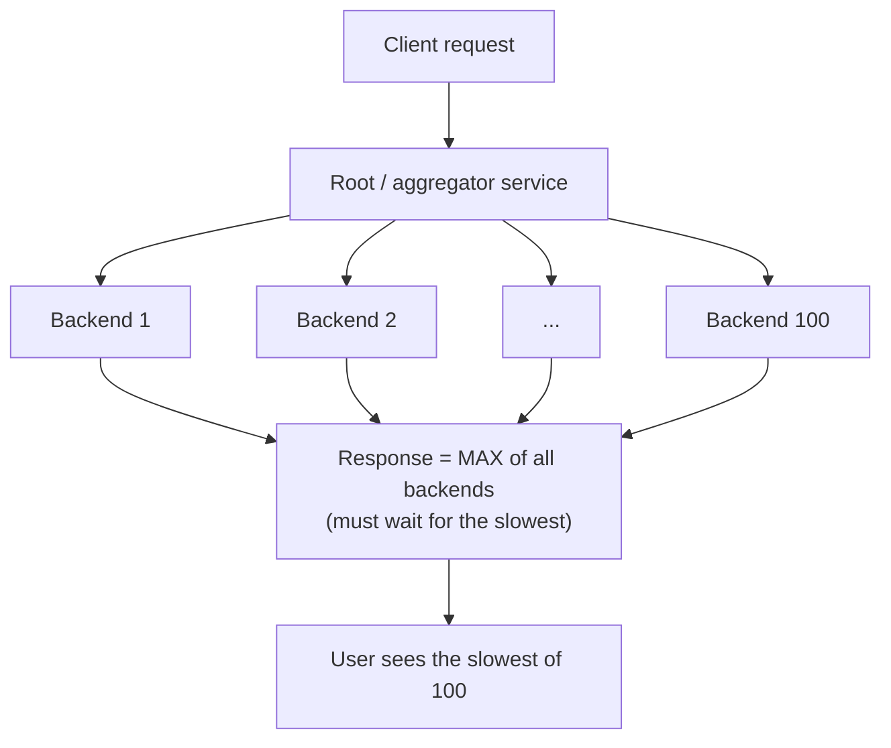
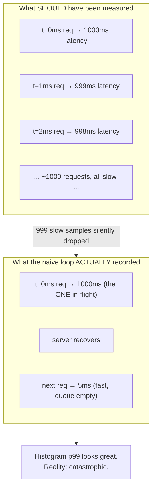
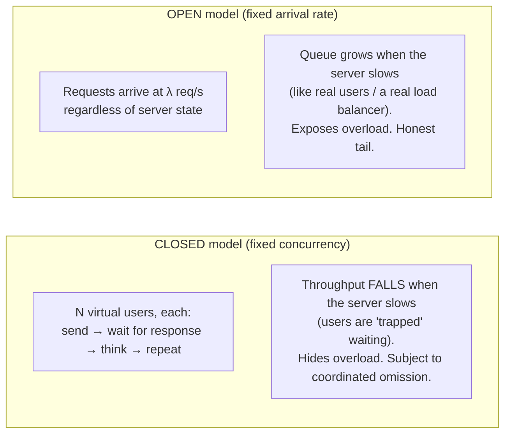
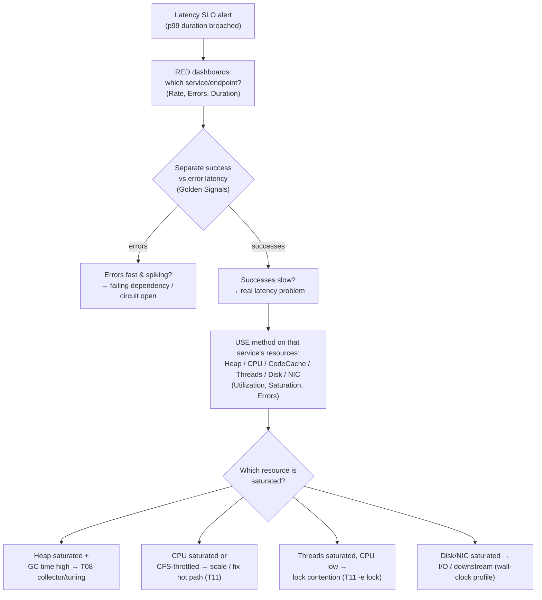

# Tail-Latency Engineering & Load Testing

T13 gave you the *general* tuning methodology — SLOs, the USE/RED methods, the diagnostic loop, the cost ladder. This topic zooms into the single dimension that dominates user-facing systems and that the general methodology only sketches: **the tail of the latency distribution**. It is the difference between a service that "feels fast" in a demo and one that holds a p99 SLO under real production load. It is also where most load tests *lie* — through a measurement bug called coordinated omission — and where most engineers, asked "how fast is your service?", give a number (the average) that no real user ever experiences.

The depth-bar requirement here is not "watch p99 in Grafana." At the **statistical** layer, latency is a *distribution*, not a scalar; averages are mathematically incapable of describing it, percentiles cannot be averaged, and you must record full distributions (histograms) to reason about the tail at all. At the **measurement** layer, **coordinated omission** systematically deletes the worst observations from a naive load test — the very observations you ran the test to find — so the tooling (HdrHistogram, `wrk2`, Gatling's open model) must be built to defeat it. At the **JVM** layer, the tail has identifiable physical sources — GC pauses (T08), JIT recompilation and deoptimization (T04), safepoint-to-safepoint time-to-safepoint, lock convoying, allocation stalls, TLB/cache misses — and each is attributable with the profilers from T11. At the **systems** layer, **fan-out amplifies the tail**: a request that touches 100 services waits on the slowest of 100, so a "rare" p99 event becomes the *common* case. At the **design** layer, you mitigate what you cannot eliminate — hedged/backup requests, timeout budgets, load shedding (cross-referencing the resilience patterns in L5). We will cover all five layers, with a worked histogram read and runnable k6 and Gatling scripts.

> [!NOTE]
> Prerequisites: [Performance tuning methodology](./T13-performance-tuning-methodology.md) (L3/C02/T13) — this topic is the tail-latency deep dive that complements T13's general loop; [Profiling](./T11-profiling-jfr-async-profiler-visualvm.md) (L3/C02/T11) — attributing tail sources; [GC algorithms](./T08-gc-algorithms-serial-parallel-g1-zgc-shenandoah.md) (L3/C02/T08) — GC pauses are the classic tail source; [Benchmarking with JMH](./T12-benchmarking-with-jmh.md) (L3/C02/T12) — microbenchmark percentiles vs system-level load testing.

## Why the Tail Is the Product

Here is the most important sentence in this topic: **users do not experience your average; they experience your tail.**

A relatable analogy. You arrive at a supermarket with twelve checkout lanes. The *average* wait across all lanes is two minutes — a fine number for a slide. But you stand in *one* lane, and that lane happens to have a price-check, a card decline, and a coupon dispute ahead of you. You wait eleven minutes. When you tell a friend "that store is slow," you are reporting your p99, not the store's mean. The store's dashboard says two minutes; your lived experience says eleven. Both are true. Only one of them churns customers.

Now make it concrete. A service serves 10,000 requests/sec. Its p99 latency is 500 ms, its mean is 40 ms. That p99 sounds like an edge case — "only 1% of requests." But 1% of 10,000/sec is **100 slow requests every second**, 6,000 per minute. And a single user session that issues 100 requests (page load + assets + API calls) has a roughly `1 - 0.99^100 ≈ 63%` chance of hitting *at least one* p99-tail request. The "rare" tail is the *typical* session.

> [!IMPORTANT]
> A latency target is meaningless without a percentile attached. "Our API responds in 50 ms" is not a claim — it is a category error. "Our API responds in 50 ms at p99" is a claim. Always say which point on the distribution you mean.

## The Tail at Scale — Fan-Out Amplification

The reason the tail matters *more* at scale than in a single service was crystallised by Jeff Dean and Luiz André Barroso in "The Tail at Scale" (CACM, 2013), drawing on Google's production experience.

Consider a request that fans out to many backends in parallel and must wait for *all* of them to return (a typical search or aggregation pattern). The user-facing latency is the **maximum** of the backend latencies, not the average. So the user sees the tail of the slowest backend.



The arithmetic is brutal. If each backend independently has a 1% chance of exceeding 1 second (its p99 = 1 s), then a request fanning out to:

| Fan-out width | P(at least one backend > 1 s) | Effective experience |
|---------------|-------------------------------|----------------------|
| 1 backend | `1 - 0.99¹` = **1%** | p99 behaves like p99 |
| 10 backends | `1 - 0.99¹⁰` ≈ **9.6%** | the p99 event is now ~1-in-10 |
| 100 backends | `1 - 0.99¹⁰⁰` ≈ **63%** | the p99 event is now the *median* |
| 1000 backends | `1 - 0.99¹⁰⁰⁰` ≈ **99.99%** | nearly *every* request hits a tail event |

> [!TIP]
> Dean & Barroso's reframing: at scale, you must engineer for the **p99.9** (and even p99.99) of individual components, because that becomes the **p50** of the fanned-out request. Shaving the average does nothing for this; only shrinking — or routing around — the tail helps. This is why "tail-tolerant design" (below) is a systems discipline, not a micro-optimization.

## Percentile Statistics Done Right

### Why Averages Lie

The mean is destroyed by outliers and hides bimodality. Two services with an identical 40 ms mean can have wildly different user experiences:

```text
Service A: every request ~40 ms          (tight, predictable)
Service B: 99% at 5 ms, 1% at 3500 ms     (mean still ~40 ms, p99 catastrophic)
```

A *single* GC pause, lock wait, or cold-cache miss creates Service B's profile. The mean cannot see it. This is why every serious latency SLO is expressed in percentiles: p50 (median — the typical experience), p90, p99, p99.9 ("three nines"), p99.99 ("four nines"). The number after the p is the *fraction of requests faster than this value*: p99 = 50 ms means 99% of requests completed in ≤ 50 ms.

### The Cardinal Sin: You Cannot Average Percentiles

This is the single most common percentile mistake in production observability.

```text
Server A:  p99 = 100 ms  (over 1,000,000 requests)
Server B:  p99 = 900 ms  (over 1,000 requests)

WRONG:  fleet p99 ≈ (100 + 900) / 2 = 500 ms
WRONG:  fleet p99 ≈ weighted mean = ~101 ms
RIGHT:  unknowable from the two p99 values alone
```

A percentile is a *property of a distribution*. The mean of two percentiles is not the percentile of the combined distribution — there is no arithmetic that recovers the true fleet p99 from per-server p99 values, because you have thrown away the shape. The same trap applies across **time**: you cannot average a 1-minute p99 series into an hourly p99. Grafana/Datadog panels that "average the p99 over the window" are computing a meaningless number.

> [!WARNING]
> If your monitoring stores only the *summary statistic* (a pre-computed p99 per instance per minute), you literally cannot answer "what was the fleet p99 last hour?" The information is gone. To aggregate percentiles correctly across servers and time, you must store and merge the underlying **histograms**, then compute the percentile from the merged histogram.

### Histograms vs Summaries

This drives a concrete tooling choice, formalised by Prometheus:

| | Summary (client-side quantiles) | Histogram (server-side buckets) |
|---|---|---|
| What's stored | Pre-computed p50/p99 per instance | Counts per latency bucket (`le="0.05"`, `le="0.1"`, …) |
| Aggregatable across instances? | **No** (can't average quantiles) | **Yes** (sum the bucket counts, then `histogram_quantile`) |
| Aggregatable over time? | No | Yes |
| Accuracy | Exact for that instance | Bounded by bucket boundaries |
| Cost | Cheap to store | More series (one per bucket) |

The rule: **record distributions, not means.** In the JVM the practical tool is **HdrHistogram** (Gil Tene) — a High Dynamic Range histogram that records values from microseconds to hours with configurable precision (e.g., 3 significant digits) in fixed memory, and crucially supports lossless merging of histograms recorded on different machines. Micrometer's `Timer` with `publishPercentileHistogram()` emits Prometheus-style bucketed histograms backed by an HdrHistogram internally.

```java
// HdrHistogram: record the FULL distribution, not a running mean.
import org.HdrHistogram.Histogram;

// Track 1 ns .. 60 s, 3 significant digits of precision, fixed memory.
Histogram h = new Histogram(60_000_000_000L, 3);

long start = System.nanoTime();
handleRequest();
h.recordValue(System.nanoTime() - start);

// Read the tail directly — these are the numbers that matter:
System.out.printf("p50=%d us  p99=%d us  p999=%d us  max=%d us%n",
    h.getValueAtPercentile(50.0)  / 1000,
    h.getValueAtPercentile(99.0)  / 1000,
    h.getValueAtPercentile(99.9)  / 1000,
    h.getMaxValue()               / 1000);

// Two histograms from two machines merge LOSSLESSLY — then read the true fleet p99:
Histogram fleet = h.copy();
fleet.add(otherMachineHistogram);     // correct cross-host aggregation
```

> [!NOTE]
> Micrometer config equivalent for a Spring Boot service: `management.metrics.distribution.percentiles-histogram.http.server.requests=true` exports the bucketed histogram so Prometheus can aggregate it correctly; do **not** rely on `percentiles=0.99` (client-side) for fleet-wide numbers.

## Coordinated Omission — the Load-Testing Trap

This is the most important — and most counterintuitive — section in the topic. **Coordinated omission** (a term coined by Gil Tene) is a measurement bug that causes virtually every naive load test to *under-report the tail by one or two orders of magnitude*, exactly when the tail is what you ran the test to measure.

### The Mechanism

A naive closed-loop load generator works like this:

```java
// ✗ The naive load loop that LIES about the tail.
while (testRunning) {
    long start = System.nanoTime();
    sendRequestAndWaitForResponse();          // blocks here
    long latency = System.nanoTime() - start;
    histogram.recordValue(latency);
    // immediately loop and send the next request
}
```

Now suppose the server stalls for 1 second (a GC pause, a lock convoy, a stop-the-world safepoint). During that second:

- The *one* in-flight request is correctly measured as ~1000 ms. Good.
- But the load generator was **blocked** for that whole second. It did *not* send the requests it was *supposed* to send during the stall. In a system meant to issue one request per millisecond, ~1000 requests that *should* have been sent — and would each have observed part of that 1-second stall — were silently **omitted**.
- When the server recovers, the generator resumes and those follow-up requests are now fast (~5 ms), because the queue is empty.

The load generator has *coordinated* with the server: it only sends the next request when the server is ready to receive it. So the periods when the server was slowest are precisely the periods when the fewest measurements were taken. The result: a histogram dominated by the fast samples, with the catastrophic stall represented by a *single* data point instead of the thousand it actually caused.



A famous illustration (Tene's): a system that is perfectly responsive for 100 seconds then freezes for 100 seconds, sampled once per second. The naive view records ~100 fast samples and *one* 100-second sample → reported p99 ≈ a few ms. The honest view: half of all *time* was spent at 0–100 s latency → the real p99 is tens of seconds. The naive measurement is wrong by ~4 orders of magnitude at the tail.

### How Proper Tools Correct It

There are two correct strategies, and good tools use one or both:

1. **Run an open model with a fixed schedule.** Decide *in advance* that a request is due at t = 0, 1, 2, 3 … ms. If the response for the t=0 request doesn't come back until t=1000 ms, then the request that was *due* at t=1 ms didn't actually start until 1000 ms, so its true latency is `(1000 − 1) + service_time`. You measure latency against the request's **intended start time**, not the time it happened to be sent. This is what `wrk2` (the corrected fork of `wrk`) and Gatling's open injection model do.

2. **Backfill the histogram after the fact.** HdrHistogram provides `recordValueWithExpectedInterval(value, expectedInterval)`: if you record a 1000 ms value but say you *expected* a request every 1 ms, it synthesises the ~999 missing samples (1000, 999, 998, …) that coordinated omission dropped. This reconstructs the distribution the naive loop should have captured.

```java
// ✓ HdrHistogram's correction: declare your intended request cadence.
// If we expected a request every 1 ms (1,000,000 ns) but this one took 1 s,
// the library backfills the ~999 omitted "should-have-been-sent" samples.
long expectedIntervalNanos = 1_000_000L; // 1 ms target cadence
histogram.recordValueWithExpectedInterval(latencyNanos, expectedIntervalNanos);
```

> [!INTERVIEW]
> **Q: "You ran a load test, it shows p99 = 8 ms, but production p99 is 400 ms under the same RPS. What happened?"**
> The textbook answer is *coordinated omission*. The most likely cause: a closed-loop generator (JMeter default thread group, or a naive `wrk`/custom loop) stopped issuing requests while the server stalled (GC pause, lock contention), so the slow window is under-represented in the histogram. The fix: use an **open-model**, schedule-based generator (`wrk2`, Gatling open injection, k6 with `constant-arrival-rate`), measure latency against intended send time, and/or record with `recordValueWithExpectedInterval`. Bonus points: explain that the test also probably measured at the *client* without separating network/queue time, and that a closed model holds *concurrency* constant while an open model holds *arrival rate* constant — and real users are an open system (they don't wait for your previous response before deciding to click).

## The JVM's Tail Sources — and How to Attribute Them

The general profiling discipline lives in T11; here is the *tail-specific* map — the physical causes of a long-tail spike inside the JVM, with the attribution tool for each.

| Tail source | Mechanism | How to attribute (ties to T08/T11) |
|-------------|-----------|-----------------------------------|
| **GC pause** | Stop-the-world phase freezes all app threads (T08). Even ZGC/Shenandoah have small STW phases + barrier overhead | GC log (`-Xlog:gc*`), JFR `jdk.GCPhasePause`, GCEasy. Overlay pause timestamps on the latency spike |
| **JIT compilation / deopt** | C2 compiling a hot method, or a *deoptimization* (uncommon trap) dropping back to the interpreter, stalls that thread (T04) | JFR `jdk.Compilation`, `jdk.Deoptimization`; `-XX:+PrintCompilation` |
| **Time-to-safepoint (TTSP)** | All threads must reach a safepoint poll before a STW phase begins; a thread in a long counted loop or JNI call delays *everyone* | `-Xlog:safepoint`, JFR `jdk.SafepointBegin`; look for `time to safepoint` >> pause time |
| **Lock contention / convoy** | Threads queue on a contended monitor; a convoy forms when the lock holder is descheduled | async-profiler `-e lock`, JFR `jdk.JavaMonitorEnter`/`jdk.ThreadPark` (T11) |
| **Allocation stall** | TLAB exhausted → slow-path allocation, or allocation blocked waiting for GC to free space | JFR `jdk.ObjectAllocationOutsideTLAB`, allocation flame graph (T11) |
| **TLB / cache / NUMA miss** | Cold data, pointer-chasing, or cross-NUMA-node memory access adds microseconds-to-tens-of-µs per access | `perf stat` (cache-misses, dTLB-load-misses); NUMA pinning; relevant to compact layout (see T15 value classes) |
| **Page fault / swap / CPU steal** | OS reclaims a page, or the hypervisor steals CPU from the VM | `vmstat`, `perf`; in containers, CFS quota throttling — check `nr_throttled` in `cpu.stat` |

> [!IMPORTANT]
> A wall-clock profile (T11, async-profiler `-e wall`) is the right lens for tail spikes, because most tail time is spent **off-CPU** (blocked, parked, or frozen by STW) — a CPU profile would show almost nothing. To pin a specific spike, correlate timestamps: dump GC log + JFR + the latency histogram's timestamped outliers and look for overlap. This is T13's "negative space" method applied to the tail.

### Container CPU Throttling — the Silent Tail

In Kubernetes, a CPU *limit* (`limits.cpu`) maps to a CFS quota. When the JVM (with its GC threads, JIT compiler threads, and your request threads) exceeds the quota inside a 100 ms scheduler period, every thread is **frozen until the next period** — a tail spike with no GC log entry and no hot method. Symptom: p99 latency spikes that correlate with `container_cpu_cfs_throttled_periods_total`, not with GC. The common fix is to set CPU *requests* without aggressive *limits*, and ensure `-XX:ActiveProcessorCount` / container awareness matches the allocation so the JVM doesn't size its thread pools for more cores than it can actually use.

## Load Testing Properly

### Open vs Closed Models — the Foundational Choice

This is the most consequential decision in load test design, and the one most often gotten wrong.



- **Closed model**: a fixed number of virtual users, each looping "request → wait → think". Concurrency is held constant; throughput is an *output*. When the server slows, the loop slows with it, so the offered load *drops* — masking the very overload you want to find, and inviting coordinated omission. JMeter's default thread group is closed.
- **Open model**: requests are *injected* at a target arrival rate (λ req/s), independent of how fast the server responds. Arrival rate is held constant; queueing and latency are the *outputs*. This is how real traffic behaves — users and upstream load balancers do not pause their request rate because your server is busy. Use the open model whenever you want a *truthful* tail. k6's `constant-arrival-rate` executor and Gatling's `constantUsersPerSec(...)` injection are open.

> [!TIP]
> Use **closed** to model a fixed connection pool / bounded internal client (e.g., "we have exactly 50 worker threads calling this dependency"). Use **open** to model user-facing or internet-facing load. When in doubt for a public API: **open**.

### Test Shapes: Ramp, Soak, Spike

- **Ramp (load/stress) test**: increase arrival rate in steps until SLO breaks. Finds the **knee** of the curve — the RPS at which p99 leaves its plateau and shoots up. That knee is your capacity number.
- **Soak (endurance) test**: hold a steady realistic load for hours. Surfaces slow leaks, fragmentation, cache growth, and the *creeping* tail that a 5-minute test never sees (cf. T10 memory leaks).
- **Spike test**: jump from baseline to a sudden burst and back. Tests autoscaling reaction, queue/backpressure behavior, and whether the tail recovers or the service stays degraded (a "metastable failure").

### Warmup — Don't Measure the Cold JVM

A freshly-started JVM is in the interpreter, then C1, then C2 (T04); the code cache, inline caches, and CPU branch predictors are cold, and the heap hasn't reached steady state. Latency in the first seconds-to-minutes is *dramatically* worse and is **not** representative of steady-state. Discard the warmup window from your measurement (k6 `gracefulStop` + a separate warmup stage; Gatling `nothingFor`/ramp prefix), exactly as JMH discards warmup iterations (T12) — the system-level analogue of the same principle.

### Measure at the Right Place

Decide deliberately *where* the stopwatch starts and stops:
- **Client-observed** latency includes network RTT, TLS, and client-side queueing — closest to user experience, but noisy and includes your own client's coordinated omission.
- **Server-side** latency (e.g., the time the request handler took) isolates the service but *hides* time spent in the accept queue and inbound buffering — the queue where overload first appears.
- The honest picture needs **both**, plus the gap between them (that gap *is* the queueing/admission tail).

### The Tools and Their Trade-offs

| Tool | Model | Strengths | Tail honesty | Notes |
|------|-------|-----------|--------------|-------|
| **k6** (Grafana) | Open or closed | Scripts in JavaScript, great DX, CI-native, Prometheus/cloud output | Good — `constant-arrival-rate` is open | Single-binary Go engine; the modern default |
| **Gatling** | Open or closed | Scala/Java/Kotlin DSL, excellent HTML report with percentiles, high throughput per node | Good — open injection model | JVM-based; rich assertions |
| **wrk2** | Open (fixed rate) | Tiny, extremely high throughput, **built specifically to defeat coordinated omission** | Best for raw HTTP | Lua scripting; constant-throughput `-R` flag is the whole point |
| **JMeter** | Closed (by default) | Mature, huge plugin ecosystem, GUI | **Beware** — default thread group is closed and CO-prone | Use the Throughput Shaping / Concurrency Thread Group + a backend listener; heavier per-thread |

> [!NOTE]
> The original **`wrk`** is fast but susceptible to coordinated omission; **`wrk2`** exists precisely to fix it by holding a constant request *rate* and measuring against intended schedule. If you only remember one fact from this section: prefer tools that let you fix an *arrival rate*, not a *concurrency*.

### A k6 Open-Model Script

```javascript
// k6: open model, fixed arrival rate, with explicit tail SLO thresholds.
import http from 'k6/http';
import { check } from 'k6';

export const options = {
  scenarios: {
    steady_load: {
      executor: 'constant-arrival-rate', // OPEN model: requests arrive at a fixed rate
      rate: 2000,                         // 2000 iterations ...
      timeUnit: '1s',                     // ... per second, regardless of response time
      duration: '10m',                    // soak length
      preAllocatedVUs: 500,               // VUs available to absorb the tail without throttling arrivals
      maxVUs: 2000,
    },
  },
  thresholds: {
    // Assert on the TAIL, not the mean. Build fails if these are breached.
    http_req_duration: ['p(99)<200', 'p(99.9)<500'],
    http_req_failed: ['rate<0.001'],
  },
};

export default function () {
  const res = http.get('https://api.example.com/v1/orders/42');
  check(res, { 'status 200': (r) => r.status === 200 });
}
```

The key line is `executor: 'constant-arrival-rate'`. Because arrivals are scheduled independently of responses, a server stall makes VUs *pile up* (visible as growing concurrency and rising latency) instead of silently throttling the offered load — coordinated omission is structurally prevented, and `preAllocatedVUs` must be large enough that the generator never runs out of VUs during a stall (k6 warns if it does).

### A Gatling Open-Model Script

```scala
// Gatling (Scala DSL): open injection + tail assertions.
import io.gatling.core.Predef._
import io.gatling.http.Predef._
import scala.concurrent.duration._

class OrdersSimulation extends Simulation {
  val httpProtocol = http.baseUrl("https://api.example.com")

  val scn = scenario("Read order")
    .exec(http("GET order").get("/v1/orders/42").check(status.is(200)))

  setUp(
    scn.inject(
      nothingFor(30.seconds),                 // warmup: let the JVM JIT-compile, then DISCARD
      constantUsersPerSec(2000).during(10.minutes) // OPEN model: 2000 new users/sec
    )
  ).protocols(httpProtocol)
   .assertions(
     global.responseTime.percentile(99.0).lt(200),   // tail SLO, not mean
     global.responseTime.percentile(99.9).lt(500),
     global.failedRequests.percent.lt(0.1)
   )
}
```

### Reading a Latency Histogram — a Worked Example

Suppose a 10-minute open-model run produces this percentile table:

```text
percentile      latency
  p50 (median)     6 ms
  p90             11 ms
  p99             58 ms
  p99.9          410 ms
  p99.99         1.9 s
  max            3.2 s
```

How to read it:

1. **Median (6 ms)** is the *typical* experience — what a demo shows. Necessary but not sufficient.
2. **The shape between p50 and p99** (6 → 58 ms, ~10×) is moderate spread — some variance, not alarming yet.
3. **The cliff between p99 and p99.9** (58 → 410 ms, ~7×) is the tell-tale of a *quantised* stall — almost always a GC pause or safepoint that hits a fixed fraction of requests. Overlay GC log timestamps: if the 400 ms outliers line up with `jdk.GCPhasePause` events, you have your culprit (T08). If they line up with `cpu.stat nr_throttled`, it's CFS throttling.
4. **p99.99 at 1.9 s and max 3.2 s** look like rare, larger events — possibly a Full GC fallback, a cold dependency, or a connection re-establishment. With fan-out (above), p99.9 is what matters if this service sits behind a 100-way aggregator.
5. **The actionable question** is *not* "how do I lower the mean?" (it's already 6 ms) but "**what causes the 58 → 410 ms cliff, and is it GC, lock, or throttling?**" — then apply T11 attribution and T08 collector tuning.

> [!TIP]
> Always look at the *gaps between adjacent percentiles*, not the absolute values. A large multiplicative jump between two neighboring percentiles localises the tail-event population: a jump at p99→p99.9 means "~0.9% of requests hit one specific stall," which is a strong hint about its frequency (a 1-in-100 stall ≈ a periodic event firing roughly that often).

## The Observability Methods as a Workflow

T13 introduced the USE and RED methods. Here is how to *choose between them and the Four Golden Signals* to localise a latency problem — the tail-engineer's triage flow.

- **RED** (Rate, Errors, Duration) — per **service/endpoint**. Top-down: "*which service* is slow?" This is your starting point for a latency alert, because the alert is usually phrased in RED terms (duration SLO breach).
- **USE** (Utilization, Saturation, Errors) — per **resource** (CPU, heap, code cache, threads, disk, NIC; see T13's JVM table). Bottom-up: "*which resource* is the bottleneck inside the slow service?" You drop to USE once RED tells you *where*.
- **Four Golden Signals** (Google SRE: Latency, Traffic, Errors, **Saturation**) — a service-centric superset of RED that *adds saturation*. The crucial addition for tail work is **measuring latency of successful and failed requests separately**: a fast error (instant 500) can otherwise flatter your latency numbers and mask a real problem.



The mnemonic: **RED to find the *where*, Golden Signals to split *success vs failure latency*, USE to find the *why* (which saturated resource)**, then the T11 profiler and T08 tuning to fix it.

## Tail-Tolerant Design — Mitigating What You Cannot Eliminate

Some tail is irreducible (a GC pause *will* occasionally happen; a network packet *will* occasionally drop). Dean & Barroso's insight is that you can build a *tail-tolerant* system on top of components with imperfect tails — the same way fault-tolerant systems are built on unreliable components. The core techniques (the full treatment of these resilience patterns is in [Resilience: circuit breaker, bulkhead, retry, timeout, backpressure](../../L5-architecture-leadership/C02-distributed-systems-and-system-design/T14-resilience-circuit-breaker-bulkhead-retry-timeout-backpressure.md)):

- **Hedged requests**: send the same request to a replica after a short delay (e.g., after the p95), and take whichever responds first; cancel the loser. A small amount of extra load (a few %) dramatically cuts the tail, because it's unlikely *both* replicas hit a stall simultaneously.
- **Tied / backup requests**: a refinement where the two replicas know about each other and the first to *start serving* cancels its twin, minimising wasted work.
- **Timeouts with a budget**: set a per-call timeout *derived from* the end-to-end deadline, not a fixed magic number. As a request flows through services, each subtracts its elapsed time from a shared **deadline/budget** so downstream calls get the *remaining* time — preventing a slow tail from blowing the whole request's SLO.
- **Retries with a budget (and jitter)**: retry the tail, but cap retries as a *fraction* of total traffic (a token-bucket "retry budget") so a partial outage doesn't trigger a retry storm that turns a tail problem into an outage. Always add jittered backoff.
- **Load shedding**: when saturated, *reject* excess requests early (fast 503) rather than queueing them into an ever-growing tail. A shed request fails fast and predictably; a queued request degrades *everyone's* tail. This is the admission-control counterpart to backpressure.

> [!IMPORTANT]
> Hedging and retries *add* load, so they are tail-cutting tools only when the system has headroom and the extra load is bounded (hedge after a high percentile; cap retries with a budget). Applied naively at saturation, they accelerate collapse — the classic **metastable failure / retry storm**. Tail tolerance and load shedding are two sides of the same coin: add redundancy when you have spare capacity, shed load when you don't.

## Common Mistakes

### Reporting (or SLO-ing) the Mean
The mean hides the tail by construction. Every user-facing SLO should be a percentile (p99 / p99.9), and dashboards should show the distribution, not just one number.

### Averaging Percentiles Across Hosts or Time
Mathematically invalid (see above). Aggregate histograms, then compute the percentile — never average the p99 series.

### Closed-Model Load Test for a Public API
Holds concurrency constant, masks overload, invites coordinated omission. Use an open (fixed-arrival-rate) model for user-facing traffic.

### Ignoring Coordinated Omission
The default failure mode of naive `wrk`, custom loops, and default JMeter thread groups. Use `wrk2` / k6 `constant-arrival-rate` / Gatling open injection, and/or `recordValueWithExpectedInterval`.

### Measuring the Cold JVM
The first seconds include interpreter + C1 warmup (T04). Discard the warmup window or you'll measure a system that no longer exists at steady state.

### Short Tests
The p99.9 and slow leaks only appear over minutes-to-hours. A 60-second test cannot characterise a tail event that fires every few minutes; soak tests can.

### Attributing the Tail by Guessing
"It's probably GC" is a hypothesis, not a diagnosis. Correlate the outlier timestamps with GC logs, safepoint logs, lock events, and CFS-throttle counters before tuning (T11/T13).

## Practice

1. **HdrHistogram tail read.** Instrument a small service with HdrHistogram; run a load test; print p50/p99/p99.9/p99.99/max. Compare to the mean and note how different the story is.
2. **Demonstrate coordinated omission.** Write a naive closed loop *and* an open-model k6 `constant-arrival-rate` test against the same service, then inject a deliberate 1-second `Thread.sleep` stall server-side. Compare the reported p99 — observe the order-of-magnitude difference.
3. **Fix it with `recordValueWithExpectedInterval`.** Take the naive loop's raw samples and re-record them with the expected interval; show the corrected tail.
4. **Aggregation correctness.** Record two HdrHistograms (two simulated hosts) with different distributions; show that averaging their p99 values is wrong and merging the histograms then reading p99 is right.
5. **Fan-out arithmetic.** Compute `1 - (1 - p)^N` for your service's p99 across N = 1, 10, 100, 1000. Decide which percentile your component must actually meet if it sits behind a 50-way aggregator.
6. **Ramp to the knee.** Run a k6 or Gatling ramping test; plot RPS vs p99; identify the knee where p99 leaves its plateau. That's your capacity number.
7. **Attribute a tail spike.** Enable `-Xlog:gc*` + `-Xlog:safepoint` and continuous JFR (T11); induce a tail spike (allocate heavily); correlate the latency outliers with GC pause / TTSP timestamps.
8. **CFS throttling.** Run the service in a container with a tight CPU limit under load; correlate p99 spikes with `container_cpu_cfs_throttled_periods_total`; relax the limit and re-measure.
9. **Hedged requests.** Implement a simple hedge (fire a backup after the p95 delay; take the first response); measure the tail before/after and the extra load incurred.
10. **Triage drill.** Given a latency alert, walk the RED → Golden-Signals (split success/error) → USE workflow on a real service and write down which resource was saturated.

## Recap

You should now be able to:

- Explain why **users experience the tail, not the average**, and why a latency number without a percentile is meaningless.
- Apply the **tail-at-scale** insight (Dean & Barroso): fan-out turns a component's p99 into the fanned-out request's p50; compute `1 - (1 - p)^N`; engineer components to their p99.9/p99.99.
- State the **percentile rules**: averages hide bimodality; you **cannot average percentiles** across hosts or time; record full **distributions** (HdrHistogram, Prometheus histograms), not means.
- Choose **histograms over summaries** for aggregatable, fleet-wide percentiles; configure Micrometer/Prometheus accordingly.
- Define, recognise, and *defeat* **coordinated omission**: a naive load loop under-reports the tail by orders of magnitude because it stops sending during stalls; fix with open-model/scheduled generators (`wrk2`, k6 `constant-arrival-rate`, Gatling open injection) and/or `recordValueWithExpectedInterval`.
- Map the JVM's **tail sources** — GC pauses (T08), JIT/deopt, time-to-safepoint, lock convoys, allocation stalls, TLB/cache/NUMA, page faults, and **CFS CPU throttling** — and attribute each with the right tool (GC/safepoint logs, JFR events, wall-clock and lock profiles from T11).
- Design honest **load tests**: open vs closed models (and when each is right), ramp/soak/spike shapes, warmup discarding, measuring at the right place; pick tools by trade-off (k6, Gatling, `wrk2`, JMeter — and JMeter's closed-default caveat).
- **Read a latency histogram** by examining the *multiplicative gaps between adjacent percentiles* to localise the tail-event population, then correlate with GC/throttle timestamps.
- Run the **triage workflow**: RED (which service) → Golden Signals (split success vs error latency) → USE (which saturated resource) → T11 profiler + T08 tuning.
- Apply **tail-tolerant design**: hedged/backup requests, deadline/timeout budgets, retry budgets with jitter, and load shedding — and understand they cut the tail *only with headroom*, else they cause metastable collapse.

## Next

Continue to [JVM flags & ergonomics](./T14-jvm-flags-and-ergonomics.md) (L3/C02/T14) — having engineered for the tail, you'll connect the tuning knobs to the flags that control them: heap and GC ergonomics, the flags that actually move p99 (collector choice, pause targets, `MaxGCPauseMillis`), container-awareness flags (`ActiveProcessorCount`, `UseContainerSupport`) that govern the CFS-throttling tail we saw here, and the systematic, version-controlled way to manage JVM flags in production.
