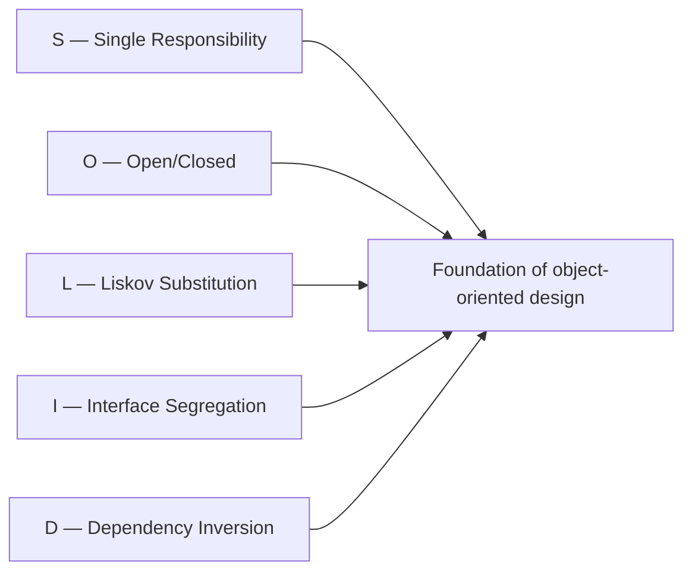
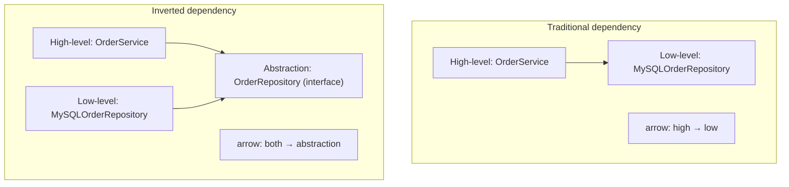

# SOLID Principles

C01 covered concurrency, C02 covered JVM internals and performance — both deeply technical, mechanism-driven topics. C03 covers something complementary: how to *structure* code so it stays maintainable, extensible, and understandable as it grows. The five **SOLID principles** are the foundation of object-oriented design — coined by Robert C. Martin ("Uncle Bob") in 2000, popularized in his 2002 book *Agile Software Development: Principles, Patterns, and Practices* (PPP), and now considered fundamental enough that any backend Java engineer should be able to recite them, explain them, *and* recognize when they're being violated in code review. They're not Java-specific — they apply to any OO language — but Java's idioms (interfaces, abstract classes, dependency injection via Spring/Guice) make them especially natural to apply.

The depth-bar requirement isn't "memorize the acronym." At the **historical** layer, SOLID is the synthesis of work by Bertrand Meyer (OCP, 1988), Barbara Liskov (LSP, 1987), and Uncle Bob's own SRP/ISP/DIP — published 1995–2000 as separate papers, then collected. At the **conceptual** layer, each principle addresses a *specific* source of design rot: **SRP** (Single Responsibility) prevents *responsibility creep* in classes; **OCP** (Open/Closed) prevents *modification of stable code* when adding features; **LSP** (Liskov Substitution) prevents *inheritance abuse* that breaks polymorphism; **ISP** (Interface Segregation) prevents *fat interfaces* that force clients to depend on what they don't use; **DIP** (Dependency Inversion) prevents *high-level modules from being held hostage by low-level concretions*. At the **application** layer, SOLID maps directly to many GoF patterns — Strategy is OCP applied; Factory and Dependency Injection are DIP applied — and Java's modern features (records, sealed classes, interfaces with default methods) interact with these principles in specific ways. At the **trade-off** layer, *over-applying* SOLID is one of the most common forms of over-engineering — premature interfaces, one-method classes, anaemic domain models — and the senior judgment is knowing when *enough* is enough. We will cover all four layers, with a real refactoring example (a monolithic `OrderService` decomposed into focused, testable, extensible components).

> [!NOTE]
> Prerequisites: [Thread-safety patterns](../C01-concurrency/T17-thread-safety-patterns.md) (L3/C01/T17) — the design patterns lens applied to concurrency; introduces the "strategy hierarchy" thinking SOLID extends.

## Historical Context — Robert Martin and the SOLID Synthesis

The five principles weren't created together. They were synthesized from existing OO design literature:

| Principle | Originator | Year |
|-----------|------------|------|
| **OCP** (Open/Closed) | Bertrand Meyer | 1988 (in *Object-Oriented Software Construction*) |
| **LSP** (Liskov Substitution) | Barbara Liskov | 1987 (in "Data Abstraction and Hierarchy") |
| **SRP** (Single Responsibility) | Robert Martin | mid-1990s (in his C++ Report columns) |
| **ISP** (Interface Segregation) | Robert Martin | mid-1990s |
| **DIP** (Dependency Inversion) | Robert Martin | mid-1990s |

Martin coined the **SOLID** acronym ~2000 and popularized them as a coherent set in *Agile Software Development: Principles, Patterns, and Practices* (2002 — known as "PPP"). The principles are now considered foundational; any OO design textbook from 2010+ teaches them.



## Why Five Together — the Coherent Set

The five principles complement each other:

- **SRP** says each class has one reason to change.
- **OCP** says we extend behavior without modifying existing code.
- **LSP** says inheritance must preserve substitutability.
- **ISP** says clients shouldn't depend on what they don't use.
- **DIP** says high-level modules depend on abstractions.

Together they describe **how to structure OO code so that change is localized, safe, and predictable.** A SOLID system is one where:

- Adding a feature changes one place, not many (SRP + OCP).
- Subtyping doesn't break callers (LSP).
- Interfaces are small enough to be honest about what each consumer needs (ISP).
- High-level policy doesn't depend on low-level mechanism (DIP).

When violated systematically, you get the *opposite*: a feature change cascades through dozens of files, subtype substitution breaks at runtime, interfaces evolve into "god objects," and high-level code is tied to specific implementations.

## S — Single Responsibility Principle (SRP)

> **A class should have only one reason to change.**

The most *misunderstood* SOLID principle. The naive reading — "a class should do one thing" — is too vague; "thing" is arbitrary. Uncle Bob's more precise definition:

> **A class should be responsible to exactly one actor (one stakeholder).**

"Reason to change" = "a person or group that requests the change." If two different stakeholders can demand changes to the same class for *different reasons*, the class has two responsibilities.

### Example — violating SRP

```java
public class Employee {
    public Money calculatePay()        { /* ... */ }   // owned by accounting
    public Money calculateOvertime()   { /* ... */ }   // owned by HR
    public void  saveToDatabase()      { /* ... */ }   // owned by IT
    public Report generatePayReport()  { /* ... */ }   // owned by accounting
}
```

Three different actors (accounting, HR, IT) can request changes here. A change requested by HR (overtime calculation rules) might inadvertently break the database persistence logic. The class is responsible to *three* stakeholders.

### Example — applying SRP

```java
public class PayCalculator {                          // accounting owns this
    public Money calculatePay(Employee e) { ... }
}

public class OvertimePolicy {                          // HR owns this
    public Money calculateOvertime(Employee e) { ... }
}

public class EmployeeRepository {                      // IT owns this
    public void save(Employee e) { ... }
}

public record Employee(String name, /* data fields only */) { }
```

Each class is responsible to exactly one actor. Changes propagate cleanly.

### SRP cautions

- **Not "one method per class."** SRP is about *responsibilities to stakeholders*, not granularity.
- **Records and value classes** (`Point`, `Money`) fit SRP naturally — they hold data; the responsibility is "represent this value."
- **Cohesion + SRP**: a class with high cohesion (T03 — coupling and cohesion) usually satisfies SRP automatically.

## O — Open/Closed Principle (OCP)

> **Software entities should be open for extension but closed for modification.**

Bertrand Meyer 1988. The idea: once a class works and is in production, you should be able to *add* behavior without *modifying* the working code — extension via subclassing, composition, or strategy injection, not via editing.

### Example — violating OCP

```java
public class PaymentProcessor {
    public void process(Payment p) {
        if (p.type() == CREDIT_CARD) {
            // charge credit card
        } else if (p.type() == PAYPAL) {
            // charge PayPal
        } else if (p.type() == BANK_TRANSFER) {
            // initiate bank transfer
        }
        // Adding a new payment type → must modify this class.
    }
}
```

Every new payment type requires editing `PaymentProcessor`. The class is *not* closed to modification.

### Example — applying OCP

```java
public interface PaymentMethod {
    void charge(Payment p);
}

public class CreditCardPayment implements PaymentMethod { ... }
public class PayPalPayment implements PaymentMethod { ... }
public class BankTransferPayment implements PaymentMethod { ... }

public class PaymentProcessor {
    private final Map<PaymentType, PaymentMethod> methods;

    public void process(Payment p) {
        methods.get(p.type()).charge(p);    // delegate to the right method
    }
}
```

Adding a new payment type now means adding a new class — `PaymentProcessor` itself is *closed* to modification but *open* to extension via new implementations.

### OCP and the Strategy pattern

OCP is the principle behind the Strategy pattern (T06): each "strategy" is an implementation of an abstraction; the using class doesn't change when new strategies are added.

### OCP cautions

- **Don't over-abstract.** Designing for every possible future change is impossible. Apply OCP to *known axes of variation*.
- **YAGNI counterbalance**: "You Aren't Gonna Need It" (T02) says don't add abstraction speculatively.

## L — Liskov Substitution Principle (LSP)

> **Subtypes must be substitutable for their base types without breaking client code.**

Barbara Liskov 1987. The formal version: *If S is a subtype of T, then objects of type T may be replaced with objects of type S without altering desirable properties of the program.*

LSP is about **behavioral compatibility**, not just method signature compatibility. A subtype that compiles but throws unexpected exceptions, weakens postconditions, or strengthens preconditions *violates LSP*.

### The canonical anti-example — Square vs Rectangle

```java
public class Rectangle {
    protected int width, height;
    public void setWidth(int w)  { width = w; }
    public void setHeight(int h) { height = h; }
    public int area() { return width * height; }
}

public class Square extends Rectangle {
    @Override public void setWidth(int w)  { width = height = w; }   // keep it square
    @Override public void setHeight(int h) { width = height = h; }   // keep it square
}

// Client code:
void test(Rectangle r) {
    r.setWidth(5);
    r.setHeight(3);
    assert r.area() == 15;   // FAILS if r is actually a Square (area = 9)
}
```

`Square extends Rectangle` *compiles* but breaks the contract: setting width and height independently and computing `area()` should give `w × h`. A Square violates this. Therefore Square is *not* a true Liskov subtype of Rectangle, despite what inheritance suggests.

### The right modeling

```java
public sealed interface Shape permits Rectangle, Square { int area(); }

public record Rectangle(int width, int height) implements Shape {
    public int area() { return width * height; }
}

public record Square(int side) implements Shape {
    public int area() { return side * side; }
}
```

Both are Shapes; neither claims to be a subtype of the other. LSP preserved.

### LSP formal rules

For subtype S of T:

1. **Preconditions can be weakened but not strengthened.** S can accept *more* inputs than T; not fewer.
2. **Postconditions can be strengthened but not weakened.** S can guarantee *more* about output than T; not less.
3. **Invariants of T must be preserved by S.**
4. **History constraint**: properties that hold over time in T must hold in S.

### LSP cautions

- **Inheritance is *not* always the right tool.** Favor composition unless there's a true "is-a" relationship that preserves all behaviors.
- **Java has no formal contract verification.** LSP violations compile fine; they manifest as runtime bugs. Code review and testing catch them.

## I — Interface Segregation Principle (ISP)

> **Clients should not be forced to depend on methods they do not use.**

A "fat interface" with many methods forces every implementor to provide all methods (even if it only meaningfully implements some) and every client to depend on the whole interface (even if it only uses some methods).

### Example — violating ISP

```java
public interface Worker {
    void doWork();
    void eatLunch();    // robots don't eat lunch
    void clockIn();      // contractors don't clock in
    void getBenefits();   // contractors don't get benefits
}

public class Robot implements Worker {
    public void doWork()      { /* ... */ }
    public void eatLunch()    { throw new UnsupportedOperationException(); }   // ✗ LSP violation
    public void clockIn()     { throw new UnsupportedOperationException(); }
    public void getBenefits() { throw new UnsupportedOperationException(); }
}
```

`Robot` is forced to implement methods it doesn't use; clients depending on `Worker` for `eatLunch` find some implementations throw.

### Example — applying ISP

```java
public interface Worker {            void doWork(); }
public interface Eater {             void eatLunch(); }
public interface TimecardEmployee {  void clockIn(); }
public interface BenefitsRecipient { Benefits getBenefits(); }

public class Robot implements Worker { ... }
public class Contractor implements Worker, Eater { ... }
public class FullTimeEmployee implements Worker, Eater, TimecardEmployee, BenefitsRecipient { ... }
```

Each interface has a single purpose; each class implements only what it actually does; clients depend only on the interface they need.

### ISP and Java 8 default methods

Default methods (Java 8) can violate ISP if used to "fix" fat interfaces:

```java
public interface Worker {
    void doWork();
    default void eatLunch() {}    // Robot inherits no-op; subtle pollution
}
```

This makes Robot compile, but the no-op for `eatLunch` is a code smell — a Robot still has an `eatLunch` method visible in its API. Better: separate interfaces.

Default methods *do* have legitimate uses (evolving interfaces while preserving backward compatibility, adding convenience methods) — but using them to mask ISP violations is an anti-pattern.

## D — Dependency Inversion Principle (DIP)

> **High-level modules should not depend on low-level modules. Both should depend on abstractions. Abstractions should not depend on details. Details should depend on abstractions.**

This is the principle behind **Dependency Injection** and **Inversion of Control** (T07 — DI/IoC concept). It restructures the dependency graph so high-level policy is independent of low-level mechanism.

### Example — violating DIP

```java
public class OrderService {
    private final MySQLOrderRepository repo = new MySQLOrderRepository();   // ✗ concrete dependency

    public void placeOrder(Order o) {
        repo.save(o);
        new SendGridEmailSender().send(o.customerEmail(), "Order placed");   // ✗ concrete dep
    }
}
```

`OrderService` (high-level business logic) directly depends on `MySQLOrderRepository` and `SendGridEmailSender` (low-level technology choices). Want to switch from MySQL to PostgreSQL? Edit `OrderService`. Want to test it? Can't without a real DB.

### Example — applying DIP

```java
public interface OrderRepository    { void save(Order o); }
public interface EmailSender         { void send(String to, String body); }

public class OrderService {
    private final OrderRepository repo;
    private final EmailSender emailer;

    public OrderService(OrderRepository repo, EmailSender emailer) {
        this.repo = repo;
        this.emailer = emailer;
    }

    public void placeOrder(Order o) {
        repo.save(o);
        emailer.send(o.customerEmail(), "Order placed");
    }
}

// Concretions live elsewhere:
public class MySQLOrderRepository implements OrderRepository { ... }
public class SendGridEmailSender implements EmailSender { ... }
```

Now `OrderService` depends only on *abstractions* (`OrderRepository`, `EmailSender`). The concrete implementations are injected at runtime (Spring's `@Autowired`, Guice's `@Inject`, or manual construction).

Want to switch DBs? Implement a new `OrderRepository`; `OrderService` doesn't change.
Want to test? Inject a mock `OrderRepository` and `EmailSender`.

### DIP and the Dependency Inversion direction

Standard direction: high-level depends on low-level.
Inverted direction (DIP): both depend on abstractions. The arrow *inverts*.



The "inversion" is that the low-level module now depends on the abstraction (defined by the high-level need), not the other way around.

### DIP in Spring

```java
@Service
public class OrderService {
    private final OrderRepository repo;
    private final EmailSender emailer;

    public OrderService(OrderRepository repo, EmailSender emailer) {   // constructor injection
        this.repo = repo;
        this.emailer = emailer;
    }
}

@Repository
public class MySQLOrderRepository implements OrderRepository { ... }
```

Spring wires the right implementations at startup based on bean configuration. The application code follows DIP; Spring handles the *mechanics*.

## How SOLID Maps to GoF Patterns

Many of the Gang of Four design patterns (T04–T06) are SOLID applied to specific scenarios:

| Pattern | SOLID applied |
|---------|---------------|
| **Strategy** | OCP — closed to modification, open to new strategies |
| **Factory Method** | DIP — clients depend on abstract factory, not concrete classes |
| **Adapter** | DIP — adapt an existing class to a needed interface (abstraction) |
| **Decorator** | OCP — extend behavior without modifying the wrapped class |
| **Observer** | OCP + DIP — subjects depend on observer abstraction; new observers added freely |
| **Template Method** | OCP — define skeleton, let subclasses fill in |
| **Command** | OCP + SRP — encapsulate each command in its own object |

T04–T06 will cover each pattern in depth.

## SOLID in Modern Java

Java's evolution (especially JDK 14+) has introduced features that interact with SOLID:

### Records (JDK 14+) — perfect for SRP

```java
public record Money(BigDecimal amount, Currency currency) { }
```

A record has *one responsibility*: represent a value. Immutable; auto-generated `equals`/`hashCode`/`toString`. Fits SRP perfectly for value objects.

### Sealed classes (JDK 17+) — controlled OCP

```java
public sealed interface PaymentMethod permits CreditCard, PayPal, BankTransfer { }
```

Sealed interfaces are "closed for modification" (only the permitted classes can implement) *and* "open for extension" within the controlled set. Pattern matching enforces exhaustiveness:

```java
switch (paymentMethod) {
    case CreditCard cc   -> chargeCredit(cc);
    case PayPal pp        -> chargePayPal(pp);
    case BankTransfer bt  -> transfer(bt);
    // compiler ensures exhaustiveness — no default needed
}
```

This is OCP applied with *bounded* extension — useful for domain models where you want a known closed set, not the unbounded "anyone can implement" of regular interfaces.

### Default methods (JDK 8+) — affect ISP

As covered above, default methods enable interface evolution but can mask ISP violations. Use deliberately.

### Pattern matching (JDK 21+) — supports LSP through exhaustive case analysis

```java
return switch (shape) {
    case Circle c    -> Math.PI * c.radius() * c.radius();
    case Square s    -> s.side() * s.side();
    case Triangle t  -> /* ... */;
};
```

Each subtype handles its own behavior; LSP is preserved because each `case` is explicit.

## SOLID vs Over-Engineering

The biggest pitfall in SOLID is **over-application**. Common forms:

### Premature interfaces

```java
public interface UserService { User findById(int id); }
public class UserServiceImpl implements UserService { ... }   // only implementation
```

If there's only one implementation and no reasonable second one, the interface is pure ceremony. Add the interface *when you actually need it* (mocking, multiple implementations).

### One-method classes

```java
public class GetUserByIdCommand {
    public User execute() { ... }
}
public class UpdateUserCommand { public void execute() { ... } }
// ... 50 more command classes ...
```

If SRP is interpreted as "one method per class," the code becomes an unmaintainable explosion. SRP is about *responsibilities to stakeholders*, not method count.

### Anaemic domain models

```java
public class User {
    private String name;
    private String email;
    // ... only getters and setters, no behavior ...
}

public class UserService {
    public void validateEmail(User u) { ... }      // behavior of User, but here
    public void changePassword(User u, String pw) { ... }
}
```

Splitting all behavior out of domain classes into "service" classes creates *anaemic* domain models — the User class is just a data bag. Domain-driven design says: put behavior with the data.

The right balance: when behavior fits naturally with the data (validating own email), put it on the entity. When it crosses entities (transferring money between accounts), put it in a service.

## Practical Heuristics

When to apply each principle:

- **SRP**: when a class has methods touched by different stakeholders, split.
- **OCP**: when you have a *known* axis of variation (payment types, strategies), abstract it.
- **LSP**: any time you use inheritance, *think* about substitutability. Often, composition is better.
- **ISP**: when an interface has 10+ methods, ask if all clients use all of them. If not, split.
- **DIP**: any time a high-level class names a specific low-level class (`new MySQLRepository`), invert it.

The negative cases:

- **Don't add interfaces** with only one implementation — until you need to.
- **Don't decompose** classes until the responsibilities are real.
- **Don't abstract** every dependency — only the ones that *might* vary.

## A Real Refactoring Example

A monolithic `OrderService` with all the problems:

```java
public class OrderService {
    private MySQLConnection db = new MySQLConnection("localhost:3306");
    private SendGridClient email = new SendGridClient(API_KEY);

    public void placeOrder(int customerId, List<Item> items, String paymentType) {
        // 1. Validate
        if (items.isEmpty()) throw new IllegalArgumentException();

        // 2. Calculate total
        double total = items.stream().mapToDouble(Item::price).sum();

        // 3. Apply tax
        if (customer is in California) total *= 1.0725;
        else if (customer is in NY) total *= 1.08875;
        // ... 50 more states ...

        // 4. Process payment
        if (paymentType.equals("CC")) {
            // charge credit card
        } else if (paymentType.equals("PP")) {
            // charge PayPal
        }

        // 5. Save to DB
        db.execute("INSERT INTO orders ...");

        // 6. Send email
        email.send(customer.getEmail(), "Order placed");

        // 7. Update inventory
        for (Item i : items) {
            db.execute("UPDATE inventory SET stock = stock - 1 WHERE item_id = " + i.id());
        }
    }
}
```

Problems: SRP (validation + tax + payment + persistence + email + inventory in one method), OCP (tax rules + payment types), DIP (concrete `MySQLConnection`, `SendGridClient`).

Refactored:

```java
public class OrderService {
    private final OrderRepository orderRepo;
    private final InventoryService inventory;
    private final TaxCalculator taxCalculator;
    private final PaymentProcessor paymentProcessor;
    private final EmailSender emailer;

    public OrderService(OrderRepository orderRepo, InventoryService inventory,
                        TaxCalculator taxCalculator, PaymentProcessor paymentProcessor,
                        EmailSender emailer) {
        this.orderRepo = orderRepo;
        this.inventory = inventory;
        this.taxCalculator = taxCalculator;
        this.paymentProcessor = paymentProcessor;
        this.emailer = emailer;
    }

    public Order placeOrder(int customerId, List<Item> items, PaymentMethod payment) {
        validateOrder(items);
        Money subtotal = calculateSubtotal(items);
        Money tax = taxCalculator.calculateTax(subtotal, customerId);
        Money total = subtotal.plus(tax);

        paymentProcessor.charge(payment, total);

        Order order = new Order(customerId, items, total);
        orderRepo.save(order);
        inventory.decrement(items);
        emailer.sendOrderConfirmation(customer, order);

        return order;
    }

    private void validateOrder(List<Item> items) {
        if (items.isEmpty()) throw new IllegalArgumentException("Order must have items");
    }

    private Money calculateSubtotal(List<Item> items) {
        return items.stream().map(Item::price).reduce(Money.ZERO, Money::plus);
    }
}
```

Plus separate classes:
- `TaxCalculator` (with strategies for different states) — OCP applied.
- `PaymentProcessor` (with strategies for CC, PayPal, etc.) — OCP applied.
- `OrderRepository`, `InventoryService`, `EmailSender` — DIP applied (injected interfaces).
- `Order`, `Money`, `Item` — records (SRP applied — value objects).

Each class has one responsibility; new tax rules or payment types extend rather than modify; testing is trivial via mocks.

## Common Mistakes

### Applying SRP too aggressively

"One method per class" or "one responsibility per method" isn't SRP. SRP is about stakeholders.

### Adding interfaces preemptively

Interfaces with one implementation are ceremony until you need them. YAGNI counters DIP overreach.

### Using inheritance where composition would do

LSP violations come from inheriting "is-a-kind-of" without preserving behaviors. Use composition for "has-a" or "uses-a" relationships.

### Putting everything in services (anaemic domain model)

Domain objects should have behavior. Splitting all logic into services dilutes domain modeling.

### Using default methods to hide ISP violations

Default no-ops mask the issue; the API still lies.

### Treating SOLID as rules instead of guidelines

SOLID guides; it doesn't mandate. Senior judgment is knowing when to skip a principle for simplicity.

## Practice

1. **Identify SRP violations.** In your team's codebase, find a class with >5 public methods. List the methods. Identify the stakeholders. Are there multiple?
2. **Apply OCP.** Find an `if/else` chain or `switch` statement on a discriminator. Refactor to use a strategy or polymorphism.
3. **Find an LSP violation.** Find a subclass with `UnsupportedOperationException` or similar. Diagnose: does it really fit the supertype's contract?
4. **Apply ISP.** Find a "fat" interface (8+ methods). Identify clients who only use a subset. Split into smaller interfaces.
5. **Apply DIP.** Find a high-level class that `new`s a concrete dependency. Refactor to constructor injection with an interface.
6. **Refactor OrderService.** Use the example above. Apply all five principles to a real-world OrderService in your codebase.
7. **SOLID vs YAGNI.** Find an over-applied SOLID example (premature interface, micro-class). Argue for or against simplification.
8. **Sealed classes for closed extension.** Implement a `Shape` hierarchy with sealed interface + records. Use pattern matching for area calculation.
9. **Records for SRP.** Convert a POJO with getters/setters/equals/hashCode to a record. Verify behavior preserved.
10. **DIP in Spring.** Add a `@Service` class with constructor-injected dependencies. Verify Spring auto-wires correctly.
11. **LSP-violating Square.** Implement Square extends Rectangle. Write a test that fails. Refactor to a sealed Shape hierarchy.
12. **Code review with SOLID lens.** Review a PR; identify which principles are violated; propose specific refactorings.

## Recap

You should now be able to:

- State the **5 SOLID principles** and their originators (Meyer/OCP 1988, Liskov/LSP 1987, Martin/SRP/ISP/DIP 1990s; acronym 2000).
- Apply **SRP** (Single Responsibility): a class should be responsible to *one actor/stakeholder*; "one reason to change" = one source of change request.
- Apply **OCP** (Open/Closed): open for extension (new behavior via new code), closed for modification (existing code untouched); Strategy pattern is canonical.
- Apply **LSP** (Liskov Substitution): subtypes must be behaviorally compatible with supertypes; preconditions cannot strengthen; postconditions cannot weaken; invariants preserved. Square/Rectangle is the classic anti-example.
- Apply **ISP** (Interface Segregation): clients shouldn't depend on methods they don't use; many small interfaces > one fat; default methods can mask but not fix ISP violations.
- Apply **DIP** (Dependency Inversion): high-level modules depend on abstractions; both high and low depend on abstractions; foundation of DI/IoC; Spring/Guice realize it.
- Recognize how SOLID **maps to GoF patterns**: Strategy ← OCP, Factory ← DIP, Adapter ← DIP, Decorator ← OCP, Observer ← OCP + DIP, Template ← OCP, Command ← OCP + SRP.
- Apply SOLID in **modern Java**: records for SRP value objects, sealed classes for controlled OCP with exhaustive pattern matching, default methods for interface evolution (carefully, to avoid ISP masking).
- Recognize SOLID in **Spring/Guice**: DI is DIP; component scanning automates DIP wiring; constructor injection is the recommended form.
- Avoid **over-engineering**: premature interfaces (DIP overreach), one-method classes (SRP misinterpretation), anaemic domain models (over-aggressive separation).
- Apply **practical heuristics**: SRP when responsibilities cross stakeholders; OCP when axes of variation are known; LSP whenever inheriting; ISP when interfaces have many methods; DIP when concrete dependencies appear in high-level code.
- Walk through a **real refactoring** (monolithic OrderService → 5 focused classes with injected dependencies, tax/payment as strategies, value objects as records).
- Avoid the **6 common mistakes**: SRP over-aggression, premature interfaces, inheritance over composition, anaemic domain models, default methods hiding ISP, treating SOLID as rules instead of guidelines.

## Next

Continue to [DRY, KISS, YAGNI](./T02-dry-kiss-yagni.md) — the three minimalist principles that *complement* SOLID and prevent over-engineering. We'll cover **DRY** (Don't Repeat Yourself — knowledge should have a single representation, but mechanical duplication is *not* always DRY violation); **KISS** (Keep It Simple — simplicity is the ultimate sophistication; reject complexity that adds no value); **YAGNI** (You Aren't Gonna Need It — don't build features for speculative future needs); and how these *constrain* SOLID — preventing the over-engineering that comes from mechanically applying SOLID without judgment.
