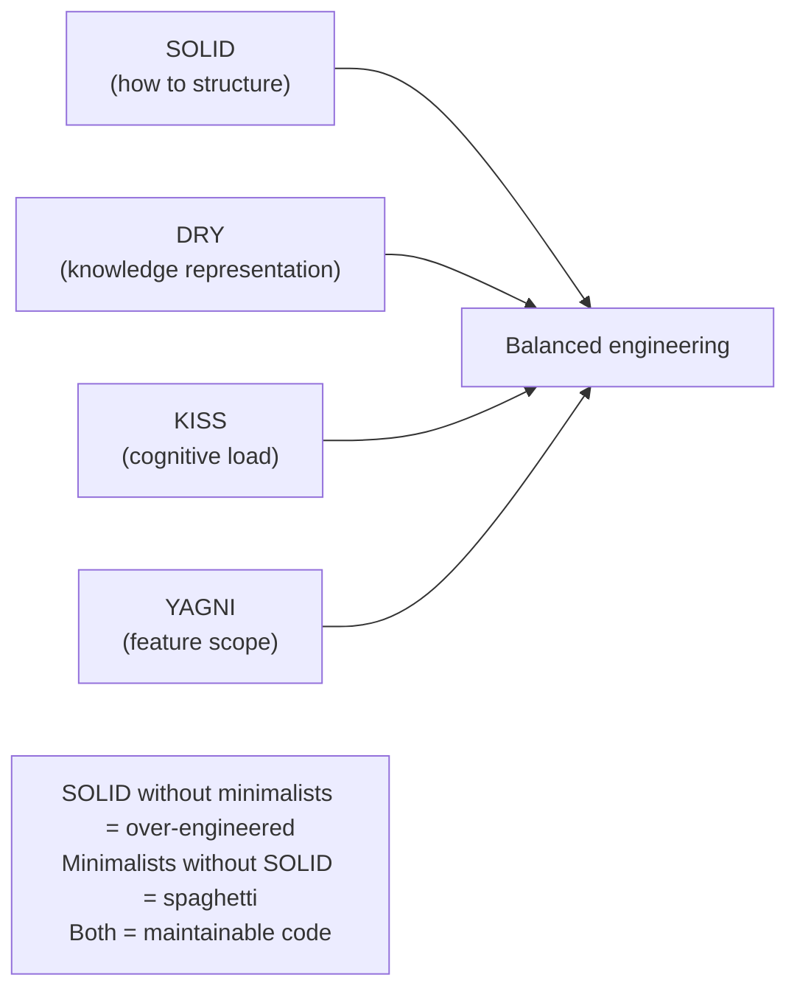
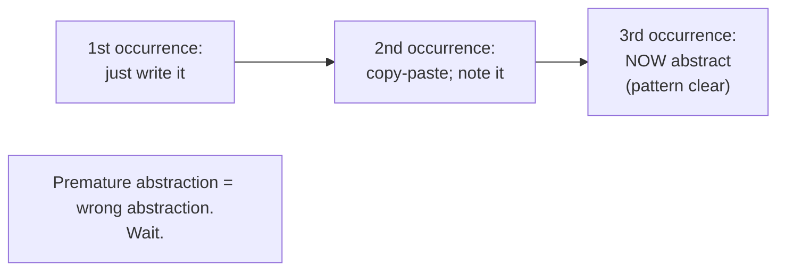
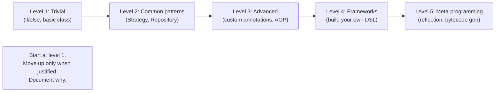
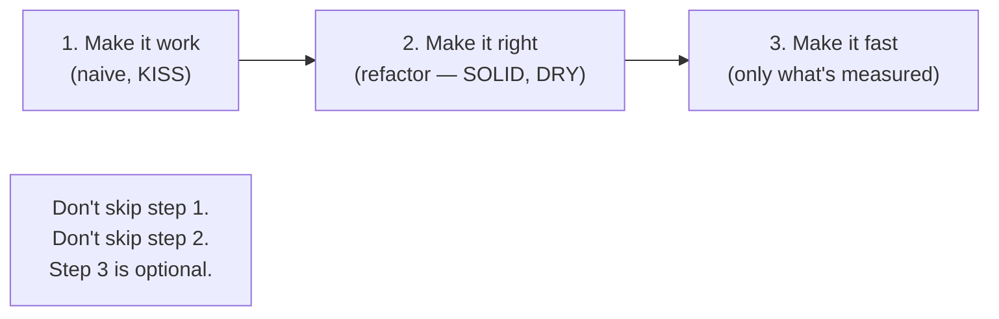

# DRY, KISS, YAGNI

T01 covered SOLID — the principles for structuring OO code so change is localized and behavior is extensible. This topic covers the *complementary* set: **DRY** (Don't Repeat Yourself), **KISS** (Keep It Simple, Stupid), **YAGNI** (You Aren't Gonna Need It). Where SOLID tells you *how* to structure code, these three tell you *how much* — and most importantly, *when not to*. Applying SOLID without DRY/KISS/YAGNI produces classic Java over-engineering (`AbstractFactoryProviderFactory`, four-layer abstractions for a simple lookup, configuration files with options nobody uses). Applying DRY/KISS/YAGNI without SOLID produces tightly-coupled spaghetti. The senior judgment is *balancing* them: apply SOLID when there's a real need; refuse when YAGNI applies; keep solutions as simple as the problem allows.

The depth-bar requirement isn't "memorize the acronyms." At the **historical** layer, these principles come from different lineages — **DRY** from Andy Hunt and Dave Thomas's *The Pragmatic Programmer* (1999), defined as "every piece of *knowledge* must have a single, unambiguous, authoritative representation within a system"; **KISS** from Kelly Johnson's 1960s Lockheed Skunk Works (aerospace design principle); **YAGNI** from Ron Jeffries / Kent Beck's Extreme Programming (XP, late 1990s). At the **conceptual** layer, they share an underlying philosophy — *minimize what you commit to* — but address different aspects: DRY about knowledge representation, KISS about cognitive load, YAGNI about feature scope. At the **misapplication** layer, the most important insight (Sandi Metz, "The Wrong Abstraction") is that **duplication is far cheaper than the wrong abstraction** — premature DRY-ing creates abstractions that lock in incorrect assumptions, and the **Rule of Three** (Martin Fowler) says wait for three occurrences before generalizing. At the **judgment** layer, knowing when *not* to apply DRY, KISS, or YAGNI — when the situation actually warrants the complexity — is the senior skill that separates "by-the-book" engineers from those who ship maintainable systems at scale. We will cover all four layers, with concrete anti-patterns (AbstractFactoryProviderFactory et al.) and the "make it work, make it right, make it fast" cycle that orchestrates SOLID + minimalist principles.

> [!NOTE]
> Prerequisites: [SOLID principles](./T01-solid-principles.md) (L3/C03/T01) — these principles balance SOLID. Without SOLID, you get spaghetti; without DRY/KISS/YAGNI, you get over-engineering.

## The Minimalist Principles — Complementing SOLID



SOLID tells you *how* to structure. DRY/KISS/YAGNI tell you *how much* — and *when not to*. The combination is what produces maintainable systems.

## DRY — Don't Repeat Yourself

> **"Every piece of knowledge must have a single, unambiguous, authoritative representation within a system."**
> — Andy Hunt and Dave Thomas, *The Pragmatic Programmer* (1999)

DRY's first source is the 1999 Hunt & Thomas book; it's one of dozens of principles in that book (orthogonality, tracer bullets, broken windows, etc.) but DRY became the most-cited.

The *exact* wording is important: **DRY is about knowledge, not code.** Two pieces of code that look identical might represent *different* knowledge — and forcing them into one abstraction creates a wrong abstraction.

### Example — true DRY violation (same knowledge)

```java
// In OrderService:
double tax = order.subtotal() * 0.0725;       // California sales tax

// In CartService:
double tax = cart.subtotal() * 0.0725;        // California sales tax

// In CheckoutService:
double tax = checkout.subtotal() * 0.0725;    // California sales tax
```

The "knowledge" (California sales tax rate) is repeated. Three places that all change together when the tax rate changes. Extract:

```java
public final class TaxRates {
    public static final BigDecimal CALIFORNIA = new BigDecimal("0.0725");
}

// All three services use TaxRates.CALIFORNIA
```

### Example — coincidental duplication (different knowledge)

```java
// In UserService:
if (user.age() >= 18) { ... }   // adult-user check

// In MovieService:
if (movie.rating() >= 18) { ... }   // adult-rated movie check
```

Both compare to `18` but represent *different knowledge*. The user's coming-of-age threshold has nothing to do with the movie rating system. Extracting `ADULT_THRESHOLD = 18` would *couple* two unrelated concepts; if movie ratings shift to 21 (because the country changed legal drinking age), you'd have to disentangle them.

**Duplication that represents different knowledge is not a DRY violation.**

### Sandi Metz — "The Wrong Abstraction"

Sandi Metz (2016, RailsConf talk and accompanying essay): **duplication is far cheaper than the wrong abstraction**.

> *Prefer duplication over the wrong abstraction.*

Why? When you have duplication, you can refactor toward an abstraction *when the pattern is clear*. When you have a wrong abstraction, you have to *unwind* it before you can fix it — which is far more painful than fixing duplication.

The pattern of *wrong abstraction*:

1. Developer A sees three similar pieces of code.
2. Developer A abstracts them into a shared function/class.
3. New requirements come in: each "instance" diverges in different ways.
4. Developers B, C, D add flags and special cases to the shared abstraction.
5. The shared abstraction grows tentacles of conditional logic.
6. Nobody is brave enough to refactor it.

The diagnosis: the original three pieces *didn't share knowledge*; they only shared *current code structure*. The abstraction encoded a coincidence as a requirement.

### The Rule of Three (Martin Fowler)

> **"Three strikes and you refactor."** Wait for *three* occurrences of the pattern before abstracting.

Why three?

- Two occurrences could be coincidence.
- Three occurrences suggest a pattern.
- With three concrete instances, the right abstraction is clearer.

Applied to DRY: don't extract on the second duplication; wait for the third.



### DRY at Different Scales

DRY applies at multiple levels of granularity:

| Scale | Example | When DRY helps |
|-------|---------|----------------|
| Function-level | Repeated calculation | Almost always |
| Class-level | Shared base class behavior | Sometimes (LSP traps) |
| System-level | Shared services / libraries | When same knowledge is needed everywhere |
| Knowledge-level | Domain rules in one place | Always — that's the original definition |
| Data-level | Normalized databases | Often (but denormalize for read performance) |

The most important is **knowledge-level**: business rules, domain constraints, validation logic — these should have *one* authoritative source.

### When Duplicating Is Right

- **Test setup**: clarity beats DRY. A test should read top-to-bottom without jumping to helpers.
- **Coincidental similarity**: different reasons to change → keep separate.
- **Different bounded contexts** (DDD): same name doesn't mean same concept across contexts.
- **Quick prototypes**: optimize for speed of iteration; refactor later.

## KISS — Keep It Simple, Stupid

Origin: **Kelly Johnson**, lead engineer at Lockheed's Skunk Works (1960s). Aerospace design principle — designed simple enough that average mechanics could repair planes in combat conditions. "Stupid" addresses the designer, not the user: "simple enough that the dumb mechanic can fix it" became "simple enough that any maintainer can understand it."

In software: **simplicity is a design goal**. Reject complexity that adds no value. Prefer obvious solutions over clever ones.

### Example — KISS violation

```java
public Optional<User> findUser(String email) {
    return Optional.ofNullable(email)
        .map(String::toLowerCase)
        .map(String::trim)
        .filter(e -> !e.isEmpty())
        .flatMap(e -> userRepository.findByEmail(e));
}
```

Composed, functional, "clean." But...

```java
public Optional<User> findUser(String email) {
    if (email == null) return Optional.empty();
    String normalized = email.toLowerCase().trim();
    if (normalized.isEmpty()) return Optional.empty();
    return userRepository.findByEmail(normalized);
}
```

The simpler version is easier to read, easier to debug, faster (no Optional allocations). KISS wins.

### The Complexity Ladder



The rule: start at the lowest level that solves the problem. Move up only when the next level offers *measurable* benefit. Never skip levels.

### KISS in Java — Common Choices

When in doubt, prefer:

| Don't | Prefer |
|-------|--------|
| Custom AQS subclass | `synchronized` or `ReentrantLock` |
| Bytecode generation | Reflection (only if needed) |
| Reflection | Direct method call |
| Custom annotation processor | Spring's existing annotations |
| Reactive Streams | Virtual threads (T14 from C01) |
| Microservices | Monolith (until you can't) |
| Generic types with bounds | Specific types |
| Builder pattern | Constructor (for 2-3 fields) |
| Spring MVC | Spring Boot |

The simpler choice usually wins. Reach for complexity only when measurement justifies it.

## YAGNI — You Aren't Gonna Need It

Coined by **Ron Jeffries** in the context of Extreme Programming (XP, late 1990s). Kent Beck popularized it.

> **"Always implement things when you actually need them, never when you just foresee that you need them."**

The argument:

- Speculative features add complexity now for benefit later.
- Most speculative features are *never* needed (requirements change).
- Even when needed, the speculation rarely matches what's actually needed.
- The cost of building unused features: maintenance forever.

### Example — YAGNI violation

```java
public class UserService {
    public User createUser(String name, String email,
                           Map<String, Object> options) {   // ✗ for "future" options
        boolean sendWelcomeEmail = (Boolean) options.getOrDefault("sendWelcome", true);
        String region = (String) options.getOrDefault("region", "us-east");
        int priority = (Integer) options.getOrDefault("priority", 5);
        // ... 12 more "options" never actually used
    }
}
```

YAGNI applied:

```java
public class UserService {
    public User createUser(String name, String email) {
        // No options. When you actually need an option, add it.
    }
}
```

The first version is *complex now* (untyped options bag, defaults to maintain, documentation to write) for *zero current benefit*. The second is dead simple; when an option is genuinely needed, add it explicitly.

### YAGNI in Java

Common violations:

- **Configuration explosion**: every value externalized "in case it needs to change."
- **Premature interfaces**: interface + one impl, in case a second is added.
- **Generic everything**: `<T>` parameters for one type.
- **Plugin systems**: extensibility points before plugins exist.
- **Microservices**: extracting services before the monolith hurts.

### YAGNI and microservices

The most expensive YAGNI violation in modern architecture:

```text
"We might need to scale this part independently in the future."
→ Extract into a microservice now.
→ Add network calls, deployment pipeline, monitoring, service mesh.
→ Manage 10× the operational complexity.
→ The expected scale need never materializes.
```

Modern wisdom (Martin Fowler, "Monolith First"): start monolithic. Extract microservices when you have *measured pain* — performance bottleneck, team coordination problem, deploy independence need. YAGNI applies to architecture too.

## Beck's Simple Design Rules (in Order)

Kent Beck, in *Extreme Programming Explained* and elsewhere, defined "Simple Design" as code that:

1. **Passes all tests.**
2. **Reveals intent.**
3. **No duplication.**
4. **Fewest elements.**

The order matters. **DRY (rule 3) is *less important* than intent revelation (rule 2).** If the choice is "DRY but obscure" vs "duplicated but clear," choose clarity.

Modern teams often invert this — chase DRY aggressively while writing code that's incomprehensible. Beck's order is the correction.

## "Make It Work, Make It Right, Make It Fast"

A Kent Beck aphorism for the *order* of priorities:

1. **Make it work**: simplest thing that passes the test (KISS).
2. **Make it right**: refactor to clean structure (SOLID, DRY).
3. **Make it fast**: optimize only the parts that need it (after profiling).

The implication: don't optimize before you have working code. Don't refactor before tests pass. Don't apply SOLID/DRY to dead code.



## 4 Anti-Patterns Created by Ignoring DRY/KISS/YAGNI

### `AbstractFactoryProviderFactory`

```java
public interface UserService { ... }
public interface UserServiceFactory { UserService create(); }
public class DefaultUserServiceFactory implements UserServiceFactory { ... }
public interface UserServiceFactoryProvider {
    UserServiceFactory getFactory(String type);
}
public class CompositeUserServiceFactoryProvider implements UserServiceFactoryProvider { ... }
```

Four layers of indirection for what should be one class. Java's reputation for this. The fix: delete most of the layers; you needed *one* class.

### Configuration explosion

```yaml
# application.yml — 3000 lines of "configurable" everything
user-service:
  cache:
    eviction-policy: LRU
    max-size: 1000
    ttl-seconds: 3600
    soft-reference: false
    weak-reference: false
    initial-capacity: 16
    concurrency-level: 4
    # ... 200 more knobs
```

If nobody changes these (except `max-size`, occasionally), they're noise. Hard-code the defaults; expose only what *actually* varies between environments.

### Generic everything

```java
public class Repository<T extends Entity, ID extends Serializable & Comparable<ID>>
        implements GenericRepository<T, ID>, Cacheable, Auditable<T> {
    // 200 lines of generic-handling logic for one entity type
}
```

If you have one entity, write a non-generic class. Add generics when you have two.

### Speculative interfaces

```java
// Every Service in the codebase:
public interface UserService { ... }
public class UserServiceImpl implements UserService { ... }   // only implementation

public interface OrderService { ... }
public class OrderServiceImpl implements OrderService { ... }   // only implementation

// ... 50 more pairs
```

Interfaces *just in case* a second implementation arrives. They never do. Net effect: 2× the files, 2× the navigation, no benefit. Add the interface *when you need it*.

## When to Apply (And When Not To) — Judgment Heuristics

The senior judgment depends on:

| Factor | More structure (SOLID, abstraction) | Less structure (KISS, YAGNI) |
|--------|-------------------------------------|------------------------------|
| Team size | Larger | Smaller |
| Project lifespan | Years | Months or less |
| Domain complexity | Complex business rules | CRUD app |
| Change rate | Frequent feature additions | Stable |
| Number of implementations | Multiple known | One |
| Test isolation needs | High (e.g., mock-heavy) | Low |

A 100-person team building a long-lived enterprise system needs more SOLID than a 2-person startup building an MVP. Both can ship maintainable code by choosing the right level.

## Refactoring Toward Principles

Rather than pre-engineering, **refactor when patterns emerge**:

- **Duplication appears 3 times** → extract (Rule of Three).
- **A second implementation is needed** → add an interface.
- **A second environment needs different config** → externalize that one config.
- **A test needs a mock** → introduce DIP for that dependency.

This is the pragmatic application — let the code tell you what it needs.

## Code Review with Principle Lenses

For each PR, ask:

| Lens | Question |
|------|----------|
| **DRY** | Is this knowledge duplicated? Or is it coincidental similarity? |
| **KISS** | Is this the simplest design that meets requirements? |
| **YAGNI** | Do we need this *now*? Or is it speculation? |
| **SOLID** | When the requirements actually require structure, is it correctly applied? |

These questions, asked together, catch both under- and over-engineering.

## Modern Java Features That Help

Several modern Java features make minimalism *easier*:

- **Records** (JDK 14+): reduce boilerplate; SRP value objects with no manual `equals`/`hashCode`/`toString`.
- **Sealed classes** (JDK 17+): controlled extension without unnecessary abstraction.
- **Pattern matching for switch** (JDK 21+): replace verbose if/else chains with declarative case analysis.
- **`var`** (JDK 10+): less ceremonial type duplication.
- **Text blocks**: less string-concat noise.

Each removes a category of unnecessary complexity, making KISS easier to achieve.

## The DRY Paradox

The naive "more DRY = better coupling story" is wrong. **More aggressive DRY-ing often creates *more* coupling** through wrong abstractions.

Example: two services that both compute "user reputation" by current rules. DRY-ing them into one calculator creates a coupling: when service A's reputation rules change (different domain context), service B's rules can't change independently.

The right model: each *bounded context* (DDD) has its own concept of "reputation." They happen to be calculated similarly *today*; tomorrow they'll diverge. DRY-ing prematurely is worse than duplication.

## Common Mistakes

### Treating DRY as "no duplicate lines of code"

DRY is about knowledge, not lines. Coincidental similarity isn't a violation.

### Premature DRY-ing

Two-occurrence DRY-ing creates wrong abstractions. Wait for three.

### YAGNI as an excuse for skipping good design

YAGNI doesn't mean "no design"; it means "don't speculate." You still need good current design.

### KISS as an excuse for sloppy code

Simple ≠ sloppy. Simple code is *deliberately* simple after thought, not accidentally simple from lack of thought.

### Applying all three to legacy code

If existing code has 5 implementations of an interface, the interface is justified — don't delete it because "YAGNI."

### Confusing "simple" with "easy"

Easy = familiar. Simple = few moving parts. They're different. A familiar but complex framework is easy but not simple.

## A Real Before-and-After

Over-engineered:

```java
public interface UserRepository { User find(UserId id); }
public class CachedAuditedTransactionalUserRepository implements UserRepository, Auditable, Cacheable, Transactional {
    private final UserRepository delegate;
    private final Cache cache;
    private final AuditLogger auditLogger;
    private final TransactionManager txManager;

    public CachedAuditedTransactionalUserRepository(
        UserRepository delegate,
        CacheFactory cacheFactory,
        AuditLoggerFactory auditFactory,
        TransactionManagerProvider txProvider
    ) {
        this.delegate = delegate;
        this.cache = cacheFactory.createCache(UserId.class, User.class);
        this.auditLogger = auditFactory.createLogger(UserRepository.class);
        this.txManager = txProvider.getTransactionManager();
    }

    public User find(UserId id) {
        return txManager.execute(() -> {
            User cached = cache.get(id);
            if (cached != null) {
                auditLogger.log("cache hit: " + id);
                return cached;
            }
            User result = delegate.find(id);
            auditLogger.log("db hit: " + id);
            cache.put(id, result);
            return result;
        });
    }
}
```

Pragmatic:

```java
public class UserRepository {
    private final JdbcTemplate jdbc;

    public UserRepository(JdbcTemplate jdbc) { this.jdbc = jdbc; }

    public User find(UserId id) {
        return jdbc.queryForObject("SELECT * FROM users WHERE id = ?",
                                   userRowMapper, id.value());
    }
}
```

When (and *if*) the requirements actually demand caching, auditing, or explicit transactions, add them — one at a time, only the ones genuinely needed, at the lowest reasonable complexity level.

## Practice

1. **Find a DRY violation in your codebase.** A piece of business knowledge in 3+ places. Refactor to one.
2. **Find a "wrong abstraction."** A shared utility class with too many parameters / flags / special cases. Identify the original speculative DRY.
3. **Apply the Rule of Three.** Find a duplication appearing only twice; resist extracting it. Find one with 4+ occurrences; extract it.
4. **Apply KISS to a clever piece of code.** Find functional-style code that's clever but obscure; rewrite imperatively; compare clarity.
5. **YAGNI inventory.** Find configuration options that nobody has changed. Find interfaces with one implementation. Find features for "future" use cases.
6. **The Beck Simple Design test.** For a class you wrote: passes tests? reveals intent? no DRY violations? fewest elements? Score it on each.
7. **"Make it work" cycle.** For a feature you're working on, deliberately make it work first (ugly, hard-coded). Then refactor. Then optimize if needed.
8. **Find an `AbstractFactoryProviderFactory`.** In your codebase or open-source. Document the layers; argue what would be lost by collapsing.
9. **Configuration audit.** Take your application.yml; find every value that's the same across all environments. Argue: should it be externalized?
10. **Speculative interface.** Find an interface with one implementation. Remove the interface; verify nothing breaks.
11. **YAGNI vs SOLID conflict.** Find a case where SOLID suggests adding abstraction but YAGNI suggests skipping. Decide based on judgment heuristics.
12. **Code review with lenses.** Use the 4-lens checklist on a recent PR. Did you spot anything you missed first time?

## Recap

You should now be able to:

- State the **origins** of each principle: DRY (Hunt + Thomas, *The Pragmatic Programmer*, 1999), KISS (Kelly Johnson, Lockheed Skunk Works, 1960s), YAGNI (Ron Jeffries / Kent Beck, XP, late 1990s).
- Apply **DRY correctly**: it's about *knowledge*, not lines of code; coincidental similarity isn't a violation; **Sandi Metz: "duplication is far cheaper than the wrong abstraction"**; **Rule of Three (Fowler)**: wait for 3 occurrences before abstracting.
- Apply **KISS** as a deliberate design goal: simplest design that meets requirements; reject complexity adding no value; the complexity ladder (start low, move up only when justified).
- Apply **YAGNI**: implement things when actually needed, never speculatively; configuration explosion, premature interfaces, generic everything, and microservices-too-early as canonical violations.
- Recognize that **SOLID without minimalist principles = over-engineering** (AbstractFactoryProviderFactory, config explosion, generic everything, speculative interfaces); **minimalists without SOLID = spaghetti**. Balance is the senior skill.
- Apply **Beck's Simple Design Rules in order**: passes tests > reveals intent > no duplication > fewest elements. DRY is 3rd, not 1st.
- Apply **"Make it work, make it right, make it fast"** in order — don't refactor before tests pass; don't optimize before profiling.
- Use **modern Java features** that reduce duplication and complexity: records (SRP value objects with no boilerplate), sealed classes (controlled extension), pattern matching (declarative case analysis), `var` and text blocks (less ceremony).
- Apply **judgment heuristics**: team size, project lifespan, domain complexity, change rate, number of implementations, test isolation needs — all affect the right level of structure.
- **Refactor toward principles** instead of pre-engineering: extract on 3rd duplication, add abstraction on 2nd implementation, externalize config on 2nd environment, introduce DIP when test needs mock.
- Apply **DRY at multiple scales**: function (almost always), class (sometimes — LSP traps), system (when same knowledge needed everywhere), knowledge (always), data (often).
- Recognize **when duplicating is right**: test setup (clarity > DRY), coincidental similarity, different bounded contexts (DDD), quick prototypes.
- Recognize the **DRY paradox**: aggressive DRY-ing across bounded contexts creates coupling that's worse than duplication.
- Use **code review with principle lenses**: DRY (knowledge duplication?), KISS (simplest design?), YAGNI (needed now?), SOLID (correctly applied when needed?).
- Avoid the **6 common mistakes**: treating DRY as "no duplicate lines," premature DRY-ing, using YAGNI as an excuse to skip design, KISS as an excuse for sloppiness, applying all three to legacy code, confusing "simple" with "easy."

## Next

Continue to [Coupling & Cohesion](./T03-coupling-and-cohesion.md) — the two complementary measurements of *how well a module is structured*. We'll cover **coupling** (how dependent modules are on each other — content, common, control, stamp, data — from tight to loose); **cohesion** (how related a module's responsibilities are — coincidental, logical, temporal, procedural, communicational, sequential, functional — from low to high); how high cohesion + low coupling is the goal of modular design; how SOLID principles produce both; the metrics (LCOM, Ca/Ce) used to *measure* coupling and cohesion; and how to detect "god classes" and "feature envy" in code review.
