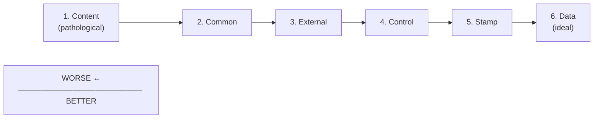
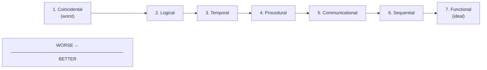
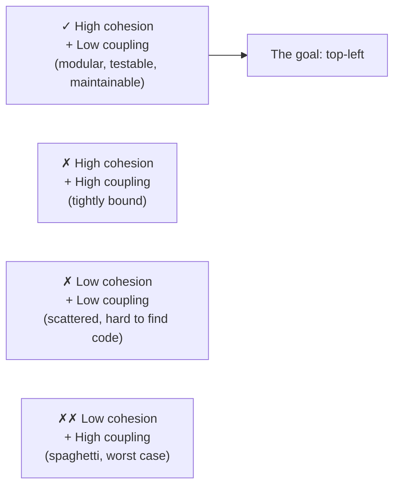
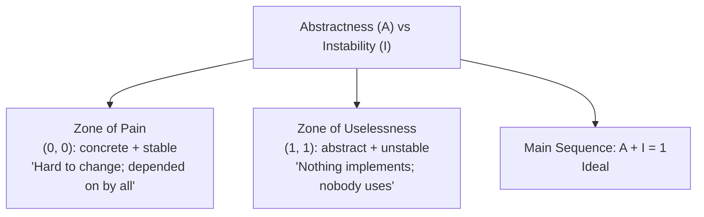

# Coupling & Cohesion

T01 covered SOLID; T02 covered DRY/KISS/YAGNI. This topic covers the *measurements* underneath both: **coupling** (how dependent modules are on each other) and **cohesion** (how related a module's responsibilities are). These two metrics, articulated by Larry Constantine and Ed Yourdon in *Structured Design* (1979), are the *foundational* way to talk about software quality at the module level. A well-designed system has **high cohesion + low coupling**; a poorly designed one has the opposite. SOLID principles are *tools* to achieve good coupling/cohesion; DRY/KISS/YAGNI are *constraints* that prevent over-application. Coupling and cohesion are the *vocabulary* for talking about why one design is better than another.

The depth-bar requirement isn't "high cohesion good, low coupling good." At the **taxonomy** layer, both coupling and cohesion have **7 levels** each, ordered from worst to best — Coupling: Content (pathological reflection-bypassing-encapsulation) → Common (shared global state) → External (shared format/protocol) → Control (boolean flag parameters) → Stamp (pass struct, use part) → Data (simple parameters, IDEAL); Cohesion: Coincidental (random "Utils") → Logical (same category) → Temporal (initialization) → Procedural (shared control flow) → Communicational (same data) → Sequential (pipeline) → Functional (single task, IDEAL). At the **metrics** layer, formal measurements quantify the qualitative — **LCOM** (Chidamber & Kemerer 1991 — lack of cohesion of methods), **Ca** (afferent coupling — incoming dependencies), **Ce** (efferent coupling — outgoing dependencies), **Instability** I = Ce/(Ca+Ce), **Abstractness** A = abstract/total types, **Distance from main sequence** D = |A + I - 1| (Robert Martin's metric identifying the **Zone of Pain** — stable concrete code — and **Zone of Uselessness** — unstable abstract code). At the **smell** layer, the canonical code smells map directly to coupling/cohesion violations — god class (low cohesion + high coupling), feature envy (method belongs elsewhere), shotgun surgery (one change → edits everywhere = high coupling), divergent change (one class changes for many reasons = low cohesion), data clumps (missing class), refused bequest (LSP + cohesion). At the **tooling** layer, automated measurement via SonarQube, IntelliJ built-in metrics, jdeps, Structure101 makes coupling/cohesion *observable* — not just felt — and JPMS (Java Platform Module System, JDK 9+) enforces module boundaries at the compiler level. We will cover all four layers with concrete examples and the connection to SOLID.

> [!NOTE]
> Prerequisites: [DRY, KISS, YAGNI](./T02-dry-kiss-yagni.md) (L3/C03/T02) — the constraint side of design quality; [SOLID principles](./T01-solid-principles.md) (L3/C03/T01) — the principles that *achieve* good coupling/cohesion.

## The Structured Design Origin

Larry Constantine and Ed Yourdon's *Structured Design* (1979) introduced these concepts in the era of structured programming (pre-OOP). The terms apply equally well to OO modules, packages, services, and microservices — anywhere there's a "module boundary."

The relationship to SOLID (decades earlier):

| SOLID principle | Effect on coupling/cohesion |
|-----------------|----------------------------|
| **SRP** (Single Responsibility) | Increases cohesion (one responsibility = related code) |
| **ISP** (Interface Segregation) | Decreases coupling (smaller interface = less dependency surface) |
| **DIP** (Dependency Inversion) | Decreases coupling (depend on abstraction, not concretion) |
| **OCP** (Open/Closed) | Decreases coupling (extensions don't modify existing code) |
| **LSP** (Liskov Substitution) | Preserves coupling/cohesion across inheritance |

SOLID principles *operationalize* the goal of good coupling/cohesion.

## Coupling — the 7 Types (Worst to Best)



### 1. Content Coupling (pathological)

One module *directly accesses or modifies* another's internal state.

```java
// In ClassB:
public class ClassB {
    int internalState = 0;
    private List<String> internalList = new ArrayList<>();
}

// In ClassA — using reflection to break encapsulation:
Field field = ClassB.class.getDeclaredField("internalState");
field.setAccessible(true);
field.setInt(b, 42);   // ✗ directly mutating B's private field
```

Or via subclass access to protected internals when not intended. The *worst* form of coupling: A breaks if B changes its private representation.

### 2. Common Coupling

Modules share global mutable state.

```java
public class GlobalConfig {
    public static volatile int maxConnections = 100;   // shared mutable state
}

// Anywhere:
GlobalConfig.maxConnections = 200;   // any module can mutate
```

Or singleton overuse: `DatabaseSingleton.getInstance().connection = newConn` from anywhere. Any module touching the global affects every other. Hard to reason about, hard to test.

### 3. External Coupling

Modules share an external interface (file format, protocol, message structure).

```java
// Both services parse the same JSON schema:
// Service A:
String json = "{ \"userId\": 1, \"name\": \"Alice\" }";
User u = parseJson(json);

// Service B (uses identical JSON parsing logic, hand-coded):
String json = "{ \"userId\": 1, \"name\": \"Alice\" }";
User u = parseJson(json);
```

Both services are *coupled to the JSON schema*. Change the schema → both services must update. Often unavoidable (HTTP APIs, file formats); use schema-versioning to manage.

### 4. Control Coupling

One module passes a *control flag* telling another what to do.

```java
public Result process(Data data, boolean validate, boolean cache, int mode) {
    // mode: 0 = read, 1 = write, 2 = delete
    // ...
}
```

The caller has to *know what control values mean*. Hidden coupling on the meaning of `mode`. Better: separate methods (`read`, `write`, `delete`) or strategy pattern.

### 5. Stamp Coupling

Modules pass a complex data structure, but only use parts of it.

```java
public class Order { /* ... 30 fields ... */ }

public void calculateTax(Order order) {
    // Only uses order.getSubtotal() and order.getCustomerState()
    return order.getSubtotal() * taxRate(order.getCustomerState());
}
```

The method depends on `Order` but only needs two fields. Change `Order`'s other fields → no effect on this method, but the *type* coupling exists. Better: pass only what's needed.

```java
public BigDecimal calculateTax(BigDecimal subtotal, String customerState) { ... }
```

### 6. Data Coupling (Ideal)

Modules communicate via simple, well-defined parameters.

```java
public BigDecimal calculateTax(BigDecimal subtotal, String customerState) {
    return subtotal.multiply(taxRate(customerState));
}
```

Each module knows only the data it needs. Change one module → others unaffected if signatures stay stable. **The goal.**

### 7. No Coupling

Impossible — modules must interact somehow. But minimizing coupling toward "Data" is the goal.

## Cohesion — the 7 Types (Worst to Best)



### 1. Coincidental Cohesion (worst)

Pieces grouped together for no real reason.

```java
public class Utils {
    public static int factorial(int n) { ... }
    public static String reverseString(String s) { ... }
    public static Date parseDate(String s) { ... }
    public static boolean isValidEmail(String email) { ... }
}
```

The classic "Utils" class. No logical relationship between methods.

### 2. Logical Cohesion

Pieces related by *category* but executed at different times.

```java
public class InputHandler {
    public Data readFromFile(String path) { ... }
    public Data readFromDatabase(int id) { ... }
    public Data readFromNetwork(URL url) { ... }
}
```

All "read input," but the implementations have nothing in common (different APIs, error handling, formats). The grouping is conceptual, not functional.

### 3. Temporal Cohesion

Pieces executed at the same time.

```java
public class StartupInitializer {
    public void initializeAll() {
        initializeLogging();
        initializeMetrics();
        initializeCache();
        initializeConnectionPool();
        loadConfiguration();
    }
}
```

All run at startup, but they're unrelated. Common in JVM lifecycle but acceptable for orchestration code.

### 4. Procedural Cohesion

Pieces sharing a control flow.

```java
public class OrderProcessing {
    public void process() {
        Order order = parseOrderXml();
        boolean valid = validateOrder(order);
        if (valid) saveToDatabase(order);
        sendNotification(order);
    }
}
```

The methods are part of one procedure but don't necessarily share data. The cohesion is *control flow*.

### 5. Communicational Cohesion

Pieces operating on the *same data*.

```java
public class OrderAnalyzer {
    public BigDecimal totalAmount(List<OrderItem> items) { ... }
    public int itemCount(List<OrderItem> items) { ... }
    public List<String> uniqueCategories(List<OrderItem> items) { ... }
}
```

All operate on `List<OrderItem>` but produce different outputs. Reasonably cohesive — they're "about" the same data.

### 6. Sequential Cohesion

Output of one piece is input to the next (pipeline).

```java
public class OrderPipeline {
    public Order process(String xml) {
        Order order = parse(xml);                    // output → input
        order = validate(order);                      // output → input
        order = enrich(order);                        // output → input
        return persist(order);
    }
}
```

The pieces form a pipeline. Stronger cohesion than communicational.

### 7. Functional Cohesion (Ideal)

All pieces contribute to *one single, well-defined task*.

```java
public class PayrollCalculator {
    public Money calculatePay(Employee emp, Hours hours, TaxBracket tax) {
        Money gross = calculateGross(emp, hours);
        Money withholding = applyTax(gross, tax);
        return gross.minus(withholding);
    }

    private Money calculateGross(Employee emp, Hours hours) { ... }
    private Money applyTax(Money gross, TaxBracket tax) { ... }
}
```

Every method contributes to the single task "calculate pay." Highest cohesion. **The goal.**

## The Goal: High Cohesion + Low Coupling



A well-designed module is **focused** (does one thing — high cohesion) and **independent** (doesn't depend on much — low coupling). These two properties are largely orthogonal; you want both.

## Coupling/Cohesion Metrics

### LCOM (Lack of Cohesion of Methods)

Introduced by Chidamber & Kemerer (1991, "A Metrics Suite for Object Oriented Design"). Multiple variants; the most useful is **LCOM4**:

> Count the number of **connected components** in the graph where:
> - Nodes are methods
> - Edges connect methods that share at least one field

LCOM4 = 1 → all methods related (good).
LCOM4 = N (where N = method count) → no methods related (bad).

```java
public class Example {
    private int a;
    private String b;
    private double c;

    public void m1() { a++; b = "x"; }    // uses a, b
    public void m2() { b = b.toLowerCase(); a--; }   // uses a, b
    public void m3() { c *= 2; }   // uses only c

    // Graph: {m1, m2} connected (share a, b); {m3} isolated
    // LCOM4 = 2 (two components)
    // Suggests splitting into two classes
}
```

High LCOM is a red flag — the class likely has multiple responsibilities (SRP violation).

### Coupling Metrics (Robert Martin, *Agile Software Development*)

For each *package* (or module):

- **Ca (Afferent Coupling)**: number of classes outside this package that depend on classes *inside* it. "How many people depend on me?"
- **Ce (Efferent Coupling)**: number of classes inside this package that depend on classes *outside*. "How many people do I depend on?"
- **I (Instability)** = `Ce / (Ca + Ce)`. Range 0 (stable) to 1 (unstable).

```text
Stable module (low I):
  Many incoming dependencies (everybody uses it).
  Few outgoing dependencies (depends on nobody).
  Hard to change without breaking many.
  → Should be ABSTRACT (interfaces, abstract classes).

Unstable module (high I):
  Few incoming dependencies.
  Many outgoing dependencies.
  Easy to change without breaking anything.
  → Can be CONCRETE.
```

The **Stable Abstractions Principle**: stable modules should be abstract; concrete modules should be unstable.

### Abstractness (A)

A = (# abstract classes + # interfaces) / (total # classes).
0 = entirely concrete; 1 = entirely abstract.

### Distance from Main Sequence (D)

```text
D = |A + I - 1|
```

The "main sequence" is the line `A + I = 1`: abstract+stable or concrete+unstable.

- **D = 0**: the ideal — balanced abstractness and stability.
- **D close to 1**: in a "zone of pain" or "zone of uselessness."



**Zone of Pain** (concrete + stable): something depended on by many, but hard to change. Example: a concrete `User` class used everywhere — changes ripple.

**Zone of Uselessness** (abstract + unstable): abstract code that nobody uses. Example: an interface with no implementations or no clients — dead.

Tools like Structure101 plot modules on this graph.

## 7 Code Smells from Bad Coupling/Cohesion

### 1. God class

A class with too much responsibility — low cohesion + high coupling.

```java
public class OrderService {   // 2000 lines, 50 public methods
    // Handles validation, calculation, persistence, notification,
    // reporting, audit logging, currency conversion, etc.
}
```

Symptoms: too many imports, too many methods, low LCOM. Refactor: extract responsibilities into separate classes.

### 2. Feature envy

A method uses *another class's* data more than its own.

```java
public class OrderService {
    public BigDecimal calculateTotal(Order order) {
        return order.getItems().stream()
                    .map(item -> item.getPrice().multiply(item.getQuantity()))   // all on item
                    .reduce(BigDecimal.ZERO, BigDecimal::add);
    }
}
```

The method works almost entirely with `OrderItem`. Move it to `OrderItem` (or `Order`).

### 3. Inappropriate intimacy

Two classes know too much about each other's internals (high coupling).

```java
public class Order {
    protected List<Item> items;                       // exposes to subclasses
    protected Map<String, Object> metadata;           // exposes internal map
}

public class OrderProcessor {
    public void process(Order o) {
        o.items.removeIf(i -> i.isInvalid());          // direct field access
        o.metadata.put("processed", Instant.now());    // direct field access
    }
}
```

Refactor: encapsulate. Order should expose methods (`addItem`, `removeInvalidItems`); OrderProcessor calls them.

### 4. Shotgun surgery

One change requires edits in many places (high coupling).

```text
Add a "discount code" field to Order:
- Edit Order class
- Edit OrderRepository (persistence)
- Edit OrderDTO (API)
- Edit OrderRequestDTO (input)
- Edit OrderResponseDTO (output)
- Edit OrderMapper (transformation)
- Edit OrderValidator (validation)
- ... and 5 more files
```

Symptom: change propagates everywhere. Refactor: consolidate the responsibility.

### 5. Divergent change

One class changes for many different reasons (low cohesion = SRP violation).

```java
public class UserService {
    // Changes when: auth rules change
    public boolean login(String user, String password) { ... }
    // Changes when: profile schema changes
    public void updateProfile(User u, Profile p) { ... }
    // Changes when: notification preferences change
    public void sendNotifications(User u, List<Notification> ns) { ... }
}
```

Three different reasons to change → three different classes.

### 6. Data clumps

Same group of fields keep appearing together (missing class).

```java
public void register(String firstName, String lastName, String street,
                     String city, String state, String zip, String country) { ... }

public void shipOrder(String firstName, String lastName, String street,
                      String city, String state, String zip, String country, ...) { ... }
```

`firstName + lastName` is a `Name`; `street + city + state + zip + country` is an `Address`. Extract:

```java
public void register(Name name, Address address) { ... }
public void shipOrder(Name name, Address address, ...) { ... }
```

### 7. Refused bequest

A subclass doesn't use methods it inherits.

```java
public class Square extends Rectangle {
    @Override public void setWidth(int w) { /* doesn't really apply */ }
    @Override public void setHeight(int h) { /* doesn't really apply */ }
}
```

LSP violation + cohesion issue. Refactor to common interface, not inheritance.

## Detecting in Code Review

Quick signals during code review:

| Signal | Meaning |
|--------|---------|
| Many `import` statements at top of file | High coupling (Ce) |
| Methods touching different sets of fields | Low cohesion |
| 500+ lines in one class | God class likely |
| Same field group in multiple methods | Data clump → extract class |
| Method body mostly calls on a single other object | Feature envy |
| Multiple "and" in class name | Multiple responsibilities |
| Public protected fields | Inappropriate intimacy |

## Tools

### SonarQube

Comprehensive metric tracking — LCOM, Ca, Ce, complexity, code smells. Integrated with CI. The most-used commercial-grade tool.

### IntelliJ IDEA

Built-in code metrics view. Right-click → "Analyze" → "Calculate Metrics." Shows class- and method-level cohesion / complexity / coupling.

### `jdeps` (built-in JDK)

```bash
jdeps -summary myapp.jar
jdeps -dotoutput dependencies/ myapp.jar
```

Module-level dependency analysis. Detects coupling at the JAR / module level. Especially useful with JPMS.

### Structure101 (commercial)

Visual coupling/cohesion analysis at multiple scales. Plots distance-from-main-sequence. Great for architectural assessment.

## Java-Specific Considerations

### Spring DI → DIP → Low Coupling

```java
@Service
public class OrderService {
    private final OrderRepository repo;

    public OrderService(OrderRepository repo) {       // constructor injection
        this.repo = repo;
    }
}
```

Constructor injection (DIP applied) decreases coupling — `OrderService` depends on the *interface*, not the concrete implementation.

### JPMS (Java Platform Module System, JDK 9+)

```java
module com.example.orders {
    requires com.example.users;                       // explicit dependency
    exports com.example.orders.api;                    // public surface
    // internal packages not exported = inaccessible from outside
}
```

JPMS enforces module boundaries *at the compiler level*. You *can't* accidentally import an internal package. This is coupling control at compile time.

### Records → high cohesion value classes

```java
public record Money(BigDecimal amount, Currency currency) { }
```

Records group related fields with their behavior (since you can add methods); single responsibility (represent a value); functional cohesion built-in.

### Bounded contexts (DDD) → limit cross-module coupling

```
[Order Context] ←—(Anti-Corruption Layer)—→ [Catalog Context]
```

In DDD, each bounded context has its own model. Cross-context interaction goes through explicit translation layers (Anti-Corruption Layer), preventing one context's changes from breaking another.

### Microservices → coupling as deployment boundary

Microservices make coupling *explicit* — interactions cross network boundaries via APIs. Within a service, modules; across services, APIs with explicit versioning.

### Event-driven architecture → loose coupling

Publish/subscribe via events (Kafka, RabbitMQ) loosens *runtime* coupling: the producer doesn't know who consumes. Change consumers without changing producers.

## Refactoring Strategies

To improve coupling/cohesion:

| Smell | Refactoring |
|-------|-------------|
| God class | Extract class (split by responsibility) |
| Feature envy | Move method to the data it uses |
| Inappropriate intimacy | Hide internals; expose methods |
| Shotgun surgery | Consolidate scattered logic |
| Divergent change | Split by reason-to-change (SRP) |
| Data clumps | Extract a value class |
| Refused bequest | Replace inheritance with composition or interfaces |

Apply these *one at a time*. Each move is small; cumulative effect is large.

## Common Mistakes

### Treating "no coupling" as the goal

Impossible. Aim for *low* coupling, not zero. Modules must interact.

### Confusing high cohesion with "small classes"

Cohesion is about *relatedness*, not size. A 200-line class with focused responsibility can be more cohesive than a 50-line class with mixed concerns.

### Premature decomposition

Splitting a class before responsibilities are clear creates the wrong structure. Wait for the *seams* to reveal themselves.

### Ignoring metrics

LCOM, Ca, Ce, etc. are observable. Don't rely on intuition alone; measure.

### Coupling reduction at the cost of clarity

Sometimes a *little* extra coupling is worth it for readability. Don't dogmatically minimize.

### Forgetting bounded contexts

The same name in two contexts (e.g., "Customer" in Sales vs Support) often refers to *different* concepts. Don't force them into one model just to reduce coupling — separate models are the right answer.

## Practice

1. **Calculate LCOM for a class.** Pick one in your codebase. Draw the method-field connection graph. Count connected components.
2. **Identify coupling type.** For 5 interactions in your codebase, classify each as content/common/external/control/stamp/data coupling.
3. **Find a god class.** Identify a class > 500 lines. Apply the divergent-change lens; identify the multiple reasons to change. Refactor.
4. **Feature envy refactor.** Find a method that uses another class's data heavily. Move it.
5. **Data clump extraction.** Find repeated parameter groups; extract a value class.
6. **JPMS exercise.** Convert a multi-package project to JPMS modules with explicit `requires` / `exports`. Observe the coupling violations the compiler catches.
7. **`jdeps` analysis.** Run `jdeps` on your application JAR. Identify high-Ce packages.
8. **SonarQube metrics.** Run a SonarQube scan. Identify the worst-cohesion classes; refactor one.
9. **Bounded context decomposition.** Identify a "Customer" concept that means different things in different parts of your system. Map to bounded contexts.
10. **Distance from main sequence.** For your top 5 packages, calculate A and I. Plot. Identify zone-of-pain candidates.
11. **Shotgun surgery measurement.** For a recent feature, count files changed. If > 5, diagnose: what coupling caused this?
12. **Refused bequest refactor.** Find a `UnsupportedOperationException` override. Refactor to composition or interfaces.

## Recap

You should now be able to:

- Trace coupling and cohesion to **Constantine and Yourdon's *Structured Design* (1979)** — pre-OOP origin still applicable.
- Map **SOLID to coupling/cohesion**: SRP → cohesion; ISP/DIP/OCP → low coupling; LSP → preserves both across inheritance.
- Identify the **7 levels of coupling** (worst to best): **Content** (pathological, reflection bypassing encapsulation), **Common** (shared global state), **External** (shared format), **Control** (boolean flags), **Stamp** (pass struct use part), **Data** (simple params — IDEAL), No coupling (impossible).
- Identify the **7 levels of cohesion** (worst to best): **Coincidental** (random "Utils"), **Logical** (same category different times), **Temporal** (initialization), **Procedural** (shared control), **Communicational** (same data), **Sequential** (pipeline), **Functional** (single task — IDEAL).
- Apply the goal: **high cohesion + low coupling**. The matrix shows the 4 combinations; top-left is the target.
- Calculate **LCOM4** (Chidamber & Kemerer 1991): count connected components in the method-field graph. High LCOM = SRP violation.
- Calculate Robert Martin's coupling metrics: **Ca** (incoming), **Ce** (outgoing), **Instability I** = Ce/(Ca+Ce), **Abstractness A** = abstract/total, **Distance D** = |A + I - 1|.
- Recognize the **Stable Abstractions Principle**: stable modules should be abstract; concrete modules should be unstable.
- Identify **Zone of Pain** (concrete + stable: hard to change) and **Zone of Uselessness** (abstract + unstable: nothing uses it) and aim for the main sequence.
- Detect the **7 code smells** related to coupling/cohesion: god class, feature envy, inappropriate intimacy, shotgun surgery, divergent change, data clumps, refused bequest — and the canonical refactorings for each.
- Detect issues in **code review**: many imports = high Ce; methods touching disjoint fields = low cohesion; "and" in class name = multiple responsibilities.
- Use **tools**: SonarQube (comprehensive), IntelliJ (built-in metrics), `jdeps` (JDK module deps), Structure101 (visual analysis).
- Apply **Java-specific patterns**: Spring DI → DIP → low coupling; JPMS → enforced coupling boundaries; records → cohesive value classes; bounded contexts (DDD) → limit cross-module coupling; microservices → coupling as deployment boundary; event-driven → loose runtime coupling.
- Apply **refactoring strategies**: extract class (god class), move method (feature envy), encapsulate (intimacy), consolidate (shotgun surgery), split by responsibility (divergent change), extract value class (data clumps), replace inheritance with composition (refused bequest).
- Avoid the **6 common mistakes**: treating zero coupling as goal, confusing cohesion with size, premature decomposition, ignoring metrics, coupling reduction at clarity cost, forgetting bounded contexts.

## Next

Continue to [Creational patterns (Singleton, Factory, Builder, Prototype)](./T04-creational-patterns-singleton-factory-builder-prototype.md) — the first family of GoF patterns. We'll cover **Singleton** (the canonical "one instance" pattern + its anti-pattern reputation + correct uses); **Factory Method** (delegating construction to subclasses); **Abstract Factory** (families of related products); **Builder** (multi-step construction with optional parameters); **Prototype** (clone-based creation). Plus Java-specific implementations using enums for Singleton, records for value Builders, sealed classes for type-safe Factories, and how each pattern realizes SOLID principles (most are DIP applications).
