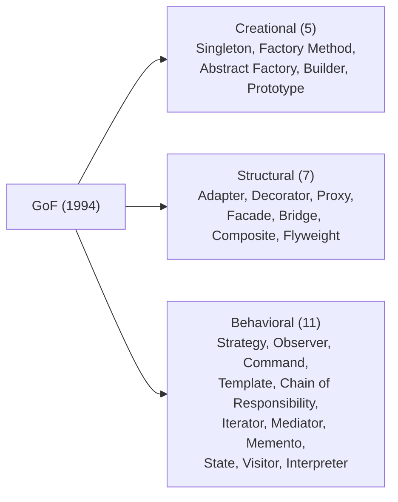

# Creational Patterns (Singleton, Factory, Builder, Prototype)

T01–T03 covered the principles (SOLID, DRY/KISS/YAGNI, coupling/cohesion). Now we apply them to specific *patterns*. The **Gang of Four (GoF)** book — *Design Patterns: Elements of Reusable Object-Oriented Software* (Gamma, Helm, Johnson, Vlissides, 1994) — codified 23 patterns into three families: **Creational** (about object creation), **Structural** (about composition), **Behavioral** (about interaction). This topic covers all of family one: the four major creational patterns plus the JDK's heavily-used **static factory methods** (Joshua Bloch's preferred alternative to constructors). Modern Java has changed how we apply these — records, sealed classes, DI containers replace many traditional uses — but the patterns remain part of every senior engineer's vocabulary.

The depth-bar requirement isn't "use Singleton sparingly." At the **historical** layer, GoF synthesized recurring design solutions from 1980s–90s OO practice; many patterns predate the book but were named there. At the **applicability** layer, each creational pattern addresses a *specific* construction challenge: **Singleton** ensures one instance exists (controversial but sometimes correct); **Factory Method** delegates instantiation choice to a subclass; **Abstract Factory** creates families of related products; **Builder** constructs complex objects step-by-step; **Prototype** clones existing instances. At the **Java idioms** layer, the language has evolved sophisticated implementations — Bloch's **enum Singleton** (serialization-safe, reflection-resistant, lazy-init via JVM class loading), Joshua Bloch's **static factory methods** (Effective Java Item 1 — preferred over constructors for return-type flexibility, name clarity, caching), **records + builders** for many-arg value classes, **Lombok `@Builder`** for boilerplate elimination. At the **modern alternative** layer, **DI containers** (Spring, Guice) and **functional construction** (records, sealed classes) make some patterns nearly obsolete — Singleton becomes `@Component`/`@Bean` scope=singleton; Factory becomes constructor injection. We will cover all five, with Java-specific implementation idioms and the SOLID mapping (Factory ← DIP, Builder ← SRP + OCP, Singleton ← controversial DIP applied).

> [!NOTE]
> Prerequisites: [Coupling & cohesion](./T03-coupling-and-cohesion.md) (L3/C03/T03) — creational patterns affect coupling; [DRY, KISS, YAGNI](./T02-dry-kiss-yagni.md) (L3/C03/T02) — patterns are tools, not rules; don't over-apply; [SOLID principles](./T01-solid-principles.md) (L3/C03/T01) — most creational patterns are DIP applied.

## The GoF Book and the Creational Family

*Design Patterns: Elements of Reusable Object-Oriented Software* (1994) by Erich Gamma, Richard Helm, Ralph Johnson, John Vlissides — the "Gang of Four" — codified 23 OO patterns:



**Creational patterns** answer: how should this object be created? They separate *construction* from *use*, hiding details and enabling flexibility.

This topic covers the family. T05 covers Structural; T06 covers Behavioral.

## Singleton — One Instance, Global Access

The most famous and most controversial GoF pattern. The intent:

> **Ensure a class has only one instance and provide a global point of access to it.**

### Why controversial

- **Hidden dependencies**: code that uses `Singleton.getInstance()` doesn't *declare* the dependency in its constructor — making it hard to test, mock, or substitute.
- **Global mutable state**: a singleton with mutable fields is shared global state — concurrency hazards and reasoning difficulties (T17 from C01 — confinement).
- **Tight coupling**: callers know the singleton's concrete class.

Often considered an *anti-pattern*. But not always wrong — singletons are legitimately useful for *truly stateless* services, logging, configuration loaded at boot.

### 5 Implementation Strategies

#### 1. Eager static initialization

```java
public class EagerSingleton {
    private static final EagerSingleton INSTANCE = new EagerSingleton();
    private EagerSingleton() {}
    public static EagerSingleton getInstance() { return INSTANCE; }
}
```

Simple. Thread-safe by JVM class init guarantee (T02 — class initialization lock). Wasted memory if never used.

#### 2. Lazy synchronized

```java
public class LazySynchronizedSingleton {
    private static LazySynchronizedSingleton instance;
    private LazySynchronizedSingleton() {}

    public static synchronized LazySynchronizedSingleton getInstance() {
        if (instance == null) instance = new LazySynchronizedSingleton();
        return instance;
    }
}
```

Lazy initialization. But `synchronized` on every call is overhead even when initialized.

#### 3. Double-Checked Locking (DCL) with `volatile`

```java
public class DCLSingleton {
    private static volatile DCLSingleton instance;     // ← volatile is required (T12 from C01)
    private DCLSingleton() {}

    public static DCLSingleton getInstance() {
        if (instance == null) {
            synchronized (DCLSingleton.class) {
                if (instance == null) instance = new DCLSingleton();
            }
        }
        return instance;
    }
}
```

Pre-JDK 5: broken (T12 from C01 — the canonical DCL discussion). JDK 5+ with `volatile`: correct. Recommended only if you specifically need lazy init.

#### 4. Holder Class Idiom (Recommended)

```java
public class HolderSingleton {
    private HolderSingleton() {}

    private static class Holder {
        static final HolderSingleton INSTANCE = new HolderSingleton();
    }

    public static HolderSingleton getInstance() { return Holder.INSTANCE; }
}
```

The inner class isn't loaded until `getInstance()` is called — lazy init. The JVM's class initialization lock provides thread-safety for free. The standard for lazy singletons.

#### 5. Enum Singleton (Joshua Bloch's "Best Way")

```java
public enum EnumSingleton {
    INSTANCE;

    public void doWork() { /* ... */ }
}

// Usage:
EnumSingleton.INSTANCE.doWork();
```

From *Effective Java* Item 3 (Bloch). Advantages:

- **Serialization-safe**: enums handle serialization correctly by default.
- **Reflection-resistant**: the JVM prevents reflective instantiation of additional enum constants.
- **Thread-safe**: JVM class init lock guarantees single instance.
- **Concise**: one line declaration.

```java
public enum DatabaseConfig {
    INSTANCE;
    private final String url = System.getenv("DB_URL");
    private final String user = System.getenv("DB_USER");
    public String getUrl()  { return url; }
    public String getUser() { return user; }
}
```

The trade-off: enum singletons can't extend a class (enums implicitly extend `Enum`).

### When NOT to Use Singleton

- The "singleton" represents *configuration that might change*: use Spring `@Bean` instead.
- The class has mutable state: shared global state is a concurrency hazard.
- Tests need to substitute the singleton: hidden dependency → no clean substitution.
- The class will likely have multiple instances later (test vs prod databases).

### The Modern Alternative: DI Container

```java
@Component
@Scope("singleton")   // default; spelled out for clarity
public class ConfigService { ... }

// In a consumer:
@Service
public class OrderService {
    private final ConfigService config;
    public OrderService(ConfigService config) { this.config = config; }
}
```

Spring manages the singleton lifecycle, the dependency is declared (testable), and the "instance" is the Spring bean — easily substituted in tests via `@MockBean`. This is *the* preferred form in modern Spring applications.

## Factory Method — Delegate Instantiation to Subclasses

> **Define an interface for creating an object, but let subclasses decide which class to instantiate.**

The Factory Method pattern defers instantiation to subclasses, decoupling the *what* (interface) from the *how* (concrete class).

### Example

```java
public abstract class Logger {
    public abstract LogWriter createLogWriter();   // factory method

    public void log(String message) {
        LogWriter writer = createLogWriter();       // subclass decides which
        writer.write(message);
    }
}

public class FileLogger extends Logger {
    public LogWriter createLogWriter() { return new FileLogWriter(); }
}

public class ConsoleLogger extends Logger {
    public LogWriter createLogWriter() { return new ConsoleLogWriter(); }
}
```

The base class provides the *algorithm* (`log`); subclasses provide the *implementation choice* (`createLogWriter`).

### Why use it

- **Decouples**: `Logger` doesn't know about specific `LogWriter` implementations.
- **DIP applied**: `Logger` depends on the abstract `LogWriter`, not concretions.
- **Open/Closed**: add a new logger type by creating a subclass; no existing code modified.

### JDK example: `Calendar.getInstance()`

```java
Calendar cal = Calendar.getInstance();   // returns GregorianCalendar in most locales
                                          // returns BuddhistCalendar in Thai locale
                                          // returns JapaneseImperialCalendar in JP locale
```

The static factory picks the right concrete calendar based on locale. The caller gets `Calendar` — works regardless.

## Static Factory Methods (Bloch's Preferred Alternative)

Joshua Bloch's *Effective Java* Item 1: **Consider static factory methods instead of constructors.**

```java
// Instead of:
Boolean b1 = new Boolean(true);   // ✗ allocates new

// Use:
Boolean b2 = Boolean.valueOf(true);   // ✓ returns cached TRUE/FALSE
```

### 5 advantages of static factories over constructors

1. **They have names**: `Money.usDollars(100)` is clearer than `new Money(100, USD)`.
2. **They can return cached/shared instances**: `Boolean.valueOf()`, `Integer.valueOf()`.
3. **They can return any subtype**: `Collections.unmodifiableList(...)` returns a private implementation.
4. **Return type can vary**: same method can return different concrete types based on input.
5. **The class of the returned object need not exist at method definition**: enables plugins.

### Pervasive in modern Java

```java
Optional<String> opt = Optional.of("hello");      // factory
List<Integer>    list = List.of(1, 2, 3);         // factory (returns immutable)
Map.Entry<K, V>  entry = Map.entry(k, v);          // factory
LocalDate        date = LocalDate.of(2026, 6, 8);  // factory
HttpClient       client = HttpClient.newHttpClient(); // factory
Stream<Integer>  s = Stream.of(1, 2, 3);          // factory
```

Modern Java uses static factories everywhere — and you should too in your own code for non-trivial construction.

## Abstract Factory — Families of Related Products

> **Provide an interface for creating families of related or dependent objects without specifying their concrete classes.**

The example from the GoF book: a GUI toolkit that supports multiple look-and-feels (Windows, Mac, Linux). Each look-and-feel has a *family* of widgets (button, scrollbar, textbox).

```java
public interface UIFactory {
    Button createButton();
    Scrollbar createScrollbar();
    TextBox createTextBox();
}

public class WindowsUIFactory implements UIFactory {
    public Button createButton() { return new WindowsButton(); }
    public Scrollbar createScrollbar() { return new WindowsScrollbar(); }
    public TextBox createTextBox() { return new WindowsTextBox(); }
}

public class MacUIFactory implements UIFactory {
    public Button createButton() { return new MacButton(); }
    public Scrollbar createScrollbar() { return new MacScrollbar(); }
    public TextBox createTextBox() { return new MacTextBox(); }
}

// Usage:
public class Application {
    private final UIFactory factory;
    public Application(UIFactory factory) { this.factory = factory; }

    public void render() {
        Button b = factory.createButton();
        Scrollbar s = factory.createScrollbar();
        // ...
    }
}

// Configuration:
UIFactory factory = isMac() ? new MacUIFactory() : new WindowsUIFactory();
Application app = new Application(factory);
```

The whole *family* switches together. You never mix a Windows button with a Mac scrollbar.

### Modern use case: Spring `BeanFactory`

Spring's bean factory is essentially Abstract Factory — clients ask the factory for beans by type or name; the factory provides instances configured by the application context. The Spring framework hides the entire construction lifecycle behind the factory.

### When to use Abstract Factory

- When you have *families* of related products that must vary together.
- When clients should be unaware of which family they're using.
- When you want to switch entire families at runtime via configuration.

When *not* to: most modern Java apps don't need this directly — DI containers (Spring) handle the cross-cutting variation.

## Builder — Multi-Step Construction with Optional Parameters

> **Separate the construction of a complex object from its representation.**

Addresses the **telescoping constructor** anti-pattern:

```java
// ✗ Telescoping constructors — unmaintainable for many optional fields:
public class Pizza {
    public Pizza(int size) { ... }
    public Pizza(int size, boolean cheese) { ... }
    public Pizza(int size, boolean cheese, boolean pepperoni) { ... }
    public Pizza(int size, boolean cheese, boolean pepperoni, boolean mushrooms) { ... }
    // ... explodes
}

// Or — JavaBeans pattern — unsafe (incomplete construction, mutable):
Pizza p = new Pizza();
p.setSize(12);
p.setCheese(true);
// ✗ what if someone forgets setSize?
```

### Joshua Bloch's Builder (Effective Java Item 2)

```java
public class Pizza {
    private final int size;
    private final boolean cheese;
    private final boolean pepperoni;
    private final boolean mushrooms;

    private Pizza(Builder b) {
        size = b.size; cheese = b.cheese; pepperoni = b.pepperoni; mushrooms = b.mushrooms;
    }

    public static class Builder {
        // Required
        private final int size;
        // Optional with defaults
        private boolean cheese = false;
        private boolean pepperoni = false;
        private boolean mushrooms = false;

        public Builder(int size) { this.size = size; }

        public Builder cheese(boolean v)     { cheese = v; return this; }
        public Builder pepperoni(boolean v)  { pepperoni = v; return this; }
        public Builder mushrooms(boolean v)  { mushrooms = v; return this; }

        public Pizza build() { return new Pizza(this); }
    }
}

// Usage:
Pizza p = new Pizza.Builder(12)
    .cheese(true)
    .pepperoni(true)
    .build();
```

The Builder pattern allows:

- **Immutable result**: `Pizza` has only `final` fields, no setters.
- **Readable construction**: each step is named.
- **Required vs optional parameters**: required in the constructor, optional via setters.
- **Validation in `build()`**: ensure invariants are satisfied before construction.

### JDK example: `HttpClient.newBuilder()`

```java
HttpClient client = HttpClient.newBuilder()
    .version(HttpClient.Version.HTTP_2)
    .connectTimeout(Duration.ofSeconds(10))
    .followRedirects(HttpClient.Redirect.NORMAL)
    .build();
```

JDK 11's HttpClient uses Builder pervasively.

### Lombok `@Builder`

```java
@Builder
public class Pizza {
    private final int size;
    private final boolean cheese;
    private final boolean pepperoni;
    private final boolean mushrooms;
}

// Lombok generates the Builder; usage:
Pizza p = Pizza.builder().size(12).cheese(true).pepperoni(true).build();
```

Eliminates boilerplate. Trade-off: dependency on Lombok and IDE plugins.

### Records and Builder

Records (JDK 14+) have a canonical constructor that's positional:

```java
public record Pizza(int size, boolean cheese, boolean pepperoni, boolean mushrooms) {}

// Construction:
Pizza p = new Pizza(12, true, true, false);   // positional — error-prone for many args
```

For records with many fields (4+), adding a Builder is still useful:

```java
public record Pizza(int size, boolean cheese, boolean pepperoni, boolean mushrooms) {

    public static Builder builder() { return new Builder(); }

    public static class Builder {
        private int size;
        private boolean cheese, pepperoni, mushrooms;

        public Builder size(int v) { size = v; return this; }
        public Builder cheese(boolean v) { cheese = v; return this; }
        public Builder pepperoni(boolean v) { pepperoni = v; return this; }
        public Builder mushrooms(boolean v) { mushrooms = v; return this; }

        public Pizza build() {
            return new Pizza(size, cheese, pepperoni, mushrooms);
        }
    }
}
```

Or Lombok's `@Builder` on a record works as well.

## Prototype — Clone-Based Creation

> **Specify the kinds of objects to create using a prototypical instance, and create new objects by copying this prototype.**

Used when object construction is expensive (database lookups, complex computation) and you have an existing instance to copy.

### The Java problem: `Object.clone()` is broken

```java
public class Sheep implements Cloneable {
    private String name;
    private List<String> traits;

    @Override
    protected Object clone() throws CloneNotSupportedException {
        return super.clone();   // shallow copy — traits list is SHARED
    }
}
```

`Object.clone()`:

- Performs **shallow copy** by default — references to mutable objects are shared with the original.
- Requires implementing the marker interface `Cloneable` (a JVM quirk).
- Throws checked `CloneNotSupportedException` (annoying).
- The protected modifier means subclasses can clone but external code can't.

Joshua Bloch (*Effective Java* Item 13): "Avoid `Cloneable`/`clone`."

### Modern alternatives

#### Copy constructor

```java
public class Sheep {
    private final String name;
    private final List<String> traits;

    public Sheep(Sheep original) {                      // copy constructor
        this.name = original.name;
        this.traits = List.copyOf(original.traits);     // explicit deep copy
    }
}
```

Explicit, type-safe, no checked exceptions, no marker interface. The preferred approach.

#### Copy factory method

```java
public class Sheep {
    public static Sheep copyOf(Sheep original) {
        return new Sheep(original);
    }
}
```

Combines static factory benefits with copy semantics.

#### Records' implicit copy

```java
public record Point(int x, int y) {}

Point p1 = new Point(1, 2);
Point p2 = new Point(p1.x(), p1.y());   // explicit "copy" — only works for immutable records
```

Records are immutable; you don't *clone* them, you create new ones via the constructor.

#### Withers (proposed for records, JDK enhancement)

```java
// Future Java:
Point p2 = p1 with { x = 5; };   // create modified copy
```

Not yet standard in JDK 24; some libraries (Vavr, Eclipse Collections) provide similar patterns.

### When Prototype is still used

- Cloning configuration objects in dependency injection.
- Object pools (next).
- Game state replication.

Mostly: it's rarely the right pattern in modern Java. Prefer copy constructors or factory methods.

## Object Pools (Related Creational Concern)

Object pools manage a *set* of reusable instances. Used when:

- Construction is expensive (database connections, threads).
- Many short-lived instances would cause GC pressure.

```java
// HikariCP example:
HikariConfig config = new HikariConfig();
config.setJdbcUrl("jdbc:postgresql://localhost/mydb");
config.setMaximumPoolSize(20);
HikariDataSource pool = new HikariDataSource(config);

try (Connection conn = pool.getConnection()) {   // borrow
    // use the connection
}   // return automatically via try-with-resources
```

Apache Commons Pool provides generic pooling; HikariCP for connection pooling; Netty manages its own buffer pools. Object pools are a *production* concern more than a *pattern* you'd write yourself in 2026.

## SOLID Mapping

| Pattern | SOLID applied |
|---------|---------------|
| **Singleton** | (Controversial) — usually DIP via interface, instance via class. Or Spring DI replaces it. |
| **Factory Method** | DIP — clients depend on abstract product, not concrete |
| **Abstract Factory** | DIP + OCP — switch families without changing client code |
| **Builder** | SRP + OCP — separate construction concern; new fields don't break existing code |
| **Prototype** | (Rarely used in modern Java) |

## DI Container — the Modern Alternative

Most creational patterns are *replaced* in modern Spring applications by the DI container:

- **Singleton** → `@Component @Scope("singleton")` (Spring's default scope).
- **Factory** → Constructor injection of the abstraction.
- **Abstract Factory** → Multiple `@Bean` definitions with profiles.
- **Builder** → Still useful for value objects; not replaced.

For *new* Java code in 2026, ask first: "would Spring handle this?" Often yes.

## Common Interview Questions

### "What's wrong with Singleton?"

Hidden dependencies, global mutable state, untestable. Modern code uses DI containers.

### "How do you make a thread-safe Singleton?"

Eager static initialization (simple, JVM-thread-safe via class init lock); holder class idiom (lazy + thread-safe); enum singleton (Bloch's recommended).

### "Why use Builder over constructor?"

Many optional parameters; readable named arguments; immutable result; validation in `build()`.

### "Static factory method vs constructor?"

5 advantages: names, caching, return-subtype flexibility, varying return type, returned class need not exist. Bloch's Effective Java Item 1.

### "Why is `Object.clone()` broken?"

Shallow copy by default; Cloneable marker interface; CloneNotSupportedException checked; protected modifier limits use. Use copy constructor.

## Common Mistakes

### Overusing Singleton

The "Hammer of Singleton" — applying it where a simple instance would do. Most "singletons" should be `@Component` or just an injected dependency.

### Telescoping constructors

For 3+ optional fields, switch to Builder.

### Public mutable Singleton fields

Defeats encapsulation; creates global mutable state.

### Implementing `Cloneable`

It's a footgun. Use copy constructor.

### Builder without validation

`build()` should validate invariants — required fields set, ranges checked, etc.

### Premature Factory creation

For one implementation, just `new` the class. Add Factory when multiple implementations emerge.

## Practice

1. **Implement Singleton 5 ways.** Eager static, lazy synchronized, DCL with volatile, holder class, enum. Compare thread-safety and laziness.
2. **Enum Singleton with state.** Build an enum singleton with mutable state. Verify thread-safety considerations.
3. **Static factory method refactor.** Find a class with multiple constructors; refactor to static factory methods with descriptive names.
4. **Factory Method.** Implement `Logger` with subclasses choosing `LogWriter` type. Add a new logger without modifying existing code.
5. **Abstract Factory.** Implement a `UIFactory` with Windows and Mac variants. Switch variants via configuration.
6. **Builder for a complex object.** Build an `HttpRequest` with many optional fields. Compare telescoping constructor vs Builder.
7. **Lombok @Builder.** Add Lombok to a project; convert a Builder to @Builder. Verify generated code.
8. **Record with Builder.** Create a record with 6+ fields; add a static Builder for cleaner construction.
9. **Avoid `Cloneable`.** Find a class implementing `Cloneable`; refactor to copy constructor.
10. **Spring `@Bean` factory.** Convert a manual Singleton to a Spring `@Bean`. Test substitutability.
11. **Connection pool basics.** Wire HikariCP for a database; observe pool behavior under load.
12. **Builder validation.** Add validation logic to `build()` — required fields, range checks, business rules.

## Recap

You should now be able to:

- Identify **GoF (1994)** as the source of the design pattern canon; 23 patterns in 3 families (Creational, Structural, Behavioral); creational addresses "how to instantiate."
- Implement **Singleton** 5 ways with their trade-offs: eager static (simple, JVM-init-safe, wastes memory if unused), lazy synchronized (overhead per call), DCL with volatile (broken pre-JDK 5; fixed since), holder class idiom (recommended for lazy), **enum Singleton** (Bloch's "best way" — serialization-safe, reflection-resistant, thread-safe by JVM class init).
- Reject Singleton's anti-pattern uses: hidden dependencies, global mutable state, untestable code. Prefer **DI container** (Spring `@Component @Scope("singleton")`) in modern code.
- Apply **Factory Method**: define interface for creating, let subclasses decide concrete class. DIP applied. JDK examples (`Calendar.getInstance()`) and DI replacement.
- Apply **static factory methods** (Bloch's *Effective Java* Item 1) preferring them over constructors: have names (`Money.usDollars(100)` vs `new Money(100, USD)`), return cached/shared, return subtype, vary return type, returned class need not exist. JDK uses (`Optional.of`, `List.of`, `Map.entry`, `LocalDate.of`, `HttpClient.newHttpClient`, `Stream.of`).
- Apply **Abstract Factory** for families of related products varying together (Windows/Mac/Linux UI toolkits); Spring's `BeanFactory` as the modern manifestation.
- Apply **Builder** (Bloch's *Effective Java* Item 2) for multi-step construction with optional parameters: avoid telescoping constructor anti-pattern; immutable result; readable named arguments; validation in `build()`. JDK example (`HttpClient.newBuilder()`); Lombok `@Builder`; records + builders for many-arg value classes.
- Avoid **Prototype** in modern Java: `Object.clone()` is broken (shallow, Cloneable, CloneNotSupportedException, protected). Use **copy constructor** or **copy factory method** instead.
- Recognize **object pools** (Apache Commons Pool, HikariCP for connections) as production-level creational concern.
- Map creational patterns to **SOLID**: Factory ← DIP, Builder ← SRP+OCP, Singleton ← DIP via interface (controversial).
- Recognize **DI container** as the modern alternative replacing most creational patterns: Spring's `@Component`, `@Bean`, `@Scope` annotations.
- Answer common interview questions: "what's wrong with Singleton?" "how to make it thread-safe?" "why Builder over constructor?" "static factory vs constructor?" "why is Object.clone broken?"
- Avoid the **6 common mistakes**: overusing Singleton, telescoping constructors for 3+ optionals, public mutable Singleton fields, implementing Cloneable, Builder without validation, premature Factory creation.

## Next

Continue to [Structural patterns (Adapter, Decorator, Proxy, Facade)](./T05-structural-patterns-adapter-decorator-proxy-facade.md) — the second GoF pattern family, focused on *composition* and *relationships between objects*. We'll cover **Adapter** (make incompatible interfaces work together — wrap a third-party API to fit your domain); **Decorator** (add behavior to objects dynamically without modifying their class — Java I/O streams as the canonical example); **Proxy** (control access to an object — Spring AOP and Hibernate lazy loading use this); **Facade** (provide a unified interface to a complex subsystem — Spring's `JdbcTemplate` as a facade over JDBC); plus brief coverage of **Bridge**, **Composite**, **Flyweight** completing the structural family.
