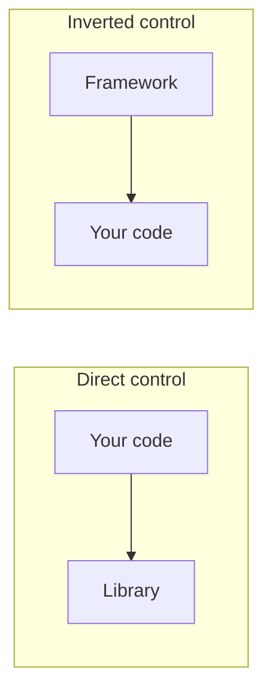

# Dependency Injection / IoC (concept)

*Dependency Injection* (DI) is the single most influential architectural pattern in modern Java. It's the engine behind Spring, the substrate of Java EE/Jakarta EE CDI, the rationale for Guice and Dagger, and the reason your `OrderService` accepts an `OrderRepository` as a constructor parameter instead of `new`-ing one inside. The pattern is named confusingly — *Inversion of Control* (IoC) is the broader principle; DI is one way to invert control — but the practical impact is uniform: classes declare what they need; an external party provides it; code becomes testable, swappable, and decoupled from concrete implementations.

This topic is *framework-agnostic*. It covers the *concept* of DI/IoC — why it exists, the three injection styles, the distinction from service location, the "Hollywood Principle", the composition root, and the testability and design implications. Specific frameworks (Spring, Guice, Dagger) instantiate the concept differently; understanding the concept makes any DI framework feel like a tool you're applying rather than magic you're surviving.

> [!NOTE]
> Prerequisites: [SOLID (L3/C03/T01)](./T01-solid-principles.md), [Coupling & cohesion (L3/C03/T03)](./T03-coupling-and-cohesion.md). For Spring-specific mechanics, see [L4/C01 Spring Framework](../../L4-backend-engineering/C01-spring-framework/README.md).

## The Origin Story

### Pre-DI World (1990s)

Classes created their dependencies directly:

```java
class OrderService {
    private OrderRepository repo = new JdbcOrderRepository(
        new HikariDataSource(loadConfig())
    );
    private PaymentClient pay = new StripeClient(
        new ApacheHttpClient(),
        loadConfig().get("stripe.key")
    );
    
    public Order place(OrderRequest req) { ... }
}
```

Consequences:
- Can't test `OrderService` without a real database.
- Can't swap Stripe for a mock or alternate provider.
- Configuration leaks through every layer.
- Coupling: `OrderService` depends on `JdbcOrderRepository`, `HikariDataSource`, `StripeClient`, `ApacheHttpClient`.

This was the norm. Tests were integration tests; "unit test" usually meant "integration test we wrote in JUnit".

### The 2003 Pivot

Two related ideas crystallized in 2003–2004:

- **Martin Fowler's "Inversion of Control Containers and the Dependency Injection pattern"** (January 2004): named the pattern, distinguished it from service location, classified injection styles.
- **Rod Johnson's "Expert One-on-One J2EE Design and Development"** (2002) and **Spring Framework 1.0** (March 2004): provided a production-grade IoC container for Java.
- **PicoContainer** (2003): an earlier, simpler IoC container.
- **Java EE 5 / CDI** (2009 / JSR 299): added DI to the official Java EE spec.

The pattern wasn't new (Smalltalk's MVC was a form of IoC; component containers like JavaBeans hinted at it). What was new was: a coherent name, a coherent rationale, and a usable framework. Spring spread DI to every Java team within 5 years.

## Inversion of Control — The Broader Principle

The "Hollywood Principle" — "Don't call us, we'll call you" — captures IoC.



Without IoC: your code calls the library. *You* drive.

With IoC: the framework calls *you*. The framework owns the lifecycle, the wiring, the orchestration; your code provides leaf components plugged into the framework's structure.

Examples of IoC beyond DI:
- **Servlet container** calls your `doGet(...)` — you don't call it.
- **JUnit** invokes your `@Test` methods — you don't invoke them.
- **GUI event loops** call your event handler — you don't call the loop.

DI is one form of IoC — specifically the form where *dependencies* are provided to your class rather than fetched by it.

## Dependency Injection — The Three Styles

Per Fowler (2004):

### Constructor Injection

Dependencies passed via constructor:

```java
class OrderService {
    private final OrderRepository repo;
    private final PaymentClient pay;
    
    OrderService(OrderRepository repo, PaymentClient pay) {
        this.repo = repo;
        this.pay = pay;
    }
}
```

**Pros**:
- Fields can be `final` → immutable, thread-safe.
- Class can't be in an invalid state — dependencies present at construction.
- Easy to test: `new OrderService(mockRepo, mockPay)`.
- Circular dependencies are *visible* (compiler catches them in some setups; Spring catches at startup).
- No reflection needed.

**Cons**:
- Lots of parameters if many dependencies. (Often a smell that the class is too large — see [Coupling & cohesion (T03)](./T03-coupling-and-cohesion.md).)
- Old code: ceremony.

**Verdict**: the senior default. Always prefer constructor injection.

### Setter Injection

Dependencies passed via setters after construction:

```java
class OrderService {
    private OrderRepository repo;
    private PaymentClient pay;
    
    void setRepo(OrderRepository r) { this.repo = r; }
    void setPay(PaymentClient p) { this.pay = p; }
}
```

**Pros**:
- Optional dependencies expressible.
- Re-configurable at runtime.

**Cons**:
- Fields can't be `final`.
- Class can be in invalid state (no `repo` set).
- Tests must remember to wire everything.

**Verdict**: rarely the right choice in 2026. Optional dependencies usually mean a design problem.

### Field Injection

Reflection sets fields directly:

```java
class OrderService {
    @Autowired private OrderRepository repo;
    @Autowired private PaymentClient pay;
}
```

**Pros**:
- Less code.

**Cons**:
- Can't be `final`.
- Tests need Spring or reflection: `new OrderService()` gives you `null` dependencies.
- Hides dependencies from constructor signature — class has hidden assumptions.
- Encourages God classes (no constructor pain).
- Circular deps hidden until runtime.

**Verdict**: avoid. Even Spring's own docs recommend constructor injection.

Why some teams still use it: shorter code in tutorials. Trade-off rarely worth it in production.

## DI vs Service Location

The trap senior engineers must distinguish:

### Service Location

```java
class OrderService {
    private final OrderRepository repo;
    
    OrderService() {
        this.repo = ServiceRegistry.get(OrderRepository.class);  // ASK
    }
}
```

The class *asks* a registry for its dependencies. The registry is the *Service Locator*.

### DI

```java
class OrderService {
    private final OrderRepository repo;
    
    OrderService(OrderRepository repo) {
        this.repo = repo;       // RECEIVE
    }
}
```

The class *receives* dependencies.

Why DI is better than service location:

1. **Explicit dependencies**: constructor signature *is* the dependency list.
2. **No hidden state**: tests don't need to reset the registry.
3. **No global mutable state**: the registry is global.
4. **No initialization order issues**: service location requires the registry initialized first.
5. **Compile-time safety** (somewhat): missing constructor arg is a compile error.

Service location persists in some places — `LoggerFactory.getLogger(...)`, some configuration APIs — but DI is the default.

## The Composition Root

Per Mark Seemann's *Dependency Injection in .NET* (2011) — terminology that's now ubiquitous in DI circles.

The **composition root** is the single place where the entire object graph is wired up — typically at application startup, before business logic runs.

```java
public class Main {
    public static void main(String[] args) {
        DataSource ds = configureDataSource(args);
        OrderRepository repo = new JdbcOrderRepository(ds);
        PaymentClient pay = new StripeClient(loadKey());
        OrderService svc = new OrderService(repo, pay);
        Server server = new Server(svc);
        server.start();
    }
}
```

This is the entire DI container, hand-written. Spring is a generalization of this — it scans/discovers beans and wires them.

The senior principle: **DI should not happen mid-flow**. Don't have a service ask the container for another bean mid-request. Wire everything at the composition root.

## What DI Buys You — The Test Argument

The single biggest payoff: unit testability.

```java
@Test
void placingOrderChargesCorrectAmount() {
    OrderRepository repo = mock(OrderRepository.class);
    PaymentClient pay = mock(PaymentClient.class);
    OrderService svc = new OrderService(repo, pay);
    
    when(pay.charge(any())).thenReturn(new ChargeResult("ch_123", "SUCCESS"));
    
    svc.place(new OrderRequest("user-1", List.of(item("ABC", 1))));
    
    verify(pay).charge(argThat(c -> c.amount().equals(new BigDecimal("49.99"))));
}
```

No Spring. No database. No HTTP. The test is fast (millisecond), focused (just `place`'s logic), and trustworthy (no real dependencies).

This was the breakthrough. Pre-DI Java tests took seconds because they spun up Hibernate, Tomcat, etc. DI Java tests take microseconds because they swap real for mock.

## Beyond Spring — Other DI Frameworks

### Guice (Google, 2007)

Annotation-driven, no XML, Java-only.

```java
class OrderModule extends AbstractModule {
    protected void configure() {
        bind(OrderRepository.class).to(JdbcOrderRepository.class);
        bind(PaymentClient.class).to(StripeClient.class);
    }
}

Injector injector = Guice.createInjector(new OrderModule());
OrderService svc = injector.getInstance(OrderService.class);
```

Lighter than Spring; common in non-web Java apps.

### Dagger (Google / Square, 2012)

Compile-time DI for Android (avoids reflection):

```java
@Component(modules = OrderModule.class)
interface OrderComponent {
    OrderService orderService();
}
```

Annotation processor generates wiring code at compile time. No runtime reflection.

### Jakarta EE CDI (JSR 299, 2009)

```java
@ApplicationScoped
class OrderService {
    @Inject OrderRepository repo;
    @Inject PaymentClient pay;
}
```

Container-managed. Used in Jakarta EE / Quarkus.

### Manual

No framework — hand-write the composition root. For small apps or libraries. Surprisingly viable.

## Lifecycle Concerns

DI containers manage *bean lifecycle*:

- **Creation**: when?
- **Scope**: singleton, prototype, request-scoped, session-scoped.
- **Initialization**: callbacks (`@PostConstruct`).
- **Destruction**: callbacks (`@PreDestroy`).

Default scope in Spring: singleton (one instance per container). For Spring specifics, see [L4/C01/T03 Bean scopes & lifecycle](../../L4-backend-engineering/C01-spring-framework/T03-bean-scopes-and-lifecycle.md).

## Qualifiers — When Multiple Implementations Exist

If two `PaymentClient` implementations exist, which one gets injected?

Spring:
```java
@Component @Qualifier("stripe") class StripeClient implements PaymentClient { }
@Component @Qualifier("paypal") class PayPalClient implements PaymentClient { }

class OrderService {
    OrderService(@Qualifier("stripe") PaymentClient pay) { ... }
}
```

Guice: `@Named` annotation.

Without qualifier: ambiguity error at startup. Better at startup than runtime.

## Profiles And Conditional Wiring

Different beans for different environments:

```java
@Component @Profile("test") class FakePaymentClient implements PaymentClient { }
@Component @Profile("!test") class StripeClient implements PaymentClient { }
```

In tests: `@ActiveProfiles("test")`. In prod: no `test` profile.

## The "Newable vs Injectable" Distinction

Per Misko Hevery (Google testing guru), classes split into two:

- **Injectables**: services. Should be DI'd. Behavior; no domain state.
- **Newables**: domain objects, DTOs, value objects. Should be `new`'d. State; little behavior.

You don't inject a `BigDecimal`. You don't `new` an `OrderService` (in production code). The DI container should not own data classes.

Mixing them: god classes.

## Anti-Patterns

> [!WARNING]
> **Field injection.** Hides dependencies, breaks tests.

> [!WARNING]
> **`@Autowired` everywhere.** If everything is autowired, nothing is testable in isolation.

> [!WARNING]
> **Service locator inside services.** "Let me get bean X from context" mid-flow. Wire at composition root.

> [!WARNING]
> **Container as singleton registry.** `ApplicationContext.getBean(X.class)` outside the composition root.

> [!WARNING]
> **DI for domain objects.** Inject an `Order` from container?

> [!WARNING]
> **Circular dependencies.** Sign of design problem; refactor.

> [!WARNING]
> **Optional dependencies via setter injection.** Often the class is doing two things.

> [!WARNING]
> **DI for primitives / value objects.** Inject `int maxRetries` from where?

> [!WARNING]
> **Constructor with 15 dependencies.** Class violates SRP.

## Common Misconceptions

> [!WARNING]
> **"DI requires a framework."** No. Manual composition root works fine for small apps.

> [!WARNING]
> **"IoC and DI are the same."** IoC is broader; DI is one form.

> [!WARNING]
> **"Spring is DI."** Spring uses DI as one of many things it does.

> [!WARNING]
> **"DI makes code slower."** Negligible cost at startup; near-zero at runtime.

> [!WARNING]
> **"DI adds complexity."** It removes some complexity (hidden wiring) and adds different complexity (configuration). Net positive for any non-trivial app.

> [!WARNING]
> **"You don't need DI for small apps."** True; manual wiring is fine. Use DI when the wiring graph is large enough to be tedious.

## DI Without A Framework — When?

Small CLI tools, libraries, single-class utilities — manual is fine. Sample:

```java
public final class App {
    public static void main(String[] args) throws Exception {
        var cfg = AppConfig.load(args);
        var http = HttpClient.newHttpClient();
        var paymentClient = new StripeClient(http, cfg.stripeKey());
        var ordersRepo = new InMemoryOrderRepository();
        var svc = new OrderService(ordersRepo, paymentClient);
        new HttpServer(svc, cfg.port()).serve();
    }
}
```

If this fits on a page, you don't need Spring. As the graph grows past ~20 classes, a framework starts paying back.

## Practice

1. **Refactor away `new`**: take a class that creates its dependencies; inject them via constructor.
2. **Mock-friendly test**: write a unit test for the refactored class with mocks for collaborators.
3. **Composition root**: write a `Main` class that wires up a 5-class graph manually.
4. **Service locator → DI**: refactor a class that uses `MyRegistry.get(X.class)` to constructor injection.
5. **Field injection → constructor**: take a Spring `@Service` using field injection and convert.
6. **Profile-driven beans**: configure a `FakeStripeClient` under `test` profile and a real one under `prod`.
7. **Spring without `@Autowired`**: rely solely on constructor + `@Component`. Verify works.
8. **DI in a tiny app**: build a non-Spring 5-class app with manual DI; benchmark startup vs Spring equivalent.
9. **Circular dependency**: deliberately create one; observe Spring's failure; refactor to remove.
10. **Optional dependency**: model an optional logger by either default-no-op or explicit `Optional<Logger>`.

## Recap

You should now be able to:

- Distinguish IoC (broader) from DI (specific).
- Choose constructor injection as the default.
- Recognize and avoid service location.
- Identify the composition root in any app.
- Recognize when DI buys you testability vs adds complexity.
- Distinguish injectables from newables.
- Use DI without depending on a specific framework conceptually.

## Next

Continue to [Enterprise patterns (DTO, Repository, Service layer, Unit of Work)](./T08-enterprise-patterns-dto-repository-service-layer-unit-of-work.md) — the patterns that organize Java backend code beyond the GoF catalogue.
