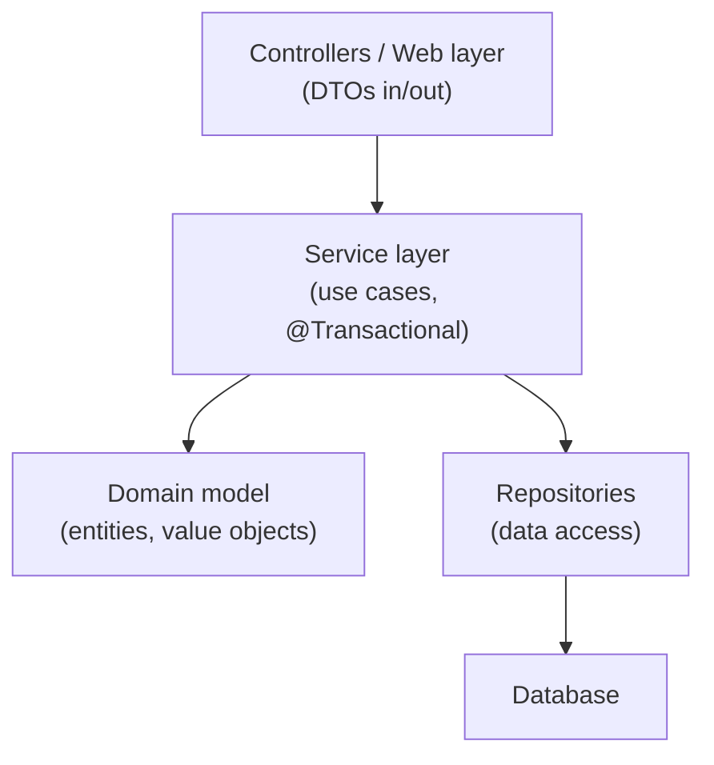

# Enterprise patterns (DTO, Repository, Service layer, Unit of Work)

The GoF catalogue (1994) covers *general-purpose* object-oriented patterns. Building enterprise applications — long-lived business systems with databases, transactions, web layers, distributed clients — requires a different vocabulary, and Martin Fowler's *Patterns of Enterprise Application Architecture* (PoEAA, 2002) supplied it. Repository, Service Layer, Data Transfer Object, Unit of Work, Active Record, Table Module, Domain Model, Transaction Script — the names are everywhere in modern Java backends because Spring, JPA, and the broader Java ecosystem adopted them as defaults. A senior Java engineer must know these patterns by name, understand the trade-offs each makes, and recognize them when they appear in Spring `@Service` classes, JPA repositories, and DTO mappers.

This topic surveys the dominant PoEAA patterns for Java backends, with concrete Spring-flavored examples and explicit discussion of the senior-level decisions (anemic vs rich domain model, transaction script vs domain model, where to put validation, when DTOs are worth it).

> [!NOTE]
> Prerequisites: [SOLID (L3/C03/T01)](./T01-solid-principles.md), [DI/IoC (L3/C03/T07)](./T07-dependency-injection-ioc-concept.md). Builds on backend layering from L2 and JPA from L4.

## The PoEAA Landscape

Fowler organized PoEAA into chapters by concern. The patterns relevant to L4-era Java backends:

- **Domain Logic**: Transaction Script, Domain Model, Table Module, Service Layer.
- **Data Source**: Table Data Gateway, Row Data Gateway, Active Record, Data Mapper.
- **Object-Relational Behavior**: Unit of Work, Identity Map, Lazy Load.
- **Object-Relational Structure**: Foreign Key Mapping, Embedded Value, Inheritance Mapping.
- **Distribution**: Data Transfer Object (DTO).
- **Web Presentation**: Model View Controller, Page Controller, Front Controller, Application Controller.
- **Concurrency**: Optimistic Offline Lock, Pessimistic Offline Lock.

Of these, the four headlined here — **DTO, Repository (a refinement of Data Mapper), Service Layer, Unit of Work** — appear in virtually every Java backend.

## Service Layer

### Intent

Define the application's boundary with a layer of services that establishes a set of available operations and coordinates the application's response.

### What It Looks Like

```java
@Service
public class OrderService {
    
    private final OrderRepository orderRepo;
    private final InventoryService inventory;
    private final PaymentClient payment;
    private final ApplicationEventPublisher events;
    
    public OrderService(...) { ... }
    
    @Transactional
    public Order placeOrder(OrderRequest req) {
        // 1. Domain validation
        Cart cart = Cart.from(req);
        if (!cart.isPlaceable()) throw new BadRequestException();
        
        // 2. Reserve inventory
        inventory.reserve(cart);
        
        try {
            // 3. Charge
            ChargeResult charge = payment.charge(cart.total(), req.cardToken());
            
            // 4. Persist
            Order order = Order.create(req.userId(), cart, charge.chargeId());
            orderRepo.save(order);
            
            // 5. Emit
            events.publishEvent(new OrderPlacedEvent(order));
            
            return order;
        } catch (PaymentException e) {
            inventory.release(cart);
            throw e;
        }
    }
}
```

The service is the *use case*. It:
- Orchestrates collaborators.
- Manages the transaction.
- Doesn't render output (that's the controller).
- Doesn't talk SQL (that's the repository).
- Doesn't reason about HTTP (that's the controller).

### Two Schools — Thick vs Thin Service Layer

**Thick service layer (transaction script style)**: services contain most business logic. Domain classes are anemic (data + getters). Common in CRUD apps.

**Thin service layer (domain model style)**: services orchestrate; domain objects contain logic.

```java
// Thick service (transaction script)
public Order placeOrder(OrderRequest req) {
    BigDecimal subtotal = req.items().stream()
        .map(i -> i.price().multiply(BigDecimal.valueOf(i.qty())))
        .reduce(BigDecimal.ZERO, BigDecimal::add);
    BigDecimal tax = subtotal.multiply(new BigDecimal("0.08"));
    BigDecimal total = subtotal.add(tax);
    // ...
}

// Thin service (domain model)
public Order placeOrder(OrderRequest req) {
    Cart cart = Cart.from(req);
    Money total = cart.totalWithTax();
    Order order = Order.create(req.userId(), cart, total);
    return orderRepo.save(order);
}
```

The thin-service-with-rich-domain style is more OO-idiomatic but takes more design effort. In 2026, most teams sit somewhere in between.

### When To Use Service Layer

Always for non-trivial backends. It:
- Defines the API boundary.
- Hosts transactions.
- Coordinates multiple data sources.
- Is where most `@Transactional` annotations live.

### Pitfalls

- **God services**: 50 methods, 5000 lines. Split by use case (`PlaceOrderService`, `CancelOrderService`) or by aggregate.
- **Anemic services**: passing data straight through to repo. Domain is missing.
- **Service-to-service spaghetti**: avoid via careful aggregate boundaries.
- **Controllers calling repositories**: skip the service layer for "simple cases"; layering rot.

## Data Transfer Object (DTO)

### Intent

An object that carries data between processes to reduce the number of method calls.

### What It Looks Like

```java
// API surface (input)
public record OrderRequest(
    String userId,
    List<OrderItemRequest> items,
    String paymentToken,
    String idempotencyKey
) {}

public record OrderItemRequest(String sku, int qty) {}

// API surface (output)
public record OrderResponse(
    String id,
    String userId,
    List<OrderItemResponse> items,
    BigDecimal total,
    String status,
    Instant createdAt
) {}
```

These are *NOT* JPA entities. They're shape-of-the-wire objects, mapped to/from the domain.

### Why DTOs Are Worth It

- **API stability**: domain model can change without breaking clients.
- **Security**: don't accidentally serialize an admin-only field.
- **Documentation**: OpenAPI spec is clear about the wire format.
- **Validation surface**: `@Valid` only on what came from the wire.
- **Versioning**: `OrderResponseV1`, `OrderResponseV2`.

### When You Can Skip DTOs

- Internal microservice with one consumer you control entirely.
- Prototypes / spikes.
- Very simple endpoints with stable domain.

Even then, often a few weeks later you wish you'd added them.

### Mapping — The Cost

```java
// Manual
public static OrderResponse from(Order order) {
    return new OrderResponse(
        order.getId().toString(),
        order.getUserId(),
        order.getItems().stream().map(OrderItemResponse::from).toList(),
        order.getTotal(),
        order.getStatus().name(),
        order.getCreatedAt()
    );
}
```

Tools to reduce mapping boilerplate:
- **MapStruct** (annotation processor, compile-time): generates safe mappers.
- **ModelMapper** (reflection-based): less safe but ergonomic.
- **Lombok `@Builder` + records**: keeps it terse.
- Manual: best for non-trivial mappings.

### Pitfalls

- **JPA entities as DTOs**: works until you accidentally trigger lazy loads in JSON serialization.
- **`@JsonIgnore` everywhere**: smell — you've exposed too much.
- **DTO with logic**: it's not a DTO anymore.
- **Bi-directional sync issues**: nested mapping libraries can blow up.

### DTO vs Value Object

VOs are domain concepts (`Money`, `Address`). DTOs are wire shapes. The two often overlap accidentally but conceptually differ.

## Repository

### Intent

Mediates between the domain and data mapping layers using a collection-like interface for accessing domain objects.

### What It Looks Like (Spring Data)

```java
public interface OrderRepository extends JpaRepository<Order, UUID> {
    List<Order> findByUserIdAndStatus(String userId, OrderStatus status);
    
    @Query("SELECT o FROM Order o LEFT JOIN FETCH o.items WHERE o.id = :id")
    Optional<Order> findByIdWithItems(@Param("id") UUID id);
    
    @Modifying
    @Query("UPDATE Order o SET o.status = :status WHERE o.id = :id")
    int updateStatus(@Param("id") UUID id, @Param("status") OrderStatus s);
}
```

Spring Data:
- Derives queries from method names.
- Provides CRUD via base interface.
- Allows custom queries (`@Query`).
- Returns domain objects (`Order`), not rows.

### Repository vs Data Access Object (DAO)

The names get used interchangeably, but PoEAA distinguishes:

- **DAO**: data access primitives (SQL CRUD).
- **Repository**: collection-like, domain-aware. *"Find me orders matching X"* rather than *"SELECT ..."*.

In modern Spring, the "Repository" pattern is the dominant abstraction — and JpaRepository sits between the two ideas (CRUD + domain-aware queries).

### Per-Aggregate Repository

Domain-Driven Design (Evans, 2003) says: one repository per aggregate root. `OrderRepository` returns whole orders with their items. You don't have a separate `OrderItemRepository`.

In practice: most teams have per-entity repositories. Either works; aggregate-aware is cleaner for complex domains.

### When Not To Use Spring Data Repositories

- Read-heavy projections benefit from straight JDBC/jOOQ.
- Complex queries with many parameters where `@Query` becomes unmaintainable.
- Multi-DB transactions.
- Reactive (use `R2dbcRepository` or hand-rolled).

### Pitfalls

- **Repository in controller**: skips service layer.
- **Repository as god class**: 50 query methods.
- **Custom `@Query` with string concatenation**: SQL injection risk.
- **Returning entities to controllers**: lazy-load explosions during serialization.

## Unit of Work

### Intent

Maintains a list of objects affected by a business transaction and coordinates writing out changes and resolving concurrency problems.

### What It Looks Like — JPA `EntityManager`

JPA implements Unit of Work transparently:

```java
@Transactional
public void promoteOrders(List<UUID> ids) {
    for (UUID id : ids) {
        Order o = repo.findById(id).orElseThrow();
        o.setStatus(PROMOTED);
        // NO repo.save() needed — Hibernate tracks the dirty entity
    }
    // At @Transactional boundary: Hibernate flushes ALL changes in ONE batch.
}
```

The `EntityManager` is the Unit of Work:
- Tracks dirty entities.
- Batches inserts/updates/deletes.
- Flushes on transaction commit (or on demand).
- Resolves optimistic locking conflicts.

### Why It Matters

Without Unit of Work, you'd write:
```java
for (UUID id : ids) {
    Order o = repo.findById(id);
    o.setStatus(PROMOTED);
    repo.update(o);  // separate INSERT/UPDATE per call
}
```

100 round-trips to the database instead of 1 batched flush.

### Pitfalls

- **`open-in-view`**: Spring's default keeps the Unit of Work open during request rendering — lazy loads in the view trigger queries. Disable.
- **Detached entities**: pass an entity outside the transaction, modify, pass back — Hibernate doesn't track. Use `merge()`.
- **N+1 inside the Unit of Work**: dirty tracking is per entity; lazy loads still happen unless explicitly fetched.
- **Long-lived Unit of Work**: memory bloat. Keep transactions short.

## The Other Important PoEAA Patterns

### Domain Model

The complement to Transaction Script. Domain classes own behavior.

```java
public class Order {
    public Receipt complete() {
        if (status != PENDING) throw new IllegalState();
        this.status = COMPLETE;
        return new Receipt(this);
    }
}
```

vs anemic:
```java
class Order { /* fields + getters/setters only */ }

class OrderService {
    public Receipt complete(Order o) {
        if (o.getStatus() != PENDING) throw new IllegalState();
        o.setStatus(COMPLETE);
        return new Receipt(o);
    }
}
```

Fowler famously called the anemic version an "anti-pattern" — your domain isn't *doing* anything; it's just data. But anemic domain is *also* a sensible style for many CRUD apps. Senior engineers know both and pick by context.

### Transaction Script

A procedure that handles one request. Each script lives in a service method.

Trade-off vs Domain Model:
- Transaction Script: simpler, fewer abstractions, breaks down at complex business rules.
- Domain Model: harder to start, scales better as rules accumulate.

CRUD apps → Transaction Script is fine. Real business domain → Domain Model wins.

### Active Record vs Data Mapper

- **Active Record** (Ruby on Rails, Java's pre-JPA `Persistable`): domain object knows how to save itself (`order.save()`).
- **Data Mapper** (JPA, Hibernate): a separate mapper handles persistence (`em.persist(order)`).

Java's tradition is Data Mapper. Active Record is rare in idiomatic Spring.

### Identity Map

"Within one session, there is at most one in-memory instance per database row." JPA's persistence context provides this — `em.find(Order.class, id)` called twice returns the same Java instance.

Prevents: stale-data confusion, conflicting updates within a session.

### Lazy Load

"Defer loading an object until it's needed."

Pitfalls covered extensively in [L4/C02 JPA & Hibernate](../../L4-backend-engineering/C02-persistence-jpa-hibernate/README.md).

### Optimistic Offline Lock

Use `@Version` to detect concurrent updates. Fail on second writer.

### Pessimistic Offline Lock

`SELECT FOR UPDATE`. Lock the row in DB. Blocks readers/writers.

## Layered Architecture — The Big Picture



Each layer:
- Web: HTTP/JSON; DTOs in, DTOs out.
- Service: business operations; transactional; orchestrates.
- Domain: state + behavior; pure (no Spring, no JPA awareness ideally).
- Repository: data mapping.

Variant: **hexagonal architecture** (Cockburn, 2005) — invert the dependency direction so the domain doesn't depend on the framework. More elaborate; pays off for long-lived projects.

## The Anemic Domain Debate

Eric Evans' DDD (Domain-Driven Design, 2003) emphasizes rich domain. Fowler called anemic domain an anti-pattern. Yet most Spring Boot apps in 2026 are 60% anemic.

Why anemic persists:
- JPA encourages it (entities map to rows).
- Spring services are natural hosts for logic.
- Many backends are CRUD with light business rules.
- Anemic is fast to write.

When rich domain matters:
- Business logic is the core differentiator.
- Many rules, many interactions.
- Long product lifespan.

The senior approach: start anemic, refactor to rich when domain logic warrants the abstraction. Don't pre-emptively over-engineer.

## Putting It Together — A Use Case

```java
// Controller (web layer)
@RestController
@RequestMapping("/api/orders")
class OrderController {
    private final OrderService svc;
    OrderController(OrderService svc) { this.svc = svc; }
    
    @PostMapping
    public ResponseEntity<OrderResponse> place(@Valid @RequestBody OrderRequest req) {
        Order o = svc.placeOrder(req);                            // Service layer
        return ResponseEntity.created(uri(o)).body(OrderResponse.from(o));  // DTO out
    }
}

// Service layer
@Service
class OrderService {
    private final OrderRepository repo;                            // Repository
    private final InventoryService inv;
    
    OrderService(OrderRepository repo, InventoryService inv) { ... }
    
    @Transactional                                                 // Unit of Work boundary
    public Order placeOrder(OrderRequest req) {
        Cart cart = Cart.from(req);                                // Domain
        if (!cart.isPlaceable()) throw new BadRequestException();
        inv.reserve(cart);
        Order order = Order.create(req.userId(), cart);            // Domain method
        return repo.save(order);                                   // Repository
    }
}

// Repository
public interface OrderRepository extends JpaRepository<Order, UUID> {
    List<Order> findByUserId(String userId);
}

// Domain
@Entity
class Order {
    @Id @GeneratedValue private UUID id;
    private String userId;
    @Enumerated(STRING) private OrderStatus status;
    
    static Order create(String userId, Cart cart) {
        // Domain creation logic
    }
}
```

Every PoEAA pattern represented. Each layer with one clear job.

## Anti-Patterns

> [!WARNING]
> **Skipping the service layer.** Controller calls repo directly; logic scattered.

> [!WARNING]
> **JPA entities as DTOs.** Lazy load explosion during JSON serialization.

> [!WARNING]
> **God service.** One class doing 30 use cases.

> [!WARNING]
> **Manual SQL in services.** Repository is the boundary.

> [!WARNING]
> **`@Transactional` on controllers.** Wrong layer.

> [!WARNING]
> **`save()` calls everywhere inside Unit of Work.** Hibernate already tracks dirty entities.

> [!WARNING]
> **Repositories returning JOIN result maps.** Untyped, fragile.

> [!WARNING]
> **DTOs with logic.** They drift from "data transfer".

> [!WARNING]
> **Anemic domain when rich would help.** Logic scattered across many services.

> [!WARNING]
> **Rich domain when anemic would suffice.** Over-engineered.

## Common Misconceptions

> [!WARNING]
> **"Repository pattern = DAO pattern."** Repository is collection-like, domain-aware.

> [!WARNING]
> **"Service layer is mandatory."** Tiny apps don't need one.

> [!WARNING]
> **"DTOs are bureaucracy."** Sometimes; pay off in real teams.

> [!WARNING]
> **"Unit of Work is JPA-specific."** Pattern exists in other ORMs and even manual JDBC.

> [!WARNING]
> **"Rich domain requires DDD."** It's a continuum.

## Practice

1. **Refactor controller-calls-repo**: insert a service layer.
2. **Add DTOs**: introduce DTOs for one endpoint; verify decoupling.
3. **MapStruct**: try MapStruct for mapping.
4. **Unit of Work behavior**: write a service that modifies 10 entities; observe single flush.
5. **Anemic → rich**: move one piece of logic from service to domain.
6. **Repository custom query**: add a `@Query` and a derived query; compare.
7. **Aggregate root repository**: design `OrderRepository` so order + items are one aggregate.
8. **N+1 reveal**: write a "find all orders" returning entities; serialize as JSON; observe queries.
9. **Layered architecture diagram**: sketch your current project's layers; identify violations.

## Recap

You should now be able to:

- Use Service Layer correctly: @Transactional, orchestration only.
- Decide when DTOs are worth the cost.
- Implement Spring Data Repositories effectively.
- Recognize Unit of Work as it operates in JPA.
- Distinguish rich vs anemic domain models.
- Navigate Fowler's PoEAA vocabulary with confidence.

## Next

Continue to [Functional-style patterns in modern Java](./T09-functional-style-patterns-in-modern-java.md) — how modern Java idioms (records, sealed types, switch expressions, lambdas) reshape the pattern catalogue.
