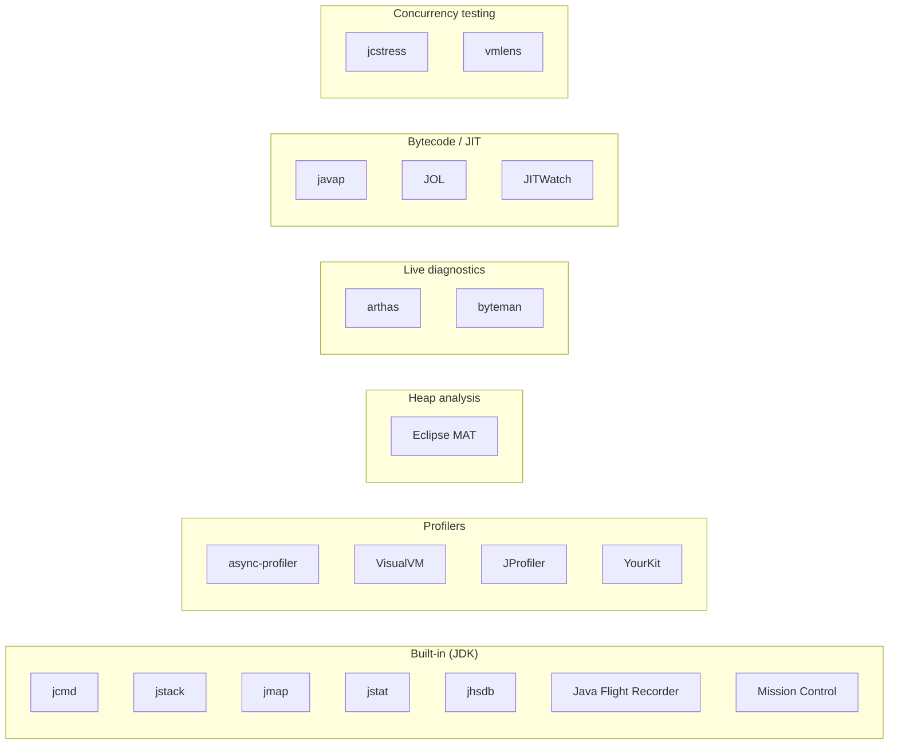

# Tools for Advanced Java & the JVM

The L3 engineer's toolkit is dominated by *JVM diagnostics* — profilers, heap analyzers, GC tools, concurrency testers, bytecode inspectors. Where L2 (Intermediate Backend) tools live in editors and HTTP clients, L3 tools live in JFR recordings, flame graphs, heap dumps, and bytecode disassembly. The shift reflects what L3 work is about: understanding why the JVM behaves as it does, where time is being spent at the microsecond level, what the GC is doing, where the JIT is and isn't optimizing, how concurrency primitives interact with the memory model. The tools here are the senior engineer's instruments for those questions.

This topic catalogues the canonical JVM-side tools, the diagnostic workflows they enable, and the senior judgment about which tool to reach for first when production says "the service is slow". It complements L4/C11 (which covers Spring/cloud tooling) by focusing on the JVM internals layer.

> [!NOTE]
> Prerequisites: Java fundamentals from L0/L1/L2. Useful concurrently with C01 (Concurrency) and C02 (JVM Internals).

## The L3 Toolchain Map



## Built-In JDK Tools

These ship with every OpenJDK. Learn first.

### `jcmd` — Universal Swiss Army Knife

`jcmd` covers most needs:

```bash
# List JVMs
jcmd

# Per-PID commands
jcmd <pid> help

# Common ones
jcmd <pid> VM.version
jcmd <pid> VM.system_properties
jcmd <pid> VM.command_line
jcmd <pid> VM.flags                       # all VM flags
jcmd <pid> Thread.print                   # thread dump (replacement for jstack)
jcmd <pid> GC.heap_info
jcmd <pid> GC.class_histogram             # objects by class with counts/sizes
jcmd <pid> GC.heap_dump /tmp/heap.hprof   # heap dump
jcmd <pid> GC.run                         # force GC (testing only)
jcmd <pid> JFR.start duration=60s filename=/tmp/rec.jfr
jcmd <pid> JFR.stop name=1 filename=/tmp/rec.jfr
jcmd <pid> JFR.check
```

The senior idiom: `jcmd` is your first stop on a live JVM. Knowing the subcommands is high-value.

### `jstack` — Thread Dumps

```bash
jstack -l <pid>                # with locks
jstack <pid> > thread.dump      # save
```

Reading thread dumps: look for many threads blocked on the same monitor (contention), many threads in WAITING (idle pool), many threads in BLOCKED with the same lock owner (deadlock candidate).

### `jmap` — Heap Maps

Largely superseded by `jcmd`:
```bash
jmap -dump:format=b,file=heap.hprof <pid>
jmap -histo <pid>                   # object histogram
jmap -heap <pid>                    # heap summary (deprecated)
```

Prefer `jcmd <pid> GC.heap_dump`.

### `jstat` — GC Stats Over Time

```bash
jstat -gc <pid> 1000                # every 1s
jstat -gcutil <pid> 5000 10         # 10 samples, 5s apart
jstat -gccause <pid>                # show cause of last GC
```

For ad-hoc GC observation. For longer-term, JFR.

### `jhsdb` — HotSpot Serviceability Debugger

For deep dives:
```bash
jhsdb clhsdb --pid <pid>            # interactive
jhsdb hsdb                           # GUI
```

Rarely needed; great for OOM forensics on a core dump.

### `jdeps` — Dependency Analysis

```bash
jdeps -summary myapp.jar
jdeps -jdkinternals myapp.jar       # find usages of internal APIs
jdeps --list-deps myapp.jar         # for modules
```

Useful when modularizing or upgrading JDKs.

### `javap` — Bytecode Disassembler

```bash
javap -c -p MyClass.class           # bytecode
javap -v MyClass.class              # verbose (constant pool, attrs)
```

For understanding what the compiler emitted; useful when reasoning about JMM, lambdas, or method handles.

## Java Flight Recorder (JFR) + Mission Control (JMC)

**JFR** is HotSpot's always-on, low-overhead event recorder. Built into OpenJDK (free since JDK 11).

Start a recording:
```bash
# From command line
java -XX:StartFlightRecording=duration=60s,filename=rec.jfr -jar app.jar

# From jcmd at runtime
jcmd <pid> JFR.start duration=60s filename=rec.jfr

# Continuous recording (production)
jcmd <pid> JFR.start name=continuous maxsize=200m maxage=12h
```

Open `.jfr` with **JMC** (JDK Mission Control) — separate download from Oracle/AdoptOpenJDK.

JMC shows:
- CPU usage attributed to methods (sampling).
- GC events and pause times.
- Allocations.
- I/O.
- Thread states.
- Lock contention.
- Custom events you've defined.

In 2026: JFR + JMC is the *default* low-overhead production profiler. Always-on capable.

## async-profiler

Andrei Pangin's async-profiler is the senior's secret weapon for CPU profiling. Lower overhead than JFR for sampling, includes native frames.

```bash
# CPU profile, output flame graph
./profiler.sh -e cpu -d 30 -f cpu.html <pid>

# Memory allocation
./profiler.sh -e alloc -d 30 -f alloc.html <pid>

# Lock contention
./profiler.sh -e lock -d 30 -f lock.html <pid>

# Wall-clock (sees blocked threads)
./profiler.sh -e wall -d 30 -f wall.html <pid>

# Cache misses
./profiler.sh -e cache-misses -d 30 -f cache.html <pid>
```

Flame graphs: wider bar = more time. Stack on Y axis. Find the widest bars under your code.

Spring Boot integration: `spring-boot-starter-actuator` + `async-profiler` Maven dependency exposes `/actuator/profiler` endpoint.

## VisualVM

Free GUI profiler bundled until JDK 8; now separate download.

- Live JVM browser.
- Sampling profiler (CPU + memory).
- Thread monitor.
- Heap dump capture & view.
- JMX MBean browser.

Good for: ad-hoc local profiling, teaching, mid-grade diagnostics. Less powerful than commercial tools.

## Commercial Profilers — JProfiler, YourKit

Both excellent; ~$400 individual licenses.

- **JProfiler**: rich UI, excellent CPU/memory views, integrates with build tools.
- **YourKit**: similar; some users prefer the UI.

When to invest: regular JVM perf work. Otherwise async-profiler + JFR cover 90%.

## Eclipse MAT (Memory Analyzer Tool)

Free, the best heap-dump analyzer.

Workflow:
1. Get a `.hprof` file (`jcmd GC.heap_dump`).
2. Open in MAT.
3. Run "Leak Suspects" report.
4. Browse "Dominator Tree" — which object holds the most retained memory.
5. Follow GC roots.

Find: caches without TTL, threadlocals leaking, listener lists growing forever.

Critical for OOM forensics. Some heap dumps are gigabytes; MAT handles them.

## Live Diagnostics — Arthas

**Arthas** (Alibaba, open source) attaches to a running JVM and lets you inspect/modify without restart.

```bash
java -jar arthas-boot.jar

[arthas@1234]$ dashboard                  # live overview
[arthas@1234]$ thread                     # threads
[arthas@1234]$ thread <id>                # specific thread
[arthas@1234]$ jvm                        # JVM info
[arthas@1234]$ trace com.example.OrderService place              # trace method
[arthas@1234]$ watch com.example.OrderService place '{params, returnObj}'
[arthas@1234]$ stack com.example.OrderService place             # call stack
[arthas@1234]$ tt -t com.example.OrderService place             # time tunnel (capture invocations)
[arthas@1234]$ profiler start
[arthas@1234]$ profiler stop
```

Production-safe (carefully). Saves "restart with debug logging" cycles.

## Byteman

Inject bytecode at runtime for debugging or testing.

```text
RULE simulate slow DB
CLASS com.example.OrderRepository
METHOD findById
AT ENTRY
IF true
DO Thread.sleep(2000)
ENDRULE
```

Inject into running JVM. Test how the system behaves with a slow DB without changing code.

Great for chaos testing, reproducing race conditions, simulating failures.

## Bytecode / Memory Layout — JOL

**JOL (Java Object Layout)** by Aleksey Shipilev: prints exact in-memory layout of any object.

```java
System.out.println(ClassLayout.parseInstance(new Order()).toPrintable());
```

Output:
```
com.example.Order object internals:
 OFFSET  SIZE   TYPE DESCRIPTION
      0     4        (object header: mark)
      4     4        (object header: class)
      8     4 String id
     12     4 String userId
     16     8   long amount
     ...
```

Essential when reasoning about cache lines, false sharing, compressed oops.

## JIT Diagnostics — JITWatch

JIT compilation is hard to reason about. **JITWatch** parses JIT logs (`-XX:+PrintCompilation -XX:+UnlockDiagnosticVMOptions -XX:+TraceClassLoading -XX:+LogCompilation`) into a navigable view.

- Which methods got compiled?
- C1 or C2?
- Inlined or not?
- Bailouts?

For perf-critical hot loops where you suspect the JIT isn't doing what you expect.

## Concurrency Testing — jcstress

**Java Concurrency Stress Tests** (jcstress) — JDK project for testing concurrent code under stress.

Define an *outcome* test:
```java
@JCStressTest
@Outcome(id = "1, 1", expect = ACCEPTABLE, desc = "both reads observe write")
@Outcome(id = "1, 0", expect = ACCEPTABLE_INTERESTING, desc = "reordering observed")
@State
public class MyTest {
    int x, y;
    
    @Actor public void writer() { x = 1; y = 1; }
    @Actor public void reader(IntResult2 r) { r.r1 = y; r.r2 = x; }
}
```

Run millions of times under different schedulers, on different architectures. Find JMM bugs you'd never catch in regular tests.

For library authors and lock-free code.

## Build Tool Integrations

### Maven Plugin for JFR

```xml
<plugin>
  <groupId>org.apache.maven.plugins</groupId>
  <artifactId>maven-surefire-plugin</artifactId>
  <configuration>
    <argLine>-XX:StartFlightRecording=duration=60s,filename=test.jfr</argLine>
  </configuration>
</plugin>
```

### JMH (Java Microbenchmark Harness)

For correct microbenchmarks. Discussed extensively in [L3/C02 JVM topics](../../L3-advanced-jvm/C02-jvm-internals-and-performance/README.md).

```java
@Benchmark
@BenchmarkMode(Mode.AverageTime)
@OutputTimeUnit(TimeUnit.NANOSECONDS)
public int hash(MyState state) {
    return state.input.hashCode();
}
```

Run:
```bash
mvn package
java -jar target/benchmarks.jar -prof gc
```

JMH handles JIT warmup, dead code elimination guards, statistical analysis. Hand-rolled benchmarks lie; JMH is honest.

## IntelliJ IDEA Integration

IntelliJ Ultimate has built-in JVM tools:
- **Run with Profiler** (async-profiler integration): right-click → Profile.
- **Thread dump capture**.
- **Heap dump capture**.
- **JFR recording**.
- **Memory view in debugger**.

Often enough for daily work without external tools.

## Real-World Diagnostic Workflows

### High CPU

1. `top` → confirm CPU.
2. `top -H -p <pid>` → find busy threads (TID).
3. `printf "%x\n" <tid>` → hex (matches thread dump).
4. `jcmd <pid> Thread.print` or `jstack <pid>` → find the thread by TID.
5. async-profiler 30s CPU profile → flame graph → optimize.

### High Memory / OOM

1. Confirm: `jstat -gc <pid> 1000` shows old gen filling.
2. `jcmd <pid> GC.heap_dump /tmp/heap.hprof`.
3. Eclipse MAT → Leak Suspects → identify culprit.
4. Refactor.

For chronic leaks: `-XX:+HeapDumpOnOutOfMemoryError` so the next OOM produces a dump automatically.

### Long Pauses

1. JFR recording 5+ minutes.
2. JMC → GC tab → see pause durations.
3. Identify cause (large allocation, fragmentation, humongous objects in G1).
4. Tune GC or refactor allocations.

### Apparent Deadlock

1. `jcmd <pid> Thread.print`.
2. Look for "Found Java-level deadlock" — JVM detects most.
3. Trace lock chain: thread A holds X, waits Y; thread B holds Y, waits X.
4. Fix lock ordering or remove the lock.

### Slow Method

1. async-profiler wall-clock profile (sees blocked time).
2. Or: add JMH micro-benchmark.
3. Or: Arthas `trace` to see actual method timings live.

## Container-Aware Profiling

In K8s:
- JFR works inside containers.
- async-profiler needs CAP_SYS_PTRACE; some K8s deny.
- Eclipse MAT: extract `.hprof` from pod, analyze locally.

```bash
kubectl cp pod:/tmp/heap.hprof ./heap.hprof
```

## Senior Diagnostic Etiquette

1. **Reproduce locally first if possible.** Production diagnostics are riskier.
2. **Always-on JFR**: 200MB rolling buffer at < 1% overhead. When prod misbehaves, you have history.
3. **Heap dumps on OOM**: `-XX:+HeapDumpOnOutOfMemoryError` everywhere.
4. **Save raw artifacts**: thread dumps, heap dumps, JFR files — for later analysis and post-mortems.
5. **Document what you did**: ADRs for non-trivial diagnoses.

## What To Learn First

| Stage | Tool | Why |
|-------|------|-----|
| 1 | `jcmd` | First stop for any live JVM |
| 2 | thread dump reading | Most diagnostic paths start here |
| 3 | JFR + JMC | Always-on profiling |
| 4 | async-profiler + flame graphs | CPU diagnostics |
| 5 | Eclipse MAT | Memory diagnostics |
| 6 | JMH | Honest benchmarks |
| 7 | Arthas | Live diagnostics for production |
| 8 | JOL | Memory layout reasoning |
| 9 | jcstress | Concurrency correctness |
| 10 | JITWatch | JIT understanding (rare need) |

## Anti-Patterns

> [!WARNING]
> **Production thread dumps in a loop.** Pause every thread = slow. Snapshot once.

> [!WARNING]
> **Heap dumps under load.** Pauses JVM (`jcmd GC.heap_dump` is roughly a full GC).

> [!WARNING]
> **Profiler in production without testing locally.** Wrong settings can crash JVM.

> [!WARNING]
> **Hand-rolled benchmarks.** Use JMH.

> [!WARNING]
> **No always-on JFR.** When prod misbehaves, no historical data.

> [!WARNING]
> **Ignoring JIT logs when perf surprises.** Methods you thought were inlined might not be.

> [!WARNING]
> **Tool collection without proficiency.** Five tools mastered > twenty installed.

## Common Misconceptions

> [!WARNING]
> **"JFR has high overhead."** Default profile is < 1%.

> [!WARNING]
> **"async-profiler replaces JFR."** Different strengths; use both.

> [!WARNING]
> **"VisualVM is enough."** For simple cases yes; senior diagnostics needs more.

> [!WARNING]
> **"Heap dumps are too big to analyze."** MAT handles tens of GB.

> [!WARNING]
> **"You can attach Arthas to anything."** Some security configurations block.

## Practice

1. **`jcmd` drill**: connect to a Spring Boot app; run 10 different subcommands.
2. **Thread dump reading**: trigger contention; capture; read.
3. **JFR start-to-finish**: start recording; trigger workload; open in JMC.
4. **async-profiler flame graph**: profile a Spring Boot endpoint under load.
5. **Heap dump**: capture; open in MAT; find a leak suspect.
6. **Arthas live**: `watch` a method's arguments live.
7. **JMH benchmark**: write a microbenchmark; compare two `String` manipulations.
8. **JOL layout**: print layout of a `record`; understand padding.
9. **jcstress test**: write one for a simple race; observe outcomes.
10. **Container diagnostics**: do all the above inside a K8s pod.

## Recap

You should now be able to:

- Reach for the right tool first on a JVM problem.
- Use `jcmd` for live JVM inspection.
- Read thread dumps for contention/deadlock.
- Run JFR for always-on profiling.
- Use async-profiler + flame graphs for CPU.
- Analyze heap dumps in Eclipse MAT.
- Use Arthas for live diagnostics.
- Benchmark honestly with JMH.
- Understand object layout with JOL.

## Next

The next chapter is [C05 Hands-On](../C05-hands-on/README.md) — exercises and a level project that exercise the JVM tools introduced here.
