# Spring Core: IoC Container & Beans

The **Spring IoC (Inversion-of-Control) container** is a Java object whose only job is to **own the lifetime and wiring of other Java objects** — the "beans" that make up your application. You hand it a recipe ("here's how to build a `UserService`, and it needs a `UserRepository` and a `Clock`"), it figures out the order, allocates the objects on the heap, satisfies their dependencies, calls their initialization callbacks, parks them in an internal `Map`, and hands them back when something asks. The "Spring framework" is *built on top of this one container*: Spring MVC, Spring Data, Spring Security, Spring Boot — every one of them is just a body of code that registers more beans into the same container and adds infrastructure beans that know how to do auto-configuration, request handling, transactions, security filters, and so on. **If you understand the container, the rest of Spring is just "what beans live inside it and what they do."**

The depth-bar this topic clears: at the **language layer**, the precise meaning of "IoC", "bean", "container", `BeanFactory` vs `ApplicationContext`, the `@Component`/`@Bean`/`@Configuration` declarations and where they get translated into the container's internal representation. At the **memory layer**, the bytes the container takes — the `DefaultListableBeanFactory` is a graph of `HashMap`s (`beanDefinitionMap`, `singletonObjects`, `earlySingletonObjects`, `singletonFactories`, `aliasMap`, `dependenciesForBeanMap`, …) each holding tens to hundreds of MB of references in a real Spring Boot app — and the byte-by-byte cost of each `BeanDefinition` (~200–400 B), each `RootBeanDefinition` (~600 B with merged metadata cached), each proxy wrapper (~96–192 B), each singleton entry. At the **architecture layer** — the heart — **how the container actually bootstraps**: classpath scanning via ASM (bytecode-level metadata without loading the class), bean definition registration, post-processing, the singleton creation loop, the three-level cache that resolves circular references, the reflection / CGLIB call that finally invokes a constructor, and how Spring Boot turns one annotation (`@SpringBootApplication`) into ~300 auto-configured beans in 1–3 seconds on cold start.

> [!NOTE]
> Prerequisites: solid Java OOP (constructors, interfaces, generics — L1), reflection & annotations (L2/C01), classloaders and bytecode (L3/C02), threads and the heap memory model (L3/C01/C02), basic Maven/Gradle (L2/C02). If a term in the intro felt mysterious, skim those before continuing.

## Why "Inversion of Control" — The Problem Spring Solves

Before Spring, a Java service that needed three collaborators wrote them by hand:

```java
// pre-Spring "manual wiring" — works but couples the service to concrete classes
public class OrderService {
    private final UserRepository users   = new JdbcUserRepository(DataSourceHolder.DS);
    private final InventoryClient stock  = new HttpInventoryClient("http://inv:8080");
    private final PaymentGateway  payments = new StripeGateway(System.getenv("STRIPE_KEY"));
    // ...
}
```

This works for one service. For 200 services across 40 packages, with 7 environments (local, dev, QA, staging, prod-EU, prod-US, sandbox), it does not. Five problems compound:

1. **Coupling.** `OrderService` *names* `JdbcUserRepository`. Swapping to `MongoUserRepository` for a test, or `CachingUserRepository` in prod, means recompiling `OrderService`.
2. **Construction order.** `JdbcUserRepository` needs `DataSource`; `DataSource` needs config; config needs the environment. Somebody has to compute the right *topological order* — and re-compute it on every change.
3. **Lifecycle.** Some objects are singletons; some are per-request; some need an `init` callback after construction; some need to be `close()`d on shutdown. Doing all of that by hand in a `main` method is tedious and error-prone.
4. **Configuration.** The Stripe key, the Inventory URL, the database URL — none of those belong in source. They live in `application.yml`, `--args`, environment variables, Kubernetes ConfigMaps. The wiring code becomes a parser for all of these.
5. **Testing.** Want `OrderService` with a *fake* `PaymentGateway`? You can pass one to the constructor *if* you wrote the field as `final PaymentGateway payments` and accept it as a parameter. With the `new StripeGateway(...)` inline, you cannot.

**Inversion of control** is the design move that fixes all five: *the service no longer chooses or constructs its collaborators*. Instead, it **declares what it needs** (in its constructor parameters), and a separate **container** chooses concrete implementations, constructs them in the right order, holds them for the right lifetime, and hands them in. Martin Fowler named the broader pattern in his 2004 article ["Inversion of Control Containers and the Dependency Injection pattern"](https://martinfowler.com/articles/injection.html); Spring (Rod Johnson, 2003) was the canonical Java implementation.

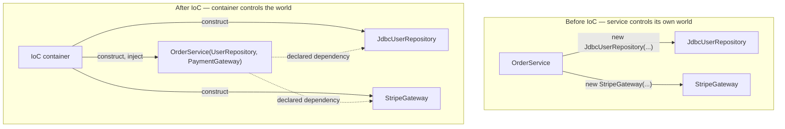

The phrase "**inversion of control**" describes the directional change: before, `OrderService` *calls* `new`; after, the framework *calls* `OrderService`'s constructor. The control flow has been **inverted** — your code reacts to the framework instead of driving it. **Dependency injection** is the specific *mechanism* that makes IoC work: the container *injects* the dependencies through constructor parameters (or setters, or fields). DI is one technique for achieving IoC. (Service locator and lookup-by-key registries are other IoC techniques Spring discourages because they hide the dependency graph.)

> [!IMPORTANT]
> **IoC** is the *principle* — "your code does not pick its collaborators." **DI** is the *technique* — "your code receives them through constructor / setter / field." Spring is an IoC container that uses DI as its primary technique. People use the terms loosely; the precise version is on the table above.

## What Is a "Bean"?

A **Spring bean** is **any object whose lifecycle and identity are managed by the Spring IoC container**. That definition is precise — not "an object with a `@Component` annotation", not "a POJO", but specifically "an object the container *owns*". If you `new MyService()` yourself in a method, that instance is *not* a bean — the container never sees it. If you write `@Component class MyService {}` and Spring scans the classpath, finds the annotation, constructs the instance through reflection and stashes it in its registry, *that* instance is a bean. Same Java class, different instances, only one is a bean.

A bean has four attributes the container tracks:

| Attribute | Meaning | Stored in |
|-----------|---------|-----------|
| **Name** | a unique key by which other beans (and you) refer to it | `beanDefinitionMap` key |
| **Type** | the Java class (or interface) the container uses for type-based wiring | `BeanDefinition.beanClass` |
| **Scope** | `singleton` (one per container, default), `prototype` (new every lookup), `request`/`session` (web), or custom | `BeanDefinition.scope` |
| **Definition** | a recipe (class to instantiate, constructor args, property values, init/destroy methods) | `BeanDefinition` itself |

The distinction between **bean definition** and **bean instance** is the critical mental model:

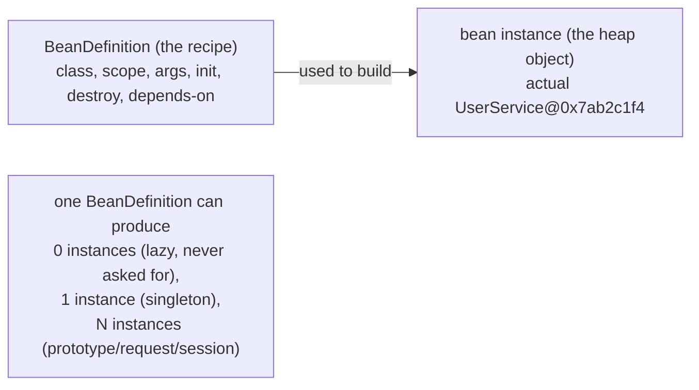

`BeanDefinition` is **metadata**: a `Class<?>`, a list of constructor argument values, a list of property values, a scope, lifecycle hook method names. It lives in the container's `beanDefinitionMap`. The **bean instance** is the actual Java object on the heap that the application code uses. For a singleton (the overwhelmingly common case), the container creates exactly one instance from the definition the first time anybody asks for it, then caches it in `singletonObjects` and hands the same reference out forever.

### What Counts as a Bean — The Three Sources

The container learns about beans from three sources:

1. **Component scan** — `@Component`, `@Service`, `@Repository`, `@Controller`, `@RestController`, and any custom annotation meta-annotated `@Component`. The `@ComponentScan` (often implicit via `@SpringBootApplication`) names a base package; the container scans the classpath (the JARs on `-cp`) for classes inside that package carrying any of those annotations.
2. **`@Bean` methods inside `@Configuration` classes** — explicit factory methods. The container calls the method to produce the bean. Useful when you need to wire something you do not own (a `RestTemplate`, an `ObjectMapper`, a third-party client).
3. **Programmatic registration** — `BeanDefinitionRegistryPostProcessor`, `GenericApplicationContext.registerBean(...)`, `ImportBeanDefinitionRegistrar`. This is what Spring Boot auto-configuration uses internally.

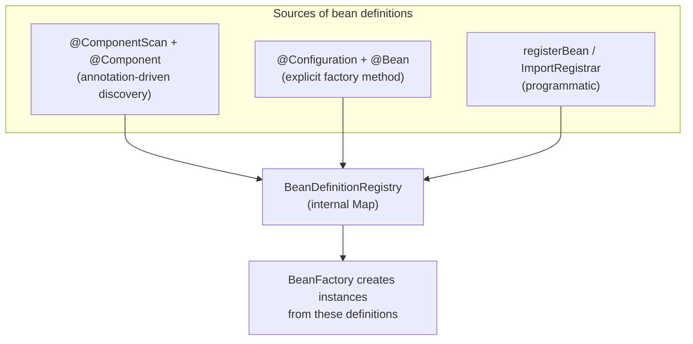

All three end up in the same place — the `beanDefinitionMap` inside the container. The differences are purely *how* the definition got there.

## The Container — `BeanFactory` and `ApplicationContext`

Spring has **two** container interfaces, layered:

- **`BeanFactory`** — the minimal contract. It can look up beans by name (`getBean(String)`) and by type (`getBean(Class<?>)`), check whether one exists (`containsBean`), report a bean's type (`getType`), and not much more. Defined in `org.springframework.beans.factory`. The default implementation is `DefaultListableBeanFactory`.
- **`ApplicationContext`** — `BeanFactory` *plus* everything else: event publishing (`ApplicationEventPublisher`), resource loading (`ResourceLoader`), message source / i18n (`MessageSource`), environment abstraction (`Environment` for profiles and property sources), and the full *application* concept. Defined in `org.springframework.context`. The default implementation in Spring Boot is `AnnotationConfigApplicationContext` (non-web) or `AnnotationConfigServletWebServerApplicationContext` (web).

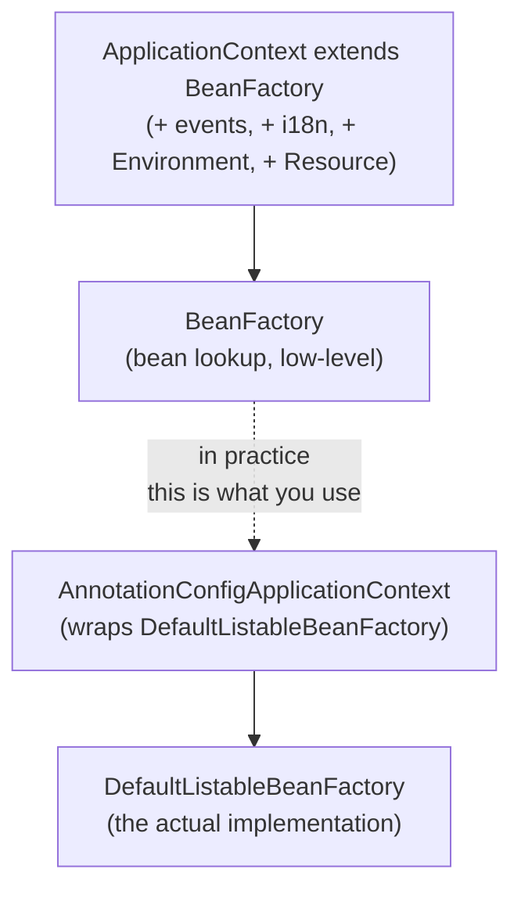

In real Spring applications you **always** work with an `ApplicationContext` — `BeanFactory` is the underlying primitive but you never instantiate it alone. Spring Boot creates the `ApplicationContext` for you inside `SpringApplication.run(...)`. When this topic says "the container", it almost always means the `ApplicationContext` (which delegates bean operations to its internal `DefaultListableBeanFactory`).

### The Container's Internal Memory Layout

The `DefaultListableBeanFactory` is the heart of the container. Its byte-level layout is a tree of `HashMap`s and `LinkedHashMap`s. The fields that matter for understanding "what is a bean and where does it live":

```java
// excerpt — actual fields in DefaultListableBeanFactory (and its superclasses)
private final Map<String, BeanDefinition> beanDefinitionMap = new ConcurrentHashMap<>(256);
private final List<String> beanDefinitionNames = new ArrayList<>(256);
private final Map<String, Object> singletonObjects = new ConcurrentHashMap<>(256);
private final Map<String, Object> earlySingletonObjects = new ConcurrentHashMap<>(16);
private final Map<String, ObjectFactory<?>> singletonFactories = new HashMap<>(16);
private final Set<String> singletonsCurrentlyInCreation = ConcurrentHashMap.newKeySet();
private final Map<String, RootBeanDefinition> mergedBeanDefinitions = new ConcurrentHashMap<>(256);
private final Map<String, String[]> aliasMap = new ConcurrentHashMap<>(16);
private final Map<String, Set<String>> dependentBeanMap = new ConcurrentHashMap<>(64);
private final Map<String, Set<String>> dependenciesForBeanMap = new ConcurrentHashMap<>(64);
private final Map<Class<?>, String[]> allBeanNamesByType = new ConcurrentHashMap<>(64);
```

Each of those maps has a purpose; together they are *the entire container*. Here is the picture:

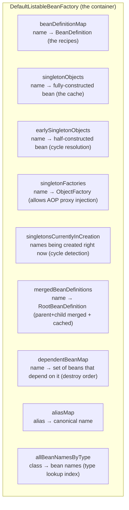

A **bean's "memory cost"** is the sum of:

| Component | Approx bytes | Notes |
|-----------|:-----------:|-------|
| Entry in `beanDefinitionMap` | ~48 | `HashMap.Node` + key reference + value reference |
| The `BeanDefinition` itself | ~200–400 | class, scope, constructor args, property values, qualifiers |
| The `RootBeanDefinition` (merged) | ~600 | adds resolved/cached metadata |
| Entry in `singletonObjects` | ~48 | post-creation cache |
| The bean instance | varies | the actual `MyService@0x…` |
| Entry in `dependentBeanMap` (per dependee) | ~16 each | for shutdown ordering |

For a Spring Boot app with **300 beans** (a small-to-medium service), the container itself eats roughly **300 KB** of metadata before counting any bean *instance* heap. A medium service with 1,500 beans (full Boot + Data JPA + Security + Actuator + Cloud) is ~1.5 MB of metadata — meaningful in a memory-tight container budget (a `-Xmx128m` Lambda). This is one (small) reason Spring Boot startup memory baselines higher than a hand-wired application.

### Why So Many Caches — The Three-Level Singleton Cache

The three maps `singletonObjects`, `earlySingletonObjects`, `singletonFactories` together implement Spring's **circular-dependency resolution**, the algorithm that lets `A → B → A` work even though strict topological-order construction cannot:

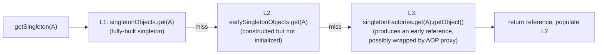

We will trace the actual algorithm step by step in [§ The Bean Lifecycle](#the-bean-lifecycle-from-class-on-disk-to-method-call). For now the picture is: the container needs *three places* to put a bean during its life — "fully done" (L1), "constructed but still being wired" (L2), "not even constructed but a deferred factory exists" (L3) — because mid-creation other beans may need a reference to it.

## Bean Declaration — `@Component`, `@Bean`, `@Configuration`

The three annotations that drive **almost all** bean registration in modern Spring:

### `@Component` (and Its Stereotypes)

`@Component` marks a class as a candidate for component-scan registration. Spring also ships **stereotype** annotations — `@Service`, `@Repository`, `@Controller`, `@RestController`, `@Configuration` — all of which are **meta-annotated** `@Component` and so behave identically to the container. The different stereotypes communicate *intent* to humans (and to a few specialized scanners — `@Repository` triggers JPA exception translation, `@Controller` is recognized by Spring MVC's `RequestMappingHandlerMapping`):

```java
@Component                  // generic
public class Clock { ... }

@Service                    // intent: domain logic
public class OrderService { ... }

@Repository                 // intent: data access; enables PersistenceExceptionTranslator
public class JpaOrderRepository { ... }

@RestController             // intent: HTTP controller; meta-annotated @Controller + @ResponseBody
public class OrderController { ... }
```

The scanner does not care which one you used. **`@Repository` is preferred for data-access classes** specifically because Spring wraps them with a post-processor (`PersistenceExceptionTranslationPostProcessor`) that converts JPA / JDBC checked exceptions into Spring's `DataAccessException` hierarchy — for non-repository classes that wrapping is wasted work.

### `@Bean` Inside `@Configuration`

`@Bean` is a **method-level** annotation: the method's return value *is* the bean, and the method's name is the bean's default name.

```java
@Configuration
public class IntegrationsConfig {

    @Bean
    public RestClient inventoryClient(@Value("${inv.base-url}") String baseUrl) {
        return RestClient.builder().baseUrl(baseUrl).build();
    }

    @Bean
    public Clock clock() {
        return Clock.systemUTC();
    }
}
```

Two beans are registered: `inventoryClient` (type `RestClient`) and `clock` (type `Clock`). The `@Value` parameter on `inventoryClient` is resolved against the `Environment` (next chapter) at the moment the container calls the method.

### Why `@Configuration` Is Special — The CGLIB Proxy

Without `@Configuration` (just `@Component` on the class), calling one `@Bean` method from another **does not** consult the container — it is a plain Java method call, creating a new instance every time:

```java
@Component  // NOT @Configuration
public class BadConfig {
    @Bean public A a() { return new A(b()); }
    @Bean public B b() { return new B(); }
    // calling a() returns an A wired with a fresh B().
    // The B held by the container is a DIFFERENT instance from the one inside that A.
}
```

`@Configuration` solves this by having Spring **subclass the class with CGLIB** (or, more recently, use other proxy strategies) and override every `@Bean` method to consult the container first. With `@Configuration`, calling `b()` from inside `a()` returns the *same* container-managed `B` — the proxy intercepts the call and delegates to the container's `getBean("b")`. This is why `@Configuration` is *not* optional when one bean method calls another:

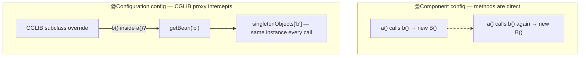

The proxy is allocated once at container startup and shares the singleton `B` across every call site. The cost is one extra subclass, a single CGLIB-generated bytecode artifact in metaspace (~5 KB) per `@Configuration` class, and one indirect call per invocation. For non-trivial configurations this is essentially free.

> [!WARNING]
> Putting `@Bean` methods inside `@Component` (or any non-`@Configuration` class — including Spring Boot's `@SpringBootApplication`, which *is* `@Configuration`) only matters when one `@Bean` method **calls** another. If your `@Bean` methods only return self-contained objects, `@Configuration` and `@Component` are observationally identical. Spring 5.2+ introduced "lite" `@Configuration` (`proxyBeanMethods=false`) for the exact case where no proxy is needed — used heavily by Spring Boot auto-configuration to save startup time and metaspace.

## The Bean Lifecycle — From Class on Disk to Method Call

Now the under-the-hood part. Bootstrapping a Spring container — going from `SpringApplication.run(App.class, args)` to "every bean is built and wired and the HTTP port is open" — is a multi-phase pipeline. The phases:

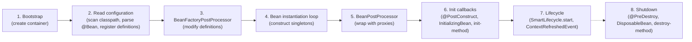

We will walk through each.

### Phase 1: Bootstrap

`SpringApplication.run(App.class, args)`:

1. Creates a `SpringApplication` instance.
2. Decides whether to run as web or non-web (looks at classpath: `spring-web` → servlet, `spring-webflux` → reactive, neither → CLI).
3. Loads `META-INF/spring.factories` (Spring 2.x) or `META-INF/spring/...AutoConfiguration.imports` (Spring 3+) — text files in JARs that list initializers, listeners, and auto-configuration classes.
4. Instantiates a `ConfigurableApplicationContext` of the appropriate type (`AnnotationConfigServletWebServerApplicationContext` for a Boot web app).
5. Calls `prepareContext`, `refreshContext`, `afterRefresh`.

`refresh()` is the big call. Defined in `AbstractApplicationContext`:

```java
// AbstractApplicationContext.refresh() — the canonical container bootstrap
public void refresh() throws BeansException, IllegalStateException {
    synchronized (this.startupShutdownMonitor) {
        prepareRefresh();
        ConfigurableListableBeanFactory beanFactory = obtainFreshBeanFactory();
        prepareBeanFactory(beanFactory);
        try {
            postProcessBeanFactory(beanFactory);
            invokeBeanFactoryPostProcessors(beanFactory);   // ← phase 3 lives here
            registerBeanPostProcessors(beanFactory);
            initMessageSource();
            initApplicationEventMulticaster();
            onRefresh();
            registerListeners();
            finishBeanFactoryInitialization(beanFactory);   // ← phase 4–6 live here
            finishRefresh();
        } catch (BeansException ex) {
            destroyBeans();
            cancelRefresh(ex);
            throw ex;
        } finally {
            resetCommonCaches();
        }
    }
}
```

Every Spring container ever bootstraps through this method. The numbered comments map to the phases.

### Phase 2: Reading Configuration — Classpath Scanning with ASM

Component scan reads `@ComponentScan` to find a base package, then asks the `ResourceLoader` for every `.class` file under that package (looking inside JARs, exploded WAR dirs, the classes/ output of your build). For *each* `.class` file:

- The container **does not** load the class via the classloader. Loading would trigger static initializers, hold a strong reference, and possibly fail for classes whose dependencies are not actually present.
- Instead it reads the **raw bytes** of the class file with **ASM** (`org.objectweb.asm`, repackaged inside `spring-core`), parses the bytecode just far enough to find the annotation attributes on the class, and asks "does this class carry `@Component` (or a meta-annotated derivative)?"
- Only when the answer is yes does the container load the class (via `Class.forName` on the same classloader the application uses) and build a `BeanDefinition` from it.

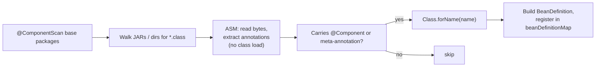

This ASM-first design is the reason Spring's startup is fast even when the classpath holds tens of thousands of classes (a typical Boot app's transitive classpath has ~30,000 classes). The cost of *reading* a class file is dominated by JAR I/O; the cost of *loading* it is much higher (the JVM must verify bytecode, build a `Klass` in metaspace, initialize statics). Spring loads only the classes it will actually use.

`@Bean` methods inside `@Configuration` are similarly registered: the `ConfigurationClassPostProcessor` (a built-in `BeanFactoryPostProcessor`, see next phase) parses the configuration class via ASM, finds each `@Bean` method, and registers a `BeanDefinition` whose factory-method-name is the method name and whose factory-bean-name is the configuration class's bean name.

After this phase, `beanDefinitionMap` holds every recipe; **no bean instance exists yet**.

### Phase 3: `BeanFactoryPostProcessor` — Modifying the Recipes

A `BeanFactoryPostProcessor` is an interface with one method: `postProcessBeanFactory(ConfigurableListableBeanFactory)`. Implementations get a chance to *modify the bean definition map* before any bean is instantiated. The two most important built-in ones:

- **`ConfigurationClassPostProcessor`** — discovers `@Configuration` classes, processes their `@Bean` / `@Import` / `@ComponentScan`, and registers the additional definitions. This is how `@ComponentScan` actually executes, and how Spring Boot auto-configuration registers itself.
- **`PropertySourcesPlaceholderConfigurer`** — replaces `${...}` placeholders in bean definitions (constructor args, property values) with resolved values from `Environment`.

You can write your own to, say, add a bean only when a system property is set. The contract is: by the end of this phase, every bean definition the container will use must exist in `beanDefinitionMap`.

### Phase 4: Bean Instantiation Loop — The Heart

`finishBeanFactoryInitialization` walks `beanDefinitionNames` (the ordered list) and for each non-lazy singleton, calls `getBean(name)`. `getBean` follows a precise algorithm (simplified):

```java
public Object getBean(String name) {
    // step 1: resolve alias to canonical name
    String beanName = canonicalName(name);

    // step 2: try the singleton cache (the three-level cache)
    Object cached = getSingleton(beanName);
    if (cached != null) return cached;

    // step 3: not cached — must create
    RootBeanDefinition mbd = getMergedLocalBeanDefinition(beanName);

    // step 4: create dependencies first (depends-on)
    String[] deps = mbd.getDependsOn();
    if (deps != null) for (String dep : deps) getBean(dep);

    // step 5: create the bean — singleton vs prototype vs scoped
    if (mbd.isSingleton()) {
        Object instance = getSingleton(beanName, () -> createBean(beanName, mbd, args));
        return instance;
    } else if (mbd.isPrototype()) {
        return createBean(beanName, mbd, args);   // no cache; new every call
    } else {
        Scope s = registeredScopes.get(mbd.getScope());
        return s.get(beanName, () -> createBean(beanName, mbd, args));
    }
}
```

And `createBean` itself is where the actual heap allocation happens:

```java
// AbstractAutowireCapableBeanFactory.doCreateBean — sketched
protected Object doCreateBean(String beanName, RootBeanDefinition mbd, Object[] args) {

    // 4a. instantiate — reflection / CGLIB call to the constructor
    BeanWrapper instanceWrapper = createBeanInstance(beanName, mbd, args);
    Object bean = instanceWrapper.getWrappedInstance();
    Class<?> beanType = instanceWrapper.getWrappedClass();

    // 4b. expose an early singleton reference (cycle resolution)
    boolean earlySingletonExposure =
            mbd.isSingleton() && allowCircularReferences && isSingletonCurrentlyInCreation(beanName);
    if (earlySingletonExposure) {
        addSingletonFactory(beanName, () -> getEarlyBeanReference(beanName, mbd, bean));
    }

    // 4c. populate properties (field/setter injection)
    populateBean(beanName, mbd, instanceWrapper);

    // 4d. initialize — @PostConstruct, InitializingBean, init-method, BeanPostProcessor wrap
    Object exposed = initializeBean(beanName, bean, mbd);

    // 4e. register for destruction if needed
    if (mbd.isSingleton() && requiresDestruction(exposed)) {
        registerDisposableBean(beanName, new DisposableBeanAdapter(exposed, beanName, mbd));
    }

    return exposed;
}
```

The five sub-steps (4a–4e) are where the magic is concentrated. Let us unpack each.

**4a. Constructor call — reflection or CGLIB.** The container chooses a constructor (the single `@Autowired` one if marked; the single public one otherwise; the default zero-arg if none; and it picks the *greediest* one matchable when ambiguous), resolves each parameter (look up bean by type or `@Qualifier`), and invokes the constructor through `java.lang.reflect.Constructor.newInstance`. Memory-wise, this is an **ordinary `new`** — the JVM allocates 12 bytes of object header (mark word + compressed klass pointer) plus the instance fields (zeroed) inside the current thread's TLAB (~10 ns for typical objects on Hotspot). Reflection adds about ~100–200 ns of overhead on a cold call (security checks, parameter array boxing) and is then JIT-optimized to near-`new` cost after a few invocations.

If the bean carries class-level `@Scope("prototype")` *and* has a method-level injection point (or is a `@Configuration`), CGLIB generates a subclass at runtime. CGLIB writes raw bytecode (Spring uses an embedded fork of `org.springframework.cglib`), defines the class through `Unsafe.defineClass`, and uses the new class instead of the original. The defined class lives in metaspace (~3–10 KB each) for the container's lifetime.

**4b. Early singleton exposure.** Before populating dependencies, if this bean *might* be involved in a circular reference, the container parks an `ObjectFactory` that can produce a *reference* to the still-uninitialized bean. The factory does not produce a fully-built bean — only the half-built reference (with fields still at their type defaults). This is the **third level** of the singleton cache. If during *its own* dependency injection step 4c, a dependency bean asks for `beanName`, the container will hand out this early reference (an AOP proxy is applied here so the dependency holds the *same* proxy it would have held if there had been no cycle).

**4c. Populate properties.** For each `@Autowired` / `@Resource` / `@Inject` field and setter, the container looks up the dependency bean (recursively calling `getBean` if it does not exist yet), and writes the reference into the field with `Field.set(bean, dependency)` or invokes the setter via reflection. For constructor-injected dependencies, the wiring already happened in 4a. **Field injection costs one reflection call per field per bean creation**, again JIT-optimized; setter injection costs one reflection call per setter.

**4d. Initialize — `@PostConstruct`, `InitializingBean.afterPropertiesSet`, custom init-method, BeanPostProcessor wrapping.** In this exact order:

1. `Aware` interface callbacks: `BeanNameAware.setBeanName`, `BeanClassLoaderAware`, `BeanFactoryAware`, `EnvironmentAware`, `ApplicationContextAware`. Each is called via reflection.
2. **`BeanPostProcessor.postProcessBeforeInitialization`** — every registered BPP gets to wrap the bean. `CommonAnnotationBeanPostProcessor` runs `@PostConstruct` here. `AutowiredAnnotationBeanPostProcessor` validated injection here (it ran field-injection in 4c). Some BPPs **return a different object** (an AOP proxy) — the wrapped reference is what subsequent steps and the container use.
3. `InitializingBean.afterPropertiesSet()` — if the bean implements it.
4. Custom `init-method` if specified in `@Bean(initMethod=...)`.
5. **`BeanPostProcessor.postProcessAfterInitialization`** — wrap again. The most important wrap happens here: `AbstractAutoProxyCreator` applies `@Transactional` / `@Async` / `@Cacheable` / `@Validated` AOP proxies.

A typical real bean goes through 10–30 `BeanPostProcessor` instances; each is a single method call. Aggregate cost: ~50–500 µs per bean.

**4e. Register for destruction.** If the bean is a singleton and has a destroy method (`@PreDestroy`, `DisposableBean`, `destroyMethod`), the container records it in `disposableBeans` keyed by name. On shutdown the container will iterate in reverse dependency order and call each.

After `getBean(name)` returns, the bean lives at three places in memory:

- `singletonObjects[name] → bean` (or its proxy)
- The bean's own fields point to its dependencies (which themselves are entries in `singletonObjects`)
- Each dependency's `dependentBeanMap` entry lists this bean as a dependent (used to choose destroy order)

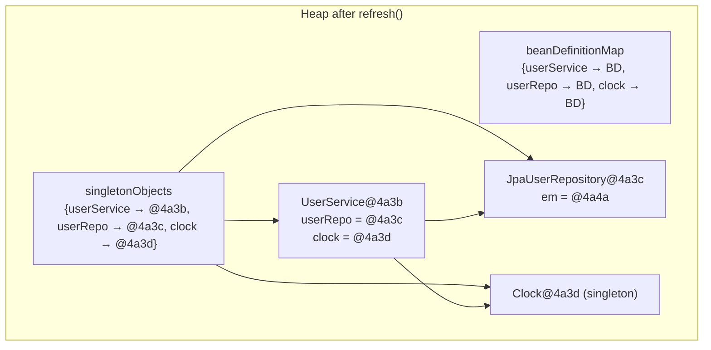

### Phase 5: `BeanPostProcessor` and Proxies

A `BeanPostProcessor` (BPP) wraps every bean. The container collects all BPP beans first (they are created before any non-BPP bean, in a self-creating loop), and then calls each one for every other bean during its 4d step. The most important built-in BPPs:

| BPP | Job |
|-----|-----|
| `CommonAnnotationBeanPostProcessor` | `@PostConstruct`, `@PreDestroy`, `@Resource` |
| `AutowiredAnnotationBeanPostProcessor` | `@Autowired`, `@Value`, `@Inject` |
| `AbstractAutoProxyCreator` (subclasses) | wraps with AOP proxies for `@Transactional`, `@Async`, `@Cacheable` |
| `ConfigurationClassPostProcessor`'s ImportAware processor | injects `@ImportAware` metadata |
| `ScheduledAnnotationBeanPostProcessor` | registers `@Scheduled` methods with `TaskScheduler` |
| `ConfigurationPropertiesBindingPostProcessor` | binds `@ConfigurationProperties` from `Environment` |

When a BPP returns a *different* object than it was given, every subsequent reference to that bean (including the entry in `singletonObjects`) is the new object. This is how `@Transactional` works: the actual proxy in `singletonObjects` is a CGLIB subclass that, on every method call, checks whether the method has a transactional annotation, and if so opens a transaction before delegating to the real method.

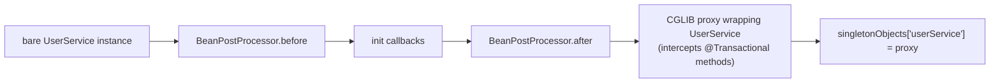

The proxy adds ~96–192 bytes per wrapped bean (CGLIB subclass instance + interceptor chain). On every transactional method call it adds ~1–3 µs of overhead (proxy dispatch + transaction-attribute lookup + `Connection` borrow). For non-transactional methods, modern CGLIB short-circuits and the overhead is a few hundred nanoseconds.

### Phase 6: Init Callbacks Already Covered

`@PostConstruct`, `InitializingBean.afterPropertiesSet`, and `@Bean(initMethod=...)` are all phase 4d above. They are noted again here only because they are how *your* code participates in lifecycle.

### Phase 7: `SmartLifecycle` and `ContextRefreshedEvent`

After every bean is built and post-processed, the container starts `Lifecycle` beans (and the smart variant `SmartLifecycle` which has phase ordering). This is when, e.g., the embedded Tomcat is told to open its listening socket. Finally, the container publishes `ContextRefreshedEvent` — any `@EventListener` registered for that event runs now. The application is "started".

### Phase 8: Shutdown

On JVM shutdown, the container's shutdown hook runs `close()`. It publishes `ContextClosedEvent`, stops `SmartLifecycle` beans in *reverse* phase order, and then iterates `disposableBeans` in reverse-dependency order, calling each bean's destruction callbacks (`DisposableBean.destroy`, `@PreDestroy`, `destroyMethod`). Failures in destruction are logged but do not stop the shutdown.

## Circular Dependencies — How the Three-Level Cache Solves Them

Constructor injection cycles **cannot** be solved (you cannot construct A before B and B before A simultaneously). Setter or field injection cycles **can** be solved because the bean exists as a half-built object before its dependencies are wired. The mechanism:

Imagine `A` has a setter `setB(B b)` and `B` has a setter `setA(A a)`. Both are singleton-scoped.

```mermaid
sequenceDiagram
  participant App
  participant CF as Container
  App->>CF: getBean("a")
  CF->>CF: cache miss (singletonObjects)
  CF->>CF: createBean("a")
  CF->>CF: 4a. new A() → bean a0 (fields null)
  CF->>CF: 4b. addSingletonFactory("a", → a0) (L3)
  CF->>CF: 4c. populate a — needs B
  CF->>CF:    getBean("b")
  CF->>CF:    cache miss
  CF->>CF:    createBean("b")
  CF->>CF:    4a. new B() → bean b0
  CF->>CF:    4b. addSingletonFactory("b", → b0)
  CF->>CF:    4c. populate b — needs A
  CF->>CF:       getBean("a")
  CF->>CF:       L1 miss, L2 miss
  CF->>CF:       L3 hit: factory("a") returns a0
  CF->>CF:       move a0 into earlySingletonObjects, remove from singletonFactories
  CF->>CF:       set b.a = a0
  CF->>CF:    4d. initialize b (run BPPs, postProcess)
  CF->>CF:    singletonObjects["b"] = b
  CF->>CF: set a.b = b
  CF->>CF: 4d. initialize a (run BPPs, postProcess)
  CF->>CF: singletonObjects["a"] = a
  CF-->>App: a (fully built; a.b is fully built; b.a is the same a)
```

Three subtle properties:

1. The early reference inside `B` is the **non-proxied** `A`. If `A` has `@Transactional` methods, the AOP proxy will be applied at `A`'s phase 4d — **after** `B` already received the raw reference. To fix this, the `singletonFactory` actually returns whatever `getEarlyBeanReference` produces, which invokes `SmartInstantiationAwareBeanPostProcessor.getEarlyBeanReference` on every registered BPP. The AOP BPP uses this hook to wrap A *early* with a proxy, hand the proxy to B, and remember that the early proxy was already given out so that 4d does not wrap again.
2. If the cycle includes any constructor-injected dependency, the container throws `BeanCurrentlyInCreationException`. There is no way to inject through a constructor before the constructor has returned.
3. Spring Boot 2.6+ **disables** automatic circular-dependency resolution by default. You have to explicitly opt in (`spring.main.allow-circular-references=true`) or — better — refactor. A cycle is almost always a design smell hiding a third concept that should be extracted.

> [!INTERVIEW]
> "How does Spring resolve circular dependencies?" — answer in two halves. **Setter / field**: three-level singleton cache exposes a half-built reference (the `singletonFactories` map), which gets promoted to `earlySingletonObjects` when looked up, and finally to `singletonObjects` after init. **Constructor**: cannot be resolved — `BeanCurrentlyInCreationException`. Then mention that Boot 2.6 disabled the auto-resolution by default precisely to push teams to break the cycle.

## Singleton vs Prototype vs Scoped — Lifecycle Differences

Five built-in scopes (the last three only when a web container is present):

| Scope | When created | Cached where | Destroyed when |
|-------|--------------|--------------|----------------|
| `singleton` (default) | at container refresh, or on first `getBean` if `@Lazy` | `singletonObjects` | container shutdown |
| `prototype` | every `getBean` / every injection point | nowhere (no cache) | **never** by the container — the caller owns it |
| `request` (web) | first lookup during an HTTP request | `RequestAttributes` | end of the request |
| `session` (web) | first lookup during an HTTP session | `SessionAttributes` | session timeout / invalidate |
| `application` (web) | first lookup ever | `ServletContext` attribute | servlet context destroy |

Two non-obvious consequences:

**Prototypes injected into singletons are static.** If `SingletonService` has `@Autowired PrototypeWorker worker`, the worker is resolved exactly *once* — when `SingletonService` is built. After that, the singleton holds *the same* worker forever. If you wanted a fresh worker per use, you have to inject `ObjectProvider<PrototypeWorker>` (Spring 4.3+) or `Provider<PrototypeWorker>` (JSR-330) and call `.getObject()` / `.get()` on demand.

**Prototypes are not managed for destruction.** The container will not call `@PreDestroy` on a prototype. The caller that asked for it must clean it up. This is why prototypes are rarely used in real applications — they are the wrong default and easily leak.

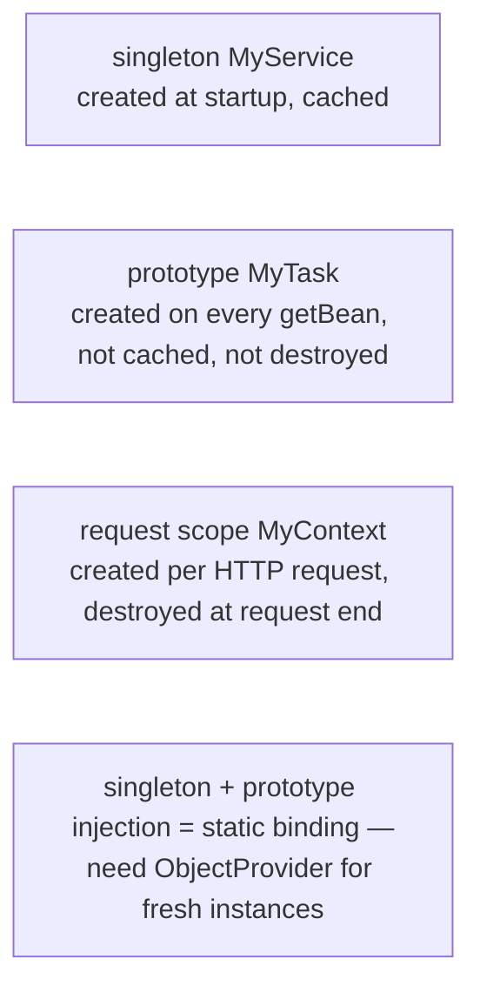

## Bean Naming, Aliases, and Qualifiers

Every bean has a **primary name** (a unique key in `beanDefinitionMap`). Naming rules:

- For `@Component` classes: the name is the simple class name with the first letter lowercased — `UserService` → `userService`. Override with `@Component("customName")`.
- For `@Bean` methods: the name is the method name — `public Clock clock()` → `clock`. Override with `@Bean("customName")` or `@Bean(name = {"primary", "alias1", "alias2"})`.
- Multiple names on the same bean are recorded as **aliases** in `aliasMap`; `getBean(alias)` resolves to the canonical name.

Type-based lookup uses the `allBeanNamesByType` index. When more than one bean of a given type exists, the container needs a tie-breaker:

- **`@Primary`** on one of them marks it as the default for type-based injection.
- **`@Qualifier("name")`** on the injection point disambiguates by name.
- The parameter name on a `@Bean` factory method or `@Autowired` setter parameter is matched against bean names if you compiled with `-parameters`.

If two beans of the same type exist and none is primary and the injection point has no qualifier, the container fails with `NoUniqueBeanDefinitionException`. (For `List<MyType>` or `Map<String, MyType>` injection, the container collects *all* of them — this is a feature, not a bug, and the canonical way to inject "every plugin of this interface".)

## A Tiny Worked Example, End-to-End

```java
public interface UserRepository { User findById(long id); }

@Repository
public class JpaUserRepository implements UserRepository {
    private final EntityManager em;
    public JpaUserRepository(EntityManager em) { this.em = em; }
    public User findById(long id) { return em.find(User.class, id); }
}

@Service
public class UserService {
    private final UserRepository repo;
    private final Clock clock;
    public UserService(UserRepository repo, Clock clock) {
        this.repo = repo;
        this.clock = clock;
    }
    @PostConstruct void init() { System.out.println("UserService ready at " + clock.instant()); }
    public User load(long id) { return repo.findById(id); }
}

@Configuration
public class TimeConfig {
    @Bean public Clock clock() { return Clock.systemUTC(); }
}

@SpringBootApplication
public class App {
    public static void main(String[] args) { SpringApplication.run(App.class, args); }
}
```

What the container does, in order:

1. `SpringApplication.run` creates `AnnotationConfigServletWebServerApplicationContext`. Calls `refresh()`.
2. `ConfigurationClassPostProcessor` discovers `App` (`@SpringBootApplication` is `@Configuration` + `@ComponentScan` + `@EnableAutoConfiguration`).
3. ASM scans the base package, finds `JpaUserRepository` (`@Repository`), `UserService` (`@Service`), `TimeConfig` (`@Configuration`). Registers three `BeanDefinition`s.
4. Parses `TimeConfig`'s `@Bean clock()` method, registers a fourth `BeanDefinition` (`clock`).
5. Auto-configuration registers another ~250 beans (Tomcat, Jackson, the `EntityManagerFactory`, etc. — covered in C01/T07).
6. `finishBeanFactoryInitialization` starts the instantiation loop. It picks the first non-lazy singleton, say `clock`. `getBean("clock")`:
   - Cache miss → `createBean`.
   - `createBeanInstance`: invokes `TimeConfig`'s CGLIB-proxy `clock()` method → returns `Clock.systemUTC()`.
   - `populateBean`: no dependencies → noop.
   - `initializeBean`: BPPs run (`@Autowired` validator: nothing to do; `CommonAnnotationBPP`: no `@PostConstruct`); no `InitializingBean`; no init-method; AOP BPP: not transactional → no proxy.
   - `singletonObjects["clock"] = clock0`.
7. Next: `jpaUserRepository`. `getBean("jpaUserRepository")`:
   - Cache miss → `createBean`.
   - Constructor expects `EntityManager` → `getBean(EntityManager.class)` → resolves through Spring Data JPA infrastructure → an `EntityManager` proxy.
   - Constructor called via reflection: `new JpaUserRepository(emProxy)`.
   - `populateBean`: nothing more.
   - `initializeBean`: `PersistenceExceptionTranslationPostProcessor` wraps the bean with an exception-translation advisor → CGLIB proxy.
   - `singletonObjects["jpaUserRepository"] = repoProxy`.
8. Next: `userService`. `getBean("userService")`:
   - Cache miss → `createBean`.
   - Constructor needs `UserRepository` and `Clock`. The container looks up `UserRepository` by type → finds `jpaUserRepository` (the only bean of that type) → returns the proxy from step 7. Looks up `Clock` → returns `clock0`.
   - `new UserService(repoProxy, clock0)`.
   - `populateBean`: no `@Autowired` fields.
   - `initializeBean`: `CommonAnnotationBPP` runs `@PostConstruct init()` — prints "UserService ready at …". No AOP wrap (nothing transactional).
   - `singletonObjects["userService"] = userService0`.
9. Tomcat starts. `ContextRefreshedEvent` fires. Application is up.

End state in the heap:

| Map key | Value |
|---------|-------|
| `singletonObjects["clock"]` | `Clock@4a3a` |
| `singletonObjects["jpaUserRepository"]` | `JpaUserRepository$EnhancerBySpringCGLIB@4a3b` (a proxy wrapping `JpaUserRepository@4a3c`) |
| `singletonObjects["userService"]` | `UserService@4a3d` |
| `UserService.repo` | the proxy `@4a3b` |
| `UserService.clock` | `@4a3a` |
| `JpaUserRepository.em` | the entity-manager proxy |

The whole bootstrap took roughly **800 ms–2.5 s** for the realistic full app, of which ~150 ms is component scan, ~400 ms is `ConditionalOnClass` auto-config evaluation, ~600 ms is bean instantiation, ~300 ms is `EntityManagerFactory` build, and ~150 ms is Tomcat start.

> [!TIP]
> Spring Boot 3 with CDS (Class Data Sharing) or AOT (`spring-aot`) compiled snapshots can cut cold start to ~100 ms by serializing the prepared metaspace and the resolved bean definitions to disk. GraalVM Native Image takes this further (~30 ms cold start, ~50 MB RSS) at the cost of build complexity and reduced reflection ergonomics (T25).

## Comparing Spring's Container to the Alternatives

A senior engineer should know *why* Spring's container won and where alternatives still shine.

| Framework | Style | Wiring point | Reflective at runtime? | Notes |
|-----------|-------|--------------|:----------------------:|-------|
| **Spring** | runtime container | startup (refresh) | yes (reflection + CGLIB) | universal; heavy startup; flexible |
| **Guice** | runtime container | startup (`Injector`) | yes | smaller; constructor-injection forced; no AOP weaving |
| **Dagger** | **compile-time** DI | apt code-gen | **no** — generated code calls `new` | zero runtime cost; Android default; verbose if many bindings |
| **Micronaut / Quarkus** | compile-time AOT | annotation processor | minimal | Spring-like ergonomics with native-friendly cold start |
| Manual / **Pico** | no container | by hand | no | smallest; no magic; you write the wiring |

Spring chose **runtime + reflection** because in 2003 it was the only way to keep the ergonomics close to Java's grammar and run on every JVM. The cost — startup time and a heavier footprint — is what Spring AOT, Spring Native, and Spring Boot's "lite" configuration are progressively walking back. The trade Spring made in 2003 still pays off for the 90% of services that run for hours and care more about developer ergonomics than the 50–200 ms of warmup; it loses for the 10% that are short-lived (Lambda, scale-to-zero) where Quarkus/Micronaut/Spring-Native have a clear advantage.

## Common Pitfalls

> [!WARNING]
> **Calling `new MyService()` and expecting `@Autowired` to work.** It will not. Only beans the container constructed have their dependencies injected. If you must mix, pass the dependency manually or get the bean via `ApplicationContext` (and consider why you are bypassing the container).

> [!WARNING]
> **Field injection (`@Autowired` on a field) trains away from constructor injection.** Construct-injection makes the dependency explicit, makes the class testable without Spring, and lets fields be `final`. Use field injection only for legacy code or in tests.

> [!WARNING]
> **`@Component` on a `@Bean` method's return type.** Pointless and confusing — the bean comes from the `@Bean` method, not from a component scan of the return type. Either delete the annotation or delete the `@Bean` method.

> [!WARNING]
> **Singleton holding a `prototype` field that you expect to be fresh.** It is not fresh. See § Singleton vs Prototype.

> [!WARNING]
> **Forgetting `@Configuration` on a class with internal `@Bean` calls.** The "lite" `@Component` semantics mean every internal call to a `@Bean` method creates a new instance. Either keep it `@Configuration` (the default), or refactor the bean's dependencies into constructor parameters so internal calls are not needed.

## Practice

1. Write a `@Configuration` class with three `@Bean` methods (`Clock`, `RestClient`, `OrderService` taking the first two). Bootstrap it with `new AnnotationConfigApplicationContext(YourConfig.class)`. Print the bean names from `ctx.getBeanDefinitionNames()`. Now mark the configuration class `@Component` and observe that `OrderService` ends up with a *different* `Clock` than the one cached as `clock` — proving the CGLIB-proxy effect of `@Configuration`.
2. Introduce a deliberate circular dependency between two `@Service` beans using setter injection (do **not** use constructor injection). Bootstrap. Watch it succeed. Now switch both to constructor injection. Watch it fail with `BeanCurrentlyInCreationException`. Write the stack trace in your own words.
3. Create a `BeanPostProcessor` that logs every bean's name and type as it goes through `postProcessAfterInitialization`. Register it as a `@Bean`. Bootstrap. Count how many beans the framework adds for a minimal `@SpringBootApplication` with no extra dependencies.
4. Build a `prototype` bean and inject it into a `singleton`. Print the prototype's `hashCode` on two consecutive singleton-method calls. Confirm they match. Now refactor to inject `ObjectProvider<Prototype>` and call `.getObject()` each time. Confirm the hash codes now differ.
5. Use `ctx.getBean(DefaultListableBeanFactory.class)` and walk `getBeanDefinitionNames()`. For each, print the `BeanDefinition`'s class name, scope, and `dependsOn` array. Read the output and reason about which beans are framework infrastructure and which are yours.
6. Trace through `refresh()` in a debugger. Set a breakpoint in `AbstractAutowireCapableBeanFactory.doCreateBean`. For one of your beans, step from `createBeanInstance` to `populateBean` to `initializeBean`, and inspect `singletonsCurrentlyInCreation`, `earlySingletonObjects`, and `singletonObjects` between steps.

## Recap

You should now be able to:

- Define "Spring bean", "IoC container", and "dependency injection" precisely, and explain how DI is one *technique* for achieving IoC.
- Explain the difference between `BeanFactory` and `ApplicationContext`, and which one a real application uses.
- Describe the contents of `DefaultListableBeanFactory`'s key maps (`beanDefinitionMap`, `singletonObjects`, `earlySingletonObjects`, `singletonFactories`, `mergedBeanDefinitions`, `dependentBeanMap`) and how much heap each costs at the bean-count scale of a real Spring Boot service.
- Walk through the eight bootstrap phases (`bootstrap` → `config read` → `BFPP` → `instantiation` → `BPP` → `init` → `lifecycle` → `shutdown`), naming the entry method (`refresh`) and the loop inside `finishBeanFactoryInitialization`.
- Explain the 5-step `doCreateBean` pipeline (instantiate → expose early → populate → initialize → register-destroy) and why each step exists.
- Explain how the three-level singleton cache resolves setter/field circular dependencies, and why constructor cycles cannot be resolved.
- Choose between `@Component`, `@Bean`, and `@Configuration`, and explain the CGLIB-proxy mechanism that makes `@Configuration` honor singleton semantics across internal calls.
- Explain why classpath scanning uses ASM rather than the classloader, and why that matters for startup time and metaspace footprint.
- Compare Spring's runtime container to compile-time alternatives (Guice, Dagger, Micronaut, Quarkus) and articulate the trade Spring made.

## Next

Continue to [Dependency Injection (constructor / field / setter)](./T02-dependency-injection-constructor-field-setter.md) to see how the *application code side* declares dependencies — the three injection styles, their trade-offs in testability and immutability, and the exact bytecode the JVM ends up executing for each.
