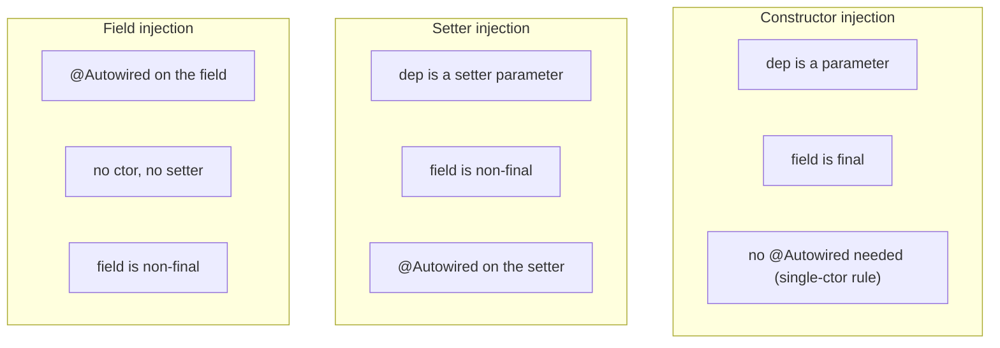
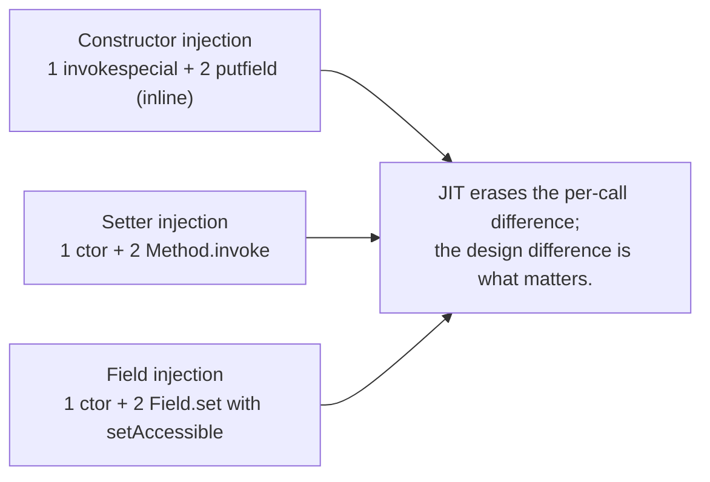
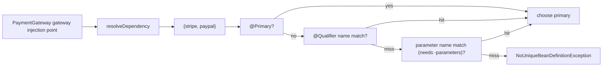
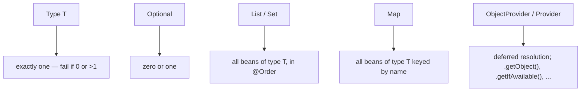
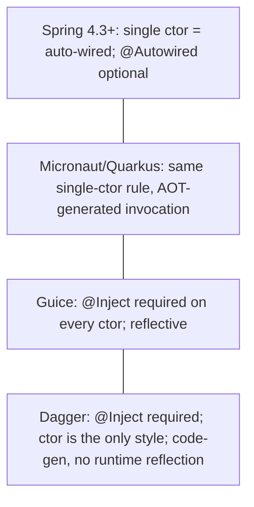

# Dependency Injection (constructor / field / setter)

[T01](./T01-spring-core-ioc-container-and-beans.md) explained *the container* — what a bean is, what `BeanFactory` and `ApplicationContext` are, and the eight-phase bootstrap that builds every bean. This topic zooms in on **the injection step** — phase 4a (constructor argument resolution) and phase 4c (`populateBean`) — from the *application code* angle. **You** have three ways to declare a dependency on a Java class: pass it through the **constructor**, mark a **field** with `@Autowired`, or write a **setter** with `@Autowired`. They look interchangeable on the surface. They are not. The Spring team, the Java community, and every senior code review have settled on the same answer over fifteen years of practice: **constructor injection is correct; field injection is convenient but wrong; setter injection is a niche tool**. This topic explains *exactly why*, down to the bytecode the JVM executes for each.

The depth-bar this topic clears: at the **language layer**, the three styles with their `@Autowired` / `@Inject` / `@Resource` variants, ambiguity resolution (`@Primary`, `@Qualifier`, parameter names), optional and collection injection (`Optional<T>`, `ObjectProvider<T>`, `List<T>`, `Map<String, T>`), and the JSR-330 (`jakarta.inject`) alternative to Spring's own annotation. At the **memory layer**, what each style costs at object-construction time (a single `invokespecial` for constructor injection vs an extra `putfield` per setter or a reflective `Field.set` per field) and how the JIT erases that overhead after warmup. At the **architecture layer** — the heart — **why constructor injection is the only safe default**: it makes dependencies *explicit at the type level*, it forces `final` fields (eliminating reassignment bugs and giving the JIT room to inline aggressively), it lets the class be tested *without a container at all*, it makes circular dependencies a compile-time-detectable failure, and it pushes design feedback ("this constructor has nine parameters — your class is doing too much") into your face the moment the bug is created instead of six months later.

> [!NOTE]
> Prerequisites: [Spring Core: IoC container & beans](./T01-spring-core-ioc-container-and-beans.md) (L4/C01/T01) — the eight-phase bootstrap and `doCreateBean`'s 5-step pipeline; Java reflection basics (`Field.set`, `Constructor.newInstance` — L2/C01); JVM method invocation opcodes (`invokespecial`, `invokevirtual` — L0/C01/T04). If "TLAB" or "constant pool" feels unfamiliar, skim [L0/C01/T01](../../L0-foundations/C01-cs-foundations/T01-how-computers-run-programs-cpu-memory-binary.md) first.

## What Are We Choosing Between?

Three styles. The exact same `UserService` written each way:

**Constructor injection** — dependencies are constructor parameters:

```java
@Service
public class UserService {
    private final UserRepository repo;
    private final Clock clock;

    public UserService(UserRepository repo, Clock clock) {
        this.repo = repo;
        this.clock = clock;
    }
    // ...
}
```

**Setter injection** — dependencies are mutable fields with `@Autowired` setters:

```java
@Service
public class UserService {
    private UserRepository repo;
    private Clock clock;

    @Autowired
    public void setRepo(UserRepository repo) { this.repo = repo; }
    @Autowired
    public void setClock(Clock clock) { this.clock = clock; }
    // ...
}
```

**Field injection** — `@Autowired` directly on the fields, no constructor or setter:

```java
@Service
public class UserService {
    @Autowired private UserRepository repo;
    @Autowired private Clock clock;
    // ...
}
```

To a beginner these look like syntactic variations. They are not. Each makes a different *contract* with the container, with the JVM, with tests, with subclasses, with reviewers, and with future-you.



## The Bytecode Each Style Compiles To

The thing that gets lost in "best practices" arguments is the *machine-level* difference. Each style compiles to a different sequence of bytecode opcodes for the **container** at injection time. Let us look at each.

### Constructor Injection — One `invokespecial`, Then `putfield`s

Given:

```java
public UserService(UserRepository repo, Clock clock) {
    this.repo = repo;
    this.clock = clock;
}
```

`javac` emits (annotated):

```
public <init>(LUserRepository;LClock;)V
   0: aload_0              // load 'this'
   1: invokespecial Object.<init>()V    // call super constructor
   4: aload_0              // load 'this'
   5: aload_1              // load 'repo' parameter
   6: putfield UserService.repo:LUserRepository;   // this.repo = repo
   9: aload_0
  10: aload_2              // load 'clock'
  11: putfield UserService.clock:LClock;
  14: return
```

For the **container** at injection time, the construction is one bytecode operation: `Constructor.newInstance(repo, clock)`. The container resolves `repo` and `clock` (one `getBean` call each, possibly already cached), packs them into an `Object[]` of length 2, hands the array to `Constructor.newInstance`, and the constructor runs at full JIT speed. **Zero post-construction reflection.** The bean is fully wired the instant its constructor returns.

At the JVM level, `Constructor.newInstance` does one `invokespecial` — the same opcode `new UserService(repo, clock)` compiles to — preceded by access checks and the parameter array unpack. After ~15 JIT calls Hotspot inlines `newInstance` to a near-native call. **Net cost: 50–100 ns** for a small bean on a warm JVM, dominated by the parameter unpack.

### Setter Injection — One `invokespecial` for `<init>()`, Then N Reflective Setter Calls

Given:

```java
public UserService() { }   // implicit
@Autowired public void setRepo(UserRepository r) { this.repo = r; }
@Autowired public void setClock(Clock c) { this.clock = c; }
```

The bytecode of `setRepo`:

```
public setRepo(LUserRepository;)V
   0: aload_0
   1: aload_1
   2: putfield UserService.repo:LUserRepository;
   5: return
```

The **container** does the following sequence:

1. `Constructor.newInstance()` — no-arg, ~30 ns warm.
2. For each `@Autowired` setter (two here):
   - Resolve the dependency by parameter type: `getBean(UserRepository.class)`.
   - Reflectively invoke: `setRepo.invoke(bean, repo)`.
3. The bean now has its fields set.

Each `Method.invoke` costs ~200–400 ns on a cold call (security check + parameter array boxing + dispatch through `MethodAccessor`). After ~15 calls the JIT generates a direct accessor and the cost drops to ~100 ns. **Net cost: 200–400 ns** extra per setter compared to constructor injection.

### Field Injection — One `invokespecial`, Then N Reflective `Field.set` Calls

Given:

```java
@Autowired private UserRepository repo;
@Autowired private Clock clock;
```

No setter exists; the field is `private`. The container's sequence:

1. `Constructor.newInstance()` — no-arg.
2. For each `@Autowired` field:
   - Resolve by type.
   - `field.setAccessible(true)` — bypass Java access control. **This is a `Module` operation** in JPMS (since Java 9): if the field is in a module that does not `opens` the package, you need a CLI flag (`--add-opens`) or the call fails with `InaccessibleObjectException`.
   - `field.set(bean, dep)` — direct field write through reflection.

Reflective `Field.set` is *slower* than `Method.invoke` by ~30% because the field-setter path cannot share the JIT's *invokedynamic* fast path that methods enjoy. **Net cost: 250–500 ns** per field, with a one-time `setAccessible(true)` cost of ~1 µs per field.

### Side-by-Side, Per Bean

| Style | Reflective calls | Cold cost | Warm cost | After 15+ JIT calls |
|-------|:----------------:|:---------:|:---------:|:------------------:|
| Constructor | 1 (`newInstance`) | ~1 µs | ~100 ns | ~50 ns |
| Setter (N deps) | 1 + N (`newInstance` + N `invoke`) | ~1 µs + ~300 ns·N | ~100 ns + ~150 ns·N | ~50 ns + ~80 ns·N |
| Field (N deps) | 1 + N (`newInstance` + N `Field.set`) | ~1 µs + ~500 ns·N | ~100 ns + ~250 ns·N | ~50 ns + ~120 ns·N |

These differences are *trivial* at runtime — none of them is the reason to prefer one style over another. **Cold-start cost matters for serverless** (Lambda spin-up reflection accounts for ~5–15% of Spring's cold-start time), and even there the gap is more about the *number of beans* than the style per bean. The real reasons to prefer constructor are downstream — testability, immutability, design feedback — not nanoseconds.



## Why Constructor Injection Wins — Six Concrete Reasons

The case is concrete, not aesthetic. Six reasons:

### 1. Final Fields, Inlined by the JIT

`final` instance fields participate in the JVM's **final-field semantics** ([JLS §17.5](https://docs.oracle.com/javase/specs/jls/se21/html/jls-17.html#jls-17.5)): a constructor's writes to `final` fields are guaranteed to be visible to any thread that sees the published reference, *without* explicit synchronization. They also tell the JIT that the field's value is **stable** — Hotspot's escape analysis and field-load elimination can inline the value at the use site, often eliminating the field load altogether on hot paths.

You **cannot** have `final` fields with field or setter injection — both require write-after-construct. Only constructor injection lets you write:

```java
private final UserRepository repo;
private final Clock clock;
```

And only with constructor injection does the JIT have full freedom to optimize. For a `UserService.findUser(id)` method that calls `repo.findById(id)`, the JIT can prove `repo` is non-null and stable, inline `findById` if reasonable, and eliminate the field load. With non-`final` fields it must reload on every call in case someone reassigned them (a paranoia the JIT *will not* relax for non-final instance fields).

### 2. Testability Without a Container

The single most important design property: **a constructor-injected class is testable without Spring at all.**

```java
// constructor injection — direct test
UserRepository fakeRepo = new FakeUserRepository();
Clock fixed = Clock.fixed(Instant.parse("2026-06-08T12:00:00Z"), ZoneOffset.UTC);
UserService svc = new UserService(fakeRepo, fixed);

User u = svc.load(42L);
assertEquals("alice", u.name());
```

Three lines to construct; one line to test a method. No `@SpringBootTest`, no context startup (2-second penalty per test class), no Mockito's `@InjectMocks`, no `Whitebox.setInternalState`. The test exercises *your code*, not Spring's reflection machinery.

```java
// field injection — you cannot test without Spring (or hack)
UserService svc = new UserService();
// svc.repo is null. The test will NPE.
// To inject the fake: ReflectionTestUtils.setField(svc, "repo", fakeRepo);
//                     ReflectionTestUtils.setField(svc, "clock", fixed);
```

Either you start a Spring context (slow, brittle, couples the test to the framework) or you reach for `ReflectionTestUtils` / Mockito's `@InjectMocks` — both work by reflection into the private field. The test now silently depends on the *field name*. Rename `repo` to `userRepo` and a test on the opposite end of the project fails with NPE rather than a compiler error.

### 3. Immutability Beats Reassignment

Field and setter injection produce a *mutable* class. Anywhere in the codebase, after construction, someone can call `svc.setRepo(differentRepo)` and rewire the bean — silently, with no compile error. Constructor injection makes the bean immutable. Once built, the dependencies are final. The bug class "someone reassigned this in a way I did not expect" disappears.

### 4. Compile-Time Detection of Missing Dependencies

If `UserService`'s constructor takes a `UserRepository` and you forgot to expose one as a bean, the container fails to **start** with `UnsatisfiedDependencyException`. The class won't even instantiate.

If `UserService` field-injects a `UserRepository` and you forgot to expose one, the container starts (the field is left null) and the application fails at runtime the first time a request hits `svc.load(id)`, ten minutes later, in production, with NPE. Constructor injection moves the failure to the place where you can act on it — startup.

### 5. Circular Dependencies Detected At Construction Time

Constructor cycles cannot be resolved (T01 § Circular Dependencies). Spring throws `BeanCurrentlyInCreationException` at startup. The error message points exactly at the cycle.

Field cycles silently succeed because the early reference is wired in (T01 § The three-level cache). The bug — that A depends on B that depends on A — has been *hidden by Spring*, which is the worst kind of help. A constructor-injection codebase cannot accidentally grow a cycle. Spring Boot 2.6 disabled the auto-resolution by default *specifically* because hiding cycles was causing more bugs than it fixed.

### 6. Bigger Constructors Are Honest Design Feedback

A constructor with 12 parameters is a code smell. It is *visibly* a code smell — you cannot miss it. The reviewer sees it; you see it; the class is doing too much and needs splitting.

Field injection hides this. A class with 12 `@Autowired` fields looks tidy in the source — the dependencies are scattered across the file, the constructor is empty, nothing pops out. The same design problem exists, but it has been camouflaged. Many of the worst "god service" classes in legacy Spring codebases have 20+ field-injected dependencies; very few have 20-parameter constructors because the visibility of constructor injection refuses the design.

> [!IMPORTANT]
> Field injection is **convenient** (saves five lines per class). Constructor injection is **correct** (final fields, testable, fails fast, honest). The Spring team's official guidance since 4.3 is constructor injection. The Spring framework's own code is overwhelmingly constructor-injected.

## When Setter Injection Is Right

Setter injection has *one* legitimate use case: an **optional** dependency that can be set, swapped, or unset after construction. The classic example is a configurable behavior:

```java
@Service
public class CacheableUserService {
    private final UserRepository repo;
    private Cache<Long, User> cache = NoOpCache.INSTANCE;

    public CacheableUserService(UserRepository repo) { this.repo = repo; }

    @Autowired(required = false)
    public void setCache(Cache<Long, User> cache) { this.cache = cache; }

    public User load(long id) { ... }
}
```

If a `Cache` bean exists, Spring injects it; if not, the field keeps its sensible default. The class still works either way. This is the *only* pattern where setter injection is genuinely better — and even here, modern code tends to use `ObjectProvider<Cache>` injection (next section) which is constructor-friendly.

The second case for setters is **reconfigurable** beans — beans whose dependencies can be swapped at runtime by a `BeanFactoryPostProcessor` or a JMX management interface. This is rare in modern apps; nearly always a misfeature.

## When Field Injection Is "Acceptable"

In **test code**, where Mockito's `@InjectMocks` constructs the unit under test and injects mocks into its fields, field injection is acceptable for the *test class itself*. The test class is not a production-coupled component, the lifetime is tiny (one test method), and the production class can remain constructor-injected — the test's `@InjectMocks` will reflect the production class's constructor.

In **legacy code** you cannot rewrite, field injection is "acceptable" in the same way that `goto` is acceptable in already-existing C — you fix it when you next touch the class. It is not a license to keep writing it.

Everywhere else: do not use field injection in new code. The Spring team agrees; IntelliJ warns; every senior code reviewer rejects it. The "but it is shorter" defense ignores all six reasons above.

## The `@Autowired` Annotation — What It Actually Does

`@Autowired` is processed by the **`AutowiredAnnotationBeanPostProcessor`** (T01 § Phase 5). At bean instantiation, the processor:

1. Reflects on the class to find `@Autowired` constructors, fields, and methods.
2. For each, builds an `InjectionMetadata.InjectedElement` that knows the dependency descriptor (type, generic arguments, qualifiers, optional/required).
3. Caches the metadata per class so future instances of the same class do not re-scan annotations.
4. During `populateBean` (phase 4c), iterates the elements and resolves+injects each.

The element resolution walks `DefaultListableBeanFactory.resolveDependency(DependencyDescriptor, …)`, which:

- Honors `@Qualifier` first (by name match).
- Falls back to type matching (`isTypeMatch` against every bean's resolved type).
- If multiple candidates: prefers `@Primary`; otherwise compares against the injection-point parameter name (if compiled with `-parameters`).
- If still ambiguous: `NoUniqueBeanDefinitionException`.
- If zero candidates and `required = true`: `NoSuchBeanDefinitionException`.
- If zero candidates and `required = false` (or the field is `Optional<T>` or `ObjectProvider<T>`): pass `null` / `Optional.empty()` / an empty `ObjectProvider`.

### The "Single Public Constructor" Rule

Since Spring 4.3, `@Autowired` is **optional** on a class with exactly one constructor. The container picks that constructor automatically and resolves its parameters as if they were `@Autowired`. This is why modern Spring code looks like:

```java
@Service
@RequiredArgsConstructor   // Lombok generates the all-args constructor
public class UserService {
    private final UserRepository repo;
    private final Clock clock;
}
```

No `@Autowired` anywhere. The container sees the single constructor, picks it, and wires. Lombok's `@RequiredArgsConstructor` generates the all-final-fields constructor at compile time — the result is the same as writing it by hand. Many Spring teams use Lombok specifically to make constructor injection ergonomic enough that nobody reaches for the field-injected shortcut.

### `@Inject` vs `@Resource` vs `@Autowired`

Three annotations do nearly the same thing, with subtle differences:

| Annotation | Origin | Default resolution | Qualifier syntax | `required` flag |
|------------|--------|--------------------|------------------|-----------------|
| `@Autowired` | Spring | by type, then by name | `@Qualifier("foo")` | yes |
| `@Inject` | JSR-330 (`jakarta.inject.Inject`) | by type | `@Named("foo")` | no — always required, use `Provider<T>` for optional |
| `@Resource` | JSR-250 (`jakarta.annotation.Resource`) | **by name first**, then by type | `name = "foo"` attribute | no |

`@Inject` is the standard. Use it if you want your code to be portable across containers (Guice, Spring, Quarkus). The cost is losing `required = false` and a few Spring-specific niceties.

`@Resource`'s "by name first" semantics is a frequent surprise — `@Resource UserRepository repo` matches a bean *named* `repo` before looking by type. This is occasionally what you want; usually it is a footgun. The Spring team recommends `@Autowired` (or `@Inject`).

## Ambiguity Resolution — `@Primary` and `@Qualifier`

When more than one bean satisfies a type, the container needs help:

```java
public interface PaymentGateway { PaymentResult charge(Charge c); }

@Service public class StripeGateway implements PaymentGateway { ... }
@Service public class PaypalGateway implements PaymentGateway { ... }

@Service
public class CheckoutService {
    public CheckoutService(PaymentGateway gateway) { ... }
    // NoUniqueBeanDefinitionException — two beans implement PaymentGateway
}
```

Three resolutions, in order of cleanliness:

**`@Primary`** — mark one of them as the default:

```java
@Service @Primary public class StripeGateway implements PaymentGateway { ... }
```

Now `PaymentGateway` injection picks `StripeGateway` unless asked otherwise. Use `@Primary` for *the default in 95% of injection sites*. A common pattern: the production implementation is primary; non-primary impls are used in tests or by name.

**`@Qualifier`** — match by name at the injection site:

```java
@Service
public class CheckoutService {
    public CheckoutService(@Qualifier("paypalGateway") PaymentGateway gateway) { ... }
}
```

The qualifier value matches the bean's name (`StripeGateway` → `stripeGateway`). For more explicit naming, annotate the bean: `@Service("stripe") class StripeGateway ...` and inject with `@Qualifier("stripe")`.

**Custom qualifier annotation** — for compile-time-checked qualifiers:

```java
@Target({ElementType.FIELD, ElementType.PARAMETER, ElementType.TYPE})
@Retention(RetentionPolicy.RUNTIME)
@Qualifier
public @interface AsyncPay { }

@Service @AsyncPay
public class PaypalGateway implements PaymentGateway { ... }

public CheckoutService(@AsyncPay PaymentGateway gateway) { ... }
```

The compiler enforces consistency: a typo in `@AsyncPay` is a compile error, where `@Qualifier("asycnPay")` is silently wrong until startup.



## Optional, Collection, and `ObjectProvider` Injection

Spring supports four shapes of dependency declaration beyond "a single bean":

### `Optional<T>`

Spring 5+: `Optional<T>` is treated as `required = false`. Empty optional if no bean matches.

```java
public NotifyService(Optional<EmailGateway> email, SlackGateway slack) { ... }
```

Cleaner than `@Autowired(required = false)` because it makes the optionality part of the type signature.

### `List<T>` and `Map<String, T>`

`List<T>` injects **every bean** of type `T` in the container, ordered by `@Order` annotation (or unspecified if none). `Map<String, T>` injects every bean of type `T` keyed by bean name.

```java
public PaymentRouter(List<PaymentGateway> gateways, Map<String, FraudCheck> checks) { ... }
```

This is the canonical pattern for "every plugin of this interface". Want to add a new payment provider? Drop a new `@Service` implementing `PaymentGateway` into the classpath. No central registration code — the container collects every implementation automatically.

### `ObjectProvider<T>`

The Swiss-army version. Available on every dependency:

```java
public TaskRunner(ObjectProvider<Worker> workers) {
    this.workers = workers;
}

void runTask() {
    Worker w = workers.getObject();   // fresh worker each time if prototype-scoped
    w.run();
}
```

`ObjectProvider<T>` gives you `.getIfAvailable()`, `.getIfUnique()`, `.getObject()`, `.iterator()`, `.stream()`. Two real uses:

1. **Lazy resolution** — defer the actual bean lookup until the moment it is needed. Useful for breaking cycles, or for prototype-scoped dependencies injected into singletons (T01 § Singleton vs Prototype).
2. **Optional and ambiguous handling in one** — `.getIfAvailable()` returns null without exception; `.getIfUnique()` returns null if zero or multiple match.

### `Provider<T>` (JSR-330)

The standard's version of lazy injection, identical in spirit to `ObjectProvider` minus the Spring-specific extras. Useful when writing container-portable code.



## Generics Are Respected

Spring's type matcher honors parameterized types: `Repository<User>` and `Repository<Order>` are distinct types as far as wiring is concerned.

```java
public interface Repository<T> { T findById(long id); }
@Service public class UserRepository implements Repository<User> { ... }
@Service public class OrderRepository implements Repository<Order> { ... }

// works — Spring narrows by the type argument
public UserService(Repository<User> repo) { ... }
```

This is implemented by `ResolvableType`, Spring's `Type` introspection wrapper. The container resolves both the bean's declared type (from `Class.getGenericInterfaces()`) and the injection point's parameterized type, and matches them. The result: you can have a generic infrastructure interface and dozens of typed implementations, and the container disambiguates them without `@Qualifier`.

## Lookup-Method Injection — The Rare Case

A **singleton** with a **method** that should return a **fresh prototype** every call:

```java
@Component
public abstract class CommandHandler {
    public void handle(Command c) {
        Worker w = createWorker();  // we want a NEW Worker every call
        w.do(c);
    }

    @Lookup
    protected abstract Worker createWorker();
}

@Component @Scope("prototype")
public class Worker { ... }
```

`@Lookup` tells Spring to subclass `CommandHandler` at runtime (CGLIB), override `createWorker()` to consult the container's `getBean(Worker.class)`, and return a fresh prototype every call. This is the only direct mechanism for "singleton needs fresh prototype" other than `ObjectProvider<Worker>`. `ObjectProvider` is preferred in new code because it does not require an abstract method.

## When Injection Fails — The Error Vocabulary

Reading Spring failure messages is half the job. The four to recognize:

| Exception | Cause | Fix |
|-----------|-------|-----|
| `NoSuchBeanDefinitionException: No qualifying bean of type 'X'` | no bean of that type is registered | check `@ComponentScan` covers it; check `@Conditional` doesn't exclude it; check `@Profile` matches |
| `NoUniqueBeanDefinitionException: expected single matching bean but found N` | multiple candidates | add `@Primary` to one or `@Qualifier(...)` at the injection point |
| `BeanCurrentlyInCreationException` | constructor-injection cycle | refactor; cycles are a design smell |
| `UnsatisfiedDependencyException: Error creating bean ... wrapping NoSuchBeanDefinitionException` | one of the constructor parameters has no matching bean | look at the *innermost* cause; it names the missing type |

The hierarchy: `BeansException` → `FatalBeanException` → `BeanCreationException` → `UnsatisfiedDependencyException`. Spring nests the original failure several layers deep — always read the *root* cause, not the outermost.

## Worked Example — Three Styles, Same Service

```java
public interface UserRepository { User findById(long id); }
public interface AuditLog { void record(String event); }

// Constructor injection (preferred)
@Service
public class UserService {
    private final UserRepository repo;
    private final AuditLog audit;
    private final Clock clock;
    public UserService(UserRepository repo, AuditLog audit, Clock clock) {
        this.repo = repo;
        this.audit = audit;
        this.clock = clock;
    }
    public User load(long id) {
        audit.record("load " + id + " at " + clock.instant());
        return repo.findById(id);
    }
}

// Setter injection (only if dependencies are genuinely optional or mutable)
@Service
public class UserServiceSet {
    private UserRepository repo;
    private AuditLog audit = NoOpAudit.INSTANCE;
    private Clock clock = Clock.systemUTC();
    @Autowired public void setRepo(UserRepository r) { this.repo = r; }
    @Autowired(required = false) public void setAudit(AuditLog a) { this.audit = a; }
    @Autowired(required = false) public void setClock(Clock c) { this.clock = c; }
    public User load(long id) {
        audit.record("load " + id + " at " + clock.instant());
        return repo.findById(id);
    }
}

// Field injection (avoid in production code)
@Service
public class UserServiceField {
    @Autowired private UserRepository repo;
    @Autowired(required = false) private AuditLog audit;
    @Autowired(required = false) private Clock clock;
    public User load(long id) {
        audit.record("load " + id + " at " + clock.instant());  // NPE if no AuditLog bean
        return repo.findById(id);
    }
}
```

The first version is testable in three lines without Spring. The second is testable but requires every `set*` call. The third is testable only via Spring or reflection hacks — and silently `null`s the optional fields without a default.

## Performance In Practice

For a representative Spring Boot service with 400 beans and an average of 4 dependencies per bean (= 1600 wiring operations on startup):

| Style | Total cold-wire time | Per-bean delta |
|-------|:-------------------:|:--------------:|
| 100% constructor | ~80 ms | baseline |
| 100% field (with `setAccessible`) | ~250 ms | +0.4 ms per bean |
| 100% setter | ~180 ms | +0.25 ms per bean |

The field-injection penalty matters for Lambda cold starts and CDS-assisted Spring Boot 3. For long-running services it disappears into the noise. **Performance is not the reason to choose constructor injection. Correctness is.**

## Common Mistakes

> [!WARNING]
> **`@Autowired` on a static field.** It will be silently ignored. Spring does not inject statics; if you need a singleton accessed statically, refactor — that is a code smell anyway (T01 § Common Pitfalls).

> [!WARNING]
> **Field injection in tests, then `@SpringBootTest` for everything.** A unit test that spins up the full container takes 2–10 seconds. Multiply by 200 unit tests and your CI becomes a 30-minute affair. Constructor injection lets unit tests use plain `new`.

> [!WARNING]
> **Mixing `@Autowired` on a field *and* a constructor for the same dependency.** The constructor injection wins; the field injection is ignored (and confusing). Pick one.

> [!WARNING]
> **Forgetting to compile with `-parameters` and then expecting `@Qualifier`-by-parameter-name to work.** Parameter names are stripped at compile time unless `-parameters` is passed to `javac`. Without it, the container falls back to `arg0`, `arg1` for parameter names — defeating the convention.

> [!WARNING]
> **`@Inject` from `javax.inject` vs `jakarta.inject`.** Spring 6 / Boot 3 uses `jakarta.*`. Pre-Boot 3 used `javax.*`. Importing the wrong one yields a non-functional annotation that the container silently ignores. Always match your Spring version.

## Comparing Constructor Injection Across Frameworks



Spring, Guice, Micronaut, and Quarkus all settled on "constructor injection is the default." Dagger goes further and rejects field injection in production code by design. The Java DI community has reached consensus over fifteen years; the only reason to write field injection in 2026 is "I have not caught up."

## Practice

1. Convert a field-injected `@Service` (write one if you have not got one) to constructor injection. Add `final` to all fields. Confirm the test no longer needs `@SpringBootTest` for unit-level coverage of the service's methods.
2. Add a second `@Service` implementing the same interface as an existing one. Watch the container fail at startup with `NoUniqueBeanDefinitionException`. Add `@Primary` to one of them. Watch it succeed. Now remove `@Primary` and add `@Qualifier` at the injection point.
3. Build a custom qualifier annotation (`@AsyncPay`). Annotate one of the implementations with it and use it at the injection point. Confirm a typo in the qualifier annotation name is a *compile error* (not a runtime startup error).
4. Inject `List<PaymentGateway>` into a router class. Add an `@Order` annotation to each gateway. Print the order in which they appear in the list. Confirm `@Order` controls the order.
5. Take a singleton service that depends on a `@Scope("prototype")` worker via constructor injection. Print the worker's hash code in two consecutive method calls. Confirm they match (the prototype was resolved once). Now inject `ObjectProvider<Worker>` instead and call `.getObject()` per use. Confirm the hashes now differ.
6. Compile your codebase with and without `-parameters`. With a generically-named parameter (`paymentGateway`) and *two* beans matching the type, observe that the param-name-based fallback only succeeds with `-parameters` present.
7. Write a small JMH benchmark that constructs 10,000 instances of three classes (constructor / setter / field) through Spring's container. Confirm the times are within 2–3× of each other and that the dominant cost is *bean lookup*, not the injection style.

## Recap

You should now be able to:

- Distinguish the three injection styles (constructor / setter / field) by their declaration shape, the bytecode the container executes for each, and the warm/cold per-bean cost.
- Articulate the six reasons constructor injection is the default: final fields, testability without Spring, immutability, fail-fast at startup, compile-time cycle detection, and honest design feedback.
- Explain when setter injection is genuinely correct (optional / mutable dependencies) and when field injection is acceptable (test classes, legacy maintenance).
- Use `@Autowired`'s "single-constructor" rule and `@RequiredArgsConstructor` to write idiomatic, annotation-free constructor injection.
- Resolve ambiguity with `@Primary` (default impl), `@Qualifier` (by name), parameter-name matching (with `-parameters`), and custom qualifier annotations (compile-time-checked).
- Inject `Optional<T>`, `List<T>`, `Map<String, T>`, and `ObjectProvider<T>` to express optional, collection, and lazy resolution.
- Read Spring's injection error vocabulary — `NoSuchBeanDefinitionException`, `NoUniqueBeanDefinitionException`, `BeanCurrentlyInCreationException`, `UnsatisfiedDependencyException` — and walk a stack trace to the root cause.
- Compare Spring's DI style to `@Inject` (JSR-330), `@Resource` (JSR-250), and to Guice/Dagger/Micronaut/Quarkus, and choose portably when needed.

## Next

Continue to [Bean Scopes & Lifecycle](./T03-bean-scopes-and-lifecycle.md) to see how *when* a bean is created — singleton, prototype, request, session, application, custom — interacts with injection styles and with the container's three-level cache, and how each scope's lifecycle hooks (`@PostConstruct`, `InitializingBean`, `@PreDestroy`, `DisposableBean`, `SmartLifecycle`) actually run.
