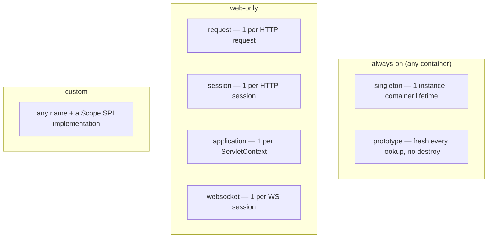
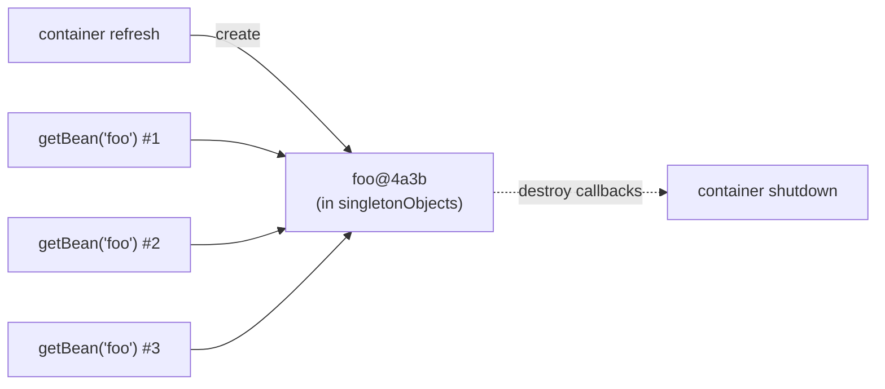
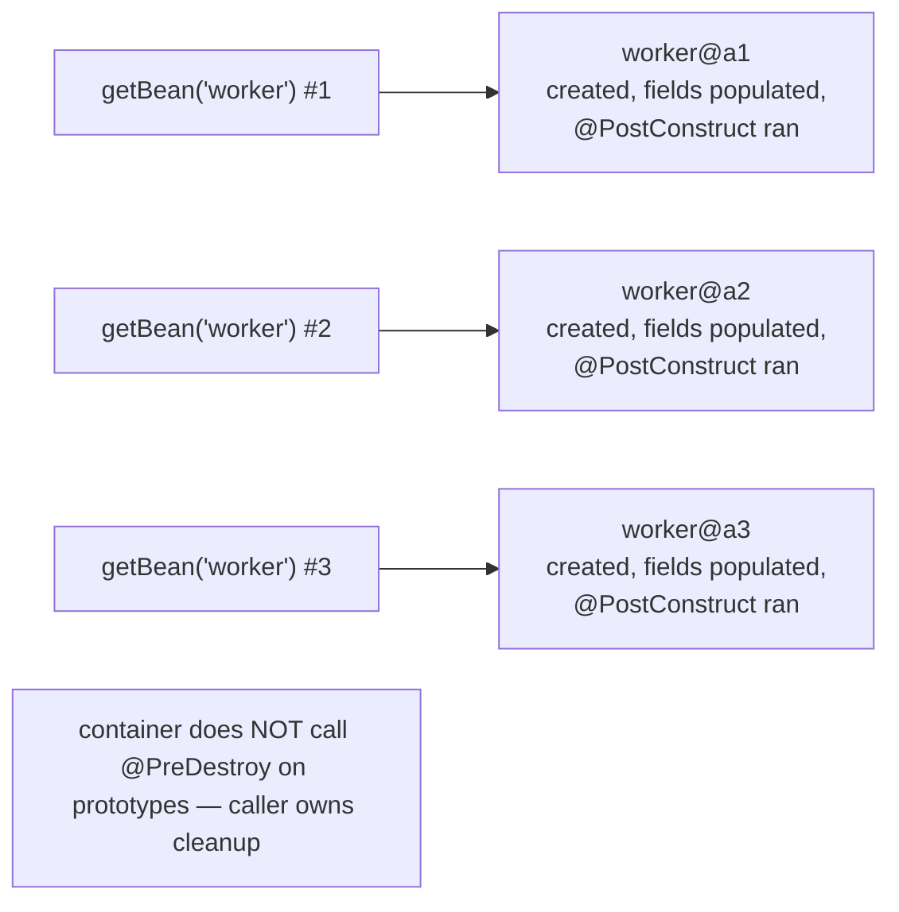
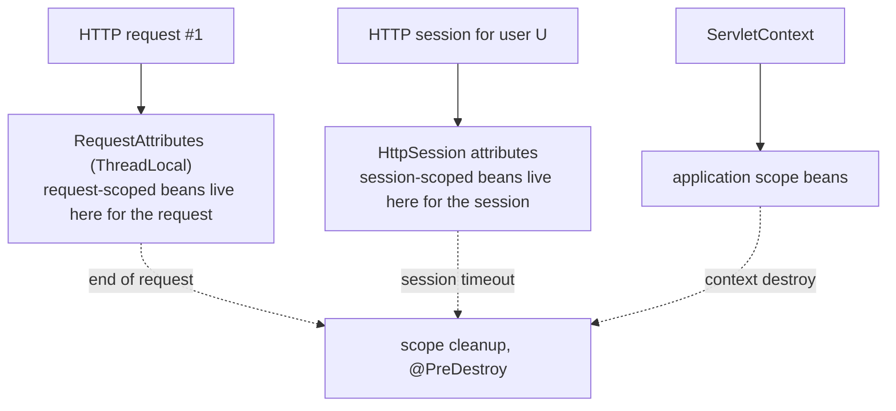
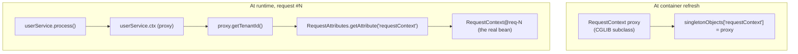
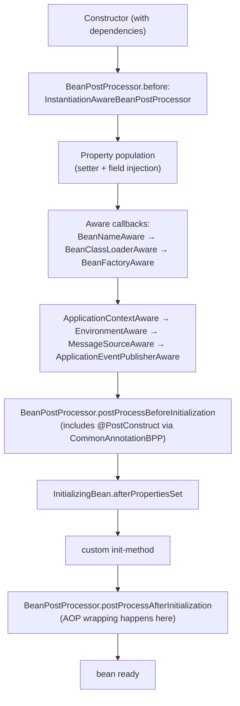
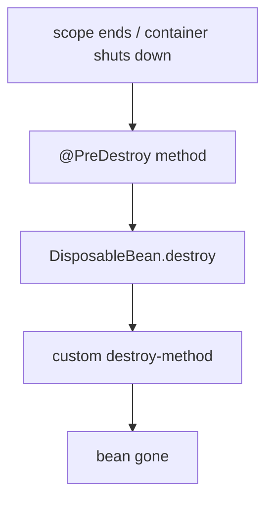
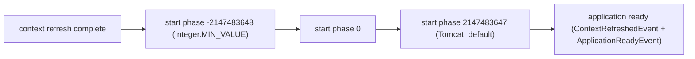
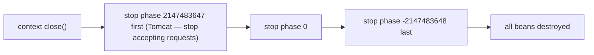
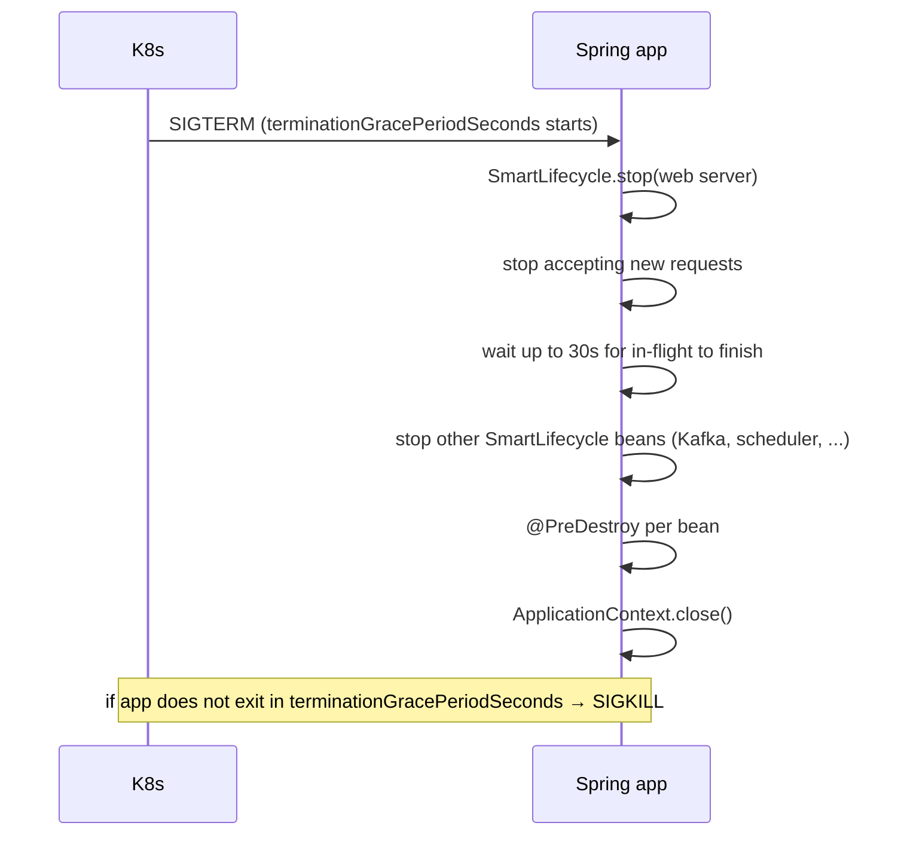

# Bean Scopes & Lifecycle

[T01](./T01-spring-core-ioc-container-and-beans.md) showed *the container* and [T02](./T02-dependency-injection-constructor-field-setter.md) the *injection styles*. Both assumed the simplest case: one bean instance per `BeanDefinition`, created at startup, destroyed at shutdown. That is the **singleton scope**, the default and overwhelmingly common case. But Spring has **five built-in scopes** plus a **custom scope** SPI, and each one changes:

- **When** the bean instance is created (startup, first lookup, every lookup, per HTTP request, per HTTP session, per WebSocket session, …)
- **Where** the instance is stored (the container's `singletonObjects` map, a `ThreadLocal`-backed request map, the servlet `HttpSession`, a `Map` keyed by WebSocket session id, …)
- **When** the instance's destruction callbacks run (container shutdown, request end, session timeout, never, …)

And on top of scope there is the **lifecycle**: every bean — regardless of scope — goes through a precisely-ordered sequence of callbacks (`Aware` interfaces → `BeanPostProcessor.before` → `@PostConstruct` → `InitializingBean.afterPropertiesSet` → custom `init-method` → `BeanPostProcessor.after`), and on shutdown the symmetric destruction sequence. On top of *that* sits `SmartLifecycle` — a separate, *phased* start/stop mechanism the container uses to coordinate components that need to start *in order* (Tomcat needs the `EntityManagerFactory` to be ready before it opens its socket; Kafka consumers need their thread pools running before they start polling). Understanding all three layers — scopes, per-bean lifecycle, container-wide `SmartLifecycle` — is what lets you reason about Spring's startup, shutdown, request handling, and graceful-stop behaviour like a senior engineer rather than guess.

The depth-bar this topic clears: **scope semantics** for all five built-in scopes plus custom; **scoped proxies** (the CGLIB/JDK trick that lets you inject a request-scoped bean into a singleton); **lifecycle phases** with exact ordering and the bytecode-level mechanism (reflection of annotated methods, `Method.invoke` dispatch); **`SmartLifecycle` phases** and how Spring Boot uses them to start Tomcat last and stop Kafka first; **JVM shutdown hooks** and the Kubernetes pre-stop / SIGTERM / SIGKILL timing budget that decides whether your in-flight requests complete or get cut.

> [!NOTE]
> Prerequisites: [Spring Core: IoC container & beans](./T01-spring-core-ioc-container-and-beans.md) (L4/C01/T01) — the `singletonObjects` cache and the eight-phase bootstrap; [Dependency Injection](./T02-dependency-injection-constructor-field-setter.md) (L4/C01/T02) — `@Autowired`, `ObjectProvider`. JVM shutdown hooks ([L3/C01/C02](../../L3-advanced-jvm/)). HTTP request/response lifecycle ([L2/C03/T05](../../L2-intermediate-backend/C03-networking-fundamentals/T05-http-https-lifecycle.md)).

## The Five Built-In Scopes

| Scope | Created | Cached in | Destroyed |
|-------|---------|-----------|-----------|
| **singleton** | container refresh (or first lookup if `@Lazy`) | `singletonObjects` (one per container) | container shutdown |
| **prototype** | every `getBean` / every injection point | nowhere — no cache | **never by the container** (caller owns it) |
| **request** | first lookup during an HTTP request | `RequestAttributes` (`ThreadLocal` for servlet; `Context` for WebFlux) | end of the request |
| **session** | first lookup during an HTTP session | `HttpSession` attribute | session timeout / invalidate |
| **application** | first lookup ever (during web context) | `ServletContext` attribute | servlet context destruction |
| `websocket` (Spring 4+) | first lookup during a WebSocket session | WebSocket session attribute | session close |

Custom scopes (one example below): JMS message scope, OAuth2 client scope, refresh-scope (Spring Cloud Config — recreate bean when config changes), tenant scope (multi-tenant SaaS).



The default is `singleton`. You change it with `@Scope`:

```java
@Service @Scope("prototype")
public class Worker { ... }

@Service @Scope(value = "request", proxyMode = ScopedProxyMode.TARGET_CLASS)
public class RequestContext { ... }
```

Note the **`proxyMode`** — covered shortly. Whenever you inject a shorter-lived scope into a longer-lived one (request into singleton, prototype into singleton), you need a scoped proxy.

## Singleton — The Default

One instance per container. Created at refresh time (or on first lookup if `@Lazy`). Stored in `singletonObjects`. Destroyed at container shutdown by the eight-phase pipeline's phase 8 (T01).



Singleton is the right default for **stateless** services and infrastructure components. The danger is hidden mutable state — a singleton with an instance field shared across all threads is a concurrency bomb (T01's `UserService` example holds `final` references; if it held a `List<User> cache` it would need synchronization). The pragma is "**singleton-scoped beans must be thread-safe by construction.**"

### `@Lazy`

By default, every singleton is created at container refresh — *eagerly*. `@Lazy` defers creation to the first `getBean` lookup. Two real uses:

1. **Startup latency optimization** — a bean that is expensive to construct and rarely used (a connection to a slow analytics warehouse) can be lazy.
2. **Breaking a startup cycle** — `@Lazy` on a constructor parameter wraps the dependency in a proxy that creates the real bean only on first method call. This is sometimes the cleanest fix for an awkward dependency graph.

```java
@Service
public class UserService {
    public UserService(@Lazy AnalyticsClient analytics) { ... }
}
```

The `analytics` field holds a proxy from startup; the real `AnalyticsClient` is constructed only the first time a `UserService` method actually calls a method on it.

### `@Lazy` on a `@Configuration`

Spring 5+: `@Lazy` on a `@Configuration` class makes *every* bean defined in it lazy. Spring Boot uses this internally for some auto-configurations.

## Prototype — Fresh Every Lookup

`@Scope("prototype")` produces a brand-new instance on every `getBean` call and every injection. The container constructs, populates, and runs initialization callbacks — and then **forgets** the bean. It is not cached, and **destruction callbacks are not called** (`@PreDestroy`, `DisposableBean.destroy`, custom `destroy-method` are all silently skipped). The caller owns the lifecycle.



Two real uses:

1. **A heavyweight class with per-use state** that you want Spring to *construct and wire* but not to share. Example: a `ReportRenderer` that holds a per-render template cache; you want a fresh one per HTTP request.
2. **Test fixtures** built through Spring (rare).

The catch you saw in T01: a *singleton* with a `@Autowired Worker` field gets exactly **one** worker — the same one for the singleton's whole lifetime — because the field is resolved once at singleton construction. The fix is `ObjectProvider<Worker>` or a `@Lookup`-method.

### Why Prototypes Are Often the Wrong Answer

The pattern "I need a per-use object but I want Spring to construct it" is usually solved better by **constructor-injecting a factory**:

```java
@Service
public class ReportService {
    private final ReportRendererFactory factory;   // singleton

    public ReportService(ReportRendererFactory factory) { this.factory = factory; }

    public byte[] render(Report r) {
        ReportRenderer renderer = factory.create();   // plain new — no Spring magic
        return renderer.render(r);
    }
}
```

Spring constructs `ReportService` and `ReportRendererFactory`; the factory's `create()` does plain `new ReportRenderer(...)`. The `ReportRenderer` is not a Spring bean — it has no `@PostConstruct`, no AOP wrapping, no scope. **This is almost always cleaner than a prototype-scoped Spring bean.** Prototype scope is a vestige of the early-2000s "everything must be a bean" mindset and is rarely the right tool today.

## Request, Session, Application, WebSocket — Web Scopes

The web-only scopes bind a bean's lifetime to a web concept. They are stored in **scope-specific containers**:

- **`request`** — stored in `RequestAttributes`, a `ThreadLocal` set by Spring's `RequestContextListener` or `RequestContextFilter` at the start of every HTTP request and cleared at the end. In WebFlux it is stored on the `Context` of the reactive chain (not `ThreadLocal`, because WebFlux is async).
- **`session`** — stored as an `HttpSession` attribute. The session's lifetime is managed by the servlet container (default 30 min idle timeout); when the session expires, Spring fires `HttpSessionBindingListener.valueUnbound` on the bean, which lets the scope run destruction callbacks.
- **`application`** — stored as a `ServletContext` attribute. One instance per servlet context (per deployed war or Boot app); destroyed when the context is destroyed.
- **`websocket`** — stored on the WebSocket session.



A canonical use:

```java
@Component
@Scope(value = "request", proxyMode = ScopedProxyMode.TARGET_CLASS)
public class RequestContext {
    private String tenantId;
    private String correlationId;
    // getters/setters
}
```

Inject it into any singleton — every request gets its own `RequestContext`, automatically isolated.

### Scoped Proxies — Injecting a Request-Scoped Bean Into a Singleton

The mechanical problem: if `UserService` is a singleton and `RequestContext` is request-scoped, `UserService`'s `RequestContext` field is set *once* at `UserService` construction (singleton-creation time, *before any request exists*). You cannot inject a real request-scoped bean — there isn't one yet, and even when requests arrive, the singleton would hold the same one forever.

Spring's solution: at startup, when the container sees `proxyMode = TARGET_CLASS` (or `INTERFACES`) on a scoped bean, it does **not** put a real `RequestContext` in `singletonObjects`. It puts a **proxy** — a CGLIB-generated subclass (`TARGET_CLASS`) or a JDK `Proxy` (`INTERFACES`) — whose every method intercepts the call and looks up the *real* `RequestContext` from the current scope (`RequestAttributes.getAttribute(...)`) at call time. Each HTTP request thus sees its own real `RequestContext`, even though every singleton holds the same proxy.



The proxy adds one extra method call per access (proxy → scope lookup → real bean → method). The cost is ~50–100 ns per call, well under the budget for HTTP-handling code. **Always set `proxyMode` when injecting a shorter-lived scope into a longer-lived one.** Without it, the singleton gets one real `RequestContext` (the one from whichever happens to be the current request when the singleton is constructed) and silently breaks isolation.

### What "End of Request" Means

The request scope ends when Spring's `RequestContextListener` / `RequestContextFilter` clears the `RequestAttributes`. This is wired automatically by Spring Boot. Before the clear, Spring iterates the scope's contents and calls each bean's destruction callbacks (`@PreDestroy`, etc.) — symmetric with the singleton scope's shutdown loop but bounded to the request's life.

For WebFlux: scope storage is on the reactive `Context`, propagated through the operator chain. Spring 5.3+ supports `request` scope in WebFlux with caveats — request-scoped beans must be accessed inside the reactive chain and resolved via `Mono.deferContextual(...)`. This is one (small) reason WebFlux apps are more careful with scope than servlet apps.

## Custom Scopes — The SPI

The `org.springframework.beans.factory.config.Scope` interface is the SPI:

```java
public interface Scope {
    Object get(String name, ObjectFactory<?> objectFactory);
    Object remove(String name);
    void registerDestructionCallback(String name, Runnable callback);
    Object resolveContextualObject(String key);
    String getConversationId();
}
```

A complete tenant scope for multi-tenant SaaS:

```java
public class TenantScope implements Scope {
    private static final ThreadLocal<String> CURRENT_TENANT = new ThreadLocal<>();
    private final Map<String, Map<String, Object>> tenants = new ConcurrentHashMap<>();

    public static void setTenant(String tenantId) { CURRENT_TENANT.set(tenantId); }
    public static void clearTenant() { CURRENT_TENANT.remove(); }

    @Override
    public Object get(String name, ObjectFactory<?> factory) {
        String t = CURRENT_TENANT.get();
        if (t == null) throw new IllegalStateException("No tenant in context");
        return tenants.computeIfAbsent(t, k -> new ConcurrentHashMap<>())
                       .computeIfAbsent(name, k -> factory.getObject());
    }
    // ... remove, registerDestructionCallback, ...
}

@Configuration
public class TenantConfig {
    @Bean public CustomScopeConfigurer tenantScope() {
        CustomScopeConfigurer c = new CustomScopeConfigurer();
        c.addScope("tenant", new TenantScope());
        return c;
    }
}

@Component @Scope(value = "tenant", proxyMode = ScopedProxyMode.TARGET_CLASS)
public class TenantConfig { ... }
```

Now every `@Scope("tenant")` bean is partitioned per tenant, with the current tenant pulled from a `ThreadLocal` your filter / interceptor sets at request start. Spring Cloud's `refresh` scope works exactly the same way, with the scope-storage `Map` cleared on a config-refresh event.

## The Per-Bean Lifecycle — Precise Ordering

Every bean — singleton, prototype, request, scoped, custom — goes through the same lifecycle phases during *its* construction. The exact order on creation:



And the *destruction* order — symmetric, in reverse:



### Initialization Callbacks — All Three Ways

Three idiomatic patterns; pick **one** per bean.

**`@PostConstruct`** — annotation on a method (JSR-250, `jakarta.annotation.PostConstruct`):

```java
@Service
public class UserService {
    private final UserRepository repo;
    public UserService(UserRepository repo) { this.repo = repo; }

    @PostConstruct
    void warmCache() {
        // run after fields are wired but before the bean is exposed
        repo.findActive().forEach(this::cacheKey);
    }
}
```

Most idiomatic. Processed by `CommonAnnotationBeanPostProcessor` during `postProcessBeforeInitialization`.

**`InitializingBean`** — interface:

```java
@Service
public class UserService implements InitializingBean {
    @Override public void afterPropertiesSet() throws Exception { ... }
}
```

Coupled to Spring (interface in `org.springframework`). Used in older code; modern code prefers `@PostConstruct` for framework neutrality.

**Custom `init-method`** — declared on the `@Bean`:

```java
@Bean(initMethod = "open")
public KafkaProducer<String, String> producer() {
    return new KafkaProducer<>(props);
}
```

Most useful for **third-party classes** you cannot annotate. The producer class is from `org.apache.kafka` — you cannot decorate it with `@PostConstruct`, but you can tell Spring "after the bean is wired, call its `open()` method."

The ordering when more than one is present (rare): `@PostConstruct` first, then `InitializingBean.afterPropertiesSet`, then the custom `init-method`. Spring will not detect or warn about overlap.

### Destruction Callbacks — Symmetric

`@PreDestroy`, `DisposableBean.destroy`, custom `destroyMethod`. Same ordering rules in reverse. **Critical**: prototypes get *none* of these. If you need cleanup on a prototype, you must do it yourself in the calling code.

### The `Aware` Family

Implement an `*Aware` interface to receive a *container service*:

| Interface | Receives |
|-----------|---------|
| `BeanNameAware` | the bean's name (a `String`) |
| `BeanClassLoaderAware` | the classloader used to load the bean's class |
| `BeanFactoryAware` | the `BeanFactory` itself |
| `ApplicationContextAware` | the `ApplicationContext` |
| `EnvironmentAware` | the `Environment` (property sources, active profiles) |
| `MessageSourceAware` | the i18n `MessageSource` |
| `ApplicationEventPublisherAware` | the event publisher (for raising application events) |
| `ResourceLoaderAware` | for loading `Resource`s |
| `EmbeddedValueResolverAware` | for `${...}` resolution |

These are the "I need to know about the container" hatches. **Avoid them when you can** — they couple the bean to Spring. Modern alternatives:

- Instead of `EnvironmentAware`, inject `Environment` via constructor.
- Instead of `ApplicationEventPublisherAware`, inject `ApplicationEventPublisher` via constructor.
- Instead of `ApplicationContextAware`, inject the specific beans you need.

Every `Aware` callback is one of nine *interface*-driven hatches; Spring favours **constructor injection of the relevant types** in modern code.

## `SmartLifecycle` — Phased Start/Stop Across Beans

A separate mechanism from the per-bean lifecycle. **`SmartLifecycle`** is for beans that need to **start** and **stop** as units once the container is otherwise built. The classic example: an embedded Tomcat. Spring wants to construct Tomcat (and all its filter beans, controller beans, …) before "starting" — opening the listening socket — because if a request arrives mid-construction, half the chain may not exist.

`SmartLifecycle` has two key methods plus phasing:

```java
public interface SmartLifecycle extends Lifecycle, Phased {
    boolean isRunning();
    void start();
    void stop();
    int getPhase();           // ordering — lower phase starts first, stops last
    boolean isAutoStartup();  // start as part of context start?
    void stop(Runnable callback);   // async stop with completion callback
}
```

The container starts all `SmartLifecycle` beans in **ascending phase order** after refresh, and stops them in **descending phase order** on shutdown:





Spring Boot uses `SmartLifecycle` to:

- Start Tomcat at the highest phase (`Integer.MAX_VALUE`) — last to start, first to stop. This means database pools, EntityManagerFactory, Kafka consumers are all up *before* the first HTTP request is accepted.
- Start Kafka listener containers at phase `2147481600` (just below the web server). They begin polling before the web server opens.
- Stop the web server first on shutdown — so no new requests come in while we drain in-flight ones.

### Graceful Shutdown

Spring Boot 2.3+ ships **graceful shutdown** out of the box. On SIGTERM:

1. `SmartLifecycle.stop(Runnable)` is called on the web server first.
2. The web server stops accepting new connections (closes the listen socket) but keeps existing connections open.
3. Spring waits up to `spring.lifecycle.timeout-per-shutdown-phase` (default 30 s) for in-flight requests to finish.
4. Then the rest of the `SmartLifecycle` chain stops in phase order.
5. Then the standard per-bean `@PreDestroy` runs on every singleton, in reverse-dependency order.

Total budget: ~30–60 seconds for a clean shutdown. Kubernetes default `terminationGracePeriodSeconds` is 30 — tune *both* together or your pod gets `SIGKILL`ed mid-shutdown, with in-flight requests dropped.



## Application Events — Hooks Into the Lifecycle

Spring fires *application events* at key moments. You listen with `@EventListener`:

| Event | When | Use |
|-------|------|-----|
| `ContextRefreshedEvent` | after `refresh()` completes | "the container is ready" |
| `ApplicationStartedEvent` (Boot) | after `SmartLifecycle.start` | "the app started" — runners run after this |
| `ApplicationReadyEvent` (Boot) | after `ApplicationRunner` / `CommandLineRunner` | "the app is fully ready to serve" — Kubernetes readiness flips green here |
| `ContextStartedEvent` | `ConfigurableApplicationContext.start()` | rare |
| `ContextStoppedEvent` | `stop()` called | rare |
| `ContextClosedEvent` | `close()` called | "shutdown started" |
| `ApplicationFailedEvent` (Boot) | startup threw | log and bail |

```java
@Component
public class ReadinessLogger {
    @EventListener
    public void onReady(ApplicationReadyEvent e) {
        System.out.println("READY at " + Instant.now());
    }
}
```

Use `ApplicationReadyEvent` to wire one-time post-startup work — registering with service discovery, sending a startup notification, warming a cache from disk.

## `ApplicationRunner` and `CommandLineRunner`

Beans that implement these run **after** `SmartLifecycle.start` and **before** `ApplicationReadyEvent`:

```java
@Component
public class WarmupRunner implements ApplicationRunner {
    private final UserRepository repo;
    public WarmupRunner(UserRepository repo) { this.repo = repo; }
    @Override public void run(ApplicationArguments args) {
        repo.findActive();   // prime the JPA second-level cache
    }
}
```

`ApplicationRunner` gets parsed `ApplicationArguments` (options vs non-options); `CommandLineRunner` gets the raw `String[]`. Multiple runners are ordered by `@Order` or `Ordered`.

## Worked Example — All Phases Visible

```java
@Service @Scope("singleton")
public class PaymentService implements
        InitializingBean, DisposableBean, BeanNameAware {

    private final PaymentGateway gateway;
    private String beanName;

    public PaymentService(PaymentGateway gateway) {
        this.gateway = gateway;
        System.out.println("1. ctor: gateway=" + gateway);
    }

    @Override public void setBeanName(String n) {
        this.beanName = n;
        System.out.println("2. BeanNameAware.setBeanName: " + n);
    }

    @PostConstruct void postConstruct() {
        System.out.println("3. @PostConstruct: name=" + beanName);
    }

    @Override public void afterPropertiesSet() {
        System.out.println("4. InitializingBean.afterPropertiesSet");
    }

    @Override public void destroy() {
        System.out.println("6. DisposableBean.destroy");
    }

    @PreDestroy void preDestroy() {
        System.out.println("5. @PreDestroy");
    }
}
```

Output on startup and shutdown:

```
1. ctor: gateway=StripeGateway$EnhancerBySpringCGLIB@4a3b
2. BeanNameAware.setBeanName: paymentService
3. @PostConstruct: name=paymentService
4. InitializingBean.afterPropertiesSet
... runtime ...
5. @PreDestroy
6. DisposableBean.destroy
```

Exact order. Every Spring bean follows this sequence, every time. The five labelled steps map exactly to the `doCreateBean` pipeline of T01.

## Memory Cost of Different Scopes

| Scope | Per-instance memory footprint | Notes |
|-------|:-----------------------------:|-------|
| singleton | bean instance + 48 B (`singletonObjects` entry) + 16 B (`dependentBeanMap` entry per dependee) | dominant — one per container |
| prototype | bean instance only (heap, freed by GC when caller releases) | no container retention |
| request | bean instance + ~48 B per request in `RequestAttributes` map | freed at end of request |
| session | bean instance + ~48 B in `HttpSession` | freed at session timeout (default 30 min) — beware large session-scoped beans on high-cardinality sessions |
| application | bean instance + ~48 B in `ServletContext` | freed on context destroy |

Session-scope is the most dangerous: a 1 MB session bean × 100,000 active sessions = 100 GB of heap. Real apps almost never need session scope; request scope plus a database table is usually the answer.

## Common Pitfalls

> [!WARNING]
> **Injecting a request-scoped bean into a singleton without `proxyMode`.** The singleton captures one real bean at construction time; every request thereafter sees the *same* bean. Subtle, often invisible until a request leaks state. Always use `proxyMode = TARGET_CLASS` (or `INTERFACES`).

> [!WARNING]
> **Expecting `@PreDestroy` on a prototype.** It will not run. The container forgets prototypes after construction. If you need cleanup, return a wrapper that does it or use try-with-resources at the call site.

> [!WARNING]
> **Holding a `ThreadLocal` in a singleton without cleanup.** Common in custom scopes and web filters. If you forget to clear the `ThreadLocal` at end-of-request, the next request handled by the same thread inherits the previous request's value — a classic source of cross-tenant data leaks in multi-tenant SaaS.

> [!WARNING]
> **Kubernetes `terminationGracePeriodSeconds` ≪ `spring.lifecycle.timeout-per-shutdown-phase`.** SIGKILL hits before Spring finishes the graceful drain; in-flight requests die mid-flight. Set both consistently, typically 30–60 s.

> [!WARNING]
> **Using `BeanFactoryPostProcessor` to "fix" a circular dependency** by hot-patching definitions. The cycle is a design smell. Fix it.

## Practice

1. Create a request-scoped `RequestContext` bean and inject it into a singleton `UserService` *without* `proxyMode`. Hit your endpoint twice from different threads with different `X-Tenant-ID` headers. Confirm the singleton sees the *same* `tenantId` regardless — the bug. Add `proxyMode = TARGET_CLASS` and confirm isolation returns.
2. Implement a `Scope` for "tenant" that pulls the tenant from a `ThreadLocal` your filter sets. Add a tenant-scoped bean. Confirm distinct tenant ids produce distinct bean instances.
3. Implement `SmartLifecycle` on a bean that polls Kafka. Use phase `Integer.MAX_VALUE - 1`. Confirm it starts after Spring Data JPA is ready and stops before Tomcat. Use logging to observe phase order.
4. Add an `ApplicationRunner` and a `CommandLineRunner` to the same app. Confirm both run after `ApplicationStartedEvent` and before `ApplicationReadyEvent`. Try `@Order(1)` on one and `@Order(2)` on the other.
5. Add `@PostConstruct`, `InitializingBean.afterPropertiesSet`, and a custom `@Bean(initMethod = ...)` to the same bean. Print from each. Confirm the documented ordering.
6. Time a graceful shutdown. Start a request that sleeps 10 seconds; before it finishes, send SIGTERM to the JVM. Confirm Spring waits, drains, completes the request, and shuts cleanly.
7. Convert a prototype-scoped `Worker` to a factory pattern (singleton `WorkerFactory` with a `create()` returning plain `new`). Confirm the test surface shrinks (no more `ObjectProvider`, no more `@Lookup`), and the design feels lighter. Reflect: when would prototype scope still have been the better choice?

## Recap

You should now be able to:

- Name and contrast all five built-in scopes (singleton, prototype, request, session, application) plus `websocket`, and explain *when* each instance is created, *where* it is stored, and *when* it is destroyed.
- Choose between `@Lazy`, eager singleton, prototype, and a factory-pattern singleton for "per-use" needs, and articulate the trade-offs.
- Explain the scoped-proxy mechanism (CGLIB for `TARGET_CLASS`, JDK Proxy for `INTERFACES`) and why injecting a shorter-lived scope into a longer-lived one *requires* a proxy.
- Implement a custom `Scope` SPI (tenant scope, refresh scope) and register it with `CustomScopeConfigurer`.
- Walk the per-bean lifecycle in order: constructor → property population → `Aware` callbacks → `BeanPostProcessor.before` → `@PostConstruct` → `InitializingBean.afterPropertiesSet` → custom `init-method` → `BeanPostProcessor.after` → ready.
- Walk the destruction order: `@PreDestroy` → `DisposableBean.destroy` → custom `destroyMethod`.
- Distinguish per-bean lifecycle from `SmartLifecycle`'s phased start/stop, and explain how Spring Boot uses `SmartLifecycle` phases to coordinate Tomcat / Kafka / scheduler startup and graceful shutdown.
- Configure `spring.lifecycle.timeout-per-shutdown-phase` and Kubernetes `terminationGracePeriodSeconds` consistently for graceful in-flight request draining on SIGTERM.
- Subscribe to lifecycle events (`ContextRefreshedEvent`, `ApplicationReadyEvent`, `ContextClosedEvent`) and use `ApplicationRunner` / `CommandLineRunner` for post-startup, pre-ready work.

## Next

Continue to [Spring Configuration — Java / Annotation / XML](./T04-spring-configuration-java-annotation-xml.md) to see how the *configuration source itself* — `@Configuration`, `@Import`, `@PropertySource`, `@Profile`, the deprecated XML approach — is parsed by the container into bean definitions before any of the lifecycle in this topic runs.
