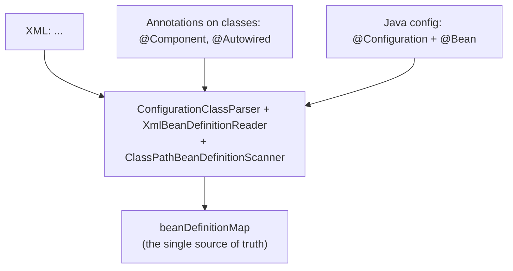
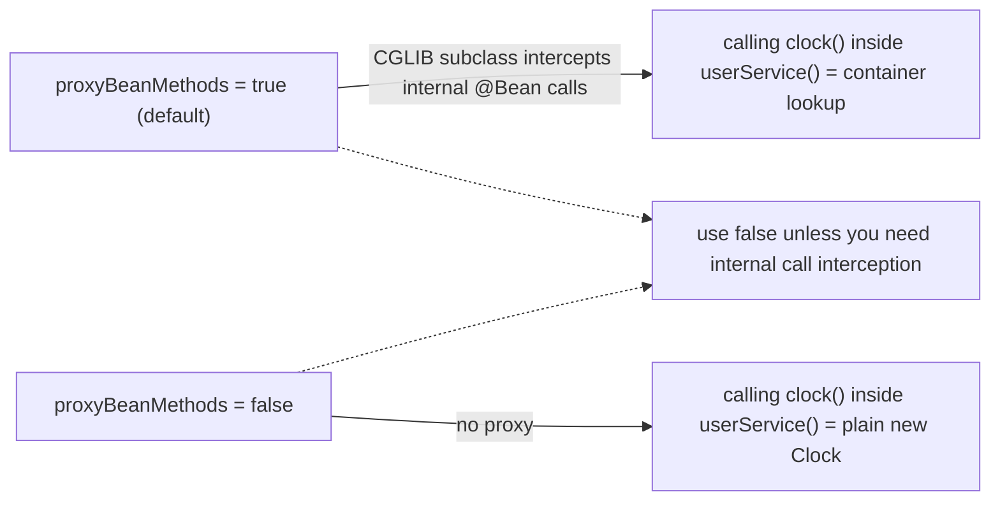
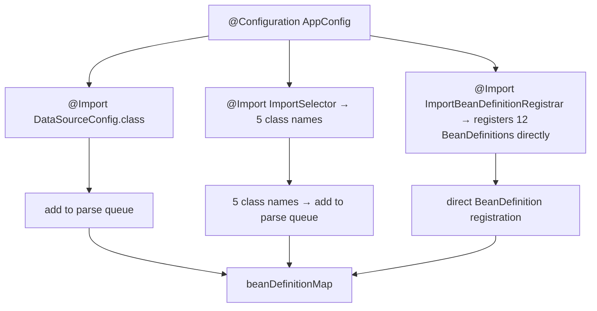
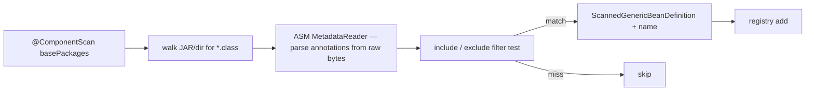
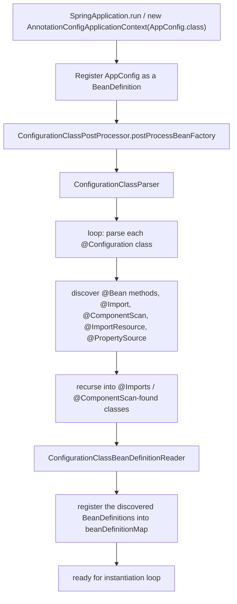
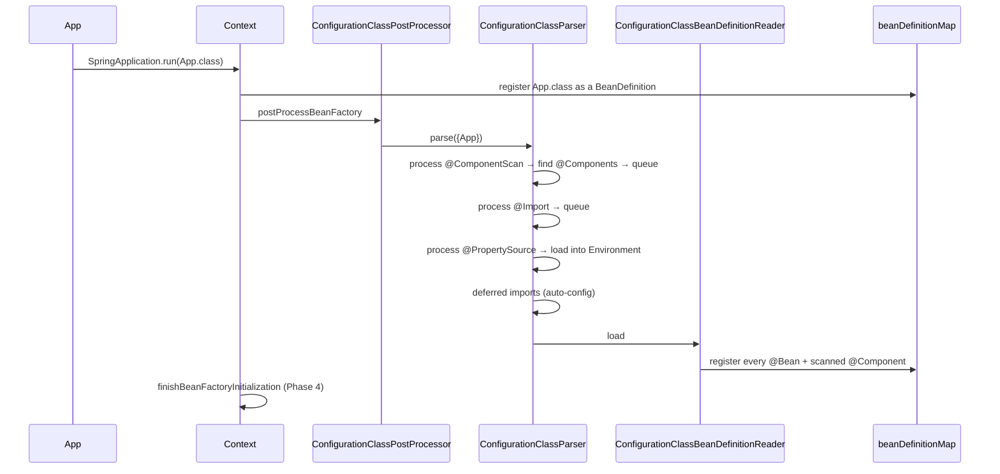
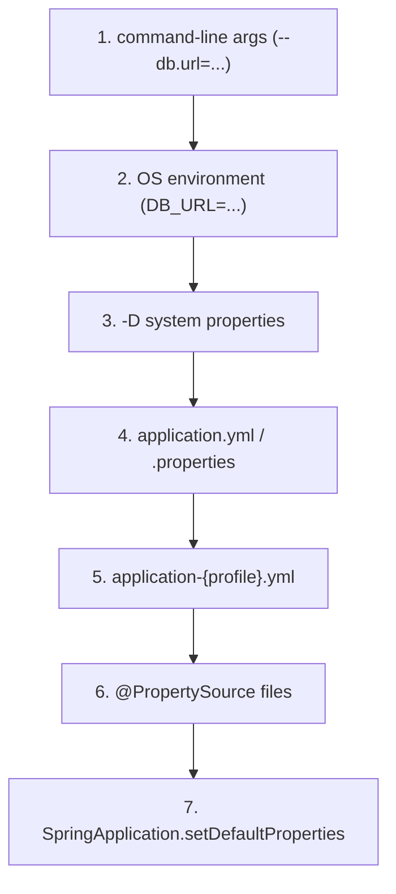
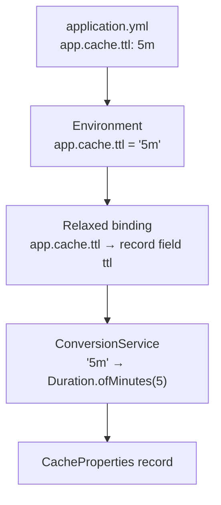
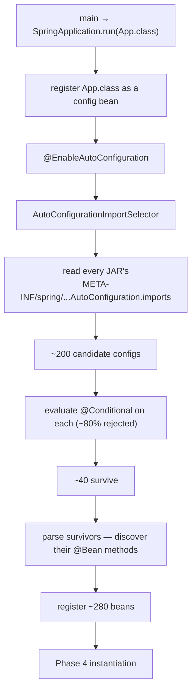

# Spring Configuration (Java / Annotation / XML)

T01–T03 told the story from "the container is running" forward — what beans are, how dependencies are resolved, what the lifecycle looks like. **This topic backs up one step**: how does the container *learn* about your beans in the first place? Three historical answers, each layered on top of the previous, all three still working in 2026:

1. **XML configuration** (2003 → present) — `<beans>` XML files that list every bean. The original Spring 1.x style. Still supported, occasionally still encountered in legacy code, sometimes still useful for very-late-binding scenarios (Spring Cloud Config rebooting beans, dynamic admin tools).
2. **Annotation configuration** (Spring 2.5, 2007 → present) — `@Component` + `@Autowired` on classes, plus an `<context:component-scan>` in XML. The "annotation + scan" intermediate step.
3. **Java configuration** (Spring 3.0, 2009 → present) — `@Configuration` classes with `@Bean` methods, and `@ComponentScan` as a Java annotation. The modern standard, especially since Spring Boot's `@SpringBootApplication` makes Java config the path of least resistance.

A senior Spring engineer needs all three because real codebases mix them: a 15-year-old service has XML at the bottom, annotation in the middle, Java config layered on top, and Spring Boot's auto-configuration imported via the meta-annotation. Understanding the *parsing pipeline* — how all three end up as `BeanDefinition`s in the same `beanDefinitionMap` — is what lets you debug the very common failure modes of "I added `@Bean`, why isn't it picked up" / "two `@ComponentScan` annotations are loading the same class twice" / "my `application.yml` property isn't being seen".

The depth-bar this topic clears: at the **language layer**, the syntax and semantics of every configuration mechanism (`@Configuration`, `@Bean`, `@ComponentScan`, `@Import`, `@ImportResource`, `@PropertySource`, `@Profile`, `@Conditional`, `@Value`, `@ConfigurationProperties`, plus XML's `<beans>` / `<context:*>` / `<util:*>` elements). At the **memory layer**, what the `ConfigurationClassPostProcessor` does — ASM-parses every candidate, builds a `ConfigurationClass` graph (~1 KB each), walks `@Import` recursively, registers `BeanDefinition`s. At the **architecture layer** — the heart — the **complete bootstrap parse**: from `SpringApplication.run` to a populated `beanDefinitionMap`, including how `@SpringBootApplication` triggers `EnableAutoConfiguration` → `AutoConfigurationImportSelector` → ~200 auto-config classes → conditional evaluation → the final ~300-bean set Spring Boot serves with on a default starter project.

> [!NOTE]
> Prerequisites: [Spring Core: IoC container & beans](./T01-spring-core-ioc-container-and-beans.md), [Dependency Injection](./T02-dependency-injection-constructor-field-setter.md), and [Bean Scopes & Lifecycle](./T03-bean-scopes-and-lifecycle.md). Modest familiarity with YAML, properties files, and the OS environment.

## The Three Configuration Styles, Side By Side

The same two-bean setup in all three styles makes the trade-offs concrete.

**Java configuration** (modern):

```java
@Configuration
public class AppConfig {

    @Bean
    public Clock clock() { return Clock.systemUTC(); }

    @Bean
    public UserService userService(UserRepository repo, Clock clock) {
        return new UserService(repo, clock);
    }
}
```

**Annotation configuration** (post-2.5 to present, in `@Component` style):

```java
@Component
public class Clock { ... }   // unrealistic for Clock but works for your own classes

@Service
public class UserService {
    public UserService(UserRepository repo, Clock clock) { ... }
}

// In a @Configuration somewhere:
@ComponentScan("com.example")
public class ComponentScanConfig { }
```

**XML configuration** (legacy):

```xml
<beans xmlns="http://www.springframework.org/schema/beans">
    <bean id="clock" class="java.time.Clock" factory-method="systemUTC"/>
    <bean id="userService" class="com.example.UserService">
        <constructor-arg ref="userRepository"/>
        <constructor-arg ref="clock"/>
    </bean>
</beans>
```



All three end at the same `beanDefinitionMap`. The differences are purely *how the recipe got written*. Once written, it is consumed by the same `doCreateBean` pipeline (T01).

## Java Configuration — The Modern Default

### `@Configuration` and `@Bean` Reviewed

`@Configuration` marks a class as a source of bean definitions. `@Bean` marks each method whose return value should be a bean. Reviewed from T01:

- Each `@Bean` method's name is the bean name (override with `@Bean("alias")` or `@Bean(name = {"a", "b"})`).
- The method's return type is the bean's type.
- The method's parameters are dependencies, resolved like constructor parameters (by type, with `@Qualifier` / `@Primary` for tie-breaking).
- `@Configuration` classes are themselves beans (registered as singletons by name = class simple name with lowercase first char).
- `@Configuration` triggers a CGLIB subclass with internal call interception (T01 § Why `@Configuration` is Special) so calling one `@Bean` method from another consults the container.

### `proxyBeanMethods = false` — "Lite" `@Configuration`

Spring 5.2+: `@Configuration(proxyBeanMethods = false)` opts out of the CGLIB-proxy mechanism. Internal `@Bean` calls then go through plain Java method calls, producing fresh instances. This is observationally identical to `@Component` with `@Bean` methods.

Why opt out? Two reasons:

1. **Startup time / metaspace.** No CGLIB subclass means no bytecode generation, no extra class definition, no `Class.forName` of the proxy. For Spring Boot auto-configuration with ~200 config classes, that is ~200 fewer subclasses (each ~5 KB metaspace) and one less reflective initialization step per config — measurable in cold start (~30–80 ms saved).
2. **GraalVM Native Image compatibility.** CGLIB generates bytecode at runtime, which native image cannot execute. Lite configuration sidesteps the issue.

The trade-off: you must not call one `@Bean` method from another (because the call won't be intercepted). Spring Boot uses `proxyBeanMethods = false` on every internal auto-configuration class and recommends it for your config classes where internal `@Bean` calls do not happen. The bean methods can still *take parameters* — Spring resolves those from the container regardless of the proxy mode.

```java
@Configuration(proxyBeanMethods = false)
public class AppConfig {
    @Bean
    public Clock clock() { return Clock.systemUTC(); }

    @Bean
    public UserService userService(UserRepository repo, Clock clock) {
        return new UserService(repo, clock);   // 'clock' comes from container, not internal call
    }
}
```



### `@Import` — Composing Configurations

A configuration class can compose others via `@Import`:

```java
@Configuration
@Import({DataSourceConfig.class, SecurityConfig.class, MetricsConfig.class})
public class AppConfig {
    // ...
}
```

`@Import` is processed by `ConfigurationClassParser.processImports`. Each imported class is *also* parsed as a configuration source. Recursion happens — if `DataSourceConfig` itself has `@Import(...)`, those get processed too. The container ends up with the union of every `@Bean` and `@ComponentScan` in the transitive closure.

`@Import` accepts three kinds of class:

1. **`@Configuration` classes** — straightforward. Add their `@Bean` methods.
2. **`ImportSelector`** — a class that returns an array of fully-qualified class names to import. **This is how `@EnableAutoConfiguration` works** — `AutoConfigurationImportSelector.selectImports` returns ~200 class names.
3. **`ImportBeanDefinitionRegistrar`** — a class that programmatically registers `BeanDefinition`s into the registry. The most powerful and most invasive — used by `@MapperScan` (MyBatis), `@EnableJpaRepositories` (Spring Data JPA), `@EnableFeignClients` (Spring Cloud OpenFeign).



The `DeferredImportSelector` variant is processed *after* all regular configuration parsing completes. This lets it see the final picture (e.g., what was scanned and what conditions evaluate to true) before deciding what to import. Auto-configuration uses it.

### `@ImportResource` — Mixing in XML

When you have a legacy XML config you cannot eliminate:

```java
@Configuration
@ImportResource("classpath:legacy-beans.xml")
public class AppConfig { ... }
```

Spring processes the XML via `XmlBeanDefinitionReader` and merges the resulting `BeanDefinition`s into the same registry. Used in real codebases to gradually migrate from XML to Java config — leave the existing XML untouched, declare a `@Configuration` alongside, then move bean definitions one at a time.

### `@ComponentScan` — The Scan Trigger

```java
@Configuration
@ComponentScan(
    basePackages = {"com.example.service", "com.example.web"},
    excludeFilters = @ComponentScan.Filter(type = FilterType.REGEX, pattern = ".*Legacy.*"),
    includeFilters = @ComponentScan.Filter(type = FilterType.ANNOTATION, classes = MyMarker.class)
)
public class AppConfig { }
```

`@ComponentScan` tells `ConfigurationClassParser` to walk one or more packages (recursively) looking for `@Component` (and meta-annotated derivatives), apply filters, and register matching classes as `BeanDefinition`s.

The scanner is **`ClassPathBeanDefinitionScanner`**. Its work, mechanically:

1. Resolve `basePackages` to a list of resource paths: `com.example.service` → `classpath*:com/example/service/**/*.class`.
2. Use `PathMatchingResourcePatternResolver` to find every matching `Resource` (JAR entries, exploded classes-dir files).
3. For each `Resource`, open as a `MetadataReader`. The default `CachingMetadataReaderFactory` wraps an ASM `ClassReader` that parses *only* the bytecode bits needed for annotation metadata — class name, superclass, annotation values. **No class loading happens.**
4. Apply `includeFilters` and `excludeFilters`. The default include filter matches `@Component` and its meta-annotated derivatives.
5. For each match, build a `ScannedGenericBeanDefinition`, name it (`AnnotationBeanNameGenerator` — class simple name with lowercase first char; configurable via `@Component("custom")`), and register it.

Memory-wise, each scanned class while in the parser's working set costs ~2 KB; this is released after refresh. The kept `BeanDefinition` is ~300 B. For a 1,000-class JAR with 50 `@Component` matches, scanning takes ~80–150 ms (dominated by JAR I/O) and adds ~15 KB to the registry.



### Compound Annotations — `@SpringBootApplication`

`@SpringBootApplication` is the canonical Spring Boot bootstrap annotation. It is **meta-annotated** as:

```java
@Target(ElementType.TYPE)
@Retention(RetentionPolicy.RUNTIME)
@Documented
@Inherited
@SpringBootConfiguration   // = @Configuration
@EnableAutoConfiguration   // = @Import(AutoConfigurationImportSelector.class)
@ComponentScan(excludeFilters = { ... })   // scan the same-package downward
public @interface SpringBootApplication { ... }
```

Placing `@SpringBootApplication` on your `Application` class therefore is *equivalent to*:

```java
@Configuration
@EnableAutoConfiguration
@ComponentScan
public class Application { ... }
```

The default base package for `@ComponentScan` is the **package of the annotated class** — the standard layout reason your `Application.java` should sit at the *root* of your `com.example` package.

## Annotation Configuration — `@Component` Style

Pre-Java-config (Spring 2.5–3.0), the style was: annotate classes with `@Component`, declare a scan target in XML. With Java config in 3.0+, you replace the XML scan trigger with a Java `@ComponentScan`, but the annotations on the classes are the same.

Practical guidance for choosing between `@Component` style and `@Bean` style:

| Use `@Component` on the class when… | Use `@Bean` in a `@Configuration` when… |
|---|---|
| It's a class you wrote | It's a class you didn't write (third-party) |
| It needs constructor injection of beans | It needs a complex builder (Jackson, OkHttp, Kafka producer) |
| One bean per class | Multiple instances with different config (two `DataSource`s for read/write) |
| Stereotype expressivity helps (`@Service`, `@Repository`) | Bean depends on `@Value` properties whose binding logic you want explicit |

A typical real app uses both: domain services are `@Component`-scanned; infrastructure objects (`RestClient`, `RedisTemplate`, `KafkaProducer`, `ObjectMapper`) are `@Bean`-declared in dedicated `*Config` classes.

## XML Configuration — The Original

The 2003 Spring 1.x style. A bean is declared in an XML element; dependencies are wired by id reference:

```xml
<?xml version="1.0" encoding="UTF-8"?>
<beans xmlns="http://www.springframework.org/schema/beans"
       xmlns:xsi="http://www.w3.org/2001/XMLSchema-instance"
       xmlns:context="http://www.springframework.org/schema/context"
       xsi:schemaLocation="...">

    <bean id="dataSource" class="org.apache.commons.dbcp2.BasicDataSource"
          destroy-method="close">
        <property name="url" value="${db.url}"/>
        <property name="username" value="${db.user}"/>
        <property name="password" value="${db.pass}"/>
    </bean>

    <bean id="userRepository" class="com.example.JdbcUserRepository">
        <constructor-arg ref="dataSource"/>
    </bean>

    <context:property-placeholder location="classpath:db.properties"/>
    <context:component-scan base-package="com.example.service"/>
</beans>
```

XML is parsed by **`XmlBeanDefinitionReader`** via `BeanDefinitionDocumentReader`, with namespace handlers (`ContextNamespaceHandler`, `TxNamespaceHandler`, etc.) consuming the custom tags. Each `<bean>` becomes a `GenericBeanDefinition` registered in the registry. The `<context:component-scan>` triggers the same `ClassPathBeanDefinitionScanner` the annotation-driven path uses.

### Why XML Is Mostly Gone

Three painful properties:

1. **No compile-time checking.** Typo a class name (`com.example.UserServce`) and the failure is at startup, not at compile.
2. **Verbose.** A 4-line Java config becomes 12 lines of XML.
3. **No real refactoring support.** Rename `UserService` in your IDE and the XML strings are not updated. Find-usages does not find `<bean class="com.example.UserService"/>`.

### Where XML Still Wins

- **Hot reload at runtime.** XML can be reloaded without recompiling. Spring Cloud Config used this for a long time before standardizing on `@RefreshScope`.
- **Late binding for tools.** A test harness that wants to inject specific beans without changing source can do so by overriding XML.
- **Reading legacy code.** Half of mid-2010s Spring apps still have a `applicationContext.xml` somewhere.

### XML, Annotation, and Java Mixed Together

The parsing pipeline doesn't care:

```xml
<beans>
    <context:component-scan base-package="com.example.service"/>     <!-- annotations -->
    <bean class="com.example.AppConfig"/>                              <!-- java config -->
</beans>
```

`AppConfig.class` is a `@Configuration` bean; it gets processed by `ConfigurationClassPostProcessor` and its `@Bean` methods get registered. The XML scan finds `@Component`s separately. All three contribute to the same registry.

## The `ConfigurationClassPostProcessor` Pipeline — End-to-End

The actual parser is **`ConfigurationClassPostProcessor`**, a `BeanFactoryPostProcessor` registered automatically when you bootstrap an annotation-based context (`AnnotationConfigApplicationContext`, `AnnotationConfigServletWebServerApplicationContext`, the Spring Boot defaults). Its work:



In detail:

1. The context loads any "seed" `@Configuration` classes given to `AnnotationConfigApplicationContext(AppConfig.class)` (or to Spring Boot's `SpringApplication.run(App.class)`). Each is registered as a `BeanDefinition`.
2. `ConfigurationClassPostProcessor.postProcessBeanFactory` is invoked.
3. It builds a `ConfigurationClassParser`, then `parse(beanDefinitions)` iterates the seed configurations.
4. For each, the parser uses ASM to read class annotations, then:
   - **`@PropertySource`** — load the named properties and add to `Environment`'s `MutablePropertySources`. (Order matters; see § Environment.)
   - **`@ComponentScan`** — invoke `ClassPathBeanDefinitionScanner` to find `@Component`s in the named packages and add them as bean definitions. Each found `@Configuration` class is queued for parsing.
   - **`@Import`** — for each imported class:
     - If it is `ImportSelector`: call `selectImports(...)` → array of class names → queue each.
     - If it is `DeferredImportSelector`: queue for post-parse processing.
     - If it is `ImportBeanDefinitionRegistrar`: hand it the registry; it adds definitions directly.
     - Otherwise (a regular `@Configuration`): queue for parsing.
   - **`@ImportResource`** — handed to `XmlBeanDefinitionReader` for XML processing.
   - **`@Bean` methods** — recorded on the `ConfigurationClass`'s metadata.
5. After all queues are drained, the parser invokes `DeferredImportSelector`s (e.g., `AutoConfigurationImportSelector`). This produces 200+ more configuration classes, which go through parsing as well.
6. The parser hands the populated set of `ConfigurationClass` objects to `ConfigurationClassBeanDefinitionReader`, which converts each `@Bean` method into a `BeanDefinition` (with `factoryBeanName`, `factoryMethodName`, etc.) and registers it.

At the end, `beanDefinitionMap` is fully populated. Phase 4 of refresh (instantiation, T01) takes over.



## The `Environment` Abstraction

`Environment` is the container's *resolved property store* plus active-profile set. Every Spring app has one; you can inject it like any other bean.

```java
@Service
public class MyService {
    public MyService(Environment env) {
        String dbUrl = env.getProperty("db.url");
        boolean isCloud = Arrays.asList(env.getActiveProfiles()).contains("cloud");
    }
}
```

The Environment's property sources are layered in **`MutablePropertySources`**, an ordered list. Earlier sources win:



(Spring Boot has a more nuanced order documented in its reference; this is a working approximation.) Resolution walks the chain in order; the first source that has the key wins. Use this to override config from outside without rebuilding — e.g., `--db.url=jdbc:postgres://prod/...` on the command line beats any value in `application.yml`.

### `@PropertySource`

```java
@Configuration
@PropertySource("classpath:integrations.properties")
public class IntegrationConfig {
    @Value("${stripe.api-key}") private String stripeKey;
}
```

The named resource is loaded as a `Properties`-style source and added to `MutablePropertySources`. Spring Boot's `application.yml` is loaded **automatically** by `ConfigFileApplicationListener` / `ConfigDataEnvironmentPostProcessor` (Boot 2.4+), so `@PropertySource` is mainly for *additional* sources.

### `@Value` and `${}` Resolution

`@Value("${db.url}")` resolves the placeholder against the `Environment` at the moment the bean is instantiated. The resolver is `PropertySourcesPlaceholderConfigurer` (a `BeanFactoryPostProcessor` registered automatically).

Mechanics:

1. Container is about to inject a value into a constructor parameter, setter parameter, or field annotated `@Value("${db.url}")`.
2. `BeanFactory.resolveDependency` ↓ `AutowiredAnnotationBeanPostProcessor` ↓ `PropertySourcesPlaceholderConfigurer.resolvePlaceholders`.
3. The string `${db.url}` is parsed: name = `db.url`, default = absent. Nested placeholders supported (`${db.url:${default.db.url}}`).
4. `Environment.getProperty("db.url")` walks property sources, returns the first hit (or null).
5. If null and no default: `IllegalArgumentException` at startup. If a default: use the default.
6. If the target type is not `String`, the result is fed through `ConversionService` (default `DefaultConversionService` knows ~80 conversions: `String → int`, `String → Duration`, `String → DataSize`, …).

```java
@Value("${cache.ttl:5m}") private Duration ttl;            // "5m" → Duration.ofMinutes(5)
@Value("${disk.limit:1GB}") private DataSize diskLimit;    // "1GB" → DataSize.ofGigabytes(1)
@Value("${features.list}") private List<String> features;  // "a,b,c" → ["a","b","c"]
@Value("${ports.map}") private Map<String, Integer> ports; // "web=80,api=8080" → map
```

`@Value` also supports **SpEL** with `#{...}`:

```java
@Value("#{2 * 1024 * 1024}") private long defaultPageSize;
@Value("#{systemEnvironment['HOME']}") private String home;
@Value("#{T(java.time.Clock).systemUTC()}") private Clock clock;
```

`@Value` is fine for small, scattered config; `@ConfigurationProperties` is better for grouped config (next).

### `@ConfigurationProperties` — Typed, Grouped Config

```java
@ConfigurationProperties("app.cache")
public record CacheProperties(
    Duration ttl,
    int maxSize,
    boolean recordStats
) { }

@Configuration
@EnableConfigurationProperties(CacheProperties.class)
public class CacheConfig {
    @Bean public Cache<String, User> userCache(CacheProperties props) {
        return Caffeine.newBuilder()
            .maximumSize(props.maxSize())
            .expireAfterWrite(props.ttl())
            .recordStats()   // could be props.recordStats()
            .build();
    }
}
```

With `application.yml`:

```yaml
app:
  cache:
    ttl: 5m
    max-size: 10000
    record-stats: true
```

The `ConfigurationPropertiesBindingPostProcessor` is a BPP that, for every `@ConfigurationProperties` bean, binds matching properties from `Environment` at initialization time (between `@PostConstruct` and `BeanPostProcessor.afterInit`). The binding uses **relaxed binding** — `maxSize` matches `max-size`, `MAX_SIZE`, `max_size`, and `MaxSize`. This is so YAML conventions (kebab-case), env-var conventions (`UPPER_SNAKE`), and Java conventions (camelCase) all map to the same property.

Records work because Spring 5.3+ supports constructor binding. Pre-records, you wrote a mutable POJO with getters and setters; that style still works.



### Validation on `@ConfigurationProperties`

```java
@ConfigurationProperties("app.cache")
@Validated
public record CacheProperties(
    @NotNull Duration ttl,
    @Min(100) @Max(1_000_000) int maxSize,
    boolean recordStats
) { }
```

If the bound values violate the constraints, the container fails to start. This pushes config errors from "I noticed at 3 AM in production" to "startup fails immediately".

## `@Profile` — Environment Variants

`@Profile` conditionally activates a configuration class or `@Bean` method based on the active profile set:

```java
@Configuration
@Profile("prod")
public class ProdDataSourceConfig {
    @Bean public DataSource dataSource() { return new HikariDataSource(prodConfig()); }
}

@Configuration
@Profile({"dev", "test"})
public class DevDataSourceConfig {
    @Bean public DataSource dataSource() { return new EmbeddedDatabaseBuilder().setType(H2).build(); }
}
```

Active profiles come from `spring.profiles.active` (in `application.yml`), `SPRING_PROFILES_ACTIVE` env var, `--spring.profiles.active=prod` CLI arg, or programmatic API (`SpringApplication.setAdditionalProfiles`).

Profile negation: `@Profile("!prod")` is "active when prod is NOT active".

> [!WARNING]
> Profiles are blunt — they activate or deactivate *entire* configurations. For finer-grained "I want this bean only if `redis.enabled=true`" use `@ConditionalOnProperty`. Profiles are appropriate for shape-of-the-world differences (cloud vs on-prem; integration vs unit test); `@Conditional` is appropriate for capability gating.

## `@Conditional` and Its Variants

`@Conditional(SomeCondition.class)` registers a `Condition` whose `matches(ConditionContext, AnnotatedTypeMetadata)` method runs *before* the bean (or config class) is registered. Returns true → register. Returns false → skip.

Spring Boot ships ~20 specialized `@ConditionalOn*`:

| Annotation | Active when |
|------------|-------------|
| `@ConditionalOnClass` | the named class is on the classpath |
| `@ConditionalOnMissingClass` | the named class is absent |
| `@ConditionalOnBean` | a bean of the given type exists |
| `@ConditionalOnMissingBean` | no bean of the given type exists |
| `@ConditionalOnProperty` | a property has the expected value |
| `@ConditionalOnExpression` | a SpEL expression evaluates true |
| `@ConditionalOnWebApplication` | running as a servlet/reactive web app |
| `@ConditionalOnNotWebApplication` | not a web app |
| `@ConditionalOnResource` | a named resource exists on the classpath |
| `@ConditionalOnJava` | the JVM version matches |

These power **Spring Boot auto-configuration**. A typical auto-config looks like:

```java
@Configuration(proxyBeanMethods = false)
@ConditionalOnClass(DataSource.class)
@EnableConfigurationProperties(DataSourceProperties.class)
public class DataSourceAutoConfiguration {

    @Bean
    @ConditionalOnMissingBean
    public DataSource dataSource(DataSourceProperties props) {
        return props.initializeDataSourceBuilder().build();
    }
}
```

The pattern: *if* a `DataSource` class is on the classpath (because `spring-boot-starter-jdbc` is present), *and* the user has not already declared their own `DataSource` bean, then declare one ourselves. The user can override by writing their own `@Bean DataSource`. This is exactly how auto-configuration "gets out of the way" when you take control.

> [!INTERVIEW]
> "How does Spring Boot auto-configuration work without forcing me into its defaults?" — answer: every auto-config bean is gated by `@ConditionalOnMissingBean` (or similar), so if you declare your own, the auto-config's `@Bean` method silently steps aside. The auto-config order is also `@AutoConfigureBefore` / `@AutoConfigureAfter` aware, so when multiple auto-configs interact, the order is deterministic.

## What `@SpringBootApplication` Bootstraps — A Trace

For a minimal Spring Boot app with `spring-boot-starter-web`:

1. **Class scan** discovers ~5 of your own `@Component`s.
2. `@EnableAutoConfiguration` triggers `AutoConfigurationImportSelector`, which reads `META-INF/spring/...AutoConfiguration.imports` from every JAR. With just `spring-boot-starter-web`, this is ~200 auto-config classes.
3. Each auto-config is parsed. Most fail their `@ConditionalOnClass` / `@ConditionalOnMissingBean` check and are silently skipped.
4. The survivors register `DispatcherServlet`, `RequestMappingHandlerMapping`, `Jackson2ObjectMapperBuilder`, `MultipartResolver`, `ErrorAttributes`, `WebMvcAutoConfiguration` (a big one — registers ~40 beans), `EmbeddedTomcatAutoConfiguration` (with `TomcatServletWebServerFactory`), `HttpEncodingAutoConfiguration`, etc.
5. End state: ~280 framework beans + your 5 = 285 beans in `singletonObjects`.

The conditional evaluation phase (~150 ms on a cold JVM) and the bean instantiation (~600 ms) together explain Spring Boot's typical 1–3 s startup.



## Common Pitfalls

> [!WARNING]
> **Two `@ComponentScan` annotations covering the same package.** A class is scanned twice, registered twice with the same name, second wins. The first scan's `BeanDefinition` is silently replaced. Almost always wrong; fix by consolidating to one `@ComponentScan` or by tightening `basePackages`.

> [!WARNING]
> **Defining `@Bean` in a class scanned by `@ComponentScan`.** Both the `@Component` (from scan) and the `@Bean` factory method create beans of the same type. Usually the `@Bean` definition wins because it's registered later, but the behavior is fragile and confusing. Pick one path.

> [!WARNING]
> **Forgetting `@EnableConfigurationProperties` (pre-Boot-2.2).** The `@ConfigurationProperties` bean simply does not get instantiated. Boot 2.2+ scans for `@ConfigurationProperties` annotations automatically via `@ConfigurationPropertiesScan`. Most modern code does not need the explicit enable.

> [!WARNING]
> **`@Profile("dev")` on a `@Bean` method inside a non-`@Profile`-restricted `@Configuration`.** The bean method is correctly conditional, but the containing config still loads — which is usually what you want. Confusion arises if the config has other side effects you wanted to skip.

> [!WARNING]
> **Using `@Value("${prop}")` without a default and then relying on Spring not failing at startup.** It will. If the property might be absent, write `@Value("${prop:}")` (empty default) or use `Optional`.

> [!WARNING]
> **Two beans defined with the same name from different config sources.** Spring throws `BeanDefinitionStoreException: Cannot register bean definition ... since there is already [...]`. To allow override, set `spring.main.allow-bean-definition-overriding=true` — but the default-off is *correct*. Find the duplicate and remove one.

## Worked Example — Mixing All Three

```java
// === Java config ===
@Configuration
@Import(LegacyXmlConfig.class)               // imports an XML-based config
@ComponentScan("com.example.service")        // scans annotated classes
@PropertySource("classpath:billing.properties")
public class AppConfig {

    @Bean
    public ObjectMapper objectMapper() {     // third-party type — needs @Bean
        return JsonMapper.builder()
                .findAndAddModules()
                .build();
    }
}

// === XML-style config invoked from Java config ===
@Configuration
@ImportResource("classpath:legacy-beans.xml")
public class LegacyXmlConfig { }

// === Annotation-style ===
@Service
public class UserService {                   // discovered by component scan
    public UserService(UserRepository repo, ObjectMapper jackson) { ... }
}

@Repository
public class JdbcUserRepository implements UserRepository { ... }
```

At parse time:

1. `AppConfig` is the seed.
2. `@PropertySource` loads billing properties into `Environment`.
3. `@ComponentScan` scans `com.example.service`, finds `UserService`, `JdbcUserRepository`, etc.
4. `@Import(LegacyXmlConfig.class)` queues `LegacyXmlConfig`.
5. `LegacyXmlConfig` is parsed; its `@ImportResource` triggers XML processing, registering whatever beans are in `legacy-beans.xml`.
6. `AppConfig`'s `@Bean objectMapper()` is registered (as a factory-method `BeanDefinition` pointing at `AppConfig`).

When `UserService` is later instantiated, its `ObjectMapper` constructor param is satisfied by `objectMapper` (from `AppConfig`'s `@Bean`), and its `UserRepository` param by `JdbcUserRepository` (from the component scan). The legacy XML beans contribute their own dependencies as needed. **Every source ended in the same map.**

## Practice

1. Convert an existing `@Component` to a `@Bean` declared in a `@Configuration` class. Run the app, compare bean names (the `@Bean` defaults to the method name; `@Component` defaults to the class name with lowercase first letter). Observe that injection-by-type works identically.
2. Write a `@Configuration(proxyBeanMethods = false)` with one `@Bean` method that *internally calls* another `@Bean` method. Confirm two distinct instances are created (the proxy intercepts only with `proxyBeanMethods = true`).
3. Implement a small `Condition` that returns true only when `System.getenv("ENABLE_X") = "yes"`. Use `@Conditional(YourCondition.class)` on a `@Bean` method. Confirm by toggling the env var that the bean appears and disappears.
4. Declare a `@ConfigurationProperties("app")` record with three fields including a `Duration` and a `List<String>`. Bind via `application.yml`. Use a typo in one of the YAML keys; observe that Spring did not bind it — confirm the default value remained. Add `@Validated` and `@NotNull` to force a startup failure.
5. Build an `ImportSelector` that returns an array of class names based on a system property. Use `@Import(YourSelector.class)` and confirm the selected configs are loaded.
6. Activate `dev` profile via `SPRING_PROFILES_ACTIVE=dev`. Confirm the `@Profile("prod")` config is skipped and the `@Profile({"dev", "test"})` config is loaded.
7. Take a small XML config (3–4 beans) and migrate it to Java config in one go. Observe that the XSD-based namespace tags (`<context:property-placeholder/>`, `<context:component-scan/>`) collapse into `@PropertySource` and `@ComponentScan`.
8. Launch a Spring Boot app with `--debug` flag. Read the `CONDITIONS EVALUATION REPORT` output. Identify three auto-configurations that matched and three that did not, and figure out *why* (look at the `@ConditionalOnClass` / `@ConditionalOnMissingBean` reasons).

## Recap

You should now be able to:

- Choose between Java config (`@Configuration` + `@Bean`), annotation config (`@Component` scanned), and XML config based on the use case (your own classes vs third-party objects vs legacy).
- Use `@Import`, `@ImportResource`, `ImportSelector`, `DeferredImportSelector`, and `ImportBeanDefinitionRegistrar` to compose configurations, and explain which Spring features each enables (auto-configuration, MyBatis mapper scan, Spring Data JPA repository registration).
- Walk the `ConfigurationClassPostProcessor` pipeline end-to-end: parse seed configs → `@PropertySource` → `@ComponentScan` → `@Import` → recurse → deferred-import → register bean definitions.
- Understand `@Configuration(proxyBeanMethods = false)` and when to use it (Boot auto-configs, GraalVM native image, startup latency).
- Use `@ComponentScan` precisely, including `includeFilters` / `excludeFilters`, and recognize the cost of overlapping scans.
- Read and write the `Environment`: property-source ordering, `@PropertySource`, `@Value` with defaults, SpEL `#{...}`, type conversion via `ConversionService`.
- Use `@ConfigurationProperties` with constructor binding (records), relaxed binding, validation via `@Validated`, and `@EnableConfigurationProperties`.
- Use `@Profile` for environment variants and `@Conditional` / `@ConditionalOn*` for capability-level gating, and articulate why auto-configuration relies on `@ConditionalOnMissingBean` to "get out of the way".
- Trace a `@SpringBootApplication` startup: seed config → auto-config selector → ~200 candidates → conditional pruning → ~40 survivors → ~280 beans → instantiation.

## Next

Continue to [Spring AOP](./T05-spring-aop.md) to see how the container's `BeanPostProcessor` mechanism is used to wrap beans with cross-cutting interceptors — the same machinery that powers `@Transactional`, `@Async`, `@Cacheable`, and Spring Security's method-level checks.
