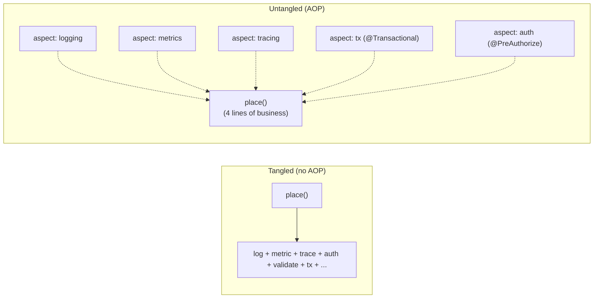
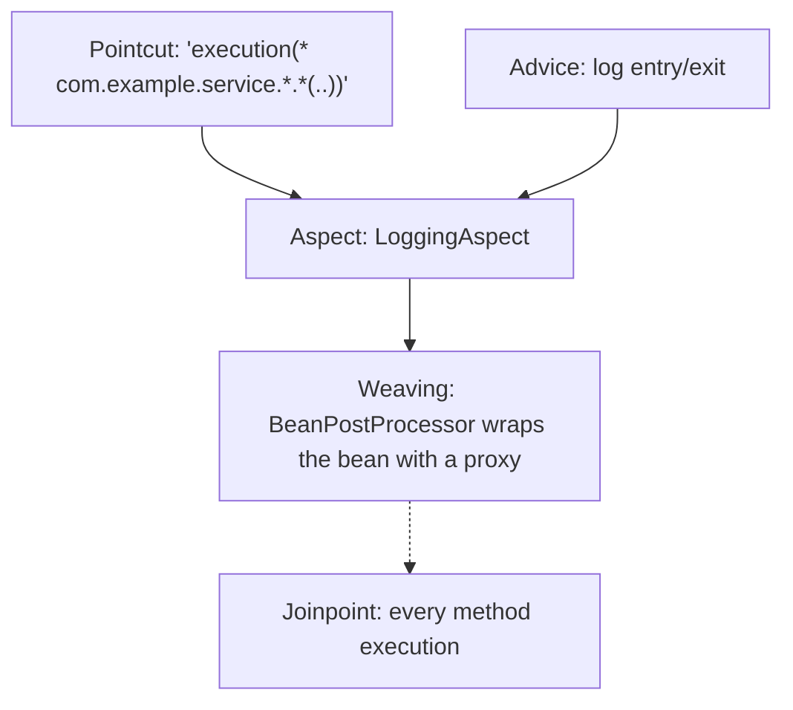
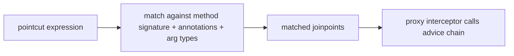
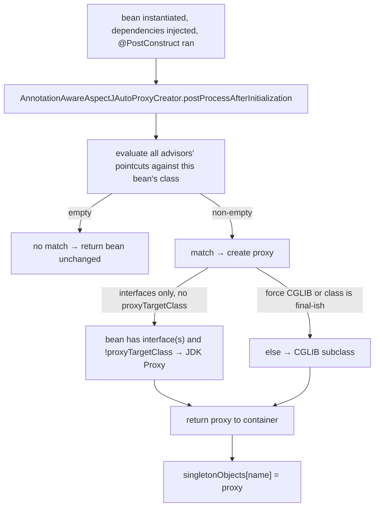
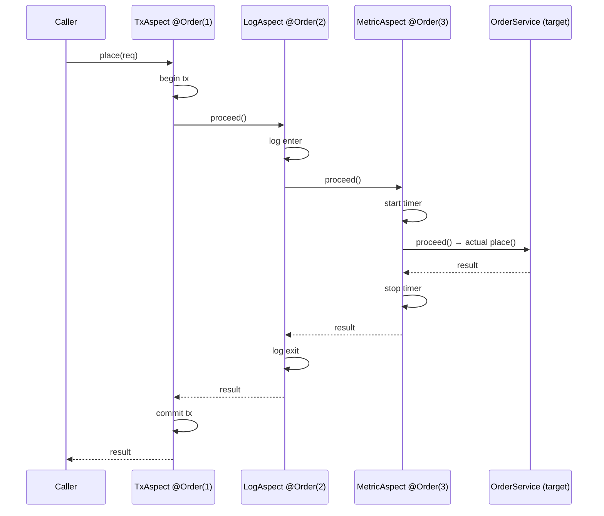
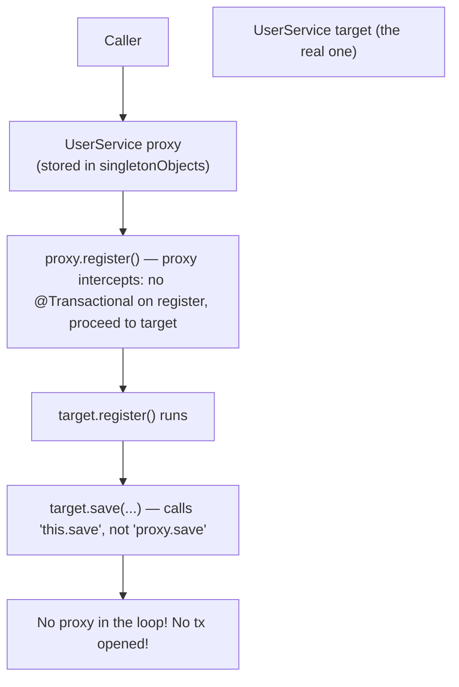

# Spring AOP

A real backend service has at least a dozen **cross-cutting concerns** — code that has nothing to do with the business logic but must happen around every business call. The list is depressingly familiar: open and commit a database transaction; record a metric for the latency; emit a tracing span; check the user has permission; cache the result by argument; log entry and exit; retry on transient failures; mask sensitive fields in the log; run the call on a different thread pool; rate-limit by client; bulkhead by tenant. Twelve concerns × hundreds of methods = thousands of code touches that all look the same and all break the moment any one of them changes.

**Aspect-oriented programming (AOP)** is the technique for pulling every one of those concerns *out of the methods* and into a single declarative aspect. You write `@Transactional` on a service method (or, more invasively, `@Around` on a custom aspect) and Spring **wraps the method at startup** with the right interceptor. The original method does not know, the calling code does not know, the abstraction does not leak. Spring AOP is the engine underneath `@Transactional`, `@Async`, `@Cacheable`, `@Validated`, `@PreAuthorize`, `@Retry`, Micrometer's `@Timed`, and every framework annotation that "magically" runs code around your method.

The depth-bar this topic clears: at the **language layer**, the AOP vocabulary (advice, pointcut, joinpoint, aspect, weaving) and Spring's AspectJ-inspired annotation syntax (`@Aspect`, `@Before`, `@After`, `@Around`, `@Pointcut`). At the **memory layer**, the *exact* bytecode mechanism — Spring generates either a **JDK dynamic proxy** (a class that implements every interface the target does) or a **CGLIB subclass** (a class that extends the target), in either case wrapping the bean with a method interceptor that runs the advice chain. The proxy adds ~96–192 bytes per wrapped bean plus an extra method dispatch per intercepted call (~1–3 µs cold, ~100 ns warm after JIT). At the **architecture layer** — the heart — **how AOP composes with the container**: which `BeanPostProcessor` does the wrapping, when in the lifecycle it happens, why **self-invocation breaks AOP** (the most common Spring bug), how multiple aspects on the same method are *ordered*, and where Spring AOP's "proxy-based" limitations end and full AspectJ "byte-code weaving" begins.

> [!NOTE]
> Prerequisites: T01–T04 — bean lifecycle, `BeanPostProcessor` machinery, `@Configuration`. Java reflection (`Proxy.newProxyInstance`), interface vs class semantics. CGLIB and bytecode generation are touched at L3/C02.

## What "Cross-Cutting Concern" Means

A normal class has **one job**:

```java
@Service
public class OrderService {
    private final OrderRepository repo;
    private final PaymentGateway gateway;
    public OrderService(OrderRepository repo, PaymentGateway gateway) {
        this.repo = repo;
        this.gateway = gateway;
    }

    public Order place(OrderRequest req) {
        Order o = new Order(req);
        repo.save(o);
        gateway.charge(o.total(), req.cardToken());
        return o;
    }
}
```

But what *production* needs from `place` is:

```java
public Order place(OrderRequest req) {
    // 1. transaction begin
    // 2. start tracing span "OrderService.place"
    // 3. start metric timer
    // 4. log enter
    try {
        // 5. authorization check (current user can place orders for this customer)
        // 6. validation of req
        Order o = new Order(req);
        repo.save(o);
        gateway.charge(o.total(), req.cardToken());

        // 7. log success
        // 8. record metric success
        // 9. commit transaction
        return o;
    } catch (Throwable t) {
        // 10. record metric failure
        // 11. emit error event for alerting
        // 12. rollback transaction
        // 13. log exception
        throw t;
    } finally {
        // 14. stop metric timer
        // 15. end tracing span
        // 16. log exit
    }
}
```

If you wrote this by hand in 200 service methods, three things go wrong: every method becomes mostly boilerplate, every concern is implemented 200 different ways (subtly inconsistent), and changing one concern (move logging to JSON, switch tracing libraries) means touching 200 files.

AOP turns each of those concerns into an **aspect** — a single class that says "for every method with `@Transactional`, do *this* before, *this* on success, *this* on failure, *this* in finally". The business method goes back to four lines. The cross-cutting concerns live exactly once each, written and tested in isolation.



## The Vocabulary

AOP terminology comes from AspectJ (the original Java AOP system, Bell Labs / IBM, 2001). Spring borrowed it.

| Term | Definition | Example |
|------|-----------|---------|
| **Joinpoint** | a *point* in program execution where an aspect could be applied | a method invocation; a constructor call; a field access |
| **Pointcut** | an *expression* selecting a set of joinpoints | "every method on a class in `com.example.service`" |
| **Advice** | the *code* to run at a matched joinpoint | "open a transaction" |
| **Aspect** | a class bundling pointcuts and advice | `LoggingAspect` |
| **Weaving** | the act of *combining* aspect code with target classes | proxy creation at startup; compile-time bytecode rewrite |
| **Target** | the object being advised | the actual `OrderService` instance |
| **Proxy** | the *wrapper* the caller actually holds | a CGLIB subclass of `OrderService` |
| **Introduction** | adding new methods/fields to a class via aspect | rare; AspectJ-only in Spring |



## Spring AOP vs AspectJ

There are two production-grade AOP systems in the JVM world:

- **Spring AOP** — **proxy-based**. Only **method execution** joinpoints. Only **public methods** on Spring **beans** (the proxy wraps the bean instance). Limited but lightweight (no extra build step).
- **AspectJ** — **bytecode weaving**. Joinpoints include method calls, constructor calls, field reads/writes, exception handlers, static initializers, etc. Methods on any class (Spring-managed or not, public or not). Requires either compile-time weaving (`aspectjc` instead of `javac`) or load-time weaving (a JVM agent rewriting bytecode as classes load).

For 95% of production needs, Spring AOP suffices — transactions, metrics, tracing, caching, authorization. For the 5% (intercept a `new`, advise a private method, advise a class outside the container), you reach for AspectJ.

This topic covers **Spring AOP** in depth. AspectJ syntax is identical (Spring borrows the annotations); the engine underneath is different.

## A Concrete Aspect — Built Up From Scratch

A logging aspect that records every public method on `com.example.service` classes:

```java
@Aspect
@Component
public class LoggingAspect {

    private static final Logger log = LoggerFactory.getLogger(LoggingAspect.class);

    @Pointcut("execution(* com.example.service.*.*(..))")
    public void serviceMethods() { }

    @Before("serviceMethods()")
    public void before(JoinPoint jp) {
        log.info("ENTER {}.{}", jp.getSignature().getDeclaringTypeName(),
                                jp.getSignature().getName());
    }

    @AfterReturning(pointcut = "serviceMethods()", returning = "result")
    public void onReturn(JoinPoint jp, Object result) {
        log.info("EXIT  {} → {}", jp.getSignature().getName(), result);
    }

    @AfterThrowing(pointcut = "serviceMethods()", throwing = "ex")
    public void onError(JoinPoint jp, Throwable ex) {
        log.error("FAIL  {} threw {}", jp.getSignature().getName(), ex.getMessage());
    }
}
```

The annotations:

- `@Aspect` — declares this is an aspect.
- `@Component` — register it as a Spring bean so the `AnnotationAwareAspectJAutoProxyCreator` picks it up.
- `@Pointcut("...")` — a named pointcut expression. The empty method serves as a *handle* you can reference from advice (cleaner than repeating the expression).
- `@Before`, `@AfterReturning`, `@AfterThrowing`, `@After`, `@Around` — the five advice annotations.

Enabling AOP processing:

```java
@Configuration
@EnableAspectJAutoProxy
public class AopConfig { }
```

Spring Boot enables this automatically when `spring-aop` is on the classpath. `@EnableAspectJAutoProxy(proxyTargetClass = true)` forces CGLIB even when interfaces are present.

## The Five Advice Types

| Annotation | Runs | Can replace return? | Can swallow exceptions? |
|-----------|------|:-------------------:|:----------------------:|
| `@Before` | before the joinpoint | no | no — must `return void` |
| `@AfterReturning` | after normal return | no (read-only) | no |
| `@AfterThrowing` | after an exception | no | no — exception still propagates |
| `@After` | after either outcome (finally) | no | no |
| `@Around` | full control — call `proceed()` to invoke target | **yes** | **yes** |

`@Around` is the most powerful and the most common. It receives a `ProceedingJoinPoint`:

```java
@Around("serviceMethods()")
public Object timeIt(ProceedingJoinPoint pjp) throws Throwable {
    long start = System.nanoTime();
    try {
        Object result = pjp.proceed();    // ← invoke the actual target method
        return result;
    } finally {
        long elapsed = System.nanoTime() - start;
        meter.record(elapsed, NANOSECONDS);
    }
}
```

`pjp.proceed()` returns the target's actual return value. You can:

- Wrap the call in try/catch and translate exceptions.
- Modify the arguments (`proceed(newArgs)`).
- Decline to call `proceed()` at all — short-circuiting the target (this is how `@Cacheable` returns the cached value without calling the method).
- Return a different value than the target's.

`@Transactional`, `@Async`, `@Cacheable`, `@Retry` are all implemented as `@Around` advice.

## Pointcut Expression Syntax — The AspectJ Mini-Language

A pointcut is a boolean expression over **designators**. The ones Spring AOP supports:

| Designator | Matches | Example |
|-----------|---------|---------|
| `execution(modifiers? type pkg.Class.method(args))` | method *execution* | `execution(public * com.example..*.*(..))` |
| `within(type)` | any joinpoint inside the type | `within(com.example.service.*)` |
| `this(type)` | the proxy is assignable to type | `this(com.example.Audited)` |
| `target(type)` | the target is assignable to type | `target(org.springframework.dao.support.DaoSupport)` |
| `args(types)` | runtime argument types match | `args(java.lang.String, ..)` |
| `@target(annotation)` | target class has the annotation | `@target(org.springframework.stereotype.Service)` |
| `@within(annotation)` | the joinpoint is in a type with the annotation | `@within(MyClassAnno)` |
| `@annotation(annotation)` | the method has the annotation | `@annotation(org.springframework.transaction.annotation.Transactional)` |
| `@args(annotation)` | a runtime arg type has the annotation | `@args(com.example.Tracked)` |
| `bean(name)` | bean name matches | `bean(*Service)` |

Combinators: `&&`, `||`, `!`.

**`execution`** is the workhorse. Anatomy:

```
execution(public * com.example.service.OrderService.place(..))
   |       |    |  |____________| |________| |____|  |__|
   |       |    |       package      class    method args
   |       |    return type
   |       modifier (optional)
   keyword
```

The `*` wildcards stand for "any token". `..` stands for "any number of tokens" (in package: any sub-package; in args: any signature).

Examples:

```java
// every public method on every class in com.example.service.* (one package deep)
execution(public * com.example.service.*.*(..))

// every method anywhere under com.example.service (recursive)
execution(* com.example.service..*.*(..))

// every method that returns User
execution(com.example.User com.example..*.*(..))

// every method on classes annotated @Service
within(@org.springframework.stereotype.Service *)

// every method annotated @Transactional
@annotation(org.springframework.transaction.annotation.Transactional)
```



The pointcut is evaluated at the time the proxy is created (at startup for singletons). The match-set is then static; runtime evaluation is only for dynamic designators (`args`, `target` runtime type) and `bean(name)`.

## How the Proxy Is Created — Mechanism

The component that does AOP wrapping is **`AnnotationAwareAspectJAutoProxyCreator`** — a `BeanPostProcessor` that Spring registers when `@EnableAspectJAutoProxy` is present (Spring Boot does this automatically). Its `postProcessAfterInitialization` checks every bean:

1. Find every `@Aspect` bean in the container.
2. For each aspect, extract `Advisor`s — pairs of pointcut + advice. An `@Around` method on a `@Aspect` bean becomes a `MethodInterceptor` wrapped in an `Advisor`.
3. For the *current* bean being post-processed, evaluate every advisor's pointcut against the bean's class. Collect the matching advisors.
4. If the matching set is non-empty, **create a proxy**:
   - If the bean implements at least one *interface* and `proxyTargetClass = false` (the Spring default): create a **JDK dynamic proxy** implementing those interfaces.
   - Otherwise (no interfaces, or `proxyTargetClass = true`, or Spring Boot's `proxyTargetClass = true` default since 2.0): create a **CGLIB subclass** of the bean.
5. Wire the proxy's invocation handler with the matched `Advisor` list, sorted by `@Order`.
6. Return the proxy from `postProcessAfterInitialization` — it replaces the bean in `singletonObjects`.



### JDK Dynamic Proxy

`Proxy.newProxyInstance(classLoader, interfaces, invocationHandler)`. The JDK generates a class at runtime that *implements every interface* and delegates every method call to a single `InvocationHandler.invoke(Object proxy, Method method, Object[] args)`. Spring's handler — `JdkDynamicAopProxy` — runs the advice chain, eventually calling `method.invoke(target, args)` to hit the real implementation.

Caller code holds a reference to `OrderService` (the interface), not the implementation class. The proxy is plug-compatible.

**Memory:** ~96 bytes for the proxy instance + ~5–15 KB for the generated proxy class (loaded once per `(classloader, interfaces)` tuple and cached). 

**Limitation:** only methods declared on the *interfaces* are advised. If your service has a method *not* on the interface (a `public` helper not declared in the interface), the proxy cannot route it because the proxy does not have that method.

### CGLIB (or Byte Buddy) Subclass

Spring's CGLIB generates a subclass of the target class at runtime. The subclass overrides every non-`final` method with a delegation to an interceptor chain. The bean stored in `singletonObjects` is an instance of `OrderService$EnhancerBySpringCGLIB$f4a3e2c1`.

**Memory:** ~192 bytes for the CGLIB instance (a few more pointers than JDK proxy) + ~8–20 KB for the generated subclass + an extra `Class` in metaspace per advised bean *class*.

**Limitation:**

- `final` methods cannot be overridden → not advised (Spring logs a warning).
- `final` classes cannot be subclassed → AOP fails outright.
- The class must have a constructor the subclass can call (a no-arg constructor, ideally — or Spring needs to use ObjenesisStd to skip constructor invocation, which it does by default since 4.0).
- Constructors run *twice* for the proxy by default (once for the target, once for the subclass). Spring 4+ uses Objenesis to suppress the second.

Spring Boot 2.0+ defaults `proxyTargetClass = true` globally, so CGLIB is the dominant style in modern apps. The cost is slightly more memory; the benefit is correctness when callers refer to the implementation type rather than an interface (very common in modern code).

### Spring 6+ — JDK Proxy via `MethodHandle`

Spring 6 / Boot 3 began moving toward JDK-only proxies (no CGLIB) for many cases, using Java 17+ `MethodHandle`-based dispatch for class proxies via the same mechanism JEP-309 introduced. This is part of the Native-Image friendliness push: bytecode generation at runtime is incompatible with GraalVM native compilation. Watching this space.

## The Advice Chain — How Multiple Aspects Compose

Multiple aspects can match the same method. Spring orders them by `@Order` (or `Ordered`) on the aspect class — *lower* number runs *outermost*:

```java
@Aspect @Order(1) public class TxAspect    { @Around("...") public Object t(...) { ... } }
@Aspect @Order(2) public class LogAspect   { @Around("...") public Object l(...) { ... } }
@Aspect @Order(3) public class MetricAspect{ @Around("...") public Object m(...) { ... } }
```

Call to `service.place(req)`:



The order matters. Transactions need to wrap everything (logs and metrics included; if metric-recording throws, you want the tx rolled back). Authorization usually runs *before* validation (don't waste time validating data the user can't see). Get the ordering wrong and `@Transactional` may not encompass the work it should — a classic source of bugs.

> [!INTERVIEW]
> "If `@Transactional` and a custom logging aspect both match a method, which runs first?" — answer: whichever has the lower `@Order` value runs outermost. By default, `@Transactional` runs at `Ordered.LOWEST_PRECEDENCE` (so anything else, by default, runs inside it). To put your logging aspect outside the tx, set `@Order(Ordered.HIGHEST_PRECEDENCE + 1)`.

## Built-in Aspects You Already Use

Spring is *built on* AOP. Every annotation in this list is implemented as a proxy + interceptor:

| Annotation | Module | Effect |
|-----------|--------|--------|
| `@Transactional` | `spring-tx` | open / commit / rollback via `PlatformTransactionManager` |
| `@Async` | `spring-context` | run on a `TaskExecutor`, return a `Future` |
| `@Cacheable` / `@CachePut` / `@CacheEvict` | `spring-context` | consult cache before invoking; write cache after |
| `@Validated` | `spring-context` | run JSR-380 validation on arguments |
| `@PreAuthorize` / `@PostAuthorize` / `@Secured` | `spring-security` | check authorities |
| `@Retry` | `spring-retry` / Resilience4j | retry on exception |
| `@Timed` / `@Counted` | `micrometer` | record latency / count |
| `@TraceMethod` (custom) | OpenTelemetry | wrap in a tracing span |

Their mechanism is identical: a `BeanPostProcessor` wraps your bean with an interceptor; the interceptor's `@Around` calls `proceed()` with the cross-cutting work around it.

## Self-Invocation — The Bug Every Spring Engineer Eventually Hits

```java
@Service
public class UserService {

    public void register(UserRequest req) {
        // ... do some setup
        save(req.toUser());     // ← self-call! Bypasses the proxy!
    }

    @Transactional
    public void save(User u) { repo.save(u); }
}
```

The bug: `save(...)` is *not* executed transactionally even though it has `@Transactional`. Why?



The caller goes through the proxy. The proxy calls the target's `register()`. Inside `register()`, the `save(...)` call uses `this` — which is the *target*, not the proxy. The proxy is not in the path. The `@Transactional` interceptor is on the proxy. Therefore: no transaction.

This is **the single most common Spring bug**. Three fixes, in order of recommended:

1. **Refactor**: extract `save` into a separate bean. The two beans are wired via constructor injection; the proxy is in the call path between them. *Always the right answer.*
2. **Inject the bean into itself** (`@Lazy ApplicationContext ctx`, then `ctx.getBean(UserService.class).save(...)`). Ugly and hides the design problem.
3. **`AopContext.currentProxy()`**: enable with `@EnableAspectJAutoProxy(exposeProxy = true)`, then `((UserService) AopContext.currentProxy()).save(...)`. Threadlocal-based; works but is a *clearly* code smell.

**Constructor-injection cycles cannot happen via AOP** — the proxy is not in the constructor chain. Constructor injection is one more reason to prefer it.

> [!WARNING]
> `@Async`, `@Transactional`, `@Cacheable`, `@PreAuthorize` — *every* AOP annotation is subject to self-invocation. If your annotated method is called from another method of the same class, the advice does not run. Refactor.

## Per-Class CGLIB Quirks

- **`final` methods are not advised.** No warning is given (Spring 5.x logs at DEBUG). Test that your `@Transactional` is actually working.
- **`final` classes cannot be advised by CGLIB.** The container fails at proxy-creation time with an explicit message.
- **`private` and `package-private` methods are not advised** (the subclass cannot override them). Use `public` or `protected`.
- **Constructors are not advised.** You cannot put `@Transactional` on a constructor. (`@PostConstruct` can; it runs in phase 4d of the lifecycle, by which point the proxy exists.)
- **`@Async` on a method that returns `void` or `Future<T>`** — those return types Spring handles. Other return types log a warning and run synchronously.

## A Real Example — `@Audit` via Custom Aspect

```java
@Target(ElementType.METHOD)
@Retention(RetentionPolicy.RUNTIME)
public @interface Audit {
    String value();
}

@Aspect
@Component
public class AuditAspect {

    private final AuditLog log;
    public AuditAspect(AuditLog log) { this.log = log; }

    @Around("@annotation(audit)")
    public Object audit(ProceedingJoinPoint pjp, Audit audit) throws Throwable {
        String event = audit.value();
        String user = SecurityContextHolder.getContext().getAuthentication().getName();
        long start = System.nanoTime();
        try {
            Object result = pjp.proceed();
            log.record(event, user, true, System.nanoTime() - start);
            return result;
        } catch (Throwable t) {
            log.record(event, user, false, System.nanoTime() - start);
            throw t;
        }
    }
}

@Service
public class PaymentService {
    @Audit("payment.charge")
    public ChargeResult charge(Charge c) { ... }
}
```

The aspect is a `@Component` with the standard constructor injection. The `@Around` pointcut `@annotation(audit)` matches any method annotated with `@Audit`, and *binds* the annotation instance to the `audit` parameter so you can read its `value()`. The aspect can do anything around the call — log, time, record outcomes, retry, suppress.

Twenty lines of aspect code, zero touching of `PaymentService`, easy to test in isolation (build a `JoinPoint` stub).

## Memory and Performance Profile

For a typical service with 200 advised beans and an average of 2 aspects per advised method:

| Resource | Cost |
|----------|------|
| Generated proxy classes (CGLIB) | ~200 × 10 KB = ~2 MB metaspace |
| Proxy instances (heap) | ~200 × 192 B = ~38 KB |
| Per-invocation dispatch | ~150 ns warm (proxy + 1 interceptor); ~250 ns with 2 interceptors |
| Cold-start AOP wrapping | ~80 ms (one-time at startup) |

The runtime cost is small enough that AOP is the *correct* default for tx, metric, log, trace, auth. The startup cost is meaningful for serverless cold start — one reason Spring Boot 3's AOT mode pre-generates proxies at build time rather than runtime.

## Spring AOP vs Pure AspectJ — When To Switch

Use AspectJ (load-time or compile-time weaving) when Spring AOP cannot:

| Need | Spring AOP | AspectJ |
|------|:----------:|:-------:|
| advise a method on a Spring bean | ✅ | ✅ |
| advise a method on a non-bean class | ❌ | ✅ |
| advise a private method | ❌ | ✅ |
| advise a field access | ❌ | ✅ |
| advise a constructor | ❌ | ✅ |
| advise a `static` method | ❌ | ✅ |
| advise across self-invocation | ❌ | ✅ |
| no build-time setup | ✅ | ❌ |
| works with GraalVM native | ✅ (proxies known at build) | partial |

For 95% of needs Spring AOP suffices. The 5% that needs AspectJ is usually performance-sensitive or framework-internal — e.g., `@Transactional` on a method called from within the same class, or instrumenting third-party libraries.

## Common Pitfalls

> [!WARNING]
> **Self-invocation.** Covered above. The bug that bites every Spring engineer at least once.

> [!WARNING]
> **`@Transactional` on a private method.** Silently ignored. The proxy cannot intercept it. Make it `public` (and call it from outside the class).

> [!WARNING]
> **Two `@Aspect`s without `@Order`.** The execution order is undefined (insertion order of advisor list). Always order aspects explicitly when more than one matches a method.

> [!WARNING]
> **Pointcut that matches `@Aspect`'s own bean.** Easy to write `execution(* com.example..*.*(..))` and accidentally match the aspect itself — leading to infinite recursion if the aspect calls anything that matches. Exclude with `!within(com.example.aspect.*)`.

> [!WARNING]
> **AOP on a `@Configuration` class's `@Bean` method.** The `@Bean` factory method is not a normal method execution; it is intercepted by the configuration-class CGLIB proxy. Your aspect's pointcut won't match. Advise the *returned bean's* methods instead.

> [!WARNING]
> **Final fields injected via setters because of AOP.** When CGLIB subclasses your class and Spring needs to inject through a setter, the subclass's overridden setter runs against the proxy instance. If your fields are not also written by the target's constructor (because Objenesis skipped it), they may be null on the *target* even though they are set on the proxy. Rare but happens with mixed constructor and setter injection.

## Practice

1. Write a `@TraceMethod` annotation and an aspect that wraps every annotated method in an OpenTelemetry span. Add the annotation to three controller methods. Verify in your tracing tool that spans appear with the correct names.
2. Add a metric-recording `@Around` aspect (Micrometer `Timer`). Order it inside (`@Order` higher than) a logging aspect. Confirm via logs that the order is: log-enter → metric-start → target → metric-stop → log-exit.
3. Trigger the self-invocation bug deliberately: `@Transactional` on a method called from another method of the same class. Confirm with TRACE logs (or by killing the DB mid-call) that no transaction wraps the inner call. Fix by extracting to a separate bean.
4. Set `@EnableAspectJAutoProxy(proxyTargetClass = false)` and try to advise a class with no interfaces. Observe that Spring falls back to CGLIB anyway (CGLIB is required when no interface is available).
5. Build a tiny aspect that matches `execution(* save*(..))`. Apply it to every bean in your service module. Print the proxy class names from `ctx.getBean(...).getClass().getName()`. Verify they are CGLIB enhancers.
6. Use AspectJ's load-time weaver to advise a private method in your code. Compare the build setup (Spring Boot's `spring-aspects` + a JVM agent) to vanilla Spring AOP. Was the extra setup worth solving the actual problem you had?
7. Profile cold-start time for an app with 50 advised beans vs the same app with no advised beans (delete the aspects). Confirm the difference is in the order of tens to hundreds of milliseconds.

## Recap

You should now be able to:

- Define the AOP vocabulary precisely: joinpoint, pointcut, advice, aspect, weaving, target, proxy, introduction.
- Choose between the five advice types (`@Before`, `@AfterReturning`, `@AfterThrowing`, `@After`, `@Around`) based on whether you need to read or replace the return / exception path.
- Write AspectJ pointcut expressions using `execution`, `within`, `args`, `@annotation`, `@within`, `bean`, and combinators.
- Explain Spring AOP's proxy mechanism: `AnnotationAwareAspectJAutoProxyCreator` (a `BeanPostProcessor`) wraps beans at phase-4d of the lifecycle; produces JDK dynamic proxies when interfaces are available, CGLIB subclasses otherwise.
- Recognize and fix the self-invocation bug (the proxy is not in the path; `this.foo()` bypasses advice).
- Order multiple aspects with `@Order` and reason about *which* outer aspect should encompass which inner — particularly that `@Transactional` should usually be the outermost concern around business logic, and that authorization should be outside validation.
- Identify the built-in aspects (`@Transactional`, `@Async`, `@Cacheable`, `@PreAuthorize`, `@Validated`, `@Timed`, …) and reason about their composition.
- Decide between Spring AOP (proxy-based, 95% of cases) and AspectJ (weaving, the remaining 5% — private methods, fields, constructors, non-bean classes).
- Quantify AOP's cost: ~200 ns per intercepted call warm; ~10–20 KB metaspace per advised class; ~50–100 ms of cold-start time for a typical service.

## Next

Continue to [Spring Expression Language (SpEL)](./T06-spring-expression-language-spel.md) to learn the small DSL Spring uses inside `@Value`, `@Conditional`, `@PreAuthorize`, and `@Cacheable` annotations — the syntax, its compiled mode (so it isn't actually as slow as it looks), and the security pitfalls of evaluating user-supplied SpEL.
