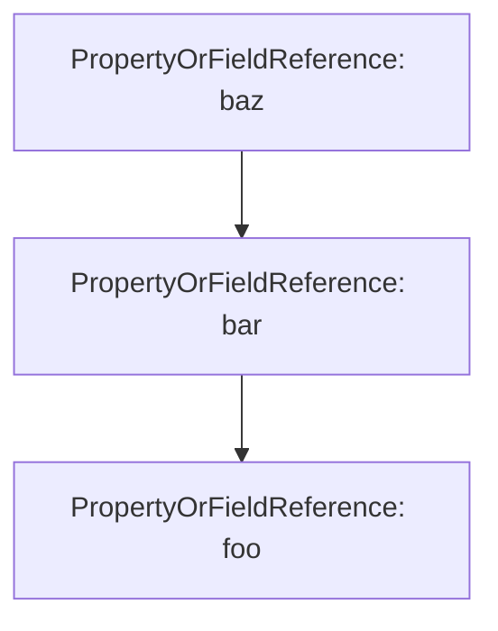
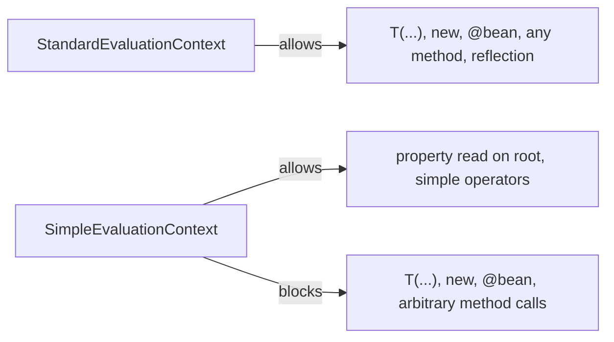
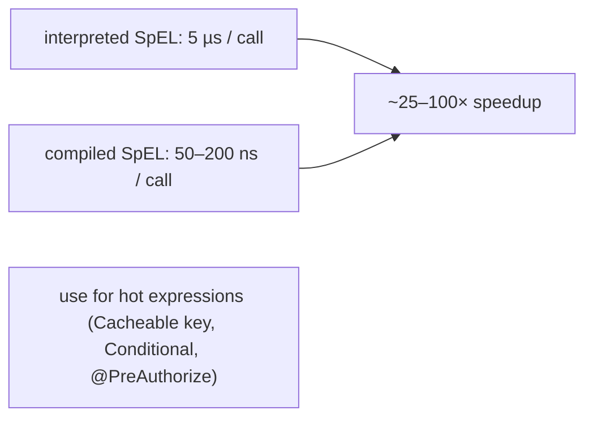

# Spring Expression Language (SpEL)

Tucked inside every `@Value`, `@Conditional`, `@Cacheable`, `@PreAuthorize`, `@RequestMapping`, and dozens of other Spring annotations is a small but full-featured *expression language*. **SpEL** — the Spring Expression Language — is the DSL Spring uses when an annotation needs to evaluate something that cannot be known until runtime. `@Value("#{2 + 3}")` returns 5. `@Cacheable(key = "#user.id")` builds the cache key from the method argument's `id`. `@PreAuthorize("hasRole('ADMIN') and #order.owner == authentication.name")` checks the user is admin *and* owns the order. None of those work with plain Java values; all of them work with SpEL.

SpEL exists because the Java annotation model only allows compile-time constants as attribute values — `@Value("5")` is fine, but `@Value(2 + 3)` is fine too only because Java pre-computes the constant. The moment an annotation attribute needs to consult a runtime value (a bean, a method argument, an environment variable, an authentication object), Java's `String`-only attribute syntax cannot help. SpEL is the answer: pass a *string* that Spring parses into an expression tree and evaluates at the relevant moment. The cost is a tiny DSL with its own syntax and a runtime engine. The benefit is a declarative way to express conditions, key derivations, validation rules, and configuration values that would otherwise need procedural code in a `BeanPostProcessor`.

The depth-bar this topic clears: at the **language layer**, SpEL syntax in full — literals, properties, methods, operators (arithmetic, logical, relational, ternary, Elvis), collection projection (`![...]`) and selection (`?[...]`), regex matching, bean references (`@beanName`), type references (`T(...)`), constructor invocation (`new ...`). At the **memory layer**, what the `SpelExpressionParser` builds (an AST of `SpelNode`s, ~50 bytes per node, typically 5–30 nodes per expression), how the **SpelCompiler** (Spring 4.1+) optionally translates simple expressions into JIT-friendly bytecode (turning ~5 µs interpreter dispatch into ~50 ns native execution), and the per-expression cost in real apps. At the **architecture layer** — the heart — **when SpEL is parsed and evaluated** in each annotation's lifecycle (some at startup, some at every method call), **how the `EvaluationContext` controls what code SpEL can reach**, and the **CVE history**: SpEL evaluating untrusted input has caused multiple critical RCEs (CVE-2022-22963 in Spring Cloud Function, CVE-2023-20861 in Spring Framework). Knowing where SpEL evaluates and what it can reach is a security responsibility.

> [!NOTE]
> Prerequisites: T01–T05 — bean lifecycle, configuration, AOP. Familiarity with `@Value`, `@Cacheable`, `@PreAuthorize` from those topics.

## A Tour of the Syntax

The same expression — `${...}` for property placeholders, `#{...}` for SpEL — drives every example.

### Literals

```java
@Value("#{42}") int answer;                   // 42
@Value("#{'hello'}") String greeting;         // "hello"
@Value("#{2.718}") double e;                  // 2.718
@Value("#{true}") boolean flag;               // true
@Value("#{null}") Object nothing;             // null
@Value("#{0x1F4}") int hex;                   // 500
@Value("#{1e3}") double thousand;             // 1000.0
```

### Arithmetic, Comparison, Logic

```java
@Value("#{2 + 3 * 4}") int twentyFour;                // 14? No, 14
@Value("#{(2 + 3) * 4}") int twenty;                  // 20
@Value("#{10 % 3}") int one;                          // 1
@Value("#{2 ** 10}") int kilo;                        // 1024 (^ is XOR; ** is power)
@Value("#{10 > 3}") boolean t;                        // true
@Value("#{'a' == 'a'}") boolean eq;                   // true
@Value("#{true and false}") boolean f;                // false; also &&
@Value("#{true or false}") boolean t2;                // true; also ||
@Value("#{not true}") boolean f2;                     // false; also !
```

Word operators (`and`, `or`, `not`, `gt`, `lt`, `eq`, `ne`, `ge`, `le`) and symbolic operators (`&&`, `||`, `!`, `>`, `<`, `==`, `!=`, `>=`, `<=`) are interchangeable.

### Ternary and Elvis

```java
@Value("#{ #env > 1024 ? 'big' : 'small'}") String size;
@Value("#{#name ?: 'anonymous'}") String name;        // Elvis: #name if non-null, else 'anonymous'
@Value("#{(#user?.account?.balance) ?: 0}") int bal;  // safe-navigation ?. + Elvis
```

`?.` short-circuits to null if the left side is null — same as Kotlin / Groovy. Saves the call-and-NPE pattern.

### Method and Property Access

```java
@Value("#{T(java.lang.Math).max(2, 5)}") int five;
@Value("#{'hello'.length()}") int len;                // 5
@Value("#{'hello'.toUpperCase()}") String shout;      // "HELLO"
@Value("#{systemProperties['user.home']}") String home;
@Value("#{systemEnvironment['PATH']}") String path;
@Value("#{environment.getProperty('db.url')}") String dbUrl;
```

`T(...)` is the **type reference** — `T(java.lang.Math)` gives you a handle to the `Math` class, on which you can call static methods or access static fields.

### Bean References

```java
@Value("#{@clock.instant()}") Instant now;            // call instant() on bean named 'clock'
@Value("#{@userService.findActive().size()}") int activeCount;
```

The `@` prefix names a bean. SpEL's `BeanResolver` (configured on the `EvaluationContext`) does `applicationContext.getBean("clock")`.

### Collections — Projection and Selection

```java
@Value("#{ {1, 2, 3, 4, 5} }") List<Integer> nums;
@Value("#{ {'one': 1, 'two': 2} }") Map<String, Integer> map;

// projection: ![expr] — apply expr to every element
@Value("#{ {1,2,3}.![#this * 2] }") List<Integer> doubled;     // [2, 4, 6]
@Value("#{ users.![name] }") List<String> names;

// selection: ?[expr] — keep elements matching expr
@Value("#{ {1,2,3,4,5}.?[#this > 2] }") List<Integer> bigger;  // [3, 4, 5]
@Value("#{ users.?[active] }") List<User> active;

// first/last matching
@Value("#{ users.^[active] }") User firstActive;
@Value("#{ users.$[active] }") User lastActive;
```

`#this` is the current element inside a projection/selection. Combined with `?[]` and `![]`, SpEL becomes a tiny query language for collections — useful enough that `@PreAuthorize` and `@Cacheable` regularly chain projections.

### Regex

```java
@Value("#{ 'abc123' matches '[a-z]+\\d+' }") boolean valid;     // true
```

### Constructor Invocation

```java
@Value("#{ new java.util.Date() }") Date now;
@Value("#{ new com.example.Greeter('Alice') }") Greeter g;
```

### Template Mode

In template mode, the entire string is plain text except for `#{...}` regions:

```java
ExpressionParser p = new SpelExpressionParser();
Expression e = p.parseExpression("Hello #{#name}!", new TemplateParserContext());
String out = (String) e.getValue(ctx);   // "Hello Alice!"
```

`@Value` uses template mode by default — `"static text #{expr} more text"`.

## How SpEL Evaluates — The Engine

A SpEL expression goes through three phases.

### Phase 1: Parse (Once)

`SpelExpressionParser.parseExpression("foo.bar.baz")` builds an AST of `SpelNode`s. The AST is a tree of:

- `OpPlus`, `OpMinus`, `OpMultiply`, … — arithmetic
- `OpAnd`, `OpOr`, `OpNot` — logical
- `OpEQ`, `OpNE`, `OpGT`, … — comparison
- `PropertyOrFieldReference` — `foo`, `bar`, `.baz`
- `MethodReference` — `.toUpperCase()`
- `Literal` subclasses — `IntLiteral`, `StringLiteral`, …
- `Ternary` — `cond ? a : b`
- `Selection`, `Projection` — `?[]`, `![]`
- `BeanReference` — `@foo`
- `TypeReference` — `T(...)`
- `ConstructorReference` — `new ...`

For "foo.bar.baz" the AST is:



Each `SpelNode` is ~50 bytes. A 30-node expression is ~1.5 KB.

Parsing is *expensive relative to evaluation* — ~5–20 µs for a simple expression, ~50–100 µs for complex. **Cache parsed expressions** — Spring does this automatically in `@Cacheable`, `@PreAuthorize`, `@Value`, etc.

### Phase 2: Build / Reuse the Evaluation Context

`EvaluationContext` provides:

- **Root object** — the implicit `this` of the expression.
- **Variables** — `#name` → user-supplied value.
- **BeanResolver** — for `@foo` references.
- **PropertyAccessors** — strategies for reading properties on the root or other objects.
- **MethodResolvers** — strategies for method dispatch.
- **TypeLocator** — for `T(...)` resolution.
- **TypeConverter** — for assignment-time coercion.
- **OperatorOverloader** — for `+` on custom types.

Spring ships two:

- **`StandardEvaluationContext`** — full access. Methods, types, beans, reflection, constructor calls. Used in `@Value`, `@Conditional`, `@Cacheable`, `@PreAuthorize`. **Powerful and dangerous if fed untrusted input.**
- **`SimpleEvaluationContext`** — restricted. No `T(...)`, no `new`, no bean references, no method calls on arbitrary objects (only on the root). Used when SpEL evaluates user-supplied templates (Spring Data REST, some `@RequestMapping` template paths). **Safe for untrusted input.**



### Phase 3: Evaluate

Each `SpelNode.getValue(ExpressionState)` recursively evaluates. Most nodes do a few hashmap lookups and a reflective method call. Typical interpreter evaluation: ~5–20 µs.

The cost is dominated by reflection (`Method.invoke`, `Field.get`). SpEL caches the resolved `Member` after the first call so subsequent evaluations skip the resolution.

### Phase 3 Optimized: SpEL Compiler (Spring 4.1+)

`SpelCompilerMode.IMMEDIATE` / `MIXED` ask SpEL to **generate Java bytecode** for the AST after the first few evaluations. The compiled form is a synthetic class implementing `CompiledExpression`, loaded via `Unsafe.defineClass`. Evaluation drops from interpreter time (~5 µs) to bytecode time (~50–200 ns) — a 25–100× speedup.

Caveats:

- Compilation works only when SpEL can statically prove types (root type and intermediate types must be stable across calls). Expressions that touch generic collections or do dynamic dispatch may not compile.
- Compilation has a one-time cost (~500 µs–1 ms per expression).
- The compiled class lives in metaspace; do not compile a different expression for every request — the metaspace will balloon.

Spring enables compiled mode for some internal uses (template expressions in Spring Integration). For your own use:

```java
SpelParserConfiguration cfg = new SpelParserConfiguration(
        SpelCompilerMode.IMMEDIATE, classLoader);
ExpressionParser parser = new SpelExpressionParser(cfg);
```

## SpEL Inside Spring's Annotations

The annotation determines the **root object** and the available variables.

### `@Value`

Root: none (the root is a tiny `BeanExpressionContext` exposing the application context).
Available: `@beanName`, `systemProperties`, `systemEnvironment`, `environment`.

```java
@Value("#{@clock.instant().toEpochMilli()}") long startupMillis;
@Value("#{T(java.lang.Math).PI}") double pi;
```

`@Value` mixes the two parser modes: `${...}` is property-placeholder resolution; `#{...}` is SpEL. They compose:

```java
@Value("#{ ${cache.size:1000} * 2 }") int doubled;   // resolve placeholder first, then SpEL
```

### `@Cacheable`

Root: the method's parameter object (a `CacheExpressionRootObject`).
Available: `#argName` for each method parameter, `#root.method`, `#root.target`, `#root.args[i]`, `#result` (in `@CachePut(key=...)` and `unless`).

```java
@Cacheable(value = "users", key = "#id")
public User findById(long id) { ... }

@Cacheable(value = "orders", key = "#order.customer.id + '-' + #order.id",
           condition = "#order.amount > 100",
           unless = "#result.status == 'CANCELLED'")
public OrderDetails enrich(Order order) { ... }
```

The `key` SpEL is evaluated *before* the method runs (to compute the cache key); `unless` is evaluated *after* (it can read `#result`).

### `@PreAuthorize` / `@PostAuthorize`

Root: a `MethodSecurityExpressionRoot`.
Available: `authentication`, `principal`, `hasRole(...)`, `hasAuthority(...)`, `hasPermission(...)`, `isAuthenticated()`, plus method parameters by name.

```java
@PreAuthorize("hasRole('ADMIN') or #user.id == authentication.principal.id")
public User updateUser(User user) { ... }

@PostAuthorize("returnObject.owner == authentication.name")
public Document fetch(long id) { ... }
```

This is where `@PreAuthorize` becomes powerful — *parameter-aware* authorization. "Admin can update anybody; user can only update themselves" reads as a single SpEL line.

### `@ConditionalOnExpression`

Root: `Environment`-aware.
Available: `T(...)`, `environment`, `${...}` placeholders.

```java
@Bean
@ConditionalOnExpression("${features.payment-v2:false} and !${maintenance.mode:false}")
public PaymentV2Service paymentV2() { ... }
```

### `@RequestMapping`

Limited SpEL via `${...}` (placeholder) — typically no `#{...}`. Custom condition annotations may use SpEL.

## Compilation in Practice

A real `@Cacheable` key expression like `"'user-' + #id"` evaluates ~1 million times per second on a hot endpoint. With interpretation: ~5 µs per call → 5 seconds CPU per second wall-clock = 500% of one core just on caching keys.

With SpEL compilation (`SpelCompilerMode.MIXED`): ~80 ns per call → 80 ms per second = 8% of one core. The 60× speedup is the difference between "caching helps" and "caching is a tax".

Spring's `@Cacheable` evaluator uses interpreted SpEL by default. Enable compilation globally via `spring.cache.compile-spel=true` (Spring Boot 3+). Pay attention to whether your expression is compilable (sufficiently typed) — Spring logs a warning if compilation falls back.



## SpEL Security — The CVE Pattern

SpEL has been the vector for several Spring CVEs:

- **CVE-2022-22963** (Spring Cloud Function): SpEL evaluation of a request header (`spring.cloud.function.routing-expression`) on a `StandardEvaluationContext` allowed RCE.
- **CVE-2022-22950** (Spring Framework): a SpEL injection in `@RequestMapping`'s `value` attribute when combined with unfiltered input.
- **CVE-2023-20861** (Spring Framework): a SpEL injection via `URI` parsing under specific config.

The pattern is always the same: **untrusted input is fed to a `StandardEvaluationContext`**, which exposes `T(java.lang.Runtime).getRuntime().exec(...)` and friends. SpEL with `T(...)` is essentially a full Java sandbox escape.

Three rules:

1. **Never construct a SpEL expression by string-concatenating user input.** If you absolutely must, use `SimpleEvaluationContext.forReadOnlyDataBinding()` — it forbids `T(...)`, `new`, and bean references.
2. **Annotation expressions are safe by design.** They are written by the developer, not the user. They run on `StandardEvaluationContext` because they need full power.
3. **Reading `#parameterName` is fine.** It is the *type* of root that matters, not the parameter values.

```java
// DANGEROUS — user-controlled input becomes an expression
String userInput = req.getHeader("Special-Header");
Expression e = parser.parseExpression(userInput);   // ← never do this
Object result = e.getValue(new StandardEvaluationContext());

// SAFE if you really must — restricted context, parameterized
SimpleEvaluationContext ctx = SimpleEvaluationContext.forReadOnlyDataBinding().build();
StandardEvaluationContext.setVariable("input", userInput);
```

> [!WARNING]
> SpEL parsed expressions are themselves not exploitable; the **`StandardEvaluationContext` reachable via `T(...)`** is. Use `SimpleEvaluationContext` for anything touched by untrusted input. Static expressions in annotation literals are fine because they cannot be modified at runtime.

## A Worked Example — Conditional Cache Eviction

```java
@Service
public class CatalogService {

    @Cacheable(value = "products",
               key = "#region + '-' + #productId",
               condition = "#region != null and #productId > 0",
               unless = "#result == null or #result.discontinued")
    public Product findProduct(String region, long productId) { ... }

    @CacheEvict(value = "products",
                allEntries = false,
                key = "#product.region + '-' + #product.id",
                condition = "#product.modified gt T(java.time.Duration).ofMinutes(5).toNanos() + #product.lastCached")
    public void update(Product product) { ... }
}
```

The cache key is constructed from the two method arguments. Entries are cached only when the inputs are valid. Entries are skipped (`unless`) if the result is null or marked discontinued. The eviction `condition` uses `T(...)` to reference `Duration.ofMinutes(5)` statically — only evict if the cached entry is more than 5 minutes stale.

Each annotation runs three SpEL expressions per method call (key, condition, unless). Three interpreted SpEL → ~15 µs. With compilation → ~600 ns. For a method called 10,000 times per second, the difference is ~150 ms vs ~6 ms of CPU per second.

## When Not To Use SpEL

SpEL is a tax. If a plain Java method can do the work, that is faster, more typed, more refactorable, and less surprising:

| Use SpEL when… | Use Java code when… |
|----------------|--------------------|
| an annotation requires a String attribute | the work is in a regular method |
| the condition is config-driven (different per profile) | the condition is static |
| the value is one-line and rarely changes | the value involves more than ~3 operators |
| it composes with built-in Spring features (caching key, security check) | it composes with regular service code |

The frequent mistake: a 50-character SpEL expression embedded in `@Cacheable.condition`. After the third nested ternary, the line is unreadable. Refactor into a small helper bean and a `@Cacheable(condition = "@cacheCondition.eligible(#root)")`.

## Common Pitfalls

> [!WARNING]
> **Forgetting `-parameters`.** Without compiling with `-parameters`, parameter names are stripped. `#id` becomes `#a0` and your SpEL silently does not bind. (Spring Boot adds `-parameters` by default in `spring-boot-maven-plugin` / `spring-boot-gradle-plugin`; verify if you use a custom build.)

> [!WARNING]
> **Treating SpEL like Java.** SpEL's `==` works on Strings (it calls `.equals`), unlike Java's `==`. SpEL's `+` on Strings concatenates. SpEL's `/` on integers is integer division. Read the spec; do not assume Java semantics.

> [!WARNING]
> **Using `@Value("#{...}")` to wire an entire bean.** It works but the SpEL goes through `StandardEvaluationContext`, which has full reflection. Just `@Autowired` the dependency.

> [!WARNING]
> **Concatenating untrusted input into a SpEL string.** Covered above. The CVE pattern. Never.

> [!WARNING]
> **Compiled SpEL that depends on a generic type.** SpEL's compiler often falls back to interpretation when it cannot statically type. Look at logs; if you do not see "successfully compiled expression", you are paying the interpreter cost.

> [!WARNING]
> **Caching SpEL `Expression` objects across threads but evaluating with non-shared `EvaluationContext`s.** That is correct! `Expression` is thread-safe; `EvaluationContext` is *not*. Build the context per call.

## Practice

1. Write a `@Value` that resolves to "`current time as ISO instant`" using `T(java.time.Clock).systemUTC().instant()`. Confirm the value is set at bean creation, not at every read.
2. Implement a custom `@Cacheable` key SpEL that incorporates a tenant from the current `Authentication`: `key = "T(your.SecurityUtils).currentTenant() + '-' + #id"`. Verify entries are partitioned per tenant.
3. Use `@PreAuthorize("hasRole('ADMIN') or #order.owner == authentication.name")` on an `updateOrder(Order order)` method. Verify a non-admin user cannot edit an order they do not own; the admin can.
4. Build a `@ConditionalOnExpression` that activates a `@Bean` only when both a property is true *and* a class is on the classpath: `"${features.x:false} and T(your.Class).class != null"`. Toggle the property and confirm the bean appears.
5. Enable SpEL compilation globally (`spring.cache.compile-spel=true`). Benchmark a hot `@Cacheable` with a typed key (`#id` where the method takes a `long`). Measure throughput before/after — confirm the order-of-magnitude jump.
6. Parse a SpEL expression yourself with `SpelExpressionParser`. Build a `StandardEvaluationContext`. Set a variable. Evaluate. Now repeat with `SimpleEvaluationContext` and attempt `T(java.lang.Runtime)` — confirm the failure.
7. Profile parser cost. Loop `new SpelExpressionParser().parseExpression(expr)` 100,000 times for a non-trivial expression. Compare with caching the `Expression` and only calling `getValue`. Decide where the line is for your service.

## Recap

You should now be able to:

- Read and write SpEL in the major annotations — `@Value`, `@Cacheable`, `@PreAuthorize`, `@ConditionalOnExpression` — and articulate the root object and available variables for each.
- Use literals, operators (arithmetic, logical, relational, ternary, Elvis, safe-navigation), method/property access, bean references (`@name`), type references (`T(...)`), constructor invocation (`new`), collection projection (`![...]`) and selection (`?[...]`), regex matching, and template mode.
- Explain the three-phase engine (parse → evaluate) and the additional bytecode-compilation phase (Spring 4.1+) — and the per-expression cost (parser ~10 µs, interpreter ~5 µs, compiled ~100 ns).
- Choose `StandardEvaluationContext` vs `SimpleEvaluationContext` based on whether the SpEL string is developer-written (safe) or comes from untrusted input (unsafe → must restrict).
- Recognize the SpEL CVE pattern (`Runtime.getRuntime().exec` reachable via `T(...)`) and avoid concatenating untrusted input into SpEL expressions.
- Decide when SpEL is appropriate (a one-liner driving a Spring annotation) vs when to refactor into a Java helper bean (long expressions, complex conditions).
- Cache parsed `Expression` objects and rebuild `EvaluationContext` per evaluation, avoiding both repeated parser cost and shared-mutable-state bugs.

## Next

Continue to [Spring Boot Auto-Configuration & Starters](./T07-spring-boot-auto-configuration-and-starters.md) to see how every "magic" thing Spring Boot does — picking an embedded Tomcat, wiring Jackson, opening a Hikari pool, configuring Hibernate — is built on top of `@Conditional` (T04) and `@Configuration` (T04), and how the **starter** pattern packages auto-configs into pulled-in dependencies.
