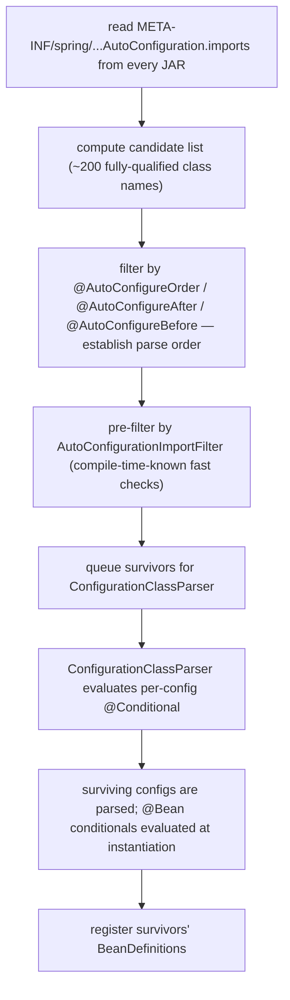
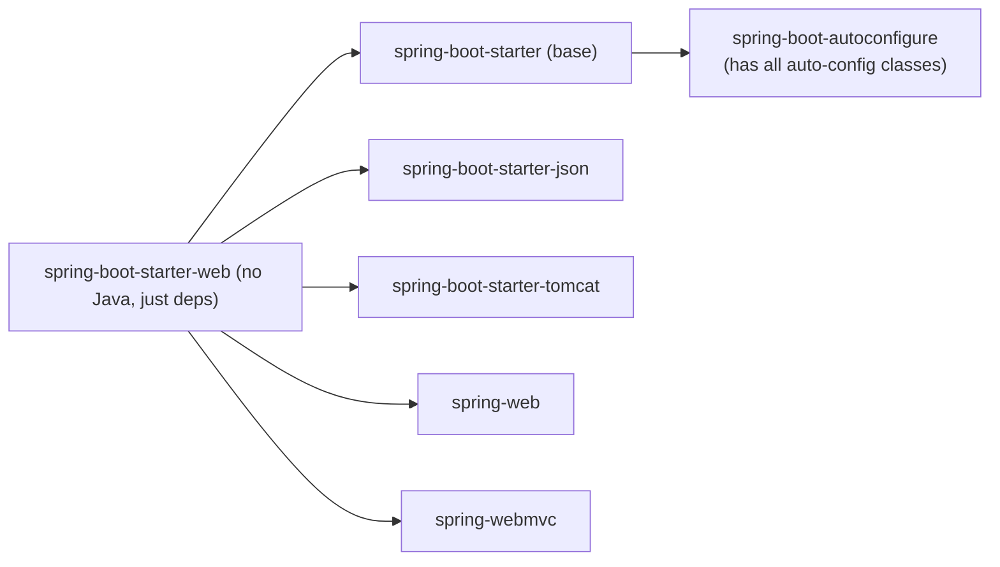
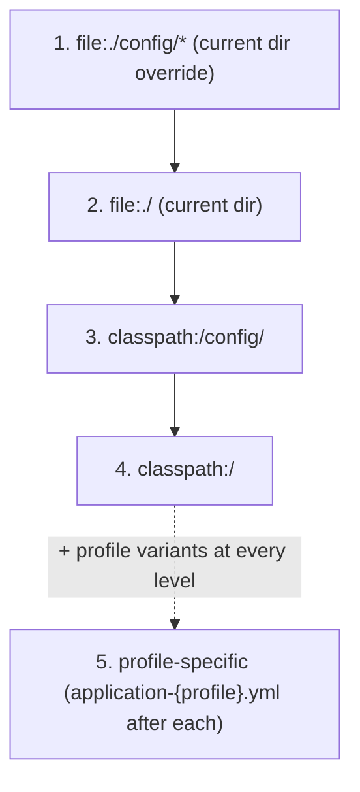
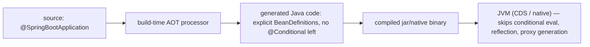
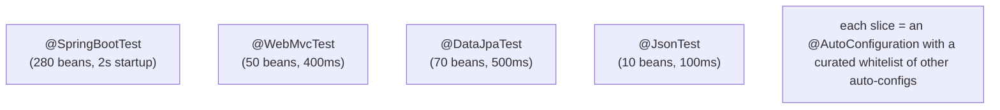

# Spring Boot Auto-Configuration & Starters

The single annotation `@SpringBootApplication` on a `main` class — and a single dependency `spring-boot-starter-web` in your build — gets you an HTTP server, JSON serialization, a thread pool, error handling, request mapping, validation, content negotiation, security headers (basic), health endpoints (if Actuator is added), graceful shutdown, log configuration, metrics scaffolding, and tracing hooks. Nothing in your code asked for any of this. **You wrote ~10 lines of Java and got ~280 beans wired into a working web service.** That ratio — and the fact that you can override any one of them without forking the framework — is what made Spring Boot the de-facto Java backend platform.

This topic explains **how Boot pulls that off**, end-to-end. Two mechanisms compose to produce the magic:

1. **The starter pattern** — a `spring-boot-starter-*` JAR is essentially an empty POM whose only job is to pull in a curated set of transitive dependencies (e.g., `starter-web` brings in `spring-web`, `spring-webmvc`, `jackson-databind`, `tomcat-embed-core`, …). One Maven coordinate replaces 15 hand-maintained ones. The starter does no Java work itself; it is a manifest.
2. **Auto-configuration** — `@EnableAutoConfiguration` (transitively included via `@SpringBootApplication`) triggers `AutoConfigurationImportSelector`, which reads `META-INF/spring/org.springframework.boot.autoconfigure.AutoConfiguration.imports` from every JAR on the classpath. The file lists ~200 `@AutoConfiguration` classes; each is a fully-conditional `@Configuration` that asks "are the classes I need on the classpath?" and "did the user not already declare these beans?". Survivors register their `@Bean`s into the same `beanDefinitionMap` (T01).

The depth-bar this topic clears: at the **language layer**, the `@SpringBootApplication` meta-annotation, `@AutoConfiguration` and its ordering hints (`@AutoConfigureAfter`, `@AutoConfigureBefore`, `@AutoConfigureOrder`), the `@ConditionalOn*` vocabulary in full, the starter POM pattern, the `application.yml` / `application.properties` resolution chain and profile selection. At the **memory layer**, the conditional evaluation pipeline — how `~200` candidates get pruned to `~40` survivors in ~150 ms, and how Boot 3+ ahead-of-time (AOT) processing pre-computes the pruning at build time to deliver native-friendly cold start. At the **architecture layer** — the heart — the **failure modes you actually debug**: missing bean conflicts, conditional evaluation reports, why your `@Bean` overrode the auto-config (or did not), how to write your *own* starter for your team's shared libraries, and how `@SpringBootTest` test slices use the same conditional machinery to bring up a minimal partial application context.

> [!NOTE]
> Prerequisites: T01–T06. Particularly the `@Conditional` machinery from T04 (every auto-config is gated by `@ConditionalOnClass` / `@ConditionalOnMissingBean` / `@ConditionalOnProperty`) and `@Configuration` proxies (`proxyBeanMethods = false` is the default for auto-configs).

## What "Auto-Configuration" Actually Is

An **auto-configuration** is a normal Spring `@Configuration` class that **opts in to running only when specific conditions hold**, and that **opts out of declaring beans the user has already declared**.

A minimal one — Boot's own `HttpEncodingAutoConfiguration` simplified:

```java
@AutoConfiguration
@EnableConfigurationProperties(HttpEncodingProperties.class)
@ConditionalOnWebApplication(type = SERVLET)
@ConditionalOnClass(CharacterEncodingFilter.class)
@ConditionalOnProperty(prefix = "server.servlet.encoding", value = "enabled", matchIfMissing = true)
public class HttpEncodingAutoConfiguration {

    private final HttpEncodingProperties properties;

    public HttpEncodingAutoConfiguration(HttpEncodingProperties properties) {
        this.properties = properties;
    }

    @Bean
    @ConditionalOnMissingBean
    public CharacterEncodingFilter characterEncodingFilter() {
        CharacterEncodingFilter filter = new OrderedCharacterEncodingFilter();
        filter.setEncoding(properties.getCharset().name());
        filter.setForceRequestEncoding(properties.shouldForce(Type.REQUEST));
        filter.setForceResponseEncoding(properties.shouldForce(Type.RESPONSE));
        return filter;
    }
}
```

Reading top to bottom:

- `@AutoConfiguration` — a meta-annotation that includes `@Configuration(proxyBeanMethods = false)` plus auto-config-specific hints. Spring Boot 2.7+ syntax; pre-2.7 used `@Configuration` directly and listed the class in `META-INF/spring.factories` under `EnableAutoConfiguration`.
- `@EnableConfigurationProperties(HttpEncodingProperties.class)` — register the typed config binding (T04 § ConfigurationProperties).
- `@ConditionalOnWebApplication(type = SERVLET)` — only when the app is a servlet-based web app (Tomcat / Jetty / Undertow).
- `@ConditionalOnClass(CharacterEncodingFilter.class)` — only when Spring Web's `CharacterEncodingFilter` is on the classpath. Without `spring-web`, this auto-config is skipped.
- `@ConditionalOnProperty(prefix = "server.servlet.encoding", value = "enabled", matchIfMissing = true)` — only when the user has not set `server.servlet.encoding.enabled=false`. The `matchIfMissing = true` makes "missing" count as "yes".
- `@Bean @ConditionalOnMissingBean` — declare a `CharacterEncodingFilter` only if the user has not declared one themselves.

The pattern repeats across 200+ auto-configurations. *Conditions gate every layer:* the auto-config class itself, then individual `@Bean` methods. The result: Boot makes choices, but the user can always opt out at every level.

## Inside `@SpringBootApplication`

The annotation:

```java
@Target(ElementType.TYPE)
@Retention(RetentionPolicy.RUNTIME)
@Documented
@Inherited
@SpringBootConfiguration                            // = @Configuration(proxyBeanMethods = false)
@EnableAutoConfiguration
@ComponentScan(excludeFilters = { ... })           // default-scan the same package downward
public @interface SpringBootApplication { ... }
```

Three sub-annotations:

1. **`@SpringBootConfiguration`** — marker that this is a Boot-aware `@Configuration`. Used by tests (`@SpringBootTest` looks up the test's `@SpringBootConfiguration`-annotated root).
2. **`@EnableAutoConfiguration`** — `@Import(AutoConfigurationImportSelector.class)`. This is the *engine* — see next section.
3. **`@ComponentScan`** — scans the package containing the annotated class (and subpackages). The default exclude filter prevents scanning auto-config beans (Boot's are picked up via `@Import`, not scan).

You can decompose it: writing `@Configuration + @EnableAutoConfiguration + @ComponentScan` separately is *equivalent* and sometimes useful (e.g., a Boot CLI app that doesn't want component scan).

## The Engine — `AutoConfigurationImportSelector`

Triggered by `@Import(AutoConfigurationImportSelector.class)` inside `@EnableAutoConfiguration`. Implements `DeferredImportSelector` (T04) — runs *after* regular `@ComponentScan` so it sees what the user has already registered.

Phases:



### Phase 1: Reading the Imports File

Each Boot starter / autoconfigure module has a file at:

```
META-INF/spring/org.springframework.boot.autoconfigure.AutoConfiguration.imports
```

A plain-text list, one fully-qualified class name per line. E.g., `spring-boot-autoconfigure-3.x.jar`'s file has ~150 lines:

```
org.springframework.boot.autoconfigure.aop.AopAutoConfiguration
org.springframework.boot.autoconfigure.cache.CacheAutoConfiguration
org.springframework.boot.autoconfigure.jdbc.DataSourceAutoConfiguration
org.springframework.boot.autoconfigure.jpa.HibernateJpaAutoConfiguration
org.springframework.boot.autoconfigure.web.servlet.WebMvcAutoConfiguration
...
```

`spring-cloud-starter` adds another file with its own ~30 auto-configs. Every starter contributes.

Boot 2.6 and earlier used `META-INF/spring.factories` with `org.springframework.boot.autoconfigure.EnableAutoConfiguration=` as the key. Boot 2.7+ moved to the dedicated imports file for performance and clarity. Both formats are still read for backward compatibility.

### Phase 2: Candidate List

The selector aggregates every imports file into one ordered list. Duplicates are deduplicated. Typical Spring Boot app: 200–300 candidates before filtering.

### Phase 3: Ordering

`@AutoConfigureAfter(SomeOther.class)` and `@AutoConfigureBefore(SomeOther.class)` declare *parse-order* constraints. `@AutoConfigureOrder(int)` is a coarser hint. Boot solves the dependency graph and assigns a parse order.

Why does parse order matter? Because `@ConditionalOnBean(DataSource.class)` only sees a `DataSource` bean if the `DataSource`-providing auto-config has already been processed. Auto-configs that depend on others must come *after*:

```java
@AutoConfiguration(after = DataSourceAutoConfiguration.class)
public class HibernateJpaAutoConfiguration { ... }
```

This says "parse `DataSourceAutoConfiguration` first, then me." When `HibernateJpaAutoConfiguration` reaches `@ConditionalOnBean(DataSource.class)`, the data-source bean is already pending registration and the condition matches.

### Phase 4: `AutoConfigurationImportFilter` — Fast Pre-Pruning

Boot ships specialized filters that run before the full `ConfigurationClassParser`:

- **`OnClassCondition`** — extracted from `@ConditionalOnClass`. Spring Boot scans the candidate's class file (ASM, no class load) for `@ConditionalOnClass(X.class)` and tests `X` via `ClassLoader.getResource(X.class.replace('.', '/') + ".class")`. If absent, skip the auto-config without even parsing it.
- **`OnBeanCondition`** — similar pre-pruning for `@ConditionalOnBean` when statically determinable.
- **`OnWebApplicationCondition`** — fast test for servlet vs reactive vs non-web.

This pre-pruning is critical for startup performance. Without it, every candidate's full `@Configuration` would be parsed (loading classes, running annotation processors, evaluating SpEL) — measured at ~10 ms per candidate × 200 candidates = 2 s. The fast filter drops the time to ~150 ms total.

Spring Boot extends this with **AutoConfigurationMetadata** — a pre-computed text file in each autoconfigure JAR (`META-INF/spring-autoconfigure-metadata.properties`) that lists each auto-config's class-, bean-, and web-application conditions. The pre-filter reads this metadata directly, never even running its own ASM parse.

```
org.springframework.boot.autoconfigure.web.servlet.WebMvcAutoConfiguration=
org.springframework.boot.autoconfigure.web.servlet.WebMvcAutoConfiguration.ConditionalOnClass=jakarta.servlet.Servlet,org.springframework.web.servlet.DispatcherServlet
org.springframework.boot.autoconfigure.web.servlet.WebMvcAutoConfiguration.ConditionalOnWebApplication=SERVLET
org.springframework.boot.autoconfigure.web.servlet.WebMvcAutoConfiguration.AutoConfigureOrder=0
```

The build-time tool `spring-boot-autoconfigure-processor` generates this metadata for you when you write your own starters.

### Phase 5–7: Parse and Conditional Evaluation

Each surviving auto-config goes through the standard `ConfigurationClassParser` (T04). Per-method `@Conditional`s are evaluated lazily at bean instantiation time, after all auto-configs have been parsed (so `@ConditionalOnBean` sees the full picture).

### Phase 8: Registration

Surviving `@Bean` methods register their `BeanDefinition`s. Phase 4 of `refresh()` (T01) instantiates them.

## A Real Trace — `spring-boot-starter-web` Bootstrap

For a minimal `@SpringBootApplication` with only `spring-boot-starter-web`:

| Stage | Duration | Count |
|-------|---------:|------:|
| Classpath scan + JAR enumeration | ~50 ms | 60 JARs |
| Read all `AutoConfiguration.imports` | ~10 ms | 280 candidates |
| Pre-filter (`OnClassCondition`) via metadata | ~80 ms | 280 → 130 |
| Parse survivors | ~150 ms | 130 |
| Per-`@Bean` conditional evaluation | ~80 ms | ~400 candidate beans |
| Register surviving beans | ~5 ms | ~280 beans |
| Phase 4 instantiation | ~600 ms | 280 |
| `SmartLifecycle.start` (Tomcat) | ~200 ms | — |
| **Total to `ApplicationReadyEvent`** | **~1.2 s** | — |

Among the ~280 beans:

- Tomcat: `TomcatServletWebServerFactory`, `TomcatConnectorCustomizer`, …
- Spring MVC: `DispatcherServlet`, `RequestMappingHandlerMapping`, `RequestMappingHandlerAdapter`, `ExceptionHandlerExceptionResolver`, …
- Jackson: `ObjectMapper`, `MappingJackson2HttpMessageConverter`, …
- Error handling: `ErrorAttributes`, `BasicErrorController`, …
- Logging: `LoggingSystem`, `LogbackLoggingSystem`, …
- Validation: `LocalValidatorFactoryBean`, `MethodValidationPostProcessor`, …
- Misc infrastructure: `Environment`, `PropertySourcesPlaceholderConfigurer`, …

## The Starter Pattern

A Spring Boot starter is a near-empty Maven/Gradle module whose only artifact is a `pom.xml` listing transitive dependencies:

```xml
<!-- spring-boot-starter-web/pom.xml -->
<dependencies>
    <dependency><groupId>org.springframework.boot</groupId><artifactId>spring-boot-starter</artifactId></dependency>
    <dependency><groupId>org.springframework.boot</groupId><artifactId>spring-boot-starter-json</artifactId></dependency>
    <dependency><groupId>org.springframework.boot</groupId><artifactId>spring-boot-starter-tomcat</artifactId></dependency>
    <dependency><groupId>org.springframework</groupId><artifactId>spring-web</artifactId></dependency>
    <dependency><groupId>org.springframework</groupId><artifactId>spring-webmvc</artifactId></dependency>
</dependencies>
```

That's it. No Java. The starter exists so you write **one** dependency in your build file (`org.springframework.boot:spring-boot-starter-web`) instead of five. The auto-configuration classes live in the *autoconfigure* JAR (`spring-boot-autoconfigure`), pulled in via the base `spring-boot-starter`.



A "starter" is a *labelled bundle* — the version-managed set of dependencies a Boot version curates together. Adding `spring-boot-starter-data-jpa` brings in Hibernate, Spring Data JPA, a JDBC driver tail (HikariCP), and the JPA auto-configurations. The starter does no Java work; it is a Maven manifest.

### Writing Your Own Starter

Common case: your team has a shared library (e.g., a custom OAuth2 client wiring, a per-tenant tracing aspect) used by 30 services. Make it a starter so adoption is one dependency.

Structure: two modules.

**Module 1: `mycompany-foo-autoconfigure`** — contains the `@AutoConfiguration` class:

```java
@AutoConfiguration
@ConditionalOnClass(FooClient.class)
@EnableConfigurationProperties(FooProperties.class)
public class FooAutoConfiguration {

    @Bean
    @ConditionalOnMissingBean
    public FooClient fooClient(FooProperties props) {
        return new FooClient(props.url(), props.apiKey());
    }
}
```

And `src/main/resources/META-INF/spring/org.springframework.boot.autoconfigure.AutoConfiguration.imports`:

```
com.mycompany.foo.FooAutoConfiguration
```

**Module 2: `mycompany-foo-spring-boot-starter`** — depends on the autoconfigure module and the underlying library:

```xml
<dependencies>
    <dependency><groupId>com.mycompany</groupId><artifactId>mycompany-foo-autoconfigure</artifactId></dependency>
    <dependency><groupId>com.mycompany</groupId><artifactId>mycompany-foo-client</artifactId></dependency>
</dependencies>
```

A consumer service adds `mycompany-foo-spring-boot-starter`; the auto-config kicks in if `FooClient` is on the classpath and the user has not declared their own `FooClient` bean.

### Naming Convention

- Spring's own starters: `spring-boot-starter-*`.
- Community starters: `*-spring-boot-starter` (e.g., `mybatis-spring-boot-starter`). Boot's docs explicitly request third parties suffix rather than prefix to avoid namespace pollution.

## `application.yml` / `application.properties` Resolution

Spring Boot's `ConfigDataEnvironmentPostProcessor` (Boot 2.4+) loads configuration files in a specific order:



Plus:

- `--spring.config.location=...` to override entirely.
- `--spring.config.additional-location=...` to add without replacing the defaults.
- Imports via `spring.config.import:` syntax (Boot 2.4+) — load from a Vault secret, a Kubernetes ConfigMap, a remote URL, another file.

```yaml
spring:
  config:
    import:
      - "configtree:/etc/secrets/"     # Kubernetes secret tree
      - "optional:vault://app/"        # HashiCorp Vault
      - "optional:file:./local.yml"    # Optional local override
```

This is the Spring Cloud Config replacement for many cases.

## Profiles

Active profiles drive the `application-{profile}.yml` loading:

```yaml
# application.yml
spring:
  profiles:
    active: dev,observability
```

Profiles can also be enabled by env var (`SPRING_PROFILES_ACTIVE=prod`), CLI (`--spring.profiles.active=prod`), system property (`-Dspring.profiles.active=prod`).

**Profile groups** (Boot 2.4+) compose profiles:

```yaml
spring:
  profiles:
    group:
      production: [prod, observability, eu]
```

Activating `production` → `prod` + `observability` + `eu` all active.

## `@ConfigurationPropertiesScan` and Auto-Binding

Boot 2.2+ scans for `@ConfigurationProperties` annotations *automatically* when `@SpringBootApplication` is present — no need for `@EnableConfigurationProperties` on individual records. With `@ConfigurationPropertiesScan` you can extend or restrict the search.

## Conditions Evaluation Report

Boot has a built-in debug report for what auto-configurations matched, what did not, and why. Two ways to see it:

1. CLI: `--debug` flag.
2. Actuator endpoint: `GET /actuator/conditions` (Boot 2.x: `/actuator/autoconfig`).

Output:

```
=========================
AUTO-CONFIGURATION REPORT
=========================

Positive matches:
-----------------
   DataSourceAutoConfiguration matched:
      - @ConditionalOnClass found required class 'javax.sql.DataSource'
      - @ConditionalOnMissingBean (types: DataSource; SearchStrategy: all) did not find any beans

Negative matches:
-----------------
   ActiveMQAutoConfiguration:
      Did not match:
         - @ConditionalOnClass did not find required class 'javax.jms.ConnectionFactory'

Unconditional classes:
----------------------
   org.springframework.boot.autoconfigure.context.ConfigurationPropertiesAutoConfiguration
   ...
```

This is the *single most useful Boot debugging tool*. When a bean you expected does not appear (or an auto-config you wanted is silently disabled), the report tells you exactly which condition failed.

## `FailureAnalyzer` — Better Startup Errors

When the container fails to start, Spring Boot's `FailureAnalyzers` translate stack traces into human-readable diagnostics:

```
***************************
APPLICATION FAILED TO START
***************************

Description:

Field clock in com.example.UserService required a bean of type 'java.time.Clock' that could not be found.

The injection point has the following annotations:
        - @org.springframework.beans.factory.annotation.Autowired(required=true)

Action:

Consider defining a bean of type 'java.time.Clock' in your configuration.
```

Boot ships ~20 `FailureAnalyzer`s covering port conflicts, missing beans, schema errors, broken classpath, etc. Each translates a specific exception class to a fix recipe. Write your own for your team's idiomatic errors:

```java
public class MyMissingTokenAnalyzer extends AbstractFailureAnalyzer<MissingTokenException> {
    @Override
    protected FailureAnalysis analyze(Throwable rootFailure, MissingTokenException cause) {
        return new FailureAnalysis(
            "No API token configured for service.",
            "Set mycompany.api.token in your application.yml, or set MYCOMPANY_API_TOKEN env var.",
            cause);
    }
}
```

Register in `META-INF/spring.factories` under `org.springframework.boot.diagnostics.FailureAnalyzer`.

## AOT — Spring Boot 3 Build-Time Pre-Processing

Spring Boot 3 (and Spring 6) introduced **ahead-of-time (AOT) processing**, a Maven/Gradle build step that:

- Resolves every `@Conditional` at build time (your dev/staging environment) and bakes the result.
- Pre-generates CGLIB proxies needed for AOP and `@Configuration`.
- Pre-computes the `BeanDefinition` graph and emits Java code that constructs it directly (no reflection).
- Removes reflection dependencies where it can, paving the way for GraalVM Native Image.

Result: cold start drops from ~1.2 s to ~100–300 ms for a typical web app. With `native-image` compilation on top: ~30 ms cold start, ~50 MB RSS, no JIT warmup penalty.



Trade-offs: build time grows (~30 s of extra work for a medium app); some dynamism is lost (you cannot change `@Conditional` outcomes at runtime); reflection / proxy classes that AOT did not predict must be hinted at via `@RegisterReflectionForBinding` / `RuntimeHintsRegistrar`.

## Test Slices

Test slices use the same conditional infrastructure to bootstrap a *partial* application context. Each slice is itself an `@AutoConfiguration`-tagged annotation that imports a specific subset:

| Slice annotation | Brings up |
|------------------|-----------|
| `@SpringBootTest` | the **full** application context |
| `@WebMvcTest` | Spring MVC + the controllers under test, no service / repo beans |
| `@DataJpaTest` | Spring Data JPA + embedded H2 by default, no web |
| `@JsonTest` | Jackson + JSON utility beans only |
| `@WebFluxTest` | Spring WebFlux without service beans |
| `@RestClientTest` | one `RestClient` with `MockRestServiceServer` wired |
| `@JdbcTest` | `DataSource` + `JdbcTemplate` |
| `@DataMongoTest` | Spring Data MongoDB + embedded Mongo |

`@WebMvcTest(UserController.class)` boots `DispatcherServlet`, `RequestMappingHandlerMapping`, Jackson, and your `UserController` — but **not** `UserService` (you mock it). Startup drops from 2 s to ~400 ms; tests run faster, isolation improves.



## Common Pitfalls

> [!WARNING]
> **Wondering why your `@Bean` was overridden.** Boot defaults `spring.main.allow-bean-definition-overriding=false` (since 2.1). If you declare a bean of the same name as an auto-config's, the container fails to start. Either rename or use `@ConditionalOnMissingBean` on yours and rely on auto-config to skip.

> [!WARNING]
> **Excluding an auto-config when you really want to override one bean.** `@SpringBootApplication(exclude = DataSourceAutoConfiguration.class)` skips *every* bean that auto-config declares — including ones you wanted. Better to declare your own bean and let `@ConditionalOnMissingBean` handle the rest.

> [!WARNING]
> **Forgetting `spring-boot-configuration-processor` for `@ConfigurationProperties`.** Without it, your IDE has no autocompletion for `application.yml` keys. Add it as `optional` / `annotationProcessor` and Boot generates `META-INF/spring-configuration-metadata.json`.

> [!WARNING]
> **`@ComponentScan` on a class above the `Application` package.** Boot's default scan starts at the `Application` class's package. Putting `Application.java` at the *root* of your code namespace is the convention so the entire codebase gets scanned without manual `basePackages`.

> [!WARNING]
> **Mixing `application.properties` and `application.yml`.** Spring Boot reads both; the `.properties` wins on key conflict (`properties` is loaded after `.yml`). Confusion follows. Pick one.

> [!WARNING]
> **AOT incompatibility.** Build-time AOT (and Native Image) require that every reflection target be known at build time. Code that dynamically loads classes (`Class.forName`, ServiceLoader, dynamic SpEL) needs `@RegisterReflectionForBinding` hints. Skipping the hints produces hard-to-debug runtime failures *only in native mode*.

## Practice

1. Build a minimal Boot app with only `spring-boot-starter`. Run `--debug` and read the conditions report. Count how many auto-configs match (should be ~10) versus how many were considered (~250).
2. Add `spring-boot-starter-web`. Compare the new conditions report — how many auto-configs flipped from negative to positive? Identify which classes appearing on the classpath did it.
3. Write your own auto-configuration with `@AutoConfiguration`, `@ConditionalOnClass`, and `@ConditionalOnMissingBean`. Register it via `AutoConfiguration.imports`. Confirm it activates when the dependency is present and steps aside when the user declares their own bean.
4. Build a two-module starter (`autoconfigure` + `starter`). Add it to a consumer service via one dependency line. Confirm the consumer sees the new bean without writing any wiring.
5. Trigger a deliberate startup failure (missing required property). Watch Boot's `FailureAnalyzer` produce a user-friendly error. Now write your own `FailureAnalyzer` for a custom exception your team's code throws.
6. Enable AOT processing (`spring-boot-maven-plugin` `process-aot` goal). Inspect the generated code (in `target/spring-aot/main/sources/`). Confirm conditionals are resolved and `BeanDefinition`s are constructed without reflection.
7. Use `@DataJpaTest` for a repository test. Measure startup time vs `@SpringBootTest`. Look at the bean list (`ctx.getBeanDefinitionNames()`) and confirm only ~70 beans are wired vs 280.
8. Read the `META-INF/spring/org.springframework.boot.autoconfigure.AutoConfiguration.imports` file from `spring-boot-autoconfigure-3.x.jar`. Count entries. Pick three and read their source — note the `@ConditionalOn*` chains.

## Recap

You should now be able to:

- Explain what `@SpringBootApplication` decomposes into (`@SpringBootConfiguration` + `@EnableAutoConfiguration` + `@ComponentScan`) and the role of each.
- Walk the `AutoConfigurationImportSelector` pipeline end-to-end: read imports files → candidate list → ordering → fast pre-filter via `AutoConfigurationMetadata` → parse → per-`@Bean` conditional → register.
- Articulate the role of `@AutoConfigureBefore` / `@AutoConfigureAfter` / `@AutoConfigureOrder` in resolving auto-config inter-dependencies.
- Read a "Conditions Evaluation Report" and diagnose why an expected bean is or is not appearing.
- Write your own auto-configuration with `@AutoConfiguration` + `@ConditionalOn*` + `@EnableConfigurationProperties`.
- Build a two-module starter (autoconfigure + starter POM) and explain why a starter contains no Java.
- Reason about `application.yml` / `application.properties` resolution order, profile-specific files, `spring.config.import`, and profile groups.
- Use test slices (`@WebMvcTest`, `@DataJpaTest`, `@JsonTest`) and explain how the conditional machinery curates the bean set.
- Quantify Boot's startup cost (~1.2 s typical), identify the dominant phase (instantiation), and use AOT processing for a ~3–10× cold-start speedup.
- Recognize and avoid the common pitfalls: bean override conflicts, exclude over-reach, missing config processor, classpath structure for default `@ComponentScan`.

## Next

Continue to [Spring Boot Properties & Profiles](./T08-spring-boot-properties-and-profiles.md) for the deep treatment of property resolution — the full source ordering, relaxed binding, secrets handling, and how `spring.config.import` integrates with Vault, Consul, Kubernetes ConfigMaps, and Spring Cloud Config.
