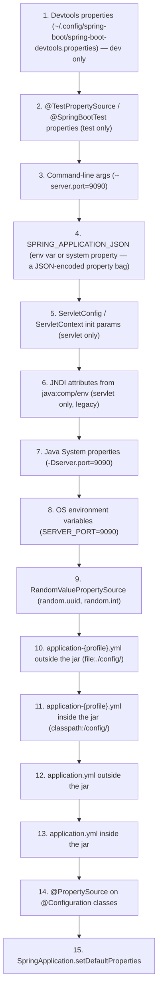
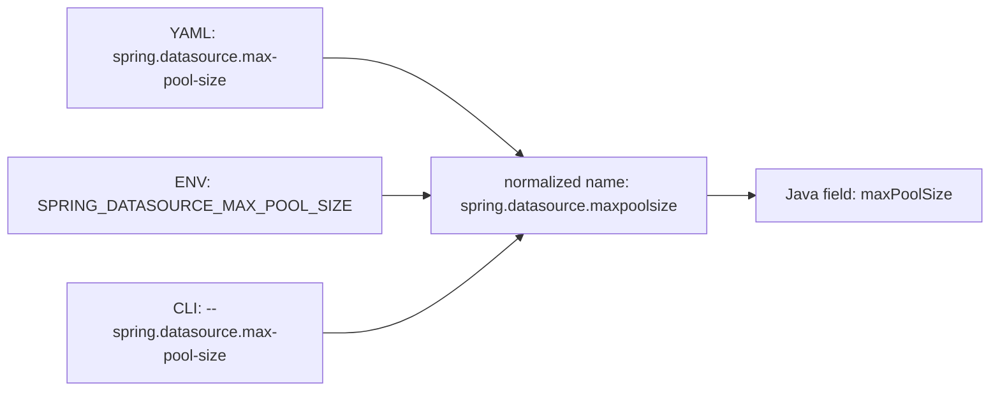
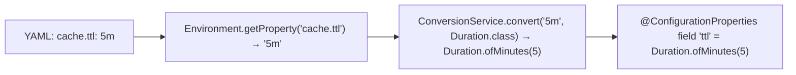
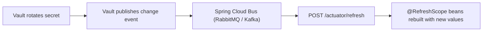

# Spring Boot Properties & Profiles

A Spring Boot service has roughly **150–500 configurable settings** — port numbers, database URLs, timeouts, retry counts, JVM tuning, feature flags, security keys, log levels, metric tags. None belong in source. All must be controllable per environment, per region, per tenant, and per deployment, with secrets isolated from non-secrets, with overrides possible at the CLI, with a clean audit trail of where every value came from. Spring Boot's **property and profile machinery** is the well-engineered solution to this universally-hard problem.

This topic is the deep treatment of the property layer. T04 introduced `Environment`, `@Value`, and `@ConfigurationProperties`; T07 mentioned `application.yml` loading. Here we walk **every** property source Spring Boot reads, **the exact ordering**, the **relaxed-binding** algorithm that maps YAML kebab-case to environment-variable upper-snake to camelCase Java fields, the **`spring.config.import`** machinery that loads from Vault / Kubernetes ConfigMaps / Consul / arbitrary URIs, **profile activation** across all entry points, the **secret-handling** patterns that keep production credentials out of git, and **type conversion** for `Duration`, `DataSize`, `Period`, `List`, `Map`, `Enum`, and your own custom types.

The depth-bar this topic clears: at the **language layer**, every property-source kind and configuration mechanism. At the **memory layer**, what the `MutablePropertySources` chain actually looks like in a running app — typically 8–15 sources, each ~100–500 KB of resolved properties, the resolution being a single-pass linear scan that terminates at the first source containing the requested key (with care for case-insensitive variants). At the **architecture layer** — the heart — **Spring Boot's `ConfigData` engine** (Boot 2.4+), the rewrite that replaced `application-{profile}.yml`-loading with a pluggable `ConfigDataLocationResolver` + `ConfigDataLoader` SPI; how the same engine integrates with Vault, AWS Secrets Manager, GCP Secret Manager, Kubernetes mounted volumes, and Consul KV; and the **operational reality** of secret rotation, hot-reload, and what *actually* happens when you change a key in Vault while a service is running.

> [!NOTE]
> Prerequisites: T01–T07. Particularly `Environment` and `@ConfigurationProperties` from T04, and the bootstrap pipeline from T07.

## The Property Sources In Order

Spring Boot's `Environment` is a chain of `PropertySource`s — each source is a named bag of `String → String` (conceptually) pairs. Resolution is by walk-and-return: ask source 1; if it has the key, return it; otherwise ask source 2; etc.

The order is (highest precedence first; later entries lose to earlier ones):



(The exact order is documented in Spring Boot reference. The picture is "command-line beats env beats file beats defaults", with profile-specific files beating plain files.)

A reader-friendly rule of thumb: **higher → more specific → wins**. CLI is the most specific (one command); env vars are very specific (this process); files are less specific (this deployment); defaults are least specific.

### How `Environment` Looks Inside a Running App

`MutablePropertySources` is a `CopyOnWriteArrayList<PropertySource<?>>`. After Boot startup it typically contains:

```
configurationProperties           ← merged binder view
servletConfigInitParams           ← (often empty in standard Boot)
servletContextInitParams          ← (often empty)
systemProperties                  ← Java -D
systemEnvironment                 ← OS env vars
random
Config resource 'class path resource [application.yml]'
Config resource 'class path resource [application-dev.yml]'  ← if dev profile active
springCloudClientHostInfo         ← if Spring Cloud is present
springCloudVault                  ← if Vault import is configured
... etc.
```

You can dump the full chain at runtime:

```java
@Component
class EnvDumper {
    EnvDumper(ConfigurableEnvironment env) {
        env.getPropertySources().forEach(ps ->
            System.out.println("source=" + ps.getName()));
    }
}
```

Or get it from Actuator: `GET /actuator/env`. The `/env` endpoint shows every source plus every key inside it (with secret-keyword redaction).

## `application.yml` vs `application.properties`

Boot reads either or both. YAML is the modern default — supports nesting, lists, multi-document streams. Properties syntax is flatter and still useful in CI pipelines (one key per line).

### YAML

```yaml
server:
  port: 8080
  shutdown: graceful
  servlet:
    context-path: /api
spring:
  application:
    name: orders-service
  datasource:
    url: jdbc:postgresql://localhost:5432/orders
    hikari:
      maximum-pool-size: 20
      connection-timeout: 30s
features:
  payment-v2: true
  rates:
    - source: ecb
      currency: EUR
    - source: rbi
      currency: INR
```

YAML keys can use **dotted paths** or **nesting**. They are equivalent:

```yaml
server.port: 8080         # dotted
```

Equivalent to:

```yaml
server:
  port: 8080
```

### Multi-Document YAML for Profiles

A single `application.yml` can hold multiple profile sections separated by `---`:

```yaml
server.port: 8080
spring.application.name: orders

---
spring.config.activate.on-profile: dev
spring.datasource.url: jdbc:h2:mem:testdb

---
spring.config.activate.on-profile: prod
spring.datasource.url: jdbc:postgresql://prod-db:5432/orders
spring.datasource.username: ${DB_USER}
spring.datasource.password: ${DB_PASS}
```

The `spring.config.activate.on-profile` key (Boot 2.4+) gates a document on a profile. Replaces the older `spring.profiles:` syntax (deprecated). Each document's properties are added to the property-source chain only when its profile is active.

### Properties Syntax

```properties
server.port=8080
server.shutdown=graceful
server.servlet.context-path=/api
spring.application.name=orders-service
spring.datasource.url=jdbc:postgresql://localhost:5432/orders
spring.datasource.hikari.maximum-pool-size=20
features.payment-v2=true
features.rates[0].source=ecb
features.rates[0].currency=EUR
features.rates[1].source=rbi
features.rates[1].currency=INR
```

Lists use `[0]`, `[1]`, … indices. Maps use bracketed keys (`property[key]=value`). Less readable than YAML for nested structures but easier to grep.

## Relaxed Binding — The Most Important Detail

Spring Boot's `Binder` does **relaxed property binding**: the same logical key can be written in multiple cases and styles, and they all bind to the same Java target. This makes YAML, env vars, and Java field names interoperable.

For a Java field named `maxPoolSize`, *all* of these YAML / env / CLI keys bind:

| Source | Style | Example |
|--------|-------|---------|
| YAML / properties | kebab-case (canonical) | `max-pool-size: 20` |
| YAML / properties | camelCase | `maxPoolSize: 20` |
| YAML / properties | underscore | `max_pool_size: 20` |
| Env var | UPPER_SNAKE_CASE | `MAX_POOL_SIZE=20` |
| CLI / Java sys-prop | various | `--max-pool-size=20`, `-Dmax-pool-size=20` |

**Canonical form is kebab-case** for YAML. Env vars *must* be UPPER_SNAKE_CASE (real shells can only set those reliably). The mapper handles both.



The normalization: strip hyphens and underscores, lowercase. `MAX_POOL_SIZE`, `max-pool-size`, `maxPoolSize` all collapse to `maxpoolsize`. The binder matches against the Java field's canonical name.

### `@ConfigurationProperties` Binding in Detail

```java
@ConfigurationProperties(prefix = "spring.datasource.hikari")
public record HikariSettings(
    int maximumPoolSize,
    Duration connectionTimeout,
    Duration idleTimeout,
    Duration maxLifetime,
    String connectionTestQuery,
    @Nested PoolMetrics metrics
) { }

public record PoolMetrics(boolean enabled, Duration sampleInterval) { }
```

With `application.yml`:

```yaml
spring:
  datasource:
    hikari:
      maximum-pool-size: 20
      connection-timeout: 30s
      idle-timeout: 10m
      max-lifetime: 30m
      metrics:
        enabled: true
        sample-interval: 5s
```

The `Binder` traverses the record's components, looks up each in the `Environment` under the prefix, applies the `ConversionService` (next section), and constructs the record via its canonical constructor.

For nested objects you can use `@Nested` (Boot 3+) or just have the record component be a record itself — the binder recurses.

### Lists and Maps

```java
@ConfigurationProperties("features")
public record FeatureProperties(
    boolean paymentV2,
    List<Rate> rates,
    Map<String, Boolean> flags
) { }

public record Rate(String source, String currency) { }
```

YAML:

```yaml
features:
  payment-v2: true
  rates:
    - source: ecb
      currency: EUR
    - source: rbi
      currency: INR
  flags:
    fast-checkout: true
    new-search: false
```

Env vars are clunkier for lists:

```bash
FEATURES_RATES_0_SOURCE=ecb
FEATURES_RATES_0_CURRENCY=EUR
FEATURES_RATES_1_SOURCE=rbi
FEATURES_RATES_1_CURRENCY=INR
FEATURES_FLAGS_FAST_CHECKOUT=true
FEATURES_FLAGS_NEW_SEARCH=false
```

`SPRING_APPLICATION_JSON` is the way to set nested structures cleanly from env:

```bash
SPRING_APPLICATION_JSON='{"features":{"rates":[{"source":"ecb","currency":"EUR"}]}}'
```

The JSON is parsed and overlaid into the property source chain — much higher precedence than `application.yml`.

## Type Conversion — The `ConversionService`

The `ConversionService` knows ~80 string-to-X conversions. The most useful for config:

| Target type | Accepted forms | Examples |
|-------------|----------------|----------|
| `Integer`, `Long`, `Double` | numeric literal | `42`, `1_000_000`, `3.14` |
| `Boolean` | `true`/`false`/`yes`/`no`/`1`/`0` | `true` |
| `Duration` | ISO-8601 or shorthand | `PT30S`, `30s`, `5m`, `1h30m`, `2d` |
| `Period` | ISO-8601 or shorthand | `P30D`, `30d`, `2w`, `3mo`, `1y` |
| `DataSize` | suffix-shorthand | `1GB`, `512MB`, `200KB`, `1024B` |
| `Enum` | name | `INFO`, `WARNING` |
| `List<X>`, `Set<X>` | YAML list, or comma-separated string | `[a, b, c]`, `"a,b,c"` |
| `Map<K, V>` | YAML map, or `k1=v1,k2=v2` | various |
| `Charset` | name | `UTF-8` |
| `Locale` | tag | `en-US` |
| `MimeType` / `MediaType` | string | `application/json` |
| `URL`, `URI` | string | `https://...` |
| `Path`, `File` | string | `/var/log/app.log` |
| `Resource` | URL or classpath / file | `classpath:keys.pem` |
| `Class<?>` | fully-qualified name | `com.example.MyClass` |

Custom converters via `@Component`-implementing `Converter<String, MyType>`:

```java
@Component
public class StringToCronConverter implements Converter<String, CronExpression> {
    @Override public CronExpression convert(String src) {
        return CronExpression.parse(src);
    }
}
```

Auto-discovered by Boot; added to the global `ConversionService`. Now any `@Value("${schedule.cron}") CronExpression` works.



## Profiles — All the Activation Mechanisms

`spring.profiles.active` lists the currently active profiles. Multiple, comma-separated.

### Setting profiles

| Source | Syntax | Notes |
|--------|--------|-------|
| Env var | `SPRING_PROFILES_ACTIVE=prod,eu` | most common in containers |
| Java sys-prop | `-Dspring.profiles.active=prod` | |
| Command-line | `--spring.profiles.active=prod` | overrides env var |
| `application.yml` | `spring.profiles.active: prod` | static default |
| `SpringApplication.setAdditionalProfiles("test")` | programmatic | for embedded use cases |
| `@ActiveProfiles("test")` | on test class | test-only |

Resolution: in CLI/env/property order, `--spring.profiles.active` wins. To *add* profiles without replacing the existing list use `spring.profiles.include`:

```yaml
# application.yml
spring:
  profiles:
    active: base
    include:
      - observability
      - tracing
```

`include` is additive: setting `SPRING_PROFILES_ACTIVE=prod` makes the active profiles `prod + base + observability + tracing`.

### Profile Groups (Boot 2.4+)

A profile group expands to multiple profiles when its name is activated:

```yaml
spring:
  profiles:
    group:
      production:
        - prod
        - eu
        - observability
      qa:
        - test
        - mock-payments
```

Activating `--spring.profiles.active=production` is the same as activating `prod,eu,observability`. Cleaner for multi-dimensional environments.

### Default profile

If no profile is activated, the `default` profile is active. You can list a `application-default.yml`. Some teams prefer no implicit default and require explicit activation — set `spring.profiles.default=none` (a non-existent profile) and the property bound to `default` is essentially never read.

### Profile-Aware YAML

```yaml
# application.yml
server.port: 8080

---
spring.config.activate.on-profile: dev
server.port: 9999

---
spring.config.activate.on-profile: prod
server.port: 80
```

When `dev` is active, the second document's properties layer over the first. When `prod` is active, the third does. Without any profile, only the first applies (`port 8080`).

### `@Profile` On Beans

Discussed in T04. The `Condition` is evaluated against the active-profile set at bean-definition phase.

```java
@Service @Profile("prod") public class ProdEmailSender { ... }
@Service @Profile("!prod") public class DevEmailSender { ... }
@Service @Profile("dev | test") public class DevTestService { ... }
```

The `!`, `|`, `&` operators combine profiles in profile *expressions* (Boot 2.4+).

## `spring.config.import` — The Modern Loader

Boot 2.4 replaced the `bootstrap.yml`-based Spring Cloud Config integration with a unified `spring.config.import` system that works for *any* source.

```yaml
spring:
  config:
    import:
      - "configtree:/etc/secrets/"
      - "optional:configserver:http://config:8888"
      - "optional:vault://"
      - "optional:file:./local.yml"
```

Each entry is a **URI** with a scheme. Boot ships handlers for `file:`, `classpath:`, `configtree:` (Kubernetes-style mounted secrets, one file per key), and `optional:` (a prefix that makes the import non-fatal if missing). Third-party schemes — `configserver:`, `vault:`, `aws-secretsmanager:`, `consul:` — plug in via `ConfigDataLocationResolver` and `ConfigDataLoader` SPIs.

### `configtree:` for Kubernetes Secrets

Kubernetes' standard secret-mounting pattern writes each secret value into a separate file:

```
/etc/secrets/
  db.username     → "appuser"
  db.password     → "***"
  api.token       → "xyz123"
```

`configtree:/etc/secrets/` reads each file's content as the value of a key derived from the filename (with `.` and `_` in filenames mapped to `.` separators in the property key). The resulting property source has `db.username`, `db.password`, `api.token`. **No app code change needed when secrets change** — the file system is the contract; Kubernetes handles rotation by re-mounting.

### `vault:` for HashiCorp Vault

Adding `spring-cloud-starter-vault-config` and configuring:

```yaml
spring:
  config:
    import:
      - "vault://secret/orders-service"
  cloud:
    vault:
      authentication: token
      token: ${VAULT_TOKEN}
      uri: https://vault.internal:8200
```

`spring-cloud-vault` registers a `ConfigDataLoader` for the `vault:` scheme. At startup it makes an HTTP GET to Vault, parses the response, and adds the secret as a property source. Failures during loading prevent startup (use `optional:vault://...` to tolerate).

### Refresh

Configuration values loaded from `Environment` are bound to beans at *startup*. They do not change after that — Spring's `Environment` is queried only when a bean is being instantiated. To re-load:

- **Spring Cloud Bus + `@RefreshScope`** — a `POST /actuator/refresh` (or a message-bus event) re-fetches `Environment` and recreates beans marked `@RefreshScope`. Hot config-reload without restart.
- **Process restart** — the cleanest answer. In Kubernetes, a sidecar that watches `configtree:` files can kill the pod on change.



## Secret Handling — The Operational Reality

Five patterns, increasing in operational sophistication:

1. **Plain `application-prod.yml` with secrets in source.** Bad. Anyone with git access has every prod credential. Never.
2. **Env vars set by the deployment tool.** Better. Secrets only on the running host. Still: any process can read its own env vars (`/proc/PID/environ`), and the deployment tool needs the secrets in cleartext somewhere.
3. **Files mounted by the orchestrator.** Best baseline. Kubernetes Secret → tmpfs-mounted file → `configtree:` import. The secret never exists outside the kubelet on the node. File ownership / mode controls access.
4. **Centralized secret store (Vault, AWS Secrets Manager, GCP Secret Manager) via `spring.config.import`.** Highest control — auditable, rotatable, time-boxed, organizationally separated from deployment. Operational cost: a vault is one more thing that has to be up for your app to start.
5. **Encrypted at rest in git (SOPS, Sealed Secrets).** Useful for GitOps. The encryption key is itself secret; pushes the problem one level down (where is the key?).

Two universal rules:

- **Never log a property whose name contains `password`, `token`, `key`, `secret`, `credentials`, `private`.** Spring Boot's Actuator `/env` and `/configprops` endpoints redact these by default (`spring.boot.admin.show-values=ALWAYS` to override, never in prod).
- **Use placeholders with defaults for non-secret config; never give a default for a secret.** Without `DB_PASS` set, the app should fail to start, not silently use "password".

```java
@Value("${db.url:jdbc:h2:mem:testdb}")  // OK — sane default for non-prod
private String dbUrl;

@Value("${db.password}")                // no default — required, fail-fast in prod
private String dbPass;
```

### Property-Level Encryption with Jasypt

`jasypt-spring-boot-starter` lets you embed encrypted values:

```yaml
db:
  password: ENC(VLqMpz9SoQv0DOuD4...)
```

At resolution time, Jasypt's `PropertySource` wrapper decrypts on access. The decryption key (still a secret) is supplied via env var:

```bash
JASYPT_ENCRYPTOR_PASSWORD=...
```

You traded one secret (DB password) for one (Jasypt master). Worth it if you have many secrets and few deployment surfaces.

## Worked Example — Layered Configuration for Multi-Env

A real `application.yml` showing every layer:

```yaml
# Baseline
spring:
  application:
    name: orders-service
  jackson:
    serialization:
      write-dates-as-timestamps: false
server:
  port: 8080
  shutdown: graceful
logging:
  level:
    root: INFO

# Profile-aware imports
spring:
  config:
    import:
      - "optional:configtree:/etc/secrets/"

---
spring.config.activate.on-profile: dev
spring:
  datasource:
    url: jdbc:h2:mem:devdb
    username: sa
    password: ""

---
spring.config.activate.on-profile: staging
spring:
  datasource:
    url: jdbc:postgresql://staging-db:5432/orders
    username: ${DB_USER}
    password: ${DB_PASS}

---
spring.config.activate.on-profile: prod
spring:
  config:
    import:
      - "vault://secret/orders-service"
  datasource:
    url: jdbc:postgresql://prod-db:5432/orders
    username: ${db.user}    # comes from Vault
    password: ${db.password}# comes from Vault
  jpa:
    properties:
      hibernate:
        jdbc:
          batch_size: 50
logging:
  level:
    root: WARN
    com.example: INFO
```

In production, the deployment sets `SPRING_PROFILES_ACTIVE=prod`. The Vault import contributes `db.user` and `db.password`. The configtree provides whatever extra secrets are mounted.

In CI/staging, `SPRING_PROFILES_ACTIVE=staging` plus `DB_USER` / `DB_PASS` env vars get the right wiring. Dev runs with `SPRING_PROFILES_ACTIVE=dev` and uses H2.

## `@ConfigurationPropertiesScan` and Validation

`@ConfigurationPropertiesScan` enables auto-discovery of `@ConfigurationProperties` classes in the package. Boot 2.2+ enables it by default for the `@SpringBootApplication`'s package.

```java
@ConfigurationProperties("app.security")
@Validated
public record SecuritySettings(
    @NotBlank String issuerUri,
    @Min(60) @Max(86400) int tokenLifetimeSeconds,
    @NotEmpty List<@Pattern(regexp = "^https?://.*") String> allowedRedirects
) { }
```

`@Validated` runs Bean Validation against the bound record. A `tokenLifetimeSeconds: 30` value (under 60) fails the container's startup with a clear error pointing at the offending key. **Pushes config bugs from runtime to startup.**

## Common Pitfalls

> [!WARNING]
> **Trailing newlines in `configtree:` files.** Kubernetes secret-volume files typically end with `\n`. The value bound to the property includes that newline. Use `spring.config.import: configtree:/etc/secrets/?trim=true` (Boot 3+) or trim manually in code.

> [!WARNING]
> **Using `--debug` in production.** It dumps the entire conditions report to stdout — including the resolved property values for many beans. Many of those values are secrets. Use `--debug` only locally.

> [!WARNING]
> **Setting `spring.profiles` (deprecated) instead of `spring.config.activate.on-profile`.** Older YAML files still use the deprecated form. Boot 3+ removed support entirely. Migrate.

> [!WARNING]
> **Empty-string defaults for required properties.** `@Value("${db.password:}")` gives you an empty string when unset — likely letting your code limp along until the database rejects an empty-password attempt. Always require, never default-empty for credentials.

> [!WARNING]
> **Property names that case-collide across sources.** `SERVER_PORT` (env var) and `serverPort` (YAML camelCase) normalize to the same canonical name. If they conflict, the higher-precedence source wins — but the diagnostic is poor. Stick to canonical kebab-case in YAML.

> [!WARNING]
> **Profile `default` ambiguity.** With no profile set, `default` is implicitly active. An `application-default.yml` you forgot about can leak into prod. Set `spring.profiles.default=` to disable.

> [!WARNING]
> **Forgetting to ship `spring-boot-configuration-processor`.** Your IDE has no completions for `application.yml`. Add as `optional` / `annotationProcessor` and the build generates `META-INF/spring-configuration-metadata.json` that IDEs use.

## Practice

1. Build a Boot app with one `@ConfigurationProperties` record. Bind values from `application.yml`, then override with a CLI flag, then override with an env var. Print the final value. Trace the precedence in the conditions report.
2. Add `@Validated` to a `@ConfigurationProperties`. Introduce a deliberate violation in `application.yml`. Confirm the container fails to start with a clear error.
3. Set up a `configtree:/tmp/secrets/` import. Place files for `db.password` and `api.token`. Confirm the values appear in `Environment.getProperty(...)`. Change a file; observe that Boot does not auto-reload until restart.
4. Add `spring-cloud-starter-vault-config` (or a local Vault dev server). Configure `spring.config.import: vault://secret/myapp`. Confirm values appear. Rotate one and use `@RefreshScope` + `POST /actuator/refresh` to apply.
5. Implement a custom `Converter<String, CronExpression>`. Use it in a `@ConfigurationProperties` field. Verify YAML strings like `"0 0/5 * * * ?"` bind correctly.
6. Create multi-document YAML with three profiles. Activate each; observe how the property layering changes. Use `GET /actuator/env` (with Actuator) to read the active property sources.
7. Construct a "production" profile group that activates `prod`, `eu-west`, and `observability`. Confirm one CLI flag (`--spring.profiles.active=production`) activates all three.
8. Use `SPRING_APPLICATION_JSON` to inject a complete nested structure via a single env var. Confirm it overrides the matching keys in `application.yml`.

## Recap

You should now be able to:

- List Boot's property sources in precedence order and reason about which one wins for any given key.
- Read and write `application.yml` and `application.properties` fluently, including multi-document profile-gated YAML and list/map syntax.
- Use relaxed binding deliberately — knowing that `MAX_POOL_SIZE`, `max-pool-size`, and `maxPoolSize` all bind to the same Java field, and that the canonical YAML form is kebab-case.
- Drive type conversion to `Duration`, `Period`, `DataSize`, `Enum`, `List`, `Map`, custom types, and write a `Converter` for your own classes.
- Activate profiles via env var, CLI, system property, `application.yml`, profile groups, and `spring.profiles.include`, and explain how the `Condition` is evaluated.
- Use `spring.config.import` for `configtree:`, `vault:`, `configserver:`, and arbitrary URIs with `optional:` prefixing.
- Architect secret handling: never in source → env vars → mounted files → centralized secret store → encrypted-at-rest.
- Use `@Validated` `@ConfigurationProperties` + `@ConfigurationPropertiesScan` for typed, validated, auto-discovered config.
- Diagnose Boot config issues using `/actuator/env`, `/actuator/configprops`, the conditions evaluation report, and the property-binding error messages.
- Avoid the common pitfalls: trailing newlines in configtree, secret leaks via `--debug`, profile-default confusion, case collisions, missing `configuration-processor`.

## Next

Continue to [Spring Boot Actuator](./T09-spring-boot-actuator.md) for the operational endpoint surface — health, info, metrics, env, threaddump, heapdump, conditions, scheduledtasks, sessions, mappings, beans, and the underlying `Endpoint` SPI you use to expose your own.
