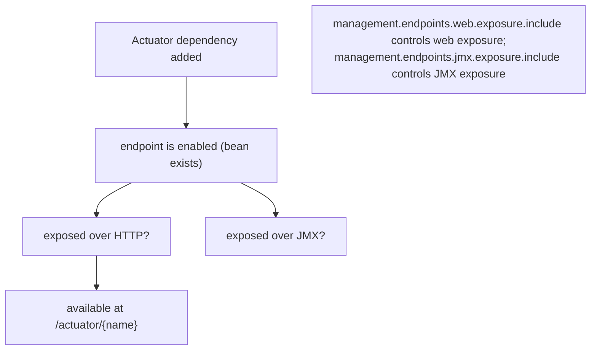
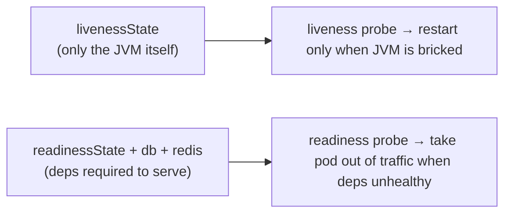
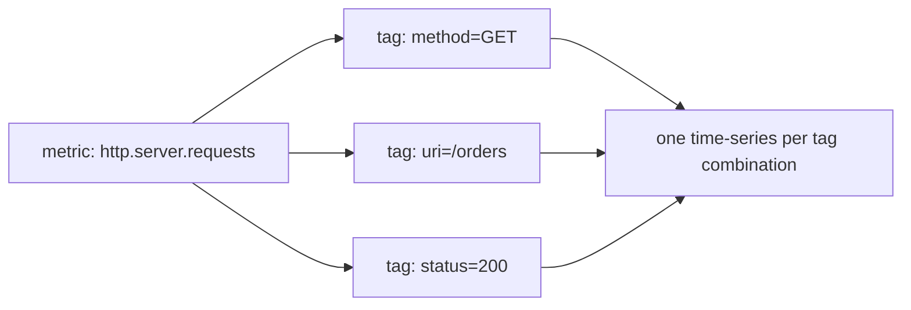
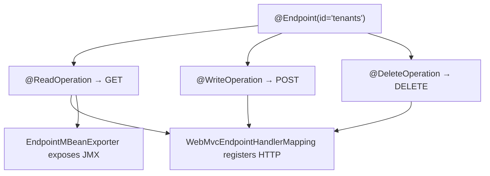
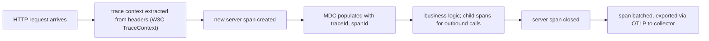

# Spring Boot Actuator

A running service is a black box until you cut a window in it. **Spring Boot Actuator** is the framework's ready-made set of windows — HTTP / JMX endpoints that expose health checks, metrics, environment, bean wiring, request mappings, log levels, thread dumps, heap dumps, scheduled tasks, sessions, and more. Adding `spring-boot-starter-actuator` is the difference between "I see what the service does" and "I see what the service is doing right now". Operationally, every production Spring Boot service runs Actuator; in Kubernetes it powers the liveness, readiness, and startup probes; in observability platforms it feeds Prometheus, Grafana, the ELK stack, OpenTelemetry collectors.

Actuator is also a pattern lesson — its design (an `@Endpoint` SPI with three operations, a sliding security model, two transport surfaces) is the right shape for any "introspection / control" feature you build yourself. Senior engineers do not just *use* Actuator endpoints; they *write* them for their team's custom signals (tenant counts, feature-flag exposure, queue depth, circuit-breaker state).

The depth-bar this topic clears: at the **language layer**, the endpoint catalog — every built-in `health`, `info`, `metrics`, `env`, `beans`, `mappings`, `conditions`, `configprops`, `threaddump`, `heapdump`, `loggers`, `shutdown`, `refresh`, `httptrace`, `auditevents`, `sessions`, `scheduledtasks`, `caches`, `flyway`, `liquibase` endpoint — with the data each returns, the security implications, and the operational use case. At the **memory layer**, what an endpoint *costs* (a few KB to a few MB depending on whether it walks the full bean graph), what continuous metric collection costs (typically 1–3% CPU for Micrometer + Prometheus), and the **heapdump** mechanics (a hot HPROF write can pause a JVM for seconds and double its RSS temporarily). At the **architecture layer** — the heart — **Kubernetes probe integration** (which endpoint goes to liveness, which to readiness, why getting it wrong causes thundering-herd pod restarts), **the Endpoint SPI** for custom endpoints, the **management port** pattern (run Actuator on a separate port behind a firewall), and **observability composition** with Micrometer + Prometheus + Grafana.

> [!NOTE]
> Prerequisites: T01–T08. Particularly the `@Conditional` / auto-config machinery from T07 (Actuator endpoints are individually auto-configured) and property resolution from T08 (every endpoint is toggled via `management.endpoint.*` keys).

## Enabling and Exposing Endpoints

Add the starter:

```xml
<dependency>
    <groupId>org.springframework.boot</groupId>
    <artifactId>spring-boot-starter-actuator</artifactId>
</dependency>
```

By default Boot exposes only two endpoints over HTTP: `/actuator/health` and `/actuator/info`. The rest are *enabled internally* (the beans exist) but *not exposed* externally. To expose them:

```yaml
management:
  endpoints:
    web:
      exposure:
        include: "*"          # or: "health,info,metrics,prometheus,env"
        exclude: "shutdown"   # excluded even from "*"
  endpoint:
    health:
      show-details: when-authorized   # never | when-authorized | always
```

**`include: "*"` in production is a mistake.** It exposes `/env` (resolved property values including secrets — Boot does mask common ones, but the masking is not comprehensive) and `/heapdump` (a multi-MB or multi-GB process snapshot). Limit to the operationally needed set.



### Separate Management Port

In production you usually run Actuator on a **different port** from the application — exposed only to the internal network / scrape targets:

```yaml
server.port: 8080
management:
  server:
    port: 9090
    address: 127.0.0.1       # bind to loopback only — internal scrape
    base-path: /             # actuator at /actuator/* on 9090
  endpoints:
    web:
      exposure:
        include: "health,info,metrics,prometheus"
```

With this, app traffic on `:8080`; ops/scrape traffic on `:9090`. A simple firewall rule keeps `:9090` private. The split also means a flood of metric scrapes does not steal threads from application traffic.

## The Endpoint Catalog

The built-in endpoints (Spring Boot 3.x). Default ID in the URL is the column name.

| Endpoint | Returns | Sensitive? | Use |
|----------|---------|:---------:|-----|
| `health` | aggregate health: UP / DOWN / OUT_OF_SERVICE | low (details masked) | liveness/readiness probes |
| `info` | application metadata (version, build, git SHA) | low | release tracking |
| `metrics` | metric names list; per-metric drill-down | medium | Micrometer in-process |
| `prometheus` | metrics in Prometheus exposition format | medium | Prometheus scrape target |
| `env` | every property source and its keys | **high** | debugging only |
| `configprops` | all `@ConfigurationProperties` beans + bound values | **high** | debugging only |
| `beans` | every bean, its dependencies, scope, type | medium | wiring debugging |
| `mappings` | every `@RequestMapping` with its handler | low | API debugging |
| `conditions` | conditional evaluation report | medium | auto-config debugging |
| `loggers` | every logger and its level; PATCH to change | medium | live log-level tuning |
| `threaddump` | every thread's stack + lock state | medium | hang debugging |
| `heapdump` | downloads an HPROF | **high + expensive** | memory leak |
| `shutdown` | gracefully stops the context (POST) | **destructive** | rolling restarts |
| `refresh` | reloads `Environment` & re-binds `@RefreshScope` (POST) | medium | hot config reload |
| `scheduledtasks` | every `@Scheduled` task | low | scheduling debug |
| `sessions` | active HTTP sessions (Spring Session) | medium | session debugging |
| `caches` | all `CacheManager`s and their caches | low | cache debugging |
| `flyway` / `liquibase` | applied migrations | low | migration audit |
| `httptrace` (Boot 2.x) | recent HTTP requests (in-memory) | medium | troubleshooting; removed in 3.0 in favor of Micrometer Tracing |
| `auditevents` | Spring Security audit log | medium | auth/audit |
| `quartz` | Quartz scheduler details (with `spring-boot-starter-quartz`) | low | scheduling debug |

## `health` — The Most Important Endpoint

`/actuator/health` aggregates `HealthIndicator` beans into a single overall status. Each indicator returns `UP`, `DOWN`, `OUT_OF_SERVICE`, or `UNKNOWN`. The worst status across indicators is the overall.

Built-in indicators registered when their conditions match:

| Indicator | Checks |
|-----------|--------|
| `DiskSpaceHealthIndicator` | filesystem has > threshold free (default 10 MB) |
| `DataSourceHealthIndicator` | executes a configurable validation query (or `isValid`) |
| `RedisHealthIndicator` | PING |
| `MongoHealthIndicator` | `db.runCommand({serverStatus: 1})` |
| `CassandraHealthIndicator` | cluster state |
| `RabbitHealthIndicator` | connection open |
| `KafkaHealthIndicator` | broker reachable |
| `ElasticsearchRestHealthIndicator` | cluster status |
| `MailHealthIndicator` | SMTP connect |
| `LdapHealthIndicator` | bind |
| `JmsHealthIndicator` | broker reachable |
| `LivenessStateHealthIndicator` | `ApplicationAvailability.LivenessState` |
| `ReadinessStateHealthIndicator` | `ApplicationAvailability.ReadinessState` |

Output, with `show-details: always`:

```json
{
  "status": "UP",
  "components": {
    "db": {
      "status": "UP",
      "details": { "database": "PostgreSQL", "validationQuery": "isValid()" }
    },
    "diskSpace": {
      "status": "UP",
      "details": { "total": 250790436864, "free": 17580957696, "threshold": 10485760 }
    },
    "redis": { "status": "UP", "details": { "version": "7.2.4" } },
    "ping": { "status": "UP" }
  }
}
```

### Health Groups — For Kubernetes Probes

The single overall status is too coarse for Kubernetes. **Liveness** asks "should the kubelet restart this pod?" (only return DOWN when the answer is genuinely yes — restarting on a transient DB hiccup causes a cascading-restart loop). **Readiness** asks "should traffic be routed here?" (return DOWN for any reason the pod cannot serve, including dependencies down).

Boot's solution: **health groups** — subsets of indicators with their own aggregation:

```yaml
management:
  endpoint:
    health:
      probes:
        enabled: true
      group:
        liveness:
          include: "livenessState"
        readiness:
          include: "readinessState,db,redis"
        custom-checkout:
          include: "db,paymentGateway"
          show-details: always
```

This produces:

- `/actuator/health` — everything
- `/actuator/health/liveness` — only liveness
- `/actuator/health/readiness` — only readiness
- `/actuator/health/custom-checkout` — custom group

Kubernetes probes:

```yaml
livenessProbe:
  httpGet: { path: /actuator/health/liveness, port: 9090 }
  initialDelaySeconds: 30
  periodSeconds: 30
  failureThreshold: 3
readinessProbe:
  httpGet: { path: /actuator/health/readiness, port: 9090 }
  initialDelaySeconds: 5
  periodSeconds: 5
  failureThreshold: 1
startupProbe:
  httpGet: { path: /actuator/health/liveness, port: 9090 }
  initialDelaySeconds: 10
  periodSeconds: 5
  failureThreshold: 60   # allow 5 min of startup
```



### `ApplicationAvailability` API

Spring Boot 2.3+ ships an `ApplicationAvailability` bean that holds the **current** liveness and readiness state. You change it programmatically:

```java
@Component
public class StartupOps {
    public StartupOps(ApplicationEventPublisher publisher) {
        publisher.publishEvent(AvailabilityChangeEvent.publish(this, ReadinessState.REFUSING_TRAFFIC));
    }

    public void warmupComplete() {
        publisher.publishEvent(AvailabilityChangeEvent.publish(this, ReadinessState.ACCEPTING_TRAFFIC));
    }
}
```

This decouples *liveness/readiness* from *individual dependency health*. You can be "live but not ready" during warmup — the pod is in the K8s cluster but receives no traffic until your code says it can serve. On clean shutdown, set `ReadinessState.REFUSING_TRAFFIC` *before* you start tearing down, and the pod is removed from load-balancer rotation while in-flight requests drain. Boot integrates with `SmartLifecycle` to do this automatically on SIGTERM.

### Custom `HealthIndicator`

```java
@Component
public class PaymentGatewayHealthIndicator implements HealthIndicator {
    private final PaymentGateway gateway;
    public PaymentGatewayHealthIndicator(PaymentGateway gateway) { this.gateway = gateway; }

    @Override public Health health() {
        try {
            GatewayPing ping = gateway.ping();
            return ping.healthy()
                ? Health.up().withDetail("latencyMs", ping.latencyMs()).build()
                : Health.down().withDetail("reason", ping.message()).build();
        } catch (Exception e) {
            return Health.down(e).build();
        }
    }
}
```

The indicator becomes a component named `paymentGateway` (the prefix of the class name with "HealthIndicator" stripped). Reachable as `/actuator/health/paymentGateway`.

> [!WARNING]
> Health indicators are called **on every probe poll**. With Kubernetes' default 5-second `periodSeconds`, that is 12 calls/min × every dependency. Make indicators **cheap and cached** — a 200 ms gateway ping multiplied by 5 dependencies and 60 pods is meaningful load.

## `info` — Application Metadata

`/actuator/info` returns a JSON blob of release / build / git information:

```json
{
  "app": { "name": "orders-service", "version": "1.42.3" },
  "build": { "artifact": "orders-service", "time": "2026-06-08T12:00:00Z" },
  "git": { "branch": "main", "commit": { "id": "a2942b5", "time": "..." } }
}
```

Three built-in `InfoContributor`s (toggled via `management.info.*.enabled`):

- **`build-info.properties`** — generated by `spring-boot-maven-plugin` / `gradle-spring-boot-plugin` at build time.
- **`git.properties`** — generated by `git-commit-id-maven-plugin` / `git-commit-id-gradle-plugin`.
- **OS / Java environment**.

Write a custom `InfoContributor` for your own values:

```java
@Component
public class FeatureFlagsInfo implements InfoContributor {
    private final FeatureFlagService flags;
    public FeatureFlagsInfo(FeatureFlagService flags) { this.flags = flags; }

    @Override public void contribute(Info.Builder builder) {
        builder.withDetail("flags", flags.snapshot());
    }
}
```

## Metrics — Micrometer Integration

Boot uses **Micrometer** as the metric facade. Micrometer is a "SLF4J for metrics" — one `MeterRegistry` interface, many implementations (Prometheus, Datadog, New Relic, CloudWatch, Wavefront, …).

### Four Meter Types

| Type | Use |
|------|-----|
| **Counter** | monotonically-increasing — requests, errors, items processed |
| **Gauge** | instantaneous value — queue depth, current threads, free heap |
| **Timer** | measured duration + count — request latency, db query time |
| **DistributionSummary** | distribution of a value — payload size, batch size |

```java
@Service
public class OrderService {
    private final Counter ordersPlaced;
    private final Timer placeTimer;
    private final DistributionSummary cartSize;
    private final AtomicInteger pending;

    public OrderService(MeterRegistry registry) {
        this.ordersPlaced = registry.counter("orders.placed", "tenant", "default");
        this.placeTimer = registry.timer("orders.place.duration");
        this.cartSize = registry.summary("orders.cart.size");
        this.pending = registry.gauge("orders.pending", new AtomicInteger());
    }

    public Order place(OrderRequest req) {
        return placeTimer.recordCallable(() -> {
            pending.incrementAndGet();
            try {
                cartSize.record(req.items().size());
                Order o = persist(req);
                ordersPlaced.increment();
                return o;
            } finally {
                pending.decrementAndGet();
            }
        });
    }
}
```

### Built-in Metrics

Boot pre-instruments a long list out of the box:

- **JVM**: heap/non-heap memory, GC pause time, thread count, class loading, buffer pools.
- **System**: CPU usage (process + system), file descriptors.
- **Tomcat / Jetty**: request count, sessions, thread pool, error rate.
- **Hikari**: pool size, active, idle, wait time.
- **HTTP**: every endpoint timed by URI template (`http.server.requests`).
- **Logback**: log events per level.
- **Cache**: get hits/misses, size.

### Tags

Tags are key-value pairs that partition a metric. `http.server.requests` by default has tags `method`, `uri`, `status`, `exception`, `outcome` — so a single metric name yields a thousand time-series in Prometheus, one per `(method, uri, status, …)` combination.



**Tag cardinality is the #1 metric cost.** Add `userId` as a tag and you get one time-series per user — a 100,000-user system produces 100,000 time-series for that one metric. Prometheus storage cost is linear in time-series count; high-cardinality tags blow up the storage. **Never tag by anything user-controlled or high-cardinality** (user id, order id, raw URL with path-id, raw query string). Use coarse buckets or histograms instead.

### Prometheus Endpoint

Adding `micrometer-registry-prometheus` exposes `/actuator/prometheus` (the Prometheus scrape format):

```
# HELP orders_placed_total Number of orders placed
# TYPE orders_placed_total counter
orders_placed_total{tenant="default"} 12345.0
# HELP orders_place_duration_seconds
# TYPE orders_place_duration_seconds summary
orders_place_duration_seconds_count 12345.0
orders_place_duration_seconds_sum 1234.567
orders_place_duration_seconds{quantile="0.5"} 0.045
orders_place_duration_seconds{quantile="0.95"} 0.230
```

Prometheus scrapes this every 15–30 s, builds time-series, and your dashboards / alerts read from there.

## `loggers` — Live Log-Level Tuning

`/actuator/loggers` returns every logger's current effective and configured level. **`POST /actuator/loggers/{name}`** with `{"configuredLevel":"DEBUG"}` changes the level **at runtime** without restart. The single best operational technique for "production is weird but I can't restart" — bump one specific package to DEBUG, capture a few hundred log lines, reset.

```bash
# turn on DEBUG for the order package
curl -X POST http://localhost:9090/actuator/loggers/com.example.order \
     -H "Content-Type: application/json" \
     -d '{"configuredLevel":"DEBUG"}'

# turn it back off
curl -X POST http://localhost:9090/actuator/loggers/com.example.order \
     -d '{"configuredLevel":null}'
```

This works because Boot's `LoggersEndpoint` delegates to the active `LoggingSystem` (Logback by default), which fortunately supports level changes at runtime.

## `heapdump` and `threaddump`

**`/actuator/heapdump`** writes a HPROF file of the JVM heap and downloads it. A 4 GB heap produces a ~4 GB file. The dump is taken via `HotSpotDiagnosticMXBean.dumpHeap` which **pauses the JVM** for the duration (~5–30 seconds for typical heaps). Use only when you know what you are doing — heapdump can OOM the pod (writing a 4 GB file while the heap is full).

**`/actuator/threaddump`** is cheap (a snapshot of every thread's stack). Returns JSON with thread states, lock holders, and stack traces. The right first tool when "the service is hung" — find a thread stuck on a wait/IO and trace its origin.

## `env` and `configprops` — Use With Care

Both expose configuration values. `env` shows raw property-source contents; `configprops` shows the bound `@ConfigurationProperties` view.

Boot redacts values for keys matching a default pattern (`password`, `secret`, `key`, `token`, `credentials`, `vcap_services`):

```json
{
  "spring.datasource.password": { "value": "******" }
}
```

The redaction is **not** comprehensive. `myapi.private-key` is *not* in the default redaction list. Tune:

```yaml
management:
  endpoint:
    env:
      keys-to-sanitize: "password,secret,key,token,credentials,private-key,api-key,jwt-secret"
    configprops:
      keys-to-sanitize: "${management.endpoint.env.keys-to-sanitize}"
  endpoints:
    web:
      exposure:
        include: "health,info"     # do NOT include env or configprops
```

The safer pattern is: **never expose `env` / `configprops` over HTTP in production.** Use JMX or a debug shell when you need them.

## The Endpoint SPI — Custom Endpoints

Write your own with `@Endpoint`:

```java
@Component
@Endpoint(id = "tenants")
public class TenantsEndpoint {

    private final TenantService tenants;
    public TenantsEndpoint(TenantService tenants) { this.tenants = tenants; }

    @ReadOperation
    public Map<String, Object> tenants() {
        return Map.of(
            "count", tenants.count(),
            "active", tenants.activeIds()
        );
    }

    @ReadOperation
    public TenantInfo tenant(@Selector String id) {
        return tenants.find(id);
    }

    @WriteOperation
    public void enable(@Selector String id) {
        tenants.enable(id);
    }

    @DeleteOperation
    public void disable(@Selector String id) {
        tenants.disable(id);
    }
}
```

Reachable as:

```
GET    /actuator/tenants         → tenants() — overview
GET    /actuator/tenants/{id}    → tenant(id) — drill-down
POST   /actuator/tenants/{id}    → enable(id)
DELETE /actuator/tenants/{id}    → disable(id)
```

The annotations:

- `@Endpoint(id = "tenants")` — registers it; the id is the URL path segment.
- `@ReadOperation` — GET (in HTTP).
- `@WriteOperation` — POST.
- `@DeleteOperation` — DELETE.
- `@Selector` — a path-segment parameter.

The same endpoint is also exposed over JMX (one MBean per operation). To restrict to HTTP only: `@WebEndpoint`. To restrict to JMX only: `@JmxEndpoint`.



Custom endpoint usage examples real teams build:

- **`/actuator/circuit-breakers`** — current state and stats of every Resilience4j circuit breaker.
- **`/actuator/feature-flags`** — current state of every feature flag.
- **`/actuator/cache-stats`** — Caffeine cache statistics summary.
- **`/actuator/replay`** — POST to replay a failed event from the dead-letter queue.
- **`/actuator/recompute`** — POST to trigger a one-off heavy recomputation (use with care; idempotency).

## Security — Protecting Endpoints

`spring-boot-starter-security` plus a configuration:

```java
@Configuration
@EnableWebSecurity
public class ActuatorSecurity {

    @Bean
    public SecurityFilterChain securityFilterChain(HttpSecurity http) throws Exception {
        http.securityMatcher(EndpointRequest.toAnyEndpoint())
            .authorizeHttpRequests(auth -> auth
                .requestMatchers(EndpointRequest.to("health", "info")).permitAll()
                .anyRequest().hasRole("ADMIN")
            )
            .httpBasic(Customizer.withDefaults());
        return http.build();
    }
}
```

The `EndpointRequest` matcher lets you target Actuator endpoints by id. The pattern above: `/health` and `/info` public; everything else under the management port requires `ADMIN`.

In practice the safer pattern is **network isolation** — put Actuator on a port only reachable from inside the cluster, and skip the per-endpoint auth. Defense in depth: do both.

## Tracing With Micrometer + OpenTelemetry

Boot 3 ships **Micrometer Tracing** — vendor-neutral tracing built on Brave (Zipkin) or OpenTelemetry under the hood. With `micrometer-tracing-bridge-otel` and an OTLP exporter, every `Timer` automatically produces tracing spans, every HTTP request gets a trace context, MDC log fields carry the trace id, and downstream HTTP/messaging calls propagate the trace.



The Actuator side of this is `/actuator/metrics` keeps working, and the observability stack (Tempo / Jaeger for spans, Prometheus for metrics, Loki for logs all keyed by trace id) shows one request as a unified picture.

## Common Pitfalls

> [!WARNING]
> **`management.endpoints.web.exposure.include: "*"` in production.** Exposes `env`, `heapdump`, etc. Limit to a known-safe set or use the management port + firewall.

> [!WARNING]
> **Liveness probes that go DOWN on DB outage.** Causes a thundering-herd pod restart. Liveness should reflect "the JVM is healthy enough to keep running"; *readiness* should reflect "deps are healthy enough to serve traffic". Use health groups.

> [!WARNING]
> **High-cardinality metric tags.** Per-user, per-order, raw URL paths blow up Prometheus storage. Use templated URIs (Boot does this by default) and avoid user-controlled tag values.

> [!WARNING]
> **Heapdump in low-disk pods.** A 4 GB heap → 4 GB file. If your pod's ephemeral storage is 5 GB, the dump fills it and crashes other writes. Stream the dump elsewhere (S3) instead of writing to the pod.

> [!WARNING]
> **Slow `HealthIndicator`s called every 5 s.** Cache the result, or use `HealthEndpointWebExtension`'s caching. Boot 3 added `management.endpoint.health.cache.time-to-live` to globally cache results.

> [!WARNING]
> **`/actuator/shutdown` enabled in prod.** A misconfigured authorizer means any POSTer can kill your service. Disable unless you have a very specific operational pattern that needs it.

## Practice

1. Add Actuator + Micrometer Prometheus to a Boot app. Hit `/actuator/prometheus`. Wire it to a local Prometheus + Grafana via Docker Compose. Build a dashboard for `http.server.requests` rate, p50/p95/p99 latency.
2. Write a `HealthIndicator` that checks an external payment gateway. Add a 500 ms timeout (do not block the probe). Include it in a custom health group. Verify it correctly contributes to the group only.
3. Configure Kubernetes liveness on `/actuator/health/liveness` and readiness on `/actuator/health/readiness`. Simulate a DB outage and confirm: pod stays alive, traffic is removed from rotation, traffic resumes when DB recovers.
4. Build a `@Counter` and `@Timer` around a hot service method. Confirm tags are reasonable (no user-id). Stress-test and view the data in Grafana.
5. POST to `/actuator/loggers/com.example` to change a level to DEBUG live. Verify with `GET`. Reset.
6. Write a `@Endpoint`-annotated tenants endpoint with `@ReadOperation`, `@WriteOperation`, `@DeleteOperation`. Curl each.
7. Secure Actuator with `spring-boot-starter-security`. Make `/health` and `/info` public; everything else `ADMIN`. Test with curl.
8. Read `/actuator/conditions` for your app. Pick one negative match and figure out *why* it didn't match. Then add the missing class/property and re-run; confirm it flips to positive.

## Recap

You should now be able to:

- Add and expose Actuator endpoints safely — using `management.endpoints.web.exposure.include` deliberately, a separate management port, and per-endpoint security.
- Configure Kubernetes liveness, readiness, and startup probes using health groups, and explain why liveness ≠ readiness and what each probe should cover.
- Write custom `HealthIndicator` and `InfoContributor` beans, and ensure they are cheap and cached.
- Use Micrometer's four meter types (Counter, Gauge, Timer, DistributionSummary), tag them sensibly, and wire to Prometheus / Datadog / etc.
- Read built-in metrics (`http.server.requests`, `jvm.gc.pause`, `hikaricp.*`, `tomcat.*`) and reason about latency, throughput, and saturation from them.
- Write custom endpoints with `@Endpoint`, `@ReadOperation`, `@WriteOperation`, `@DeleteOperation`, `@Selector`, scope them with `@WebEndpoint` / `@JmxEndpoint`, and secure them.
- Use operational endpoints in incidents: `/actuator/threaddump` for hangs, `/actuator/loggers` for live log tuning, `/actuator/heapdump` for memory issues (with caution), `/actuator/conditions` for auto-config debugging, `/actuator/beans` for wiring confusion.
- Integrate Actuator with Micrometer Tracing + OpenTelemetry for a unified metric / log / span picture in production.
- Avoid the common pitfalls: wildcard exposure, hot health indicators, high-cardinality tags, on-pod heapdumps, exposed shutdown endpoint.

## Next

Continue to [Spring MVC (REST Controllers)](./T10-spring-mvc-rest-controllers.md) for the deep treatment of Spring MVC — the `DispatcherServlet` lifecycle, request mapping, content negotiation, message converters, exception handling, async dispatch, and how `@RestController` reuses every concept from T01–T09.
