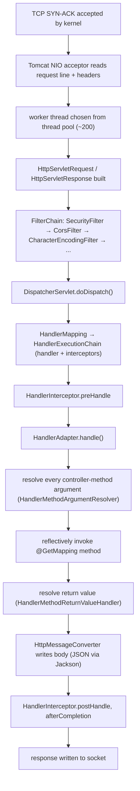
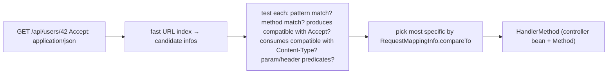
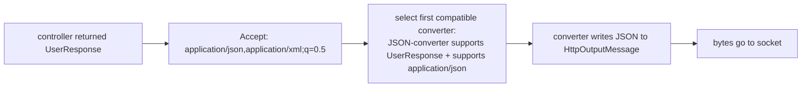
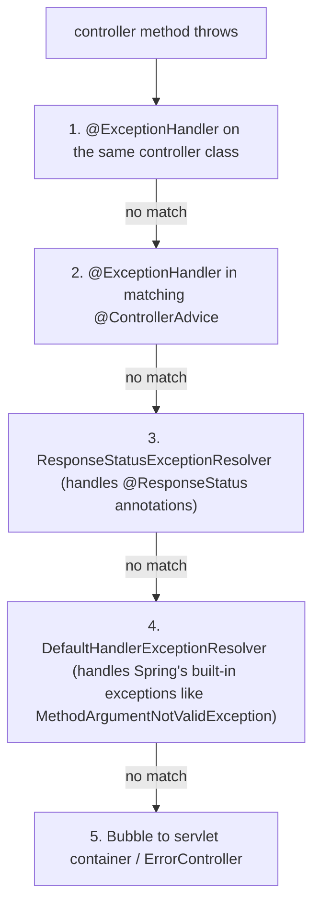
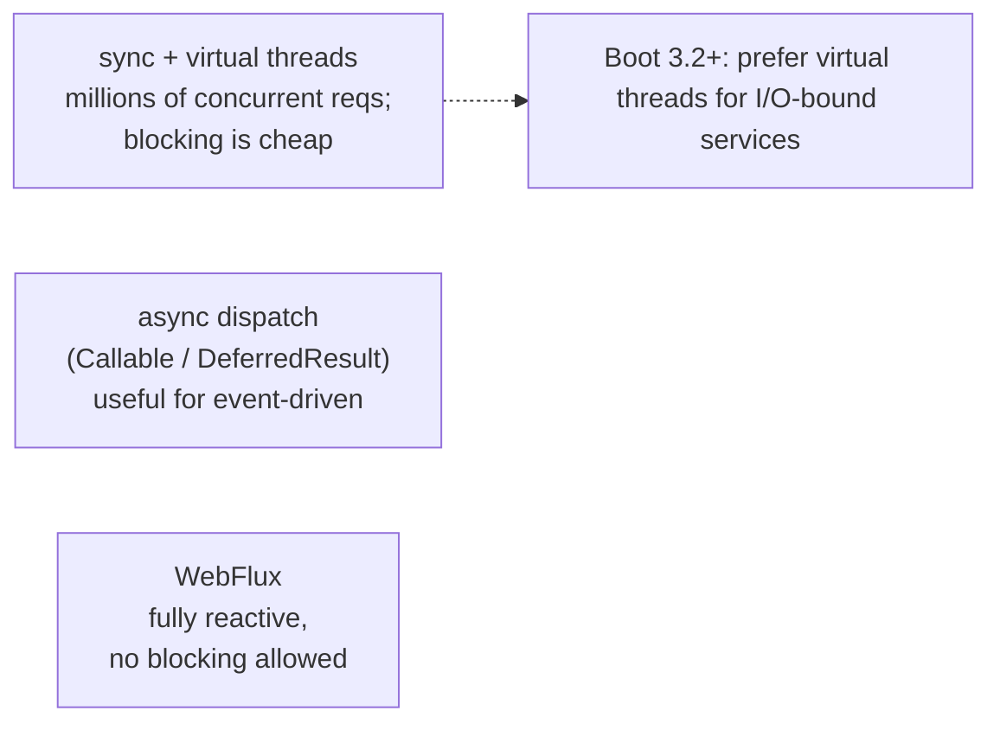

# Spring MVC (REST Controllers)

The HTTP request that lands on your `@GetMapping("/users/{id}")` method has traveled through **at least a dozen layers** before that method runs. The kernel accepted a TCP connection; the embedded server (Tomcat by default) parsed the HTTP grammar and assigned a worker thread; Spring Boot's `DispatcherServlet` received the parsed `HttpServletRequest`; a chain of `Filter`s (security, encoding, CORS) ran; a `HandlerMapping` looked up the right controller method; a `HandlerAdapter` resolved every argument (path variable, query param, request body, current user); the body was deserialized via Jackson; method arguments were validated; the controller method finally executed; its return value was serialized to JSON; HTTP status, headers, and body were written to the response; the chain unwound; the thread was returned to the pool.

Spring MVC is the engine that makes that pipeline *configurable, extensible, and uniform across every controller in the application*. `@RestController + @GetMapping` is the surface; the depth is in knowing how the pipeline is wired so you can debug a routing miss, customize JSON serialization, write a `@ControllerAdvice` for cross-cutting error handling, switch to async dispatch to free request threads during long calls, or change every method's response envelope without touching the methods.

The depth-bar this topic clears: at the **language layer**, `@RestController`, the `@*Mapping` family, parameter annotations (`@PathVariable`, `@RequestParam`, `@RequestHeader`, `@RequestBody`, `@RequestPart`, `@CookieValue`, `@ModelAttribute`), return-type strategies (`ResponseEntity`, plain DTOs with `@ResponseBody`, `Callable<T>`, `DeferredResult<T>`, `WebAsyncTask<T>`, `StreamingResponseBody`, `SseEmitter`, `ResponseBodyEmitter`), content negotiation (`produces` / `consumes` / `Accept`), and `@ControllerAdvice` / `@ExceptionHandler` for cross-cutting concerns. At the **memory layer**, the **request thread model** — Tomcat's default ~200 NIO worker threads each with an ~1 MB stack (~200 MB just on stack memory), how virtual threads change this (Boot 3.2+), the per-request heap allocation profile (~10–100 KB for a typical JSON request/response cycle), and the cost of message-converter dispatch (~100 µs Jackson dispatch + ~1 µs/field serialization). At the **architecture layer** — the heart — **the `DispatcherServlet` lifecycle from request arrival to response sent**, the request-handling chain (`Filter`s → `DispatcherServlet` → `HandlerInterceptor`s → method invocation → `HandlerExceptionResolver`), the async-dispatch lifecycle (`Callable` / `DeferredResult` and how they free worker threads), and how the same MVC code can target Tomcat, Jetty, Undertow, or virtual-threaded Tomcat without rewriting.

> [!NOTE]
> Prerequisites: T01–T09. HTTP fundamentals (`L2/C04/T01` — HTTP methods, status, headers). Servlet API basics (`HttpServletRequest`, `HttpServletResponse`, filter chain). The IoC container and bean lifecycle from T01–T03 — every MVC participant is just a Spring bean.

## The Pipeline From Socket to Method

A request from the kernel to your `@RestController` method:



Every arrow is a Spring bean (or a Servlet API call) — every step is configurable, testable, and replaceable.

## `@RestController` — The Concise Form

`@RestController` = `@Controller` + `@ResponseBody`. The first registers the class with `RequestMappingHandlerMapping`; the second tells every method's return value to go through `HttpMessageConverter`s (instead of through view resolution). For JSON / XML APIs, it is the right default.

```java
@RestController
@RequestMapping("/api/users")
public class UserController {

    private final UserService users;
    public UserController(UserService users) { this.users = users; }

    @GetMapping("/{id}")
    public UserResponse get(@PathVariable long id) {
        return UserResponse.of(users.load(id));
    }

    @PostMapping
    public ResponseEntity<UserResponse> create(@Valid @RequestBody CreateUserRequest req) {
        User u = users.create(req.toCommand());
        return ResponseEntity
                .created(URI.create("/api/users/" + u.id()))
                .body(UserResponse.of(u));
    }

    @PutMapping("/{id}")
    public UserResponse replace(@PathVariable long id, @Valid @RequestBody UpdateUserRequest req) {
        return UserResponse.of(users.replace(id, req.toCommand()));
    }

    @DeleteMapping("/{id}")
    @ResponseStatus(HttpStatus.NO_CONTENT)
    public void delete(@PathVariable long id) { users.delete(id); }
}
```

The annotations:

- `@RequestMapping("/api/users")` at class level — every method's path is prefixed.
- `@GetMapping`, `@PostMapping`, `@PutMapping`, `@DeleteMapping`, `@PatchMapping` — shortcuts for `@RequestMapping(method=...)`.
- `@PathVariable` — extracts a URI template variable.
- `@RequestBody` — deserializes the request body via a `HttpMessageConverter`.
- `@Valid` — runs JSR-380 validation on the deserialized body (T11).
- `ResponseEntity` — full control over status, headers, body.
- `@ResponseStatus(NO_CONTENT)` — sets the response status without `ResponseEntity` ceremony.

## The `DispatcherServlet` In Detail

`DispatcherServlet` is the front-controller Servlet that *every* Spring MVC request goes through. It is itself a Spring bean (created by `WebMvcAutoConfiguration` / `DispatcherServletAutoConfiguration` at startup) and exposes the standard `Servlet.service(...)` method that Tomcat calls.

`doDispatch` is the heart:

```java
// DispatcherServlet.doDispatch (sketched)
protected void doDispatch(HttpServletRequest req, HttpServletResponse resp) throws Exception {
    HandlerExecutionChain chain = getHandler(req);             // 1. handler mapping
    if (chain == null) { noHandlerFound(req, resp); return; }
    HandlerAdapter adapter = getHandlerAdapter(chain.getHandler()); // 2. adapter

    if (!chain.applyPreHandle(req, resp)) return;              // 3. interceptors before

    ModelAndView mv;
    try {
        mv = adapter.handle(req, resp, chain.getHandler());    // 4. method invocation
    } catch (Throwable t) {
        mv = processHandlerException(req, resp, chain.getHandler(), t); // 5. ex resolver
    }

    chain.applyPostHandle(req, resp, mv);                       // 6. interceptors after
    processDispatchResult(req, resp, chain.getHandler(), mv, dispatchException); // 7. render
    chain.triggerAfterCompletion(req, resp, null);              // 8. finally
}
```

Eight steps:

1. **`HandlerMapping.getHandler(req)`** returns a `HandlerExecutionChain` (the matched handler plus an ordered list of `HandlerInterceptor`s). The default mapping is `RequestMappingHandlerMapping`, which scanned every `@Controller` at startup and built an internal map of (URL pattern + HTTP method → handler method).
2. **`HandlerAdapter.handle(...)`** — for `@RequestMapping` controllers this is `RequestMappingHandlerAdapter`. It calls `HandlerMethodArgumentResolver`s to resolve each parameter, reflectively invokes the method, and calls `HandlerMethodReturnValueHandler` for the return value.
3. **`preHandle`** — interceptors get a chance to short-circuit (return false → skip the rest).
4. **Method invocation** — the actual `@GetMapping` method runs.
5. **`HandlerExceptionResolver`** — if the method threw, resolvers try to translate the exception to a response (built-in ones handle `ResponseStatusException`, `@ExceptionHandler`-annotated methods, etc.).
6. **`postHandle`** — interceptors see the result.
7. **`processDispatchResult`** — render the view, or for REST, run `HttpMessageConverter` to write the response body.
8. **`afterCompletion`** — interceptors finalize (regardless of success/failure).

## Handler Mapping — How a URL Becomes a Method

At startup, `RequestMappingHandlerMapping` walks every bean with `@Controller`/`@RestController`. For each `@RequestMapping`-annotated method, it builds a `RequestMappingInfo` (URL patterns, HTTP methods, `produces`, `consumes`, `params`, `headers`, custom predicates) and registers it.

Internally it maintains a `MappingRegistry`:

```
Map<RequestMappingInfo, HandlerMethod>
Map<String, List<RequestMappingInfo>>   // URL → infos (for fast prefix lookup)
```

For an incoming request, the mapping iterates infos that *could* match (the URL prefix narrows the search), tests each predicate, and picks the *most specific* match. The specificity algorithm is documented in `RequestMappingInfo.compareTo` — exact paths beat patterns, more specific patterns beat less specific, methods that match the request's `Content-Type` and `Accept` better win.



`PathMatcher` (default `AntPathMatcher`) handles `*`, `**`, `?` wildcards. Spring 5.3+ ships a faster `PathPatternParser` (`spring.mvc.pathmatch.matching-strategy=path-pattern-parser`) that pre-compiles patterns to a state machine — used by WebFlux by default and increasingly by MVC.

## Method Argument Resolution

`HandlerMethodArgumentResolver`s know how to populate each parameter of your method from the request. Built-in resolvers handle every standard annotation:

| Annotation / Type | Resolver | Source |
|-------------------|---------|--------|
| `@PathVariable` | `PathVariableMethodArgumentResolver` | URI template |
| `@RequestParam` | `RequestParamMethodArgumentResolver` | query string + form-encoded body |
| `@RequestHeader` | `RequestHeaderMethodArgumentResolver` | header |
| `@RequestBody` | `RequestResponseBodyMethodProcessor` | body via `HttpMessageConverter` |
| `@RequestPart` | `RequestPartMethodArgumentResolver` | multipart part |
| `@CookieValue` | `ServletCookieValueMethodArgumentResolver` | cookie |
| `@ModelAttribute` | `ModelAttributeMethodProcessor` | flat bind from request params |
| `@SessionAttribute` | `SessionAttributeMethodArgumentResolver` | session |
| `@MatrixVariable` | `MatrixVariableMethodArgumentResolver` | URI matrix variables (rare) |
| `HttpServletRequest`, `HttpServletResponse` | `ServletRequestMethodArgumentResolver` | raw |
| `Principal`, `Authentication` | `PrincipalMethodArgumentResolver` | security context |
| `Locale`, `TimeZone` | `LocaleMethodArgumentResolver` | locale |
| `Pageable` (Spring Data) | `PageableHandlerMethodArgumentResolver` | query params `page`, `size`, `sort` |
| `@CurrentUser` (custom) | user-supplied resolver | wherever |

Each parameter is resolved by the first resolver that *supports* it. Resolution returns the value, type-converted via `ConversionService` (T08). For `@RequestBody`, a `HttpMessageConverter` is selected (next section) and the body is deserialized.

### Custom Argument Resolver

```java
@Target(ElementType.PARAMETER)
@Retention(RetentionPolicy.RUNTIME)
public @interface CurrentUser { }

@Component
public class CurrentUserResolver implements HandlerMethodArgumentResolver {
    @Override public boolean supportsParameter(MethodParameter param) {
        return param.hasParameterAnnotation(CurrentUser.class);
    }
    @Override public Object resolveArgument(MethodParameter param, ModelAndViewContainer mav,
            NativeWebRequest webReq, WebDataBinderFactory binderFactory) {
        Authentication auth = SecurityContextHolder.getContext().getAuthentication();
        return userService.find(auth.getName());
    }
}

@Configuration
public class WebConfig implements WebMvcConfigurer {
    private final CurrentUserResolver resolver;
    public WebConfig(CurrentUserResolver resolver) { this.resolver = resolver; }
    @Override public void addArgumentResolvers(List<HandlerMethodArgumentResolver> resolvers) {
        resolvers.add(resolver);
    }
}

@GetMapping("/me")
public UserResponse me(@CurrentUser User u) { return UserResponse.of(u); }
```

Now `@CurrentUser User u` cleanly hides the security-context plumbing.

## `HttpMessageConverter` — Body Serialization

A `HttpMessageConverter<T>` knows how to read and write a Java type from/to an HTTP message body. Built-ins (auto-registered):

| Converter | Reads/Writes |
|-----------|--------------|
| `MappingJackson2HttpMessageConverter` | JSON (Jackson) |
| `MappingJackson2XmlHttpMessageConverter` | XML (Jackson XML) |
| `ProtobufHttpMessageConverter` | Protocol Buffers |
| `FormHttpMessageConverter` | `application/x-www-form-urlencoded` |
| `ByteArrayHttpMessageConverter` | raw bytes |
| `StringHttpMessageConverter` | strings |
| `ResourceHttpMessageConverter` | static resources |

For a request `Accept: application/json`, the resolver picks `MappingJackson2HttpMessageConverter`; for `Accept: application/xml`, the XML converter. **Content negotiation** is the algorithm by which the right converter is picked.



The `produces` attribute on `@RequestMapping` filters which converters are eligible for that method. The reverse — `consumes` — does the same for the request body.

### Customizing Jackson

The auto-configured `ObjectMapper` reflects `spring.jackson.*` properties:

```yaml
spring:
  jackson:
    serialization:
      write-dates-as-timestamps: false
      indent-output: false
    deserialization:
      fail-on-unknown-properties: true
    property-naming-strategy: SNAKE_CASE
    time-zone: UTC
```

For deeper control, declare your own `Jackson2ObjectMapperBuilderCustomizer`:

```java
@Bean
public Jackson2ObjectMapperBuilderCustomizer jacksonCustomizer() {
    return builder -> builder
        .modules(new JavaTimeModule(), new Jdk8Module())
        .featuresToDisable(SerializationFeature.WRITE_DATES_AS_TIMESTAMPS)
        .serializers(new MoneySerializer());
}
```

This composes with Boot's defaults instead of replacing the entire `ObjectMapper`.

## Exception Handling — `@ControllerAdvice` and `@ExceptionHandler`

Exceptions thrown from `@RequestMapping` methods are caught by `DispatcherServlet` and routed to `HandlerExceptionResolver`s. The most useful one is `ExceptionHandlerExceptionResolver`, which looks up `@ExceptionHandler` methods.

You declare them in two places:

**On the controller itself** — handles only this controller's exceptions:

```java
@RestController
public class UserController {

    @ExceptionHandler(UserNotFoundException.class)
    public ResponseEntity<ErrorResponse> notFound(UserNotFoundException e) {
        return ResponseEntity.status(NOT_FOUND)
            .body(new ErrorResponse("USER_NOT_FOUND", e.getMessage()));
    }
}
```

**Globally via `@RestControllerAdvice`** — handles exceptions from every controller in scope:

```java
@RestControllerAdvice
public class GlobalExceptionAdvice {

    @ExceptionHandler(MethodArgumentNotValidException.class)
    public ResponseEntity<ValidationError> onValidation(MethodArgumentNotValidException e) {
        return ResponseEntity.status(BAD_REQUEST).body(
            ValidationError.of(e.getBindingResult().getFieldErrors()));
    }

    @ExceptionHandler(DataIntegrityViolationException.class)
    public ResponseEntity<ErrorResponse> onConflict(DataIntegrityViolationException e) {
        return ResponseEntity.status(CONFLICT).body(
            new ErrorResponse("CONFLICT", "Constraint violation"));
    }

    @ExceptionHandler(Exception.class)
    public ResponseEntity<ErrorResponse> onUnknown(Exception e, HttpServletRequest req) {
        log.error("unhandled at {}", req.getRequestURI(), e);
        return ResponseEntity.status(INTERNAL_SERVER_ERROR).body(
            new ErrorResponse("INTERNAL", "An unexpected error occurred"));
    }
}
```

`@RestControllerAdvice` = `@ControllerAdvice` + `@ResponseBody`. Limit scope with `basePackages`, `annotations`, or `assignableTypes`.

### RFC 7807 `ProblemDetail`

Spring 6 / Boot 3 ship `ProblemDetail` — the standard RFC 7807 error representation:

```java
@ExceptionHandler(UserNotFoundException.class)
public ProblemDetail handle(UserNotFoundException e) {
    ProblemDetail pd = ProblemDetail.forStatusAndDetail(NOT_FOUND, e.getMessage());
    pd.setType(URI.create("https://example.com/probs/user-not-found"));
    pd.setProperty("userId", e.userId());
    return pd;
}
```

Response:

```json
{
  "type": "https://example.com/probs/user-not-found",
  "title": "Not Found",
  "status": 404,
  "detail": "User 42 not found",
  "instance": "/api/users/42",
  "userId": 42
}
```

Standard, machine-readable, language-neutral. Adopt by default.

### Order of Resolution



The first resolver that matches wins. Inside `@ExceptionHandler`, the most specific exception type wins.

## Filters vs Interceptors vs `@ControllerAdvice`

Three interception points, in execution order:

```mermaid
flowchart LR
  R["request"]
  F["Filter chain<br/>(Servlet API)"]
  Ds["DispatcherServlet"]
  Hi["HandlerInterceptor.preHandle"]
  M["@RequestMapping method"]
  Hp["HandlerInterceptor.postHandle"]
  Ad["@RestControllerAdvice / @ExceptionHandler"]
  Hf["HandlerInterceptor.afterCompletion"]
  Fp["Filter post-processing"]
  Resp["response"]
  R --> F --> Ds --> Hi --> M --> Hp --> Ad --> Hf --> Fp --> Resp
```



| Point | What it sees | What it can do | Use |
|-------|--------------|----------------|-----|
| **Filter** | raw request/response, before DispatcherServlet | mutate request/response, short-circuit, rewrite URLs, set encoding, CORS | Spring Security, encoding, CORS |
| **Interceptor** | DispatcherServlet-resolved handler, has access to `HandlerMethod` | log, set MDC, time, check permission on the handler | request logging, MDC population |
| **`@ControllerAdvice` / `@ExceptionHandler`** | exceptions from controller methods | convert to error response | global error handling |

Filters work at the Servlet API layer; interceptors at the MVC layer. Spring Security is a `Filter` precisely because it must intercept *before* MVC routing — to deny unauthenticated requests before they hit a controller.

## Async Dispatch — Freeing The Worker Thread

A traditional Spring MVC request holds a Tomcat worker thread from receive to response. For a 5-second downstream call, the thread is blocked the whole time — and Tomcat's pool of (default) 200 threads serializes everything past that.

Three async-dispatch mechanisms let the worker thread return to the pool while you wait:

### `Callable<T>`

```java
@GetMapping("/slow")
public Callable<UserResponse> slow() {
    return () -> {
        Thread.sleep(5000);          // run on a Spring-managed executor
        return UserResponse.of(...);
    };
}
```

Spring submits the `Callable` to its async-executor (`SimpleAsyncTaskExecutor` by default; configure via `WebMvcConfigurer.configureAsyncSupport`). The Tomcat worker thread is released after the `Callable` is submitted. When the `Callable` completes, the Servlet container redispatches the result through the converter.

### `DeferredResult<T>`

```java
@GetMapping("/wait-for-event")
public DeferredResult<Notification> waitForEvent() {
    DeferredResult<Notification> dr = new DeferredResult<>(30_000L);   // 30s timeout
    notificationListener.register(notification -> dr.setResult(notification));
    dr.onTimeout(() -> dr.setErrorResult(ResponseEntity.noContent().build()));
    return dr;
}
```

Unlike `Callable`, `DeferredResult` does **not** require a thread. The controller method returns immediately; the response is sent later from *whatever* thread eventually calls `dr.setResult(...)`. This is the right model for long-polling, push notifications, and any "wait for an external event" pattern.

### `WebAsyncTask<T>`

`Callable` with a custom timeout and executor:

```java
@GetMapping("/with-timeout")
public WebAsyncTask<Report> generate() {
    Callable<Report> task = () -> reportService.generate();
    return new WebAsyncTask<>(10_000L, "reportExecutor", task);
}
```

### When To Use Async MVC

Async MVC mattered when a typical service had:

- 200 threads
- Many requests blocked on slow downstream calls
- High enough concurrency to exhaust the pool

Then the worker-thread saving was real — your service could handle 1000+ concurrent requests without exhausting the pool.

**Virtual threads (Java 21, Boot 3.2+)** mostly remove the need. With `spring.threads.virtual.enabled=true`, Tomcat uses virtual threads as workers — each request gets its own virtual thread, blocking is cheap, and you can have *millions* of concurrent requests on a small JVM heap. The async-dispatch machinery is still useful for genuinely event-driven cases (`DeferredResult` for waiting on a webhook), but the "block on a downstream HTTP call" use case is gone.



## Streaming Responses

Three patterns for streaming a long response:

### `StreamingResponseBody`

```java
@GetMapping("/export")
public ResponseEntity<StreamingResponseBody> export() {
    StreamingResponseBody body = out -> {
        for (Row row : reportRows()) {
            out.write(row.toCsvLine().getBytes());
        }
    };
    return ResponseEntity.ok()
        .contentType(MediaType.parseMediaType("text/csv"))
        .body(body);
}
```

The lambda receives the `OutputStream` and writes directly. The response is streamed (no full body buffering). Spring releases the worker thread after the lambda starts; the actual streaming happens on the async executor.

### `SseEmitter` — Server-Sent Events

```java
@GetMapping(value = "/events", produces = MediaType.TEXT_EVENT_STREAM_VALUE)
public SseEmitter events() {
    SseEmitter emitter = new SseEmitter(Long.MAX_VALUE);
    eventBus.subscribe(event -> {
        try { emitter.send(SseEmitter.event().name(event.type()).data(event)); }
        catch (Exception e) { emitter.completeWithError(e); }
    });
    return emitter;
}
```

The connection stays open; each `emitter.send(...)` pushes a chunk to the client. The browser's `EventSource` reads them one at a time. Perfect for server-to-client real-time updates without WebSocket complexity.

### `ResponseBodyEmitter`

Generic streaming primitive that `SseEmitter` builds on. Use for streaming JSON arrays, NDJSON, custom chunked formats.

## Content Negotiation

Determining the *response* content type:

1. Check `Accept` header (`application/json,application/xml;q=0.5`).
2. Check the request URL's path extension (`/foo.xml` → XML). Disabled by default in Boot 3 (deprecated).
3. Check the `?format=json` query parameter (if enabled in `WebMvcConfigurer.configureContentNegotiation`).
4. Fall back to the controller's `produces` (or a configured default).

The chosen media type filters the eligible `HttpMessageConverter`s. The matching converter writes the body.

For the *request* body, `Content-Type` selects the converter:

```java
@PostMapping(consumes = { "application/json", "application/xml" })
public UserResponse create(@RequestBody User u) { ... }
```

If the request's `Content-Type` is neither JSON nor XML, the response is `415 Unsupported Media Type`.

## Cross-Origin Resource Sharing (CORS)

Browsers enforce same-origin policy; servers must explicitly allow cross-origin requests.

```java
@RestController
@RequestMapping("/api")
@CrossOrigin(origins = "https://app.example.com", maxAge = 3600)
public class ApiController { ... }
```

Or globally:

```java
@Configuration
public class WebConfig implements WebMvcConfigurer {
    @Override public void addCorsMappings(CorsRegistry registry) {
        registry.addMapping("/api/**")
            .allowedOrigins("https://app.example.com")
            .allowedMethods("GET", "POST", "PUT", "DELETE", "OPTIONS")
            .allowedHeaders("*")
            .allowCredentials(true)
            .maxAge(3600);
    }
}
```

`@CrossOrigin` plays with Spring Security's CORS filter — if you have both, only one should be authoritative (usually Security's). Misalignment causes preflight failures.

## Request and Response Bodies — Validation

`@Valid` + `@RequestBody` triggers Bean Validation (T11) on the deserialized DTO:

```java
public record CreateUserRequest(
    @NotBlank @Size(max = 80) String name,
    @Email String email,
    @Min(18) int age
) { }

@PostMapping
public UserResponse create(@Valid @RequestBody CreateUserRequest req) { ... }
```

Validation failure throws `MethodArgumentNotValidException`. A `@RestControllerAdvice` handler maps it to `400 Bad Request`:

```java
@ExceptionHandler(MethodArgumentNotValidException.class)
public ProblemDetail onValidation(MethodArgumentNotValidException e) {
    Map<String, String> errors = e.getBindingResult().getFieldErrors().stream()
        .collect(toMap(FieldError::getField, FieldError::getDefaultMessage));
    ProblemDetail pd = ProblemDetail.forStatus(BAD_REQUEST);
    pd.setTitle("Validation failed");
    pd.setProperty("errors", errors);
    return pd;
}
```

## The Thread Pool

Tomcat defaults: `server.tomcat.threads.max=200`, `server.tomcat.threads.min-spare=10`, `accept-count=100`, `max-connections=8192`. Tuning:

- Increase `max` only if you have I/O-bound workload + classic blocking thread model + measured saturation. CPU-bound workloads do not benefit beyond core count.
- The accept queue (`accept-count`) absorbs traffic spikes before requests are rejected. Set based on your tolerance for queued latency.
- `max-connections` caps concurrent open connections (including keep-alive idle ones). Default 8192 is generous; in front-of-LB deployments where each LB holds 50–200 connections, the default is fine.

With virtual threads (`spring.threads.virtual.enabled=true`):

- Tomcat uses virtual threads as workers. Effectively unlimited concurrency.
- `max-threads` becomes mostly meaningless; pool size for *blocking* operations matters (DB, file I/O).
- Synchronization (the `synchronized` keyword) **pins** the virtual thread to its carrier. Use `ReentrantLock` instead for any code path the virtual thread can block on.

## Common Pitfalls

> [!WARNING]
> **`@RequestBody` on a primitive method parameter.** The deserializer needs a concrete class to instantiate. Use a record/POJO; never `@RequestBody String body` for non-text content.

> [!WARNING]
> **Forgetting `@Valid` on `@RequestBody`.** No validation runs. Your `@NotBlank @Size(max=80) String name` is silently bypassed.

> [!WARNING]
> **Throwing inside an async `Callable` and not handling.** The exception propagates to `ExceptionHandlerExceptionResolver` via the async dispatch redispatch — but only if Spring's async error handling is wired. Test the unhappy path.

> [!WARNING]
> **`@ControllerAdvice` that catches `Exception` and logs it without rethrowing the original cause.** You lose the stack trace and any rich exception details. Log with `e` parameter; do not flatten to `e.getMessage()`.

> [!WARNING]
> **Synchronization in virtual-thread mode.** Pins the virtual thread to a carrier, defeating the model. Migrate `synchronized` blocks to `ReentrantLock` or other JUC primitives for any code reachable from request handlers.

> [!WARNING]
> **High-cardinality URI patterns in metrics.** `http.server.requests` by default tags by URI template. If your URLs are not templated (raw `/users/42` instead of `/users/{id}`), each user-id becomes a tag value. Use `@RequestMapping("/users/{id}")` and verify the metric uses the template.

> [!WARNING]
> **`@RestController` returning a `String`.** Spring's `StringHttpMessageConverter` writes it as `text/plain`, not JSON. If you want JSON `"foo"`, return a record or wrap in `ResponseEntity` with `application/json`.

> [!WARNING]
> **Filter ordering surprises.** Spring Security's filter chain expects to run before MVC. Custom filters registered via `FilterRegistrationBean` need careful `setOrder(...)` to land in the right place relative to Security and Boot's default filters.

## Practice

1. Build a `@RestController` with the four CRUD methods. Add `@Valid @RequestBody` validation. Write `@RestControllerAdvice` to translate `MethodArgumentNotValidException` to RFC 7807 `ProblemDetail`. Test with curl that the error response matches the spec.
2. Trace a request through `DispatcherServlet` with a debugger. Set breakpoints in `getHandler`, `getHandlerAdapter`, `applyPreHandle`, `handle`, `processDispatchResult`. Note what each step does.
3. Write a `HandlerMethodArgumentResolver` for a custom `@CurrentUser` annotation. Register it via `WebMvcConfigurer`. Use it in a `@GetMapping`.
4. Convert a slow `@GetMapping` (e.g., a 3-second downstream HTTP call) to async dispatch using `Callable<T>`. Measure thread-pool occupancy under load before and after.
5. Add `spring.threads.virtual.enabled=true` (Boot 3.2+). Re-run the same load test. Confirm thread-pool occupancy is no longer a bottleneck.
6. Implement an `SseEmitter` endpoint streaming a counter every second. Connect with `curl -N` or browser `EventSource`. Verify events arrive in real time.
7. Customize `ObjectMapper` via `Jackson2ObjectMapperBuilderCustomizer` to use `SNAKE_CASE` and emit ISO instants. Confirm a `Created` record serializes to `{"created_at":"2026-06-08T12:00:00Z"}`.
8. Trigger `404` on a known-bad path. Read the default `ErrorAttributes` JSON. Replace it with a custom `ErrorAttributes` bean and observe the changed payload.

## Recap

You should now be able to:

- Walk the request lifecycle end-to-end: socket → Tomcat → Filter chain → `DispatcherServlet` → `HandlerMapping` → `HandlerInterceptor.preHandle` → `HandlerAdapter` → argument resolution → method invocation → return-value resolution → `HttpMessageConverter` → response.
- Use `@RestController`, the `@*Mapping` family, parameter annotations (`@PathVariable`, `@RequestParam`, `@RequestBody`, `@RequestPart`, `@CookieValue`, `@RequestHeader`), and return types (`ResponseEntity`, plain DTOs, `Callable`, `DeferredResult`, `StreamingResponseBody`, `SseEmitter`).
- Customize message converters and Jackson via `Jackson2ObjectMapperBuilderCustomizer`, configure content negotiation, and reason about `produces` / `consumes` matching.
- Write `@ControllerAdvice` / `@RestControllerAdvice` with `@ExceptionHandler` methods and ProblemDetail (RFC 7807) responses.
- Distinguish `Filter`, `HandlerInterceptor`, and `@ControllerAdvice` and place each at the right level.
- Use async dispatch (`Callable`, `DeferredResult`, `WebAsyncTask`) and decide when virtual threads (Boot 3.2+) make async unnecessary.
- Stream responses with `StreamingResponseBody`, `SseEmitter`, and `ResponseBodyEmitter`.
- Configure CORS, validation, and per-controller / global error handling.
- Tune Tomcat thread pool, accept queue, and max connections, and recognize the trade-offs of virtual-threaded Tomcat.
- Avoid the common pitfalls: missing `@Valid`, synchronization pinning virtual threads, high-cardinality URI tags, filter ordering, raw-string responses.

## Next

Continue to [Validation (@Valid, Bean Validation)](./T11-validation-valid-bean-validation.md) for the deep treatment of JSR-380 Bean Validation — constraints, groups, cross-field validation, method-level validation, custom constraints, and how Spring integrates validation across MVC, JPA, and service layer.
