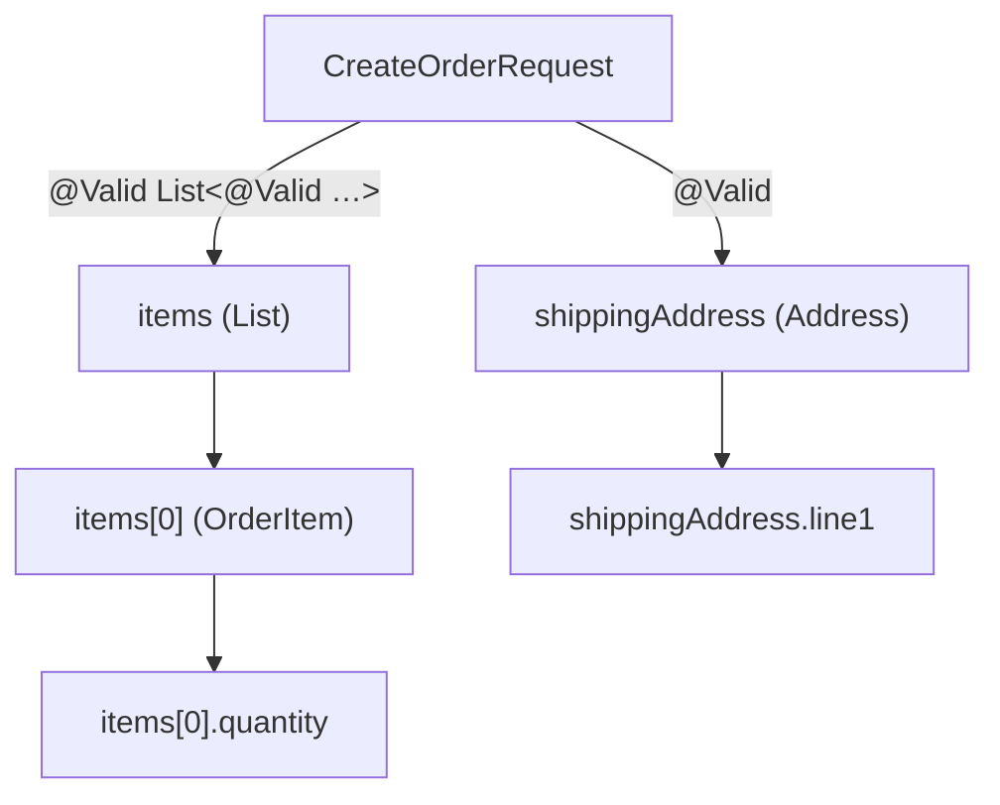
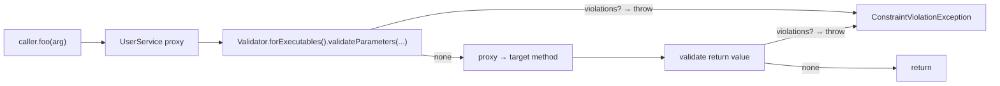

# Validation (@Valid, Bean Validation)

A backend service's hardest job is not the happy path — it is rejecting bad input cleanly, with a useful error, before that bad input corrupts data, charges a card, or crashes a downstream system. **Bean Validation** (originally JSR-303, current JSR-380 / Jakarta Validation 3.0) is Java's standard for declarative input validation: you annotate fields with constraints like `@NotBlank`, `@Email`, `@Size(max = 80)`, and a framework (Hibernate Validator is the de-facto implementation) walks the object graph at the appropriate moment and produces a list of violations. Spring integrates Bean Validation at three layers — MVC request bodies, JPA entities at persistence boundaries, and method-level (any Spring bean's method parameters and return values) — so once you've written `@Email`, the framework enforces it everywhere that data touches the system.

This topic is the deep treatment of validation. T10 introduced `@Valid` at the `@RequestBody` level; here we cover the **complete constraint catalog**, the **cascading semantics** (`@Valid` on nested objects), **groups** for "different rules in different contexts" (a `Create` request must have all fields; an `Update` may have subsets), **method-level validation** (the most under-used and most-powerful Spring validation feature — any `@Validated` Spring bean enforces parameter constraints with no controller in the middle), **custom constraints** with `ConstraintValidator`, **cross-field validation** for "password and confirm-password must match", and the **internationalization** layer (`messages.properties`, locale-aware error messages).

The depth-bar this topic clears: at the **language layer**, every standard constraint, the cascading rules for nested objects / collections / maps, groups and group sequences, class-level constraints for cross-field checks, custom constraint definition. At the **memory layer**, what a validator allocates per validation (a `ValidationContext`, the `Path` builder, a `Set<ConstraintViolation>` typically ~200 B each for the violations) and the per-validation cost (~10–100 µs for a simple DTO with 10 constraints; faster than the JSON deserialization that produced it). At the **architecture layer** — the heart — **how Spring's `MethodValidationPostProcessor` wraps `@Validated` beans with AOP** to enforce parameter and return-value constraints on every method call, **the integration points** at MVC (`@Valid @RequestBody`), JPA (pre-persist / pre-update lifecycle callbacks), `@ConfigurationProperties` (T08), service layer (`@Validated` on a `@Service`), and the **error translation pipeline** that turns a `ConstraintViolationException` into the right HTTP response.

> [!NOTE]
> Prerequisites: T10 for MVC and `@RestControllerAdvice`. Spring AOP from T05 (method-level validation is implemented as a `BeanPostProcessor` that wraps `@Validated` beans). Generics basics (Bean Validation makes heavy use of `Class<?>` group markers and `ConstraintValidator<A, T>`).

## The Standard Constraint Catalog

Jakarta Validation 3.0 (`jakarta.validation.constraints.*`). The full set every senior should know:

| Constraint | Applies to | Meaning |
|-----------|-----------|---------|
| `@NotNull` | any | value ≠ null |
| `@Null` | any | value = null |
| `@NotBlank` | `CharSequence` | not null and `.trim().length() > 0` |
| `@NotEmpty` | `CharSequence` / `Collection` / `Map` / array | not null and size > 0 |
| `@Size(min, max)` | `CharSequence` / `Collection` / `Map` / array | length/size in range |
| `@Min(v)` / `@Max(v)` | numeric (Long, BigInteger, BigDecimal, …) | comparison against `long` |
| `@DecimalMin("v")` / `@DecimalMax("v")` | numeric / String | comparison against `BigDecimal` (supports `inclusive=false`) |
| `@Positive` / `@Negative` | numeric | > 0 / < 0 |
| `@PositiveOrZero` / `@NegativeOrZero` | numeric | ≥ 0 / ≤ 0 |
| `@Digits(integer, fraction)` | numeric / String | up to N integer digits, M fractional |
| `@Email` | `CharSequence` | basic email syntax (RFC 5322 subset) |
| `@Pattern(regexp)` | `CharSequence` | regex match |
| `@Past` / `@PastOrPresent` | temporal (`Instant`, `LocalDate`, …) | < / ≤ now |
| `@Future` / `@FutureOrPresent` | temporal | > / ≥ now |
| `@AssertTrue` / `@AssertFalse` | `boolean` | the value is true / false |
| `@Valid` | object (not a constraint per se) | cascade validation into the nested object |

Hibernate Validator extensions (`org.hibernate.validator.constraints.*`):

| Constraint | Meaning |
|-----------|---------|
| `@URL` | valid URL syntax |
| `@CreditCardNumber` | Luhn-check |
| `@Range(min, max)` | combined `@Min` + `@Max` |
| `@Length(min, max)` | string-only `@Size` |
| `@Currency("EUR")` | `MonetaryAmount` in the specified currency |
| `@ScriptAssert(...)` | run a JSR-223 script over the bean (powerful, slow) |

Constraints **compose**: a field with both `@NotNull` and `@Size(max=80)` requires both to pass. Order is not guaranteed; if you need ordering, use groups.

## Cascading — `@Valid` on Nested Structures

`@Valid` is **not a constraint**; it is a *cascade marker* telling the validator to recurse into the nested object.

```java
public record CreateOrderRequest(
    @NotBlank String customerId,
    @NotEmpty @Valid List<@Valid OrderItem> items,
    @Valid Address shippingAddress
) { }

public record OrderItem(
    @NotBlank String sku,
    @Positive int quantity,
    @DecimalMin("0.01") BigDecimal unitPrice
) { }

public record Address(
    @NotBlank String line1,
    String line2,
    @NotBlank @Size(max = 40) String city,
    @NotBlank @Pattern(regexp = "^[A-Z]{2}$") String country
) { }
```

`@Valid` on the `List<OrderItem>` field tells the validator to step *into* the list. `@Valid` *inside* the type argument (`List<@Valid OrderItem>`) tells it to validate each element. `@Valid` on `Address` recurses into the address.

Violations carry a **path** that locates the field precisely:

```
items[0].quantity     "must be positive"
items[1].unitPrice    "must be at least 0.01"
shippingAddress.line1 "must not be blank"
```

Path elements use array indices, map keys, and field names — enough to produce a field-by-field error map for the client.



## Validation Groups — Different Rules In Different Contexts

A single class with one set of constraints does not always fit. Creating a user needs all fields; updating may allow partial updates. Different contexts → different rules → **groups**.

Groups are marker interfaces:

```java
public interface OnCreate { }
public interface OnUpdate { }

public record UserDto(
    @Null(groups = OnCreate.class) @NotNull(groups = OnUpdate.class) Long id,
    @NotBlank(groups = OnCreate.class) String name,
    @Email String email,
    @Size(min = 8, groups = OnCreate.class) String password
) { }
```

Trigger validation against a group:

```java
@PostMapping
public UserResponse create(@Validated(OnCreate.class) @RequestBody UserDto u) { ... }

@PutMapping("/{id}")
public UserResponse update(@Validated(OnUpdate.class) @RequestBody UserDto u) { ... }
```

`@Validated` (Spring's annotation, not standard Jakarta `@Valid`) accepts a list of group classes. The validator only runs constraints whose `groups` includes one of them. Constraints with no `groups` belong to the **default group** (`Default.class`) and run only when `Default.class` is requested (or when no group is specified).

### Group Sequences

`@GroupSequence` orders groups; if an earlier group fails, later groups are skipped:

```java
@GroupSequence({ Basic.class, Advanced.class })
public interface Order { }
```

Useful when the advanced checks are expensive (DB lookups in a custom validator) and the cheap checks usually catch the easy errors first.

## Method-Level Validation — The Sleeper

Bean Validation's most powerful feature is **method-level validation**: constraints can sit on a method's parameters and return value, and the framework enforces them on every call. Spring enables this via `@Validated` on a class and an auto-configured `MethodValidationPostProcessor`:

```java
@Service
@Validated
public class UserService {

    public User load(@Min(1) long id) {
        // ...
    }

    public @NotNull User create(@NotBlank String name, @Email String email) {
        // ...
    }

    public List<@Valid User> findByOrg(@NotBlank String orgId, @Min(1) int page) {
        // ...
    }
}
```

What happens at runtime:

- `MethodValidationPostProcessor` is a `BeanPostProcessor` (T05) that wraps every `@Validated` bean with an AOP proxy.
- On each method call the proxy intercepts, asks the `Validator` to check the method's parameters.
- If violations exist → throw `ConstraintViolationException` with the violations.
- Otherwise → call through to the real method, then validate the return value (if it has constraints).



The cost: ~1–3 µs per method call (validator dispatch + constraint check). For a service called millions of times per day, this is negligible compared to the database round-trips.

**Self-invocation matters** (T05). `@Validated` is AOP-based; a self-call from inside the same class bypasses the proxy. Either inject the bean into a separate caller or refactor.

## Translating Violations to HTTP Responses

Three exception types you will see:

| Context | Exception | Origin |
|---------|-----------|--------|
| `@Valid @RequestBody DTO` | `MethodArgumentNotValidException` | MVC argument resolver |
| `@Validated` on path/query params | `ConstraintViolationException` | `MethodValidationPostProcessor` |
| `@Validated` on a service method | `ConstraintViolationException` | `MethodValidationPostProcessor` |

A unified `@RestControllerAdvice`:

```java
@RestControllerAdvice
public class ValidationAdvice {

    @ExceptionHandler(MethodArgumentNotValidException.class)
    public ProblemDetail onBodyValidation(MethodArgumentNotValidException e) {
        Map<String, String> errors = e.getBindingResult().getFieldErrors().stream()
            .collect(toMap(
                FieldError::getField,
                fe -> Objects.requireNonNullElse(fe.getDefaultMessage(), "invalid"),
                (a, b) -> a + ", " + b));
        ProblemDetail pd = ProblemDetail.forStatus(BAD_REQUEST);
        pd.setTitle("Validation failed");
        pd.setProperty("errors", errors);
        return pd;
    }

    @ExceptionHandler(ConstraintViolationException.class)
    public ProblemDetail onConstraintViolation(ConstraintViolationException e) {
        Map<String, String> errors = e.getConstraintViolations().stream()
            .collect(toMap(
                cv -> cv.getPropertyPath().toString(),
                ConstraintViolation::getMessage,
                (a, b) -> a + ", " + b));
        ProblemDetail pd = ProblemDetail.forStatus(BAD_REQUEST);
        pd.setTitle("Validation failed");
        pd.setProperty("errors", errors);
        return pd;
    }
}
```

This produces a unified error shape regardless of which validation layer caught the bad input.

## Custom Constraints

When the standard constraints do not fit, you write your own.

### Step 1: The Annotation

```java
@Target({ FIELD, PARAMETER, METHOD })
@Retention(RUNTIME)
@Constraint(validatedBy = E164PhoneValidator.class)
@Documented
public @interface E164Phone {
    String message() default "must be a valid E.164 phone number";
    Class<?>[] groups() default {};
    Class<? extends Payload>[] payload() default {};
}
```

`@Constraint(validatedBy = ...)` ties the annotation to a `ConstraintValidator` implementation. `message`, `groups`, `payload` are required by the Jakarta spec.

### Step 2: The Validator

```java
public class E164PhoneValidator implements ConstraintValidator<E164Phone, String> {
    private static final Pattern E164 = Pattern.compile("^\\+[1-9]\\d{1,14}$");

    @Override public void initialize(E164Phone annotation) {
        // read annotation params, prepare cached state
    }

    @Override public boolean isValid(String value, ConstraintValidatorContext ctx) {
        if (value == null) return true;   // null handled by @NotNull separately
        return E164.matcher(value).matches();
    }
}
```

The validator is invoked once per validation. **Null handling convention**: return `true` for null (let `@NotNull` cover it explicitly). This composes properly with `@NotNull @E164Phone`.

### Step 3: Use It

```java
public record ContactDto(
    @NotBlank String name,
    @E164Phone String phone
) { }
```

The validator becomes a Spring bean only if you wire it explicitly; for stateless validators, the default `ConstraintValidatorFactory` instantiates it via reflection. If your validator needs Spring beans (`@Autowired` a repository for "this username is unique" checks), Hibernate Validator integrates with Spring via `SpringConstraintValidatorFactory` (auto-configured) and your validator can be a `@Component` with constructor-injected dependencies.

### Class-Level Constraints — Cross-Field

Constraints can target the *class* and validate properties of multiple fields together. The classic "passwords match":

```java
@Target({ TYPE })
@Retention(RUNTIME)
@Constraint(validatedBy = PasswordsMatchValidator.class)
public @interface PasswordsMatch {
    String message() default "passwords do not match";
    Class<?>[] groups() default {};
    Class<? extends Payload>[] payload() default {};
}

public class PasswordsMatchValidator implements ConstraintValidator<PasswordsMatch, UserDto> {
    @Override public boolean isValid(UserDto u, ConstraintValidatorContext ctx) {
        if (u.password() == null || !u.password().equals(u.confirmPassword())) {
            ctx.disableDefaultConstraintViolation();
            ctx.buildConstraintViolationWithTemplate("{passwords.mismatch}")
               .addPropertyNode("confirmPassword")
               .addConstraintViolation();
            return false;
        }
        return true;
    }
}

@PasswordsMatch
public record UserDto(
    @NotBlank String name,
    @Size(min = 8) String password,
    @NotBlank String confirmPassword
) { }
```

The class-level constraint sees the whole DTO and can attach the violation to a specific field path. The `confirmPassword` path means client error renderers can highlight the right input.

## Composed Constraints

Multiple constraints can be composed into one annotation. Easier than writing a custom validator when the underlying constraints already exist:

```java
@NotBlank
@Size(max = 80)
@Pattern(regexp = "^[\\p{L} .'-]+$", message = "name has invalid characters")
@Target({ FIELD, PARAMETER, METHOD })
@Retention(RUNTIME)
@Constraint(validatedBy = {})
public @interface ValidName {
    String message() default "invalid name";
    Class<?>[] groups() default {};
    Class<? extends Payload>[] payload() default {};
}

public record UserDto(@ValidName String name, @Email String email) { }
```

`@ValidName` is "all of the above" — the validator finds the composing annotations and aggregates their results. Spring's stereotype pattern, applied to constraints.

## JPA Integration

Hibernate (or any JPA provider) calls the validator on entity persistence boundaries — by default before `@PrePersist` and `@PreUpdate`:

```java
@Entity
public class Order {
    @Id @GeneratedValue Long id;
    @NotBlank @Size(max = 80) String customerId;
    @Positive int totalCents;
    @NotEmpty @Valid List<OrderItem> items;
    // ...
}
```

On `entityManager.persist(order)`, Hibernate runs Bean Validation; violations throw `jakarta.validation.ConstraintViolationException`. The transaction rolls back.

Configure with `jakarta.persistence.validation.mode` — `auto` (default), `callback`, `none`. Disable on hot paths only after measuring; the cost is dominated by reflection, JPA already does plenty of it.

## `@ConfigurationProperties` Validation

T08 covered this briefly:

```java
@ConfigurationProperties("app.cache")
@Validated
public record CacheProperties(
    @NotNull Duration ttl,
    @Min(100) @Max(1_000_000) int maxSize,
    @Pattern(regexp = "^(LRU|LFU)$") String policy
) { }
```

Boot validates at binding time. A bad value in `application.yml` fails the container's startup with a clear error pointing at the property path. **Pushes configuration bugs from "noticed at 3 AM" to "noticed at deploy time."**

## Internationalization

Constraint messages can be locale-aware via `messages.properties` / `messages_de.properties` / `messages_es.properties` files on the classpath:

```properties
# messages.properties
javax.validation.constraints.NotBlank.message=must not be blank
javax.validation.constraints.Email.message=must be a valid email
com.example.constraints.E164Phone.message=must be a valid international phone number
```

Spring's `MessageSourceLocaleResolver` (or `AcceptHeaderLocaleResolver`) picks the locale from the request's `Accept-Language`. Hibernate Validator's `MessageInterpolator` consults `LocalValidatorFactoryBean.setValidationMessageSource(messageSource)` and renders the localized message.

Constraint messages can also use `{...}` placeholders to embed the constraint's parameters:

```properties
javax.validation.constraints.Size.message=size must be between {min} and {max}
```

## Memory and Performance

Per-validation cost on a Hibernate Validator backed validator:

| DTO shape | Constraints | Time |
|-----------|------------:|-----:|
| Flat 10-field record | 10 | ~10 µs |
| Nested 3 levels deep | 30 total | ~40 µs |
| Collection of 100 items | 1000 total | ~500 µs |

These costs are well under the surrounding cost of JSON deserialization (~100 µs for typical payloads). Skip validation only if you have measured it as a bottleneck.

Memory: a `ConstraintViolation` is ~200 B. A request with 10 violations costs ~2 KB. Validation context allocation is amortized over the validation; for a single validation, total allocation is ~10–30 KB.

## Common Pitfalls

> [!WARNING]
> **`@Valid` vs `@Validated`.** `@Valid` (Jakarta) is the cascade marker on a parameter / field. `@Validated` (Spring) is for group selection at the parameter level and to *enable* method-level validation on a class. They are not interchangeable.

> [!WARNING]
> **Constraints on records without `-parameters`.** Bean Validation works on records, but parameter-name binding (for messages and error paths) needs the compiler's `-parameters` flag. Boot's Maven/Gradle plugins enable it by default; check if you have a custom build.

> [!WARNING]
> **Forgetting null handling in custom validators.** Returning `false` on null means a `@MyConstraint String x` *with* null fails validation — but you likely want `@NotNull @MyConstraint` to express that. Return `true` for null and let `@NotNull` carry the null check.

> [!WARNING]
> **Heavy database lookups in custom validators.** A "username unique" validator that hits the DB on every validation can serialize the whole request pipeline. Mark the validator as `@Component`, inject the repository, and consider caching or moving the check elsewhere.

> [!WARNING]
> **Group selection on `@Valid` (not supported).** Standard `@Valid` ignores groups. Use Spring's `@Validated(OnCreate.class)` to specify groups.

> [!WARNING]
> **Returning early from `isValid` without `ctx.disableDefaultConstraintViolation()` when you build custom messages.** The default message is then *also* emitted, double-reporting the violation.

> [!WARNING]
> **Validating large lists.** `@Size(min = 1, max = 1_000_000)` on a list of nested `@Valid` objects with 5 constraints each → 5M constraint evaluations on a single request. Validate the size cheaply, then validate items lazily / in chunks.

## Practice

1. Build a `CreateUserRequest` record with `@NotBlank`, `@Email`, `@Size(min=8)` password. Use `@Valid @RequestBody` in a `@PostMapping`. Send a bad payload and inspect the JSON error response.
2. Write a custom `@E164Phone` constraint with a `ConstraintValidator`. Apply to a phone field. Verify a malformed string fails.
3. Add a class-level `@PasswordsMatch` constraint. Verify that `password` and `confirmPassword` mismatches produce a path on `confirmPassword`.
4. Define `OnCreate` and `OnUpdate` groups. Annotate fields with `groups`. Use `@Validated(OnCreate.class)` and `@Validated(OnUpdate.class)` in two endpoints. Verify the constraints differ.
5. Add `@Validated` to a `@Service` class. Add `@Min(1) long id` to a method parameter. Call the method with id = 0; confirm a `ConstraintViolationException`.
6. Set up a `@RestControllerAdvice` translating `MethodArgumentNotValidException` and `ConstraintViolationException` into RFC 7807 `ProblemDetail`. Verify both produce the same shape.
7. Add localized messages in `messages.properties` and `messages_es.properties`. Set `Accept-Language: es` on a bad request; confirm the response is in Spanish.
8. Wire a "username uniqueness" validator that queries a repository. Measure the latency under load. Decide whether to keep it as a constraint or move to an explicit service check.

## Recap

You should now be able to:

- Use the standard constraint catalog (`@NotBlank`, `@Size`, `@Min`, `@Max`, `@Email`, `@Pattern`, `@Past`/`@Future`, `@Positive`/`@Negative`, `@Digits`, etc.) and Hibernate Validator extensions.
- Cascade validation into nested objects, collections, and maps with `@Valid` on parameters and inside type arguments.
- Use groups for context-specific validation, group sequences for ordering, and class-level constraints for cross-field rules.
- Enable method-level validation with `@Validated` on a Spring bean and explain that it works via `MethodValidationPostProcessor` AOP wrapping.
- Distinguish `MethodArgumentNotValidException` (from MVC binding) from `ConstraintViolationException` (from method-level / parameter-level) and translate both to clean error responses.
- Write a custom constraint annotation + `ConstraintValidator` implementation and integrate it with Spring (so the validator can `@Autowired` repositories or other beans).
- Compose constraints into a single annotation and reason about when composition is preferable to a custom validator.
- Integrate validation at the MVC layer, JPA persistence boundaries, `@ConfigurationProperties` startup binding, and service-method level.
- Internationalize constraint messages via `messages.properties`.
- Quantify validation cost (~10–500 µs per request) and decide where to spend the cycles.
- Avoid the common pitfalls: `@Valid` vs `@Validated`, missing `-parameters`, null-handling in custom validators, expensive DB lookups in constraints, default-message double-emission.

## Next

Continue to [Exception Handling (@ControllerAdvice)](./T12-exception-handling-controlleradvice.md) for the deep treatment of `@ControllerAdvice` / `@RestControllerAdvice` — `@ExceptionHandler` ordering, `ProblemDetail` (RFC 7807), `ResponseEntityExceptionHandler`, custom error templates, and how to architect a unified error contract across your microservices.
