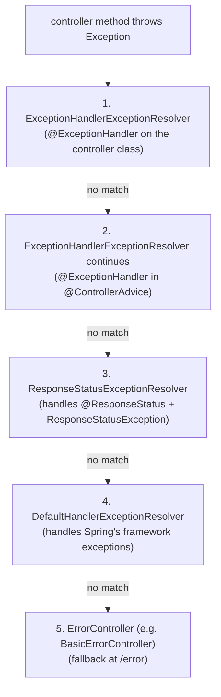

# Exception Handling (@ControllerAdvice)

When a controller method throws, the user-visible result is whatever the framework defaults to — or whatever your error-handling layer chooses. The defaults are *operable* but not *good*: a `RuntimeException` produces a generic `500 Internal Server Error` with an undefined body shape; a `NoHandlerFoundException` becomes a `404` with a different shape; a binding failure becomes a `400` with yet another shape. From the API consumer's perspective, error responses from the same service have inconsistent JSON, inconsistent status codes, inconsistent identifying codes — making client-side error handling a chore and a source of bugs.

`@RestControllerAdvice` is Spring's solution: a single class that intercepts exceptions from every (or selected) controller and translates them to a **uniform error contract** — the same JSON shape, the same fields, machine-readable codes that clients can switch on. The 2024-era best practice for the JSON shape is **RFC 7807 `application/problem+json`** (`ProblemDetail`), shipped natively in Spring 6 / Boot 3. With one well-written `@RestControllerAdvice`, your service goes from "every error is a surprise" to "every error obeys the contract."

This topic builds on T10's quick introduction. Here we go deep: the **resolver order** (which advice/exception handler wins when there are multiple candidates), `ResponseEntityExceptionHandler` as a base class for handling Spring's own framework exceptions cleanly, **scoped advice** (`basePackages`, `assignableTypes`, `annotations` for per-module error handling), **async / streaming** exception handling (different rules apply when the response is half-written), the operational reality of **error-code catalogs** that clients can rely on across releases, and the **security** of error responses (never leak stack traces, never leak sensitive field names, never leak system internals).

The depth-bar this topic clears: at the **language layer**, every annotation in the family (`@RestControllerAdvice`, `@ControllerAdvice`, `@ExceptionHandler`, `@ResponseStatus`, `ResponseStatusException`), `ProblemDetail` and the RFC 7807 fields. At the **memory layer**, advice-handler dispatch (resolver chain walked once per exception, cached per controller class), the per-exception cost (~10 µs for handler lookup + reflection invocation), and how Boot's `ErrorAttributes` builds the response. At the **architecture layer** — the heart — **the four-stage exception resolution chain** (`@ExceptionHandler` on the controller → `@ExceptionHandler` in `@ControllerAdvice` → `ResponseStatusExceptionResolver` → `DefaultHandlerExceptionResolver` → `ErrorController`), **error-code catalog design** (stable codes across releases, deprecation paths), **multi-service error envelope design** (gateway, multiple backends, consistent shape), and **security pitfalls** to avoid.

> [!NOTE]
> Prerequisites: [Spring MVC](./T10-spring-mvc-rest-controllers.md) (the dispatch pipeline including exception resolution) and [Validation](./T11-validation-valid-bean-validation.md) (where `MethodArgumentNotValidException` and `ConstraintViolationException` come from).

## The Resolution Chain

When a controller method throws, `DispatcherServlet.processDispatchResult` walks an ordered list of `HandlerExceptionResolver`s. The first resolver to return a non-null `ModelAndView` (or write the response) wins.

The default chain (in order):



Each layer in turn:

### 1. `@ExceptionHandler` on the Controller Class

Handlers defined inside the controller win first. Useful for *controller-local* exception translation — a specific endpoint that needs a non-standard mapping for one exception class.

```java
@RestController
public class OrderController {

    @ExceptionHandler(OutOfStockException.class)
    public ResponseEntity<ProblemDetail> outOfStock(OutOfStockException e) {
        ProblemDetail pd = ProblemDetail.forStatusAndDetail(CONFLICT, "Item out of stock");
        pd.setProperty("sku", e.sku());
        return ResponseEntity.status(CONFLICT)
            .header("X-Backoff-Seconds", "30")
            .body(pd);
    }
}
```

### 2. `@ExceptionHandler` in `@ControllerAdvice`

The global handlers — covered in depth below. These catch any exception not handled by a local handler.

### 3. `ResponseStatusExceptionResolver`

Translates two things:

- An exception class annotated with `@ResponseStatus(...)` — the resolver sets the response status accordingly.
- A `ResponseStatusException` thrown from anywhere — the resolver reads its `status` and `reason`.

```java
@ResponseStatus(value = NOT_FOUND, reason = "User not found")
public class UserNotFoundException extends RuntimeException { }

// or, without a custom exception class:
throw new ResponseStatusException(NOT_FOUND, "User " + id + " not found");
```

The latter is convenient for one-offs without a dedicated class. The downside: every throw site duplicates the message logic, and there is no central place to add headers, codes, or properties.

### 4. `DefaultHandlerExceptionResolver`

Handles a *fixed list* of Spring framework exceptions with sensible defaults:

| Exception | Response |
|-----------|----------|
| `NoHandlerFoundException` | 404 |
| `HttpRequestMethodNotSupportedException` | 405 + `Allow` header |
| `HttpMediaTypeNotSupportedException` | 415 + `Accept` header |
| `HttpMediaTypeNotAcceptableException` | 406 |
| `MissingPathVariableException` | 500 |
| `MissingServletRequestParameterException` | 400 |
| `ServletRequestBindingException` | 400 |
| `ConversionNotSupportedException` | 500 |
| `TypeMismatchException` | 400 |
| `HttpMessageNotReadableException` | 400 |
| `HttpMessageNotWritableException` | 500 |
| `MethodArgumentNotValidException` | 400 |
| `MissingServletRequestPartException` | 400 |
| `BindException` | 400 |
| `AsyncRequestTimeoutException` | 503 |

The bodies are mostly empty (Spring delegates the actual body content to `ErrorAttributes` / `ErrorController`).

### 5. `ErrorController` (Last-Resort)

If no resolver handles the exception, Spring forwards to `/error`, where `BasicErrorController` renders the default error page. With `accept: application/json`, the response is the `ErrorAttributes` JSON; with `accept: text/html`, it is Boot's "Whitelabel error page."

`ErrorAttributes` (default implementation `DefaultErrorAttributes`) returns:

```json
{
  "timestamp": "2026-06-08T12:00:00.000+00:00",
  "status": 500,
  "error": "Internal Server Error",
  "path": "/api/orders",
  "message": "Something failed",
  "trace": "(omitted by default in prod)"
}
```

This is the fallback you want never to see — by the time you reach it, the request has hit *nothing* you wrote. Building a `@RestControllerAdvice` that handles every realistic exception means clients never see this default shape.

## A Production-Ready `@RestControllerAdvice`

The pattern used by mature Spring services:

```java
@RestControllerAdvice
@Order(Ordered.HIGHEST_PRECEDENCE)
public class GlobalExceptionAdvice extends ResponseEntityExceptionHandler {

    private final ErrorCodeCatalog codes;

    public GlobalExceptionAdvice(ErrorCodeCatalog codes) { this.codes = codes; }

    // === domain exceptions ===

    @ExceptionHandler(UserNotFoundException.class)
    public ResponseEntity<ProblemDetail> onUserNotFound(UserNotFoundException e, WebRequest req) {
        return problem(NOT_FOUND, codes.USER_NOT_FOUND, e.getMessage(), req,
            pd -> pd.setProperty("userId", e.userId()));
    }

    @ExceptionHandler(InsufficientFundsException.class)
    public ResponseEntity<ProblemDetail> onInsufficientFunds(InsufficientFundsException e, WebRequest req) {
        return problem(UNPROCESSABLE_ENTITY, codes.INSUFFICIENT_FUNDS, e.getMessage(), req,
            pd -> pd.setProperty("required", e.required()).setProperty("available", e.available()));
    }

    // === framework exceptions (overriding ResponseEntityExceptionHandler) ===

    @Override
    protected ResponseEntity<Object> handleMethodArgumentNotValid(
            MethodArgumentNotValidException e, HttpHeaders headers, HttpStatusCode status, WebRequest req) {
        Map<String, String> fieldErrors = e.getBindingResult().getFieldErrors().stream()
            .collect(toMap(FieldError::getField,
                fe -> Objects.requireNonNullElse(fe.getDefaultMessage(), "invalid"),
                (a, b) -> a + ", " + b));
        ProblemDetail pd = ProblemDetail.forStatus(BAD_REQUEST);
        pd.setTitle("Validation failed");
        pd.setType(URI.create("https://example.com/probs/validation"));
        pd.setProperty("code", codes.VALIDATION_FAILED.value());
        pd.setProperty("errors", fieldErrors);
        pd.setInstance(URI.create(req.getDescription(false).replace("uri=", "")));
        return new ResponseEntity<>(pd, headers, BAD_REQUEST);
    }

    // === fallback ===

    @ExceptionHandler(Exception.class)
    public ResponseEntity<ProblemDetail> onUnknown(Exception e, WebRequest req) {
        log.error("unhandled exception at {}", req.getDescription(false), e);
        return problem(INTERNAL_SERVER_ERROR, codes.INTERNAL, "An unexpected error occurred", req,
            pd -> { /* no extra details — never leak internals */ });
    }

    // === helper ===

    private ResponseEntity<ProblemDetail> problem(HttpStatus status, ErrorCode code, String detail,
            WebRequest req, Consumer<ProblemDetail> customizer) {
        ProblemDetail pd = ProblemDetail.forStatusAndDetail(status, detail);
        pd.setType(URI.create("https://example.com/probs/" + code.slug()));
        pd.setTitle(code.title());
        pd.setProperty("code", code.value());
        pd.setInstance(URI.create(req.getDescription(false).replace("uri=", "")));
        customizer.accept(pd);
        return ResponseEntity.status(status).body(pd);
    }
}
```

What this does:

1. Extends `ResponseEntityExceptionHandler` — Spring's base class that has ready overrides for every framework exception. Replace each with your own logic to produce uniform `ProblemDetail` responses.
2. Catches domain exceptions explicitly with one handler per type. Each translates to a specific status, a stable code, and well-typed properties.
3. Has a fallback `@ExceptionHandler(Exception.class)` that logs and returns a generic 500. The detail is *intentionally* vague — never leak class names, stack traces, or internals.
4. Centralizes the `ProblemDetail` construction in a `problem(...)` helper so every response has the same shape: `type`, `title`, `status`, `detail`, `instance`, `code`, plus exception-specific properties.

## RFC 7807 `ProblemDetail` — Why and How

RFC 7807 (2016) standardized error responses for HTTP APIs. The media type `application/problem+json`; the JSON body has well-known top-level fields:

```json
{
  "type":     "https://example.com/probs/user-not-found",
  "title":    "User not found",
  "status":   404,
  "detail":   "User with id 42 was not found",
  "instance": "/api/users/42",
  "code":     "USER_NOT_FOUND",
  "userId":   42
}
```

| Field | Meaning |
|-------|---------|
| `type` | URI identifying the problem class (a stable identifier; the page can document the error and fix) |
| `title` | short human-readable summary of the problem class |
| `status` | HTTP status code (duplicated for clients reading body without status) |
| `detail` | human-readable explanation for this specific instance |
| `instance` | URI identifying this specific occurrence (typically the request URI or a trace id) |
| `code` (extension) | machine-readable stable identifier — what clients switch on |
| arbitrary extension fields | use for structured context (`userId`, `errors`, `retryAfter`, …) |

`ProblemDetail` (Spring 6 / Boot 3) has builders for each. Spring's `MappingJackson2HttpMessageConverter` writes it with `Content-Type: application/problem+json`.

### Why a Stable Code, Not a Status Class?

HTTP status codes are too coarse. `400 Bad Request` means *something* was wrong — but which thing? A client that wants to retry a transient validation failure but give up on a malformed request needs to distinguish. The `code` extension gives clients a stable identifier:

- `USER_NOT_FOUND` (404)
- `INSUFFICIENT_FUNDS` (422)
- `RATE_LIMIT_EXCEEDED` (429)
- `VALIDATION_FAILED` (400)
- `INTERNAL` (500)

Codes are part of your *public API contract*. Stable across releases; deprecations follow your version-policy.

## `ResponseEntityExceptionHandler` — The Base Class

Spring ships this abstract class with one `@ExceptionHandler` for every Spring framework exception:

```java
public abstract class ResponseEntityExceptionHandler {

    @ExceptionHandler({
        HttpRequestMethodNotSupportedException.class,
        HttpMediaTypeNotSupportedException.class,
        HttpMediaTypeNotAcceptableException.class,
        // ... 15 more
    })
    public final ResponseEntity<Object> handleException(Exception e, WebRequest req) {
        // dispatches to one of the protected methods below
    }

    protected ResponseEntity<Object> handleHttpRequestMethodNotSupported(...)  { ... }
    protected ResponseEntity<Object> handleHttpMediaTypeNotSupported(...)       { ... }
    protected ResponseEntity<Object> handleHttpMediaTypeNotAcceptable(...)      { ... }
    protected ResponseEntity<Object> handleMissingServletRequestParameter(...)  { ... }
    protected ResponseEntity<Object> handleMethodArgumentNotValid(...)          { ... }
    protected ResponseEntity<Object> handleNoHandlerFoundException(...)         { ... }
    // ...
}
```

You extend it and override the `protected` methods to plug in your own error shape:

```java
@RestControllerAdvice
public class GlobalExceptionAdvice extends ResponseEntityExceptionHandler {
    @Override
    protected ResponseEntity<Object> handleHttpRequestMethodNotSupported(
            HttpRequestMethodNotSupportedException e, HttpHeaders headers, HttpStatusCode status, WebRequest req) {
        ProblemDetail pd = ProblemDetail.forStatus(METHOD_NOT_ALLOWED);
        pd.setTitle("Method not allowed");
        pd.setProperty("supportedMethods", e.getSupportedHttpMethods());
        return new ResponseEntity<>(pd, headers, METHOD_NOT_ALLOWED);
    }
}
```

Now every "framework-level" exception goes through your shape; you do not have to handle each one individually. The base class is the cleanest entry point.

Spring 6.0 added `ResponseEntityExceptionHandler.createProblemDetail` which auto-builds a `ProblemDetail` for many cases — Spring is converging on `ProblemDetail` as the default.

## Scoped `@ControllerAdvice`

Default `@ControllerAdvice` applies to *every* controller. You can scope it:

```java
@RestControllerAdvice(basePackages = "com.example.admin")
public class AdminExceptionAdvice { ... }                 // only admin controllers

@RestControllerAdvice(assignableTypes = OrderController.class)
public class OrderExceptionAdvice { ... }                 // only OrderController

@RestControllerAdvice(annotations = ApiV2.class)
public class V2ExceptionAdvice { ... }                    // only controllers with @ApiV2
```

Useful when:

- The admin API has different error shapes than the public API.
- A v1 controller still uses the old error format; v2 uses RFC 7807.
- A microservice that exposes both REST and GraphQL has different handling for each.

Multiple advices can match a controller; ordering via `@Order` resolves which gets the exception first.

## Async Exception Handling

When the controller returns a `Callable<T>`, `DeferredResult<T>`, or `CompletableFuture<T>`, the actual exception happens on a different thread *after* the controller method returned. Spring handles this via async dispatch: the framework redispatches the failed result through the same exception-handling pipeline.

```java
@GetMapping("/async")
public Callable<UserResponse> get() {
    return () -> {
        throw new UserNotFoundException(42);    // caught and routed via @ExceptionHandler
    };
}
```

Works. The `Callable`'s exception is caught by Spring's async-completion machinery; redispatched; your `@ExceptionHandler(UserNotFoundException.class)` runs.

`DeferredResult`'s `setErrorResult(...)` accepts an exception object; it goes through the same pipeline.

For streaming responses (`StreamingResponseBody`, `SseEmitter`), an exception happens after the headers have been written — at that point the client has already received 200 OK. The framework cannot retroactively change the status. The convention: log on the server, and break the stream / send a special SSE event to signal end of stream to the client.

## Error-Code Catalog Design

Build a stable `ErrorCode` enum your handlers use:

```java
public enum ErrorCode {
    USER_NOT_FOUND      ("USER_NOT_FOUND",      404, "User not found"),
    INSUFFICIENT_FUNDS  ("INSUFFICIENT_FUNDS",  422, "Insufficient funds"),
    VALIDATION_FAILED   ("VALIDATION_FAILED",   400, "Validation failed"),
    RATE_LIMIT_EXCEEDED ("RATE_LIMIT_EXCEEDED", 429, "Rate limit exceeded"),
    INTERNAL            ("INTERNAL",            500, "Internal server error");

    private final String code;
    private final int status;
    private final String title;
    // constructor + getters
    public String slug() { return code.toLowerCase().replace('_', '-'); }
}
```

Document the catalog (auto-generated from the enum, hosted at `/docs/errors/`). Every entry has:

- The stable code.
- The status range.
- A title and human-readable description.
- The list of `properties` clients can expect.
- Recovery / retry guidance.
- Deprecation status if relevant.

Treat error codes as part of your API contract. Adding new codes is non-breaking. Removing or renaming a code is a breaking change — deprecate first, ship over multiple versions, monitor client usage via telemetry, then remove.

## Security — What Not To Leak

Five common error-handling security mistakes:

> [!WARNING]
> **Stack traces in production responses.** Tells an attacker exactly which Spring version, which JDK, which dependencies you run. Boot's `server.error.include-stacktrace=never` (default) prevents this in the fallback path; in your custom handlers, never put `e.toString()` into the response body.

> [!WARNING]
> **Detailed messages on auth failures.** "User foo does not exist" vs "Password incorrect" lets an attacker enumerate usernames. Use generic `"invalid credentials"` for both.

> [!WARNING]
> **SQL error details.** A `DataIntegrityViolationException` whose `getMessage()` contains a fragment of your SQL exposes column names and constraints. Map to a generic `CONFLICT` or `INVALID_DATA` code with no SQL leak.

> [!WARNING]
> **Validation messages from constraint violations.** A custom validator with a message `"username must not contain SQL keywords like 'DROP TABLE'"` tells the attacker exactly what they were trying. Keep messages neutral.

> [!WARNING]
> **Field paths that leak internal model structure.** A validation error path `accounts[0].internalSettings.creditScore` reveals fields the client should not know about. Translate from internal to external field names in the error response when the entity has both.

The general principle: **clients see status codes, stable error codes, and minimal sanitized properties.** Server logs see everything.

## Streaming Error Telemetry

Every exception your advice handles should also produce structured server-side logging and a metric. Example:

```java
@ExceptionHandler(UserNotFoundException.class)
public ResponseEntity<ProblemDetail> onUserNotFound(UserNotFoundException e, WebRequest req) {
    log.info("user not found id={} path={}", e.userId(), req.getDescription(false));
    Metrics.counter("api.errors", "code", "USER_NOT_FOUND", "status", "404").increment();
    return problem(NOT_FOUND, codes.USER_NOT_FOUND, e.getMessage(), req,
        pd -> pd.setProperty("userId", e.userId()));
}
```

Now Prometheus shows error rates per code over time; logs let you trace any specific request. The advice is the *single place* this happens.

## Worked Example — End-to-End

`OrderController` throws three custom exceptions; the advice maps each. Full pipeline:

```java
// === domain layer ===
public class OutOfStockException extends RuntimeException {
    private final String sku;
    public OutOfStockException(String sku) {
        super("Item " + sku + " is out of stock");
        this.sku = sku;
    }
    public String sku() { return sku; }
}

// === controller ===
@RestController
@RequestMapping("/api/orders")
public class OrderController {

    @PostMapping
    public OrderResponse place(@Valid @RequestBody PlaceOrderRequest req) {
        return orderService.place(req);   // may throw OutOfStockException, InsufficientFundsException, ...
    }
}

// === advice ===
@RestControllerAdvice
public class OrderExceptionAdvice extends ResponseEntityExceptionHandler {

    @ExceptionHandler(OutOfStockException.class)
    public ResponseEntity<ProblemDetail> onOutOfStock(OutOfStockException e, WebRequest req) {
        ProblemDetail pd = ProblemDetail.forStatusAndDetail(CONFLICT, "Item out of stock");
        pd.setTitle("Out of stock");
        pd.setType(URI.create("https://example.com/probs/out-of-stock"));
        pd.setProperty("code", "OUT_OF_STOCK");
        pd.setProperty("sku", e.sku());
        return ResponseEntity.status(CONFLICT)
            .header("Retry-After", "60")
            .body(pd);
    }
}
```

Response to a `POST /api/orders` that triggers the exception:

```
HTTP/1.1 409 Conflict
Content-Type: application/problem+json
Retry-After: 60

{
  "type":   "https://example.com/probs/out-of-stock",
  "title":  "Out of stock",
  "status": 409,
  "detail": "Item out of stock",
  "code":   "OUT_OF_STOCK",
  "sku":    "WIDGET-42"
}
```

A consumer can match on `code == "OUT_OF_STOCK"`, read the `sku`, and decide to retry or surface the error. The framework's contribution: one handler in one class — the controller stays clean.

## Common Pitfalls

> [!WARNING]
> **`@ControllerAdvice` instead of `@RestControllerAdvice` for a REST API.** Without the `@ResponseBody` semantics, your `ProblemDetail` return values go through view resolution and serialize as HTML/JSON inconsistently. Use `@RestControllerAdvice` for REST.

> [!WARNING]
> **Multiple advices catching the same exception with different shapes.** The first one wins (by `@Order`), the rest never run. If your custom advice does not run, check the `@Order` and `basePackages` of every existing advice.

> [!WARNING]
> **Throwing inside `@ExceptionHandler`.** The handler itself throwing causes the default error pipeline to kick in — the fallback ugly page. Wrap risky operations in try/catch.

> [!WARNING]
> **Returning different shapes from different handlers.** Defeats the entire purpose. Use a single shared helper to build the response shape. The shape is part of your API contract.

> [!WARNING]
> **`Throwable` in `@ExceptionHandler`.** Spring will catch `Error`s along with `Exception`s, swallow them, and continue. That is wrong — `OutOfMemoryError` should crash the JVM, not be wrapped in a 500. Stick with `Exception`.

> [!WARNING]
> **Forgetting `@RestControllerAdvice` for the `Exception.class` fallback.** Without one, unexpected exceptions fall through to `ErrorController` and produce the Boot default JSON — inconsistent with your other errors. Always have a fallback.

> [!WARNING]
> **Exposing `e.getMessage()` directly.** Often contains the SQL fragment, the JSON parsing path, or the security-sensitive value. Translate to a sanitized message.

## Practice

1. Build a `@RestControllerAdvice` extending `ResponseEntityExceptionHandler`. Override `handleMethodArgumentNotValid` to produce RFC 7807. Verify a bad payload produces the expected JSON.
2. Add `@ExceptionHandler` methods for three domain exceptions. Use a shared `problem(...)` helper. Confirm consistent shape across all three.
3. Define an `ErrorCode` enum with five entries. Wire it into your handlers. Confirm the `code` extension field appears in every response.
4. Trigger each exception path (validation failure, framework exception, domain exception, unhandled) and read the JSON. Confirm uniform shape.
5. Add a scoped `@RestControllerAdvice(basePackages = "com.example.admin")`. Confirm it does not catch exceptions from public controllers.
6. Make a fallback `@ExceptionHandler(Exception.class)` that logs `e` and returns a sanitized 500. Confirm an arbitrary `RuntimeException` produces the safe response (no stack trace, no class name).
7. Add Micrometer counters in each handler tagged by `code`. View in Prometheus / Grafana.
8. Verify that an async `Callable` throwing an exception is properly routed to the advice (set a breakpoint and confirm the redispatch).

## Recap

You should now be able to:

- Walk the four-stage exception resolution chain: controller `@ExceptionHandler` → advice `@ExceptionHandler` → `ResponseStatusExceptionResolver` → `DefaultHandlerExceptionResolver` → `ErrorController`.
- Choose between `@ResponseStatus`, `ResponseStatusException`, and custom exception classes with handlers.
- Build a production-grade `@RestControllerAdvice` extending `ResponseEntityExceptionHandler`, with consistent RFC 7807 `ProblemDetail` responses.
- Design an error-code catalog as part of your public API contract, including stable codes, status mapping, and a deprecation path.
- Scope advice by package, type, or annotation to handle different module / API-version errors.
- Handle async / streaming exceptions with the right semantics (async redispatch / mid-stream signaling).
- Avoid security pitfalls — never leak stack traces, SQL fragments, internal field names, validation hints with sensitive content, or authentication-enumeration messages.
- Wire structured logging and metrics into every handler so every error has a Prometheus signal.

## Next

Continue to [Spring Data](./T13-spring-data.md) — the repository abstraction that turns "I want a `User` by id" into a generated implementation that knows JPA, MongoDB, Redis, Cassandra, R2DBC, and more. The pattern that made Spring's persistence story magnetic.
