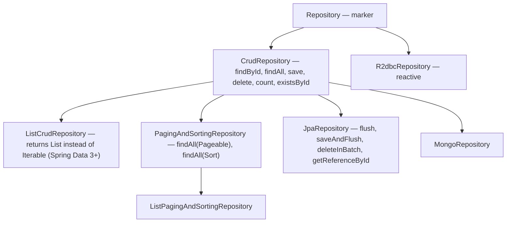
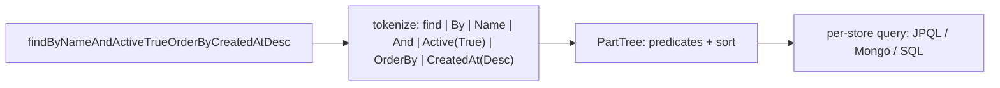
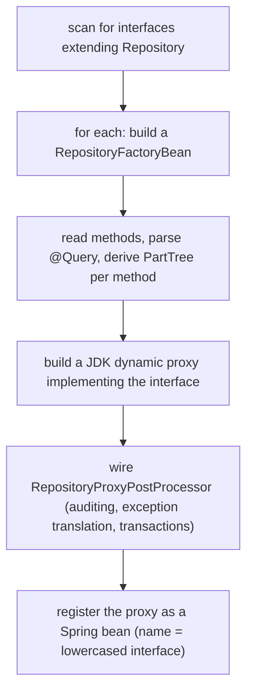

# Spring Data

Most CRUD code is the same: open a transaction, find an entity by id, mutate it, save it, commit. **Spring Data** is the repository pattern lifted to its logical conclusion: you declare an *interface* with method signatures expressing the queries you need, and Spring generates the implementation at runtime. `interface UserRepository extends JpaRepository<User, Long>` gives you `findById`, `findAll`, `save`, `delete`, and ~15 more inherited methods. Adding `Optional<User> findByEmail(String email)` makes Spring derive a JPQL query from the method name (`SELECT u FROM User u WHERE u.email = ?1`) and generate the implementation. The same `interface … extends MongoRepository<…>` works against MongoDB; `RedisRepository` against Redis; `R2dbcRepository` against reactive SQL. **The interface is the API; the storage technology is a swap.**

Behind the convenience is one of the prettiest pieces of design in the Spring ecosystem: a single `Repository` SPI implemented by store-specific modules (`spring-data-jpa`, `spring-data-mongodb`, etc.), each plugging in query derivation, `@Query` parsing, projection support, audit fields, and dynamic implementations. A senior engineer needs to understand the *mechanism* (how does a method signature become a SQL query?), the *boundaries* (which method names work, which require `@Query`, when to escape to `EntityManager`), and the *cost* (a misnamed method silently produces an inefficient query; misuse of derived queries is a major source of production performance bugs).

This topic covers **Spring Data's core abstraction**, with deep examples in **Spring Data JPA** (the most-used variant). Other variants (Mongo, Redis, R2DBC, Cassandra, Elasticsearch) follow the same pattern; their store-specific details are touched at the end and expanded in C02 (JPA in detail) and C04 (NoSQL & caching).

The depth-bar this topic clears: at the **language layer**, every standard repository interface, method-name derivation grammar, `@Query` syntax (JPQL + native), pagination (`Pageable`, `Page`, `Slice`), projections (interface, class, DTO), Query-By-Example, `Specification` for dynamic queries, custom repository fragments. At the **memory layer**, what Spring Data builds at startup — one `RepositoryFactoryBean` per interface, JDK dynamic proxies (~96 B each, ~5 KB per generated proxy class) per repository, the per-method `RepositoryQuery` cache that parses the JPQL once. At the **architecture layer** — the heart — **how the proxy resolves a method call**: derivation tree, `@Query` lookup, custom fragment dispatch, pagination wrapping; **auditing** (created/modified timestamps, user fields) via `AuditingEntityListener`; the right line between Spring Data's magic and dropping to `EntityManager` for hand-tuned queries; and **multi-store** strategies for services that combine JPA + Mongo + Redis in one app.

> [!NOTE]
> Prerequisites: the IoC container (T01), AOP (T05), and auto-configuration (T07). Familiarity with JPA basics (entity, `@Entity`, `EntityManager`) — covered in depth in C02.

## The Repository Hierarchy

`Repository<T, ID>` is the empty marker interface; the family extends it:



Pick the narrowest fit:

- `CrudRepository<T, ID>` — vanilla store-agnostic CRUD; works for almost any store.
- `ListCrudRepository<T, ID>` — same but returns `List` instead of `Iterable`. Cleaner API.
- `PagingAndSortingRepository<T, ID>` — adds `findAll(Pageable)` and `findAll(Sort)`.
- `JpaRepository<T, ID>` — JPA-specific extras (`flush`, batch deletes, getReferenceById).
- `MongoRepository<T, ID>` — Mongo-specific extras.
- `R2dbcRepository<T, ID>` — for reactive SQL.

## A Minimal Repository

```java
@Entity
public class User {
    @Id @GeneratedValue Long id;
    @NotBlank @Size(max = 80) String name;
    @Email String email;
    Instant createdAt;
    // getters, setters, ctor
}

public interface UserRepository extends JpaRepository<User, Long> {
    Optional<User> findByEmail(String email);
}
```

Six standard methods come "free" (from `CrudRepository`): `findById`, `findAll`, `save`, `delete`, `existsById`, `count`. Plus a derived query from the method name. Spring Boot's `JpaRepositoriesAutoConfiguration` scans for the interface, builds a JDK dynamic proxy implementing it, and exposes the proxy as a bean named `userRepository`. The controller / service injects it normally.

```java
@Service
public class UserService {
    private final UserRepository repo;
    public UserService(UserRepository repo) { this.repo = repo; }
    public User load(long id) { return repo.findById(id).orElseThrow(); }
    public User byEmail(String email) { return repo.findByEmail(email).orElseThrow(); }
}
```

No implementation class. **No SQL written.** The proxy turns each call into the right query.

## Query Derivation From Method Names

The method-name parser is Spring Data's signature feature. The grammar:

```
[ find | read | get | query | search | stream | exists | count | delete ]
  [ Distinct ]
  [ First | Top<N> ]
  By
  <Property> [ <Comparison> ]
  [ And | Or ]
  <Property> [ <Comparison> ]
  ...
  [ OrderBy <Property> Asc | Desc ]
```

| Keyword | Meaning | SQL/JPQL |
|---------|--------|----------|
| `findBy` | `SELECT ...` | `SELECT u FROM User u WHERE ...` |
| `findFirstBy`, `findTopBy` | first match | `... LIMIT 1` |
| `findTop3By` | first N matches | `... LIMIT 3` |
| `findDistinctBy` | de-duplicate | `SELECT DISTINCT u` |
| `countBy` | count rows | `SELECT COUNT(u)` |
| `existsBy` | boolean | `SELECT COUNT(u) > 0` or store-native |
| `deleteBy`, `removeBy` | delete | `DELETE ...` |
| `streamBy` | stream cursor | store-native |

Property comparisons:

| Suffix | SQL |
|--------|-----|
| `Is`, `Equals`, none | `= ?` |
| `IsNot`, `Not` | `<> ?` |
| `IsGreaterThan`, `GreaterThan`, `Gt` | `> ?` |
| `IsLessThan`, `LessThan`, `Lt` | `< ?` |
| `Between` | `BETWEEN ? AND ?` |
| `IsLike`, `Like` | `LIKE ?` |
| `Containing` | `LIKE %?%` |
| `StartingWith`, `EndingWith` | `LIKE ?%` / `LIKE %?` |
| `IgnoreCase` | `LOWER(p) = LOWER(?)` |
| `IsNull`, `IsNotNull` | `IS NULL` / `IS NOT NULL` |
| `In` | `IN (?, ?, ...)` |
| `NotIn` | `NOT IN ...` |
| `True`, `False` | `= true` / `= false` |

Composite — `And`, `Or`:

```java
List<User> findByNameAndActiveTrue(String name);
List<User> findByNameOrEmail(String name, String email);
List<User> findByCreatedAtBetween(Instant from, Instant to);
List<User> findTop10ByActiveTrueOrderByCreatedAtDesc();
Optional<User> findFirstByEmailIgnoreCase(String email);
List<User> findByEmailEndingWith(String suffix);
boolean existsByEmail(String email);
long countByActiveTrue();
void deleteByEmailEndingWith(String suffix);   // @Modifying transactionally
```

The parser is in `PartTree` (`spring-data-commons`). It tokenizes the method name into parts, maps each to a `Property` of the entity, resolves the type, and produces a query tree. JPA's `JpaQueryCreator` walks the tree to emit JPQL; Mongo's `MongoQueryCreator` emits Mongo BSON; etc.



At startup, every repository method is parsed once and its resulting query is cached. Per-call cost: a `HashMap` lookup + JPA's parameter-binding + the actual DB round-trip.

### When Derivation Falls Short

Derivation is fine until the query reaches ~3 predicates or needs joins / aggregations. At that point a method name becomes:

```java
findByOrganizationIdAndActiveTrueAndCreatedAtAfterAndEmailNotContainingOrderByCreatedAtDesc(...)
```

…which is unreadable and brittle. The fix: `@Query`.

## `@Query` — Hand-Written JPQL or SQL

```java
public interface UserRepository extends JpaRepository<User, Long> {

    @Query("SELECT u FROM User u WHERE u.org.id = :orgId AND u.active = TRUE")
    List<User> activeForOrg(@Param("orgId") long orgId);

    @Query(value = "SELECT * FROM users WHERE LOWER(email) = LOWER(?1)", nativeQuery = true)
    Optional<User> findByEmailIgnoreCaseNative(String email);

    @Modifying
    @Query("UPDATE User u SET u.active = FALSE WHERE u.lastLoginAt < :before")
    int deactivateStaleUsers(@Param("before") Instant before);
}
```

- `@Query` defaults to JPQL. `nativeQuery = true` switches to plain SQL.
- `@Param("name")` binds named parameters; positional (`?1`, `?2`) also works.
- `@Modifying` is required on update/delete queries (Spring needs to know to call `executeUpdate` instead of `getResultList`); often paired with `@Transactional`.

`@Query` also accepts a *Sort* parameter or `Pageable`:

```java
@Query("SELECT u FROM User u WHERE u.org.id = :orgId")
Page<User> findByOrgPaged(@Param("orgId") long orgId, Pageable pageable);
```

Spring generates the count query automatically (by stripping the SELECT clause); override with `countQuery = "SELECT COUNT(u) FROM User u WHERE u.org.id = :orgId"` if the derivation is wrong.

## Pagination — `Pageable`, `Page`, `Slice`

Three return types for paginated queries:

- **`List<T>`** — no pagination, all results.
- **`Slice<T>`** — knows whether there is a next page (no total count). Cheaper: skips the `SELECT COUNT(...)` query.
- **`Page<T>`** — knows the total element/page count. Two queries: the data + the count.

```java
Page<User> findByActiveTrue(Pageable pageable);
Slice<User> findByOrgId(long orgId, Pageable pageable);
```

Use `Slice` for infinite-scroll UIs (you only need "is there more"). Use `Page` for "page 5 of 100" UIs that show a total page count.

`Pageable` carries page index, size, and `Sort`. The Spring MVC `PageableHandlerMethodArgumentResolver` (T10) auto-binds `?page=2&size=20&sort=createdAt,desc` from the query string. Defaults can be set with `@PageableDefault(size = 20)`.

## Projections — Selecting Less Than the Whole Entity

Loading every column of a large entity for an API that needs only two is wasteful. Three projection styles.

### Interface-Based Projection

```java
public interface UserSummary {
    Long getId();
    String getName();
    String getEmail();
}

public interface UserRepository extends JpaRepository<User, Long> {
    List<UserSummary> findByActiveTrue();
}
```

Spring generates a proxy implementing the projection interface and only `SELECT`s the columns it needs. Performance win on wide entities.

### Class-Based Projection (DTO)

```java
public record UserDto(Long id, String name, String email) { }

public interface UserRepository extends JpaRepository<User, Long> {
    @Query("SELECT new com.example.UserDto(u.id, u.name, u.email) FROM User u WHERE u.active = TRUE")
    List<UserDto> activeDto();
}
```

JPQL's constructor expression `new X(...)` instantiates the DTO directly. Compile-time-checked; no proxy magic. The down side is repetition — every projection needs its `@Query`.

### Dynamic Projection

```java
public interface UserRepository extends JpaRepository<User, Long> {
    <T> List<T> findByActiveTrue(Class<T> type);
}

List<UserSummary> summaries = repo.findByActiveTrue(UserSummary.class);
List<UserDto> dtos = repo.findByActiveTrue(UserDto.class);
```

Same method serves multiple projection types. The type parameter tells Spring which projection to use.

## Query By Example

For ad-hoc filtering without writing a query method:

```java
User probe = new User();
probe.setActive(true);
probe.setOrgId(orgId);
Example<User> example = Example.of(probe);
List<User> matches = repo.findAll(example);
```

Spring builds a query from the non-null fields of the probe. Useful for "search forms" or "filter by example" patterns. Limited (no OR, no comparisons other than equality). Most production code uses `Specification` instead.

## `Specification` — Dynamic Queries

For dynamic, composable, multi-criterion queries — search endpoints, admin filters, complex business logic.

```java
public interface UserRepository extends JpaRepository<User, Long>, JpaSpecificationExecutor<User> { }

public class UserSpecs {
    public static Specification<User> active() {
        return (root, cq, cb) -> cb.isTrue(root.get("active"));
    }
    public static Specification<User> nameLike(String fragment) {
        return (root, cq, cb) -> cb.like(cb.lower(root.get("name")), "%" + fragment.toLowerCase() + "%");
    }
    public static Specification<User> createdAfter(Instant t) {
        return (root, cq, cb) -> cb.greaterThan(root.get("createdAt"), t);
    }
}

// usage
List<User> result = repo.findAll(
    UserSpecs.active()
        .and(UserSpecs.nameLike(name))
        .and(UserSpecs.createdAfter(since))
);
```

Each `Specification` is a JPA Criteria builder lambda; they compose via `and` / `or`. Spring's `JpaSpecificationExecutor` adds `findAll(Specification)`, `count(Specification)`, etc.

The pure-Spring alternative is **Querydsl** — type-safe query construction. Adds a build step (annotation processor generates `QUser` etc.) but eliminates string-typed property references.

## Custom Repository Fragments

When a repository needs hand-tuned `EntityManager` work:

```java
public interface UserRepositoryCustom {
    List<UserStats> computeMonthlyStats(int year);
}

public class UserRepositoryImpl implements UserRepositoryCustom {
    @PersistenceContext private EntityManager em;
    @Override public List<UserStats> computeMonthlyStats(int year) {
        return em.createQuery("...", UserStats.class)
                 .setParameter("year", year)
                 .getResultList();
    }
}

public interface UserRepository extends JpaRepository<User, Long>, UserRepositoryCustom { }
```

Spring sees the extra interface (`UserRepositoryCustom`), looks for an `Impl` class (the naming convention), and composes it with the generated proxy. The combined repository has every standard CRUD method plus your custom one.

The `Impl` naming is convention; override with `@EnableJpaRepositories(repositoryImplementationPostfix = "CustomImpl")`.

For **multiple** fragments (composing different bits of code), define each as its own interface and `Impl`, and have the main repository extend all of them. Spring Data 2.0+ composes them.

## Auditing

Audit fields — created/modified timestamps, created-by/modified-by users — are usually handled by `AuditingEntityListener`:

```java
@EnableJpaAuditing
@Configuration
public class JpaConfig { }

@Entity
@EntityListeners(AuditingEntityListener.class)
public class User {
    @Id @GeneratedValue Long id;
    @CreatedDate Instant createdAt;
    @LastModifiedDate Instant updatedAt;
    @CreatedBy String createdBy;
    @LastModifiedBy String modifiedBy;
    // ...
}

@Component
public class SpringSecurityAuditorAware implements AuditorAware<String> {
    @Override public Optional<String> getCurrentAuditor() {
        return Optional.ofNullable(SecurityContextHolder.getContext().getAuthentication())
            .filter(Authentication::isAuthenticated)
            .map(Authentication::getName);
    }
}
```

JPA lifecycle callbacks update the fields on persist / update. The `@CreatedBy` / `@LastModifiedBy` fields call the registered `AuditorAware` bean to fetch the current principal.

## Locking

For optimistic concurrency:

```java
@Entity
public class Account {
    @Id Long id;
    @Version int version;   // JPA bumps this on every update
    BigDecimal balance;
}

public interface AccountRepository extends JpaRepository<Account, Long> {
    @Lock(LockModeType.PESSIMISTIC_WRITE)
    Optional<Account> findById(Long id);
}
```

`@Version` enables JPA's optimistic locking — concurrent updates that read the same version race; the second commit throws `OptimisticLockException`.

`@Lock(PESSIMISTIC_WRITE)` issues `SELECT ... FOR UPDATE`, blocking other readers/writers at the DB level until the transaction completes. Use sparingly — it serializes access.

Coverage of locking patterns is deep in C02/T13.

## `getReferenceById` vs `findById`

```java
User u = repo.findById(id).orElseThrow();           // SELECT now
User ref = repo.getReferenceById(id);              // no SELECT; lazy proxy
```

`getReferenceById` returns a *reference* without hitting the database. Useful when you only need the entity to *associate* it with another (e.g., setting a foreign key) — saves a SELECT. Calls to any accessor on the proxy trigger the lazy load. Throws on access if the row does not exist.

## Repository Bootstrap — What Spring Does at Startup

The `@EnableJpaRepositories` machinery (auto-triggered by Spring Boot's `JpaRepositoriesAutoConfiguration`):



Each repository's proxy holds a `Map<Method, RepositoryQuery>` — the parsed-once query for each derived method. On a call, the proxy's `InvocationHandler`:

1. Checks if the method is a `default` or `Object` method (handle locally).
2. Checks if the method is from a custom fragment (`UserRepositoryImpl`) — delegate.
3. Otherwise looks up the `RepositoryQuery` and calls `execute(args)`.

The `RepositoryQuery` for a JPA repository wraps `EntityManager.createQuery(...)` and binds parameters. For Mongo, it wraps `MongoOperations`. The dispatch overhead is one map lookup + one virtual call — single-digit microseconds.

## Store-Specific Variants — A Tour

The same `Repository<T, ID>` SPI, different backing stores. The store-specific module provides:

- The right query language (JPQL / Mongo / Cassandra CQL / Cypher / etc.)
- Store-specific repository interface (`JpaRepository`, `MongoRepository`, `RedisHash`-aware, etc.)
- Store-specific annotations (`@Entity` for JPA, `@Document` for Mongo, `@Node` for Neo4j).
- Store-specific `@Query` derivation rules.

### Spring Data JPA — relational

```java
@Entity
public class User { @Id Long id; String name; }
public interface UserRepository extends JpaRepository<User, Long> { }
```

The most-used variant. Covered deeply in C02.

### Spring Data MongoDB — document store

```java
@Document("users")
public class User { @Id String id; String name; }
public interface UserRepository extends MongoRepository<User, String> {
    Optional<User> findByEmail(String email);
}
```

Same shape; queries become BSON filters. Aggregation pipelines via `@Aggregation`.

### Spring Data Redis — key-value / hash

```java
@RedisHash("users")
public class User { @Id String id; String name; }
public interface UserRepository extends CrudRepository<User, String> {
    List<User> findByName(String name);   // requires @Indexed on the field
}
```

Redis as a structured store (rare in practice; usually used as a cache). Covered in C04.

### Spring Data R2DBC — reactive SQL

```java
public interface UserRepository extends R2dbcRepository<User, Long> {
    Mono<User> findByEmail(String email);
    Flux<User> findByActiveTrue();
}
```

Same pattern; methods return `Mono` / `Flux`. Covered in C06.

### Spring Data REST

A separate module that exposes any Spring Data repository as a REST API automatically. Add `spring-boot-starter-data-rest`; instantly every `JpaRepository` becomes a HATEOAS HTTP resource. Useful for quick admin tools; controversial in production (auto-generated APIs leak schema details). Worth knowing exists; rarely the right answer for a user-facing API.

## Common Pitfalls

> [!WARNING]
> **N+1 queries from derived method calls in a loop.** `users.forEach(u -> orderRepo.findByUserId(u.id()))` issues one SELECT per user. Use `findByUserIdIn(List<Long>)` or a JOIN FETCH in `@Query`. Covered in depth in C02/T07.

> [!WARNING]
> **`@Query` returning the wrong shape.** JPQL `SELECT u.name FROM User u` returns `List<String>`, not `List<User>`. Mismatched return types fail at first call. Constructor projections (`new X(...)`) are checked at startup, not at call time.

> [!WARNING]
> **Long method names.** `findByOrganizationIdAndActiveTrueAndCreatedAtAfterAndEmailNotContainingOrderByCreatedAtDesc` is unreadable. Switch to `@Query` or `Specification` once a method has 3+ predicates.

> [!WARNING]
> **`@Modifying` without `@Transactional`.** JPA refuses to run an update query outside a transaction. Either annotate the method `@Transactional` or call from a `@Transactional` service.

> [!WARNING]
> **Using `Page` when `Slice` is enough.** Costs an extra COUNT query. Switch to `Slice` for infinite-scroll patterns.

> [!WARNING]
> **`findAll()` on a 10 M-row table.** Materializes everything in memory and OOMs. Always paginate.

> [!WARNING]
> **Repository proxy can be wrapped twice.** Don't manually wrap a repository in another proxy — you'll lose Spring Data's transaction/audit hooks.

## Practice

1. Build a `UserRepository extends JpaRepository<User, Long>`. Add four derived methods (`findByEmail`, `existsByEmail`, `findByActiveTrueOrderByCreatedAtDesc`, `countByActiveTrue`). Log generated SQL (set `spring.jpa.show-sql=true`).
2. Convert a complex method-name (`findByOrgIdAndActiveAndCreatedAtAfter`) to a `@Query`. Verify the resulting JPQL.
3. Add pagination: a method returning `Page<User>`. Hit it with `?page=0&size=20&sort=createdAt,desc`. Verify the data and count queries.
4. Define a `UserSummary` interface projection. Compare the generated SQL to `findById` — confirm fewer columns are SELECTed.
5. Add a `Specification`-based search method. Compose 3 specifications and verify the resulting SQL is correct.
6. Implement a custom `UserRepositoryCustom` + `UserRepositoryImpl` fragment for a query that needs raw `EntityManager`. Confirm Spring Data composes them.
7. Enable `@EnableJpaAuditing` + `AuditorAware<String>`. Verify created/modified fields are populated automatically.
8. Time the difference between `getReferenceById` and `findById`. Confirm the former does no SELECT.

## Recap

You should now be able to:

- Pick the right repository base interface (`CrudRepository` / `JpaRepository` / `R2dbcRepository`) for your store and needs.
- Use derived query methods fluently, knowing the grammar (`findBy`, `existsBy`, `countBy`, `deleteBy`; comparisons `In`, `Like`, `IgnoreCase`, etc.) and when to escape to `@Query`.
- Write `@Query` JPQL and native SQL with named/positional parameters, `@Modifying` for writes, and `Pageable` support.
- Choose `List` / `Slice` / `Page` for queries; explain the cost difference.
- Use interface, class, and dynamic projections to load only the fields needed.
- Build dynamic queries via `Specification` (and know when Querydsl is the better tool).
- Add custom repository fragments for hand-written `EntityManager` work, and explain how Spring composes them.
- Use auditing (`@CreatedDate`, `@LastModifiedDate`, `@CreatedBy`, `@LastModifiedBy`) with `AuditorAware`.
- Understand the bootstrap (each interface → `RepositoryFactoryBean` → JDK proxy → bean), the per-method query cache, and the per-call dispatch cost.
- Pivot to other Spring Data modules (Mongo, Redis, R2DBC, Cassandra, Elasticsearch, Neo4j) using the same patterns.
- Avoid the common pitfalls: N+1 from per-row queries, unreadable derived names, `@Modifying` without `@Transactional`, paginated `Page` when `Slice` suffices, `findAll` on huge tables.

## Next

Continue to [Spring Security (authentication & authorization)](./T14-spring-security-authentication-and-authorization.md) — the biggest topic in C01. The filter chain, authentication providers, security context propagation, authorization (URL, method, attribute-based), and how to integrate with OAuth2 / OIDC / JWT.
