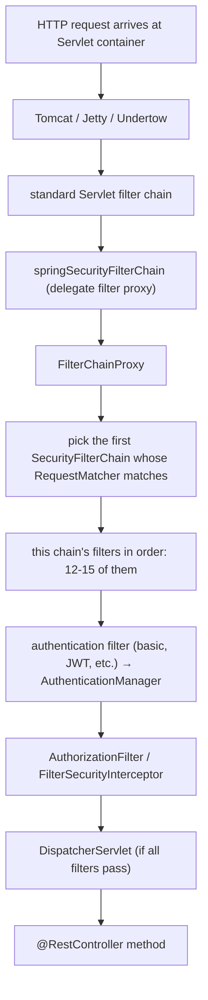
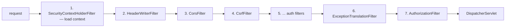
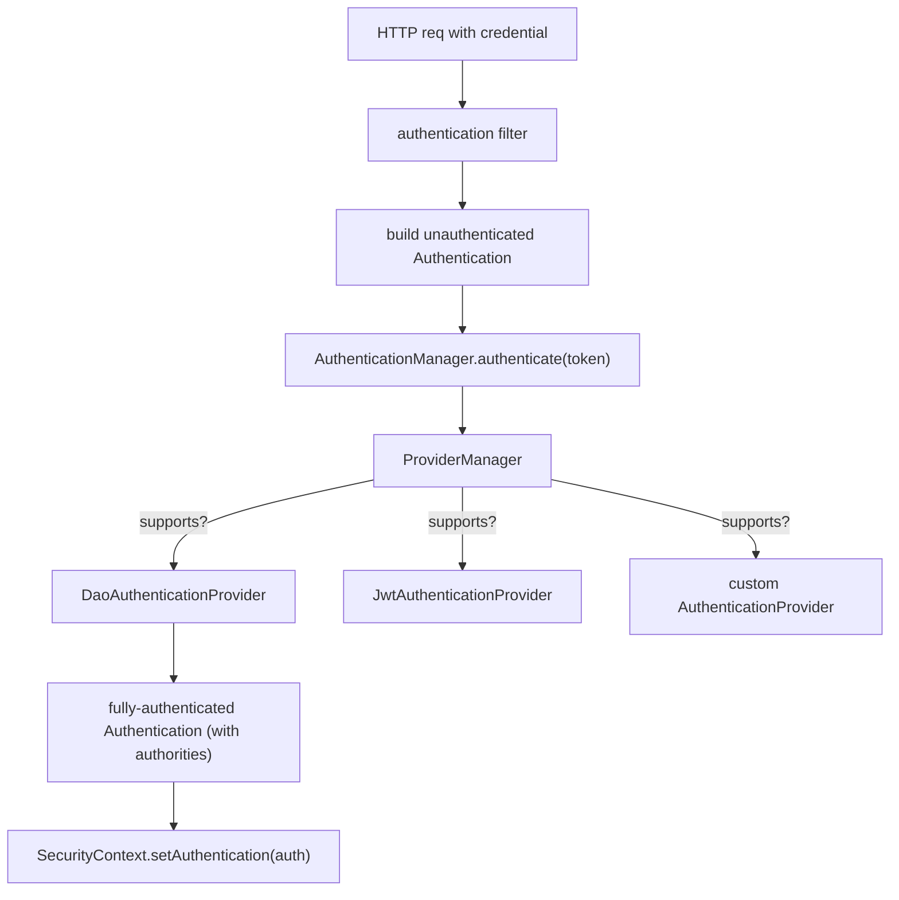

# Spring Security (authentication & authorization)

Every HTTP request that reaches your backend must answer two questions: **who is making this request** (authentication) and **are they allowed to do this** (authorization). Spring Security is the framework that wires both questions into the request pipeline, with battle-tested implementations for every standard mechanism — HTTP Basic, form login, OAuth2 / OIDC, JWT bearer tokens, SAML, X.509 certificates, API keys, remember-me cookies — and a flexible authorization layer (URL-level, method-level, attribute-based). It is the largest and most-feature-dense module in the Spring ecosystem, the most-changed across versions (Spring Security 5 → 6 deprecated a lot), and the most-misconfigured in production (almost every CVE-classified Java vulnerability in the last decade involved a misconfigured security filter).

A senior Java engineer needs the *mental model* of how Spring Security works (the **filter chain**, the **authentication manager**, the **security context**), the **vocabulary** for the standard mechanisms, and the **modern (Spring Security 6) configuration style** (`SecurityFilterChain` bean instead of the deprecated `WebSecurityConfigurerAdapter`). The CVE history is unkind to teams who guessed.

This topic is the **foundational** security topic in C01. The deep treatment of OAuth2 / OIDC / JWT integration is in T15; method-level security in T16; this topic anchors the model and the most-used patterns.

The depth-bar this topic clears: at the **language layer**, every standard concept (`SecurityFilterChain`, `AuthenticationManager`, `AuthenticationProvider`, `UserDetailsService`, `GrantedAuthority`, `PasswordEncoder`, `SecurityContext`), the new `authorizeHttpRequests` DSL, `requestMatchers`, password encoders, CSRF and CORS configuration, security headers. At the **memory layer**, the filter chain itself — Spring's `FilterChainProxy` wraps a list of (typically 10–15) Servlet `Filter`s, each ~200 bytes; the `SecurityContext` is a `ThreadLocal` (~80 bytes per active request thread); the cost of a typical request adds ~50–200 µs of security overhead. At the **architecture layer** — the heart — **the request lifecycle through Spring Security**, the `AuthenticationManager`/`AuthenticationProvider` dispatch, the password-encoder upgrade path, **how the SecurityContext propagates** across threads (and breaks in async/reactive code without explicit help), and the **principle of layered defense** — authentication, authorization, CSRF, headers, rate limiting — composed correctly.

> [!NOTE]
> Prerequisites: T01–T13. Particularly the Filter chain from T10 (Spring Security is *just* a `Filter`), AOP from T05 (method-level security is AOP), and SpEL from T06 (`@PreAuthorize` uses it).

## The Top-Level Architecture

Spring Security is, at its core, **a Servlet filter** (`springSecurityFilterChain`) inserted into the application's filter chain. That filter delegates to **`FilterChainProxy`**, which holds an ordered list of `SecurityFilterChain` beans. Each `SecurityFilterChain` matches a subset of requests (by URL pattern) and runs its own chain of Spring Security `Filter`s on the matched requests.



Each `SecurityFilterChain` is independent. A typical service has one chain for `/api/**` (token-auth) and one for `/admin/**` (form-login + tighter rules) — two `@Bean SecurityFilterChain`s.

## A Modern `SecurityFilterChain` (Spring Security 6 Style)

```java
@Configuration
@EnableWebSecurity
public class SecurityConfig {

    @Bean
    public SecurityFilterChain apiFilterChain(HttpSecurity http) throws Exception {
        http
            .securityMatcher("/api/**")
            .authorizeHttpRequests(auth -> auth
                .requestMatchers("/api/public/**").permitAll()
                .requestMatchers("/api/admin/**").hasRole("ADMIN")
                .anyRequest().authenticated()
            )
            .oauth2ResourceServer(oauth -> oauth.jwt(Customizer.withDefaults()))
            .sessionManagement(s -> s.sessionCreationPolicy(SessionCreationPolicy.STATELESS))
            .csrf(CsrfConfigurer::disable)
            .cors(Customizer.withDefaults())
            .exceptionHandling(e -> e
                .authenticationEntryPoint(new BearerTokenAuthenticationEntryPoint())
                .accessDeniedHandler(new BearerTokenAccessDeniedHandler())
            );
        return http.build();
    }

    @Bean
    public PasswordEncoder passwordEncoder() {
        return PasswordEncoderFactories.createDelegatingPasswordEncoder();
    }
}
```

Lots happening; let us go through it.

- `@EnableWebSecurity` — enables Spring Security's web infrastructure.
- `securityMatcher("/api/**")` — this `SecurityFilterChain` only handles `/api/**` requests; everything else falls through to other chains (or is unprotected).
- `authorizeHttpRequests(...)` — the URL-based authorization rules; first match wins.
- `oauth2ResourceServer(...jwt(...))` — accept JWT bearer tokens from `Authorization: Bearer ...` headers; validate per spec. T15 covers JWT in depth.
- `sessionManagement(STATELESS)` — no HTTP session; every request must carry its own auth. Standard for REST APIs.
- `csrf().disable()` — CSRF protection makes no sense for stateless token APIs (the attack relies on browser-side session cookies). Enable for form-login.
- `cors()` — CORS configuration (separate `CorsConfigurationSource` bean).
- `exceptionHandling` — what to do on auth failure: return 401 vs redirect; access-denied responder.

`http.build()` returns the configured `SecurityFilterChain`.

## The Filter Chain — What Spring Security Adds

For the default Boot configuration, the filter chain has ~15 filters:

| # | Filter | Job |
|---|--------|-----|
| 1 | `DisableEncodeUrlFilter` | strip `;jsessionid` from URL (CVE prevention) |
| 2 | `WebAsyncManagerIntegrationFilter` | propagate `SecurityContext` to async dispatch |
| 3 | `SecurityContextHolderFilter` | load `SecurityContext` from the repository at request start; clear at end |
| 4 | `HeaderWriterFilter` | write security headers (XFO, HSTS, CSP, …) |
| 5 | `CorsFilter` | handle CORS preflight + headers |
| 6 | `CsrfFilter` | validate CSRF token on state-changing requests |
| 7 | `LogoutFilter` | handle `POST /logout` |
| 8 | `OAuth2AuthorizationRequestRedirectFilter` | start OAuth2 login flow |
| 9 | `OAuth2LoginAuthenticationFilter` | receive OAuth2 callback |
| 10 | `OAuth2AuthorizationCodeGrantFilter` | OAuth2 client code grant |
| 11 | `BasicAuthenticationFilter` | HTTP Basic |
| 12 | `RequestCacheAwareFilter` | replay original request after auth |
| 13 | `SecurityContextHolderAwareRequestFilter` | wrap `HttpServletRequest` with security-aware methods |
| 14 | `AnonymousAuthenticationFilter` | install anonymous identity if no auth |
| 15 | `BearerTokenAuthenticationFilter` | JWT / opaque bearer token |
| 16 | `ExceptionTranslationFilter` | catch `AccessDeniedException` / `AuthenticationException` → 401 / 403 |
| 17 | `AuthorizationFilter` | run the `authorizeHttpRequests` rules |

(Not all are present at once; the set depends on what you enable.) Each is a normal `Filter` that calls `chain.doFilter(req, resp)` to continue or short-circuits with a response.



## Authentication — From Credential to `Authentication` Object

**`Authentication`** is the interface that carries identity:

```java
public interface Authentication {
    Object getPrincipal();          // typically a UserDetails or a String username
    Object getCredentials();        // password (cleared after auth) or null
    Collection<? extends GrantedAuthority> getAuthorities();   // roles / permissions
    boolean isAuthenticated();
    Object getDetails();            // request metadata (IP, etc.)
}
```

The lifecycle:

1. An **authentication filter** (e.g., `BasicAuthenticationFilter`) extracts the credential from the request.
2. It builds an *unauthenticated* `Authentication` (a `UsernamePasswordAuthenticationToken` with `isAuthenticated()=false`).
3. It calls `AuthenticationManager.authenticate(token)`.
4. `ProviderManager` (the default `AuthenticationManager`) tries each `AuthenticationProvider` until one accepts the token.
5. The provider validates the credential (lookup user, verify password, check JWT signature, …) and returns a **fully-authenticated** `Authentication` (with authorities, `isAuthenticated()=true`).
6. The filter stores it in the `SecurityContext`.



### `AuthenticationProvider`

```java
public interface AuthenticationProvider {
    Authentication authenticate(Authentication auth) throws AuthenticationException;
    boolean supports(Class<?> authClass);
}
```

The most common is `DaoAuthenticationProvider`, which:

1. Calls `UserDetailsService.loadUserByUsername(name)` → `UserDetails`.
2. Compares the stored password hash with the submitted password via `PasswordEncoder.matches(raw, encoded)`.
3. On match, returns a `UsernamePasswordAuthenticationToken` populated with the user's authorities.
4. On miss, throws `BadCredentialsException`.

### `UserDetailsService`

The application-supplied bean that knows how to look up a user. Implementations:

- **`InMemoryUserDetailsManager`** — hard-coded users (tests, demos).
- **`JdbcUserDetailsManager`** — Spring-supplied SQL-based.
- **Your own** — a `@Component implements UserDetailsService` that queries your DB.

```java
@Component
public class JpaUserDetailsService implements UserDetailsService {

    private final UserRepository users;
    public JpaUserDetailsService(UserRepository users) { this.users = users; }

    @Override public UserDetails loadUserByUsername(String username) {
        User u = users.findByEmail(username)
            .orElseThrow(() -> new UsernameNotFoundException(username));
        return org.springframework.security.core.userdetails.User
            .withUsername(u.getEmail())
            .password(u.getPasswordHash())
            .authorities(u.getRoles().stream()
                .map(r -> new SimpleGrantedAuthority("ROLE_" + r))
                .toList())
            .build();
    }
}
```

Two conventions:

- **`UserDetailsService` is for username+password flows only.** OAuth2 / JWT have their own provider chain.
- **Authorities for roles use the `ROLE_` prefix.** `hasRole("ADMIN")` matches authority `ROLE_ADMIN`. `hasAuthority("foo")` does an exact-string match.

## `SecurityContext` — The Per-Request Identity Store

`SecurityContextHolder` is a static facade over a `ThreadLocal<SecurityContext>`:

```java
SecurityContext ctx = SecurityContextHolder.getContext();
Authentication auth = ctx.getAuthentication();
String username = auth.getName();
```

The strategy (`THREAD_LOCAL` by default) is set at startup. Other strategies:

- `INHERITABLE_THREAD_LOCAL` — child threads inherit the context. Useful when spawning threads manually.
- `GLOBAL` — one context for the whole JVM. Rarely useful; concurrent requests would step on each other.

**Lifecycle:** `SecurityContextHolderFilter` (first in chain) loads the context from a `SecurityContextRepository` (`HttpSessionSecurityContextRepository` for session-based; `NullSecurityContextRepository` for stateless) and stashes it in `ThreadLocal`. The last filter (in the wrap-up) clears the `ThreadLocal` to prevent leaks across requests sharing the same worker thread.

### The Context In Async / Reactive Code

`ThreadLocal` is per-thread. The moment your code hops to a different thread (a `CompletableFuture.runAsync`, a Reactor `Mono`, an `@Async` method, a `Callable` that Tomcat runs on the async executor), the `SecurityContext` **does not follow** by default.

Three solutions:

- **`DelegatingSecurityContextRunnable` / `DelegatingSecurityContextCallable`** — wrap the work so it propagates context.
- **`DelegatingSecurityContextExecutor`** — wrap an executor so every task it runs gets the context.
- **Spring's auto-wiring of `@Async` and Tomcat async dispatch** — `WebAsyncManagerIntegrationFilter` is in the default chain and handles `Callable` / `DeferredResult` propagation. `@Async` requires `setSecurityContextStrategy(MODE_INHERITABLETHREADLOCAL)` *or* explicit delegation.

For WebFlux: the security context is not in `ThreadLocal` at all; it lives on the reactive `Context` and is accessed via `ReactiveSecurityContextHolder.getContext()`. Conceptually parallel; mechanically different.

## Password Encoders — Storage Hygiene

**Never store plaintext passwords. Never use unsalted hash (MD5, SHA-1, even SHA-256). Use a slow, salted, modern algorithm.**

| Encoder | Algorithm | Speed (work factor) | When |
|---------|-----------|--------------------:|------|
| `BCryptPasswordEncoder` | bcrypt | 10–14 rounds → 50–250 ms | the universal default |
| `Argon2PasswordEncoder` | argon2id | tunable | the preferred modern default (more side-channel resistant) |
| `SCryptPasswordEncoder` | scrypt | memory-hard | when you need memory-hard against ASIC attacks |
| `Pbkdf2PasswordEncoder` | PBKDF2 | tunable | FIPS-compliant environments |
| `NoOpPasswordEncoder` | plain | instant | **only for tests** — fails at startup in modern Spring |
| `LdapShaPasswordEncoder`, `MessageDigestPasswordEncoder` | SHA family | instant | **deprecated** — never new code |

The work-factor trade-off: higher = more secure, slower = limits brute-force *and* hurts your login latency. Bcrypt 12 ≈ 250 ms (good); 10 ≈ 60 ms (acceptable). Tune to your tolerance — login is rare and slow is fine.

### `DelegatingPasswordEncoder` — Upgrades Without Breaking Old Passwords

Real systems accumulate password hashes over years; an algorithm change means re-hashing on next login. Spring's `DelegatingPasswordEncoder` stores the algorithm prefix in the hash string:

```
{bcrypt}$2a$10$abc...
{argon2}$argon2id$v=19$m=16384,t=2,p=1...
```

The encoder reads the prefix, picks the right delegate, verifies. New hashes use the **default** (the first delegate). Old hashes still work. As users log in, you can transparently re-hash to the new algorithm.

```java
@Bean
public PasswordEncoder passwordEncoder() {
    return PasswordEncoderFactories.createDelegatingPasswordEncoder();
    // default = bcrypt; recognizes older formats
}
```

## Authorization — URL-Level

The new (Spring Security 6) DSL is `authorizeHttpRequests`. Rules are checked top-to-bottom; first match wins; `anyRequest()` is the fallback.

```java
.authorizeHttpRequests(auth -> auth
    .requestMatchers("/public/**", "/health").permitAll()
    .requestMatchers("/admin/**").hasRole("ADMIN")
    .requestMatchers(HttpMethod.POST, "/api/orders/**").hasAuthority("ORDER_WRITE")
    .requestMatchers(HttpMethod.GET, "/api/**").hasAnyRole("USER", "ADMIN")
    .requestMatchers(EndpointRequest.toAnyEndpoint()).hasRole("ADMIN")
    .anyRequest().authenticated()
)
```

Matchers (`requestMatchers`):

- String pattern (`"/api/**"`)
- HTTP-method + pattern (`HttpMethod.POST, "/api/orders/**"`)
- `RequestMatcher` (custom — e.g., `EndpointRequest.toAnyEndpoint()` for Actuator)

Authorities:

- `permitAll()` / `denyAll()`
- `authenticated()` / `anonymous()` / `fullyAuthenticated()` (not remember-me)
- `hasRole("X")` / `hasAnyRole(...)` (prepends `ROLE_`)
- `hasAuthority("X")` / `hasAnyAuthority(...)` (exact match)
- `access(AuthorizationManager)` — custom

### Custom `AuthorizationManager`

For request-aware authorization (the user must be the owner of the resource being requested):

```java
.requestMatchers("/api/orders/{id}/**")
    .access((auth, request) -> {
        String orderId = request.getVariables().get("id");
        boolean owner = orderService.isOwnedBy(orderId, auth.get().getName());
        return new AuthorizationDecision(owner);
    })
```

Or method-level (next section / T16).

## CSRF — Cross-Site Request Forgery

The CSRF attack: an attacker tricks the user's browser (which has your session cookie) into making a state-changing request to your API. Spring's `CsrfFilter` requires a server-issued token on state-changing requests (`POST`, `PUT`, `DELETE`, `PATCH`).

**Enable for**: form-login (browser session cookie + state-changing requests).
**Disable for**: stateless token-auth APIs (no session cookie → no CSRF target).

```java
// stateless API
.csrf(CsrfConfigurer::disable);

// form-login app with cookies
.csrf(csrf -> csrf
    .csrfTokenRepository(CookieCsrfTokenRepository.withHttpOnlyFalse())
    .csrfTokenRequestHandler(new CsrfTokenRequestAttributeHandler())
);
```

`CookieCsrfTokenRepository` sets the token in a cookie the browser's JavaScript can read; the client echoes it in a header on every state-changing request. The filter checks: cookie value = header value → pass.

## Security Headers

`HeaderWriterFilter` writes browser-protection headers by default:

| Header | Default | Purpose |
|--------|---------|---------|
| `X-Content-Type-Options: nosniff` | yes | block MIME-type sniffing |
| `X-Frame-Options: DENY` | yes | prevent clickjacking |
| `X-XSS-Protection: 0` | yes (Spring Sec 5.5+) | turn off legacy XSS filter (it caused issues) |
| `Cache-Control: no-cache, no-store, max-age=0, must-revalidate` | yes (on protected endpoints) | prevent caching sensitive responses |
| `Pragma: no-cache` | yes | legacy cache control |
| `Strict-Transport-Security: max-age=31536000; includeSubDomains` | yes (HTTPS only) | force HTTPS |
| `Content-Security-Policy` | **no** (set manually) | XSS hardening |
| `Referrer-Policy` | **no** (set manually) | privacy |

Set CSP and Referrer-Policy:

```java
.headers(h -> h
    .contentSecurityPolicy(csp -> csp.policyDirectives(
        "default-src 'self'; script-src 'self' 'unsafe-inline'; style-src 'self' 'unsafe-inline'"))
    .referrerPolicy(r -> r.policy(STRICT_ORIGIN_WHEN_CROSS_ORIGIN))
);
```

## Method-Level Security

`@EnableMethodSecurity` (Spring Security 6+; replaces `@EnableGlobalMethodSecurity`) enables `@PreAuthorize` / `@PostAuthorize` / `@Secured` / `@RolesAllowed`:

```java
@Configuration
@EnableMethodSecurity
public class MethodSecurityConfig { }

@Service
public class OrderService {

    @PreAuthorize("hasRole('ADMIN') or #order.owner == authentication.name")
    public Order place(Order order) { ... }

    @PostAuthorize("returnObject.owner == authentication.name")
    public Order fetch(long id) { ... }

    @Secured("ROLE_ADMIN")
    public void deleteAll() { ... }
}
```

Implementation: an `AuthorizationManagerBeforeMethodInterceptor` (an AOP advisor) wraps every `@PreAuthorize` method; the interceptor evaluates the SpEL (T06) and either calls through or throws `AccessDeniedException`. The same `@RestControllerAdvice` (T12) catches it → 403.

Covered deeper in T16.

## Session Management

For session-based apps:

```java
.sessionManagement(s -> s
    .sessionCreationPolicy(SessionCreationPolicy.IF_REQUIRED)   // or NEVER, STATELESS, ALWAYS
    .sessionFixation().migrateSession()                        // CSRF defense
    .maximumSessions(1)                                         // prevent concurrent logins
    .maxSessionsPreventsLogin(false)                            // newer login kicks out older
    .sessionRegistry(new SessionRegistryImpl())
)
```

- **`STATELESS`** for token APIs.
- **`IF_REQUIRED`** (default) for browser apps.
- **`NEVER`** lets Spring use sessions if they exist but never create one.

Session fixation prevention rotates the session id on login — defeats a class of pre-authentication attacks.

## A Realistic Multi-Chain Configuration

```java
@Configuration
@EnableWebSecurity
@EnableMethodSecurity
public class SecurityConfig {

    @Bean @Order(1)
    public SecurityFilterChain actuatorChain(HttpSecurity http) throws Exception {
        return http
            .securityMatcher(EndpointRequest.toAnyEndpoint())
            .authorizeHttpRequests(auth -> auth
                .requestMatchers(EndpointRequest.to("health", "info")).permitAll()
                .anyRequest().hasRole("ADMIN")
            )
            .httpBasic(Customizer.withDefaults())
            .csrf(CsrfConfigurer::disable)
            .build();
    }

    @Bean @Order(2)
    public SecurityFilterChain apiChain(HttpSecurity http) throws Exception {
        return http
            .securityMatcher("/api/**")
            .authorizeHttpRequests(auth -> auth
                .requestMatchers("/api/public/**").permitAll()
                .anyRequest().authenticated()
            )
            .oauth2ResourceServer(o -> o.jwt(Customizer.withDefaults()))
            .sessionManagement(s -> s.sessionCreationPolicy(STATELESS))
            .csrf(CsrfConfigurer::disable)
            .build();
    }

    @Bean @Order(3)
    public SecurityFilterChain webChain(HttpSecurity http) throws Exception {
        return http
            .authorizeHttpRequests(auth -> auth
                .requestMatchers("/static/**", "/login", "/register").permitAll()
                .anyRequest().authenticated()
            )
            .formLogin(form -> form.loginPage("/login").defaultSuccessUrl("/dashboard"))
            .logout(LogoutConfigurer::permitAll)
            .csrf(Customizer.withDefaults())
            .build();
    }
}
```

Three chains — Actuator (basic-auth admin), API (JWT, stateless), web (form-login, sessions). Each chain matches a different URL prefix; chain order determines which is consulted first.

## Common Pitfalls

> [!WARNING]
> **Mixing `requestMatchers` ordering.** `anyRequest()` must be the *last* rule. Putting `permitAll()` after `authenticated()` with overlapping patterns produces order-sensitive bugs.

> [!WARNING]
> **`hasRole("ADMIN")` vs authority `ROLE_ADMIN`.** `hasRole` prepends `ROLE_`. If your authorities are stored *with* the prefix already, use `hasAuthority` to avoid the double-prefix bug.

> [!WARNING]
> **Disabling CSRF on a session-cookie-based API.** Even partial. The attack still works if any state-changing endpoint relies on the session cookie. If you need stateless on some endpoints, use *both* JWT (header) and CSRF token for the cookie-based ones, or split into separate filter chains.

> [!WARNING]
> **`UserDetailsService` returning the user object without `ROLE_` prefix.** `hasRole("USER")` won't match because `hasRole` adds `ROLE_`. Either prefix in `UserDetailsService` or switch to `hasAuthority`.

> [!WARNING]
> **`SecurityContext` empty in async code.** Tomcat async dispatch propagates with `WebAsyncManagerIntegrationFilter`. `@Async` does NOT propagate by default — wire `DelegatingSecurityContextAsyncTaskExecutor`.

> [!WARNING]
> **Caching authenticated responses.** Spring Security sets `Cache-Control: no-store` by default for protected paths. Overriding this carelessly leaks per-user data into shared caches.

> [!WARNING]
> **`bcrypt` rounds too low (≤ 8).** Brute-forceable in minutes on modern GPUs. Use ≥ 10; 12 is the modern default.

> [!WARNING]
> **`AuthenticationManager` declared as `@Bean` but not used.** Some legacy guides show this; in Spring Security 6 the `AuthenticationManager` is auto-wired from the `HttpSecurity` config. Re-exposing it as a bean is rarely needed.

## Practice

1. Build a `SecurityFilterChain` for `/api/**` that requires authentication. Use HTTP Basic for testing. Verify with curl that an authenticated request succeeds and unauthenticated returns 401.
2. Implement a custom `UserDetailsService` backed by a JPA repository. Use `BCryptPasswordEncoder` for hashes. Register two users with different roles. Verify role-based access.
3. Add a second `SecurityFilterChain` (with `@Order(1)`) for `/admin/**` requiring `ROLE_ADMIN`. Verify URL-based authorization isolates the chains.
4. Enable `@EnableMethodSecurity`. Add `@PreAuthorize("hasRole('ADMIN')")` to a service method. Verify access from a non-admin throws `AccessDeniedException` and gets translated to 403 by your `@ControllerAdvice`.
5. Set the strict CSP header and a stricter Referrer-Policy. Test with browser dev tools that the headers are present.
6. Use `DelegatingSecurityContextAsyncTaskExecutor` for `@Async`. Confirm that an `@Async` method called from a controller can read the `SecurityContext`.
7. Implement password upgrade: on successful login with a low-round bcrypt hash, re-hash with the modern default and persist. Verify subsequent logins use the new hash.
8. Set `bcrypt` work factor to 13; measure login latency. Drop to 10; compare. Choose a value based on your latency budget.

## Recap

You should now be able to:

- Explain Spring Security's filter-chain architecture: `springSecurityFilterChain` → `FilterChainProxy` → matched `SecurityFilterChain` → ordered list of filters.
- Write a `SecurityFilterChain` bean using the Spring Security 6 DSL (`authorizeHttpRequests`, `securityMatcher`, `sessionManagement`, `csrf`, `cors`, `exceptionHandling`).
- Walk the authentication lifecycle: filter → unauth `Authentication` token → `AuthenticationManager.authenticate` → `ProviderManager` → matching `AuthenticationProvider` → fully-auth token → `SecurityContext`.
- Implement `UserDetailsService`, `AuthenticationProvider`, and choose between `DaoAuthenticationProvider` and custom providers.
- Use modern `PasswordEncoder` (`BCryptPasswordEncoder`, `Argon2PasswordEncoder`, `DelegatingPasswordEncoder`) and explain the work-factor / latency trade-off.
- Configure URL-level authorization with `authorizeHttpRequests`, `requestMatchers`, `hasRole` vs `hasAuthority`, and write custom `AuthorizationManager` for request-aware checks.
- Manage `SecurityContext` propagation in sync code (default `ThreadLocal`), async code (`WebAsyncManagerIntegrationFilter` for Tomcat async; `DelegatingSecurityContextAsyncTaskExecutor` for `@Async`), and reactive (`ReactiveSecurityContextHolder`).
- Choose CSRF, CORS, and security-header policies based on the actual threat model — enable for browser sessions, disable for stateless token APIs.
- Use `@EnableMethodSecurity` + `@PreAuthorize` / `@PostAuthorize` / `@Secured` for declarative method-level authorization.
- Compose multiple `SecurityFilterChain`s for different URL spaces in one app.

## Next

Continue to [OAuth2 / OpenID Connect / JWT with Spring Security](./T15-oauth2-openid-connect-jwt-with-spring-security.md) for the deep treatment of OAuth2 flows (authorization code, client credentials, refresh, PKCE), OIDC ID-token validation, JWT signing/validation, and Spring Security's resource-server / authorization-server modules.
