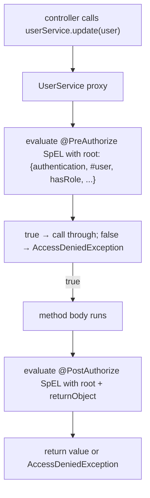
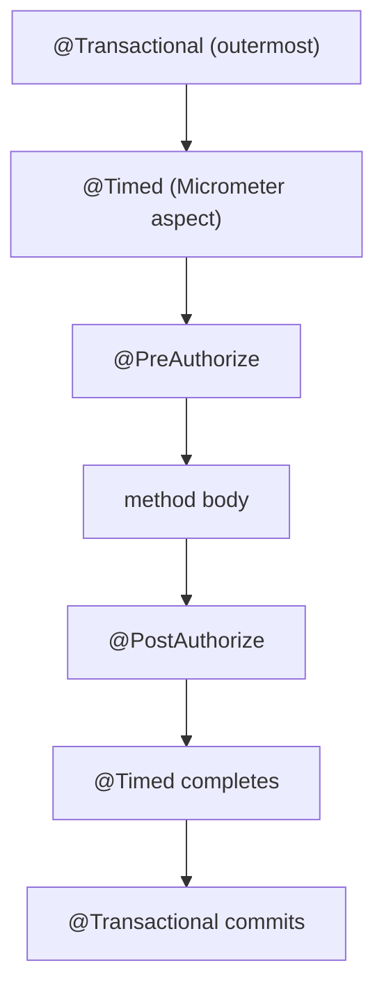

# Method-Level Security

URL-level authorization (T14's `authorizeHttpRequests`) is fine when the rule is "this URL pattern requires this role" — coarse, declarative, easy to grep. The moment authorization depends on *what is being requested* — the document's owner must equal the caller; an admin can edit any account but a manager can edit only their region's accounts; a `@Cacheable` lookup must skip the cache for accounts the caller does not own — URL-level authorization runs out. **Method-level security** is the lever you reach for: SpEL-driven checks on individual methods, evaluated with the *current* method arguments and (optionally) the return value, applied at any layer of your application.

The mechanism is AOP (T05): `@EnableMethodSecurity` registers an `AuthorizationManagerBeforeMethodInterceptor` that wraps every `@PreAuthorize`-annotated method. On every call the interceptor evaluates the SpEL expression against a security-aware root object (the `MethodSecurityExpressionRoot` exposing `authentication`, `principal`, `hasRole(...)`, `hasPermission(...)`, the method arguments by name). The expression returns true → call through; false → throw `AccessDeniedException`. **Once you understand `@PreAuthorize`, the rest of method-level security is variations** — `@PostAuthorize` runs after the method returns, `@PreFilter` / `@PostFilter` filter collections, `@Secured` and `@RolesAllowed` are simpler subsets.

The depth-bar this topic clears: at the **language layer**, `@EnableMethodSecurity` configuration, every annotation (`@PreAuthorize`, `@PostAuthorize`, `@PreFilter`, `@PostFilter`, `@Secured`, `@RolesAllowed`, `@DenyAll`, `@PermitAll`), the SpEL operators available in the security root (`hasRole`, `hasAuthority`, `hasPermission`, `principal`, `authentication`, parameter access). At the **memory layer**, the AOP-wrapped bean (CGLIB proxy ~192 B + interceptor list), the SpEL parser cache (one parsed expression per method, ~1 KB each), the per-call overhead (~5–20 µs interpreted; ~200 ns compiled). At the **architecture layer** — the heart — **how `@PreAuthorize` composes with controller security** (URL-level coarse-grain → method-level fine-grain), how `PermissionEvaluator` cleanly extracts domain-permission logic from SpEL strings, and the **self-invocation trap** carried over from T05 (proxy-based ⇒ direct `this.foo()` bypasses the check).

> [!NOTE]
> Prerequisites: [Spring Security (T14)](./T14-spring-security-authentication-and-authorization.md) — the filter chain and `SecurityContext`. [SpEL (T06)](./T06-spring-expression-language-spel.md) — the expression language. [Spring AOP (T05)](./T05-spring-aop.md) — method-level security is implemented as AOP.

## Enabling

```java
@Configuration
@EnableMethodSecurity
public class MethodSecurityConfig { }
```

`@EnableMethodSecurity` (Spring Security 6+; replaces the deprecated `@EnableGlobalMethodSecurity`) defaults to:

- `prePostEnabled = true` — `@PreAuthorize` and `@PostAuthorize` active.
- `securedEnabled = false` — `@Secured` disabled by default.
- `jsr250Enabled = false` — `@RolesAllowed` / `@PermitAll` / `@DenyAll` disabled.
- `mode = ADVICE_MODE.PROXY` — uses AOP proxy (not AspectJ weaving).

Toggle as needed:

```java
@EnableMethodSecurity(securedEnabled = true, jsr250Enabled = true)
```

## The Five Annotations

### `@PreAuthorize`

Evaluated **before** the method runs. The most-used method security annotation.

```java
@Service
public class UserService {

    @PreAuthorize("hasRole('ADMIN')")
    public void deleteAll() { ... }

    @PreAuthorize("hasRole('ADMIN') or #user.id == authentication.principal.id")
    public User update(User user) { ... }

    @PreAuthorize("hasAuthority('SCOPE_orders:write')")
    public Order place(Order order) { ... }

    @PreAuthorize("@accountChecker.canEdit(authentication, #accountId)")
    public Account edit(long accountId, AccountUpdate u) { ... }
}
```

If the SpEL returns false → `AccessDeniedException`. Translate to 403 in your `@RestControllerAdvice` (T12).

### `@PostAuthorize`

Evaluated **after** the method returns. Useful when you cannot decide until the result is known:

```java
@PostAuthorize("returnObject.owner == authentication.name")
public Document fetch(long id) { ... }
```

If false, the method's side effects have already happened (the DB call ran); only the return value is suppressed. For pure-read operations this is fine; for any operation with side effects, prefer `@PreAuthorize` with the necessary lookups.

### `@PreFilter`

Filters a *collection* argument before the method sees it:

```java
@PreFilter("filterObject.owner == authentication.name")
public void deleteAll(List<Document> docs) { ... }
```

`filterObject` is the current element. The collection passed to the method contains only elements satisfying the SpEL. Mutates the caller's collection in place — be aware.

### `@PostFilter`

Filters a returned collection:

```java
@PostFilter("filterObject.visibility == 'PUBLIC' or filterObject.owner == authentication.name")
public List<Document> list() { ... }
```

Returned list contains only elements the caller can see. **For large lists this is expensive** — N SpEL evaluations. Push filtering to the database when feasible.

### `@Secured` and `@RolesAllowed`

Simpler, role-only checks (no SpEL):

```java
@Secured({"ROLE_ADMIN", "ROLE_AUDITOR"})
public AuditLog readAudit() { ... }

@RolesAllowed("ADMIN")    // JSR-250; no ROLE_ prefix expected by some implementations
public void purge() { ... }
```

`@Secured` checks each authority literally (no `hasRole`-style prefix logic). `@RolesAllowed` (JSR-250) is portable across JEE / Jakarta implementations. Both are rarely used in new Spring code — `@PreAuthorize` is more uniform.

### `@DenyAll` / `@PermitAll`

JSR-250 markers. `@DenyAll` blocks the method unconditionally (useful for "feature toggled off"); `@PermitAll` lets anyone through (useful to opt out a single method in an otherwise-locked-down class).

## The SpEL Root — What's Available

The `MethodSecurityExpressionRoot` exposes:

| Expression | Returns |
|-----------|---------|
| `authentication` | the current `Authentication` |
| `principal` | the `Authentication.getPrincipal()` |
| `hasRole('ADMIN')` | true if user has `ROLE_ADMIN` |
| `hasAnyRole('ADMIN', 'MANAGER')` | true if any |
| `hasAuthority('SCOPE_orders:write')` | exact-match authority |
| `hasAnyAuthority(...)` | any of |
| `permitAll()` | always true |
| `denyAll()` | always false |
| `isAuthenticated()` | not anonymous |
| `isFullyAuthenticated()` | not remembered (i.e., real credentials this session) |
| `isAnonymous()` / `isRememberMe()` | as named |
| `hasPermission(targetId, type, perm)` | delegate to `PermissionEvaluator` |

Plus method parameters by name (compile with `-parameters`):

```java
@PreAuthorize("#order.customerId == authentication.name")
public Order place(Order order) { ... }
```

`#order` refers to the parameter; `.customerId` is property access; comparison to `authentication.name` (a SpEL navigation into the `Authentication` object).

And in `@PostAuthorize` / `@PostFilter`, `returnObject` / `filterObject` are added.



## `PermissionEvaluator` — Extracting Domain Logic

When SpEL gets long, extract the check into a bean and use `hasPermission`:

```java
@Component
public class DocumentPermissionEvaluator implements PermissionEvaluator {

    private final DocumentService docs;
    public DocumentPermissionEvaluator(DocumentService docs) { this.docs = docs; }

    @Override
    public boolean hasPermission(Authentication auth, Object targetId, Object targetType, Object perm) {
        if (!"Document".equals(targetType)) return false;
        long id = ((Number) targetId).longValue();
        Document doc = docs.find(id).orElse(null);
        if (doc == null) return false;
        return switch ((String) perm) {
            case "READ"  -> doc.isPublic() || doc.getOwner().equals(auth.getName()) || auth.getAuthorities().stream().anyMatch(a -> a.getAuthority().equals("ROLE_ADMIN"));
            case "WRITE" -> doc.getOwner().equals(auth.getName());
            case "DELETE"-> auth.getAuthorities().stream().anyMatch(a -> a.getAuthority().equals("ROLE_ADMIN"));
            default -> false;
        };
    }

    @Override
    public boolean hasPermission(Authentication auth, Serializable target, String targetType, Object perm) {
        return hasPermission(auth, target, (Object) targetType, perm);
    }
}

@Configuration
@EnableMethodSecurity
public class MethodSecurityConfig {
    @Bean
    public MethodSecurityExpressionHandler expressionHandler(DocumentPermissionEvaluator pe) {
        DefaultMethodSecurityExpressionHandler h = new DefaultMethodSecurityExpressionHandler();
        h.setPermissionEvaluator(pe);
        return h;
    }
}
```

Then:

```java
@PreAuthorize("hasPermission(#id, 'Document', 'READ')")
public Document fetch(long id) { ... }

@PreAuthorize("hasPermission(#id, 'Document', 'WRITE')")
public Document update(long id, DocumentUpdate u) { ... }
```

The SpEL stays short and reads like the rule. The actual logic is testable Java — unit tests on `DocumentPermissionEvaluator` cover the permission matrix.

## Custom SpEL Root

For project-specific shorthand, extend `SecurityExpressionRoot`:

```java
public class MyExpressionRoot extends SecurityExpressionRoot
        implements MethodSecurityExpressionOperations {

    private Object filterObject;
    private Object returnObject;
    private Object target;

    public MyExpressionRoot(Authentication auth) { super(auth); }

    public boolean inTenant(String tenant) {
        return getAuthentication().getAuthorities().stream()
            .anyMatch(a -> a.getAuthority().equals("TENANT_" + tenant));
    }

    public boolean ownsAccount(long accountId) {
        // ... lookup
    }

    // implement MethodSecurityExpressionOperations setters/getters
}

public class MyExpressionHandler extends DefaultMethodSecurityExpressionHandler {
    @Override
    public MethodSecurityExpressionOperations createSecurityExpressionRoot(
            Authentication auth, MethodInvocation invocation) {
        MyExpressionRoot root = new MyExpressionRoot(auth);
        root.setPermissionEvaluator(getPermissionEvaluator());
        root.setTrustResolver(getTrustResolver());
        root.setRoleHierarchy(getRoleHierarchy());
        return root;
    }
}
```

Now SpEL can use the custom methods:

```java
@PreAuthorize("inTenant(#tenantId)")
public void doForTenant(String tenantId) { ... }

@PreAuthorize("ownsAccount(#accountId)")
public Account fetch(long accountId) { ... }
```

## Authorization on the Return Value — `@AuthorizeReturnObject`

Spring Security 6.3+ added `@AuthorizeReturnObject` and friends for the case where the return value itself carries authorization rules:

```java
@AuthorizeReturnObject
public Document fetch(long id) { ... }

// Document class:
public class Document {
    @PreAuthorize("hasRole('ADMIN') or @docOwnership.owns(authentication, this.id)")
    public String getSensitiveField() { ... }
}
```

When the controller calls `.getSensitiveField()` on the returned `Document`, the proxy intercepts and re-checks. Useful when the same DTO is returned from many endpoints but some fields are restricted.

## The Order of Execution

If multiple annotations and aspects compose:



The actual outer-to-inner order depends on `@Order` annotations on each advisor; Spring Security's `AuthorizationManagerBeforeMethodInterceptor` defaults to `Ordered.LOWEST_PRECEDENCE - 1` (close to inside). Adjust if you need security to run outside transactions (rare; usually you want tx outside).

## Self-Invocation — The Universal AOP Trap

As with `@Transactional` (T05), `@PreAuthorize` on a method called from another method of the same class **does not run**. The proxy sees the outer call; the inner call goes through `this`, bypassing the interceptor.

Fix: split into two beans, refactor the caller out, or use AspectJ weaving (rare).

> [!WARNING]
> Self-invocation is the single most common method-security bug. Audit your code: any time you see `this.someMethodWithPreAuthorize(...)` from inside the same class, the check is silently skipped.

## Reactive Method Security

Spring Security 5.4+ supports reactive method security under `@EnableReactiveMethodSecurity` for WebFlux apps. The annotations are the same; the interceptor returns a `Mono`/`Flux` instead. `ReactiveSecurityContextHolder.getContext()` is the reactive access point.

## Worked Example — Service Layer Security

```java
@Service
@Transactional
public class OrderService {

    @PreAuthorize("hasAuthority('SCOPE_orders:read') and (#root.this.canRead(authentication, returnObject))")
    public Order load(long id) { ... }

    @PreAuthorize("hasAuthority('SCOPE_orders:write') and @orderPermissions.canPlace(authentication, #req)")
    public Order place(PlaceOrderRequest req) { ... }

    @PreAuthorize("hasAuthority('SCOPE_orders:write') and @orderPermissions.canUpdate(authentication, #id)")
    public Order update(long id, UpdateOrderRequest req) { ... }

    @PreAuthorize("hasRole('ADMIN')")
    public void cancelAll() { ... }
}
```

Authorization is on the **service**, not just the controller. A second controller calling the same service method gets the same checks. Domain-bound permission checks (`@orderPermissions.canPlace`) live in `OrderPermissions` — testable Java, not SpEL strings.

```java
@Component
public class OrderPermissions {

    private final OrderRepository orders;
    public OrderPermissions(OrderRepository orders) { this.orders = orders; }

    public boolean canPlace(Authentication auth, PlaceOrderRequest req) {
        // e.g., the user must own the cart, must be in a tenant with order permissions, ...
        return req.customerId().equals(auth.getName())
            || hasAuthority(auth, "ROLE_SERVICE_ACCOUNT");
    }

    public boolean canUpdate(Authentication auth, long orderId) {
        return orders.findById(orderId)
            .map(o -> o.getCustomerId().equals(auth.getName())
                 || hasAuthority(auth, "ROLE_SUPPORT"))
            .orElse(false);
    }

    private boolean hasAuthority(Authentication auth, String authority) {
        return auth.getAuthorities().stream().anyMatch(a -> a.getAuthority().equals(authority));
    }
}
```

## Performance Considerations

Per-method overhead:

| Operation | Time |
|-----------|------|
| AOP dispatch | ~100 ns (proxy → interceptor) |
| Lookup `@PreAuthorize` annotation cache | ~50 ns |
| Parse SpEL (cached after first call) | ~5–10 µs first time; ~50 ns thereafter |
| Evaluate SpEL with interpreter | ~5–20 µs |
| Evaluate SpEL with compiler (Spring 5.1+) | ~100–200 ns |

For methods called millions of times per second, the SpEL evaluation can dominate. Enable SpEL compilation:

```java
@Bean
public MethodSecurityExpressionHandler expressionHandler() {
    DefaultMethodSecurityExpressionHandler h = new DefaultMethodSecurityExpressionHandler();
    h.setExpressionParser(new SpelExpressionParser(
        new SpelParserConfiguration(SpelCompilerMode.MIXED, null)));
    return h;
}
```

Move heavy lookups (`@orderPermissions.canPlace` that hits the DB) outside the SpEL on hot paths.

## Common Pitfalls

> [!WARNING]
> **`@PreAuthorize` on a private method.** Silently ignored by the proxy. Use `public` (or `protected` if called by subclasses you control).

> [!WARNING]
> **Compiling without `-parameters`.** `#user` becomes `#a0`; the SpEL no longer resolves to your argument.

> [!WARNING]
> **`@PostAuthorize` for methods with side effects.** The mutation already happened by the time you reject. Use `@PreAuthorize` with the data lookup.

> [!WARNING]
> **`@PostFilter` on huge collections.** N SpEL evaluations × per-element cost. Push the filter to the database query.

> [!WARNING]
> **Long SpEL expressions.** After ~80 characters, readability falls off. Extract into a `@Component` and call via `@`-prefix bean reference.

> [!WARNING]
> **Using `hasRole('ROLE_ADMIN')` (with prefix) and your authorities lack the prefix.** `hasRole` adds `ROLE_` itself; `hasRole('ROLE_ADMIN')` checks for `ROLE_ROLE_ADMIN`. Use `hasAuthority('ROLE_ADMIN')` or just `hasRole('ADMIN')`.

> [!WARNING]
> **Method-security check that depends on a request scope but called from `@Async`.** `SecurityContext` does not propagate by default to `@Async` (T14). Configure `DelegatingSecurityContextAsyncTaskExecutor`.

> [!WARNING]
> **Self-invocation.** Same as T05. The most common AOP bug, applied to security.

## Practice

1. Enable `@EnableMethodSecurity`. Add `@PreAuthorize("hasRole('ADMIN')")` to a service method. Call from a non-admin; verify `AccessDeniedException` → 403 via your `@RestControllerAdvice`.
2. Write `@PreAuthorize("#user.id == authentication.principal.id")` and verify the user can edit themselves but not others.
3. Implement a `PermissionEvaluator` for a domain object. Use `hasPermission(#id, 'Document', 'WRITE')`. Verify the matrix works for different users.
4. Extend `SecurityExpressionRoot` with a custom method. Wire via `MethodSecurityExpressionHandler`. Use the new method in `@PreAuthorize`.
5. Try `@PostFilter` on a list of 1000 elements with a non-trivial predicate. Measure the time. Compare to filtering at the DB level.
6. Trigger the self-invocation bug deliberately. Confirm it. Refactor to two beans.
7. Add `DelegatingSecurityContextAsyncTaskExecutor`. Call an `@PreAuthorize`-annotated method from an `@Async` method. Verify the check still runs.
8. Enable SpEL compilation. Benchmark a hot `@PreAuthorize` method before and after.

## Recap

You should now be able to:

- Enable method security with `@EnableMethodSecurity` and choose between `prePostEnabled`, `securedEnabled`, `jsr250Enabled`.
- Use `@PreAuthorize`, `@PostAuthorize`, `@PreFilter`, `@PostFilter`, `@Secured`, `@RolesAllowed`, `@DenyAll`, `@PermitAll` based on whether you need pre/post checks, filtering, or simple role gates.
- Write SpEL expressions that use `authentication`, `principal`, `hasRole`, `hasAuthority`, `hasPermission`, method parameter access, and `returnObject` / `filterObject`.
- Extract domain-permission logic into a `PermissionEvaluator` and call it via `hasPermission` to keep SpEL strings short.
- Extend `SecurityExpressionRoot` with custom methods and wire via `MethodSecurityExpressionHandler`.
- Understand the AOP underpinnings (`AuthorizationManagerBeforeMethodInterceptor`), the self-invocation trap, and how method security composes with `@Transactional` and other aspects.
- Use reactive method security in WebFlux apps with `@EnableReactiveMethodSecurity`.
- Choose `@PreAuthorize` vs `@PostAuthorize` based on whether the rule needs the return value and whether the method has side effects.
- Quantify per-call overhead (~5–20 µs interpreted; ~100 ns compiled) and enable SpEL compilation when needed.
- Avoid the common pitfalls: private-method bypass, missing `-parameters`, side-effects-with-`@PostAuthorize`, huge `@PostFilter` collections, self-invocation.

## Next

Continue to [Spring WebFlux (reactive)](./T17-spring-webflux-reactive.md) for the reactive alternative to Spring MVC — `Mono` / `Flux` return types, the reactive `WebFilter` chain, `R2DBC` for reactive persistence, and how WebFlux compares to MVC + virtual threads in 2026.
