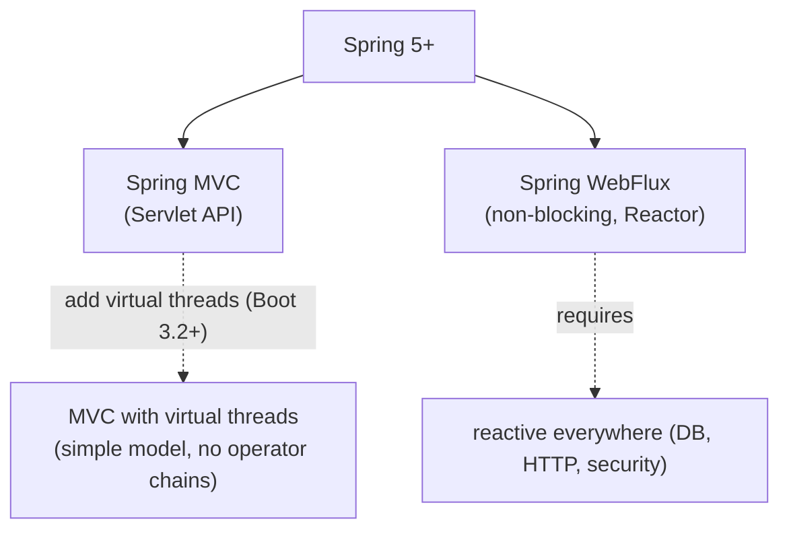
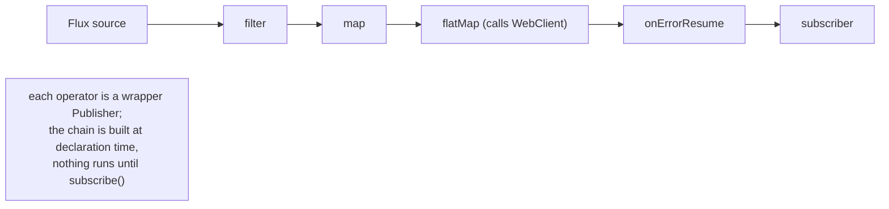
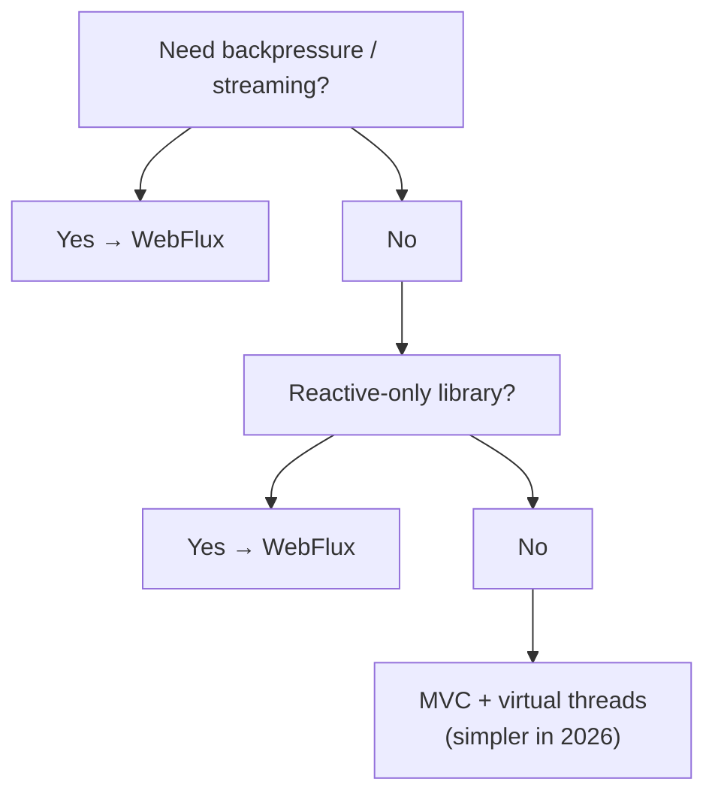

# Spring WebFlux (reactive)

Spring MVC (T10) is built on the *blocking* Servlet API: every request holds a worker thread from receive to response. For I/O-bound services with thousands of concurrent connections, blocking models historically hit a wall — a 200-thread pool serializes everything past 200 in-flight requests, and creating more threads costs ~1 MB of stack each. **Spring WebFlux**, introduced in Spring 5 (2017), is the *non-blocking* alternative: an event-loop runtime (Netty by default) carries thousands of concurrent connections on a handful of threads (one per CPU core), and every operation that *could* block — DB query, HTTP call, disk read — is expressed as an async stream of values (`Mono<T>` for 0..1, `Flux<T>` for 0..N), composed with operators like `map`, `filter`, `flatMap`. The runtime suspends the chain when waiting; the same thread services another request.

For five years (2017–2022) WebFlux was the recommended path for high-concurrency services. **In 2026, that recommendation needs an asterisk.** Java 21 brought **virtual threads** (Project Loom), and Spring Boot 3.2+ wires Tomcat to use them by default with `spring.threads.virtual.enabled=true`. The result: a *blocking* MVC service with virtual threads handles the same millions-of-concurrent-connections workload WebFlux was created for — *without* the operator-graph complexity, *without* the context-propagation gotchas, *without* the steep "everything must be reactive end-to-end" requirement. For most new services in 2026, **MVC + virtual threads** is the simpler answer; WebFlux remains the right tool for **streaming**, **server-sent events**, **WebSockets at scale**, and **functional-style routing** preferences.

This topic teaches WebFlux fully — its architecture, the Reactor types and operators, the controller styles (annotated + functional), reactive Spring Security, R2DBC, schedulers, and explicitly when *not* to use it. A senior engineer in 2026 should know WebFlux thoroughly *and* know that the right answer is sometimes "no, use MVC."

The depth-bar this topic clears: at the **language layer**, `Mono` / `Flux` and their operator catalog, annotated reactive controllers, the `RouterFunction` functional style, `WebClient` (reactive HTTP client), reactive security, R2DBC. At the **memory layer**, the event-loop model — Netty's ~2 EventLoopGroup threads × CPU count, no per-request stack, the **`Subscription`** request-N-elements backpressure model, the per-operator allocation cost. At the **architecture layer** — the heart — the **non-blocking dispatch** through `DispatcherHandler`, how a request flows from `HandlerMapping` → `HandlerAdapter` → controller → `WebFilter` → response without ever blocking the thread; **backpressure** as cooperative flow control; the **context-propagation challenge** (no `ThreadLocal`; use Reactor `Context`); and the **MVC vs WebFlux vs virtual threads** decision matrix for 2026.

> [!NOTE]
> Prerequisites: [Spring MVC (T10)](./T10-spring-mvc-rest-controllers.md) — the imperative model to contrast. [SpEL](./T06-spring-expression-language-spel.md). Familiarity with `CompletableFuture` and async programming concepts. Some `Stream<T>` experience helps the mental model.

## The Two Spring Web Stacks

Spring 5+ ships **both** MVC and WebFlux. They co-exist as separate web stacks; you pick one per app (or have separate apps for each).

| | Spring MVC | Spring WebFlux |
|---|------------|----------------|
| Runtime | Servlet API (Tomcat/Jetty/Undertow) | Netty (default), Undertow, Tomcat 8.5+, Jetty 11+ |
| Threading | one thread per request | event loop + small thread pool |
| Return types | DTO, ResponseEntity, Callable, DeferredResult, ... | `Mono<T>` / `Flux<T>` |
| Annotations | `@RestController`, `@GetMapping`, ... | same annotations + `RouterFunction` alternative |
| HTTP client | `RestTemplate` (deprecated), `RestClient` (Boot 3.2+) | `WebClient` |
| Database | JDBC, JPA | R2DBC, reactive Mongo / Cassandra / Redis |
| Security | filter chain via `SecurityFilterChain` | `SecurityWebFilterChain` |
| Idiomatic with | virtual threads | event-loop runtime |



## Reactor — The Reactive Library

WebFlux is built on **Project Reactor**, Spring's implementation of the [Reactive Streams specification](https://www.reactive-streams.org/). Reactor's core types:

- **`Mono<T>`** — an async source of *0 or 1* value. Think `Optional<CompletableFuture<T>>`.
- **`Flux<T>`** — an async source of *0 to many* values. Think `Stream<CompletableFuture<T>>`.

Both implement `Publisher<T>` (the Reactive Streams interface). Both are **cold** by default — they do nothing until a `Subscriber` subscribes.

```java
Mono<User> user = userRepository.findById(42L);              // returns a Mono; no DB call yet
user.subscribe(u -> System.out.println(u));                  // NOW the DB call happens
```

In Spring controllers you almost never call `subscribe` yourself; the WebFlux runtime subscribes when sending the HTTP response.

### Building Monos and Fluxes

```java
Mono<String> m1 = Mono.just("hello");                                 // immediate value
Mono<String> m2 = Mono.empty();                                       // no value
Mono<String> m3 = Mono.error(new RuntimeException("oops"));            // immediate error
Mono<String> m4 = Mono.fromCallable(() -> heavyComputation());         // lazy compute on subscribe
Mono<String> m5 = Mono.fromSupplier(() -> "x");                       // simpler form
Mono<String> m6 = Mono.fromFuture(completableFuture);                 // bridge from CF
Mono<String> m7 = Mono.defer(() -> Mono.just(currentTime()));         // build a new mono per subscribe

Flux<Integer> f1 = Flux.just(1, 2, 3);
Flux<Integer> f2 = Flux.range(1, 100);
Flux<Long> f3 = Flux.interval(Duration.ofSeconds(1));                  // emit every second
Flux<String> f4 = Flux.fromIterable(List.of("a", "b"));
Flux<String> f5 = Flux.fromStream(Stream.of("a", "b"));
Flux<String> f6 = Flux.create(sink -> { /* emit via sink.next(...) */ });
```

`Mono.fromCallable` wraps a *blocking* call (a JDBC query) — useful when you must mix legacy blocking code into a reactive chain. Pair with `.subscribeOn(Schedulers.boundedElastic())` (next section) so the blocking work runs on an appropriate thread.

### Operators

A small but powerful catalog. The ones you use daily:

**Transform**:

```java
flux.map(x -> x * 2)                                  // sync transformation
flux.flatMap(x -> webClient.get(...).retrieve()...)   // async transformation; flattens N inner Monos/Fluxes
flux.concatMap(x -> innerFlux(x))                     // like flatMap but preserves order, one at a time
flux.switchMap(x -> innerFlux(x))                     // cancels previous inner; useful for "latest only"
```

**Filter**:

```java
flux.filter(x -> x > 10)
flux.take(5)                                          // first 5
flux.takeWhile(x -> x < 10)
flux.skip(2)
flux.distinct()
```

**Combine**:

```java
Flux.merge(f1, f2)                                    // interleave; first-ready wins
Flux.concat(f1, f2)                                   // f1 fully then f2
Mono.zip(m1, m2)                                      // tuple of both when both complete
m1.zipWith(m2, (a, b) -> a + b)                       // combine via function
```

**Error**:

```java
mono.onErrorReturn(defaultValue)
mono.onErrorResume(e -> fallbackMono(e))
mono.onErrorMap(e -> new DomainException(e))
mono.retry(3)
mono.retryWhen(Retry.backoff(3, Duration.ofSeconds(1)))
mono.timeout(Duration.ofSeconds(5))
```

**Side-effect (logging, metrics)**:

```java
mono.doOnNext(x -> log.info("got {}", x))
mono.doOnError(e -> log.error("failed", e))
mono.doOnSubscribe(s -> log.debug("subscribed"))
mono.doFinally(signal -> log.debug("done {}", signal))
```

**Conversion**:

```java
mono.block()                                           // BLOCKING — never in WebFlux runtime
mono.toFuture()                                        // bridge to CompletableFuture
flux.collectList()                                     // Flux<T> → Mono<List<T>>
```



## Reactive Controllers

WebFlux supports two controller styles. The annotated style looks like MVC:

```java
@RestController
@RequestMapping("/api/users")
public class UserController {

    private final UserRepository repo;
    public UserController(UserRepository repo) { this.repo = repo; }

    @GetMapping("/{id}")
    public Mono<UserResponse> get(@PathVariable String id) {
        return repo.findById(id)
            .map(UserResponse::of)
            .switchIfEmpty(Mono.error(new UserNotFoundException(id)));
    }

    @GetMapping
    public Flux<UserResponse> list() {
        return repo.findAll().map(UserResponse::of);
    }

    @PostMapping
    public Mono<UserResponse> create(@RequestBody Mono<CreateUserRequest> req) {
        return req.flatMap(r -> repo.save(new User(r.name(), r.email())))
                  .map(UserResponse::of);
    }
}
```

Same annotations as MVC. The framework subscribes to the returned `Mono`/`Flux` when serializing the response. Streaming response types (`text/event-stream` for `Flux`) are auto-negotiated.

The **functional** style uses `RouterFunction`:

```java
@Configuration
public class UserRoutes {

    @Bean
    public RouterFunction<ServerResponse> userRoutes(UserHandler handler) {
        return RouterFunctions
            .route(GET("/api/users/{id}").and(accept(APPLICATION_JSON)), handler::get)
            .andRoute(GET("/api/users"), handler::list)
            .andRoute(POST("/api/users"), handler::create);
    }
}

@Component
public class UserHandler {

    private final UserRepository repo;
    public UserHandler(UserRepository repo) { this.repo = repo; }

    public Mono<ServerResponse> get(ServerRequest req) {
        return repo.findById(req.pathVariable("id"))
            .flatMap(u -> ServerResponse.ok().bodyValue(UserResponse.of(u)))
            .switchIfEmpty(ServerResponse.notFound().build());
    }

    public Mono<ServerResponse> list(ServerRequest req) {
        return ServerResponse.ok().body(repo.findAll().map(UserResponse::of), UserResponse.class);
    }

    public Mono<ServerResponse> create(ServerRequest req) {
        return req.bodyToMono(CreateUserRequest.class)
            .flatMap(r -> repo.save(new User(r.name(), r.email())))
            .flatMap(u -> ServerResponse.status(CREATED).bodyValue(UserResponse.of(u)));
    }
}
```

Functional style is more verbose but offers fine-grained composition (build the route tree dynamically, test handlers in isolation). Annotated style is the default; pick functional when you want explicit routing or more compositional control.

## `WebClient` — Reactive HTTP Client

Replacement for `RestTemplate` in WebFlux apps (and a good choice for MVC apps that want async outbound calls):

```java
@Configuration
public class HttpConfig {
    @Bean
    public WebClient inventoryClient() {
        return WebClient.builder()
            .baseUrl("https://inventory.internal")
            .defaultHeader("X-Service", "orders")
            .build();
    }
}

@Service
public class InventoryService {

    private final WebClient client;
    public InventoryService(WebClient inventoryClient) { this.client = inventoryClient; }

    public Mono<Inventory> check(String sku) {
        return client.get()
            .uri("/items/{sku}", sku)
            .retrieve()
            .onStatus(HttpStatusCode::is4xxClientError,
                resp -> Mono.error(new ItemNotFoundException(sku)))
            .bodyToMono(Inventory.class)
            .timeout(Duration.ofSeconds(3))
            .retryWhen(Retry.backoff(2, Duration.ofMillis(200)));
    }
}
```

Properties to know:

- Non-blocking; the same Netty event loop carries the outbound call.
- Returns `Mono<T>` / `Flux<T>` — composes with the rest of your chain.
- Built-in `retrieve()` shorthand for the common case; drop to `exchangeToMono(...)` for full control.
- Automatic decoding via the same `HttpMessageReader`s WebFlux uses for server requests.

In Spring 6 / Boot 3, the non-reactive `RestClient` (with virtual threads) is the recommended choice for MVC apps that need a clean, builder-style HTTP client *without* the reactive ceremony. Use `WebClient` when the rest of your chain is reactive.

## Reactive Security

`@EnableWebFluxSecurity` and `SecurityWebFilterChain` replace MVC's filter chain:

```java
@Configuration
@EnableWebFluxSecurity
@EnableReactiveMethodSecurity
public class SecurityConfig {

    @Bean
    public SecurityWebFilterChain filterChain(ServerHttpSecurity http) {
        return http
            .authorizeExchange(spec -> spec
                .pathMatchers("/api/public/**").permitAll()
                .anyExchange().authenticated())
            .oauth2ResourceServer(oauth -> oauth.jwt(Customizer.withDefaults()))
            .csrf(ServerHttpSecurity.CsrfSpec::disable)
            .build();
    }
}
```

To read the security context in a controller:

```java
@GetMapping("/me")
public Mono<UserResponse> me() {
    return ReactiveSecurityContextHolder.getContext()
        .map(ctx -> ctx.getAuthentication().getName())
        .flatMap(repo::findByUsername)
        .map(UserResponse::of);
}
```

The reactive `SecurityContext` lives on Reactor's `Context` — not `ThreadLocal`. It propagates automatically through reactive operator chains. Outside the chain (regular method calls, blocking code), it is **not** available.

## R2DBC — Reactive SQL

JDBC is blocking; you cannot use it in a reactive chain without `subscribeOn(boundedElastic())`. **R2DBC** (Reactive Relational Database Connectivity, R2DBC.io) is the truly-async SQL spec, with drivers for PostgreSQL, MySQL, MSSQL, Oracle.

```xml
<dependency>
    <groupId>org.springframework.boot</groupId>
    <artifactId>spring-boot-starter-data-r2dbc</artifactId>
</dependency>
<dependency>
    <groupId>io.r2dbc</groupId>
    <artifactId>r2dbc-postgresql</artifactId>
</dependency>
```

```yaml
spring:
  r2dbc:
    url: r2dbc:postgresql://localhost:5432/orders
    username: app
    password: ${DB_PASS}
```

```java
@Table("users")
public record User(@Id Long id, String name, String email) { }

public interface UserRepository extends ReactiveCrudRepository<User, Long> {
    Mono<User> findByEmail(String email);
    Flux<User> findByActiveTrue();
}
```

R2DBC's limitations vs JPA:

- No automatic relations / lazy loading; you write your joins.
- No second-level cache.
- No JPA-style change tracking; you call `save(...)` explicitly.

The trade-off matches WebFlux's overall promise — simpler model, lower overhead, manual joins. Spring Data R2DBC's repository abstraction (T13) hides much of the boilerplate.

For non-R2DBC databases (MongoDB, Cassandra, Redis), Spring Data has reactive variants:

```java
public interface ProductRepository extends ReactiveMongoRepository<Product, String> {
    Flux<Product> findByCategory(String category);
}
```

## Schedulers — Where Operators Run

By default, operators execute on the thread that started the subscription (Netty's event loop for an incoming request). For blocking operations (legacy JDBC, file I/O), shift to a dedicated scheduler:

```java
Mono.fromCallable(() -> blockingJdbcCall())
    .subscribeOn(Schedulers.boundedElastic())
    .map(this::transform)
    .subscribe();
```

Reactor's schedulers:

| Scheduler | Threads | Use |
|-----------|--------:|-----|
| `Schedulers.immediate()` | current | no offload |
| `Schedulers.single()` | 1 | sequential work |
| `Schedulers.parallel()` | CPU count | CPU-bound, non-blocking |
| `Schedulers.boundedElastic()` | ~10 × CPU count, capped | I/O-bound blocking calls |
| `Schedulers.fromExecutor(...)` | your executor | custom |

`subscribeOn` controls *where the source emits* (the first publisher). `publishOn` switches the thread for *subsequent operators*. The distinction matters for performance tuning under load:

```java
Mono.fromCallable(this::dbQuery)        // emit on...
    .subscribeOn(Schedulers.boundedElastic())   // ...this scheduler
    .map(this::transform)                       // runs on boundedElastic
    .publishOn(Schedulers.parallel())           // switch threads
    .filter(this::keep)                         // runs on parallel
    .subscribe();
```


## Backpressure

The Reactive Streams spec's core innovation: the **subscriber controls the demand**. The publisher does not push faster than the subscriber requests.

`Subscription.request(n)` says "I can handle n more elements." The publisher emits at most n, then waits. Default request demand: `Long.MAX_VALUE` (unbounded), but operators like `limitRate(...)` impose smaller windows.

Backpressure strategies for hot sources (data arriving faster than consumed):

- `onBackpressureBuffer(maxSize)` — buffer up to N; OOM if exceeded.
- `onBackpressureDrop()` — drop newest when consumer slow.
- `onBackpressureLatest()` — keep only the latest.
- `onBackpressureError()` — error on overflow.

For server-sent events, WebSocket streams, Kafka consumers — choosing the right backpressure strategy is critical to operational stability.

## Server-Sent Events (Streaming)

A `Flux<T>` returned from a `@GetMapping` is auto-streamed as Server-Sent Events when the `Accept` header matches:

```java
@GetMapping(value = "/prices/{symbol}", produces = TEXT_EVENT_STREAM_VALUE)
public Flux<Price> stream(@PathVariable String symbol) {
    return priceService.stream(symbol);   // infinite Flux
}
```

The connection stays open; each emitted `Price` is sent as one SSE event. WebFlux + Netty handles thousands of concurrent SSE streams on a handful of threads — this is *the* killer use case for WebFlux.

## WebFlux vs MVC + Virtual Threads — The 2026 Decision

| Need | Pick |
|------|------|
| Streaming response, server-sent events, WebSockets | **WebFlux** |
| Long-poll, server-push notifications | **WebFlux** (DeferredResult also works in MVC) |
| 10,000+ concurrent open connections | **WebFlux** (or MVC + virtual threads close enough) |
| Standard CRUD service with I/O-bound work | **MVC + virtual threads** (simpler) |
| Team is new to Java backend | **MVC** (operator chains are a learning curve) |
| Library you depend on is reactive-only | **WebFlux** |
| Library you depend on is JDBC/JPA | **MVC** (R2DBC is not equivalent to JPA) |
| You need backpressure semantics | **WebFlux** (Loom does not give you Reactive Streams semantics) |
| You want familiarity with imperative Java | **MVC** |

Virtual threads removed WebFlux's *primary* operational advantage for I/O-bound services. WebFlux's remaining advantages are streaming, backpressure, and functional composition — real but narrower.



## Common Pitfalls

> [!WARNING]
> **`.block()` inside a reactive controller.** Blocks the Netty event-loop thread; the runtime detects it (with `blockhound` agent) but in production you just stall every concurrent request on that thread. Never block in WebFlux.

> [!WARNING]
> **JDBC call inside a `Mono.fromCallable` without `subscribeOn(boundedElastic())`.** The call runs on the event-loop thread; same stall. Always offload blocking.

> [!WARNING]
> **`ThreadLocal` in reactive code.** Won't propagate; will leak. Use Reactor `Context` (Spring 6 + Micrometer Context Propagation auto-bridges MDC for logging).

> [!WARNING]
> **Forgetting to subscribe.** A `Mono` that never has `subscribe()` called does nothing. Returning the `Mono` from a controller is correct (the framework subscribes); calling `repo.save(...)` from inside a non-reactive method without subscribing silently drops the write.

> [!WARNING]
> **Mixing `flatMap` ordering assumption.** `flatMap` interleaves; order of emission across inner publishers is not preserved. Use `concatMap` for ordered, one-at-a-time inner subscription.

> [!WARNING]
> **`Flux.interval(...)` running on `parallel()` scheduler when you blocking-call inside.** The interval fires on a small parallel pool; your blocking call (which you forgot to offload) hangs it.

> [!WARNING]
> **WebFlux + Hibernate.** JPA's session is `ThreadLocal`-based and blocking. They do not compose. Use R2DBC for reactive SQL.

> [!WARNING]
> **Long operator chains without `log()` or `name()`.** Hard to debug. Reactor's `.log()` is verbose but invaluable while developing; `name("step")` + `metrics()` is good for production.

## Practice

1. Build a reactive `@RestController` with three endpoints (get by id, list all, create). Use a `ReactiveMongoRepository`. Verify responses arrive correctly.
2. Build the same endpoints with `RouterFunction` + `HandlerFunction`. Compare ergonomics.
3. Use `WebClient` to call an external API. Add `.timeout`, `.retryWhen`, `.onErrorResume`. Trace the flow with `.log()`.
4. Build a streaming endpoint returning `Flux<Heartbeat>` with `Flux.interval(Duration.ofSeconds(1))`. Connect with `curl -N`. Observe the SSE stream.
5. Use `R2DBC` for a Postgres database. Build CRUD repository methods returning `Mono` / `Flux`. Compare to JPA.
6. Add reactive Spring Security with JWT (`oauth2ResourceServer`). Verify access tokens validate.
7. Wrap a blocking JDBC call in `Mono.fromCallable` with `subscribeOn(Schedulers.boundedElastic())`. Verify the event loop is not blocked under load (use `blockhound` to detect violations).
8. Compare MVC + virtual threads vs WebFlux for the same workload. Measure throughput and tail latency.

## Recap

You should now be able to:

- Distinguish Spring MVC (Servlet, blocking) from Spring WebFlux (Netty, non-blocking) and choose between them — including the 2026 case for MVC + virtual threads instead of WebFlux for many workloads.
- Build and compose `Mono<T>` / `Flux<T>` with operators (map, flatMap, filter, zip, merge, retry, onError*, timeout, ...) and explain how the chain is lazy until subscribed.
- Write reactive controllers in both annotated and functional (`RouterFunction`) styles.
- Use `WebClient` for non-blocking HTTP calls and configure timeouts, retries, and error handling.
- Choose schedulers (`immediate`, `single`, `parallel`, `boundedElastic`) and use `subscribeOn` / `publishOn` to control thread placement, especially for offloading blocking calls.
- Implement reactive security with `@EnableWebFluxSecurity`, `SecurityWebFilterChain`, and `ReactiveSecurityContextHolder`.
- Use R2DBC for reactive SQL and reactive Spring Data for Mongo / Cassandra / Redis.
- Implement Server-Sent Events with streaming `Flux` responses.
- Reason about backpressure (`request(n)`, `onBackpressureBuffer` / `Drop` / `Latest` / `Error`) for hot sources.
- Avoid the common pitfalls: blocking in event-loop, missing `subscribe`, `ThreadLocal` in reactive context, JDBC in reactive chain, JPA + WebFlux.
- Decide between WebFlux and MVC + virtual threads with the 2026 criteria (streaming / backpressure / reactive-only dependencies → WebFlux; everything else → MVC).

## Next

Continue to [Spring Cloud (Config, Gateway, Eureka, OpenFeign)](./T18-spring-cloud-config-gateway-eureka-openfeign.md) for the microservices toolkit — distributed config, service discovery, declarative HTTP clients, and the gateway pattern.
