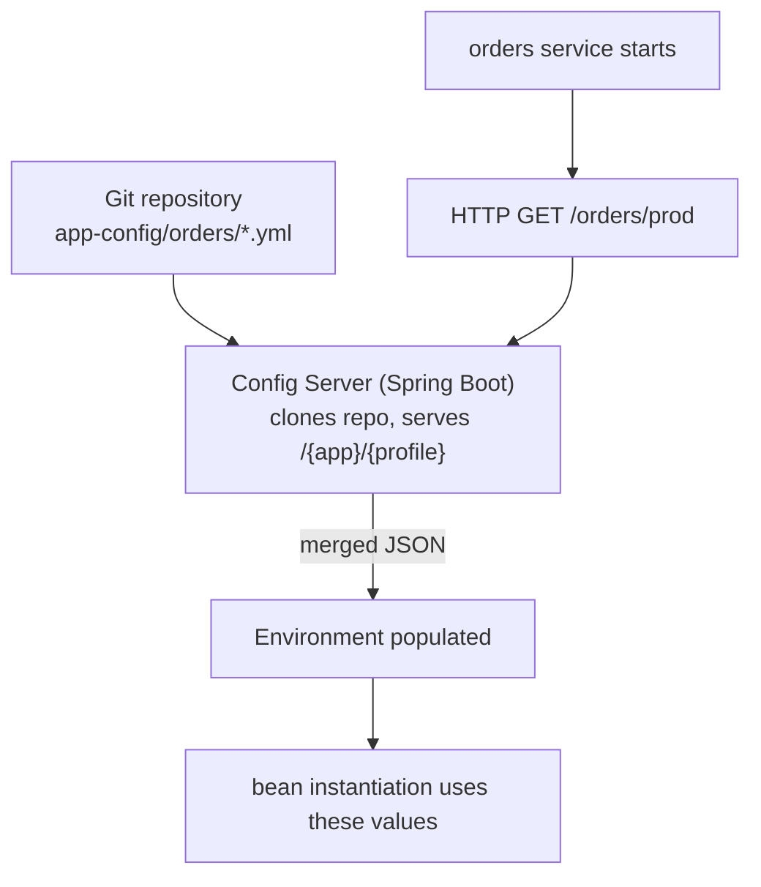
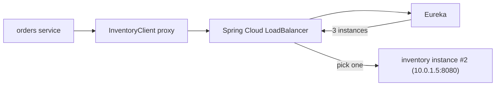
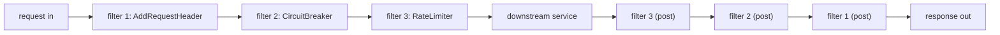
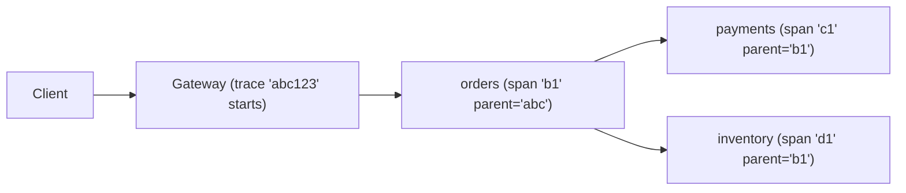
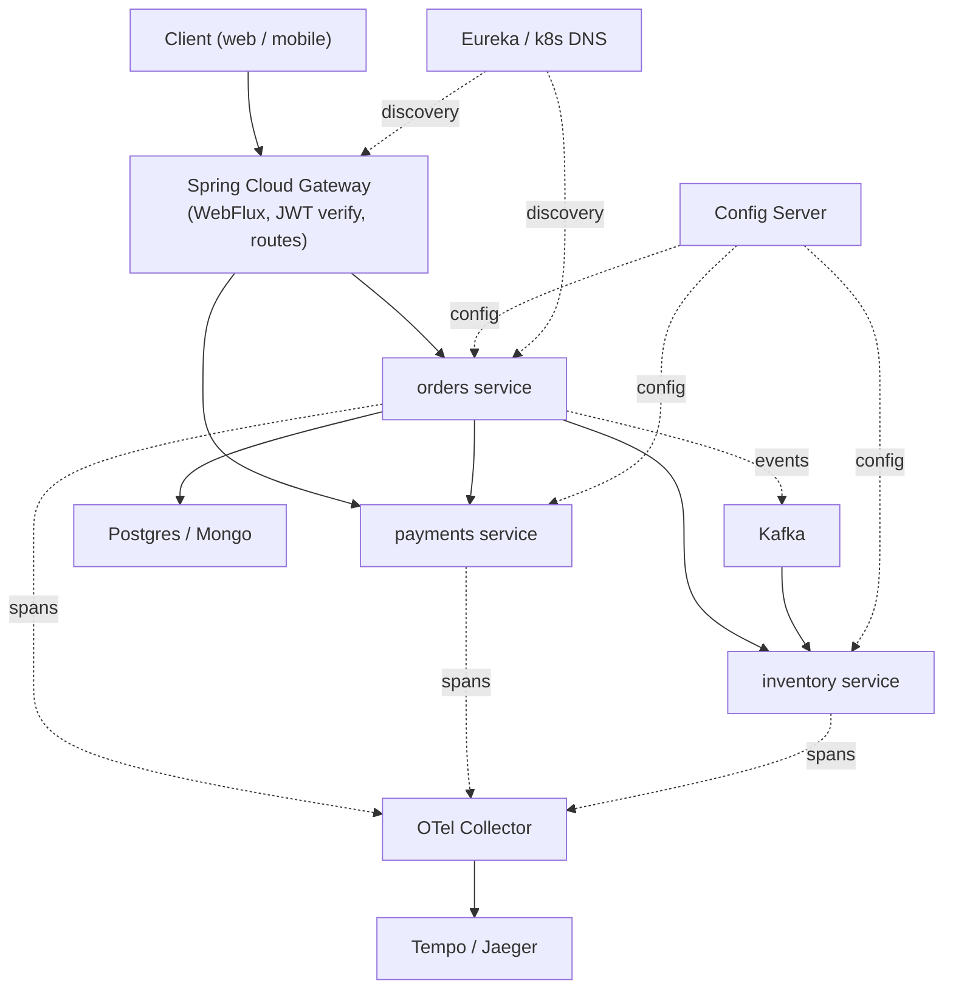

# Spring Cloud (Config, Gateway, Eureka, OpenFeign)

A microservices architecture asks five infrastructure questions that a monolith never does: **where is configuration centrally managed and pushed out at scale**, **how do services find each other when their IPs change every deploy**, **how does a client call another service without hard-coding hosts and ports**, **how does a single edge endpoint route traffic to dozens of backend services**, and **how does a request's identity / trace / context travel across the call graph**. Spring Cloud is the umbrella project that ships first-class Java answers to each. Its modules — `spring-cloud-config`, `spring-cloud-netflix-eureka`, `spring-cloud-gateway`, `spring-cloud-openfeign`, `spring-cloud-loadbalancer`, `spring-cloud-circuitbreaker`, `spring-cloud-sleuth` (deprecated in favor of Micrometer Tracing) — compose with Spring Boot so a microservice gets the full distributed-systems toolkit by adding starters.

Spring Cloud's positioning has changed since 2017. The original story — *"build everything in Java; the Java toolkit is your platform"* — competed with a Kubernetes-native story — *"Kubernetes Services + ConfigMaps + Istio give you the same things at the infrastructure layer; keep your apps simple"*. By 2026 most production environments lean on Kubernetes for service discovery (DNS via `Service`), config (`ConfigMap` mounted as files), traffic shaping (Istio / Linkerd / Cilium), and TLS termination (Ingress / Gateway API). Spring Cloud Config / Eureka are no longer the default — they remain *useful* for hybrid (some k8s, some VMs), for teams that want config rollout decoupled from deployment, for Spring-team-controlled tracing, and for Spring Cloud Gateway as a Java-native edge. A senior engineer needs to understand both worlds — Spring Cloud's design, and when *not* to use it because Kubernetes already gives you the equivalent.

The depth-bar this topic clears: at the **language layer**, the Spring Cloud module catalog and the `@EnableConfigServer`, `@EnableEurekaClient`, `@EnableFeignClients`, `@LoadBalanced` annotations, plus the Gateway DSL (predicates + filters). At the **memory layer**, what Config Server does on startup (clone a git repo, cache per-application properties); how Eureka's heartbeat / lease-renewal works (default 30 s heartbeat, 90 s lease, 60 s eviction) and the staleness window an eviction-based system tolerates; the OpenFeign proxy (one JDK dynamic proxy per `@FeignClient` interface; per-method invocation handlers); the Gateway routing table (typically 10–100 routes, each ~1 KB of compiled predicates). At the **architecture layer** — the heart — **the full request path** through a Spring Cloud topology: client → Gateway → discovery lookup → load-balancer choice → outbound Feign call (with tracing headers) → downstream service → Config-Server-supplied config; **the Kubernetes comparison** for each module; and the **resilience patterns** (circuit breaker, retry, timeout, rate limit) that compose around Feign and Gateway via Resilience4j (T19).

> [!NOTE]
> Prerequisites: T07–T17. Particularly Spring Boot auto-configuration (T07), Actuator (T09), Spring MVC (T10), and Spring Security (T14). General networking / HTTP fundamentals from L2/C03.

## What Spring Cloud Solves — The Five Questions

The five questions, paired with Spring Cloud's answer and the Kubernetes-native answer:

| Question | Spring Cloud answer | Kubernetes-native answer |
|----------|--------------------|--------------------------|
| Central config + push | Spring Cloud Config Server (Git-backed) | `ConfigMap` + `Secret` mounted as files / env |
| Service discovery | Eureka / Consul / Nacos | `Service` + kube-dns (`http://orders.default.svc.cluster.local`) |
| Client-side HTTP | OpenFeign + LoadBalancer | direct DNS-based call to the `Service` |
| API gateway / edge | Spring Cloud Gateway | Ingress / Gateway API / Istio |
| Resilience (CB / retry / timeout) | Resilience4j (T19) | Istio retry / circuit breaker policies + Resilience4j for app-level |
| Distributed tracing | Micrometer Tracing (Sleuth deprecated) | same — Micrometer / OpenTelemetry are infra-neutral |

The trade-off: Spring Cloud keeps the toolkit *inside* your Java app (every team picks the same Spring versions; you control all the wiring). Kubernetes pushes it to the platform (the infra-team owns service discovery, your app just calls a DNS name). Most production systems blend the two — use Kubernetes for discovery and TLS, use Spring Cloud Gateway as an app-aware edge or BFF, use Resilience4j for app-level resilience.

## Spring Cloud Config

The story: every service has an `application.yml`, but you do *not* want to bake config into deployment artifacts. Config Server is a separate small Spring Boot app whose only job is to serve property files to other services. The "files" live in a **Git repository** (the typical store; Vault and database-backed alternatives exist).

### Setting Up Config Server

```xml
<dependency>
    <groupId>org.springframework.cloud</groupId>
    <artifactId>spring-cloud-config-server</artifactId>
</dependency>
```

```java
@SpringBootApplication
@EnableConfigServer
public class ConfigServerApplication {
    public static void main(String[] args) { SpringApplication.run(ConfigServerApplication.class, args); }
}
```

```yaml
spring:
  cloud:
    config:
      server:
        git:
          uri: https://github.com/myorg/app-config
          default-label: main
          search-paths: '{application}'   # serve from /orders, /payments, etc.
          clone-on-start: true
server:
  port: 8888
```

The repo's layout:

```
app-config/
  orders/
    application.yml
    application-prod.yml
    application-dev.yml
  payments/
    application.yml
    application-prod.yml
  application.yml             ← shared across all services
```

A client service starts with one config line — *which Config Server to ask*:

```yaml
spring:
  application:
    name: orders
  config:
    import: "configserver:http://config-server:8888"
  profiles:
    active: prod
```

On startup, the `orders` service makes an HTTP call to `http://config-server:8888/orders/prod`. The Config Server returns the merged property tree (`application.yml` → `orders/application.yml` → `orders/application-prod.yml`). The service adds it to its `Environment` with high precedence, ahead of its bundled `application.yml`.



### Refresh — Hot Config Reload

Without restart: a service marked `@RefreshScope` on relevant beans, with the Spring Cloud Bus listening for `RefreshRemoteApplicationEvent`s, re-fetches config on event and recreates the scoped beans:

```java
@RestController
@RefreshScope
public class FeatureController {
    @Value("${features.payment-v2}") boolean paymentV2;
}
```

Refresh trigger:

```bash
POST /actuator/refresh    # single instance
POST /actuator/busrefresh # broadcasts to all instances (with Spring Cloud Bus + RabbitMQ/Kafka)
```

Refresh is a powerful but operationally tricky feature — beans recreated mid-request might cause undefined behavior; the alternative *restart on config change* is often safer (k8s `rollout restart`).

### Encryption

Config Server has built-in symmetric/asymmetric encryption. Values prefixed `{cipher}...` are decrypted at serve time:

```yaml
db:
  password: '{cipher}AQAvCsXdfn...'
```

The Config Server holds the master key. Vault integration is preferred in production for proper key rotation and audit.

### Kubernetes Alternative

```yaml
# Kubernetes ConfigMap
apiVersion: v1
kind: ConfigMap
metadata:
  name: orders-config
data:
  application.yml: |
    server:
      port: 8080
    features:
      payment-v2: true
```

Mount as a file (T08's `configtree:` syntax) or as env vars. Rotated by editing the ConfigMap; the kubelet remounts the file. No separate config server to run.

**When to still use Config Server in 2026:**

- Hybrid cloud + on-prem fleets where you want one config source.
- Teams who want Git-driven audit + PR-review workflow for config (k8s ConfigMaps in GitOps achieve the same).
- Apps that need dynamic refresh of *some* properties (Spring Cloud Bus + `@RefreshScope` works well).

## Service Discovery — Eureka

Discovery solves "where is the `payments` service running right now?" In 2026 the dominant answer is **DNS via Kubernetes Service** — `payments.default.svc.cluster.local` resolves to the current backing pods. For non-k8s deployments and hybrid setups, **Netflix Eureka** is the Spring Cloud default; Consul, ZooKeeper, and Nacos are first-class alternatives.

### Eureka Server

```xml
<dependency>
    <groupId>org.springframework.cloud</groupId>
    <artifactId>spring-cloud-starter-netflix-eureka-server</artifactId>
</dependency>
```

```java
@SpringBootApplication
@EnableEurekaServer
public class EurekaServerApplication { ... }
```

```yaml
server.port: 8761
eureka:
  client:
    register-with-eureka: false
    fetch-registry: false
```

That is the entire Eureka server. Run it once (or as a small cluster of 3); every microservice registers with it.

### Eureka Client

```xml
<dependency>
    <groupId>org.springframework.cloud</groupId>
    <artifactId>spring-cloud-starter-netflix-eureka-client</artifactId>
</dependency>
```

```yaml
eureka:
  client:
    service-url:
      defaultZone: http://eureka:8761/eureka/
  instance:
    prefer-ip-address: true
    lease-renewal-interval-in-seconds: 30
    lease-expiration-duration-in-seconds: 90
```

Every minute the service POSTs a heartbeat. Eureka tracks `(serviceName → list of instance metadata)`. The list looks like:

```
orders:
  - instanceId: orders:10.0.1.4:8080  status: UP   leaseRenewalAt: 2026-06-08T12:00:00Z
  - instanceId: orders:10.0.1.5:8080  status: UP
  - instanceId: orders:10.0.1.6:8080  status: UP
```

Clients fetch this registry on startup and refresh every 30 seconds (default). Each client thus has a local cache; lookups are O(1) (no Eureka call per request).

### The Heartbeat Timing

| Parameter | Default | Meaning |
|-----------|---------|---------|
| `lease-renewal-interval-in-seconds` | 30 | how often client sends heartbeat |
| `lease-expiration-duration-in-seconds` | 90 | how long Eureka waits before evicting a non-heartbeating instance |
| `eviction-interval-timer-in-ms` | 60_000 | Eureka's eviction sweep frequency |

```mermaid
sequenceDiagram
  participant Inst as Service instance
  participant Eu as Eureka server
  participant Other as Other instance (client)
  Inst->>Eu: REGISTER orders 10.0.1.4
  loop every 30s
    Inst->>Eu: HEARTBEAT
  end
  Other->>Eu: GET registry (every 30s)
  Eu-->>Other: {orders: [10.0.1.4, 10.0.1.5, ...]}
  Note over Inst,Eu: pod dies; heartbeats stop
  Eu->>Eu: eviction sweep (every 60s): lease > 90s → evict
  Other->>Eu: GET registry (next refresh)
  Eu-->>Other: {orders: [10.0.1.5, 10.0.1.6]}
```

The catch: **a freshly dead instance is in the registry for up to 90 + 60 = 150 seconds.** A client could call it during that window. Spring Cloud LoadBalancer + Resilience4j (T19) compensate by retrying on connection failures.

The Kubernetes alternative — kube-dns + a `Service` — is *much* faster to update (the kubelet removes the endpoint from the `Service` within seconds of the pod going `NotReady`). For latency-sensitive systems, k8s discovery beats Eureka.

### Self-Preservation Mode

Eureka has a controversial protection: if too many heartbeats stop simultaneously (a network partition between Eureka and the data center), Eureka stops evicting *anything* — preferring stale data over an empty registry. The threshold defaults to 85% renewal rate.

In practice this means an Eureka cluster that has lost its connection to the services keeps serving the *old* registry, which is correct *if* it's a network partition (services are still up; we just can't see them) and *wrong* if a real outage destroyed half the services. Disable in dev / small clusters; keep on in prod.

## OpenFeign — Declarative HTTP Clients

A service that calls another writes a hand-rolled `RestTemplate` / `WebClient` block per call: build URL, marshal body, parse response, handle errors. **OpenFeign** turns each remote call into an **interface method** — same shape as a Spring Data repository:

```java
@FeignClient(name = "inventory", url = "${inventory.url}")
public interface InventoryClient {

    @GetMapping("/items/{sku}")
    Item getItem(@PathVariable String sku);

    @PostMapping("/items")
    Item createItem(@RequestBody NewItem body);

    @GetMapping("/items")
    Page<Item> search(@RequestParam("q") String q, Pageable pageable);
}
```

Enable with `@EnableFeignClients` on a `@Configuration`. Spring scans for `@FeignClient` interfaces, builds a JDK dynamic proxy per interface (~96 B each), wires it to a generated `feign.Feign` chain with encoders, decoders, error handlers. Inject like any other bean:

```java
@Service
public class OrderService {

    private final InventoryClient inventory;
    public OrderService(InventoryClient inventory) { this.inventory = inventory; }

    public boolean canFulfill(Order order) {
        return order.items().stream().allMatch(i ->
            inventory.getItem(i.sku()).quantity() >= i.requested());
    }
}
```

Use Feign when:

- Many services call each other (boilerplate compounds).
- You want declarative, interface-typed contracts.
- You want unified retry, logging, tracing config (one `feign.Logger.Level=FULL` covers all clients).

The newer Spring 6+ alternative is **HTTP Interface clients** — a Spring-native, OpenFeign-similar style without the extra dependency:

```java
public interface InventoryClient {
    @GetExchange("/items/{sku}")
    Item getItem(@PathVariable String sku);
}

@Bean
public InventoryClient inventoryClient(RestClient.Builder builder) {
    return HttpServiceProxyFactory.builderFor(RestClientAdapter.create(builder.baseUrl("...").build())).build()
        .createClient(InventoryClient.class);
}
```

For new code in Spring 6 / Boot 3, prefer HTTP Interface clients — same proxy mechanism, fewer dependencies, no Feign-specific config.

### Feign + Load Balancing + Discovery

When you set `name = "inventory"` *without* a `url`, Feign treats `inventory` as a *service name* and asks `spring-cloud-loadbalancer` (or Ribbon — deprecated) to pick an instance. The load balancer queries Eureka (or Consul / Nacos), gets the list of `inventory` instances, picks one (round-robin by default; configurable), and invokes.



In Kubernetes, `name = "inventory"` resolves directly to a `Service` DNS name; the kube-proxy load-balances. No Eureka needed.

### Customizing Feign

```yaml
feign:
  client:
    config:
      default:
        connect-timeout: 2000
        read-timeout: 5000
        logger-level: BASIC
      inventory:
        read-timeout: 10000      # specific override
```

Programmatic config per client:

```java
@FeignClient(name = "inventory", configuration = InventoryFeignConfig.class)
public interface InventoryClient { ... }

@Configuration
public class InventoryFeignConfig {
    @Bean public RequestInterceptor authInterceptor(TokenService tokens) {
        return template -> template.header("Authorization", "Bearer " + tokens.current());
    }
    @Bean public ErrorDecoder errorDecoder() {
        return new InventoryErrorDecoder();
    }
}
```

## Spring Cloud Gateway

A gateway is the single entry point routing external requests to backend services. Spring Cloud Gateway is Spring's reactive gateway built on WebFlux + Netty — concurrent at scale (10,000+ connections), with a declarative routing DSL.

### Routing DSL

```yaml
spring:
  cloud:
    gateway:
      routes:
        - id: orders-route
          uri: lb://orders          # load-balanced, name from discovery
          predicates:
            - Path=/api/orders/**
          filters:
            - StripPrefix=1
            - AddRequestHeader=X-Gateway, true

        - id: payments-route
          uri: lb://payments
          predicates:
            - Path=/api/payments/**
            - Header=X-Tenant, .*
          filters:
            - StripPrefix=1
            - name: CircuitBreaker
              args: { name: payments-cb, fallbackUri: forward:/fallback }
            - name: RequestRateLimiter
              args: { redis-rate-limiter.replenishRate: 100, redis-rate-limiter.burstCapacity: 200 }
```

A **route** has:

- `id` — name.
- `uri` — destination (`lb://name` for load-balanced via discovery; `http://...` for static; `forward:/path` for in-gateway).
- `predicates` — matching rules: `Path`, `Method`, `Header`, `Query`, `Cookie`, `Host`, `RemoteAddr`, `Before` / `After` / `Between` (time-based), custom.
- `filters` — request/response mutators: `AddRequestHeader`, `RewritePath`, `StripPrefix`, `SetStatus`, `Retry`, `CircuitBreaker`, `RequestRateLimiter`, custom.

### Java DSL

```java
@Bean
public RouteLocator routes(RouteLocatorBuilder b) {
    return b.routes()
        .route("orders", r -> r.path("/api/orders/**")
            .filters(f -> f.stripPrefix(1).addRequestHeader("X-Gateway", "true"))
            .uri("lb://orders"))
        .route("payments", r -> r.path("/api/payments/**")
            .filters(f -> f.stripPrefix(1)
                .circuitBreaker(c -> c.setName("payments-cb").setFallbackUri("forward:/fallback")))
            .uri("lb://payments"))
        .build();
}
```

Both styles produce the same internal `Route` objects. YAML is operations-friendly (no recompile); Java DSL is type-checked and supports complex programmatic logic.

### Filter Order

Filters run **in order before the request** and **in reverse after the response**:



The `CircuitBreaker` filter wraps the call to downstream; on failure it can serve a fallback. The `RequestRateLimiter` rejects with 429 when over quota (typically Redis-backed for distributed rate limiting).

### Kubernetes Alternative

A standard `Ingress` (or `Gateway API` resource) handles the same routing at the cluster edge:

```yaml
apiVersion: networking.k8s.io/v1
kind: Ingress
metadata:
  name: api-ingress
spec:
  rules:
    - host: api.example.com
      http:
        paths:
          - path: /api/orders
            backend: { service: { name: orders, port: { number: 80 } } }
          - path: /api/payments
            backend: { service: { name: payments, port: { number: 80 } } }
```

Plus a service mesh (Istio / Linkerd) for advanced filters (retry, circuit-break, rate limit).

**When to still use Spring Cloud Gateway:**

- BFF (backend-for-frontend) that does app-aware aggregation — fetch from three services, compose one response, return.
- Auth at the edge (verify JWT, inject `X-User-Id` header to backend).
- Java-team-owned edge.
- Hybrid environments not all behind one Ingress.

## Distributed Tracing — Micrometer Tracing

A request to one service triggers calls to three others; each triggers more. **Distributed tracing** stitches the spans into one tree, identified by a **trace id** carried via headers (W3C `traceparent`).

Spring Boot 3 ships **Micrometer Tracing** (replacement for the deprecated Spring Cloud Sleuth):

```xml
<dependency><groupId>io.micrometer</groupId><artifactId>micrometer-tracing-bridge-otel</artifactId></dependency>
<dependency><groupId>io.opentelemetry</groupId><artifactId>opentelemetry-exporter-otlp</artifactId></dependency>
```

```yaml
management:
  tracing:
    sampling:
      probability: 1.0    # sample every trace in dev; 0.1 in prod
  otlp:
    tracing:
      endpoint: http://otel-collector:4318/v1/traces
```

What happens at runtime:

1. Inbound request arrives. Servlet filter (`ObservationFilter`) extracts `traceparent` if present, else generates a new trace id.
2. A *server span* opens covering the request.
3. MDC is populated with `traceId` and `spanId` — every log line carries them.
4. Outbound calls via `RestClient` / `WebClient` / `FeignClient` propagate the headers automatically.
5. The downstream service joins the same trace; opens a child span.
6. Spans are batched and exported (OTLP) to a collector (Tempo / Jaeger / Honeycomb).



The trace in the UI shows one timeline with each span nested under its parent — instantly visible *where* the latency was, *which* service erred, *what* the dependency graph for this request looked like.

### Baggage — Context That Travels

Trace IDs identify *the* request. **Baggage** is additional KV data you attach that travels with it: tenant id, feature-flag overrides, request priority. Useful for cross-cutting context without polluting every method signature.

```java
@Component
class TenantBaggage implements ObservationFilter {
    @Override public Observation.Context map(Observation.Context ctx) {
        String tenant = MDC.get("tenant");
        if (tenant != null) ctx.addHighCardinalityKeyValue(KeyValue.of("tenant.id", tenant));
        return ctx;
    }
}
```

Baggage propagates via headers; tagged on every span; visible in trace UIs.

## Resilience4j — Circuit Breaker / Retry / Bulkhead

Detailed in T19. Briefly: Resilience4j is Spring's replacement for the deprecated Netflix Hystrix. Integrates with Spring Cloud via `spring-cloud-starter-circuitbreaker-resilience4j`. Composes with Feign / Gateway via filters.

```java
@CircuitBreaker(name = "inventory", fallbackMethod = "inventoryFallback")
@TimeLimiter(name = "inventory")
@Retry(name = "inventory")
public Item getItem(String sku) {
    return inventoryClient.getItem(sku);
}

public Item inventoryFallback(String sku, Throwable t) {
    return Item.UNAVAILABLE;
}
```

T19 covers the patterns and the operational tuning.

## A Realistic Architecture — End-to-End



The Spring Cloud pieces: Gateway at the edge, Config Server for centralized config, Eureka (or k8s DNS) for discovery, Feign / HTTP Interface clients for service-to-service, Micrometer Tracing on the OpenTelemetry rail. Each piece is *optional* — pick what the deployment environment lacks; let Kubernetes provide what it already does well.

## Common Pitfalls

> [!WARNING]
> **Running Config Server in production without a backup.** A failed Config Server prevents new pods from starting. Run 3 replicas with a stable hostname; consider Vault-backed config for secrets.

> [!WARNING]
> **`@RefreshScope` everywhere.** Beans get recreated mid-request. Mark only the few beans whose values change.

> [!WARNING]
> **Eureka eviction timing assumed quick.** Default 90s + 60s sweep = up to 150s of stale registry. Combine with client-side retry on connection errors.

> [!WARNING]
> **`@FeignClient` without timeouts.** A downstream service that hangs holds your thread (or your WebFlux subscriber) forever. Always set `connect-timeout` and `read-timeout`.

> [!WARNING]
> **Gateway without rate limiting.** A misbehaving client floods backends. Use `RequestRateLimiter` filter with Redis backing for cluster-wide quotas.

> [!WARNING]
> **Feign + virtual threads.** Feign's default client is `feign-okhttp` or `feign-java11`; both are blocking. With virtual threads (`spring.threads.virtual.enabled=true`) this is now efficient. With WebFlux, use HTTP Interface clients with WebClient adapter instead.

> [!WARNING]
> **Spring Cloud version mismatch with Spring Boot.** Spring Cloud's release train aligns with specific Boot versions; mixing produces runtime errors. Use the BOM matching your Boot version.

> [!WARNING]
> **Trace ID not flowing to logs.** Without `[%X{traceId} %X{spanId}]` in your Logback pattern, logs don't show the trace context. Configure the pattern explicitly.

> [!WARNING]
> **Using Eureka in a Kubernetes cluster.** Redundant — kube-dns already does discovery, with faster updates. Skip Eureka; use `Service` DNS.

## Practice

1. Stand up a Config Server pointing at a local Git repo. Configure two services to fetch from it. Change a property in Git; restart the service; verify the new value.
2. Add `@RefreshScope` to a bean. Trigger `POST /actuator/refresh` after a Git change. Verify hot reload.
3. Run Eureka. Register two services. Use a third (with Feign and `@LoadBalanced`) to call one of them. Stop one instance; observe the registry's eviction timing.
4. Build three `@FeignClient` interfaces for three services. Add per-client timeouts and a `RequestInterceptor` that injects an auth header.
5. Compare Feign with HTTP Interface clients (Spring 6 style). Migrate one and observe the dependency reduction.
6. Set up Spring Cloud Gateway with three routes. Add a `CircuitBreaker` filter using Resilience4j. Kill the backend; observe the fallback response.
7. Add `RequestRateLimiter` to the Gateway with Redis. Hit the endpoint at 1000 RPS; observe 429s once the limit hits.
8. Enable Micrometer Tracing with OTLP export. Run a multi-service request. View the trace in Jaeger / Tempo.
9. Compare your Spring Cloud setup with the equivalent Kubernetes-native setup. For each component, decide which to keep and which to replace with infra.

## Recap

You should now be able to:

- Name the five problems Spring Cloud solves (config, discovery, client, gateway, tracing) and choose between Spring Cloud and Kubernetes-native answers for each.
- Stand up a Config Server, point it at a Git repo, and have services consume its properties via `spring.config.import`.
- Use `@RefreshScope` and `POST /actuator/refresh` (or busrefresh) for hot config reload, and articulate the risks.
- Run Eureka as both server and client; understand the heartbeat/lease/eviction timing and the staleness window.
- Write `@FeignClient` declarative HTTP clients with timeouts, interceptors, and error decoders; migrate to HTTP Interface clients for new Spring 6 code.
- Configure Spring Cloud Gateway with predicate + filter routes (YAML or Java DSL), apply `CircuitBreaker`, `RequestRateLimiter`, `Retry`, and custom filters.
- Wire Micrometer Tracing with OpenTelemetry / OTLP export; propagate trace context across services; add baggage for cross-cutting context.
- Choose when to use each Spring Cloud module in 2026 — keep Gateway for app-aware edges; consider Kubernetes DNS over Eureka; keep Config Server for hybrid environments or use ConfigMap mounts otherwise.
- Avoid the common pitfalls: no Config Server backup, eviction-staleness assumed quick, missing Feign timeouts, no Gateway rate limiting, ungrouped tracing fields in logs.

## Next

Continue to [Spring Cloud Resilience (Resilience4j)](./T19-spring-cloud-resilience-resilience4j.md) for the deep treatment of resilience patterns — circuit breaker, retry, bulkhead, rate limiter, time limiter — with Resilience4j's state-machine internals, Spring integration via annotations / filters / functions, and the operational tuning that turns "we have a circuit breaker" into "the circuit breaker actually saves us in production."
