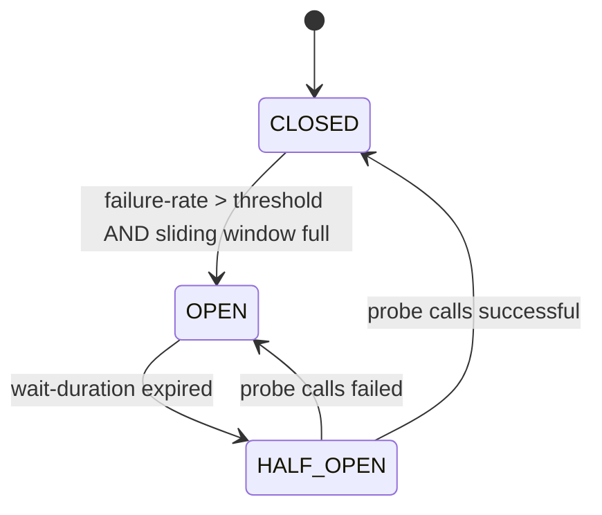

# Spring Cloud Resilience (Resilience4j)

In a microservices system, every outbound call has a non-zero chance of being slow, hanging, or failing — the downstream service might be deploying, the network might be congested, the database it depends on might be slow. If your service treats every call as "wait however long the OS waits before declaring the socket dead" and "retry forever," one slow downstream cascades into your service hanging, then your callers hanging, then *their* callers — the entire system collapses on one degraded leaf. **Resilience patterns** — circuit breaker, retry with backoff, bulkhead, rate limiter, timeout — are the family of operational guards that keep one failure local. **Resilience4j** is the modern Java library (functional, lightweight, lock-free, RxJava/Reactor-friendly) that implements them; Spring Cloud Resilience (`spring-cloud-circuitbreaker-resilience4j`) wires them into Spring via annotations and the unified `CircuitBreakerFactory` SPI.

The depth-bar this topic clears: at the **language layer**, each Resilience4j pattern's annotation, its YAML configuration keys, and the decorator API (compose patterns on a `Supplier<T>`). At the **memory layer**, the circuit-breaker state machine (~200 B per instance + sliding window ~16 B/slot × 100 slots default = ~1.8 KB), the per-call cost (~50–200 ns overhead, lock-free), and how Resilience4j stores statistics with atomic counters instead of locks. At the **architecture layer** — the heart — **the circuit-breaker state machine and when each transition fires**, **the precise composition order** of multiple patterns on one method (retry → circuit breaker → fallback is the canonical "outside-in"), the **idempotency requirement** for retries (an unconditionally-retried `POST` charges the card twice), and **operational tuning** — the failure-rate threshold, the sliding-window size, the wait-duration in OPEN — that turn "we have a circuit breaker" into "the breaker actually protects us."

> [!NOTE]
> Prerequisites: [Spring AOP](./T05-spring-aop.md) (Resilience4j's Spring integration uses aspect-based interception), [Spring Cloud (T18)](./T18-spring-cloud-config-gateway-eureka-openfeign.md) (Feign / Gateway integration), [Spring Boot Actuator (T09)](./T09-spring-boot-actuator.md) (resilience metrics).

## The Five Patterns

| Pattern | Purpose | When to use |
|---------|---------|-------------|
| **Circuit Breaker** | stop calling a failing service until it recovers | every outbound call to a service that could fail |
| **Retry** | re-attempt a transient failure | the call is *idempotent* and the failure looks transient |
| **Bulkhead** | cap concurrent in-flight calls | prevent one slow downstream from exhausting all threads |
| **Rate Limiter** | cap call rate (per second) | comply with upstream / downstream contracts |
| **Time Limiter** | enforce a deadline | guarantee a hard timeout independent of the lib's defaults |

Resilience4j also has lighter helpers (`Cache`, `Decorators`); the five above are the core.

## Setup

```xml
<dependency>
    <groupId>org.springframework.cloud</groupId>
    <artifactId>spring-cloud-starter-circuitbreaker-resilience4j</artifactId>
</dependency>
<dependency>
    <groupId>io.github.resilience4j</groupId>
    <artifactId>resilience4j-spring-boot3</artifactId>
</dependency>
<dependency>
    <groupId>io.github.resilience4j</groupId>
    <artifactId>resilience4j-micrometer</artifactId>
</dependency>
```

The Boot starter wires annotations + AOP; the `micrometer` integration emits metrics for every pattern.

## Circuit Breaker — The Headline Pattern

The classic 2003 Michael Nygard "Release It!" idea: **wrap a call**; if it fails too often, **trip the breaker** and immediately fail subsequent calls (skipping the downstream) until a **recovery window** passes; then let one call through to check; succeed → close; fail → re-open.

### The State Machine

Three states:

- **CLOSED** — normal operation; every call goes through; failures are tracked.
- **OPEN** — every call fails immediately (no downstream call); after `wait-duration-in-open-state` (default 60 s) → HALF_OPEN.
- **HALF_OPEN** — let `permitted-number-of-calls-in-half-open-state` (default 10) calls through to probe; based on outcome, CLOSE or re-OPEN.



There are also two utility states:

- **DISABLED** — always pass through (no metrics, no transitions).
- **FORCED_OPEN** — always reject.

### Configuration

```yaml
resilience4j:
  circuitbreaker:
    configs:
      default:
        sliding-window-type: COUNT_BASED        # or TIME_BASED
        sliding-window-size: 100                 # last 100 calls
        minimum-number-of-calls: 50              # don't compute until at least 50
        failure-rate-threshold: 50               # %
        slow-call-rate-threshold: 50             # % considered slow
        slow-call-duration-threshold: 2s
        wait-duration-in-open-state: 60s
        permitted-number-of-calls-in-half-open-state: 10
        automatic-transition-from-open-to-half-open-enabled: true
        record-exceptions:
          - java.io.IOException
          - org.springframework.web.client.HttpServerErrorException
        ignore-exceptions:
          - com.example.BusinessException
    instances:
      inventory:
        base-config: default
        failure-rate-threshold: 30
      payments:
        base-config: default
        sliding-window-size: 1000
        wait-duration-in-open-state: 30s
```

Three properties matter most:

- **`failure-rate-threshold`** — % of failures in the sliding window that trips the breaker. Default 50%. Lower = more conservative (trips earlier).
- **`sliding-window-size`** — how many calls are tracked. Larger = more stable but slower to react.
- **`wait-duration-in-open-state`** — how long to stay OPEN before probing.

### Usage — Annotation

```java
@Service
public class InventoryService {

    private final InventoryClient client;
    public InventoryService(InventoryClient client) { this.client = client; }

    @CircuitBreaker(name = "inventory", fallbackMethod = "fallback")
    public Item getItem(String sku) {
        return client.getItem(sku);
    }

    private Item fallback(String sku, Throwable t) {
        return Item.unavailable(sku);
    }
}
```

The fallback method must have the *same return type* + the same parameters + an extra `Throwable` (or specific exception types). Resilience4j picks the most specific fallback per exception.

When the breaker is OPEN: `getItem` immediately calls `fallback` with `CallNotPermittedException` — no downstream call. The fallback returns a degraded but available answer (cached previous data, sentinel value, etc.). **Graceful degradation, not error propagation.**

### Usage — Functional Decorator

For non-annotated control:

```java
CircuitBreaker cb = circuitBreakerRegistry.circuitBreaker("inventory");
Supplier<Item> decorated = CircuitBreaker.decorateSupplier(cb, () -> client.getItem(sku));
Try<Item> result = Try.ofSupplier(decorated)
    .recover(t -> Item.unavailable(sku));
```

The `Try` monad makes the recovery composable. For more decorators stacked together:

```java
Supplier<Item> decorated = Decorators.ofSupplier(() -> client.getItem(sku))
    .withCircuitBreaker(cb)
    .withRetry(retry)
    .withBulkhead(bulkhead)
    .withFallback(List.of(CallNotPermittedException.class), t -> Item.unavailable(sku))
    .decorate();
```

The order of composition matters — outside in, the call passes through each in declaration order.

## Retry — Re-Attempt Transient Failures

```yaml
resilience4j:
  retry:
    instances:
      inventory:
        max-attempts: 3
        wait-duration: 500ms
        retry-exceptions:
          - java.io.IOException
          - org.springframework.web.client.HttpServerErrorException
        ignore-exceptions:
          - com.example.BusinessException
        exponential-backoff-multiplier: 2
        randomized-wait-factor: 0.5         # add jitter
```

Default backoff sequence with `wait-duration=500ms`, multiplier 2, jitter 0.5: ~500 ms, ~1 s, ~2 s (with ±50% randomness).

### Usage

```java
@Retry(name = "inventory", fallbackMethod = "fallback")
public Item getItem(String sku) {
    return client.getItem(sku);
}
```

### Idempotency Is Mandatory

Retrying a `GET` is safe. Retrying a non-idempotent `POST` (place order, charge card, send email) **doubles the work** if the first call succeeded but the response was lost in transit. **Never** retry without idempotency. Two safe patterns:

1. **Idempotency keys** — client generates a unique key; server records (key, result) and returns the saved result on retry.
2. **Conditional updates** — `PUT /items/{id}` is idempotent by definition (replace state); use it instead of `POST` where possible.

For Feign / `RestClient` calls to your own services, build an `Idempotency-Key` header convention.

### Backoff


Without exponential backoff: a downstream that just restarted gets hammered by every retry stampede. With backoff + jitter: retries spread out; the downstream gets breathing room.

## Bulkhead — Cap Concurrency

A bulkhead reserves a fixed number of "permits" for a class of calls. When all are in use, new calls are rejected (or queued). Prevents one slow downstream from exhausting your service's threads / connections / memory.

Two implementations:

- **`SemaphoreBulkhead`** — a counting semaphore; no thread separation.
- **`ThreadPoolBulkhead`** — a separate thread pool + queue; isolates blocking work.

```yaml
resilience4j:
  bulkhead:
    instances:
      inventory:
        max-concurrent-calls: 20
        max-wait-duration: 100ms
  thread-pool-bulkhead:
    instances:
      slow-inventory:
        core-thread-pool-size: 5
        max-thread-pool-size: 10
        queue-capacity: 20
```

Usage:

```java
@Bulkhead(name = "inventory")
public Item getItem(String sku) { ... }

@Bulkhead(name = "slow-inventory", type = Bulkhead.Type.THREADPOOL)
public CompletableFuture<Item> getItemAsync(String sku) {
    return CompletableFuture.completedFuture(client.getItem(sku));
}
```

The semaphore variant is cheap (no thread creation); the thread-pool variant gives true isolation. Pick semaphore for non-blocking; thread-pool for legacy blocking calls.

## Rate Limiter

```yaml
resilience4j:
  ratelimiter:
    instances:
      outbound-api:
        limit-for-period: 100
        limit-refresh-period: 1s
        timeout-duration: 50ms
```

100 calls per second; if you exceed, the call waits up to 50 ms for a permit, otherwise throws `RequestNotPermitted`.

```java
@RateLimiter(name = "outbound-api")
public Response call() { ... }
```

The Resilience4j rate limiter is **local** (per JVM). For *distributed* rate limiting (10 instances sharing a 1000 RPS budget), use a Redis-backed one (Bucket4j) or the Gateway's `RequestRateLimiter` filter (T18).

## Time Limiter

A timeout on an asynchronous call:

```yaml
resilience4j:
  timelimiter:
    instances:
      inventory:
        timeout-duration: 2s
        cancel-running-future: true
```

```java
@TimeLimiter(name = "inventory")
public CompletableFuture<Item> getItem(String sku) {
    return CompletableFuture.supplyAsync(() -> client.getItem(sku));
}
```

If the `CompletableFuture` doesn't complete in 2 s, it's cancelled; `TimeoutException` propagates to the fallback.

For synchronous calls, set timeouts on the underlying HTTP client (e.g., Feign's `read-timeout`). `@TimeLimiter` requires an async return type.

## Composing Patterns — The Canonical Order

Most outbound calls deserve **all five** wrapped together. The order matters:

```
@CircuitBreaker → @Retry → @Bulkhead → @RateLimiter → @TimeLimiter → call
```

Outside-in interpretation: the breaker decides first (skip retry if open); retry re-attempts within the breaker; bulkhead limits concurrency; rate limiter caps rate; time limiter enforces the deadline; finally the actual call.

```java
@CircuitBreaker(name = "inventory", fallbackMethod = "fallback")
@Retry(name = "inventory")
@Bulkhead(name = "inventory")
@RateLimiter(name = "inventory")
@TimeLimiter(name = "inventory")
public CompletableFuture<Item> getItem(String sku) { ... }
```

Spring's AOP composes the aspects in **default order**: Spring Cloud's `OrderedDefaults` puts CircuitBreaker at the outermost. Override with `@Order` on each aspect or via properties:

```yaml
resilience4j:
  circuitbreaker.metrics.enabled: true
  spring.aop.proxy-target-class: true
```

Visualization:


## Metrics + Events

Resilience4j publishes detailed metrics:

```
resilience4j_circuitbreaker_state{name="inventory", state="closed"} 1
resilience4j_circuitbreaker_calls{name="inventory", kind="failed"} 14
resilience4j_circuitbreaker_calls{name="inventory", kind="successful"} 1234
resilience4j_retry_calls{name="inventory", kind="successful_with_retry"} 8
resilience4j_bulkhead_available_concurrent_calls{name="inventory"} 17
```

Hook into events:

```java
circuitBreaker.getEventPublisher()
    .onStateTransition(e -> log.warn("CB {} transitioned: {} → {}",
        e.getCircuitBreakerName(), e.getStateTransition().getFromState(), e.getStateTransition().getToState()))
    .onCallNotPermitted(e -> meter.counter("cb.rejected", "name", e.getCircuitBreakerName()).increment());
```

For an Actuator endpoint listing breaker state: `GET /actuator/circuitbreakers`.

## Tuning — The Operational Reality

Defaults are sane but rarely optimal. Tune by measuring:

| Symptom | Tweak |
|---------|-------|
| Breaker trips on transient blips (false positives) | raise `failure-rate-threshold`; raise `sliding-window-size`; raise `minimum-number-of-calls` |
| Breaker doesn't trip when downstream is clearly broken | lower threshold; switch to `TIME_BASED` window; add `slow-call-rate-threshold` |
| Service stays degraded too long after downstream recovers | lower `wait-duration-in-open-state` |
| Retries cause thundering herd | enable backoff multiplier + jitter |
| Bulkhead rejections at low concurrency | raise `max-concurrent-calls`; profile per-call latency |
| Rate limiter waits adds latency | raise `limit-for-period`; reduce `timeout-duration` (fail fast on overflow) |

Production posture: start with **breaker only**, with metrics flowing to Prometheus. Add retry once you've identified idempotent operations. Add bulkhead/rate-limiter when you observe specific contention. **Avoid pre-tuning for hypothetical failure modes**; resilience configs that bear no relation to actual incidents add overhead and complexity.

## Fail-Open vs Fail-Closed

Two philosophies when the resilience layer itself trips:

- **Fail-closed** — error response (4xx / 5xx). Safe; clients know the service is degraded; no risk of producing wrong data.
- **Fail-open** — return a degraded but plausible answer (cached / sentinel / partial). Better UX; risks hiding a real problem.

The right answer depends on the caller. For a search box, fail-open with stale data is fine. For a financial transaction, fail-closed is mandatory. The fallback method is where this decision lives:

```java
public Item fallback(String sku, Throwable t) {
    // fail-open: return cached or "unavailable"
    return cache.get(sku).orElse(Item.unavailable(sku));
}

public Order place(Order o, Throwable t) {
    // fail-closed: refuse the call
    throw new ServiceUnavailableException("payments down", t);
}
```

## Pitfalls

> [!WARNING]
> **Retrying non-idempotent operations.** Double charges, duplicate emails, duplicate orders. Either add idempotency keys or never retry POST/PATCH.

> [!WARNING]
> **Long retry windows blocking threads.** With max-attempts=5 and 1-2s waits, a single failing call holds a thread for ~10 s. With virtual threads this matters less; with classic Tomcat it can exhaust the pool.

> [!WARNING]
> **Circuit breaker name not unique.** Two services sharing a breaker name produce surprising shared state across what should be isolated.

> [!WARNING]
> **Fallback method that itself calls a degraded dependency.** If the fallback for `getInventory` calls `Item.unavailable()` (cheap), great. If it calls *another* HTTP service, that service might also be down — cascading failure.

> [!WARNING]
> **No Time Limiter.** Default HTTP-client timeouts are often minutes. A circuit breaker can't trip on a call that hasn't returned. Always set time limiters or HTTP-client timeouts.

> [!WARNING]
> **Setting the breaker by guess, not measurement.** "50% failure rate" might be right for chatty internal calls but disastrous for a high-stakes external API where one failed call should trip. Measure first.

> [!WARNING]
> **Aspect-order surprises.** `@CircuitBreaker` outside `@Retry`: each retry attempt counts toward the breaker. `@Retry` outside `@CircuitBreaker`: only one call counts. Different operational meaning. Decide intentionally.

> [!WARNING]
> **Forgetting to register a fallback.** Without one, breaker-rejected calls throw `CallNotPermittedException` straight to the caller. Sometimes correct; usually you want a degraded response.

> [!WARNING]
> **Per-instance rate limiter when you wanted cluster-wide.** 100 instances × 100 RPS local = 10,000 RPS aggregate. Use distributed rate limiting at the gateway.

## Practice

1. Wrap a `@FeignClient` call in `@CircuitBreaker` with a fallback. Kill the downstream. Confirm the breaker trips after the configured failure threshold; subsequent calls hit the fallback immediately. Restart the downstream; confirm recovery after `wait-duration`.
2. Add `@Retry` with exponential backoff. Make the downstream return 503 once, then succeed. Confirm the retry handles it transparently.
3. Add a `Bulkhead` with `max-concurrent-calls=3`. Hit the endpoint with 10 parallel requests. Confirm 7 are queued or rejected per config.
4. Add a `@TimeLimiter` with 1s timeout. Make the downstream sleep 2s. Confirm the timeout fires and the fallback returns.
5. Compose all 5 patterns on one method. Verify the metrics in Prometheus show each pattern's stats.
6. Use the `EventPublisher` to log circuit-breaker state transitions. Trigger a transition; verify the log.
7. Build a fail-open fallback that returns the last-known-good value from a Caffeine cache. Test the degradation path.
8. Profile the overhead of the full stack. ~200 ns per call should be the expectation; if it's more, investigate.

## Recap

You should now be able to:

- Implement and configure all five Resilience4j patterns (circuit breaker, retry, bulkhead, rate limiter, time limiter) via annotations and via the functional decorator API.
- Walk the circuit-breaker state machine (CLOSED → OPEN → HALF_OPEN → CLOSED) and explain when each transition fires.
- Choose between count-based and time-based sliding windows, tune `failure-rate-threshold`, `sliding-window-size`, `wait-duration-in-open-state` based on your service's traffic and failure modes.
- Implement safe retries (idempotency keys, exponential backoff with jitter, sensible max attempts).
- Compose patterns with the canonical order (`@CircuitBreaker` outside `@Retry` outside `@Bulkhead` outside `@RateLimiter` outside `@TimeLimiter`) and tune the order intentionally.
- Choose fail-open vs fail-closed per operation; write fallback methods that match.
- Wire Resilience4j metrics (Micrometer) to Prometheus and read them as health signals.
- Distinguish local rate-limiting (Resilience4j in-JVM) from distributed (Gateway + Redis).
- Avoid the common pitfalls: retrying non-idempotent ops, missing time limiters, shared breaker names, recursive fallbacks, default-config copying without tuning.

## Next

Continue to [Spring Batch](./T20-spring-batch.md) — the framework for robust batch processing: chunked reading and writing, restartability after failure, parallel processing, listeners, and the distinction from event-driven async processing (T08).
