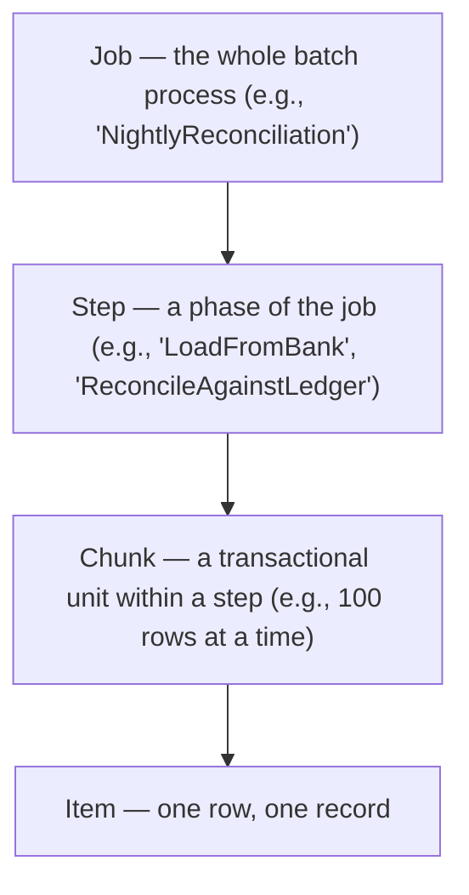
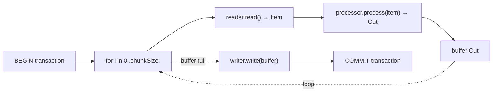
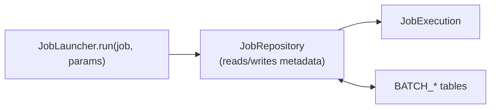

# Spring Batch

A "batch job" is a finite-input, possibly-long-running, almost-always-restartable computation: read a million rows from a database table, transform each, write to another table; ingest a 10 GB CSV nightly; reconcile yesterday's payments against the bank's statement; rebuild a search index. The work has to **survive failures** (the JVM crashes at row 750,000; on restart, resume at 750,001 — not from zero), be **observable** (which step succeeded, which failed, how many records skipped), **idempotent** (the same job run twice produces the same result), and **operationally controllable** (start, stop, retry, partition). Spring Batch is the 2007-era framework (still maintained, JSR-352 reference implementation) that gives you all of this. It is genuinely *the* heavyweight Java batch framework — used in banks, insurers, telecoms, and any organization with regulated overnight processing.

The depth-bar this topic clears: at the **language layer**, the Job → Step → Chunk model, `ItemReader` / `ItemProcessor` / `ItemWriter`, `Tasklet`, the listener catalog, restart semantics. At the **memory layer**, the *batch metadata tables* (`BATCH_JOB_INSTANCE`, `BATCH_JOB_EXECUTION`, `BATCH_STEP_EXECUTION`, `BATCH_JOB_EXECUTION_CONTEXT`, `BATCH_STEP_EXECUTION_CONTEXT`) that persist state for restart, the per-chunk heap profile (~chunk-size × per-item bytes), and the trade-off between large chunks (throughput) and small chunks (restart granularity). At the **architecture layer** — the heart — **the chunk-oriented processing loop** (read-N → process-N → write-N → commit), **how restart picks up where the failure happened** (last successful chunk's `ExecutionContext` is read; the reader is positioned past those records), and **parallelism** patterns (multi-threaded step, parallel steps, partitioning) for scaling beyond a single thread.

> [!NOTE]
> Prerequisites: T01–T13. Particularly Spring Data (T13) for `ItemReader` / `ItemWriter` backed by JPA, and `@Configuration` (T04) for the Job/Step definition style.

## Concepts — Job, Step, Chunk

The model has three nested concepts:



- **Job** — a top-level batch entity. Has a name. Composed of one or more Steps.
- **Step** — a phase. Either a **chunk-oriented step** (read items, process each, write the batch) or a **tasklet step** (single arbitrary task, like "run a stored procedure").
- **Chunk** — a fixed-size batch of items processed and written together within one transaction. Default 10–100; tune for throughput.
- **Item** — one record. The granularity of work.

## A Minimal Spring Batch Job

```xml
<dependency>
    <groupId>org.springframework.boot</groupId>
    <artifactId>spring-boot-starter-batch</artifactId>
</dependency>
```

```java
@Configuration
public class ImportUsersJob {

    @Bean
    public Job importUsersJob(JobRepository repo, Step importStep) {
        return new JobBuilder("importUsers", repo)
            .start(importStep)
            .build();
    }

    @Bean
    public Step importStep(JobRepository repo, PlatformTransactionManager tx,
                            ItemReader<RawUser> reader,
                            ItemProcessor<RawUser, User> processor,
                            ItemWriter<User> writer) {
        return new StepBuilder("importStep", repo)
            .<RawUser, User>chunk(100, tx)
            .reader(reader)
            .processor(processor)
            .writer(writer)
            .faultTolerant()
            .skipLimit(10)
            .skip(MalformedRecordException.class)
            .retryLimit(3)
            .retry(TransientException.class)
            .build();
    }

    @Bean
    public ItemReader<RawUser> reader() {
        return new FlatFileItemReaderBuilder<RawUser>()
            .name("userFileReader")
            .resource(new ClassPathResource("users.csv"))
            .delimited().delimiter(",").names("id", "name", "email")
            .targetType(RawUser.class)
            .build();
    }

    @Bean
    public ItemProcessor<RawUser, User> processor() {
        return raw -> {
            if (!raw.email().contains("@")) throw new MalformedRecordException(raw.id());
            return new User(raw.id(), raw.name(), raw.email().toLowerCase());
        };
    }

    @Bean
    public ItemWriter<User> writer(UserRepository repo) {
        return chunk -> repo.saveAll(chunk.getItems());
    }
}
```

What this does:

- Defines one Job (`importUsers`) with one Step (`importStep`).
- The step reads from `users.csv`, processes each record (normalizes email, validates), writes batches of 100 to the DB.
- Fault-tolerant: up to 10 malformed records are skipped (logged, not failed); transient DB errors are retried 3 times.

## The Chunk-Oriented Processing Loop

The heart of Spring Batch. For each chunk:



Key properties:

- **All N items in one chunk share one transaction.** If item 7 of 100 throws, the whole chunk rolls back.
- **`reader.read()` is called per item; `writer.write(...)` once per chunk.** Writers can do bulk inserts (JDBC batch, JPA `saveAll`).
- **The `ExecutionContext` is updated after each chunk commit.** It stores reader state (cursor position, file offset). On restart, the reader is positioned past the last committed chunk.

### Restartability

When a Job execution fails (the JVM dies, the DB connection drops, an unhandled exception), the next time you launch the same Job with the same parameters, Spring Batch:

1. Looks up `BATCH_JOB_INSTANCE` by name + parameters → finds existing instance.
2. Sees the previous execution status was FAILED.
3. Loads the last successful chunk's `ExecutionContext` from `BATCH_STEP_EXECUTION_CONTEXT`.
4. Re-injects it into the reader (a `FlatFileItemReader` seeks to the file offset; a `JdbcCursorItemReader` skips the first N rows).
5. Resumes processing.

This requires:

- The reader implements `ItemStream` (open / update / close) — built-in readers do.
- The Job parameters are *identical* (parameters are part of the instance identity).
- The Job is marked `restartable = true` (default).

Operationally, your batch script becomes:

```bash
java -jar batch-app.jar --spring.batch.job.name=importUsers \
                       --inputFile=/data/users.csv --date=2026-06-08
# on failure: same command re-runs; Spring Batch resumes
```

## The Batch Metadata Tables

Spring Batch persists every execution to six tables (default schema; `BATCH_` prefix):

| Table | Records |
|-------|--------|
| `BATCH_JOB_INSTANCE` | one per (job name, parameter set) combination |
| `BATCH_JOB_EXECUTION` | one per Job run; status, start/end times, exit code |
| `BATCH_JOB_EXECUTION_PARAMS` | params for each execution |
| `BATCH_JOB_EXECUTION_CONTEXT` | serialized `ExecutionContext` at job level |
| `BATCH_STEP_EXECUTION` | one per Step run within a Job execution |
| `BATCH_STEP_EXECUTION_CONTEXT` | serialized step-level context (the bookmark) |

Auto-created by Boot's `BatchAutoConfiguration` against your primary `DataSource`. The schema is in `org.springframework.batch.core/schema-{db}.sql` — pick the right dialect (`schema-postgresql.sql`, `schema-mysql.sql`, etc.) and run via Flyway or Boot's auto-init.

`JobRepository` is the API; `JobLauncher` runs a Job; `JobExplorer` reads execution history; `JobOperator` triggers stop/restart.



## Readers — The Sources

Spring Batch ships ~20 readers; pick by source type:

| Reader | Source |
|--------|--------|
| `FlatFileItemReader` | delimited / fixed-width files |
| `MultiResourceItemReader` | multiple files in one job |
| `JdbcCursorItemReader` | JDBC cursor (streaming) |
| `JdbcPagingItemReader` | JDBC with manual paging (restart-safe) |
| `JpaCursorItemReader` | JPA streaming |
| `JpaPagingItemReader` | JPA with page-based fetching |
| `RepositoryItemReader` | Spring Data repository |
| `StaxEventItemReader` | XML streaming |
| `JsonItemReader` | JSON streaming |
| `MongoCursorItemReader` | Mongo streaming |
| `KafkaItemReader` | Kafka topic (batch consumption) |

**Cursor vs Paging.** Cursor readers hold a database cursor open for the entire step; one connection, streaming results. Paging readers issue paginated queries (`LIMIT/OFFSET` or keyset-based); release the connection between pages. Paging is restart-safer (the connection can die between pages and you simply re-issue with the saved offset); cursors are slightly faster but hold the connection.

## Processors — The Transformations

```java
public interface ItemProcessor<I, O> {
    O process(I item) throws Exception;
}
```

Returning `null` causes the item to be **filtered out** — skipped, not written, and not counted in writes (counted in filteredCount).

Compose with `CompositeItemProcessor`:

```java
@Bean
public ItemProcessor<RawUser, User> compositeProcessor() {
    return new CompositeItemProcessorBuilder<RawUser, User>()
        .delegates(validateProcessor(), normalizeProcessor(), enrichProcessor())
        .build();
}
```

## Writers — The Sinks

| Writer | Sink |
|--------|------|
| `FlatFileItemWriter` | file output |
| `JdbcBatchItemWriter` | JDBC batch insert/update |
| `JpaItemWriter` | JPA persist/merge |
| `RepositoryItemWriter` | Spring Data save |
| `KafkaItemWriter` | Kafka producer |
| `MongoItemWriter` | Mongo bulk |

For multi-destination writes, use `CompositeItemWriter` (write to all) or `ClassifierCompositeItemWriter` (route per item):

```java
@Bean
public CompositeItemWriter<User> compositeWriter() {
    return new CompositeItemWriterBuilder<User>()
        .delegates(dbWriter(), kafkaWriter(), auditFileWriter())
        .build();
}
```

## Fault Tolerance — Skip and Retry

```java
return new StepBuilder("step", repo)
    .<In, Out>chunk(100, tx)
    .reader(reader).processor(processor).writer(writer)
    .faultTolerant()
    .skipLimit(50)
    .skip(MalformedRecordException.class)
    .skip(DataIntegrityViolationException.class)
    .retryLimit(3)
    .retry(TransientHttpException.class)
    .listener(new SkipListener<In, Out>() {
        @Override public void onSkipInProcess(In item, Throwable t) {
            log.warn("skipped {} due to {}", item, t.getMessage());
        }
    })
    .build();
```

- **Skip**: a record that throws a listed exception is dropped (with listener notification). Up to `skipLimit` per step.
- **Retry**: a record that throws a listed exception is re-processed up to `retryLimit` times.

The combination of skip + retry handles most production failure modes: transient errors retry; bad records skip; everything else aborts the step.

## Listeners

Hook into every stage:

| Listener | When |
|----------|------|
| `JobExecutionListener` | before/after Job |
| `StepExecutionListener` | before/after Step |
| `ChunkListener` | before/after chunk |
| `ItemReadListener` | before/after each read, on error |
| `ItemProcessListener` | before/after each process, on error |
| `ItemWriteListener` | before/after each write, on error |
| `SkipListener` | when an item is skipped |
| `RetryListener` | when a retry happens |

Used for logging, metrics, audit, and external notifications:

```java
@Component
public class JobMetricsListener implements JobExecutionListener {

    @Override public void afterJob(JobExecution exec) {
        meter.counter("batch.jobs", "name", exec.getJobInstance().getJobName(),
                                   "status", exec.getStatus().name())
             .increment();
        meter.timer("batch.duration", "name", exec.getJobInstance().getJobName())
             .record(Duration.between(exec.getStartTime(), exec.getEndTime()));
    }
}
```

## Multi-Threaded Step

Process chunks in parallel within one Step:

```java
return new StepBuilder("step", repo)
    .<In, Out>chunk(100, tx)
    .reader(reader)
    .processor(processor)
    .writer(writer)
    .taskExecutor(new SimpleAsyncTaskExecutor("batch-"))
    .throttleLimit(4)              // up to 4 concurrent chunks
    .build();
```

Each chunk runs in its own thread, its own transaction. **Caveat:** the reader must be thread-safe. Most built-in readers are not — wrap with `SynchronizedItemStreamReader`. Paging readers naturally handle concurrent reads; cursor readers do not.

## Partitioning — Massive Parallelism

For truly large workloads, **partition** the input across multiple step instances:

```java
@Bean
public Step masterStep(JobRepository repo, Step workerStep,
                       Partitioner partitioner, TaskExecutor exec) {
    return new StepBuilder("master", repo)
        .partitioner("worker", partitioner)
        .step(workerStep)
        .gridSize(8)
        .taskExecutor(exec)
        .build();
}

@Bean
public Partitioner partitioner(DataSource ds) {
    return new ColumnRangePartitioner(ds, "users", "id");   // range-based
}
```

Each partition becomes one worker step execution with its own scope (`@StepScope`) and parameters (e.g., `minId`, `maxId`). For 8 partitions of a 10M-row table, each worker processes 1.25M rows in parallel.

Partitioning can be **local** (multi-threaded in one JVM) or **remote** (one master JVM, N workers in different JVMs — useful for cloud-batch scaling). Remote partitioning uses messaging (JMS / AMQP) to dispatch partition assignments.

## Tasklets — Non-Chunk Steps

Sometimes a step has nothing to iterate — call a stored procedure, send an email, copy a file. Use a `Tasklet`:

```java
@Bean
public Step emailReportStep(JobRepository repo, PlatformTransactionManager tx) {
    return new StepBuilder("emailReport", repo)
        .tasklet((contribution, chunkContext) -> {
            emailService.sendDailyReport();
            return RepeatStatus.FINISHED;
        }, tx)
        .build();
}
```

The tasklet runs once per step invocation. Return `RepeatStatus.CONTINUABLE` to re-invoke (build a loop manually).

## Job Flow — Sequential, Conditional, Parallel

```java
@Bean
public Job complexJob(JobRepository repo, Step a, Step b, Step c, Step d) {
    return new JobBuilder("complex", repo)
        .start(a)
        .on("FAILED").to(d)               // a failed → run d
        .from(a).on("*").to(b)            // a succeeded → run b
        .from(b).next(c)
        .end()
        .build();
}
```

Or parallel:

```java
Flow flow1 = new FlowBuilder<SimpleFlow>("flow1").start(stepA).build();
Flow flow2 = new FlowBuilder<SimpleFlow>("flow2").start(stepB).build();
Flow parallel = new FlowBuilder<SimpleFlow>("parallel")
    .split(new SimpleAsyncTaskExecutor()).add(flow1, flow2)
    .build();

return new JobBuilder("job", repo).start(parallel).build();
```

## Scheduling — Outside Spring Batch

Spring Batch *runs* jobs; it does not *schedule* them. Pair with:

- **Spring's `@Scheduled`** for cron-style scheduling within the same JVM.
- **Quartz** (`spring-boot-starter-quartz`) for persistent, clustered scheduling.
- **Kubernetes CronJob** for one-shot batches in containers.
- **Airflow / Argo Workflows** for orchestration across many batch jobs with dependencies.

The most common pattern: deploy the batch JAR; have Kubernetes CronJob run `java -jar batch.jar` on a schedule.

## When Batch Is the Wrong Tool

Spring Batch is heavyweight (~30 MB of dependencies, ~6 metadata tables, ~500 ms startup overhead). It is *the* right tool for restartable, observable, fault-tolerant batch. It is the *wrong* tool for:

- **Real-time event processing** — use Kafka Streams or Spring Cloud Stream (T22).
- **Async workloads triggered by HTTP** — use `@Async` or Spring Integration.
- **Simple cron jobs** ("send a daily email") — use `@Scheduled` + plain code.
- **One-shot scripts** — use a regular Spring Boot CLI app.

The deciding question: **do you need restartability from the exact failure point**? If yes → Spring Batch. If no → simpler tooling.

## Common Pitfalls

> [!WARNING]
> **Job parameters not unique per run.** `BATCH_JOB_INSTANCE` is identified by name + parameters. Running the same job with the same parameters twice tries to resume the first execution. Pass a unique parameter (date, timestamp, random run-id) for each run if you want independent runs.

> [!WARNING]
> **`saveAll(...)` in JpaItemWriter without batch insert.** Hibernate's default issues N INSERTs. Configure `spring.jpa.properties.hibernate.jdbc.batch_size=50` and `order_inserts=true` for proper batching.

> [!WARNING]
> **Chunk size too small or too large.** Too small: more commits, more overhead, slower throughput. Too large: longer rollbacks on failure, more memory, slower restart granularity. Start with 100–1000 and measure.

> [!WARNING]
> **Cursor reader in a multi-threaded step.** Cursors are not thread-safe. Use paging readers for parallelism.

> [!WARNING]
> **Skip without listener.** Bad records vanish silently. Always log skipped items somewhere — they need human attention.

> [!WARNING]
> **Forgetting to set `spring.batch.job.enabled=false` in development.** Boot auto-runs jobs on startup if Spring Batch is on the classpath. Disable until you actually want them.

> [!WARNING]
> **JPA cascade + chunked writes.** Big object graphs may exhaust the entity manager. Use `entityManager.clear()` between chunks or move to JDBC.

> [!WARNING]
> **No restart-test.** Most teams never test that the batch *actually* restarts cleanly. Kill the JVM mid-step in your test environment; verify the restart resumes correctly.

## Practice

1. Build a job that reads a CSV of 1 M users, validates each, writes to Postgres. Use chunk size 500.
2. Kill the JVM mid-run. Restart with same parameters. Verify it resumes (check `BATCH_STEP_EXECUTION` row).
3. Add fault tolerance: skip on `MalformedException`, retry 3× on `TransientException`. Verify the counts in `BATCH_STEP_EXECUTION`.
4. Add a `JobExecutionListener` that emits Micrometer metrics for duration and outcome.
5. Convert to a multi-threaded step with `throttleLimit=4`. Verify with paging reader; observe parallel chunk processing.
6. Partition by `id` range across 8 workers. Confirm each worker processes its slice independently.
7. Schedule via Kubernetes CronJob. Verify successful and failed runs are recorded.
8. Try Spring Batch with very small chunks (1) vs large (10000). Compare throughput and restart behavior on a forced failure.

## Recap

You should now be able to:

- Model batch work as Job → Step → Chunk → Item and decide between chunk-oriented steps and tasklets.
- Implement readers, processors, writers — including composite and classifier patterns — for files, JDBC, JPA, Mongo, Kafka.
- Use restartability: pass unique job parameters, persist `ExecutionContext`, implement `ItemStream` correctly so a failed run resumes at the right offset.
- Configure fault tolerance with skip and retry, and add `SkipListener` / `RetryListener` for observability.
- Tune chunk size based on throughput vs restart granularity trade-off, and configure JDBC / JPA batch insert.
- Parallelize with multi-threaded steps (within one JVM) and partitioning (local or remote workers).
- Compose jobs with sequential, conditional, and parallel flows; use `Decider` for branching logic.
- Schedule jobs externally (cron, Quartz, k8s CronJob, Airflow); recognize that Spring Batch executes, others orchestrate.
- Choose Spring Batch only when restartability and fault tolerance justify the weight; reach for `@Async` / Kafka / `@Scheduled` for lighter use cases.
- Avoid the common pitfalls: non-unique parameters causing failed restarts to misbehave, missing batch insert config, silent skips, cursor reader in parallel step.

## Next

Continue to [Spring Integration](./T21-spring-integration.md) for Spring's enterprise integration patterns — channels, transformers, splitters, aggregators, adapters — and the EIP vocabulary for stitching together file, JMS, FTP, AMQP, and HTTP integration without writing the plumbing.
