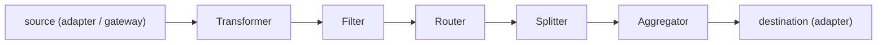

# Spring Integration

When data has to move *between* systems — read CSV files from an FTP drop, transform them, write JSON to RabbitMQ, route some messages to a database and others to an HTTP endpoint, with reliable retries and dead-letter handling — the code that wires it all together becomes a tangle of half-implemented patterns. **Enterprise Integration Patterns (EIPs)**, codified by Gregor Hohpe and Bobby Woolf in their 2003 book of the same name, gave a vocabulary for this: *channel*, *message*, *router*, *transformer*, *splitter*, *aggregator*, *gateway*, *adapter*. **Spring Integration** (2007 → present) is the Java framework that implements every EIP as a first-class Spring bean, lets you compose them via a Java DSL or XML, and provides production-grade adapters for ~30 protocols (file, FTP/SFTP, JMS, AMQP, HTTP, Kafka, MQTT, mail, …).

In 2026 Spring Integration occupies a specific niche. For *pure event streaming*, Kafka Streams (T22) or Spring Cloud Stream is the modern choice. For *workflow orchestration*, Camunda / Temporal. For *batch*, Spring Batch (T20). Spring Integration shines in **integration**: gluing systems together with messaging semantics, especially when you need EIP composition (a flow that splits, enriches, routes, aggregates, and dispatches), or when the application has many small protocol-bridge needs (poll a file directory, transform, push to AMQP, with retries and a dead-letter channel). The mental model — messages flowing through channels processed by EIP components — composes well, scales reasonably (in-JVM messaging is microseconds), and produces flows that read clearly.

The depth-bar this topic clears: at the **language layer**, the core EIP vocabulary as Spring beans (`MessageChannel`, `MessageHandler`, `Transformer`, `Filter`, `Router`, `Splitter`, `Aggregator`, `MessagingGateway`, `Adapter`), the Java DSL (`IntegrationFlow`, `IntegrationFlows.from(...)`), the polling vs event-driven dichotomy, error channels, and message stores. At the **memory layer**, the in-JVM `Message<T>` (~80 B header + payload), `DirectChannel` synchronous dispatch (no buffering, caller's thread), `QueueChannel` with bounded buffer, `ExecutorChannel` for offload, and the relative cost (~1 µs per channel hop synchronously; ~10 µs with executor). At the **architecture layer** — the heart — **the message flow** through a non-trivial integration, **why EIP composition reads clearly** (each component does one thing; the flow declares the topology), **when Spring Integration beats writing it by hand** (more than 3 EIP components in sequence; you want pluggable adapters), and the **decision matrix** vs Kafka Streams / Spring Cloud Stream / Camel / a hand-rolled pipeline.

> [!NOTE]
> Prerequisites: T01–T13. Particularly the bean lifecycle (T01), Spring Boot auto-configuration (T07), and Spring MVC (T10) for HTTP adapters.

## The EIP Vocabulary

Spring Integration's core types are direct ports of EIP concepts:

| EIP | Spring Integration | What it does |
|-----|--------------------|--------------|
| **Message** | `Message<T>` | payload + headers (correlation id, timestamp, custom) |
| **Channel** | `MessageChannel` | conduit between components |
| **Endpoint** | `MessageHandler` | does work on incoming messages |
| **Gateway** | `@MessagingGateway` | facade letting plain Java code send into the flow |
| **Adapter** | `Inbound`/`Outbound` adapter | bridge to external system (file, JMS, HTTP, ...) |
| **Service Activator** | `@ServiceActivator` | invokes a POJO method on each message |
| **Transformer** | `@Transformer` | converts message payload |
| **Filter** | `@Filter` | drops messages failing predicate |
| **Router** | `@Router` | chooses next channel based on message |
| **Splitter** | `@Splitter` | splits one message into many |
| **Aggregator** | `@Aggregator` | combines many messages into one |
| **Enricher** | `@Enricher` | adds data via lookup |



## A Minimal Flow — Java DSL

```xml
<dependency>
    <groupId>org.springframework.boot</groupId>
    <artifactId>spring-boot-starter-integration</artifactId>
</dependency>
```

```java
@Configuration
public class FileToAmqpFlow {

    @Bean
    public IntegrationFlow flow(AmqpTemplate amqp) {
        return IntegrationFlow
            .from(Files.inboundAdapter(new File("/data/incoming"))
                    .preventDuplicates(true)
                    .patternFilter("*.csv"),
                  e -> e.poller(Pollers.fixedDelay(5_000)))
            .transform(Files.toStringTransformer())
            .split(s -> s.delimiters("\n"))
            .filter((String line) -> !line.startsWith("#"))
            .transform(Transformers.fromJson(Order.class))
            .enrichHeaders(h -> h.header("priority", "normal"))
            .route(Order::type,
                m -> m.subFlowMapping("URGENT", sf -> sf.handle(Amqp.outboundAdapter(amqp).routingKey("orders.urgent")))
                       .subFlowMapping("STANDARD", sf -> sf.handle(Amqp.outboundAdapter(amqp).routingKey("orders.standard"))))
            .get();
    }
}
```

What this flow does:

1. Polls `/data/incoming` for `*.csv` files every 5 seconds. Each new file is a `Message<File>`.
2. Reads the file content (`Message<String>`).
3. Splits by newline into many messages, one per line.
4. Filters comment lines.
5. Parses each line as JSON into an `Order` object.
6. Adds a `priority` header.
7. Routes each `Order` to one of two AMQP queues based on its `type`.

Eight EIP components, ~20 lines of DSL. Hand-rolling this would be a 200-line tangle of file watchers, threads, and queue clients.

## Channels — The Conduits

Six channel types, picked by semantics:

| Channel | Sync? | Buffer? | Use |
|---------|:-----:|:-------:|-----|
| `DirectChannel` | yes | no | default; caller's thread runs the handler |
| `QueueChannel` | no | yes (bounded) | producer-consumer with polling consumer |
| `PublishSubscribeChannel` | yes (in dispatcher) | no | broadcast to multiple subscribers |
| `ExecutorChannel` | no | (executor's queue) | offload to a thread pool |
| `PriorityChannel` | no | yes (bounded) | prioritized polling |
| `RendezvousChannel` | yes | zero-cap blocking | hand-off |
| `NullChannel` | n/a | n/a | discard (useful for testing) |

Choose based on whether you want the producer to block, the work to happen on the producer's thread, multiple consumers to see each message, etc.

### Direct vs Executor

`DirectChannel`: synchronous. `channel.send(msg)` returns when the handler returns. Stack-like. Errors propagate up.

`ExecutorChannel`: asynchronous. `channel.send(msg)` submits to an executor and returns immediately. The handler runs on a pool thread. Errors propagate to the error channel (next).

For an HTTP request that triggers a long-running pipeline, an `ExecutorChannel` lets the HTTP thread return immediately while the pipeline runs.

## Polling vs Event-Driven Consumers

A handler attached to a channel reads either:

- **Event-driven** — `DirectChannel`, `PublishSubscribeChannel`, `ExecutorChannel` push messages to the handler. The handler is invoked the moment a message arrives.
- **Polling** — `QueueChannel`, `PriorityChannel`, file/JMS poller. The consumer wakes on a schedule (fixed delay, fixed rate, cron), checks for messages, processes any found.

```java
@Bean
public PollerSpec poller() {
    return Pollers.fixedDelay(5_000).maxMessagesPerPoll(100);
}
```

Polling is the model for adapters that observe external state — file directory, FTP listing, DB row count. Event-driven is for pure in-JVM messaging.

## Adapters — Bridges to Other Systems

Spring Integration ships ~30 adapters. Each has *inbound* (other → SI) and *outbound* (SI → other) variants:

| Adapter | What |
|---------|------|
| File | watch directory / write files |
| FTP / SFTP | poll remote dir / put remote |
| AMQP | RabbitMQ consume / produce |
| JMS | ActiveMQ / Artemis |
| HTTP | inbound gateway (controller) / outbound (client) |
| Kafka | consume / produce |
| MQTT | IoT-style pub/sub |
| Mail | POP3/IMAP / SMTP |
| Redis | pub/sub / queue |
| MongoDB | inbound cursor / outbound write |
| Twitter / RSS | (community) |
| Web Services | SOAP |
| Stream | stdin/stdout |

The adapter handles connection, retries, polling cadence, transformation between the external format and `Message<T>`.

### File Inbound Example

```java
.from(Files.inboundAdapter(new File("/in"))
        .preventDuplicates(true)
        .patternFilter("*.csv")
        .autoCreateDirectory(true),
     e -> e.poller(Pollers.fixedDelay(5_000)))
```

Reads new files in `/in`, every 5 s, filtered to `*.csv`, with deduplication. The DSL composes adapter config with the integration flow.

### JMS / AMQP Outbound

```java
.handle(Jms.outboundAdapter(connectionFactory).destination("orders"))

.handle(Amqp.outboundAdapter(amqpTemplate).exchangeName("orders").routingKey("urgent"))
```

The adapter publishes the message payload to the destination.

## Gateway — Plain Java Method as Flow Entry Point

A **messaging gateway** is a plain-Java interface that callers use; Spring Integration generates the implementation that injects the call into a flow:

```java
@MessagingGateway
public interface OrderGateway {
    @Gateway(requestChannel = "orderInputChannel")
    void submit(Order order);

    @Gateway(requestChannel = "orderInputChannel", replyChannel = "orderConfirmChannel")
    OrderConfirmation submitAndGet(Order order);
}
```

Inject `OrderGateway` into a regular service:

```java
@Service
public class OrderService {

    private final OrderGateway gateway;
    public OrderService(OrderGateway gateway) { this.gateway = gateway; }

    public OrderConfirmation place(Order o) {
        return gateway.submitAndGet(o);
    }
}
```

Calling `gateway.submit(o)` sends a message to `orderInputChannel`. The flow handles it. For `submitAndGet`, Spring Integration correlates the request and the reply, waits, and returns. Bidirectional: the Java caller sees ordinary method semantics; behind the scenes, an EIP flow runs.

## Common Patterns — Splitter / Aggregator / Router

### Splitter

```java
.split((Order order) -> order.items())   // List<OrderItem> → many messages
```

Or via `@Splitter`:

```java
@Component
public class OrderItemSplitter {
    @Splitter(inputChannel="ordersChannel", outputChannel="itemsChannel")
    public List<OrderItem> split(Order order) {
        return order.items();
    }
}
```

The framework wraps each returned element in its own `Message`, with a `sequenceNumber` and `correlationId` header so an aggregator downstream can recombine.

### Aggregator

```java
.aggregate(a -> a
    .correlationStrategy(m -> m.getHeaders().get("orderId"))
    .releaseStrategy(group -> group.size() == 3)
    .outputProcessor(group -> combine(group.getMessages())))
```

Collects messages by correlation id; releases when the release strategy says so. The classic "scatter-gather" pattern: split a request to 3 services, aggregate the 3 responses into one.

### Router

```java
.route((Order o) -> o.type(),    // returns a String → channel name
    m -> m
        .subFlowMapping("URGENT", sf -> sf.handle(urgentHandler))
        .subFlowMapping("STANDARD", sf -> sf.handle(standardHandler))
        .defaultOutputToParentFlow())
```

Or via `@Router`:

```java
@Router(inputChannel="ordersIn")
public String route(Order o) {
    return switch (o.type()) {
        case URGENT -> "urgentChannel";
        case STANDARD -> "standardChannel";
        default -> "defaultChannel";
    };
}
```

## Error Channels

Every flow has an implicit `errorChannel`. Exceptions thrown by handlers become `ErrorMessage`s sent there. Subscribe to handle:

```java
@ServiceActivator(inputChannel = "errorChannel")
public void handleError(ErrorMessage err) {
    Throwable t = err.getPayload();
    log.error("flow failed: {}", t.getMessage(), t);
    // alert, audit, dead-letter, ...
}
```

For per-flow custom error handling, set `errorChannel` on the gateway or specific endpoints:

```java
@MessagingGateway(defaultRequestChannel = "in", errorChannel = "ordersErrorChannel")
public interface OrderGateway { void submit(Order o); }
```

## Message Store — Persistent Aggregation

For aggregators / claim-check that need to survive restarts, plug in a `MessageStore` (JDBC / MongoDB / Redis):

```java
@Bean
public MessageStore messageStore(DataSource ds) {
    return new JdbcMessageStore(ds);
}

.aggregate(a -> a.messageStore(messageStore).correlationStrategy(...).releaseStrategy(...))
```

In-flight messages survive a JVM restart.

## Worked Example — IoT Telemetry Pipeline

```java
@Bean
public IntegrationFlow telemetryFlow(KafkaTemplate<String, Telemetry> kafka,
                                     MetricsService metrics) {
    return IntegrationFlow
        .from(Mqtt.inboundAdapter("tcp://broker:1883", "client-1", "sensors/+/data"))
        .transform(Transformers.fromJson(Telemetry.class))
        .filter((Telemetry t) -> t.temperature() < 200)   // drop sensor garbage
        .enrichHeaders(h -> h.headerFunction("region",
            (Message<?> m) -> ((Telemetry) m.getPayload()).deviceId().substring(0, 2)))
        .route(Telemetry::priority,
            r -> r.subFlowMapping("HIGH", sf -> sf.handle(m -> metrics.alert(m)))
                  .subFlowMapping("NORMAL", sf -> sf.handle(Kafka.outboundChannelAdapter(kafka).topicExpression("'telemetry-' + headers.region"))))
        .get();
}
```

End to end: MQTT in → JSON parse → filter bad sensors → enrich with region header → route by priority → either alert or Kafka. ~15 lines of DSL, fully testable in isolation (replace adapters with test channels).

## When To Use Spring Integration In 2026

| Need | Spring Integration | Modern alternative |
|------|---------------------|--------------------|
| EIP composition (splitter / aggregator / router chains) | strong | hand-rolled or Apache Camel |
| File / FTP / SFTP polling + transform | strong | hand-rolled (less elegant) |
| Pure event streaming over Kafka | reasonable | **Kafka Streams / Spring Cloud Stream** |
| HTTP + transform + queue glue | strong | **Spring MVC + manual queue client** |
| Long-running stateful workflows | weak | **Camunda / Temporal** |
| Massive parallelism with backpressure | weak | **WebFlux / Reactor / Kafka Streams** |
| Plain async-method offload | overkill | `@Async` |

Spring Integration's footprint is small (~5 MB), its concepts compose well, and its adapter catalog is mature. But for *event streaming at scale*, modern Kafka tools are better. The mature use case in 2026: **integration in the strict sense** — gluing N protocols and M transformations with reliable retries — within a moderate-throughput service.

## Common Pitfalls

> [!WARNING]
> **DirectChannel for slow handlers blocks the producer.** A slow service activator on a DirectChannel blocks the caller's thread. Switch to `ExecutorChannel` for offload.

> [!WARNING]
> **Aggregator without release strategy.** Messages accumulate forever; the store grows unbounded. Always set `releaseStrategy` and `groupTimeout` for time-bounded release.

> [!WARNING]
> **In-memory aggregator across restarts.** Default `MessageStore` is in-memory. Restart loses in-flight aggregates. Use JDBC / Mongo / Redis store for persistence.

> [!WARNING]
> **Error channel not subscribed.** Default behavior logs only. Subscribe to `errorChannel` and route to dead-letter, alerting, or recovery.

> [!WARNING]
> **MQTT / file pollers without idempotency.** Restart re-polls; duplicates flow. Deduplicate with a `IdempotentReceiver` + metadata store.

> [!WARNING]
> **Misusing for high-throughput streaming.** Spring Integration's per-message overhead (~1 µs in-JVM; more across adapters) makes Kafka Streams the right choice for millions-of-messages-per-second.

> [!WARNING]
> **DSL methods that look like POJO method references but require `@Transformer` annotation.** Mixing styles confuses Spring Integration's startup. Pick DSL or annotation style per flow.

## Practice

1. Build a flow that polls a directory, parses CSV lines, validates each, writes to a database. Use the Java DSL.
2. Add an error channel that logs failures and writes the bad payloads to a dead-letter file.
3. Convert one of the channels to an `ExecutorChannel`. Observe that processing happens on a pool thread, not the caller's.
4. Build a scatter-gather: a `MessagingGateway` invokes a flow that splits to 3 sub-flows (parallel) and aggregates 3 responses into one.
5. Use the AMQP outbound adapter to publish to RabbitMQ. Verify messages arrive.
6. Subscribe a flow to a Kafka topic via the Kafka inbound adapter. Process and write to another topic.
7. Add a `MessageStore` backed by JDBC for an aggregator. Kill the JVM mid-aggregation; restart; verify partial groups continue.
8. Compare a Spring Integration flow with the same logic hand-written. Which is more readable? Which is more testable?

## Recap

You should now be able to:

- Map EIP vocabulary (Message, Channel, Gateway, Adapter, Filter, Transformer, Router, Splitter, Aggregator, Enricher) to Spring Integration components.
- Build flows in the Java DSL: `IntegrationFlow.from(...).transform(...).filter(...).route(...).handle(...).get()`.
- Choose channel types (`DirectChannel`, `QueueChannel`, `PublishSubscribeChannel`, `ExecutorChannel`, `PriorityChannel`) based on sync/async, broadcast, offload needs.
- Pick between polling consumers (`Pollers.fixedDelay(...)`) and event-driven consumers, and configure poller cadence appropriately.
- Use adapters (File, FTP, JMS, AMQP, HTTP, Kafka, MQTT, Mail, …) for inbound/outbound bridging.
- Implement common patterns: scatter-gather (split → parallel → aggregate), content-based routing, claim-check.
- Use messaging gateways (`@MessagingGateway`) so plain Java code can enter and exit flows naturally.
- Subscribe to error channels for centralized failure handling; persist in-flight state via `MessageStore` for survivability.
- Decide between Spring Integration and Kafka Streams / Camel / hand-rolled based on the use case (EIP composition / glue → SI; streaming at scale → Kafka).
- Avoid the common pitfalls: slow handlers on DirectChannel, unbounded aggregators, in-memory state across restarts, no error subscription, idempotency for pollers.

## Next

Continue to [Spring for Kafka / AMQP](./T22-spring-for-kafka-amqp.md) for the deep treatment of `spring-kafka` and `spring-amqp` — the Boot-friendly listeners, producers, retry, dead-letter queues, transactional outbox, and the patterns for reliable messaging at scale.
