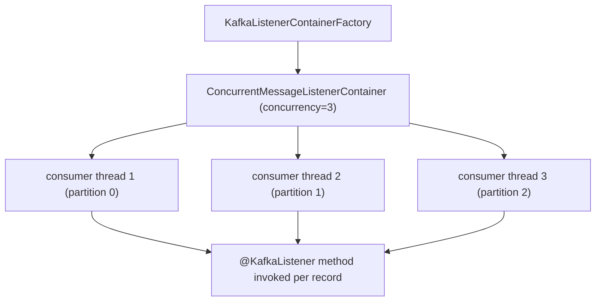

# Spring for Kafka / AMQP

Asynchronous messaging is the spine of every modern backend. Two protocol families dominate: **Kafka** for high-throughput, durable, replayable event streaming (log-structured topics, partition-based parallelism, exactly-once semantics with transactions); **AMQP** (RabbitMQ being the canonical implementation) for low-latency, flexible routing (direct/topic/fanout/headers exchanges, per-message routing keys, point-to-point queues, classic broker semantics). The Spring projects **spring-kafka** and **spring-amqp** turn each into idiomatic Spring code — annotation-driven listeners, template-based producers, transactional integration, retry + dead-letter patterns, micrometer metrics, auto-configured serializers.

This topic covers both. The structures are similar (Listener + Container + Template + Properties); the protocols are different (replay vs route, partition vs queue, offset vs ack). A senior engineer needs both because real systems use both — Kafka for event ingestion and inter-service event publishing, RabbitMQ for short-lived task queues with rich routing.

The depth-bar this topic clears: at the **language layer**, `@KafkaListener`, `@RabbitListener`, the templates, error handlers, retry topics, dead-letter routing, transactional producers and consumers. At the **memory layer**, the **consumer container** thread model — `ConcurrentMessageListenerContainer` spins up N consumer threads (= partition count usually), each holding a `KafkaConsumer` and a `MessageListenerContainer`; ~1 MB of memory per thread for the consumer's record buffer plus offsets cache. For RabbitMQ, the `SimpleMessageListenerContainer` similarly holds N consumer threads tied to a single connection. At the **architecture layer** — the heart — **offset semantics and exactly-once** (Kafka transactional producer + consumer config that gives end-to-end exactly-once), **ack modes** (when to auto-commit vs manual-ack), **the dead-letter pattern** done correctly with Spring Kafka's retry topics and Spring AMQP's dead-letter exchanges, and the **transactional outbox** as the standard pattern for atomic "DB write + event publish."

> [!NOTE]
> Prerequisites: T01–T19. Particularly Spring Boot auto-configuration (T07), Spring AOP (T05) for transactional listeners, Resilience4j (T19) for retry composition, and basic Kafka / AMQP concepts (covered in C07).

## Spring for Kafka — The Basics

```xml
<dependency>
    <groupId>org.springframework.kafka</groupId>
    <artifactId>spring-kafka</artifactId>
</dependency>
```

Boot's `KafkaAutoConfiguration` wires the producer + consumer factories from `spring.kafka.*` properties.

```yaml
spring:
  kafka:
    bootstrap-servers: kafka:9092
    consumer:
      group-id: orders-service
      auto-offset-reset: earliest
      key-deserializer: org.apache.kafka.common.serialization.StringDeserializer
      value-deserializer: org.springframework.kafka.support.serializer.JsonDeserializer
      properties:
        spring.json.trusted.packages: "com.example.events"
    producer:
      key-serializer: org.apache.kafka.common.serialization.StringSerializer
      value-serializer: org.springframework.kafka.support.serializer.JsonSerializer
      acks: all
      enable.idempotence: true
```

### Producing

```java
@Service
public class OrderEventsPublisher {

    private final KafkaTemplate<String, OrderPlaced> template;
    public OrderEventsPublisher(KafkaTemplate<String, OrderPlaced> template) { this.template = template; }

    public void publish(OrderPlaced event) {
        template.send("orders.placed", event.orderId(), event);
    }

    public void publishAsync(OrderPlaced event) {
        template.send("orders.placed", event.orderId(), event)
            .whenComplete((res, err) -> {
                if (err != null) log.error("publish failed", err);
                else log.info("sent to {}", res.getRecordMetadata());
            });
    }
}
```

`KafkaTemplate.send(...)` returns a `CompletableFuture<SendResult<K, V>>`. `.get()` blocks until ack; `.whenComplete(...)` registers a callback.

### Consuming

```java
@Component
public class OrderEventsListener {

    @KafkaListener(topics = "orders.placed", groupId = "orders-service")
    public void handle(OrderPlaced event,
                       @Header(KafkaHeaders.RECEIVED_KEY) String key,
                       @Header(KafkaHeaders.RECEIVED_PARTITION) int partition,
                       @Header(KafkaHeaders.OFFSET) long offset) {
        log.info("got {} from key={}, partition={}, offset={}", event, key, partition, offset);
        orderService.process(event);
    }
}
```

Behind the scenes, `@EnableKafka` (auto-applied) creates a `KafkaListenerContainerFactory` and a `ConcurrentMessageListenerContainer` per `@KafkaListener` annotation. The container starts N consumer threads (`concurrency=N`, defaults to 1), each polling Kafka, deserializing, and invoking the handler.



### Concurrency and Partitions

A consumer group divides a topic's partitions among its consumers. With 8 partitions and 3 listener threads, two threads get 3 partitions each and one gets 2. With more threads than partitions, the excess threads sit idle. **Scale by adding partitions; tune `concurrency` to match.**

```java
@KafkaListener(topics = "orders.placed", concurrency = "8")
public void handle(OrderPlaced event) { ... }
```

For a single-partition topic, no parallelism — one thread does all the work.

### Acknowledgment Modes

By default Kafka's `enable.auto.commit=false` (Spring's default) and Spring commits offsets after handling. The exact moment is controlled by `ack-mode`:

| Mode | When the offset is committed |
|------|------------------------------|
| `RECORD` | after each record's handler returns |
| `BATCH` (default) | after the poll batch is processed |
| `TIME` | after `ackTime` ms |
| `COUNT` | every N records |
| `COUNT_TIME` | whichever first |
| `MANUAL` | when listener calls `Acknowledgment.acknowledge()` |
| `MANUAL_IMMEDIATE` | same, but commit is immediate (not batched) |

For at-most-once delivery (commit before processing — never duplicate; can lose), use `RECORD`. For at-least-once (commit after — never lose; may duplicate), use `BATCH` or `RECORD`. For full control, `MANUAL`:

```java
@KafkaListener(topics = "orders.placed")
public void handle(OrderPlaced event, Acknowledgment ack) {
    try {
        orderService.process(event);
        ack.acknowledge();
    } catch (Exception e) {
        // do not ack; the message will be re-delivered on next poll
        throw e;
    }
}
```

### Error Handling and Retry

`DefaultErrorHandler` (Spring Kafka 2.8+) wraps every listener. On failure it:

1. Re-attempts according to the back-off policy (default `FixedBackOff(0L, 9L)` = 10 attempts, no delay).
2. After exhausting retries, calls a `recoverer` (default: logs; configure `DeadLetterPublishingRecoverer` to send to DLT).

Configure:

```java
@Bean
public DefaultErrorHandler errorHandler(KafkaTemplate<?, ?> template) {
    DeadLetterPublishingRecoverer recoverer = new DeadLetterPublishingRecoverer(template,
        (record, ex) -> new TopicPartition(record.topic() + ".DLT", record.partition()));
    DefaultErrorHandler handler = new DefaultErrorHandler(recoverer,
        new ExponentialBackOff(1_000L, 2.0));  // 1s, 2s, 4s, 8s, ...
    handler.addNotRetryableExceptions(MalformedEventException.class);
    return handler;
}
```

Now failures retry with exponential backoff; non-retryable exceptions go straight to the DLT; eventually-failed records land in `<topic>.DLT`.

### Retry Topics (Cleaner Pattern)

Spring Kafka 2.7+ ships a **retry-topics** pattern: messages that fail are republished to a separate retry topic with an embedded delay, then picked up later by a retry listener. Avoids blocking the original partition while retrying.

```java
@RetryableTopic(
    attempts = "5",
    backoff = @Backoff(delay = 1_000, multiplier = 2.0),
    dltStrategy = DltStrategy.FAIL_ON_ERROR,
    autoCreateTopics = "true")
@KafkaListener(topics = "orders.placed")
public void handle(OrderPlaced event) { orderService.process(event); }

@DltHandler
public void handleDlt(OrderPlaced event, @Header(KafkaHeaders.EXCEPTION_MESSAGE) String reason) {
    log.error("DLT: {} due to {}", event, reason);
    alertService.notify(event);
}
```

Spring creates the topics `orders.placed-retry-0`, `orders.placed-retry-1`, …, `orders.placed-dlt`. Each retry topic has its own listener with a delay equal to the backoff. Original partition is never blocked.


### Kafka Transactions — Exactly-Once

Kafka transactions let a producer and consumer participate in one atomic transaction: the consumer commits offsets and the producer publishes messages, atomically. Either both happen or neither. With `read_committed` isolation, downstream consumers only see committed messages.

```yaml
spring:
  kafka:
    producer:
      transaction-id-prefix: tx-orders-
      acks: all
      enable.idempotence: true
    consumer:
      isolation-level: read_committed
```

```java
@Service
@Transactional("kafkaTransactionManager")
public class OrderProcessor {

    private final KafkaTemplate<String, OrderEnriched> template;

    @KafkaListener(topics = "orders.placed")
    public void process(OrderPlaced placed) {
        OrderEnriched enriched = enrich(placed);
        template.send("orders.enriched", placed.orderId(), enriched);
        // commit happens at method end: consumer offset + outbound message together
    }
}
```

Caveats:

- Performance: transactions add ~5-10% latency; throughput drops ~20%.
- The transactional-id must be stable per *producer instance* (each pod needs a unique prefix or the broker confuses transactions).
- Multi-broker resource transactions (Kafka + JDBC) need a `ChainedKafkaTransactionManager`; this is brittle. Prefer **transactional outbox** (next).

### Transactional Outbox — The Standard Pattern

The robust pattern for "save to DB + publish event, atomically":

1. In a DB transaction, INSERT into an `outbox` table and your domain table.
2. Commit the DB transaction.
3. A **separate** poller (or CDC like Debezium, T06 of C03) reads `outbox`, publishes to Kafka, marks rows as published.

```java
@Service
@Transactional
public class OrderService {

    private final OrderRepository orders;
    private final OutboxRepository outbox;

    public OrderService(OrderRepository orders, OutboxRepository outbox) {
        this.orders = orders;
        this.outbox = outbox;
    }

    public Order place(PlaceOrderRequest req) {
        Order o = orders.save(new Order(req));
        outbox.save(new OutboxEvent("ORDER_PLACED", o.id(), serialize(new OrderPlaced(o))));
        return o;
    }
}
```

Outbox poller (separate from the request thread):

```java
@Component
public class OutboxPoller {

    @Scheduled(fixedDelay = 500)
    public void publishPending() {
        outboxRepo.findUnpublishedTop(100).forEach(e -> {
            template.send(topicFor(e.type()), e.aggregateId(), e.payload());
            outboxRepo.markPublished(e.id());
        });
    }
}
```

This is **at-least-once** publishing (a poll-and-publish failure might retry). Consumers must be idempotent (T03 idempotency in APIs / C07 messaging).

CDC variants (Debezium streams the `outbox` table directly to Kafka) avoid the poller. Either way, the *transactional unit* is just the DB; no XA, no Kafka transactions, no chained managers.

## Spring AMQP — RabbitMQ

```xml
<dependency>
    <groupId>org.springframework.boot</groupId>
    <artifactId>spring-boot-starter-amqp</artifactId>
</dependency>
```

```yaml
spring:
  rabbitmq:
    host: rabbit
    port: 5672
    username: app
    password: ${MQ_PASS}
    listener:
      simple:
        acknowledge-mode: manual
        concurrency: 4
        max-concurrency: 16
        prefetch: 50
```

### Producing

```java
@Service
public class NotificationPublisher {

    private final RabbitTemplate rabbit;
    public NotificationPublisher(RabbitTemplate rabbit) { this.rabbit = rabbit; }

    public void send(Notification n) {
        rabbit.convertAndSend("notifications", n.routingKey(), n);
    }
}
```

`convertAndSend(exchange, routingKey, payload)` uses the configured `MessageConverter` (Jackson by default with `Jackson2JsonMessageConverter`).

### Consuming

```java
@Component
public class NotificationListener {

    @RabbitListener(queues = "notifications.urgent", containerFactory = "rabbitListenerContainerFactory")
    public void onUrgent(Notification n,
                         Channel channel,
                         @Header(AmqpHeaders.DELIVERY_TAG) long tag) throws IOException {
        try {
            urgentService.handle(n);
            channel.basicAck(tag, false);
        } catch (Exception e) {
            channel.basicNack(tag, false, false);   // false=don't requeue → goes to DLX
        }
    }
}
```

`basicAck` acknowledges; `basicNack` rejects. With `requeue=false`, the message goes to the queue's dead-letter exchange (DLX) if configured. Manual ack mode is the safe default — explicit control over success and failure semantics.

### Queue / Exchange / Binding Topology

Declared in code:

```java
@Configuration
public class RabbitTopology {

    @Bean public TopicExchange notificationsExchange() {
        return new TopicExchange("notifications", true, false);
    }

    @Bean public Queue urgentQueue() {
        return QueueBuilder.durable("notifications.urgent")
            .withArgument("x-dead-letter-exchange", "notifications.dlx")
            .withArgument("x-message-ttl", 60_000)  // expire after 60s if unconsumed
            .build();
    }

    @Bean public Binding urgentBinding(TopicExchange ex, Queue urgentQueue) {
        return BindingBuilder.bind(urgentQueue).to(ex).with("notifications.urgent.#");
    }

    @Bean public DirectExchange dlx() {
        return new DirectExchange("notifications.dlx", true, false);
    }

    @Bean public Queue dlq() {
        return QueueBuilder.durable("notifications.dlq").build();
    }

    @Bean public Binding dlqBinding(DirectExchange dlx, Queue dlq) {
        return BindingBuilder.bind(dlq).to(dlx).with("");
    }
}
```

Beans auto-declared at startup (via `RabbitAdmin`). Topology becomes part of the deployment artifact.

### Retry — Same Pattern as Kafka

```java
@Configuration
@EnableRabbit
public class RabbitListenerConfig {

    @Bean
    public RabbitListenerContainerFactory<?> rabbitListenerContainerFactory(
            ConnectionFactory cf, MessageConverter conv) {
        SimpleRabbitListenerContainerFactory f = new SimpleRabbitListenerContainerFactory();
        f.setConnectionFactory(cf);
        f.setMessageConverter(conv);
        f.setAcknowledgeMode(AcknowledgeMode.MANUAL);
        f.setConcurrentConsumers(4);
        f.setMaxConcurrentConsumers(16);
        f.setAdviceChain(retryInterceptor());
        return f;
    }

    @Bean
    public RetryOperationsInterceptor retryInterceptor() {
        return RetryInterceptorBuilder.stateless()
            .maxAttempts(5)
            .backOffOptions(1_000, 2.0, 10_000)   // initial, multiplier, max
            .recoverer(new RejectAndDontRequeueRecoverer())
            .build();
    }
}
```

`RejectAndDontRequeueRecoverer` nacks failed messages without requeueing; they go to the DLX (configured on the queue). The DLQ then catches and you handle the dead-letter.

### AMQP Transactions

`spring-amqp` supports transactional channels (`channelTransacted = true`) but Rabbit transactions are slow (each commit forces an fsync). For most use cases, **publisher confirms** + **publisher returns** + manual ack on consume gives strong enough guarantees with much better throughput:

```yaml
spring:
  rabbitmq:
    publisher-confirm-type: correlated
    publisher-returns: true
```

```java
@Bean
public RabbitTemplate rabbitTemplate(ConnectionFactory cf) {
    RabbitTemplate t = new RabbitTemplate(cf);
    t.setConfirmCallback((cd, ack, cause) -> {
        if (!ack) log.warn("publish nacked: {}", cause);
    });
    t.setReturnsCallback(r -> log.warn("publish returned (unroutable): {}", r.getMessage()));
    t.setMandatory(true);
    return t;
}
```

Confirms tell you the broker received and persisted the message; returns tell you the broker couldn't route it (no matching queue). Combined, they give per-message visibility into the publish path.

## When To Use Kafka vs RabbitMQ

| Scenario | Kafka | RabbitMQ |
|----------|-------|----------|
| event sourcing / log of facts | ✅ | ❌ (no replay) |
| stream processing (joins, aggregations) | ✅ | ❌ |
| many consumers, replay history | ✅ | ❌ |
| millions of events / s | ✅ | depends |
| complex routing (topic / fanout / headers) | basic | ✅ |
| short-lived task queue with priority | ✅ (rough) | ✅ |
| per-message TTL, dead letters per queue | ❌ | ✅ |
| RPC-style reply queues | unusual | ✅ |
| message-level scheduling / delays | retry topics | ✅ (delayed plugin) |

Real systems often use both — Kafka for event streaming, RabbitMQ for short-lived work queues with rich routing.

## Observability

`spring-kafka` + Micrometer publishes:

- `spring.kafka.template` — producer send rate / latency
- `spring.kafka.listener` — consumer record rate / latency

`spring-amqp` + Micrometer publishes:

- `spring.rabbitmq.listener` — consumer rate / errors
- `rabbitmq.connections` — open connections

Configure tracing (T18) — every `KafkaTemplate.send` injects `traceparent` headers; listeners extract them and continue the trace.

## Common Pitfalls

> [!WARNING]
> **`enable.auto.commit=true` with retry.** Auto-commit happens on a timer (5s default); a record might be auto-committed *before* you finish processing. Use Spring's default (`enable.auto.commit=false`) and let Spring manage offsets per ack mode.

> [!WARNING]
> **Kafka concurrency > partitions.** Excess consumers idle. Match concurrency to partition count, or scale by adding partitions.

> [!WARNING]
> **Long-running listener blocking the consumer.** A 30-second handler causes `max.poll.interval.ms` (default 5 min) timeout → consumer is kicked from the group → rebalance. Either keep handlers fast (offload to executor) or raise `max.poll.interval.ms`.

> [!WARNING]
> **No DLT / DLQ configured.** Failed messages either retry forever or get silently lost. Always configure a dead-letter route and a process to inspect / replay it.

> [!WARNING]
> **Trusting deserialization of untrusted JSON.** `JsonDeserializer` without `trusted.packages` is a deserialization gadget chain risk. Lock down with `spring.json.trusted.packages: "com.example"`.

> [!WARNING]
> **Forgetting publisher confirms.** Without them, `send()` returns success when the message hits the *socket*, not when it's persisted. A broker crash between socket-receive and disk-write loses the message.

> [!WARNING]
> **Transactional outbox missing the "mark published" step.** Without it the poller re-publishes forever. Combined with idempotent consumers, this is OK; without idempotency, duplicates.

> [!WARNING]
> **AMQP `prefetch` too high.** One slow consumer can grab 1000 messages, hold them all, prevent others from consuming. Default `prefetch=250`; tune to your processing time.

> [!WARNING]
> **Mixing Kafka transactions and DB transactions without a chained manager.** Half-commit scenarios. Use transactional outbox instead.

## Practice

1. Build a Kafka producer + listener pair. Send 1000 messages; verify they're consumed in order per key.
2. Add a `DefaultErrorHandler` with `DeadLetterPublishingRecoverer`. Throw exceptions deliberately; verify failed records go to `.DLT`.
3. Use `@RetryableTopic` with exponential backoff. Confirm retry topics are created and used. Send a permanently-failing record; verify it lands in DLT.
4. Enable Kafka transactions. Make the listener both consume and produce. Verify atomic commit (kill the JVM mid-listener; confirm no duplicate output).
5. Build a transactional outbox: domain table + outbox table in one DB transaction, separate poller publishes to Kafka. Verify the atomic semantics.
6. With RabbitMQ, declare a topic exchange with three bound queues using different routing keys. Publish to each routing key; verify routing.
7. Add a DLX on each RabbitMQ queue. Nack a message with `requeue=false`; verify it lands in DLQ.
8. Compare Kafka transactions vs publisher confirms. Measure throughput and latency.

## Recap

You should now be able to:

- Configure Spring Kafka and Spring AMQP producers and consumers via Boot properties, declare topology via `@Configuration` beans.
- Send and receive messages with `KafkaTemplate` / `RabbitTemplate` and `@KafkaListener` / `@RabbitListener`.
- Choose Kafka ack modes (`RECORD` / `BATCH` / `TIME` / `MANUAL`) based on at-least-once vs at-most-once needs; use `Acknowledgment` for manual control.
- Configure retry — `DefaultErrorHandler` with backoff and `DeadLetterPublishingRecoverer`, or the cleaner `@RetryableTopic` pattern that uses delay queues to avoid blocking the original partition.
- Use Kafka transactions for exactly-once consume-process-produce within Kafka; understand the caveats (transactional id stability, throughput cost).
- Implement the transactional outbox pattern for atomic DB+message publishing without XA.
- Configure publisher confirms + returns + mandatory routing for AMQP, and explain why they substitute for Rabbit transactions in most cases.
- Declare AMQP exchange / queue / binding topology in code; configure DLX → DLQ routing.
- Tune concurrency: match Kafka listener concurrency to partition count; tune AMQP `prefetch` for fair work distribution.
- Wire Micrometer metrics + tracing for both Kafka and RabbitMQ.
- Choose between Kafka and RabbitMQ based on the semantic needs (event log + replay → Kafka; rich routing + queues + RPC → Rabbit).
- Avoid the common pitfalls: auto-commit with retry, long-running listeners blocking polls, missing DLT, untrusted deserialization, missing publisher confirms, AMQP prefetch too high.

## Next

Continue to [Spring Session](./T23-spring-session.md) for the pattern of externalizing HTTP session state — Redis-backed sessions, JDBC-backed sessions, the cookie / header session-strategy options, and the trade-offs vs JWT for stateful web applications.
